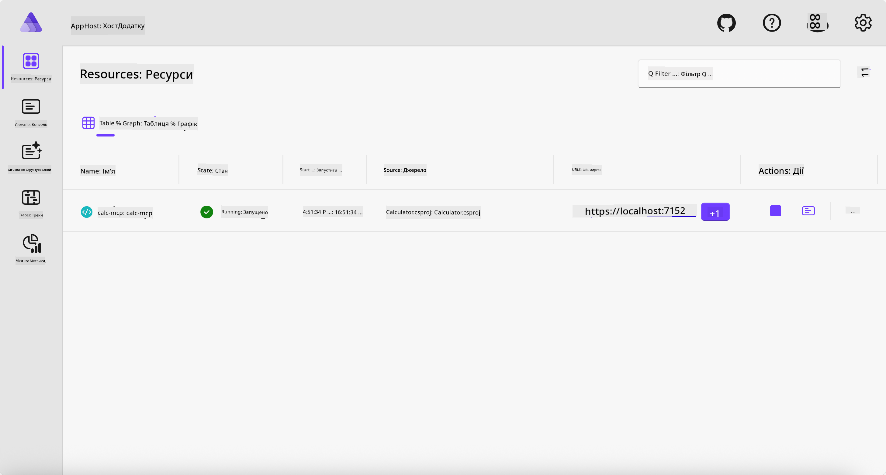
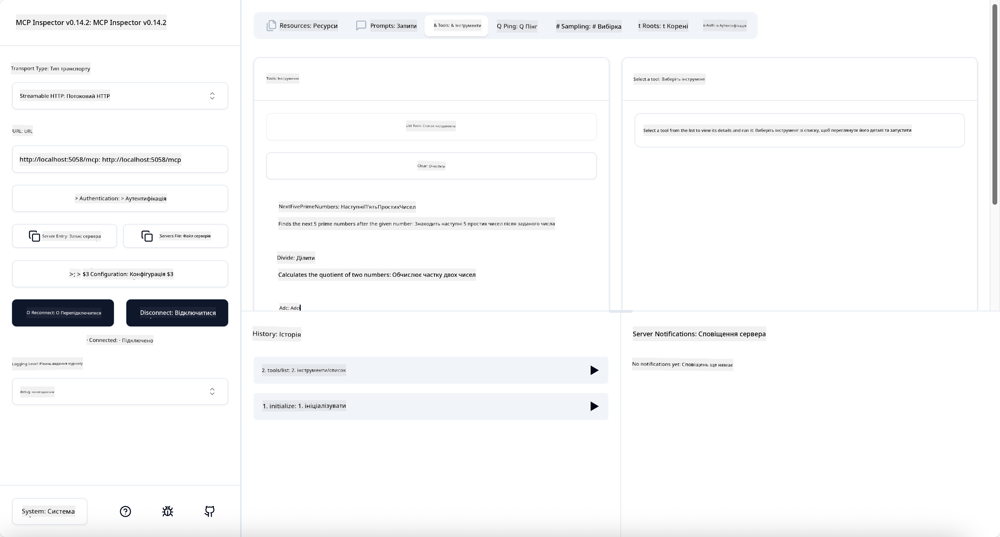
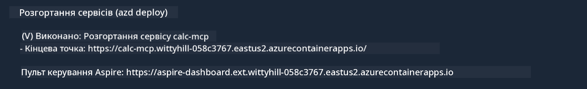

<!--
CO_OP_TRANSLATOR_METADATA:
{
  "original_hash": "0bc7bd48f55f1565f1d95ccb2c16f728",
  "translation_date": "2025-07-13T23:10:51+00:00",
  "source_file": "04-PracticalImplementation/samples/csharp/README.md",
  "language_code": "uk"
}
-->
# Приклад

Попередній приклад показує, як використовувати локальний .NET проект з типом `stdio`. А також як запустити сервер локально в контейнері. Це хороше рішення в багатьох випадках. Проте іноді корисно мати сервер, що працює віддалено, наприклад, у хмарному середовищі. Саме тут на допомогу приходить тип `http`.

Розглядаючи рішення у папці `04-PracticalImplementation`, воно може здатися значно складнішим за попереднє. Але насправді це не так. Якщо придивитися до проекту `src/Calculator`, ви побачите, що це здебільшого той самий код, що й у попередньому прикладі. Єдина відмінність у тому, що ми використовуємо іншу бібліотеку `ModelContextProtocol.AspNetCore` для обробки HTTP-запитів. І ми змінюємо метод `IsPrime`, роблячи його приватним, щоб показати, що у вашому коді можуть бути приватні методи. Решта коду залишається такою ж, як і раніше.

Інші проекти походять з [.NET Aspire](https://learn.microsoft.com/dotnet/aspire/get-started/aspire-overview). Наявність .NET Aspire у рішенні покращує досвід розробника під час розробки та тестування, а також допомагає з моніторингом. Для запуску сервера це не обов’язково, але це хороша практика мати його у вашому рішенні.

## Запуск сервера локально

1. У VS Code (з розширенням C# DevKit) перейдіть у директорію `04-PracticalImplementation/samples/csharp`.
1. Виконайте наступну команду, щоб запустити сервер:

   ```bash
    dotnet watch run --project ./src/AppHost
   ```

1. Коли у веб-браузері відкриється панель керування .NET Aspire, зверніть увагу на URL з типом `http`. Він має виглядати приблизно так: `http://localhost:5058/`.

   

## Тестування Streamable HTTP за допомогою MCP Inspector

Якщо у вас встановлено Node.js версії 22.7.5 або вище, ви можете використати MCP Inspector для тестування вашого сервера.

Запустіть сервер і виконайте наступну команду у терміналі:

```bash
npx @modelcontextprotocol/inspector http://localhost:5058
```



- Виберіть `Streamable HTTP` як тип транспорту.
- У полі Url введіть URL сервера, який ви зазначили раніше, додавши `/mcp`. Це має бути `http` (не `https`), наприклад `http://localhost:5058/mcp`.
- Натисніть кнопку Connect.

Перевага Inspector у тому, що він дає гарний огляд того, що відбувається.

- Спробуйте вивести список доступних інструментів
- Спробуйте деякі з них, вони мають працювати так само, як і раніше.

## Тестування MCP Server з GitHub Copilot Chat у VS Code

Щоб використовувати транспорт Streamable HTTP з GitHub Copilot Chat, змініть конфігурацію сервера `calc-mcp`, створеного раніше, так, щоб вона виглядала ось так:

```jsonc
// .vscode/mcp.json
{
  "servers": {
    "calc-mcp": {
      "type": "http",
      "url": "http://localhost:5058/mcp"
    }
  }
}
```

Зробіть кілька тестів:

- Запитайте "3 простих числа після 6780". Зверніть увагу, як Copilot використає нові інструменти `NextFivePrimeNumbers` і поверне лише перші 3 простих числа.
- Запитайте "7 простих чисел після 111", щоб побачити, що станеться.
- Запитайте "У Джона є 24 льодяники, і він хоче розподілити їх порівну між своїми 3 дітьми. Скільки льодяників отримає кожна дитина?", щоб побачити результат.

## Розгортання сервера в Azure

Давайте розгорнемо сервер в Azure, щоб більше людей могло ним користуватися.

У терміналі перейдіть у папку `04-PracticalImplementation/samples/csharp` і виконайте наступну команду:

```bash
azd up
```

Після завершення розгортання ви побачите повідомлення на кшталт цього:



Скопіюйте URL і використайте його в MCP Inspector та GitHub Copilot Chat.

```jsonc
// .vscode/mcp.json
{
  "servers": {
    "calc-mcp": {
      "type": "http",
      "url": "https://calc-mcp.gentleriver-3977fbcf.australiaeast.azurecontainerapps.io/mcp"
    }
  }
}
```

## Що далі?

Ми спробували різні типи транспорту та інструменти для тестування. Також розгорнули ваш MCP сервер в Azure. Але що, якщо наш сервер повинен мати доступ до приватних ресурсів? Наприклад, бази даних або приватного API? У наступній главі ми розглянемо, як покращити безпеку нашого сервера.

**Відмова від відповідальності**:  
Цей документ було перекладено за допомогою сервісу автоматичного перекладу [Co-op Translator](https://github.com/Azure/co-op-translator). Хоча ми прагнемо до точності, будь ласка, майте на увазі, що автоматичні переклади можуть містити помилки або неточності. Оригінальний документ рідною мовою слід вважати авторитетним джерелом. Для критично важливої інформації рекомендується звертатися до професійного людського перекладу. Ми не несемо відповідальності за будь-які непорозуміння або неправильні тлумачення, що виникли внаслідок використання цього перекладу.