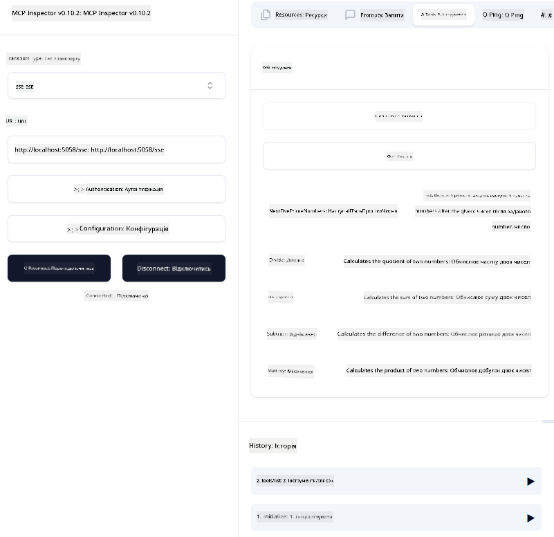
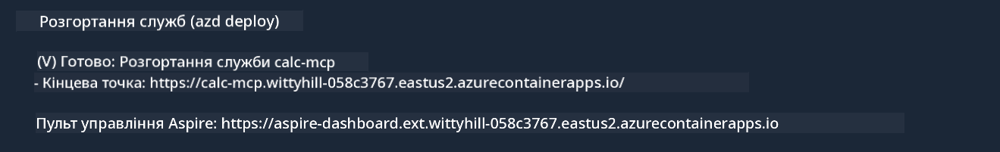

<!--
CO_OP_TRANSLATOR_METADATA:
{
  "original_hash": "5020a3e1a1c7f30c00f9e37f1fa208e3",
  "translation_date": "2025-06-17T17:06:16+00:00",
  "source_file": "04-PracticalImplementation/samples/csharp/README.md",
  "language_code": "uk"
}
-->
# Приклад

Попередній приклад показує, як використовувати локальний .NET проект з типом `sdio`. А також як запустити сервер локально в контейнері. Це хороше рішення в багатьох випадках. Однак іноді корисно мати сервер, що працює віддалено, наприклад, у хмарному середовищі. Саме тут і застосовується тип `http`.

Якщо подивитися на рішення у папці `04-PracticalImplementation`, воно може здатися набагато складнішим, ніж попереднє. Але насправді це не так. Якщо придивитися до проекту `src/mcpserver/mcpserver.csproj`, ви побачите, що це переважно той самий код, що й у попередньому прикладі. Єдина різниця в тому, що ми використовуємо іншу бібліотеку `ModelContextProtocol.AspNetCore` для обробки HTTP-запитів. І ми змінюємо метод `IsPrime`, роблячи його приватним, щоб показати, що у вашому коді можуть бути приватні методи. Решта коду залишилася такою ж, як і раніше.

Інші проекти походять з [.NET Aspire](https://learn.microsoft.com/dotnet/aspire/get-started/aspire-overview). Наявність .NET Aspire у рішенні покращить досвід розробника під час розробки та тестування, а також допоможе з моніторингом. Для запуску сервера це не обов’язково, але хороша практика мати його у вашому рішенні.

## Запуск сервера локально

1. У VS Code (з розширенням C# DevKit) відкрийте рішення `04-PracticalImplementation\samples\csharp\src\Calculator-chap4.sln`.
2. Натисніть `F5`, щоб запустити сервер. Він повинен відкрити веб-браузер з панеллю управління .NET Aspire.

або

1. У терміналі перейдіть до папки `04-PracticalImplementation\samples\csharp\src`
2. Виконайте команду для запуску сервера:
   ```bash
    dotnet run --project .\AppHost
   ```

3. На панелі управління зверніть увагу на URL `http`. Він має виглядати приблизно як `http://localhost:5058/`.

## Test `SSE` з ModelContext Protocol Inspector

Якщо у вас встановлено Node.js версії 22.7.5 і вище, ви можете використати ModelContext Protocol Inspector для тестування сервера.

Запустіть сервер і виконайте у терміналі таку команду:

```bash
npx @modelcontextprotocol/inspector@latest
```



- Виберіть `SSE` as the Transport type. SSE stand for Server-Sent Events. 
- In the Url field, enter the URL of the server noted earlier,and append `/sse`. Це має бути `http` (а не `https`) something like `http://localhost:5058/sse`.
- select the Connect button.

A nice thing about the Inspector is that it provide a nice visibility on what is happening.

- Try listing the availables tools
- Try some of them, it should works just like before.


## Test `SSE` with Github Copilot Chat in VS Code

To use the `SSE` transport with Github Copilot Chat, change the configuration of the `mcp-calc`), сервер, створений раніше, виглядатиме так:

```json
"mcp-calc": {
    "type": "sse",
    "url": "http://localhost:5058/sse"
}
```

Зробіть кілька тестів:
- Запитайте 3 простих числа після 6780. Зверніть увагу, що Copilot використає нові інструменти `NextFivePrimeNumbers` і поверне лише перші 3 простих числа.
- Запитайте 7 простих чисел після 111, щоб побачити, що станеться.


# Розгортання сервера в Azure

Давайте розгорнемо сервер в Azure, щоб більше людей могло ним користуватися.

У терміналі перейдіть до папки `04-PracticalImplementation\samples\csharp\src` і виконайте команду:

```bash
azd init
```

Це створить кілька локальних файлів для збереження конфігурації ресурсів Azure та вашої інфраструктури як коду (IaC).

Потім виконайте команду для розгортання сервера в Azure:

```bash
azd up
```

Після завершення розгортання ви побачите повідомлення на кшталт цього:



Перейдіть на панель управління Aspire і зверніть увагу на `HTTP` URL, який можна використати у MCP Inspector і в Github Copilot Chat.


## Що далі?

Ми спробували різні типи транспорту, інструменти для тестування, а також розгорнули MCP сервер в Azure. Але що, якщо наш сервер має отримувати доступ до приватних ресурсів? Наприклад, до бази даних або приватного API? У наступній главі ми розглянемо, як покращити безпеку нашого сервера.

**Відмова від відповідальності**:  
Цей документ було перекладено за допомогою сервісу автоматичного перекладу [Co-op Translator](https://github.com/Azure/co-op-translator). Хоча ми прагнемо до точності, просимо враховувати, що автоматичні переклади можуть містити помилки або неточності. Оригінальний документ рідною мовою слід вважати авторитетним джерелом. Для критично важливої інформації рекомендується звертатися до професійного людського перекладу. Ми не несемо відповідальності за будь-які непорозуміння або неправильні тлумачення, що виникли внаслідок використання цього перекладу.