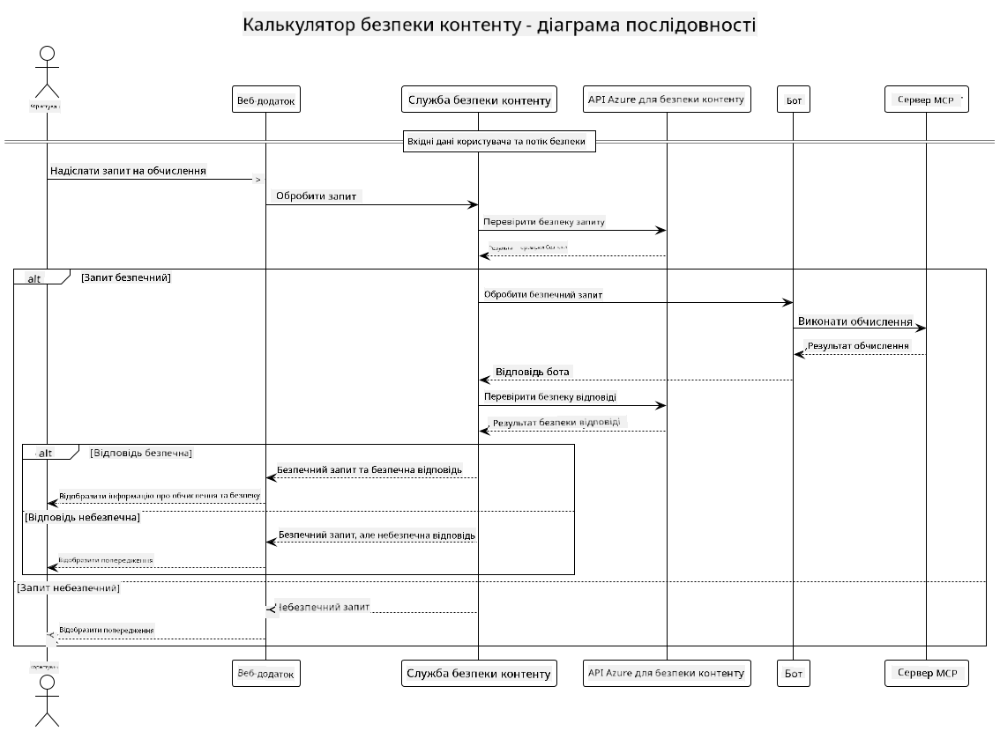

<!--
CO_OP_TRANSLATOR_METADATA:
{
  "original_hash": "e5ea5e7582f70008ea9bec3b3820f20a",
  "translation_date": "2025-07-13T23:21:27+00:00",
  "source_file": "04-PracticalImplementation/samples/java/containerapp/README.md",
  "language_code": "uk"
}
-->
## Архітектура системи

Цей проєкт демонструє веб-додаток, який використовує перевірку безпеки контенту перед передачею запитів користувача до сервісу калькулятора через Model Context Protocol (MCP).



### Як це працює

1. **Введення користувача**: Користувач вводить запит на обчислення у веб-інтерфейсі  
2. **Перевірка безпеки контенту (вхідні дані)**: Запит аналізується за допомогою Azure Content Safety API  
3. **Рішення щодо безпеки (вхідні дані)**:  
   - Якщо контент безпечний (рівень серйозності < 2 у всіх категоріях), він передається до калькулятора  
   - Якщо контент позначено як потенційно шкідливий, процес зупиняється і повертається попередження  
4. **Інтеграція калькулятора**: Безпечний контент обробляється LangChain4j, який взаємодіє з MCP сервером калькулятора  
5. **Перевірка безпеки контенту (вихідні дані)**: Відповідь бота аналізується Azure Content Safety API  
6. **Рішення щодо безпеки (вихідні дані)**:  
   - Якщо відповідь бота безпечна, вона відображається користувачу  
   - Якщо відповідь бота позначена як потенційно шкідлива, її замінюють на попередження  
7. **Відповідь**: Результати (якщо безпечні) відображаються користувачу разом з обома аналізами безпеки

## Використання Model Context Protocol (MCP) з калькуляторними сервісами

Цей проєкт демонструє, як використовувати Model Context Protocol (MCP) для виклику калькуляторних MCP сервісів з LangChain4j. Реалізація використовує локальний MCP сервер, що працює на порту 8080, для надання операцій калькулятора.

### Налаштування служби Azure Content Safety

Перед використанням функцій безпеки контенту потрібно створити ресурс служби Azure Content Safety:

1. Увійдіть у [Azure Portal](https://portal.azure.com)  
2. Натисніть "Create a resource" і знайдіть "Content Safety"  
3. Виберіть "Content Safety" і натисніть "Create"  
4. Введіть унікальне ім’я для вашого ресурсу  
5. Виберіть підписку та групу ресурсів (або створіть нову)  
6. Оберіть підтримуваний регіон (перевірте [Region availability](https://azure.microsoft.com/en-us/global-infrastructure/services/?products=cognitive-services) для деталей)  
7. Виберіть відповідний тарифний план  
8. Натисніть "Create" для розгортання ресурсу  
9. Після завершення розгортання натисніть "Go to resource"  
10. У лівій панелі, у розділі "Resource Management", виберіть "Keys and Endpoint"  
11. Скопіюйте будь-який із ключів та URL кінцевої точки для використання на наступному кроці

### Налаштування змінних середовища

Встановіть змінну середовища `GITHUB_TOKEN` для автентифікації моделей GitHub:  
```sh
export GITHUB_TOKEN=<your_github_token>
```

Для функцій безпеки контенту встановіть:  
```sh
export CONTENT_SAFETY_ENDPOINT=<your_content_safety_endpoint>
export CONTENT_SAFETY_KEY=<your_content_safety_key>
```

Ці змінні середовища використовуються додатком для автентифікації у службі Azure Content Safety. Якщо ці змінні не встановлені, додаток використовуватиме значення-заповнювачі для демонстрації, але функції безпеки контенту працюватимуть некоректно.

### Запуск MCP сервера калькулятора

Перед запуском клієнта потрібно запустити MCP сервер калькулятора в режимі SSE на localhost:8080.

## Опис проєкту

Цей проєкт демонструє інтеграцію Model Context Protocol (MCP) з LangChain4j для виклику калькуляторних сервісів. Основні можливості включають:

- Використання MCP для підключення до сервісу калькулятора для базових математичних операцій  
- Дворівнева перевірка безпеки контенту як для запитів користувача, так і для відповідей бота  
- Інтеграція з моделлю GitHub gpt-4.1-nano через LangChain4j  
- Використання Server-Sent Events (SSE) для транспорту MCP

## Інтеграція безпеки контенту

Проєкт включає комплексні функції безпеки контенту, щоб гарантувати, що як введення користувача, так і відповіді системи не містять шкідливого контенту:

1. **Перевірка вхідних даних**: Всі запити користувача аналізуються на наявність шкідливих категорій контенту, таких як мова ворожнечі, насильство, самопошкодження та сексуальний контент перед обробкою.

2. **Перевірка вихідних даних**: Навіть при використанні потенційно неконтрольованих моделей система перевіряє всі згенеровані відповіді через ті ж фільтри безпеки контенту перед їх відображенням користувачу.

Такий двошаровий підхід забезпечує безпеку системи незалежно від того, яка модель ШІ використовується, захищаючи користувачів від шкідливих запитів і потенційно проблемних відповідей, згенерованих ШІ.

## Веб-клієнт

Додаток містить зручний веб-інтерфейс, який дозволяє користувачам взаємодіяти з системою Content Safety Calculator:

### Особливості веб-інтерфейсу

- Простий, інтуїтивно зрозумілий формуляр для введення запитів на обчислення  
- Дворівнева перевірка безпеки контенту (вхідні та вихідні дані)  
- Зворотній зв’язок у реальному часі щодо безпеки запиту та відповіді  
- Кольорові індикатори безпеки для легкого сприйняття  
- Чистий, адаптивний дизайн, що працює на різних пристроях  
- Приклади безпечних запитів для орієнтиру користувачів

### Використання веб-клієнта

1. Запустіть додаток:  
   ```sh
   mvn spring-boot:run
   ```

2. Відкрийте браузер і перейдіть за адресою `http://localhost:8087`

3. Введіть запит на обчислення у наданому текстовому полі (наприклад, "Обчислити суму 24.5 та 17.3")

4. Натисніть "Submit" для обробки запиту

5. Перегляньте результати, які включатимуть:  
   - Аналіз безпеки вашого запиту  
   - Обчислений результат (якщо запит був безпечним)  
   - Аналіз безпеки відповіді бота  
   - Попередження про безпеку, якщо вхідні або вихідні дані були позначені

Веб-клієнт автоматично виконує обидва процеси перевірки безпеки контенту, забезпечуючи безпечну та коректну взаємодію незалежно від використовуваної моделі ШІ.

**Відмова від відповідальності**:  
Цей документ було перекладено за допомогою сервісу автоматичного перекладу [Co-op Translator](https://github.com/Azure/co-op-translator). Хоча ми прагнемо до точності, будь ласка, майте на увазі, що автоматичні переклади можуть містити помилки або неточності. Оригінальний документ рідною мовою слід вважати авторитетним джерелом. Для критично важливої інформації рекомендується звертатися до професійного людського перекладу. Ми не несемо відповідальності за будь-які непорозуміння або неправильні тлумачення, що виникли внаслідок використання цього перекладу.