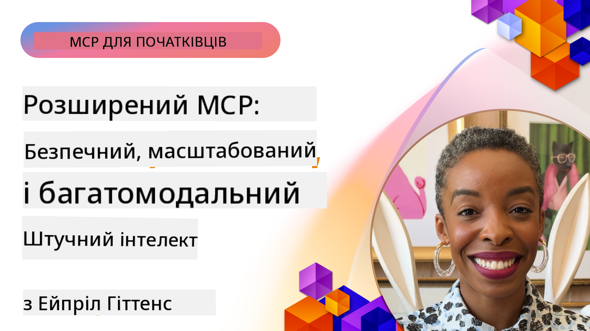

<!--
CO_OP_TRANSLATOR_METADATA:
{
  "original_hash": "d204bc94ea6027d06a703b21b711ca57",
  "translation_date": "2025-08-19T19:14:41+00:00",
  "source_file": "05-AdvancedTopics/README.md",
  "language_code": "uk"
}
-->
# Розширені теми MCP

_(Натисніть на зображення вище, щоб переглянути відео цього уроку)_

Цей розділ охоплює серію розширених тем щодо реалізації Model Context Protocol (MCP), включаючи мультимодальну інтеграцію, масштабованість, найкращі практики безпеки та інтеграцію на рівні підприємства. Ці теми є ключовими для створення надійних і готових до виробництва додатків MCP, які відповідають вимогам сучасних AI-систем.

## Огляд

У цьому уроці розглядаються розширені концепції реалізації Model Context Protocol, зосереджуючись на мультимодальній інтеграції, масштабованості, найкращих практиках безпеки та інтеграції на рівні підприємства. Ці теми є важливими для створення виробничих додатків MCP, здатних впоратися зі складними вимогами в корпоративному середовищі.

## Цілі навчання

Після завершення цього уроку ви зможете:

- Реалізовувати мультимодальні можливості в рамках MCP
- Проєктувати масштабовані архітектури MCP для сценаріїв з високим навантаженням
- Застосовувати найкращі практики безпеки відповідно до принципів безпеки MCP
- Інтегрувати MCP із корпоративними AI-системами та фреймворками
- Оптимізувати продуктивність і надійність у виробничих середовищах

## Уроки та приклади проєктів

| Посилання | Назва | Опис |
|-----------|-------|-------|
| [5.1 Інтеграція з Azure](./mcp-integration/README.md) | Інтеграція з Azure | Дізнайтеся, як інтегрувати ваш MCP-сервер на Azure |
| [5.2 Приклад мультимодальності](./mcp-multi-modality/README.md) | Приклади мультимодальності MCP | Приклади для аудіо, зображень і мультимодальних відповідей |
| [5.3 Приклад MCP OAuth2](../../../05-AdvancedTopics/mcp-oauth2-demo) | Демонстрація MCP OAuth2 | Мінімальний додаток Spring Boot, що демонструє OAuth2 з MCP як сервер авторизації та ресурсів. Показує видачу захищених токенів, захищені кінцеві точки, розгортання в Azure Container Apps та інтеграцію з API Management. |
| [5.4 Root Contexts](./mcp-root-contexts/README.md) | Root Contexts | Дізнайтеся більше про root context і як їх реалізувати |
| [5.5 Маршрутизація](./mcp-routing/README.md) | Маршрутизація | Вивчіть різні типи маршрутизації |
| [5.6 Вибірка](./mcp-sampling/README.md) | Вибірка | Дізнайтеся, як працювати з вибіркою |
| [5.7 Масштабування](./mcp-scaling/README.md) | Масштабування | Дізнайтеся про масштабування |
| [5.8 Безпека](./mcp-security/README.md) | Безпека | Захистіть ваш MCP-сервер |
| [5.9 Приклад веб-пошуку](./web-search-mcp/README.md) | Веб-пошук MCP | Python MCP-сервер і клієнт, що інтегруються з SerpAPI для реального часу веб-, новинного, товарного пошуку та Q&A. Демонструє оркестрацію багатьох інструментів, інтеграцію зовнішніх API та надійне оброблення помилок. |
| [5.10 Потокова передача в реальному часі](./mcp-realtimestreaming/README.md) | Потокова передача | Потокова передача даних у реальному часі стала важливою в сучасному світі, орієнтованому на дані, де бізнес і додатки потребують негайного доступу до інформації для прийняття своєчасних рішень. |
| [5.11 Веб-пошук у реальному часі](./mcp-realtimesearch/README.md) | Веб-пошук | Як MCP трансформує веб-пошук у реальному часі, забезпечуючи стандартизований підхід до управління контекстом між AI-моделями, пошуковими системами та додатками. |
| [5.12 Аутентифікація Entra ID для серверів Model Context Protocol](./mcp-security-entra/README.md) | Аутентифікація Entra ID | Microsoft Entra ID забезпечує надійне хмарне рішення для управління ідентифікацією та доступом, допомагаючи гарантувати, що лише авторизовані користувачі та додатки можуть взаємодіяти з вашим MCP-сервером. |
| [5.13 Інтеграція агента Azure AI Foundry](./mcp-foundry-agent-integration/README.md) | Інтеграція Azure AI Foundry | Дізнайтеся, як інтегрувати сервери Model Context Protocol з агентами Azure AI Foundry, забезпечуючи потужну оркестрацію інструментів і корпоративні AI-можливості зі стандартизованими підключеннями до зовнішніх джерел даних. |
| [5.14 Інженерія контексту](./mcp-contextengineering/README.md) | Інженерія контексту | Майбутні можливості технік інженерії контексту для серверів MCP, включаючи оптимізацію контексту, динамічне управління контекстом і стратегії ефективного інженерії підказок у рамках MCP. |

## Додаткові посилання

Для найактуальнішої інформації про розширені теми MCP звертайтеся до:
- [Документація MCP](https://modelcontextprotocol.io/)
- [Специфікація MCP](https://spec.modelcontextprotocol.io/)
- [Репозиторій GitHub](https://github.com/modelcontextprotocol)

## Основні висновки

- Мультимодальні реалізації MCP розширюють можливості AI за межі обробки тексту
- Масштабованість є важливою для корпоративних розгортань і може бути досягнута через горизонтальне та вертикальне масштабування
- Комплексні заходи безпеки захищають дані та забезпечують належний контроль доступу
- Інтеграція на рівні підприємства з платформами, такими як Azure OpenAI та Microsoft AI Foundry, розширює можливості MCP
- Розширені реалізації MCP виграють від оптимізованих архітектур і ретельного управління ресурсами

## Вправа

Розробіть реалізацію MCP корпоративного рівня для конкретного випадку використання:

1. Визначте мультимодальні вимоги для вашого випадку використання
2. Окресліть заходи безпеки, необхідні для захисту чутливих даних
3. Спроєктуйте масштабовану архітектуру, здатну впоратися зі змінним навантаженням
4. Сплануйте точки інтеграції з корпоративними AI-системами
5. Задокументуйте потенційні вузькі місця продуктивності та стратегії їх усунення

## Додаткові ресурси

- [Документація Azure OpenAI](https://learn.microsoft.com/en-us/azure/ai-services/openai/)
- [Документація Microsoft AI Foundry](https://learn.microsoft.com/en-us/ai-services/)

---

## Що далі

- [5.1 Інтеграція MCP](./mcp-integration/README.md)

**Відмова від відповідальності**:  
Цей документ був перекладений за допомогою сервісу автоматичного перекладу [Co-op Translator](https://github.com/Azure/co-op-translator). Хоча ми прагнемо до точності, будь ласка, майте на увазі, що автоматичні переклади можуть містити помилки або неточності. Оригінальний документ на його рідній мові слід вважати авторитетним джерелом. Для критичної інформації рекомендується професійний людський переклад. Ми не несемо відповідальності за будь-які непорозуміння або неправильні тлумачення, що виникають внаслідок використання цього перекладу.