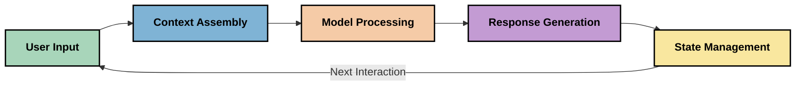
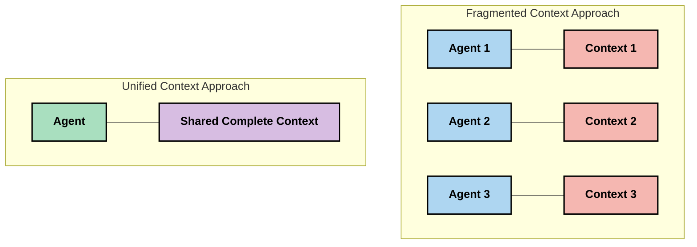
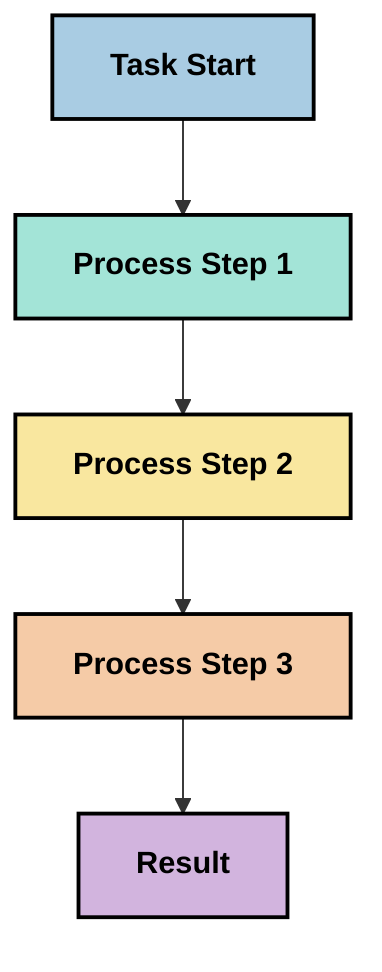
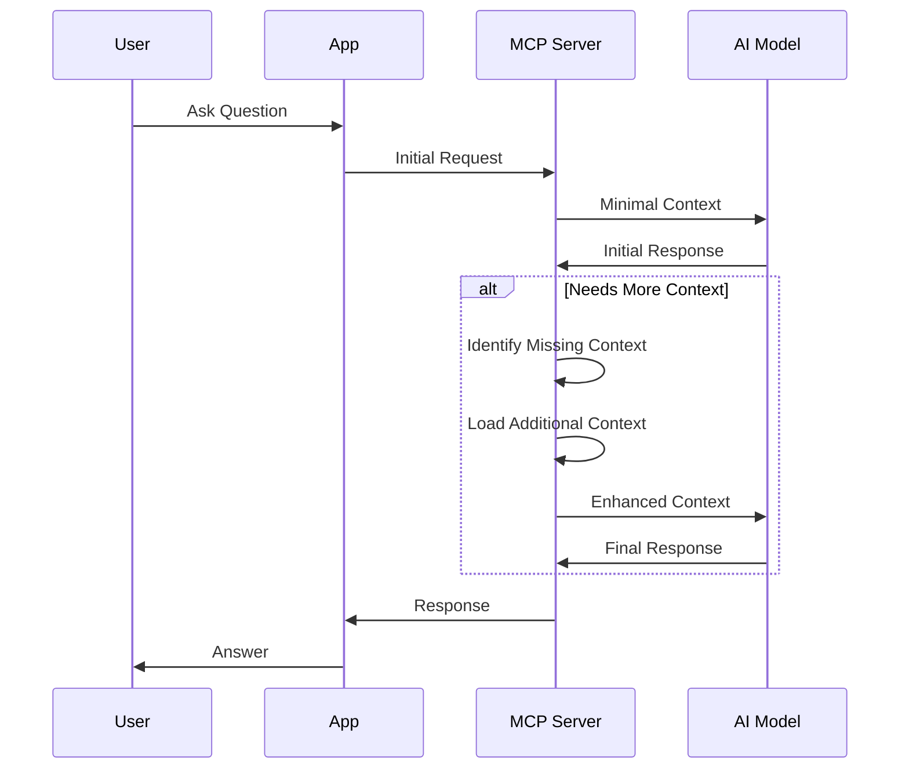
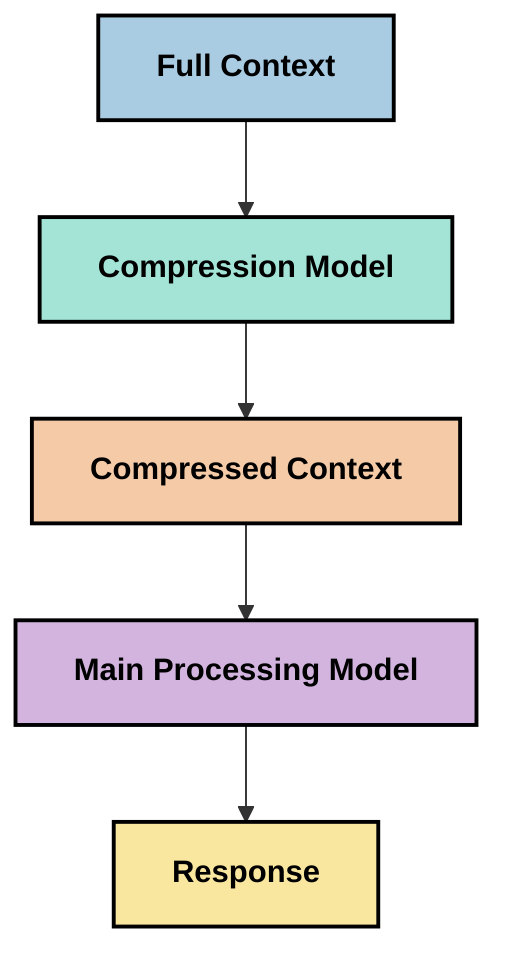

<!--
CO_OP_TRANSLATOR_METADATA:
{
  "original_hash": "fd169ca3071b81b5ee282e194bc823df",
  "translation_date": "2025-09-15T21:22:49+00:00",
  "source_file": "05-AdvancedTopics/mcp-contextengineering/README.md",
  "language_code": "uk"
}
-->
# Контекстна інженерія: новий концепт в екосистемі MCP

## Огляд

Контекстна інженерія — це новий концепт у сфері штучного інтелекту, який досліджує, як інформація структурується, передається та підтримується під час взаємодії між клієнтами та AI-сервісами. У міру розвитку екосистеми Model Context Protocol (MCP) розуміння ефективного управління контекстом стає дедалі важливішим. Цей модуль вводить поняття контекстної інженерії та досліджує її потенційні застосування в реалізації MCP.

## Цілі навчання

До кінця цього модуля ви зможете:

- Зрозуміти новий концепт контекстної інженерії та її потенційну роль у застосуванні MCP
- Визначити ключові виклики в управлінні контекстом, які вирішує дизайн протоколу MCP
- Дослідити техніки покращення продуктивності моделей через ефективне управління контекстом
- Розглянути підходи до вимірювання та оцінки ефективності контексту
- Застосувати ці нові концепти для покращення AI-досвіду через MCP

## Вступ до контекстної інженерії

Контекстна інженерія — це новий напрямок, зосереджений на свідомому дизайні та управлінні потоком інформації між користувачами, додатками та AI-моделями. На відміну від усталених галузей, таких як інженерія запитів, контекстна інженерія все ще формується практиками, які працюють над вирішенням унікальних викликів, пов’язаних із наданням AI-моделям правильної інформації в потрібний час.

У міру розвитку великих мовних моделей (LLMs) важливість контексту стає дедалі очевиднішою. Якість, релевантність і структура контексту, який ми надаємо, безпосередньо впливають на результати моделі. Контекстна інженерія досліджує цей взаємозв’язок і прагне розробити принципи ефективного управління контекстом.

> "У 2025 році моделі стануть надзвичайно розумними. Але навіть найрозумніша людина не зможе ефективно виконувати свою роботу без контексту того, що від неї вимагається... 'Контекстна інженерія' — це наступний рівень інженерії запитів. Вона полягає в автоматизації цього процесу в динамічній системі." — Волден Ян, Cognition AI

Контекстна інженерія може охоплювати:

1. **Вибір контексту**: Визначення, яка інформація є релевантною для конкретного завдання
2. **Структурування контексту**: Організація інформації для максимального розуміння моделлю
3. **Передача контексту**: Оптимізація способу та часу передачі інформації моделям
4. **Підтримка контексту**: Управління станом і еволюцією контексту з часом
5. **Оцінка контексту**: Вимірювання та покращення ефективності контексту

Ці аспекти особливо важливі для екосистеми MCP, яка забезпечує стандартизований спосіб надання контексту LLM.

## Перспектива "Шлях контексту"

Один із способів візуалізувати контекстну інженерію — це простежити шлях, який інформація проходить через систему MCP:



### Ключові етапи "Шляху контексту":

1. **Вхідні дані користувача**: Сира інформація від користувача (текст, зображення, документи)
2. **Збір контексту**: Поєднання вхідних даних користувача із системним контекстом, історією розмови та іншою отриманою інформацією
3. **Обробка моделлю**: AI-модель обробляє зібраний контекст
4. **Генерація відповіді**: Модель створює результати на основі наданого контексту
5. **Управління станом**: Система оновлює свій внутрішній стан на основі взаємодії

Ця перспектива підкреслює динамічну природу контексту в AI-системах і ставить важливі питання про те, як найкраще управляти інформацією на кожному етапі.

## Нові принципи контекстної інженерії

У міру формування галузі контекстної інженерії починають з’являтися деякі ранні принципи, які можуть допомогти у виборі підходів до реалізації MCP:

### Принцип 1: Повний обмін контекстом

Контекст має бути повністю доступним для всіх компонентів системи, а не розділеним між кількома агентами чи процесами. Коли контекст розподілений, рішення, прийняті в одній частині системи, можуть суперечити рішенням, прийнятим в іншій.



У застосуваннях MCP це означає проектування систем, де контекст плавно проходить через весь конвеєр, а не розділяється на частини.

### Принцип 2: Дії несуть приховані рішення

Кожна дія моделі містить приховані рішення щодо того, як інтерпретувати контекст. Коли кілька компонентів працюють із різними контекстами, ці приховані рішення можуть конфліктувати, що призводить до непослідовних результатів.

Цей принцип має важливі наслідки для застосувань MCP:
- Віддавайте перевагу лінійній обробці складних завдань над паралельним виконанням із розділеним контекстом
- Забезпечте доступ до однакової контекстної інформації для всіх точок прийняття рішень
- Проектуйте системи, де пізніші етапи можуть бачити повний контекст попередніх рішень

### Принцип 3: Баланс глибини контексту та обмежень вікна

У міру того, як розмови та процеси стають довшими, контекстні вікна зрештою переповнюються. Ефективна контекстна інженерія досліджує підходи до управління цією напругою між повним контекстом і технічними обмеженнями.

Можливі підходи, які досліджуються:
- Стиснення контексту, що зберігає важливу інформацію, зменшуючи використання токенів
- Прогресивне завантаження контексту на основі його актуальності для поточних потреб
- Резюмування попередніх взаємодій із збереженням ключових рішень і фактів

## Виклики контексту та дизайн протоколу MCP

Model Context Protocol (MCP) був розроблений з урахуванням унікальних викликів управління контекстом. Розуміння цих викликів допомагає пояснити ключові аспекти дизайну протоколу MCP:

### Виклик 1: Обмеження контекстного вікна
Більшість AI-моделей мають фіксовані розміри контекстного вікна, що обмежує обсяг інформації, яку вони можуть обробляти одночасно.

**Відповідь дизайну MCP:** 
- Протокол підтримує структурований контекст на основі ресурсів, який можна ефективно використовувати
- Ресурси можуть бути розбиті на сторінки та завантажуватися поступово

### Виклик 2: Визначення релевантності
Визначення, яка інформація є найбільш релевантною для включення в контекст, є складним завданням.

**Відповідь дизайну MCP:**
- Гнучкі інструменти дозволяють динамічно отримувати інформацію залежно від потреби
- Структуровані запити забезпечують послідовну організацію контексту

### Виклик 3: Збереження контексту
Управління станом між взаємодіями вимагає ретельного відстеження контексту.

**Відповідь дизайну MCP:**
- Стандартизоване управління сесіями
- Чітко визначені шаблони взаємодії для еволюції контексту

### Виклик 4: Мультимодальний контекст
Різні типи даних (текст, зображення, структуровані дані) потребують різного підходу.

**Відповідь дизайну MCP:**
- Дизайн протоколу враховує різні типи контенту
- Стандартизоване представлення мультимодальної інформації

### Виклик 5: Безпека та конфіденційність
Контекст часто містить конфіденційну інформацію, яку необхідно захищати.

**Відповідь дизайну MCP:**
- Чіткі межі між відповідальністю клієнта та сервера
- Опції локальної обробки для мінімізації ризику витоку даних

Розуміння цих викликів і того, як MCP їх вирішує, створює основу для дослідження більш складних технік контекстної інженерії.

## Нові підходи до контекстної інженерії

У міру розвитку галузі контекстної інженерії з’являються кілька перспективних підходів. Вони представляють поточні ідеї, а не усталені практики, і, ймовірно, будуть змінюватися з накопиченням досвіду в реалізації MCP.

### 1. Лінійна обробка в одному потоці

На противагу архітектурам з багатьма агентами, які розподіляють контекст, деякі практики виявляють, що лінійна обробка в одному потоці дає більш послідовні результати. Це узгоджується з принципом збереження єдиного контексту.



Хоча цей підхід може здатися менш ефективним, ніж паралельна обробка, він часто забезпечує більш узгоджені та надійні результати, оскільки кожен етап будується на повному розумінні попередніх рішень.

### 2. Розбиття контексту на частини та пріоритизація

Розбиття великого контексту на керовані частини та визначення пріоритетів для найважливішого.

```python
# Conceptual Example: Context Chunking and Prioritization
def process_with_chunked_context(documents, query):
    # 1. Break documents into smaller chunks
    chunks = chunk_documents(documents)
    
    # 2. Calculate relevance scores for each chunk
    scored_chunks = [(chunk, calculate_relevance(chunk, query)) for chunk in chunks]
    
    # 3. Sort chunks by relevance score
    sorted_chunks = sorted(scored_chunks, key=lambda x: x[1], reverse=True)
    
    # 4. Use the most relevant chunks as context
    context = create_context_from_chunks([chunk for chunk, score in sorted_chunks[:5]])
    
    # 5. Process with the prioritized context
    return generate_response(context, query)
```

Ця концепція ілюструє, як можна розбити великі документи на керовані частини та вибрати лише найбільш релевантні частини для контексту. Такий підхід допомагає працювати в межах обмежень контекстного вікна, використовуючи при цьому великі бази знань.

### 3. Прогресивне завантаження контексту

Завантаження контексту поступово, у міру необхідності, а не одразу.



Прогресивне завантаження контексту починається з мінімального контексту і розширюється лише за потреби. Це може значно зменшити використання токенів для простих запитів, зберігаючи здатність обробляти складні питання.

### 4. Стиснення та резюмування контексту

Зменшення розміру контексту при збереженні важливої інформації.



Стиснення контексту зосереджується на:
- Видаленні надлишкової інформації
- Резюмуванні довгого контенту
- Витягу ключових фактів і деталей
- Збереженні критичних елементів контексту
- Оптимізації використання токенів

Цей підхід може бути особливо цінним для підтримки довгих розмов у межах контекстних вікон або для ефективної обробки великих документів. Деякі практики використовують спеціалізовані моделі для стиснення контексту та резюмування історії розмов.

## Дослідницькі аспекти контекстної інженерії

У процесі дослідження нової галузі контекстної інженерії варто враховувати кілька аспектів при роботі з реалізаціями MCP. Це не усталені практики, а скоріше області дослідження, які можуть принести покращення у вашому конкретному випадку.

### Визначте свої цілі щодо контексту

Перед впровадженням складних рішень управління контекстом чітко сформулюйте, чого ви прагнете досягти:
- Яка конкретна інформація потрібна моделі для успіху?
- Яка інформація є важливою, а яка — додатковою?
- Які ваші обмеження продуктивності (затримка, обмеження токенів, витрати)?

### Досліджуйте багатошарові підходи до контексту

Деякі практики досягають успіху з контекстом, організованим у концептуальні шари:
- **Основний шар**: Важлива інформація, яка завжди потрібна моделі
- **Ситуаційний шар**: Контекст, специфічний для поточної взаємодії
- **Підтримуючий шар**: Додаткова інформація, яка може бути корисною
- **Резервний шар**: Інформація, яка використовується лише за потреби

### Досліджуйте стратегії отримання інформації

Ефективність вашого контексту часто залежить від того, як ви отримуєте інформацію:
- Семантичний пошук і вбудовування для пошуку концептуально релевантної інформації
- Пошук за ключовими словами для конкретних фактичних деталей
- Гібридні підходи, які поєднують кілька методів отримання
- Фільтрація метаданих для звуження обсягу за категоріями, датами або джерелами

### Експериментуйте з узгодженістю контексту

Структура та потік вашого контексту можуть впливати на розуміння моделі:
- Групування пов’язаної інформації разом
- Використання послідовного форматування та організації
- Збереження логічного або хронологічного порядку, де це доречно
- Уникнення суперечливої інформації

### Зважте компроміси багатокомпонентних архітектур

Хоча багатокомпонентні архітектури популярні в багатьох AI-фреймворках, вони мають значні виклики для управління контекстом:
- Фрагментація контексту може призвести до непослідовних рішень між агентами
- Паралельна обробка може створити конфлікти, які важко вирішити
- Накладні витрати на комунікацію між агентами можуть компенсувати приріст продуктивності
- Складне управління станом необхідне для збереження узгодженості

У багатьох випадках підхід з одним агентом із комплексним управлінням контекстом може дати більш надійні результати, ніж кілька спеціалізованих агентів із фрагментованим контекстом.

### Розробіть методи оцінки

Щоб покращувати контекстну інженерію з часом, подумайте, як ви будете вимірювати успіх:
- A/B-тестування різних структур контексту
- Моніторинг використання токенів і часу відповіді
- Відстеження задоволеності користувачів і рівня виконання завдань
- Аналіз випадків, коли стратегії контексту не спрацювали

Ці аспекти представляють активні області дослідження в галузі контекстної інженерії. У міру розвитку галузі, ймовірно, з’являться більш визначені шаблони та практики.

## Вимірювання ефективності контексту: еволюційна структура

У міру того, як контекстна інженерія стає концептом, практики починають досліджувати, як можна виміряти її ефективність. Поки що не існує усталеної структури, але розглядаються різні метрики, які можуть допомогти спрямувати майбутню роботу.

### Потенційні вимірювальні аспекти

#### 1. Ефективність вхідних даних

- **Співвідношення контексту до відповіді**: Скільки контексту потрібно відносно розміру відповіді?
- **Використання токенів**: Який відсоток наданих токенів контексту впливає на відповідь?
- **Скорочення контексту**: Наскільки ефективно можна стиснути сиру інформацію?

#### 2. Продуктивність

- **Вплив на затримку
- [Model Context Protocol Website](https://modelcontextprotocol.io/)
- [Model Context Protocol Specification](https://github.com/modelcontextprotocol/modelcontextprotocol)
- [MCP Documentation](https://modelcontextprotocol.io/docs)
- [MCP C# SDK](https://github.com/modelcontextprotocol/csharp-sdk)
- [MCP Python SDK](https://github.com/modelcontextprotocol/python-sdk)
- [MCP TypeScript SDK](https://github.com/modelcontextprotocol/typescript-sdk)
- [MCP Inspector](https://github.com/modelcontextprotocol/inspector) - Візуальний інструмент тестування серверів MCP

### Статті про інженерію контексту
- [Не створюйте мультиагентів: принципи інженерії контексту](https://cognition.ai/blog/dont-build-multi-agents) - Інсайти Волдена Яна щодо принципів інженерії контексту
- [Практичний посібник зі створення агентів](https://cdn.openai.com/business-guides-and-resources/a-practical-guide-to-building-agents.pdf) - Посібник OpenAI з ефективного дизайну агентів
- [Створення ефективних агентів](https://www.anthropic.com/engineering/building-effective-agents) - Підхід Anthropic до розробки агентів

### Пов’язане дослідження
- [Динамічне доповнення пошуку для великих мовних моделей](https://arxiv.org/abs/2310.01487) - Дослідження підходів до динамічного пошуку
- [Загублені в середині: як мовні моделі використовують довгі контексти](https://arxiv.org/abs/2307.03172) - Важливе дослідження про обробку контексту
- [Ієрархічне текстово-зумовлене створення зображень за допомогою CLIP Latents](https://arxiv.org/abs/2204.06125) - Стаття про DALL-E 2 з інсайтами щодо структурування контексту
- [Дослідження ролі контексту в архітектурах великих мовних моделей](https://aclanthology.org/2023.findings-emnlp.124/) - Сучасне дослідження про обробку контексту
- [Співпраця мультиагентів: огляд](https://arxiv.org/abs/2304.03442) - Дослідження про мультиагентні системи та їхні виклики

### Додаткові ресурси
- [Техніки оптимізації контекстного вікна](https://learn.microsoft.com/en-us/azure/ai-services/openai/concepts/context-window)
- [Розширені техніки RAG](https://www.microsoft.com/en-us/research/blog/retrieval-augmented-generation-rag-and-frontier-models/)
- [Документація Semantic Kernel](https://github.com/microsoft/semantic-kernel)
- [AI Toolkit для управління контекстом](https://github.com/microsoft/aitoolkit)

## Що далі

- [5.15 MCP Custom Transport](../mcp-transport/README.md)

---

**Відмова від відповідальності**:  
Цей документ був перекладений за допомогою сервісу автоматичного перекладу [Co-op Translator](https://github.com/Azure/co-op-translator). Хоча ми прагнемо до точності, будь ласка, майте на увазі, що автоматичні переклади можуть містити помилки або неточності. Оригінальний документ на його рідній мові слід вважати авторитетним джерелом. Для критичної інформації рекомендується професійний людський переклад. Ми не несемо відповідальності за будь-які непорозуміння або неправильні тлумачення, що виникають внаслідок використання цього перекладу.