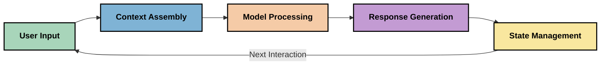
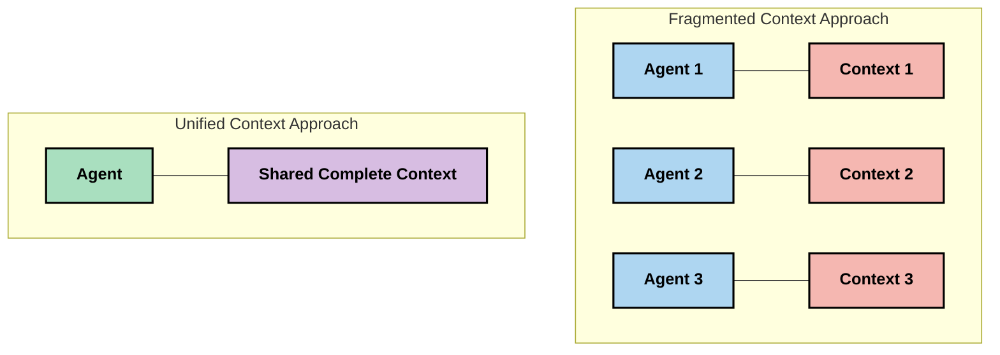
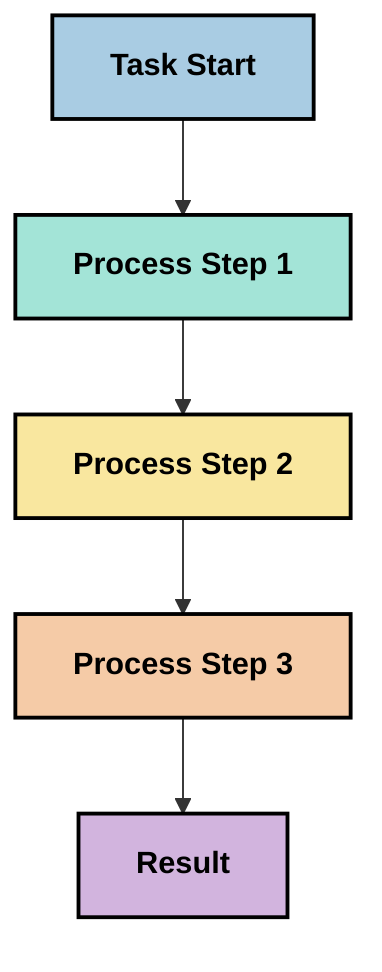
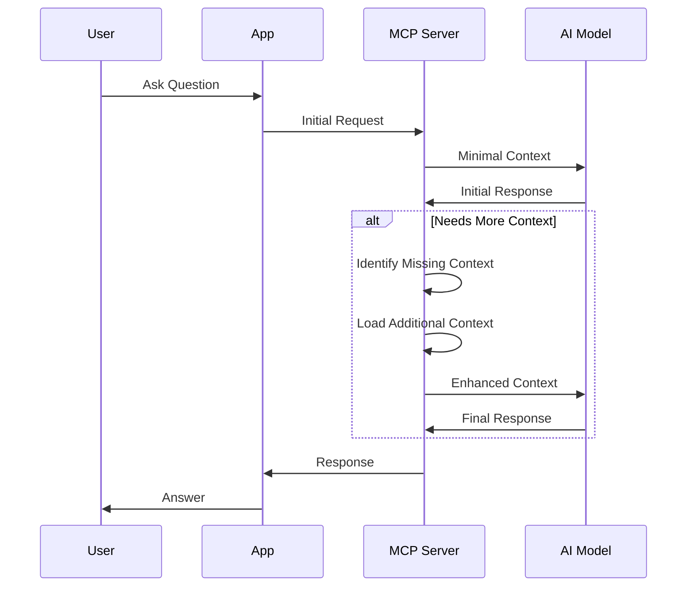
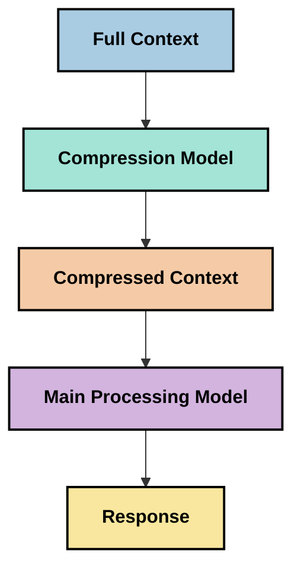

<!--
CO_OP_TRANSLATOR_METADATA:
{
  "original_hash": "5762e8e74dd99d8b7dbb31e69a82561e",
  "translation_date": "2025-07-17T13:28:09+00:00",
  "source_file": "05-AdvancedTopics/mcp-contextengineering/README.md",
  "language_code": "uk"
}
-->
# Контекстна інженерія: нова концепція в екосистемі MCP

## Огляд

Контекстна інженерія — це нова концепція в сфері штучного інтелекту, яка досліджує, як інформація структурується, передається та підтримується під час взаємодії між клієнтами та AI-сервісами. У міру розвитку екосистеми Model Context Protocol (MCP) розуміння ефективного управління контекстом стає дедалі важливішим. Цей модуль знайомить із концепцією контекстної інженерії та розглядає її потенційні застосування в реалізаціях MCP.

## Цілі навчання

Після проходження цього модуля ви зможете:

- Зрозуміти нову концепцію контекстної інженерії та її потенційну роль у застосунках MCP
- Визначити ключові виклики управління контекстом, які враховує дизайн протоколу MCP
- Ознайомитися з техніками покращення продуктивності моделей через кращу роботу з контекстом
- Розглянути підходи до вимірювання та оцінки ефективності контексту
- Застосувати ці нові концепції для покращення AI-досвіду в рамках MCP

## Вступ до контекстної інженерії

Контекстна інженерія — це нова галузь, що зосереджена на свідомому проєктуванні та управлінні потоком інформації між користувачами, додатками та AI-моделями. На відміну від усталених напрямків, таких як prompt engineering, контекстна інженерія ще формується практиками, які працюють над унікальними викликами забезпечення AI-моделей потрібною інформацією в потрібний час.

З розвитком великих мовних моделей (LLM) важливість контексту стала очевиднішою. Якість, релевантність і структура контексту безпосередньо впливають на результати моделі. Контекстна інженерія досліджує цей зв’язок і прагне розробити принципи ефективного управління контекстом.

> "У 2025 році моделі надзвичайно розумні. Але навіть найрозумніша людина не зможе ефективно виконувати свою роботу без контексту того, що від неї вимагають... 'Контекстна інженерія' — це наступний рівень prompt engineering. Це про автоматизацію цього процесу в динамічній системі." — Walden Yan, Cognition AI

Контекстна інженерія може включати:

1. **Вибір контексту**: визначення, яка інформація релевантна для конкретного завдання
2. **Структурування контексту**: організація інформації для максимального розуміння моделлю
3. **Передача контексту**: оптимізація способу та часу надсилання інформації моделям
4. **Підтримка контексту**: управління станом і розвитком контексту з часом
5. **Оцінка контексту**: вимірювання та покращення ефективності контексту

Ці напрямки особливо актуальні для екосистеми MCP, яка забезпечує стандартизований спосіб передачі контексту LLM.

## Перспектива шляху контексту

Один із способів уявити контекстну інженерію — простежити шлях інформації через систему MCP:



### Ключові етапи шляху контексту:

1. **Вхід користувача**: сирі дані від користувача (текст, зображення, документи)
2. **Збирання контексту**: поєднання вхідних даних користувача з системним контекстом, історією розмови та іншою отриманою інформацією
3. **Обробка моделлю**: AI-модель обробляє зібраний контекст
4. **Генерація відповіді**: модель створює результати на основі наданого контексту
5. **Управління станом**: система оновлює внутрішній стан на основі взаємодії

Цей підхід підкреслює динамічний характер контексту в AI-системах і ставить важливі питання про те, як найкраще управляти інформацією на кожному етапі.

## Основні принципи контекстної інженерії

У міру формування галузі контекстної інженерії практики починають виділяти перші принципи, які можуть допомогти у виборі рішень для реалізації MCP:

### Принцип 1: Повна передача контексту

Контекст має передаватися повністю між усіма компонентами системи, а не бути розпорошеним між різними агентами чи процесами. Коли контекст розподілений, рішення, прийняті в одній частині системи, можуть суперечити рішенням в іншій.



У застосунках MCP це означає проєктування систем, де контекст безперешкодно проходить через весь конвеєр, а не розділяється на частини.

### Принцип 2: Врахування неявних рішень у діях

Кожна дія моделі містить неявні рішення про те, як інтерпретувати контекст. Коли різні компоненти працюють з різними контекстами, ці неявні рішення можуть конфліктувати, що призводить до непослідовних результатів.

Цей принцип має важливі наслідки для застосунків MCP:
- Віддавати перевагу лінійній обробці складних завдань замість паралельного виконання з розпорошеним контекстом
- Забезпечити доступ до однакової контекстної інформації на всіх точках прийняття рішень
- Проєктувати системи так, щоб пізні кроки бачили повний контекст попередніх рішень

### Принцип 3: Баланс між глибиною контексту та обмеженнями вікна

Зі збільшенням тривалості розмов і процесів контекстні вікна переповнюються. Ефективна контекстна інженерія шукає способи врівноважити повноту контексту з технічними обмеженнями.

Розглядаються такі підходи:
- Стиснення контексту, що зберігає суттєву інформацію, зменшуючи використання токенів
- Поступове завантаження контексту залежно від актуальності
- Резюмування попередніх взаємодій із збереженням ключових рішень і фактів

## Виклики контексту та дизайн протоколу MCP

Model Context Protocol (MCP) розроблявся з урахуванням унікальних викликів управління контекстом. Розуміння цих викликів допомагає пояснити ключові аспекти дизайну протоколу MCP:

### Виклик 1: Обмеження розміру контекстного вікна  
Більшість AI-моделей мають фіксований розмір контекстного вікна, що обмежує обсяг інформації для одночасної обробки.

**Відповідь MCP:**  
- Протокол підтримує структурований контекст на основі ресурсів, який можна ефективно посилатися  
- Ресурси можна розбивати на сторінки та завантажувати поступово

### Виклик 2: Визначення релевантності  
Визначити, яка інформація є найбільш релевантною для включення в контекст, складно.

**Відповідь MCP:**  
- Гнучкі інструменти дозволяють динамічно отримувати інформацію за потребою  
- Структуровані підказки забезпечують послідовну організацію контексту

### Виклик 3: Збереження контексту  
Управління станом між взаємодіями вимагає ретельного відстеження контексту.

**Відповідь MCP:**  
- Стандартизоване управління сесіями  
- Чітко визначені патерни взаємодії для еволюції контексту

### Виклик 4: Мультимодальний контекст  
Різні типи даних (текст, зображення, структуровані дані) потребують різного підходу.

**Відповідь MCP:**  
- Дизайн протоколу враховує різні типи контенту  
- Стандартизоване представлення мультимодальної інформації

### Виклик 5: Безпека та конфіденційність  
Контекст часто містить чутливу інформацію, яку потрібно захищати.

**Відповідь MCP:**  
- Чіткі межі відповідальності між клієнтом і сервером  
- Можливість локальної обробки для мінімізації витоку даних

Розуміння цих викликів і способів їх вирішення MCP створює основу для дослідження більш просунутих технік контекстної інженерії.

## Нові підходи в контекстній інженерії

У міру розвитку галузі з’являються кілька перспективних підходів. Вони відображають поточні ідеї, а не усталені практики, і, ймовірно, будуть еволюціонувати з набуттям досвіду в реалізаціях MCP.

### 1. Однопотокова лінійна обробка

На відміну від багатоагентних архітектур із розподілом контексту, деякі практики вважають, що однопотокова лінійна обробка дає більш послідовні результати. Це відповідає принципу підтримки єдиного контексту.



Хоча цей підхід може здаватися менш ефективним, ніж паралельна обробка, він часто дає більш зрозумілі та надійні результати, оскільки кожен крок базується на повному розумінні попередніх рішень.

### 2. Розбиття контексту на частини та пріоритизація

Розбивання великих контекстів на керовані частини та вибір найважливішого.

```python
# Conceptual Example: Context Chunking and Prioritization
def process_with_chunked_context(documents, query):
    # 1. Break documents into smaller chunks
    chunks = chunk_documents(documents)
    
    # 2. Calculate relevance scores for each chunk
    scored_chunks = [(chunk, calculate_relevance(chunk, query)) for chunk in chunks]
    
    # 3. Sort chunks by relevance score
    sorted_chunks = sorted(scored_chunks, key=lambda x: x[1], reverse=True)
    
    # 4. Use the most relevant chunks as context
    context = create_context_from_chunks([chunk for chunk, score in sorted_chunks[:5]])
    
    # 5. Process with the prioritized context
    return generate_response(context, query)
```

Ця концепція ілюструє, як можна розбити великі документи на частини та вибрати лише найрелевантніші для контексту. Такий підхід допомагає працювати в межах обмежень контекстного вікна, використовуючи великі бази знань.

### 3. Поступове завантаження контексту

Завантаження контексту поступово, за потребою, а не одразу.



Поступове завантаження починається з мінімального контексту і розширюється лише за необхідності. Це значно знижує використання токенів для простих запитів, зберігаючи можливість обробляти складні питання.

### 4. Стиснення та резюмування контексту

Зменшення розміру контексту з одночасним збереженням суттєвої інформації.



Стиснення контексту зосереджене на:  
- Видаленні надлишкової інформації  
- Резюмуванні довгого контенту  
- Витяганні ключових фактів і деталей  
- Збереженні критичних елементів контексту  
- Оптимізації використання токенів

Цей підхід особливо корисний для підтримки довгих розмов у межах контекстних вікон або для ефективної обробки великих документів. Деякі практики використовують спеціалізовані моделі саме для стиснення та резюмування історії розмов.

## Додаткові міркування щодо контекстної інженерії

Під час дослідження контекстної інженерії в реалізаціях MCP варто враховувати кілька аспектів. Це не жорсткі правила, а області для експериментів, які можуть покращити ваш конкретний випадок.

### Визначте цілі контексту

Перед впровадженням складних рішень з управління контекстом чітко сформулюйте, чого хочете досягти:  
- Яка конкретна інформація потрібна моделі для успіху?  
- Яка інформація є суттєвою, а яка — додатковою?  
- Які у вас обмеження за продуктивністю (затримка, ліміти токенів, витрати)?

### Досліджуйте багатошарові підходи до контексту

Деякі практики успішно використовують контекст, організований у концептуальні шари:  
- **Основний шар**: інформація, необхідна моделі завжди  
- **Ситуаційний шар**: контекст, специфічний для поточної взаємодії  
- **Підтримуючий шар**: додаткова інформація, яка може бути корисною  
- **Резервний шар**: інформація, доступна лише за потреби

### Вивчайте стратегії отримання інформації

Ефективність контексту часто залежить від способу отримання інформації:  
- Семантичний пошук і embeddings для пошуку концептуально релевантної інформації  
- Пошук за ключовими словами для конкретних фактів  
- Гібридні підходи, що поєднують кілька методів  
- Фільтрація за метаданими для звуження сфери за категоріями, датами чи джерелами

### Експериментуйте з когерентністю контексту

Структура і послідовність контексту можуть впливати на розуміння моделі:  
- Групування пов’язаної інформації  
- Використання послідовного форматування та організації  
- Підтримка логічного або хронологічного порядку, де це доречно  
- Уникнення суперечливої інформації

### Зважуйте плюси і мінуси багатоагентних архітектур

Хоча багатоагентні архітектури популярні в багатьох AI-системах, вони мають суттєві виклики для управління контекстом:  
- Фрагментація контексту може призводити до непослідовних рішень між агентами  
- Паралельна обробка може викликати конфлікти, які важко узгодити  
- Витрати на комунікацію між агентами можуть нівелювати переваги продуктивності  
- Потрібне складне управління станом для підтримки когерентності

У багатьох випадках одногентний підхід із комплексним управлінням контекстом дає більш надійні результати, ніж кілька спеціалізованих агентів із розпорошеним контекстом.

### Розробляйте методи оцінки

Щоб покращувати контекстну інженерію з часом, подумайте, як вимірюватимете успіх:  
- A/B тестування різних структур контексту  
- Моніторинг використання токенів і часу відповіді  
- Відстеження задоволеності користувачів і рівня виконання завдань  
- Аналіз випадків, коли стратегії контексту не спрацьовують

Ці міркування відображають активні напрямки досліджень у сфері контекстної інженерії. З розвитком галузі з’являться більш визначені патерни та практики.

## Вимірювання ефективності контексту: еволюційна рамка

Оскільки контекстна інженерія тільки формується, практики починають досліджувати, як можна вимірювати її ефективність. Поки що немає усталеної рамки, але розглядаються різні метрики, які можуть допомогти у майбутній роботі.

### Можливі вимірювальні параметри

#### 1. Ефективність введення

- **Співвідношення контекст-відповідь**: скільки контексту потрібно відносно розміру відповіді?  
- **Використання токенів**: який відсоток токенів контексту впливає на відповідь?  
- **Стиснення контексту**: наскільки ефективно можна стиснути сирі дані?

#### 2. Показники продуктивності

- **Вплив на затримку**: як управління контекстом впливає на час відповіді?  
- **Економія токенів**: чи оптимізується використання токенів?  
- **Точність отримання**: наскільки релевантна отримана інформація?  
- **Використання ресурсів**: які обчислювальні ресурси потрібні?

#### 3. Якість

- **Релевантність відповіді**: наскільки відповідь відповідає запиту?  
- **Фактична точність**: чи покращує управління контекстом достовірність?  
- **Послідовність**: чи є відповіді послідовними для схожих запитів?  
- **Рівень
- [Model Context Protocol Website](https://modelcontextprotocol.io/)
- [Model Context Protocol Specification](https://github.com/modelcontextprotocol/modelcontextprotocol)
- [MCP Documentation](https://modelcontextprotocol.io/docs)
- [MCP C# SDK](https://github.com/modelcontextprotocol/csharp-sdk)
- [MCP Python SDK](https://github.com/modelcontextprotocol/python-sdk)
- [MCP TypeScript SDK](https://github.com/modelcontextprotocol/typescript-sdk)
- [MCP Inspector](https://github.com/modelcontextprotocol/inspector) - Візуальний інструмент для тестування серверів MCP

### Статті з контекстної інженерії
- [Не створюйте мультиагентів: принципи контекстної інженерії](https://cognition.ai/blog/dont-build-multi-agents) - Ідеї Волдена Яна щодо принципів контекстної інженерії
- [Практичний посібник зі створення агентів](https://cdn.openai.com/business-guides-and-resources/a-practical-guide-to-building-agents.pdf) - Посібник OpenAI з ефективного проєктування агентів
- [Створення ефективних агентів](https://www.anthropic.com/engineering/building-effective-agents) - Підхід Anthropic до розробки агентів

### Пов’язані дослідження
- [Динамічне розширення пошуку для великих мовних моделей](https://arxiv.org/abs/2310.01487) - Дослідження динамічних підходів до пошуку
- [Загублені посередині: як мовні моделі використовують довгі контексти](https://arxiv.org/abs/2307.03172) - Важливе дослідження патернів обробки контексту
- [Ієрархічне текстово-умовне генерування зображень за допомогою CLIP Latents](https://arxiv.org/abs/2204.06125) - Стаття про DALL-E 2 з ідеями щодо структурування контексту
- [Дослідження ролі контексту в архітектурах великих мовних моделей](https://aclanthology.org/2023.findings-emnlp.124/) - Останні дослідження з обробки контексту
- [Співпраця мультиагентів: огляд](https://arxiv.org/abs/2304.03442) - Дослідження мультиагентних систем та їх викликів

### Додаткові ресурси
- [Техніки оптимізації контекстного вікна](https://learn.microsoft.com/en-us/azure/ai-services/openai/concepts/context-window)
- [Розвинені методи RAG](https://www.microsoft.com/en-us/research/blog/retrieval-augmented-generation-rag-and-frontier-models/)
- [Документація Semantic Kernel](https://github.com/microsoft/semantic-kernel)
- [AI Toolkit для управління контекстом](https://github.com/microsoft/aitoolkit)

## Що далі
- [6. Внески спільноти](../../06-CommunityContributions/README.md)

**Відмова від відповідальності**:  
Цей документ було перекладено за допомогою сервісу автоматичного перекладу [Co-op Translator](https://github.com/Azure/co-op-translator). Хоча ми прагнемо до точності, будь ласка, майте на увазі, що автоматичні переклади можуть містити помилки або неточності. Оригінальний документ рідною мовою слід вважати авторитетним джерелом. Для критично важливої інформації рекомендується звертатися до професійного людського перекладу. Ми не несемо відповідальності за будь-які непорозуміння або неправильні тлумачення, що виникли внаслідок використання цього перекладу.