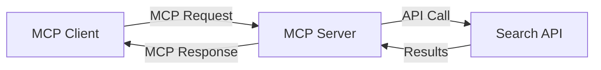
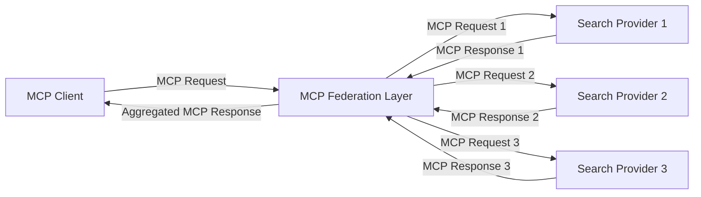
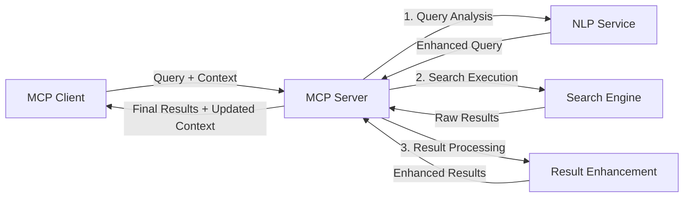

<!--
CO_OP_TRANSLATOR_METADATA:
{
  "original_hash": "333a03e51f90bdf3e6f1ba1694c73f36",
  "translation_date": "2025-07-17T13:02:18+00:00",
  "source_file": "05-AdvancedTopics/mcp-realtimesearch/README.md",
  "language_code": "uk"
}
-->
## Відмова від відповідальності щодо прикладів коду

> **Важлива примітка**: наведені нижче приклади коду демонструють інтеграцію Model Context Protocol (MCP) з функціоналом веб-пошуку. Хоча вони слідують патернам і структурам офіційних MCP SDK, вони спрощені для навчальних цілей.
> 
> Ці приклади ілюструють:
> 
> 1. **Реалізація на Python**: сервер FastMCP, який надає інструмент веб-пошуку та підключається до зовнішнього пошукового API. Цей приклад демонструє правильне управління життєвим циклом, обробку контексту та реалізацію інструменту відповідно до патернів [офіційного MCP Python SDK](https://github.com/modelcontextprotocol/python-sdk). Сервер використовує рекомендований транспорт Streamable HTTP, який замінив старіший SSE транспорт для продакшн-використання.
> 
> 2. **Реалізація на JavaScript**: TypeScript/JavaScript реалізація з використанням патерну FastMCP з [офіційного MCP TypeScript SDK](https://github.com/modelcontextprotocol/typescript-sdk) для створення пошукового сервера з правильним визначенням інструментів та підключеннями клієнтів. Вона слідує останнім рекомендованим патернам управління сесіями та збереження контексту.
> 
> Ці приклади потребують додаткової обробки помилок, аутентифікації та специфічного коду інтеграції API для використання у продакшні. Показані кінцеві точки пошукового API (`https://api.search-service.example/search`) є заповнювачами і мають бути замінені на реальні кінцеві точки пошукових сервісів.
> 
> Для повної інформації про реалізацію та найактуальніших підходів звертайтеся до [офіційної специфікації MCP](https://spec.modelcontextprotocol.io/) та документації SDK.

## Основні поняття

### Фреймворк Model Context Protocol (MCP)

В основі Model Context Protocol лежить стандартизований спосіб обміну контекстом між AI-моделями, додатками та сервісами. У реальному часі веб-пошуку цей фреймворк є ключовим для створення послідовного, багатокрокового пошукового досвіду. Основні компоненти включають:

1. **Архітектура клієнт-сервер**: MCP встановлює чітке розмежування між пошуковими клієнтами (ініціаторами запитів) та пошуковими серверами (постачальниками), що дозволяє гнучко розгортати систему.

2. **Комунікація JSON-RPC**: протокол використовує JSON-RPC для обміну повідомленнями, що робить його сумісним з веб-технологіями та простим у реалізації на різних платформах.

3. **Управління контекстом**: MCP визначає структуровані методи для збереження, оновлення та використання пошукового контексту в багатьох взаємодіях.

4. **Визначення інструментів**: пошукові можливості представлені як стандартизовані інструменти з чітко визначеними параметрами та результатами.

5. **Підтримка потокової передачі**: протокол підтримує потокову передачу результатів, що є необхідним для реального часу, коли результати можуть надходити поступово.

### Патерни інтеграції веб-пошуку

При інтеграції MCP з веб-пошуком виділяються кілька патернів:

#### 1. Пряма інтеграція з провайдером пошуку

У цьому патерні сервер MCP безпосередньо взаємодіє з одним або кількома пошуковими API, перетворюючи запити MCP у специфічні виклики API та форматуючи результати у відповіді MCP.

#### 2. Федеративний пошук із збереженням контексту

Цей патерн розподіляє пошукові запити між кількома сумісними з MCP пошуковими провайдерами, кожен з яких може спеціалізуватися на різних типах контенту або можливостях пошуку, при цьому підтримуючи єдиний контекст.

#### 3. Пошуковий ланцюг із покращеним контекстом

У цьому патерні процес пошуку розділений на кілька етапів, де контекст збагачується на кожному кроці, що призводить до поступового підвищення релевантності результатів.

### Компоненти пошукового контексту

У веб-пошуку на основі MCP контекст зазвичай включає:

- **Історія запитів**: попередні пошукові запити в сесії
- **Переваги користувача**: мова, регіон, налаштування безпечного пошуку
- **Історія взаємодій**: які результати були відкриті, час, проведений на результатах
- **Параметри пошуку**: фільтри, порядок сортування та інші модифікатори пошуку
- **Доменні знання**: предметно-специфічний контекст, релевантний пошуку
- **Темпоральний контекст**: часові фактори релевантності
- **Переваги джерел**: довірені або пріоритетні інформаційні джерела

## Варіанти використання та застосування

### Дослідження та збір інформації

MCP покращує робочі процеси досліджень за рахунок:

- Збереження контексту досліджень між пошуковими сесіями
- Забезпечення більш складних і контекстуально релевантних запитів
- Підтримки федеративного пошуку з кількох джерел
- Сприяння вилученню знань із результатів пошуку

### Моніторинг новин і трендів у реальному часі

Пошук на базі MCP пропонує переваги для моніторингу новин:

- Виявлення нових новинних сюжетів майже в реальному часі
- Контекстне фільтрування релевантної інформації
- Відстеження тем і сутностей у кількох джерелах
- Персоналізовані новинні сповіщення на основі контексту користувача

### AI-підсилене переглядання та дослідження

MCP відкриває нові можливості для AI-підсиленого переглядання:

- Контекстні пошукові пропозиції на основі поточної активності браузера
- Безшовна інтеграція веб-пошуку з асистентами на базі LLM
- Багатокрокове уточнення пошуку з підтримкою контексту
- Покращена перевірка фактів та верифікація інформації

## Майбутні тенденції та інновації

### Еволюція MCP у веб-пошуку

У майбутньому очікується, що MCP розвиватиметься для підтримки:

- **Мультимодального пошуку**: інтеграція текстового, зображень, аудіо та відео пошуку з збереженим контекстом
- **Децентралізованого пошуку**: підтримка розподілених і федеративних пошукових екосистем
- **Конфіденційність пошуку**: Механізми пошуку з урахуванням контексту, що зберігають приватність  
- **Розуміння запитів**: Глибокий семантичний аналіз пошукових запитів природною мовою  

### Можливі технологічні прориви

Нові технології, які формуватимуть майбутнє пошуку MCP:

1. **Нейронні архітектури пошуку**: Пошукові системи на основі вбудов, оптимізовані для MCP  
2. **Персоналізований контекст пошуку**: Навчання індивідуальних моделей пошукової поведінки користувачів з часом  
3. **Інтеграція графів знань**: Покращений контекстуальний пошук за допомогою галузевих графів знань  
4. **Крос-модальний контекст**: Підтримка контексту між різними типами пошуку  

## Практичні вправи

### Вправа 1: Налаштування базового конвеєра пошуку MCP

У цій вправі ви навчитеся:  
- Налаштовувати базове середовище пошуку MCP  
- Реалізовувати обробники контексту для веб-пошуку  
- Тестувати та перевіряти збереження контексту між ітераціями пошуку  

### Вправа 2: Створення дослідницького асистента з MCP-пошуком

Створіть повноцінний додаток, який:  
- Обробляє дослідницькі запитання природною мовою  
- Виконує контекстуальний веб-пошук  
- Синтезує інформацію з кількох джерел  
- Представляє організовані результати досліджень  

### Вправа 3: Реалізація федерації пошуку з кількох джерел за допомогою MCP

Просунута вправа, що охоплює:  
- Контекстуальне розподілення запитів між кількома пошуковими системами  
- Ранжування та агрегацію результатів  
- Контекстуальне усунення дублікатів у результатах пошуку  
- Обробку метаданих, специфічних для джерел  

## Додаткові ресурси

- [Model Context Protocol Specification](https://spec.modelcontextprotocol.io/) - Офіційна специфікація MCP та детальна документація протоколу  
- [Model Context Protocol Documentation](https://modelcontextprotocol.io/) - Детальні навчальні матеріали та керівництва з впровадження  
- [MCP Python SDK](https://github.com/modelcontextprotocol/python-sdk) - Офіційна реалізація MCP протоколу на Python  
- [MCP TypeScript SDK](https://github.com/modelcontextprotocol/typescript-sdk) - Офіційна реалізація MCP протоколу на TypeScript  
- [MCP Reference Servers](https://github.com/modelcontextprotocol/servers) - Еталонні реалізації MCP серверів  
- [Bing Web Search API Documentation](https://learn.microsoft.com/en-us/bing/search-apis/bing-web-search/overview) - API веб-пошуку від Microsoft  
- [Google Custom Search JSON API](https://developers.google.com/custom-search/v1/overview) - Програмований пошуковий движок Google  
- [SerpAPI Documentation](https://serpapi.com/search-api) - API сторінок результатів пошуку  
- [Meilisearch Documentation](https://www.meilisearch.com/docs) - Відкритий пошуковий движок  
- [Elasticsearch Documentation](https://www.elastic.co/guide/index.html) - Розподілений пошуковий та аналітичний движок  
- [LangChain Documentation](https://python.langchain.com/docs/get_started/introduction) - Створення додатків з LLM  

## Результати навчання

Після проходження цього модуля ви зможете:  

- Розуміти основи пошуку в реальному часі в інтернеті та його виклики  
- Пояснювати, як Model Context Protocol (MCP) покращує можливості пошуку в реальному часі  
- Реалізовувати пошукові рішення на основі MCP з використанням популярних фреймворків та API  
- Проєктувати та розгортати масштабовані, високопродуктивні архітектури пошуку з MCP  
- Застосовувати концепції MCP у різних сценаріях, включно з семантичним пошуком, дослідницькою підтримкою та AI-підсиленим переглядом  
- Оцінювати нові тенденції та майбутні інновації в технологіях пошуку на базі MCP  

### Питання довіри та безпеки

При впровадженні рішень веб-пошуку на основі MCP пам’ятайте про важливі принципи зі специфікації MCP:  

1. **Згода та контроль користувача**: Користувачі повинні чітко давати згоду та розуміти всі операції з доступом до даних. Це особливо важливо для реалізацій веб-пошуку, які можуть звертатися до зовнішніх джерел даних.  

2. **Конфіденційність даних**: Забезпечуйте належне поводження з пошуковими запитами та результатами, особливо якщо вони можуть містити чутливу інформацію. Впроваджуйте відповідні механізми контролю доступу для захисту даних користувачів.  

3. **Безпека інструментів**: Реалізуйте належну авторизацію та валідацію для пошукових інструментів, оскільки вони можуть становити потенційну загрозу через виконання довільного коду. Опис поведінки інструментів слід вважати ненадійним, якщо він не отриманий із довіреного сервера.  

4. **Чітка документація**: Надавайте зрозумілу документацію про можливості, обмеження та питання безпеки вашої реалізації MCP-пошуку, дотримуючись рекомендацій зі специфікації MCP.  

5. **Надійні процеси згоди**: Створюйте надійні процеси отримання згоди та авторизації, які чітко пояснюють функції кожного інструменту перед його використанням, особливо для інструментів, що взаємодіють із зовнішніми веб-ресурсами.  

Для повної інформації про безпеку та питання довіри MCP звертайтеся до [офіційної документації](https://modelcontextprotocol.io/specification/2025-03-26#security-and-trust-%26-safety).  

## Що далі  

- [5.12 Аутентифікація Entra ID для серверів Model Context Protocol](../mcp-security-entra/README.md)

**Відмова від відповідальності**:  
Цей документ було перекладено за допомогою сервісу автоматичного перекладу [Co-op Translator](https://github.com/Azure/co-op-translator). Хоча ми прагнемо до точності, будь ласка, майте на увазі, що автоматичні переклади можуть містити помилки або неточності. Оригінальний документ рідною мовою слід вважати авторитетним джерелом. Для критично важливої інформації рекомендується звертатися до професійного людського перекладу. Ми не несемо відповідальності за будь-які непорозуміння або неправильні тлумачення, що виникли внаслідок використання цього перекладу.