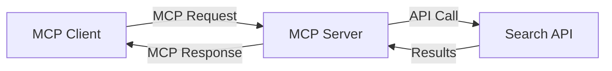
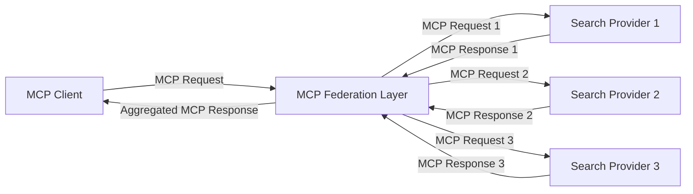
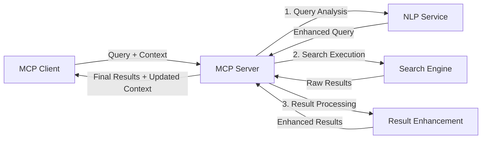

<!--
CO_OP_TRANSLATOR_METADATA:
{
  "original_hash": "16bef2c93c6a86d4ca6a8ce9e120e384",
  "translation_date": "2025-06-17T16:55:47+00:00",
  "source_file": "05-AdvancedTopics/mcp-realtimesearch/README.md",
  "language_code": "uk"
}
-->
## Відмова від відповідальності щодо прикладів коду

> **Важлива примітка**: наведені нижче приклади коду демонструють інтеграцію Model Context Protocol (MCP) з функціоналом веб-пошуку. Хоча вони відповідають патернам і структурам офіційних MCP SDK, їх спрощено для навчальних цілей.
> 
> Ці приклади ілюструють:
> 
> 1. **Реалізація на Python**: сервер FastMCP, що надає інструмент веб-пошуку і підключається до зовнішнього пошукового API. Цей приклад показує правильне управління життєвим циклом, обробку контексту та реалізацію інструменту відповідно до патернів [офіційного MCP Python SDK](https://github.com/modelcontextprotocol/python-sdk). Сервер використовує рекомендований транспорт Streamable HTTP, який замінив застарілий SSE-транспорт для виробничих розгортань.
> 
> 2. **Реалізація на JavaScript**: реалізація на TypeScript/JavaScript із використанням патерну FastMCP з [офіційного MCP TypeScript SDK](https://github.com/modelcontextprotocol/typescript-sdk) для створення пошукового сервера з правильним визначенням інструментів та підключенням клієнтів. Вона слідує останнім рекомендованим патернам управління сесіями та збереження контексту.
> 
> Ці приклади потребують додаткової обробки помилок, автентифікації та специфічного коду інтеграції API для виробничого використання. Показані кінцеві точки пошукового API (`https://api.search-service.example/search`) є заповнювачами і мають бути замінені на реальні кінцеві точки пошукових сервісів.
> 
> Для повної інформації про реалізацію та найактуальніших підходів звертайтеся до [офіційної специфікації MCP](https://spec.modelcontextprotocol.io/) та документації SDK.

## Основні концепції

### Фреймворк Model Context Protocol (MCP)

У своїй основі Model Context Protocol забезпечує стандартизований спосіб обміну контекстом між AI-моделями, додатками та сервісами. У реальному часі для веб-пошуку цей фреймворк є ключовим для створення узгоджених, багатокрокових пошукових сесій. Основні компоненти включають:

1. **Архітектура клієнт-сервер**: MCP встановлює чітке розмежування між клієнтами пошуку (запитувачами) та серверами пошуку (постачальниками), що дозволяє гнучкі моделі розгортання.

2. **Комунікація JSON-RPC**: протокол використовує JSON-RPC для обміну повідомленнями, що робить його сумісним з веб-технологіями і простим у реалізації на різних платформах.

3. **Управління контекстом**: MCP визначає структуровані методи для підтримки, оновлення та використання контексту пошуку в багатьох взаємодіях.

4. **Визначення інструментів**: можливості пошуку представлені як стандартизовані інструменти з чітко визначеними параметрами і результатами.

5. **Підтримка потокової передачі**: протокол підтримує стрімінг результатів, що є необхідним для реального часу, де результати можуть надходити поступово.

### Патерни інтеграції веб-пошуку

При інтеграції MCP з веб-пошуком виділяють кілька патернів:

#### 1. Пряма інтеграція з постачальником пошуку

У цьому патерні сервер MCP безпосередньо взаємодіє з одним або кількома пошуковими API, перетворюючи запити MCP у специфічні виклики API і форматуючи результати у відповіді MCP.

#### 2. Федеративний пошук з збереженням контексту

Цей патерн розподіляє пошукові запити між кількома сумісними з MCP постачальниками пошуку, кожен із яких може спеціалізуватися на різних типах контенту або можливостях пошуку, при цьому зберігаючи єдиний контекст.

#### 3. Ланцюжок пошуку з покращенням контексту

У цьому патерні процес пошуку поділено на кілька етапів, на кожному з яких контекст збагачується, що призводить до поступового підвищення релевантності результатів.

### Компоненти контексту пошуку

У веб-пошуку на базі MCP контекст зазвичай включає:

- **Історія запитів**: попередні пошукові запити в сесії
- **Переваги користувача**: мова, регіон, налаштування безпечного пошуку
- **Історія взаємодій**: які результати були відкриті, час, проведений на результатах
- **Параметри пошуку**: фільтри, порядок сортування та інші модифікатори пошуку
- **Доменно-знаннєвий контекст**: предметний контекст, релевантний пошуку
- **Часовий контекст**: фактори релевантності, пов’язані з часом
- **Переваги джерел**: довірені або пріоритетні інформаційні джерела

## Варіанти використання та застосування

### Дослідження та збір інформації

MCP покращує робочі процеси досліджень завдяки:

- Збереженню контексту дослідження між пошуковими сесіями
- Забезпеченню більш складних і контекстуально релевантних запитів
- Підтримці федерації пошуку з кількох джерел
- Сприянню вилученню знань із результатів пошуку

### Моніторинг новин та трендів у реальному часі

Пошук на основі MCP пропонує переваги для моніторингу новин:

- Виявлення нових новинних сюжетів майже в реальному часі
- Контекстне фільтрування релевантної інформації
- Відстеження тем і сутностей у кількох джерелах
- Персоналізовані новинні сповіщення на основі контексту користувача

### AI-підсилене переглядання та дослідження

MCP відкриває нові можливості для AI-підсиленого перегляду:

- Контекстні пошукові пропозиції на основі поточної активності браузера
- Безшовна інтеграція веб-пошуку з асистентами на основі великих мовних моделей
- Багатокрокове уточнення пошуку з підтримкою контексту
- Покращена перевірка фактів та верифікація інформації

## Майбутні тенденції та інновації

### Еволюція MCP у веб-пошуку

У майбутньому очікується, що MCP розвиватиметься для вирішення:

- **Мультимодального пошуку**: інтеграція текстового, зображень, аудіо та відео збереженням контексту
- **Децентралізованого пошуку**: підтримка розподілених і федеративних екосистем пошуку
- **Приватності пошуку**: механізми контекстно-залежного захисту приватності
- **Розуміння запитів**: глибокий семантичний аналіз природномовних пошукових запитів

### Потенційні технологічні вдосконалення

Нові технології, що формуватимуть майбутнє MCP-пошуку:

1. **Нейронні архітектури пошуку**: системи пошуку на основі векторних уявлень, оптимізовані для MCP
2. **Персоналізований контекст пошуку**: навчання індивідуальних патернів пошуку користувача з часом
3. **Інтеграція графів знань**: контекстний пошук із використанням предметно-специфічних графів знань
4. **Крос-модальний контекст**: підтримка контексту між різними модальностями пошуку

## Практичні вправи

### Вправа 1: Налаштування базового MCP пошукового конвеєра

У цій вправі ви навчитеся:
- Налаштовувати базове MCP пошукове середовище
- Реалізовувати обробники контексту для веб-пошуку
- Тестувати і перевіряти збереження контексту між ітераціями пошуку

### Вправа 2: Створення помічника для досліджень з MCP пошуком

Створіть повноцінний додаток, який:
- Обробляє природномовні дослідницькі запитання
- Виконує контекстно-залежний веб-пошук
- Синтезує інформацію з кількох джерел
- Представляє організовані результати дослідження

### Вправа 3: Реалізація федерації пошуку з кількох джерел за допомогою MCP

Розширена вправа, що охоплює:
- Контекстно-залежне направлення запитів до кількох пошукових систем
- Ранжування та агрегацію результатів
- Контекстне усунення дублікатів у результатах пошуку
- Обробку специфічних метаданих джерел

## Додаткові ресурси

- [Model Context Protocol Specification](https://spec.modelcontextprotocol.io/) – офіційна специфікація MCP та детальна документація протоколу
- [Model Context Protocol Documentation](https://modelcontextprotocol.io/) – докладні навчальні матеріали та керівництва з реалізації
- [MCP Python SDK](https://github.com/modelcontextprotocol/python-sdk) – офіційна Python-реалізація протоколу MCP
- [MCP TypeScript SDK](https://github.com/modelcontextprotocol/typescript-sdk) – офіційна TypeScript-реалізація протоколу MCP
- [MCP Reference Servers](https://github.com/modelcontextprotocol/servers) – еталонні реалізації серверів MCP
- [Bing Web Search API Documentation](https://learn.microsoft.com/en-us/bing/search-apis/bing-web-search/overview) – веб-пошуковий API Microsoft
- [Google Custom Search JSON API](https://developers.google.com/custom-search/v1/overview) – програмований пошуковий двигун Google
- [SerpAPI Documentation](https://serpapi.com/search-api) – API сторінок результатів пошуку
- [Meilisearch Documentation](https://www.meilisearch.com/docs) – пошуковий движок з відкритим кодом
- [Elasticsearch Documentation](https://www.elastic.co/guide/index.html) – розподілений пошук і аналітика
- [LangChain Documentation](https://python.langchain.com/docs/get_started/introduction) – створення додатків з LLM

## Результати навчання

Після проходження цього модуля ви зможете:

- Розуміти основи веб-пошуку в реальному часі та його виклики
- Пояснювати, як Model Context Protocol (MCP) покращує можливості веб-пошуку в реальному часі
- Реалізовувати рішення пошуку на основі MCP з використанням популярних фреймворків та API
- Проєктувати і розгортати масштабовані, високопродуктивні архітектури пошуку з MCP
- Застосовувати концепції MCP до різних випадків, включно з семантичним пошуком, помічниками для досліджень та AI-підсиленим переглядом
- Оцінювати нові тенденції та майбутні інновації в технологіях пошуку на базі MCP

### Міркування щодо довіри та безпеки

При впровадженні рішень веб-пошуку на основі MCP пам’ятайте про важливі принципи зі специфікації MCP:

1. **Згода та контроль користувача**: користувачі повинні явно погоджуватися і розуміти всі операції та доступ до даних. Це особливо важливо для веб-пошуку, який може отримувати доступ до зовнішніх джерел даних.

2. **Конфіденційність даних**: забезпечуйте належну обробку запитів і результатів пошуку, особливо якщо вони можуть містити чутливу інформацію. Впроваджуйте відповідні механізми контролю доступу для захисту даних користувачів.

3. **Безпека інструментів**: реалізовуйте належну авторизацію та валідацію для пошукових інструментів, оскільки вони можуть становити потенційну загрозу безпеці через виконання довільного коду. Опис поведінки інструментів слід вважати недовіреним, якщо він не отриманий із надійного сервера.

4. **Чітка документація**: надавайте зрозумілу документацію про можливості, обмеження та аспекти безпеки вашої реалізації пошуку на основі MCP, дотримуючись рекомендацій зі специфікації MCP.

5. **Надійні потоки згоди**: створюйте надійні процеси отримання згоди та авторизації, які чітко пояснюють, що робить кожен інструмент, перш ніж дозволяти його використання, особливо для інструментів, що взаємодіють із зовнішніми веб-ресурсами.

Для повної інформації про безпеку та міркування довіри MCP звертайтеся до [офіційної документації](https://modelcontextprotocol.io/specification/2025-03-26#security-and-trust-%26-safety).

## Що далі

- [6. Внесок спільноти](../../06-CommunityContributions/README.md)

**Відмова від відповідальності**:  
Цей документ було перекладено за допомогою сервісу автоматичного перекладу [Co-op Translator](https://github.com/Azure/co-op-translator). Хоча ми прагнемо до точності, будь ласка, майте на увазі, що автоматичні переклади можуть містити помилки або неточності. Оригінальний документ рідною мовою слід вважати авторитетним джерелом. Для критично важливої інформації рекомендується звертатися до професійного людського перекладу. Ми не несемо відповідальності за будь-які непорозуміння або неправильні тлумачення, що виникли внаслідок використання цього перекладу.