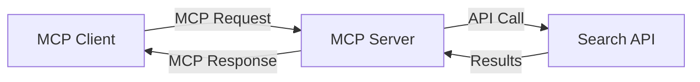
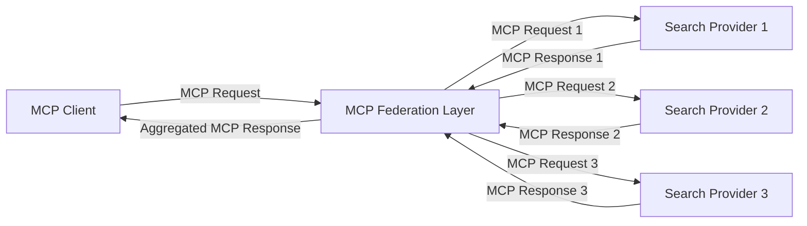
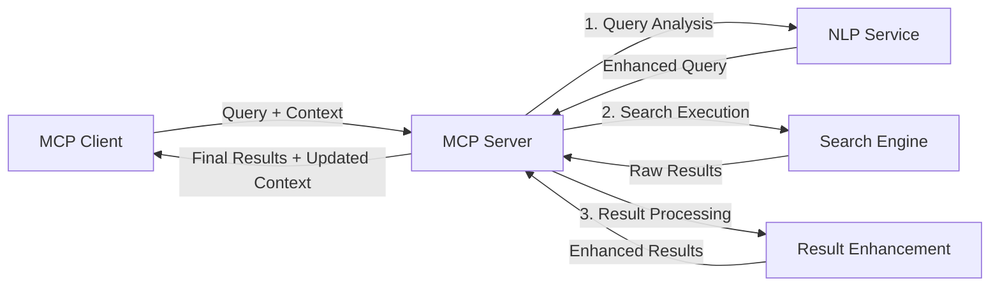

<!--
CO_OP_TRANSLATOR_METADATA:
{
  "original_hash": "eb12652eb7bd17f2193b835a344425c6",
  "translation_date": "2025-06-26T14:29:50+00:00",
  "source_file": "05-AdvancedTopics/mcp-realtimesearch/README.md",
  "language_code": "uk"
}
-->
## Відмова від відповідальності щодо прикладів коду

> **Важлива примітка**: наведені нижче приклади коду демонструють інтеграцію Model Context Protocol (MCP) із функціоналом веб-пошуку. Хоч вони й слідують паттернам і структурам офіційних MCP SDK, їх було спрощено для освітніх цілей.
> 
> Ці приклади ілюструють:
> 
> 1. **Реалізація на Python**: сервер FastMCP, який надає інструмент веб-пошуку та підключається до зовнішнього API пошуку. Приклад показує правильне управління життєвим циклом, обробку контексту та реалізацію інструменту відповідно до паттернів [офіційного MCP Python SDK](https://github.com/modelcontextprotocol/python-sdk). Сервер використовує рекомендований транспорт Streamable HTTP, що замінив старіший SSE транспорт для продуктивних розгортань.
> 
> 2. **Реалізація на JavaScript**: TypeScript/JavaScript реалізація за паттерном FastMCP з [офіційного MCP TypeScript SDK](https://github.com/modelcontextprotocol/typescript-sdk) для створення пошукового сервера з правильним визначенням інструментів і підключеннями клієнтів. Використовуються сучасні рекомендовані підходи до управління сесіями та збереження контексту.
> 
> Ці приклади потребують додаткової обробки помилок, автентифікації та інтеграції з API для продуктивного використання. Наведені кінцеві точки API пошуку (`https://api.search-service.example/search`) є заповнювачами і мають бути замінені на реальні сервіси.
> 
> Для повної реалізації та найактуальніших підходів звертайтеся до [офіційної специфікації MCP](https://spec.modelcontextprotocol.io/) та документації SDK.

## Основні концепції

### Фреймворк Model Context Protocol (MCP)

У своїй основі Model Context Protocol забезпечує стандартизований спосіб обміну контекстом між AI-моделями, додатками та сервісами. У реальному часі для веб-пошуку цей фреймворк є ключовим для створення послідовних пошукових сесій з багатьма запитами. Основні компоненти включають:

1. **Архітектура клієнт-сервер**: MCP встановлює чітке розмежування між клієнтами пошуку (ініціаторами запитів) та серверами пошуку (постачальниками), що дозволяє гнучко розгортати системи.

2. **Комунікація JSON-RPC**: протокол використовує JSON-RPC для обміну повідомленнями, що робить його сумісним з веб-технологіями та легким для впровадження на різних платформах.

3. **Управління контекстом**: MCP визначає структуровані методи для збереження, оновлення та використання контексту пошуку під час багатьох взаємодій.

4. **Визначення інструментів**: можливості пошуку представлені як стандартизовані інструменти з чітко визначеними параметрами та результатами.

5. **Підтримка стрімінгу**: протокол підтримує потокову передачу результатів, що важливо для пошуку в реальному часі, коли результати надходять поступово.

### Патерни інтеграції веб-пошуку

При інтеграції MCP з веб-пошуком виникають кілька типових схем:

#### 1. Пряма інтеграція з провайдером пошуку

У цьому патерні сервер MCP напряму взаємодіє з одним або кількома API пошуку, трансформуючи запити MCP у специфічні виклики API та форматуючи результати як відповіді MCP.

#### 2. Федеративний пошук із збереженням контексту

Цей патерн розподіляє пошукові запити між кількома MCP-сумісними провайдерами пошуку, кожен із яких може спеціалізуватися на різних типах контенту або функціоналу, при цьому підтримуючи єдиний контекст.

#### 3. Ланцюжок пошуку з покращенням контексту

У цьому патерні пошук поділено на кілька етапів, де на кожному кроці контекст збагачується, що призводить до поступового підвищення релевантності результатів.

### Компоненти контексту пошуку

У веб-пошуку на базі MCP контекст зазвичай включає:

- **Історія запитів**: попередні пошукові запити в сесії
- **Налаштування користувача**: мова, регіон, параметри безпечного пошуку
- **Історія взаємодій**: які результати було відкрито, час, проведений на сторінках
- **Параметри пошуку**: фільтри, порядок сортування та інші модифікатори
- **Предметні знання**: контекст, специфічний для теми пошуку
- **Часовий контекст**: фактори релевантності, що залежать від часу
- **Переваги джерел**: довірені або пріоритетні джерела інформації

## Випадки використання та застосування

### Дослідження та збір інформації

MCP покращує робочі процеси дослідників завдяки:

- Збереженню контексту дослідження між сесіями пошуку
- Можливості створення більш складних та контекстуально релевантних запитів
- Підтримці федерації пошуку по кількох джерелах
- Полегшенню вилучення знань із результатів пошуку

### Моніторинг новин і трендів у реальному часі

Пошук на базі MCP пропонує переваги для моніторингу новин:

- Майже миттєве виявлення нових подій
- Контекстуальне фільтрування релевантної інформації
- Відстеження тем і сутностей по різних джерелах
- Персоналізовані сповіщення на основі контексту користувача

### AI-підсилене переглядання та дослідження

MCP відкриває нові можливості для AI-підсиленого переглядання:

- Контекстуальні пропозиції пошуку на основі поточної активності браузера
- Безшовна інтеграція веб-пошуку з асистентами на основі великих мовних моделей (LLM)
- Багатокрокове уточнення пошуку з підтримкою контексту
- Покращена перевірка фактів та верифікація інформації

## Майбутні тенденції та інновації

### Еволюція MCP у веб-пошуку

У майбутньому очікується розвиток MCP для підтримки:

- **Мультимодального пошуку**: інтеграція текстового, зображень, аудіо та відео збереженим контекстом
- **Децентралізованого пошуку**: підтримка розподілених та федеративних пошукових екосистем
- **Конфіденційності пошуку**: контекстно-залежні механізми захисту приватності
- **Розуміння запитів**: глибокий семантичний аналіз природномовних запитів

### Потенційні технологічні досягнення

Технології, що формуватимуть майбутнє MCP-пошуку:

1. **Нейронні архітектури пошуку**: системи пошуку на основі ембедингів, оптимізовані для MCP
2. **Персоналізований контекст пошуку**: навчання індивідуальних моделей пошукової поведінки користувачів
3. **Інтеграція графів знань**: контекстуальний пошук із використанням предметно-орієнтованих графів знань
4. **Крос-модальний контекст**: підтримка контексту між різними модальностями пошуку

## Практичні вправи

### Вправа 1: Налаштування базового MCP-пошукового конвеєра

У цій вправі ви навчитеся:
- Конфігурувати базове MCP-середовище пошуку
- Реалізовувати обробники контексту для веб-пошуку
- Тестувати та перевіряти збереження контексту між ітераціями пошуку

### Вправа 2: Створення помічника для досліджень із MCP-пошуком

Розробіть повноцінний додаток, який:
- Обробляє питання природною мовою для досліджень
- Виконує контекстно-залежний веб-пошук
- Синтезує інформацію з кількох джерел
- Представляє організовані результати дослідження

### Вправа 3: Реалізація федерації пошуку з кількох джерел за допомогою MCP

Розширена вправа, що охоплює:
- Контекстно-залежне направлення запитів до кількох пошукових систем
- Ранжування та агрегацію результатів
- Контекстне усунення дублювань у результатах пошуку
- Обробку специфічних метаданих джерел

## Додаткові ресурси

- [Model Context Protocol Specification](https://spec.modelcontextprotocol.io/) - офіційна специфікація MCP та детальна документація протоколу
- [Model Context Protocol Documentation](https://modelcontextprotocol.io/) - докладні посібники та керівництва з реалізації
- [MCP Python SDK](https://github.com/modelcontextprotocol/python-sdk) - офіційна Python-реалізація протоколу MCP
- [MCP TypeScript SDK](https://github.com/modelcontextprotocol/typescript-sdk) - офіційна TypeScript-реалізація протоколу MCP
- [MCP Reference Servers](https://github.com/modelcontextprotocol/servers) - референсні реалізації MCP-серверів
- [Bing Web Search API Documentation](https://learn.microsoft.com/en-us/bing/search-apis/bing-web-search/overview) - API веб-пошуку Microsoft
- [Google Custom Search JSON API](https://developers.google.com/custom-search/v1/overview) - програмований пошуковий движок Google
- [SerpAPI Documentation](https://serpapi.com/search-api) - API сторінок результатів пошуку
- [Meilisearch Documentation](https://www.meilisearch.com/docs) - пошуковий движок з відкритим кодом
- [Elasticsearch Documentation](https://www.elastic.co/guide/index.html) - розподілений пошуковий та аналітичний движок
- [LangChain Documentation](https://python.langchain.com/docs/get_started/introduction) - створення додатків з LLM

## Результати навчання

Після проходження цього модуля ви зможете:

- Розуміти основи веб-пошуку в реальному часі та його виклики
- Пояснювати, як Model Context Protocol (MCP) покращує можливості веб-пошуку в реальному часі
- Реалізовувати пошукові рішення на базі MCP із використанням популярних фреймворків та API
- Проектувати та розгортати масштабовані, високопродуктивні пошукові архітектури з MCP
- Застосовувати концепції MCP у різних випадках використання, включаючи семантичний пошук, допомогу в дослідженнях та AI-підсилене переглядання
- Оцінювати нові тенденції та майбутні інновації в MCP-пошукових технологіях

### Розгляд питань довіри та безпеки

При реалізації веб-пошукових рішень на базі MCP пам’ятайте про важливі принципи зі специфікації MCP:

1. **Згода та контроль користувача**: користувачі повинні явно погоджуватися і розуміти всі операції та доступ до даних. Це особливо важливо для веб-пошуку, що може звертатися до зовнішніх джерел.

2. **Конфіденційність даних**: забезпечуйте належну обробку запитів і результатів пошуку, особливо якщо вони можуть містити чутливу інформацію. Впроваджуйте відповідні механізми контролю доступу для захисту даних користувачів.

3. **Безпека інструментів**: реалізуйте правильну авторизацію та валідацію для пошукових інструментів, оскільки вони можуть становити потенційну загрозу через виконання довільного коду. Опис поведінки інструментів слід вважати ненадійним, якщо він не отриманий із довіреного сервера.

4. **Чітка документація**: надавайте зрозумілу документацію про можливості, обмеження та питання безпеки вашої реалізації MCP-пошуку, дотримуючись рекомендацій зі специфікації MCP.

5. **Надійні потоки згоди**: створюйте надійні механізми отримання згоди та авторизації, які чітко пояснюють функції кожного інструменту перед його використанням, особливо для інструментів, що взаємодіють із зовнішніми веб-ресурсами.

Для повної інформації про безпеку та довіру в MCP звертайтеся до [офіційної документації](https://modelcontextprotocol.io/specification/2025-03-26#security-and-trust-%26-safety).

## Що далі

- [5.11 Аутентифікація Entra ID для серверів Model Context Protocol](../mcp-security-entra/README.md)

**Відмова від відповідальності**:  
Цей документ було перекладено за допомогою сервісу автоматичного перекладу [Co-op Translator](https://github.com/Azure/co-op-translator). Хоча ми прагнемо до точності, будь ласка, майте на увазі, що автоматичні переклади можуть містити помилки або неточності. Оригінальний документ рідною мовою слід вважати авторитетним джерелом. Для критично важливої інформації рекомендується звертатися до професійного людського перекладу. Ми не несемо відповідальності за будь-які непорозуміння або неправильні тлумачення, що виникли внаслідок використання цього перекладу.