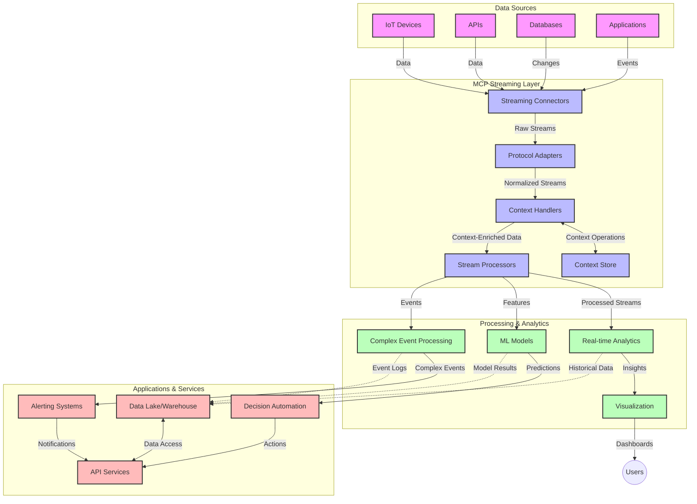

<!--
CO_OP_TRANSLATOR_METADATA:
{
  "original_hash": "195f7287638b77a549acadd96c8f981c",
  "translation_date": "2025-07-14T01:56:36+00:00",
  "source_file": "05-AdvancedTopics/mcp-realtimestreaming/README.md",
  "language_code": "uk"
}
-->
# Протокол Контексту Моделі для Потокової Обробки Даних у Реальному Часі

## Огляд

Потокова обробка даних у реальному часі стала необхідністю в сучасному світі, орієнтованому на дані, де бізнеси та додатки потребують миттєвого доступу до інформації для прийняття своєчасних рішень. Протокол Контексту Моделі (MCP) є значним кроком уперед у оптимізації цих процесів потокової обробки, підвищуючи ефективність обробки даних, зберігаючи контекстну цілісність і покращуючи загальну продуктивність системи.

Цей модуль розглядає, як MCP трансформує потокову обробку даних у реальному часі, забезпечуючи стандартизований підхід до управління контекстом між AI-моделями, потоковими платформами та додатками.

## Вступ до Потокової Обробки Даних у Реальному Часі

Потокова обробка даних у реальному часі — це технологічна парадигма, яка дозволяє безперервно передавати, обробляти та аналізувати дані в момент їх генерації, даючи змогу системам миттєво реагувати на нову інформацію. На відміну від традиційної пакетної обробки, що працює зі статичними наборами даних, потокова обробка оперує даними в русі, забезпечуючи інсайти та дії з мінімальною затримкою.

### Основні поняття потокової обробки даних у реальному часі:

- **Безперервний потік даних**: Дані обробляються як безперервний, нескінченний потік подій або записів.
- **Обробка з низькою затримкою**: Системи розроблені для мінімізації часу між генерацією та обробкою даних.
- **Масштабованість**: Архітектури потоків повинні справлятися з різними обсягами та швидкостями даних.
- **Відмовостійкість**: Системи мають бути стійкими до збоїв, щоб забезпечити безперервний потік даних.
- **Станова обробка**: Підтримка контексту між подіями є критичною для змістовного аналізу.

### Протокол Контексту Моделі та Потокова Обробка в Реальному Часі

Протокол Контексту Моделі (MCP) вирішує кілька ключових проблем у середовищах потокової обробки в реальному часі:

1. **Контекстуальна безперервність**: MCP стандартизує спосіб збереження контексту між розподіленими компонентами потоків, забезпечуючи AI-моделям і вузлам обробки доступ до релевантного історичного та оточуючого контексту.

2. **Ефективне управління станом**: Завдяки структурованим механізмам передачі контексту MCP знижує накладні витрати на управління станом у потокових конвеєрах.

3. **Інтероперабельність**: MCP створює спільну мову для обміну контекстом між різноманітними потоковими технологіями та AI-моделями, що дозволяє будувати більш гнучкі та розширювані архітектури.

4. **Оптимізований для потоків контекст**: Реалізації MCP можуть пріоритезувати найбільш релевантні елементи контексту для прийняття рішень у реальному часі, оптимізуючи як продуктивність, так і точність.

5. **Адаптивна обробка**: Завдяки правильному управлінню контекстом через MCP, потокові системи можуть динамічно коригувати обробку залежно від змінних умов і патернів у даних.

У сучасних додатках — від мереж IoT-сенсорів до фінансових торгових платформ — інтеграція MCP із потоковими технологіями забезпечує більш інтелектуальну, контекстно-усвідомлену обробку, здатну адекватно реагувати на складні, що розвиваються ситуації в реальному часі.

## Навчальні Цілі

Після проходження цього уроку ви зможете:

- Розуміти основи потокової обробки даних у реальному часі та її виклики
- Пояснювати, як Протокол Контексту Моделі (MCP) покращує потокову обробку даних у реальному часі
- Реалізовувати потокові рішення на основі MCP з використанням популярних фреймворків, таких як Kafka та Pulsar
- Проєктувати та впроваджувати відмовостійкі, високопродуктивні потокові архітектури з MCP
- Застосовувати концепції MCP у випадках використання IoT, фінансової торгівлі та аналітики на основі AI
- Оцінювати нові тенденції та майбутні інновації в технологіях потокової обробки на базі MCP

### Визначення та Значення

Потокова обробка даних у реальному часі передбачає безперервне генерування, обробку та доставку даних з мінімальною затримкою. На відміну від пакетної обробки, де дані збираються і обробляються групами, потокові дані обробляються поступово в міру надходження, що дозволяє отримувати миттєві інсайти та реагувати.

Ключові характеристики потокової обробки даних у реальному часі:

- **Низька затримка**: Обробка та аналіз даних за мілісекунди або секунди
- **Безперервний потік**: Неперервні потоки даних з різних джерел
- **Миттєва обробка**: Аналіз даних у момент їх надходження, а не пакетами
- **Архітектура, орієнтована на події**: Реагування на події у міру їх виникнення

### Виклики Традиційної Потокової Обробки Даних

Традиційні підходи до потокової обробки мають кілька обмежень:

1. **Втрата контексту**: Складно підтримувати контекст у розподілених системах
2. **Проблеми масштабованості**: Виклики при масштабуванні для обробки великих обсягів і швидкостей даних
3. **Складність інтеграції**: Проблеми сумісності між різними системами
4. **Управління затримками**: Балансування пропускної здатності та часу обробки
5. **Консистентність даних**: Забезпечення точності та повноти даних у потоці

## Розуміння Протоколу Контексту Моделі (MCP)

### Що таке MCP?

Протокол Контексту Моделі (MCP) — це стандартизований протокол комунікації, розроблений для ефективної взаємодії між AI-моделями та додатками. У контексті потокової обробки даних у реальному часі MCP забезпечує рамки для:

- Збереження контексту протягом усього конвеєра обробки даних
- Стандартизації форматів обміну даними
- Оптимізації передачі великих наборів даних
- Покращення комунікації між моделями та між моделями і додатками

### Основні компоненти та архітектура

Архітектура MCP для потокової обробки в реальному часі складається з кількох ключових компонентів:

1. **Обробники контексту**: Керують і підтримують контекстну інформацію в усьому потоковому конвеєрі
2. **Потокові процесори**: Обробляють вхідні потоки даних із використанням контекстно-орієнтованих методів
3. **Адаптери протоколів**: Конвертують між різними потоковими протоколами, зберігаючи контекст
4. **Сховище контексту**: Ефективно зберігає та отримує контекстну інформацію
5. **Потокові конектори**: Підключаються до різних потокових платформ (Kafka, Pulsar, Kinesis тощо)



### Як MCP покращує обробку даних у реальному часі

MCP вирішує традиційні проблеми потокової обробки через:

- **Контекстуальну цілісність**: Підтримка зв’язків між даними по всьому конвеєру
- **Оптимізовану передачу**: Зменшення надлишковості в обміні даними завдяки інтелектуальному управлінню контекстом
- **Стандартизовані інтерфейси**: Забезпечення послідовних API для потокових компонентів
- **Зниження затримок**: Мінімізація накладних витрат на обробку через ефективне управління контекстом
- **Покращену масштабованість**: Підтримка горизонтального масштабування з одночасним збереженням контексту

## Інтеграція та Впровадження

Системи потокової обробки даних у реальному часі потребують ретельного архітектурного проєктування та впровадження для збереження як продуктивності, так і контекстної цілісності. Протокол Контексту Моделі пропонує стандартизований підхід до інтеграції AI-моделей і потокових технологій, що дозволяє створювати більш складні, контекстно-усвідомлені конвеєри обробки.

### Огляд інтеграції MCP у потокові архітектури

Впровадження MCP у середовищах потокової обробки в реальному часі включає кілька ключових аспектів:

1. **Серіалізація та передача контексту**: MCP забезпечує ефективні механізми кодування контекстної інформації в потокових пакетах даних, гарантуючи, що важливий контекст супроводжує дані протягом усього конвеєра обробки. Це включає стандартизовані формати серіалізації, оптимізовані для потокової передачі.

2. **Станова обробка потоків**: MCP дозволяє більш інтелектуальну станова обробку, підтримуючи послідовне представлення контексту між вузлами обробки. Це особливо цінно в розподілених потокових архітектурах, де управління станом традиційно є складним.

3. **Час події проти часу обробки**: Реалізації MCP у потокових системах мають враховувати поширену проблему розрізнення часу виникнення подій і часу їх обробки. Протокол може включати часовий контекст, що зберігає семантику часу події.

4. **Управління зворотним тиском**: Стандартизуючи обробку контексту, MCP допомагає керувати зворотним тиском у потокових системах, дозволяючи компонентам повідомляти про свої можливості обробки та відповідно регулювати потік.

5. **Віконна агрегація контексту**: MCP полегшує більш складні операції віконної агрегації, надаючи структуровані представлення часових і відносних контекстів, що дозволяє отримувати більш змістовні агрегати по потоках подій.

6. **Обробка з гарантією exactly-once**: У потокових системах, які потребують семантики exactly-once, MCP може включати метадані обробки для відстеження та перевірки статусу обробки між розподіленими компонентами.

Впровадження MCP у різних потокових технологіях створює уніфікований підхід до управління контекстом, зменшуючи потребу у власноручному інтеграційному коді та підвищуючи здатність системи зберігати змістовний контекст у міру проходження даних через конвеєр.

### MCP у різних потокових фреймворках

Ці приклади відповідають поточній специфікації MCP, яка базується на протоколі JSON-RPC з різними транспортними механізмами. Код демонструє, як можна реалізувати власні транспорти, що інтегрують потокові платформи, такі як Kafka і Pulsar, з повною сумісністю з протоколом MCP.

Приклади показують, як потокові платформи можна інтегрувати з MCP для забезпечення обробки даних у реальному часі з одночасним збереженням контекстної обізнаності, що є центральним для MCP. Такий підхід гарантує, що кодові зразки точно відображають поточний стан специфікації MCP станом на червень 2025 року.

MCP можна інтегрувати з популярними потоковими фреймворками, зокрема:

#### Інтеграція Apache Kafka

```python
import asyncio
import json
from typing import Dict, Any, Optional
from confluent_kafka import Consumer, Producer, KafkaError
from mcp.client import Client, ClientCapabilities
from mcp.core.message import JsonRpcMessage
from mcp.core.transports import Transport

# Custom transport class to bridge MCP with Kafka
class KafkaMCPTransport(Transport):
    def __init__(self, bootstrap_servers: str, input_topic: str, output_topic: str):
        self.bootstrap_servers = bootstrap_servers
        self.input_topic = input_topic
        self.output_topic = output_topic
        self.producer = Producer({'bootstrap.servers': bootstrap_servers})
        self.consumer = Consumer({
            'bootstrap.servers': bootstrap_servers,
            'group.id': 'mcp-client-group',
            'auto.offset.reset': 'earliest'
        })
        self.message_queue = asyncio.Queue()
        self.running = False
        self.consumer_task = None
        
    async def connect(self):
        """Connect to Kafka and start consuming messages"""
        self.consumer.subscribe([self.input_topic])
        self.running = True
        self.consumer_task = asyncio.create_task(self._consume_messages())
        return self
        
    async def _consume_messages(self):
        """Background task to consume messages from Kafka and queue them for processing"""
        while self.running:
            try:
                msg = self.consumer.poll(1.0)
                if msg is None:
                    await asyncio.sleep(0.1)
                    continue
                
                if msg.error():
                    if msg.error().code() == KafkaError._PARTITION_EOF:
                        continue
                    print(f"Consumer error: {msg.error()}")
                    continue
                
                # Parse the message value as JSON-RPC
                try:
                    message_str = msg.value().decode('utf-8')
                    message_data = json.loads(message_str)
                    mcp_message = JsonRpcMessage.from_dict(message_data)
                    await self.message_queue.put(mcp_message)
                except Exception as e:
                    print(f"Error parsing message: {e}")
            except Exception as e:
                print(f"Error in consumer loop: {e}")
                await asyncio.sleep(1)
    
    async def read(self) -> Optional[JsonRpcMessage]:
        """Read the next message from the queue"""
        try:
            message = await self.message_queue.get()
            return message
        except Exception as e:
            print(f"Error reading message: {e}")
            return None
    
    async def write(self, message: JsonRpcMessage) -> None:
        """Write a message to the Kafka output topic"""
        try:
            message_json = json.dumps(message.to_dict())
            self.producer.produce(
                self.output_topic,
                message_json.encode('utf-8'),
                callback=self._delivery_report
            )
            self.producer.poll(0)  # Trigger callbacks
        except Exception as e:
            print(f"Error writing message: {e}")
    
    def _delivery_report(self, err, msg):
        """Kafka producer delivery callback"""
        if err is not None:
            print(f'Message delivery failed: {err}')
        else:
            print(f'Message delivered to {msg.topic()} [{msg.partition()}]')
    
    async def close(self) -> None:
        """Close the transport"""
        self.running = False
        if self.consumer_task:
            self.consumer_task.cancel()
            try:
                await self.consumer_task
            except asyncio.CancelledError:
                pass
        self.consumer.close()
        self.producer.flush()

# Example usage of the Kafka MCP transport
async def kafka_mcp_example():
    # Create MCP client with Kafka transport
    client = Client(
        {"name": "kafka-mcp-client", "version": "1.0.0"},
        ClientCapabilities({})
    )
    
    # Create and connect the Kafka transport
    transport = KafkaMCPTransport(
        bootstrap_servers="localhost:9092",
        input_topic="mcp-responses",
        output_topic="mcp-requests"
    )
    
    await client.connect(transport)
    
    try:
        # Initialize the MCP session
        await client.initialize()
        
        # Example of executing a tool via MCP
        response = await client.execute_tool(
            "process_data",
            {
                "data": "sample data",
                "metadata": {
                    "source": "sensor-1",
                    "timestamp": "2025-06-12T10:30:00Z"
                }
            }
        )
        
        print(f"Tool execution response: {response}")
        
        # Clean shutdown
        await client.shutdown()
    finally:
        await transport.close()

# Run the example
if __name__ == "__main__":
    asyncio.run(kafka_mcp_example())
```

#### Реалізація Apache Pulsar

```python
import asyncio
import json
import pulsar
from typing import Dict, Any, Optional
from mcp.core.message import JsonRpcMessage
from mcp.core.transports import Transport
from mcp.server import Server, ServerOptions
from mcp.server.tools import Tool, ToolExecutionContext, ToolMetadata

# Create a custom MCP transport that uses Pulsar
class PulsarMCPTransport(Transport):
    def __init__(self, service_url: str, request_topic: str, response_topic: str):
        self.service_url = service_url
        self.request_topic = request_topic
        self.response_topic = response_topic
        self.client = pulsar.Client(service_url)
        self.producer = self.client.create_producer(response_topic)
        self.consumer = self.client.subscribe(
            request_topic,
            "mcp-server-subscription",
            consumer_type=pulsar.ConsumerType.Shared
        )
        self.message_queue = asyncio.Queue()
        self.running = False
        self.consumer_task = None
    
    async def connect(self):
        """Connect to Pulsar and start consuming messages"""
        self.running = True
        self.consumer_task = asyncio.create_task(self._consume_messages())
        return self
    
    async def _consume_messages(self):
        """Background task to consume messages from Pulsar and queue them for processing"""
        while self.running:
            try:
                # Non-blocking receive with timeout
                msg = self.consumer.receive(timeout_millis=500)
                
                # Process the message
                try:
                    message_str = msg.data().decode('utf-8')
                    message_data = json.loads(message_str)
                    mcp_message = JsonRpcMessage.from_dict(message_data)
                    await self.message_queue.put(mcp_message)
                    
                    # Acknowledge the message
                    self.consumer.acknowledge(msg)
                except Exception as e:
                    print(f"Error processing message: {e}")
                    # Negative acknowledge if there was an error
                    self.consumer.negative_acknowledge(msg)
            except Exception as e:
                # Handle timeout or other exceptions
                await asyncio.sleep(0.1)
    
    async def read(self) -> Optional[JsonRpcMessage]:
        """Read the next message from the queue"""
        try:
            message = await self.message_queue.get()
            return message
        except Exception as e:
            print(f"Error reading message: {e}")
            return None
    
    async def write(self, message: JsonRpcMessage) -> None:
        """Write a message to the Pulsar output topic"""
        try:
            message_json = json.dumps(message.to_dict())
            self.producer.send(message_json.encode('utf-8'))
        except Exception as e:
            print(f"Error writing message: {e}")
    
    async def close(self) -> None:
        """Close the transport"""
        self.running = False
        if self.consumer_task:
            self.consumer_task.cancel()
            try:
                await self.consumer_task
            except asyncio.CancelledError:
                pass
        self.consumer.close()
        self.producer.close()
        self.client.close()

# Define a sample MCP tool that processes streaming data
@Tool(
    name="process_streaming_data",
    description="Process streaming data with context preservation",
    metadata=ToolMetadata(
        required_capabilities=["streaming"]
    )
)
async def process_streaming_data(
    ctx: ToolExecutionContext,
    data: str,
    source: str,
    priority: str = "medium"
) -> Dict[str, Any]:
    """
    Process streaming data while preserving context
    
    Args:
        ctx: Tool execution context
        data: The data to process
        source: The source of the data
        priority: Priority level (low, medium, high)
        
    Returns:
        Dict containing processed results and context information
    """
    # Example processing that leverages MCP context
    print(f"Processing data from {source} with priority {priority}")
    
    # Access conversation context from MCP
    conversation_id = ctx.conversation_id if hasattr(ctx, 'conversation_id') else "unknown"
    
    # Return results with enhanced context
    return {
        "processed_data": f"Processed: {data}",
        "context": {
            "conversation_id": conversation_id,
            "source": source,
            "priority": priority,
            "processing_timestamp": ctx.get_current_time_iso()
        }
    }

# Example MCP server implementation using Pulsar transport
async def run_mcp_server_with_pulsar():
    # Create MCP server
    server = Server(
        {"name": "pulsar-mcp-server", "version": "1.0.0"},
        ServerOptions(
            capabilities={"streaming": True}
        )
    )
    
    # Register our tool
    server.register_tool(process_streaming_data)
    
    # Create and connect Pulsar transport
    transport = PulsarMCPTransport(
        service_url="pulsar://localhost:6650",
        request_topic="mcp-requests",
        response_topic="mcp-responses"
    )
    
    try:
        # Start the server with the Pulsar transport
        await server.run(transport)
    finally:
        await transport.close()

# Run the server
if __name__ == "__main__":
    asyncio.run(run_mcp_server_with_pulsar())
```

### Кращі практики для розгортання

При впровадженні MCP для потокової обробки:

1. **Проєктуйте з урахуванням відмовостійкості**:
   - Реалізуйте належну обробку помилок
   - Використовуйте черги dead-letter для невдалих повідомлень
   - Проєктуйте ідемпотентні процесори

2. **Оптимізуйте продуктивність**:
   - Налаштовуйте відповідні розміри буферів
   - Використовуйте пакетну обробку там, де це доречно
   - Реалізуйте механізми зворотного тиску

3. **Моніторинг та спостереження**:
   - Відстежуйте метрики обробки потоків
   - Контролюйте поширення контексту
   - Налаштовуйте сповіщення про аномалії

4. **Захищайте свої потоки**:
   - Реалізуйте шифрування для конфіденційних даних
   - Використовуйте аутентифікацію та авторизацію
   - Застосовуйте належний контроль доступу

### MCP в IoT та Edge Computing

MCP покращує потокову обробку IoT за рахунок:

- Збереження контексту пристроїв у конвеєрі обробки
- Забезпечення ефективної потокової передачі даних від edge до хмари
- Підтримки аналітики в реальному часі на потоках IoT-даних
- Сприяння комунікації пристрій-пристрій з контекстом

Приклад: Мережі сенсорів розумного міста  
```
Sensors → Edge Gateways → MCP Stream Processors → Real-time Analytics → Automated Responses
```

### Роль у фінансових транзакціях та високочастотній торгівлі

MCP надає значні переваги для потокової обробки фінансових даних:

- Наднизька затримка обробки для торгових рішень
- Збереження контексту транзакцій протягом обробки
- Підтримка складної обробки подій з контекстною обізнаністю
- Забезпечення консистентності даних у розподілених торгових системах

### Покращення аналітики на основі AI

MCP відкриває нові можливості для потокової аналітики:

- Навчання моделей і висновки в реальному часі
- Безперервне навчання на потоках даних
- Контекстно-усвідомлене вилучення ознак
- Конвеєри багатомодельного висновку з збереженим контекстом

## Майбутні Тенденції та Інновації

### Еволюція MCP у реальному часі

У майбутньому очікується, що MCP розвиватиметься для вирішення:

- **Інтеграції квантових обчислень**: Підготовка до квантових потокових систем
- **Обробки на edge-пристроях**: Перенесення більшої частини контекстно-усвідомленої обробки на edge
- **Автономного управління потоками**: Самооптимізуючіся потокові конвеєри
- **Федеративної потокової обробки**: Розподілена обробка з дотриманням приватності

### Можливі технологічні прориви

Нові технології, що формуватимуть майбутнє MCP-потоків:

1. **AI-оптимізовані потокові протоколи**: Спеціалізовані протоколи для AI-навантажень
2. **Інтеграція нейроморфних обчислень**: Обчис

**Відмова від відповідальності**:  
Цей документ було перекладено за допомогою сервісу автоматичного перекладу [Co-op Translator](https://github.com/Azure/co-op-translator). Хоча ми прагнемо до точності, будь ласка, майте на увазі, що автоматичні переклади можуть містити помилки або неточності. Оригінальний документ рідною мовою слід вважати авторитетним джерелом. Для критично важливої інформації рекомендується звертатися до професійного людського перекладу. Ми не несемо відповідальності за будь-які непорозуміння або неправильні тлумачення, що виникли внаслідок використання цього перекладу.