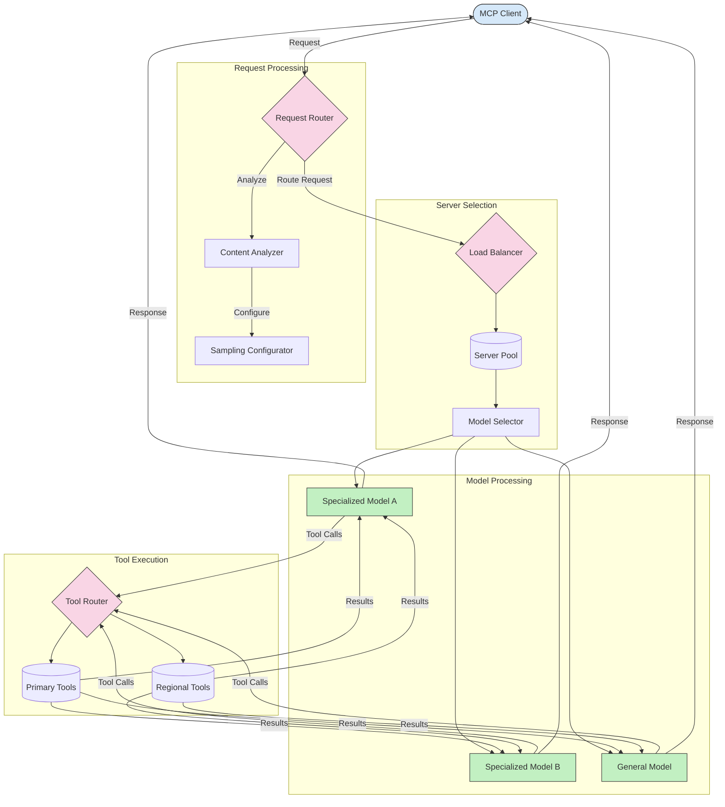

<!--
CO_OP_TRANSLATOR_METADATA:
{
  "original_hash": "af40eab7bd6ebf7e607f982a5506a5b5",
  "translation_date": "2025-06-17T16:59:52+00:00",
  "source_file": "05-AdvancedTopics/mcp-routing/README.md",
  "language_code": "uk"
}
-->
## Інтелектуальне балансування навантаження

Балансування навантаження оптимізує використання ресурсів і забезпечує високу доступність служб MCP. Існують різні способи реалізації балансування навантаження, такі як круговий розподіл, зважений час відповіді або стратегії, що враховують зміст.

Розглянемо приклад реалізації, який використовує наступні стратегії:

- **Круговий розподіл (Round Robin)**: Рівномірно розподіляє запити між доступними серверами.
- **Зважений час відповіді (Weighted Response Time)**: Направляє запити до серверів залежно від їх середнього часу відповіді.
- **З урахуванням змісту (Content-Aware)**: Направляє запити до спеціалізованих серверів на основі змісту запиту.

## Динамічне маршрутизування інструментів

Маршрутизування інструментів гарантує, що виклики інструментів спрямовуються до найбільш відповідної служби залежно від контексту. Наприклад, виклик погодного інструменту може потребувати маршрутизації до регіонального кінцевого пункту залежно від місцезнаходження користувача, або калькулятор може використовувати певну версію API.

Розглянемо приклад реалізації, який демонструє динамічне маршрутизування інструментів на основі аналізу запиту, регіональних кінцевих точок і підтримки версіонування.

## Архітектура вибірки та маршрутизації в MCP

Вибірка — це критично важливий компонент Model Context Protocol (MCP), який дозволяє ефективно обробляти запити та маршрутизувати їх. Вона включає аналіз вхідних запитів для визначення найбільш підходящої моделі або служби для їх обробки, враховуючи різні критерії, такі як тип змісту, контекст користувача та навантаження системи.

Вибірку та маршрутизацію можна поєднувати для створення надійної архітектури, що оптимізує використання ресурсів і забезпечує високу доступність. Процес вибірки може використовуватися для класифікації запитів, тоді як маршрутизація спрямовує їх до відповідних моделей або служб.

Нижче наведена діаграма, яка ілюструє, як вибірка та маршрутизація працюють разом у комплексній архітектурі MCP:

## Що далі

- [5.6 Sampling](../mcp-sampling/README.md)

**Відмова від відповідальності**:  
Цей документ було перекладено за допомогою сервісу автоматичного перекладу [Co-op Translator](https://github.com/Azure/co-op-translator). Хоча ми прагнемо до точності, будь ласка, майте на увазі, що автоматичні переклади можуть містити помилки або неточності. Оригінальний документ його рідною мовою слід вважати авторитетним джерелом. Для критично важливої інформації рекомендується звертатися до професійного людського перекладу. Ми не несемо відповідальності за будь-які непорозуміння або неправильні тлумачення, що виникли внаслідок використання цього перекладу.