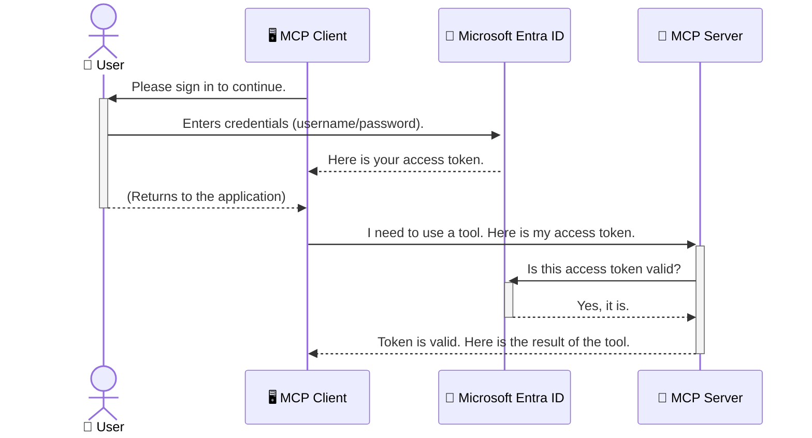

<!--
CO_OP_TRANSLATOR_METADATA:
{
  "original_hash": "6e562d7e5a77c8982da4aa8f762ad1d8",
  "translation_date": "2025-07-14T03:21:13+00:00",
  "source_file": "05-AdvancedTopics/mcp-security-entra/README.md",
  "language_code": "uk"
}
-->
# Захист AI-робочих процесів: автентифікація Entra ID для серверів Model Context Protocol

## Вступ  
Захист вашого сервера Model Context Protocol (MCP) так само важливий, як і замок на вхідних дверях вашого будинку. Якщо залишити сервер MCP відкритим, ваші інструменти та дані можуть стати доступними для неавторизованих користувачів, що може призвести до порушень безпеки. Microsoft Entra ID пропонує надійне хмарне рішення для управління ідентифікацією та доступом, яке допомагає гарантувати, що лише авторизовані користувачі та додатки можуть взаємодіяти з вашим сервером MCP. У цьому розділі ви дізнаєтеся, як захистити свої AI-робочі процеси за допомогою автентифікації Entra ID.

## Цілі навчання  
Після проходження цього розділу ви зможете:

- Усвідомити важливість захисту серверів MCP.  
- Пояснити основи Microsoft Entra ID та автентифікації OAuth 2.0.  
- Розрізняти публічних і конфіденційних клієнтів.  
- Реалізувати автентифікацію Entra ID у локальних (публічний клієнт) та віддалених (конфіденційний клієнт) сценаріях роботи MCP серверів.  
- Застосовувати найкращі практики безпеки при розробці AI-робочих процесів.

## Безпека та MCP  

Як і не залишати вхідні двері будинку незамкненими, не варто залишати сервер MCP відкритим для будь-кого. Захист AI-робочих процесів є необхідним для створення надійних, довірених і безпечних додатків. У цій главі ви дізнаєтеся, як використовувати Microsoft Entra ID для захисту серверів MCP, щоб лише авторизовані користувачі та додатки могли взаємодіяти з вашими інструментами та даними.

## Чому безпека важлива для серверів MCP  

Уявіть, що ваш сервер MCP має інструмент, який може надсилати електронні листи або отримувати доступ до бази даних клієнтів. Якщо сервер не захищений, будь-хто може скористатися цим інструментом, що призведе до несанкціонованого доступу до даних, спаму або інших шкідливих дій.

Впроваджуючи автентифікацію, ви гарантуєте, що кожен запит до сервера перевіряється, підтверджуючи особу користувача або додатка, який робить запит. Це перший і найважливіший крок у захисті ваших AI-робочих процесів.

## Вступ до Microsoft Entra ID  

[**Microsoft Entra ID**](https://adoption.microsoft.com/microsoft-security/entra/) — це хмарний сервіс управління ідентифікацією та доступом. Уявіть його як універсального охоронця безпеки для ваших додатків. Він обробляє складний процес перевірки особи користувачів (автентифікація) та визначення їхніх прав (авторизація).

Використовуючи Entra ID, ви можете:

- Забезпечити безпечний вхід для користувачів.  
- Захистити API та сервіси.  
- Керувати політиками доступу з єдиного центру.

Для серверів MCP Entra ID пропонує надійне та широко визнане рішення для контролю доступу до можливостей вашого сервера.

---

## Розуміння принципу роботи: як працює автентифікація Entra ID  

Entra ID використовує відкриті стандарти, такі як **OAuth 2.0**, для обробки автентифікації. Хоча деталі можуть бути складними, основна ідея проста і зрозуміла через аналогію.

### Легке знайомство з OAuth 2.0: ключ для парковщика  

Уявіть OAuth 2.0 як сервіс парковщика для вашого автомобіля. Коли ви приїжджаєте до ресторану, ви не даєте парковщику свій головний ключ. Натомість ви передаєте **ключ парковщика**, який має обмежені права — він може завести машину і зачинити двері, але не може відкрити багажник чи бардачок.

У цій аналогії:

- **Ви** — це **Користувач**.  
- **Ваш автомобіль** — це **сервер MCP** з цінними інструментами та даними.  
- **Парковщик** — це **Microsoft Entra ID**.  
- **Працівник паркування** — це **MCP клієнт** (додаток, що намагається отримати доступ до сервера).  
- **Ключ парковщика** — це **Access Token**.

Access token — це захищений текстовий рядок, який MCP клієнт отримує від Entra ID після вашого входу. Клієнт передає цей токен серверу MCP з кожним запитом. Сервер перевіряє токен, щоб упевнитися, що запит легітимний і клієнт має необхідні права, при цьому не обробляючи ваші реальні облікові дані (наприклад, пароль).

### Потік автентифікації  

Ось як цей процес працює на практиці:



### Знайомство з Microsoft Authentication Library (MSAL)  

Перед тим, як перейти до коду, важливо познайомитися з ключовим компонентом, який ви побачите у прикладах — **Microsoft Authentication Library (MSAL)**.

MSAL — це бібліотека, розроблена Microsoft, яка значно спрощує розробникам роботу з автентифікацією. Замість того, щоб писати складний код для обробки токенів безпеки, керування входами та оновлення сесій, MSAL виконує цю роботу за вас.

Використання бібліотеки MSAL настійно рекомендується, оскільки:

- **Вона безпечна:** реалізує стандартизовані протоколи та найкращі практики безпеки, знижуючи ризик вразливостей у вашому коді.  
- **Спрощує розробку:** приховує складність протоколів OAuth 2.0 та OpenID Connect, дозволяючи додати надійну автентифікацію до вашого додатка всього кількома рядками коду.  
- **Підтримується:** Microsoft активно підтримує та оновлює MSAL, щоб враховувати нові загрози безпеці та зміни платформ.

MSAL підтримує багато мов програмування та фреймворків, включно з .NET, JavaScript/TypeScript, Python, Java, Go, а також мобільні платформи iOS та Android. Це означає, що ви можете використовувати однакові патерни автентифікації у всьому вашому технологічному стеку.

Щоб дізнатися більше про MSAL, перегляньте офіційну [документацію огляду MSAL](https://learn.microsoft.com/entra/identity-platform/msal-overview).

---

## Захист вашого MCP сервера за допомогою Entra ID: покрокова інструкція  

Тепер розглянемо, як захистити локальний MCP сервер (який спілкується через `stdio`) за допомогою Entra ID. У цьому прикладі використовується **публічний клієнт**, що підходить для додатків, які працюють на машині користувача, наприклад, настільний додаток або локальний сервер розробки.

### Сценарій 1: Захист локального MCP сервера (з публічним клієнтом)  

У цьому сценарії ми розглянемо MCP сервер, який працює локально, спілкується через `stdio` і використовує Entra ID для автентифікації користувача перед наданням доступу до своїх інструментів. Сервер матиме один інструмент, який отримує інформацію профілю користувача з Microsoft Graph API.

#### 1. Налаштування додатка в Entra ID  

Перед написанням коду потрібно зареєструвати ваш додаток у Microsoft Entra ID. Це повідомляє Entra ID про ваш додаток і надає йому дозвіл використовувати сервіс автентифікації.

1. Перейдіть до **[порталу Microsoft Entra](https://entra.microsoft.com/)**.  
2. Відкрийте розділ **App registrations** і натисніть **New registration**.  
3. Введіть назву додатка (наприклад, "My Local MCP Server").  
4. Для **Supported account types** виберіть **Accounts in this organizational directory only**.  
5. Для цього прикладу поле **Redirect URI** можна залишити порожнім.  
6. Натисніть **Register**.

Після реєстрації запишіть **Application (client) ID** та **Directory (tenant) ID** — вони знадобляться у коді.

#### 2. Код: розбір  

Розглянемо ключові частини коду, які відповідають за автентифікацію. Повний код прикладу доступний у папці [Entra ID - Local - WAM](https://github.com/Azure-Samples/mcp-auth-servers/tree/main/src/entra-id-local-wam) репозиторію [mcp-auth-servers GitHub](https://github.com/Azure-Samples/mcp-auth-servers).

**`AuthenticationService.cs`**

Цей клас відповідає за взаємодію з Entra ID.

- **`CreateAsync`**: ініціалізує `PublicClientApplication` з MSAL, налаштований з `clientId` та `tenantId` вашого додатка.  
- **`WithBroker`**: дозволяє використовувати брокер (наприклад, Windows Web Account Manager), що забезпечує більш безпечний і зручний досвід єдиного входу.  
- **`AcquireTokenAsync`**: основний метод. Спочатку намагається отримати токен без взаємодії з користувачем (тихо). Якщо це не вдається, запитує користувача увійти в систему інтерактивно.

```csharp
// Simplified for clarity
public static async Task<AuthenticationService> CreateAsync(ILogger<AuthenticationService> logger)
{
    var msalClient = PublicClientApplicationBuilder
        .Create(_clientId) // Your Application (client) ID
        .WithAuthority(AadAuthorityAudience.AzureAdMyOrg)
        .WithTenantId(_tenantId) // Your Directory (tenant) ID
        .WithBroker(new BrokerOptions(BrokerOptions.OperatingSystems.Windows))
        .Build();

    // ... cache registration ...

    return new AuthenticationService(logger, msalClient);
}

public async Task<string> AcquireTokenAsync()
{
    try
    {
        // Try silent authentication first
        var accounts = await _msalClient.GetAccountsAsync();
        var account = accounts.FirstOrDefault();

        AuthenticationResult? result = null;

        if (account != null)
        {
            result = await _msalClient.AcquireTokenSilent(_scopes, account).ExecuteAsync();
        }
        else
        {
            // If no account, or silent fails, go interactive
            result = await _msalClient.AcquireTokenInteractive(_scopes).ExecuteAsync();
        }

        return result.AccessToken;
    }
    catch (Exception ex)
    {
        _logger.LogError(ex, "An error occurred while acquiring the token.");
        throw; // Optionally rethrow the exception for higher-level handling
    }
}
```

**`Program.cs`**

Тут налаштовується MCP сервер і інтегрується сервіс автентифікації.

- **`AddSingleton<AuthenticationService>`**: реєструє `AuthenticationService` у контейнері залежностей, щоб інші частини додатка (наприклад, інструмент) могли його використовувати.  
- Інструмент **`GetUserDetailsFromGraph`** потребує екземпляр `AuthenticationService`. Перед виконанням він викликає `authService.AcquireTokenAsync()`, щоб отримати дійсний access token. Якщо автентифікація успішна, токен використовується для виклику Microsoft Graph API і отримання даних користувача.

```csharp
// Simplified for clarity
[McpServerTool(Name = "GetUserDetailsFromGraph")]
public static async Task<string> GetUserDetailsFromGraph(
    AuthenticationService authService)
{
    try
    {
        // This will trigger the authentication flow
        var accessToken = await authService.AcquireTokenAsync();

        // Use the token to create a GraphServiceClient
        var graphClient = new GraphServiceClient(
            new BaseBearerTokenAuthenticationProvider(new TokenProvider(authService)));

        var user = await graphClient.Me.GetAsync();

        return System.Text.Json.JsonSerializer.Serialize(user);
    }
    catch (Exception ex)
    {
        return $"Error: {ex.Message}";
    }
}
```

#### 3. Як це працює разом  

1. Коли MCP клієнт намагається використати інструмент `GetUserDetailsFromGraph`, інструмент спочатку викликає `AcquireTokenAsync`.  
2. `AcquireTokenAsync` запускає MSAL для перевірки наявності дійсного токена.  
3. Якщо токен не знайдено, MSAL через брокер запропонує користувачу увійти в систему за допомогою облікового запису Entra ID.  
4. Після входу Entra ID видає access token.  
5. Інструмент отримує токен і використовує його для безпечного виклику Microsoft Graph API.  
6. Дані користувача повертаються MCP клієнту.

Цей процес гарантує, що лише автентифіковані користувачі можуть використовувати інструмент, ефективно захищаючи ваш локальний MCP сервер.

### Сценарій 2: Захист віддаленого MCP сервера (з конфіденційним клієнтом)  

Якщо ваш MCP сервер працює на віддаленій машині (наприклад, у хмарі) і спілкується через протокол HTTP Streaming, вимоги до безпеки відрізняються. У цьому випадку слід використовувати **конфіденційного клієнта** та **Authorization Code Flow**. Це більш безпечний метод, оскільки секрети додатка ніколи не передаються браузеру.

Цей приклад використовує MCP сервер на TypeScript, який обробляє HTTP-запити за допомогою Express.js.

#### 1. Налаштування додатка в Entra ID  

Налаштування в Entra ID схоже на публічного клієнта, але з однією важливою відмінністю — потрібно створити **секрет клієнта**.

1. Перейдіть до **[порталу Microsoft Entra](https://entra.microsoft.com/)**.  
2. У реєстрації вашого додатка відкрийте вкладку **Certificates & secrets**.  
3. Натисніть **New client secret**, введіть опис і натисніть **Add**.  
4. **Важливо:** негайно скопіюйте значення секрету. Після цього його більше не буде видно.  
5. Також потрібно налаштувати **Redirect URI**. Перейдіть на вкладку **Authentication**, натисніть **Add a platform**, виберіть **Web** і введіть redirect URI вашого додатка (наприклад, `http://localhost:3001/auth/callback`).

> **⚠️ Важлива примітка з безпеки:** Для продуктивних додатків Microsoft настійно рекомендує використовувати методи автентифікації без секретів, такі як **Managed Identity** або **Workload Identity Federation**, замість секретів клієнта. Секрети клієнта можуть бути викриті або скомпрометовані, що створює ризики безпеки. Керовані ідентичності забезпечують більш безпечний підхід, усуваючи необхідність зберігати облікові дані у коді або конфігурації.  
>  
> Для отримання додаткової інформації про керовані ідентичності та їх впровадження дивіться [Огляд керованих ідентичностей для ресурсів Azure](https://learn.microsoft.com/entra/identity/managed-identities-azure-resources/overview).

#### 2. Код: розбір  

Цей приклад використовує підхід на основі сесій. Коли користувач автентифікується, сервер зберігає access token і refresh token у сесії та видає користувачу токен сесії. Цей токен сесії потім використовується для наступних запитів. Повний код прикладу доступний у папці [Entra ID - Confidential client](https://github.com/Azure-Samples/mcp-auth-servers/tree/main/src/entra-id-cca-session) репозиторію [mcp-auth-servers GitHub](https://github.com/Azure-Samples/mcp-auth-servers).

**`Server.ts`**

Цей файл налаштовує сервер Express і транспортний шар MCP.

- **`requireBearerAuth`**: це middleware, який захищає кінцеві точки `/sse` та `/message`. Він перевіряє наявність дійсного bearer токена в заголовку `Authorization` запиту.  
- **`EntraIdServerAuthProvider`**: це кастомний клас, який реалізує інтерфейс `McpServerAuthorizationProvider`. Він відповідає за обробку OAuth 2.0 потоку.  
- **`/auth/callback`**: ця кінцева точка обробляє редирект від Entra ID після автентифікації користувача. Вона обмінює код авторизації на access token і refresh token.

```typescript
// Simplified for clarity
const app = express();
const { server } = createServer();
const provider = new EntraIdServerAuthProvider();

// Protect the SSE endpoint
app.get("/sse", requireBearerAuth({
  provider,
  requiredScopes: ["User.Read"]
}), async (req, res) => {
  // ... connect to the transport ...
});

// Protect the message endpoint
app.post("/message", requireBearerAuth({
  provider,
  requiredScopes: ["User.Read"]
}), async (req, res) => {
  // ... handle the message ...
});

// Handle the OAuth 2.0 callback
app.get("/auth/callback", (req, res) => {
  provider.handleCallback(req.query.code, req.query.state)
    .then(result => {
      // ... handle success or failure ...
    });
});
```

**`Tools.ts`**

Цей файл визначає інструменти, які надає MCP сервер. Інструмент `getUserDetails` схожий на той, що в попередньому прикладі, але отримує access token із сесії.

```typescript
// Simplified for clarity
server.setRequestHandler(CallToolRequestSchema, async (request) => {
  const { name } = request.params;
  const context = request.params?.context as { token?: string } | undefined;
  const sessionToken = context?.token;

  if (name === ToolName.GET_USER_DETAILS) {
    if (!sessionToken) {
      throw new AuthenticationError("Authentication token is missing or invalid. Ensure the token is provided in the request context.");
    }

    // Get the Entra ID token from the session store
    const tokenData = tokenStore.getToken(sessionToken);
    const entraIdToken = tokenData.accessToken;

    const graphClient = Client.init({
      authProvider: (done) => {
        done(null, entraIdToken);
      }
    });

    const user = await graphClient.api('/me').get();

    // ... return user details ...
  }
});
```

**`auth/EntraIdServerAuthProvider.ts`**

Цей клас відповідає за:

- Перенаправлення користувача на сторінку входу Entra ID.  
- Обмін коду авторизації на access token.  
- Збереження токенів у `tokenStore`.  
- Оновлення access token після його закінчення.

#### 3. Як це працює разом  

1. Коли користувач вперше намагається підключитися до MCP сервера, middleware `requireBearerAuth` бачить, що у нього немає дійсної сесії, і перенаправляє його на сторінку входу Entra ID.  
2. Користувач входить у систему за допомогою свого облікового запису Entra ID.  
3. Entra ID перенаправляє користувача назад на кінцеву точку `/auth/callback` з кодом авторизації.
4. Сервер обмінюється кодом на access token та refresh token, зберігає їх і створює session token, який надсилається клієнту.  
5. Тепер клієнт може використовувати цей session token у заголовку `Authorization` для всіх подальших запитів до MCP сервера.  
6. Коли викликається інструмент `getUserDetails`, він використовує session token для пошуку access token Entra ID, а потім за його допомогою викликає Microsoft Graph API.

Цей процес складніший за потік для публічного клієнта, але необхідний для інтернет-доступних кінцевих точок. Оскільки віддалені MCP сервери доступні через публічний інтернет, їм потрібні більш суворі заходи безпеки для захисту від несанкціонованого доступу та потенційних атак.


## Найкращі практики безпеки

- **Завжди використовуйте HTTPS**: Шифруйте зв’язок між клієнтом і сервером, щоб захистити токени від перехоплення.  
- **Впроваджуйте контроль доступу на основі ролей (RBAC)**: Перевіряйте не лише *чи* користувач автентифікований, а й *що* йому дозволено робити. Ви можете визначати ролі в Entra ID і перевіряти їх на вашому MCP сервері.  
- **Моніторинг та аудит**: Логування всіх подій автентифікації допоможе виявляти та реагувати на підозрілу активність.  
- **Обробка обмежень частоти запитів і тротлінгу**: Microsoft Graph та інші API застосовують обмеження частоти, щоб запобігти зловживанням. Реалізуйте експоненціальне збільшення інтервалів повторних спроб і логіку повторних запитів у вашому MCP сервері для коректної обробки відповідей HTTP 429 (Забагато запитів). Розгляньте кешування часто використовуваних даних, щоб зменшити кількість викликів API.  
- **Безпечне зберігання токенів**: Зберігайте access token та refresh token у безпечному місці. Для локальних додатків використовуйте системні механізми безпечного зберігання. Для серверних додатків розгляньте можливість використання зашифрованого сховища або сервісів керування ключами, таких як Azure Key Vault.  
- **Обробка терміну дії токенів**: Access token мають обмежений термін дії. Реалізуйте автоматичне оновлення токенів за допомогою refresh token, щоб забезпечити безперервний користувацький досвід без необхідності повторної автентифікації.  
- **Розгляньте використання Azure API Management**: Хоча реалізація безпеки безпосередньо у вашому MCP сервері дає гнучкий контроль, API Gateway, такі як Azure API Management, можуть автоматично вирішувати багато питань безпеки, включно з автентифікацією, авторизацією, обмеженням частоти та моніторингом. Вони забезпечують централізований рівень безпеки між вашими клієнтами та MCP серверами. Детальніше про використання API Gateway з MCP дивіться у нашій статті [Azure API Management Your Auth Gateway For MCP Servers](https://techcommunity.microsoft.com/blog/integrationsonazureblog/azure-api-management-your-auth-gateway-for-mcp-servers/4402690).


## Основні висновки

- Захист MCP сервера є критично важливим для безпеки ваших даних і інструментів.  
- Microsoft Entra ID пропонує надійне та масштабоване рішення для автентифікації та авторизації.  
- Використовуйте **публічного клієнта** для локальних додатків і **конфіденційного клієнта** для віддалених серверів.  
- **Authorization Code Flow** — найнадійніший варіант для веб-додатків.


## Вправа

1. Подумайте про MCP сервер, який ви могли б створити. Чи буде це локальний сервер чи віддалений?  
2. Виходячи з вашої відповіді, який тип клієнта ви б використали: публічний чи конфіденційний?  
3. Які дозволи ваш MCP сервер запитуватиме для виконання дій у Microsoft Graph?


## Практичні вправи

### Вправа 1: Зареєструйте додаток в Entra ID  
Перейдіть до порталу Microsoft Entra.  
Зареєструйте новий додаток для вашого MCP сервера.  
Запишіть Application (client) ID та Directory (tenant) ID.

### Вправа 2: Захистіть локальний MCP сервер (публічний клієнт)  
- Виконайте інтеграцію MSAL (Microsoft Authentication Library) для автентифікації користувача за прикладом коду.  
- Перевірте процес автентифікації, викликавши інструмент MCP, який отримує деталі користувача з Microsoft Graph.

### Вправа 3: Захистіть віддалений MCP сервер (конфіденційний клієнт)  
- Зареєструйте конфіденційного клієнта в Entra ID та створіть client secret.  
- Налаштуйте ваш MCP сервер на Express.js для використання Authorization Code Flow.  
- Перевірте захищені кінцеві точки та підтвердіть доступ на основі токенів.

### Вправа 4: Застосуйте найкращі практики безпеки  
- Увімкніть HTTPS для вашого локального або віддаленого сервера.  
- Впровадьте контроль доступу на основі ролей (RBAC) у логіці сервера.  
- Додайте обробку терміну дії токенів та безпечне зберігання токенів.

## Ресурси

1. **Огляд MSAL**  
   Дізнайтеся, як Microsoft Authentication Library (MSAL) забезпечує безпечне отримання токенів на різних платформах:  
   [MSAL Overview on Microsoft Learn](https://learn.microsoft.com/en-gb/entra/msal/overview)

2. **Репозиторій Azure-Samples/mcp-auth-servers на GitHub**  
   Приклади реалізації MCP серверів з демонстрацією потоків автентифікації:  
   [Azure-Samples/mcp-auth-servers on GitHub](https://github.com/Azure-Samples/mcp-auth-servers)

3. **Огляд керованих ідентичностей для ресурсів Azure**  
   Дізнайтеся, як позбутися секретів, використовуючи системні або призначені користувачем керовані ідентичності:  
   [Managed Identities Overview on Microsoft Learn](https://learn.microsoft.com/en-us/entra/identity/managed-identities-azure-resources/)

4. **Azure API Management: Ваш шлюз автентифікації для MCP серверів**  
   Детальний огляд використання APIM як безпечного шлюзу OAuth2 для MCP серверів:  
   [Azure API Management Your Auth Gateway For MCP Servers](https://techcommunity.microsoft.com/blog/integrationsonazureblog/azure-api-management-your-auth-gateway-for-mcp-servers/4402690)

5. **Довідник дозволів Microsoft Graph**  
   Повний перелік делегованих та прикладних дозволів для Microsoft Graph:  
   [Microsoft Graph Permissions Reference](https://learn.microsoft.com/zh-tw/graph/permissions-reference)


## Результати навчання  
Після проходження цього розділу ви зможете:

- Пояснити, чому автентифікація є критичною для MCP серверів та AI робочих процесів.  
- Налаштувати та сконфігурувати автентифікацію Entra ID для локальних і віддалених MCP серверів.  
- Обрати відповідний тип клієнта (публічний або конфіденційний) залежно від розгортання сервера.  
- Впроваджувати безпечні практики кодування, включно зі зберіганням токенів та авторизацією на основі ролей.  
- Надійно захищати ваш MCP сервер та його інструменти від несанкціонованого доступу.

## Що далі

- [5.13 Інтеграція Model Context Protocol (MCP) з Azure AI Foundry](../mcp-foundry-agent-integration/README.md)

**Відмова від відповідальності**:  
Цей документ було перекладено за допомогою сервісу автоматичного перекладу [Co-op Translator](https://github.com/Azure/co-op-translator). Хоча ми прагнемо до точності, будь ласка, майте на увазі, що автоматичні переклади можуть містити помилки або неточності. Оригінальний документ рідною мовою слід вважати авторитетним джерелом. Для критично важливої інформації рекомендується звертатися до професійного людського перекладу. Ми не несемо відповідальності за будь-які непорозуміння або неправильні тлумачення, що виникли внаслідок використання цього перекладу.