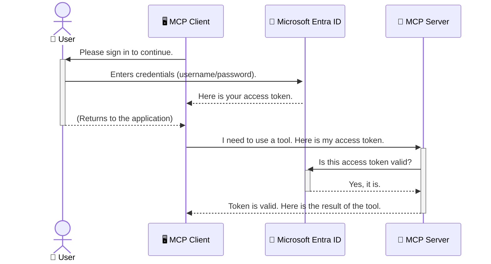

<!--
CO_OP_TRANSLATOR_METADATA:
{
  "original_hash": "9abe1d303ab126f9a8b87f03cebe5213",
  "translation_date": "2025-06-26T15:03:45+00:00",
  "source_file": "05-AdvancedTopics/mcp-security-entra/README.md",
  "language_code": "uk"
}
-->
# Захист AI-робочих процесів: Аутентифікація Entra ID для серверів Model Context Protocol

## Вступ  
Захист вашого сервера Model Context Protocol (MCP) так само важливий, як і замок на вхідних дверях вашого будинку. Відкритий сервер MCP робить ваші інструменти та дані вразливими до несанкціонованого доступу, що може призвести до порушень безпеки. Microsoft Entra ID пропонує надійне хмарне рішення для керування ідентифікацією та доступом, яке допомагає гарантувати, що лише авторизовані користувачі та додатки можуть взаємодіяти з вашим сервером MCP. У цьому розділі ви дізнаєтесь, як захистити свої AI-робочі процеси за допомогою аутентифікації Entra ID.

## Цілі навчання  
Після проходження цього розділу ви зможете:

- Усвідомити важливість захисту серверів MCP.  
- Пояснити основи Microsoft Entra ID та аутентифікації OAuth 2.0.  
- Визначати різницю між публічними та конфіденційними клієнтами.  
- Реалізувати аутентифікацію Entra ID як для локальних (публічний клієнт), так і для віддалених (конфіденційний клієнт) сценаріїв роботи серверів MCP.  
- Застосовувати найкращі практики безпеки при розробці AI-робочих процесів.  

# Захист AI-робочих процесів: Аутентифікація Entra ID для серверів Model Context Protocol

Так само, як ви не залишаєте вхідні двері свого будинку незамкненими, не варто залишати сервер MCP відкритим для доступу будь-кого. Захист ваших AI-робочих процесів є ключовим для створення надійних, довірених і безпечних додатків. У цій главі ми познайомимо вас із використанням Microsoft Entra ID для захисту серверів MCP, щоб лише авторизовані користувачі та додатки могли взаємодіяти з вашими інструментами та даними.

## Чому безпека важлива для серверів MCP

Уявіть, що ваш сервер MCP має інструмент, який може надсилати електронні листи або отримувати доступ до бази даних клієнтів. Незахищений сервер означатиме, що будь-хто може потенційно скористатися цим інструментом, що призведе до несанкціонованого доступу до даних, спаму чи інших шкідливих дій.

Завдяки впровадженню аутентифікації ви гарантуєте, що кожен запит до вашого сервера перевіряється, підтверджуючи особу користувача або додатка, який робить запит. Це перший і найважливіший крок у захисті ваших AI-робочих процесів.

## Вступ до Microsoft Entra ID

**Microsoft Entra ID** — це хмарний сервіс для керування ідентифікацією та доступом. Уявіть його як універсального охоронця безпеки для ваших додатків. Він обробляє складний процес перевірки особи користувача (аутентифікація) та визначення, що їм дозволено робити (авторизація).

Використовуючи Entra ID, ви можете:

- Забезпечити безпечний вхід користувачів.  
- Захистити API та сервіси.  
- Керувати політиками доступу з одного центру.  

Для серверів MCP Entra ID пропонує надійне та широко визнане рішення для керування тим, хто може отримати доступ до можливостей вашого сервера.

---

## Як працює аутентифікація Entra ID

Entra ID використовує відкриті стандарти, такі як **OAuth 2.0**, для обробки аутентифікації. Хоча деталі можуть бути складними, основна ідея проста і легко пояснюється на прикладі.

### Легке знайомство з OAuth 2.0: ключ від парковщика

Уявіть OAuth 2.0 як сервіс парковки для вашої машини. Коли ви приїжджаєте до ресторану, ви не даєте парковщику свій головний ключ. Замість цього ви даєте **ключ від парковщика**, який має обмежені права — він може завести машину і закрити двері, але не може відкрити багажник чи бардачок.

У цій аналогії:

- **Ви** — це **Користувач**.  
- **Ваша машина** — це **сервер MCP** з його цінними інструментами та даними.  
- **Парковщик** — це **Microsoft Entra ID**.  
- **Паркувальник** — це **MCP клієнт** (додаток, який намагається отримати доступ до сервера).  
- **Ключ від парковщика** — це **токен доступу**.  

Токен доступу — це безпечний рядок тексту, який MCP клієнт отримує від Entra ID після вашого входу. Клієнт передає цей токен серверу MCP з кожним запитом. Сервер може перевірити токен, щоб упевнитися, що запит законний і що клієнт має необхідні дозволи, і при цьому ніколи не обробляє ваші реальні облікові дані (наприклад, пароль).

### Процес аутентифікації

Ось як це працює на практиці:



### Знайомство з Microsoft Authentication Library (MSAL)

Перед тим, як перейти до коду, важливо познайомитись із ключовим компонентом, який ви побачите у прикладах: **Microsoft Authentication Library (MSAL)**.

MSAL — це бібліотека, розроблена Microsoft, яка значно полегшує розробникам роботу з аутентифікацією. Замість того, щоб писати складний код для обробки безпечних токенів, керування входами та оновлення сесій, MSAL бере на себе основну роботу.

Використання бібліотеки MSAL настійно рекомендується, оскільки:

- **Вона безпечна:** реалізує стандарти індустрії та найкращі практики безпеки, зменшуючи ризик уразливостей у вашому коді.  
- **Спрощує розробку:** приховує складність протоколів OAuth 2.0 та OpenID Connect, дозволяючи додати надійну аутентифікацію у ваш додаток за кілька рядків коду.  
- **Підтримується:** Microsoft активно підтримує і оновлює MSAL для захисту від нових загроз і змін платформ.  

MSAL підтримує широкий спектр мов і фреймворків, включно з .NET, JavaScript/TypeScript, Python, Java, Go, а також мобільні платформи iOS та Android. Це означає, що ви можете використовувати однакові підходи до аутентифікації по всьому технологічному стеку.

Щоб дізнатися більше про MSAL, перегляньте офіційну [документацію огляду MSAL](https://learn.microsoft.com/entra/identity-platform/msal-overview).

---

## Захист вашого MCP сервера за допомогою Entra ID: покрокова інструкція

Тепер пройдемося по тому, як захистити локальний MCP сервер (той, що працює через `stdio`) using Entra ID. This example uses a **public client**, which is suitable for applications running on a user's machine, like a desktop app or a local development server.

### Scenario 1: Securing a Local MCP Server (with a Public Client)

In this scenario, we'll look at an MCP server that runs locally, communicates over `stdio`, and uses Entra ID to authenticate the user before allowing access to its tools. The server will have a single tool that fetches the user's profile information from the Microsoft Graph API.

#### 1. Setting Up the Application in Entra ID

Before writing any code, you need to register your application in Microsoft Entra ID. This tells Entra ID about your application and grants it permission to use the authentication service.

1. Navigate to the **[Microsoft Entra portal](https://entra.microsoft.com/)**.
2. Go to **App registrations** and click **New registration**.
3. Give your application a name (e.g., "My Local MCP Server").
4. For **Supported account types**, select **Accounts in this organizational directory only**.
5. You can leave the **Redirect URI** blank for this example.
6. Click **Register**.

Once registered, take note of the **Application (client) ID** and **Directory (tenant) ID**. You'll need these in your code.

#### 2. The Code: A Breakdown

Let's look at the key parts of the code that handle authentication. The full code for this example is available in the [Entra ID - Local - WAM](https://github.com/Azure-Samples/mcp-auth-servers/tree/main/src/entra-id-local-wam) folder of the [mcp-auth-servers GitHub repository](https://github.com/Azure-Samples/mcp-auth-servers).

**`AuthenticationService.cs`**

This class is responsible for handling the interaction with Entra ID.

- **`CreateAsync`**: This method initializes the `PublicClientApplication` from the MSAL (Microsoft Authentication Library). It's configured with your application's `clientId` and `tenantId`.
- **`WithBroker`**: This enables the use of a broker (like the Windows Web Account Manager), which provides a more secure and seamless single sign-on experience.
- **`AcquireTokenAsync`**: це основний метод. Спочатку він намагається отримати токен без взаємодії користувача (silent), щоб користувач не мусив знову входити, якщо сесія ще дійсна. Якщо отримати токен тихо не вдається, користувача буде запрошено увійти інтерактивно.

```csharp
// Simplified for clarity
public static async Task<AuthenticationService> CreateAsync(ILogger<AuthenticationService> logger)
{
    var msalClient = PublicClientApplicationBuilder
        .Create(_clientId) // Your Application (client) ID
        .WithAuthority(AadAuthorityAudience.AzureAdMyOrg)
        .WithTenantId(_tenantId) // Your Directory (tenant) ID
        .WithBroker(new BrokerOptions(BrokerOptions.OperatingSystems.Windows))
        .Build();

    // ... cache registration ...

    return new AuthenticationService(logger, msalClient);
}

public async Task<string> AcquireTokenAsync()
{
    try
    {
        // Try silent authentication first
        var accounts = await _msalClient.GetAccountsAsync();
        var account = accounts.FirstOrDefault();

        AuthenticationResult? result = null;

        if (account != null)
        {
            result = await _msalClient.AcquireTokenSilent(_scopes, account).ExecuteAsync();
        }
        else
        {
            // If no account, or silent fails, go interactive
            result = await _msalClient.AcquireTokenInteractive(_scopes).ExecuteAsync();
        }

        return result.AccessToken;
    }
    catch (Exception ex)
    {
        _logger.LogError(ex, "An error occurred while acquiring the token.");
        throw; // Optionally rethrow the exception for higher-level handling
    }
}
```

**`Program.cs`**

This is where the MCP server is set up and the authentication service is integrated.

- **`AddSingleton<AuthenticationService>`**: This registers the `AuthenticationService` with the dependency injection container, so it can be used by other parts of the application (like our tool).
- **`GetUserDetailsFromGraph` tool**: This tool requires an instance of `AuthenticationService`. Before it does anything, it calls `authService.AcquireTokenAsync()` отримує дійсний токен доступу. Якщо аутентифікація пройшла успішно, цей токен використовується для виклику Microsoft Graph API і отримання даних користувача.

```csharp
// Simplified for clarity
[McpServerTool(Name = "GetUserDetailsFromGraph")]
public static async Task<string> GetUserDetailsFromGraph(
    AuthenticationService authService)
{
    try
    {
        // This will trigger the authentication flow
        var accessToken = await authService.AcquireTokenAsync();

        // Use the token to create a GraphServiceClient
        var graphClient = new GraphServiceClient(
            new BaseBearerTokenAuthenticationProvider(new TokenProvider(authService)));

        var user = await graphClient.Me.GetAsync();

        return System.Text.Json.JsonSerializer.Serialize(user);
    }
    catch (Exception ex)
    {
        return $"Error: {ex.Message}";
    }
}
```

#### 3. Як це все працює разом

1. Коли MCP клієнт намагається викликати `GetUserDetailsFromGraph` tool, the tool first calls `AcquireTokenAsync`.
2. `AcquireTokenAsync` triggers the MSAL library to check for a valid token.
3. If no token is found, MSAL, through the broker, will prompt the user to sign in with their Entra ID account.
4. Once the user signs in, Entra ID issues an access token.
5. The tool receives the token and uses it to make a secure call to the Microsoft Graph API.
6. The user's details are returned to the MCP client.

This process ensures that only authenticated users can use the tool, effectively securing your local MCP server.

### Scenario 2: Securing a Remote MCP Server (with a Confidential Client)

When your MCP server is running on a remote machine (like a cloud server) and communicates over a protocol like HTTP Streaming, the security requirements are different. In this case, you should use a **confidential client** and the **Authorization Code Flow**. This is a more secure method because the application's secrets are never exposed to the browser.

This example uses a TypeScript-based MCP server that uses Express.js to handle HTTP requests.

#### 1. Setting Up the Application in Entra ID

The setup in Entra ID is similar to the public client, but with one key difference: you need to create a **client secret**.

1. Navigate to the **[Microsoft Entra portal](https://entra.microsoft.com/)**.
2. In your app registration, go to the **Certificates & secrets** tab.
3. Click **New client secret**, give it a description, and click **Add**.
4. **Important:** Copy the secret value immediately. You will not be able to see it again.
5. You also need to configure a **Redirect URI**. Go to the **Authentication** tab, click **Add a platform**, select **Web**, and enter the redirect URI for your application (e.g., `http://localhost:3001/auth/callback`).

> **⚠️ Important Security Note:** For production applications, Microsoft strongly recommends using **secretless authentication** methods such as **Managed Identity** or **Workload Identity Federation** instead of client secrets. Client secrets pose security risks as they can be exposed or compromised. Managed identities provide a more secure approach by eliminating the need to store credentials in your code or configuration.
>
> For more information about managed identities and how to implement them, see the [Managed identities for Azure resources overview](https://learn.microsoft.com/entra/identity/managed-identities-azure-resources/overview).

#### 2. The Code: A Breakdown

This example uses a session-based approach. When the user authenticates, the server stores the access token and refresh token in a session and gives the user a session token. This session token is then used for subsequent requests. The full code for this example is available in the [Entra ID - Confidential client](https://github.com/Azure-Samples/mcp-auth-servers/tree/main/src/entra-id-cca-session) folder of the [mcp-auth-servers GitHub repository](https://github.com/Azure-Samples/mcp-auth-servers).

**`Server.ts`**

This file sets up the Express server and the MCP transport layer.

- **`requireBearerAuth`**: This is middleware that protects the `/sse` and `/message` endpoints. It checks for a valid bearer token in the `Authorization` header of the request.
- **`EntraIdServerAuthProvider`**: This is a custom class that implements the `McpServerAuthorizationProvider` interface. It's responsible for handling the OAuth 2.0 flow.
- **`/auth/callback`**: цей endpoint обробляє редирект від Entra ID після аутентифікації користувача. Він обмінює код авторизації на токен доступу та токен оновлення.

```typescript
// Simplified for clarity
const app = express();
const { server } = createServer();
const provider = new EntraIdServerAuthProvider();

// Protect the SSE endpoint
app.get("/sse", requireBearerAuth({
  provider,
  requiredScopes: ["User.Read"]
}), async (req, res) => {
  // ... connect to the transport ...
});

// Protect the message endpoint
app.post("/message", requireBearerAuth({
  provider,
  requiredScopes: ["User.Read"]
}), async (req, res) => {
  // ... handle the message ...
});

// Handle the OAuth 2.0 callback
app.get("/auth/callback", (req, res) => {
  provider.handleCallback(req.query.code, req.query.state)
    .then(result => {
      // ... handle success or failure ...
    });
});
```

**`Tools.ts`**

This file defines the tools that the MCP server provides. The `getUserDetails` інструмент подібний до попереднього прикладу, але отримує токен доступу з сесії.

```typescript
// Simplified for clarity
server.setRequestHandler(CallToolRequestSchema, async (request) => {
  const { name } = request.params;
  const context = request.params?.context as { token?: string } | undefined;
  const sessionToken = context?.token;

  if (name === ToolName.GET_USER_DETAILS) {
    if (!sessionToken) {
      throw new AuthenticationError("Authentication token is missing or invalid. Ensure the token is provided in the request context.");
    }

    // Get the Entra ID token from the session store
    const tokenData = tokenStore.getToken(sessionToken);
    const entraIdToken = tokenData.accessToken;

    const graphClient = Client.init({
      authProvider: (done) => {
        done(null, entraIdToken);
      }
    });

    const user = await graphClient.api('/me').get();

    // ... return user details ...
  }
});
```

**`auth/EntraIdServerAuthProvider.ts`**

This class handles the logic for:

- Redirecting the user to the Entra ID sign-in page.
- Exchanging the authorization code for an access token.
- Storing the tokens in the `tokenStore`.
- Refreshing the access token when it expires.

#### 3. How It All Works Together

1. When a user first tries to connect to the MCP server, the `requireBearerAuth` middleware will see that they don't have a valid session and will redirect them to the Entra ID sign-in page.
2. The user signs in with their Entra ID account.
3. Entra ID redirects the user back to the `/auth/callback` endpoint with an authorization code.
4. The server exchanges the code for an access token and a refresh token, stores them, and creates a session token which is sent to the client.
5. The client can now use this session token in the `Authorization` header for all future requests to the MCP server.
6. When the `getUserDetails` інструмент викликається, використовуючи сесійний токен для пошуку токена доступу Entra ID, після чого цей токен використовується для виклику Microsoft Graph API.

Цей процес складніший, ніж для публічного клієнта, але він необхідний для інтернет-доступних endpoint-ів. Оскільки віддалені MCP сервери доступні через публічний інтернет, вони потребують більш суворих заходів безпеки для захисту від несанкціонованого доступу та потенційних атак.

## Найкращі практики безпеки

- **Завжди використовуйте HTTPS**: шифруйте зв’язок між клієнтом і сервером, щоб захистити токени від перехоплення.  
- **Впроваджуйте контроль доступу на основі ролей (RBAC)**: перевіряйте не лише те, чи користувач аутентифікований, а й що саме йому дозволено робити. Ви можете визначати ролі в Entra ID і перевіряти їх на сервері MCP.  
- **Моніторинг та аудит**: ведіть журнал усіх подій аутентифікації, щоб виявляти і реагувати на підозрілі дії.  
- **Обробляйте обмеження частоти запитів і тротлінг**: Microsoft Graph та інші API застосовують обмеження частоти для запобігання зловживанням. Реалізуйте експоненційне збільшення затримок і повторні спроби у вашому сервері MCP для коректної обробки HTTP 429 (Забагато запитів). Розгляньте кешування часто використовуваних даних, щоб зменшити кількість викликів API.  
- **Безпечне зберігання токенів**: зберігайте токени доступу і оновлення надійно. Для локальних додатків використовуйте системні механізми безпечного зберігання. Для серверних додатків розгляньте можливість використання зашифрованого сховища або сервісів керування ключами, таких як Azure Key Vault.  
- **Обробка терміну дії токенів**: токени доступу мають обмежений термін дії. Реалізуйте автоматичне оновлення токенів за допомогою токенів оновлення, щоб забезпечити безперервний користувацький досвід без повторної аутентифікації.  
- **Розгляньте використання Azure API Management**: хоча реалізація безпеки безпосередньо в MCP сервері дає вам гнучкий контроль, API-шлюзи, такі як Azure API Management, можуть автоматично вирішувати багато питань безпеки, включаючи аутентифікацію, авторизацію, обмеження частоти запитів і моніторинг. Вони забезпечують централізований рівень безпеки між вашими клієнтами та серверами MCP. Для детальнішої інформації дивіться [Azure API Management Your Auth Gateway For MCP Servers](https://techcommunity.microsoft.com/blog/integrationsonazureblog/azure-api-management-your-auth-gateway-for-mcp-servers/4402690).

## Основні висновки

- Захист вашого сервера MCP є критично важливим для збереження ваших даних і інструментів.  
- Microsoft Entra ID пропонує надійне та масштабоване рішення для аутентифікації та авторизації.  
- Використовуйте **публічний клієнт** для локальних додатків і **конфіденційний клієнт** для віддалених серверів.  
- **Authorization Code Flow** є найбезпечнішим варіантом для веб-додатків.  

## Завдання

1. Подумайте про MCP сервер, який ви могли б створити. Чи буде це локальний сервер, чи віддалений?  
2. Виходячи з вашої відповіді, який тип клієнта ви б використали: публічний чи конфіденційний?  
3. Які дозволи ваш MCP сервер запросить для виконання дій у Microsoft Graph?  

## Практичні вправи

### Вправа 1: Зареєструйте додаток в Entra ID  
Перейдіть у портал Microsoft Entra.  
Зареєструйте новий додаток для вашого MCP сервера.  
Запишіть Application (client) ID та Directory (tenant) ID.

### Вправа 2: Захистіть локальний MCP сервер (публічний клієнт)  
Слідуйте прикладу коду для інтеграції MSAL (Microsoft Authentication Library) для аутентифікації користувача.  
Перевірте процес аутентифікації, викликавши інструмент MCP, який отримує дані користувача з Microsoft Graph.

### Вправа 3: Захистіть віддалений MCP сервер (конфіденційний клієнт)  
Зареєструйте конфіденційного клієнта в Entra ID та створіть секрет клієнта.  
Налаштуйте ваш Express.js MCP сервер для використання Authorization Code Flow.  
Перевірте захищені кінцеві точки та підтвердіть доступ за токеном.

### Вправа 4: Застосуйте найкращі практики безпеки  
Увімкніть HTTPS для вашого локального або віддаленого сервера.  
Реалізуйте контроль доступу на основі ролей (RBAC) у логіці сервера.  
Додайте обробку терміну дії токенів та безпечне зберігання токенів.

## Ресурси

1. **Документація огляду MSAL**  
   Дізнайтеся, як Microsoft Authentication Library (MSAL) забезпечує безпечне отримання токенів на різних платформах:  
   [MSAL Overview on Microsoft Learn](https://learn.microsoft.com/en-gb/entra/msal/overview)

2. **Репозиторій Azure-Samples/mcp-auth-servers на GitHub**  
   Приклади реалізації серверів MCP із демонстрацією процесів аутентифікації:  
   [Azure-Samples/mcp-auth-servers на GitHub](https://github.com/Azure-Samples/mcp-auth-servers)

3. **Огляд керованих ідентичностей для ресурсів Azure**  
   Дізнайтеся, як позбутися секретів за допомогою системних або призначених користувачу керованих ідентичностей:  
   [Managed Identities Overview on Microsoft Learn](https://learn.microsoft.com/en-us/entra/identity/managed-identities-azure-resources/)

4. **Azure API Management: Ваш шлюз авторизації для MCP серверів**  
   Детальний огляд використання APIM як безпечного шлюзу OAuth2 для MCP серверів:  
   [Azure API Management Your Auth Gateway For MCP Servers](https://techcommunity.microsoft.com/blog/integrationsonazureblog/azure-api-management-your-auth-gateway-for-mcp-servers/4402690)

5. **Довідник дозволів Microsoft Graph**  
   Повний перелік делегованих і прикладних дозволів для Microsoft Graph:  
   [Microsoft Graph Permissions Reference](https://learn.microsoft.com/zh-tw/graph/permissions-reference)

## Результати навчання  
Після завершення цього розділу ви зможете:

- Аргументовано пояснювати, чому аут

**Відмова від відповідальності**:  
Цей документ було перекладено за допомогою сервісу автоматичного перекладу [Co-op Translator](https://github.com/Azure/co-op-translator). Хоч ми й прагнемо до точності, будь ласка, майте на увазі, що автоматичні переклади можуть містити помилки або неточності. Оригінальний документ рідною мовою слід вважати авторитетним джерелом. Для критично важливої інформації рекомендується звертатися до професійного людського перекладу. Ми не несемо відповідальності за будь-які непорозуміння чи неправильні тлумачення, що виникли внаслідок використання цього перекладу.