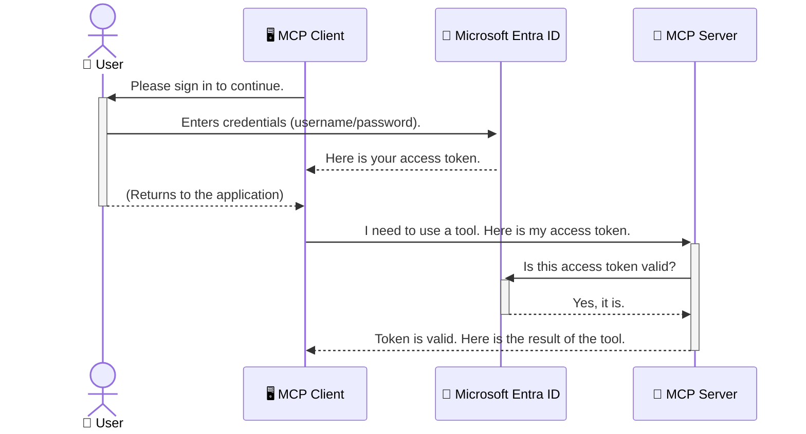

<!--
CO_OP_TRANSLATOR_METADATA:
{
  "original_hash": "6e562d7e5a77c8982da4aa8f762ad1d8",
  "translation_date": "2025-07-02T10:07:01+00:00",
  "source_file": "05-AdvancedTopics/mcp-security-entra/README.md",
  "language_code": "uk"
}
-->
# Захист AI-процесів: автентифікація Entra ID для серверів Model Context Protocol

## Вступ  
Захист сервера Model Context Protocol (MCP) так само важливий, як зачинити двері у свій будинок. Відкритий MCP сервер ставить під загрозу ваші інструменти та дані, допускаючи несанкціонований доступ, що може призвести до порушень безпеки. Microsoft Entra ID пропонує надійне хмарне рішення для управління ідентифікацією та доступом, яке гарантує, що лише авторизовані користувачі та додатки можуть взаємодіяти з вашим MCP сервером. У цьому розділі ви дізнаєтеся, як захистити AI-процеси за допомогою автентифікації Entra ID.

## Цілі навчання  
До кінця цього розділу ви зможете:

- Усвідомити важливість захисту MCP серверів.  
- Пояснити основи Microsoft Entra ID та автентифікації OAuth 2.0.  
- Розрізняти публічних та конфіденційних клієнтів.  
- Реалізувати автентифікацію Entra ID як для локальних (публічний клієнт), так і для віддалених (конфіденційний клієнт) MCP серверів.  
- Застосовувати найкращі практики безпеки під час розробки AI-процесів.  

## Безпека та MCP  

Як і не залишати двері свого будинку відчиненими, не варто залишати відкритим MCP сервер для будь-кого. Захист AI-процесів є необхідним для створення надійних, довірених та безпечних додатків. Цей розділ познайомить вас із використанням Microsoft Entra ID для захисту MCP серверів, щоб лише авторизовані користувачі та додатки могли працювати з вашими інструментами та даними.

## Чому безпека важлива для MCP серверів  

Уявіть, що ваш MCP сервер має інструмент для надсилання електронних листів або доступу до бази даних клієнтів. Незахищений сервер означає, що будь-хто може використовувати цей інструмент, що призведе до несанкціонованого доступу до даних, спаму або інших шкідливих дій.

Впроваджуючи автентифікацію, ви гарантуєте, що кожен запит до сервера перевіряється, підтверджуючи особу користувача або додатка, який робить запит. Це перший і найважливіший крок у захисті AI-процесів.

## Вступ до Microsoft Entra ID  

[**Microsoft Entra ID**](https://adoption.microsoft.com/microsoft-security/entra/) — це хмарний сервіс управління ідентифікацією та доступом. Уявіть його як універсального охоронця безпеки для ваших додатків. Він обробляє складний процес перевірки особи користувачів (автентифікація) та визначає, що їм дозволено робити (авторизація).

Використовуючи Entra ID, ви можете:

- Забезпечити безпечний вхід користувачів.  
- Захистити API та сервіси.  
- Керувати політиками доступу з одного централізованого місця.  

Для MCP серверів Entra ID надає надійне та широко визнане рішення для контролю доступу до можливостей сервера.

---

## Як працює автентифікація Entra ID  

Entra ID використовує відкриті стандарти, такі як **OAuth 2.0**, для обробки автентифікації. Хоча деталі можуть бути складними, основна ідея проста і зрозуміла через аналогію.

### Легке знайомство з OAuth 2.0: ключ для паркувальника  

Уявіть OAuth 2.0 як сервіс паркувальника для вашого автомобіля. Коли ви приїжджаєте до ресторану, ви не даєте паркувальнику свій головний ключ. Натомість ви даєте **ключ паркувальника**, який має обмежені права — він може завести машину і зачинити двері, але не може відкрити багажник чи бардачок.

У цій аналогії:

- **Ви** — це **Користувач**.  
- **Ваш автомобіль** — це **MCP сервер** з цінними інструментами та даними.  
- **Паркувальник** — це **Microsoft Entra ID**.  
- **Паркувальник на стоянці** — це **MCP клієнт** (додаток, який намагається отримати доступ до сервера).  
- **Ключ паркувальника** — це **Access Token** (токен доступу).  

Токен доступу — це безпечний текстовий рядок, який MCP клієнт отримує від Entra ID після вашого входу. Клієнт потім передає цей токен MCP серверу з кожним запитом. Сервер може перевірити токен, щоб переконатися, що запит легітимний і клієнт має необхідні права, при цьому не потребуючи обробки ваших реальних облікових даних (наприклад, пароля).

### Потік автентифікації  

Ось як цей процес працює на практиці:


```mermaid
sequenceDiagram
    actor User as 👤 User
    participant Client as 🖥️ MCP Client
    participant Entra as 🔐 Microsoft Entra ID
    participant Server as 🔧 MCP Server

    Client->>+User: Please sign in to continue.
    User->>+Entra: Enters credentials (username/password).
    Entra-->>Client: Here is your access token.
    User-->>-Client: (Returns to the application)

    Client->>+Server: I need to use a tool. Here is my access token.
    Server->>+Entra: Is this access token valid?
    Entra-->>-Server: Yes, it is.
    Server-->>-Client: Token is valid. Here is the result of the tool.
```

### Знайомство з Microsoft Authentication Library (MSAL)  

Перед тим, як перейти до коду, важливо познайомитися з ключовим компонентом, який ви побачите у прикладах: **Microsoft Authentication Library (MSAL)**.

MSAL — це бібліотека, розроблена Microsoft, яка значно спрощує для розробників обробку автентифікації. Замість того, щоб писати складний код для роботи з токенами безпеки, керування входами та оновленням сесій, MSAL виконує цю роботу за вас.

Використання MSAL рекомендується, бо:

- **Вона безпечна:** реалізує стандартизовані протоколи та найкращі практики безпеки, знижуючи ризик вразливостей у вашому коді.  
- **Спрощує розробку:** приховує складність протоколів OAuth 2.0 та OpenID Connect, дозволяючи додати надійну автентифікацію до додатку всього кількома рядками коду.  
- **Підтримується:** Microsoft активно підтримує та оновлює MSAL для протидії новим загрозам безпеки та змінам платформ.  

MSAL підтримує широкий спектр мов і фреймворків, включно з .NET, JavaScript/TypeScript, Python, Java, Go та мобільними платформами iOS і Android. Це означає, що ви можете використовувати однакові шаблони автентифікації по всьому стеку технологій.

Детальніше про MSAL можна дізнатися в офіційній [документації MSAL overview](https://learn.microsoft.com/entra/identity-platform/msal-overview).

---

## Захист MCP сервера з Entra ID: покрокова інструкція  

Тепер розглянемо, як захистити локальний MCP сервер (який спілкується через `stdio`) using Entra ID. This example uses a **public client**, which is suitable for applications running on a user's machine, like a desktop app or a local development server.

### Scenario 1: Securing a Local MCP Server (with a Public Client)

In this scenario, we'll look at an MCP server that runs locally, communicates over `stdio`, and uses Entra ID to authenticate the user before allowing access to its tools. The server will have a single tool that fetches the user's profile information from the Microsoft Graph API.

#### 1. Setting Up the Application in Entra ID

Before writing any code, you need to register your application in Microsoft Entra ID. This tells Entra ID about your application and grants it permission to use the authentication service.

1. Navigate to the **[Microsoft Entra portal](https://entra.microsoft.com/)**.
2. Go to **App registrations** and click **New registration**.
3. Give your application a name (e.g., "My Local MCP Server").
4. For **Supported account types**, select **Accounts in this organizational directory only**.
5. You can leave the **Redirect URI** blank for this example.
6. Click **Register**.

Once registered, take note of the **Application (client) ID** and **Directory (tenant) ID**. You'll need these in your code.

#### 2. The Code: A Breakdown

Let's look at the key parts of the code that handle authentication. The full code for this example is available in the [Entra ID - Local - WAM](https://github.com/Azure-Samples/mcp-auth-servers/tree/main/src/entra-id-local-wam) folder of the [mcp-auth-servers GitHub repository](https://github.com/Azure-Samples/mcp-auth-servers).

**`AuthenticationService.cs`**

This class is responsible for handling the interaction with Entra ID.

- **`CreateAsync`**: This method initializes the `PublicClientApplication` from the MSAL (Microsoft Authentication Library). It's configured with your application's `clientId` and `tenantId`.
- **`WithBroker`**: This enables the use of a broker (like the Windows Web Account Manager), which provides a more secure and seamless single sign-on experience.
- **`AcquireTokenAsync`**: це основний метод. Спочатку він намагається отримати токен без взаємодії з користувачем (тихо), тобто якщо у користувача вже є дійсна сесія, повторний вхід не потрібен. Якщо отримати токен тихо не вдається, користувача буде запрошено увійти інтерактивно.

```csharp
// Simplified for clarity
public static async Task<AuthenticationService> CreateAsync(ILogger<AuthenticationService> logger)
{
    var msalClient = PublicClientApplicationBuilder
        .Create(_clientId) // Your Application (client) ID
        .WithAuthority(AadAuthorityAudience.AzureAdMyOrg)
        .WithTenantId(_tenantId) // Your Directory (tenant) ID
        .WithBroker(new BrokerOptions(BrokerOptions.OperatingSystems.Windows))
        .Build();

    // ... cache registration ...

    return new AuthenticationService(logger, msalClient);
}

public async Task<string> AcquireTokenAsync()
{
    try
    {
        // Try silent authentication first
        var accounts = await _msalClient.GetAccountsAsync();
        var account = accounts.FirstOrDefault();

        AuthenticationResult? result = null;

        if (account != null)
        {
            result = await _msalClient.AcquireTokenSilent(_scopes, account).ExecuteAsync();
        }
        else
        {
            // If no account, or silent fails, go interactive
            result = await _msalClient.AcquireTokenInteractive(_scopes).ExecuteAsync();
        }

        return result.AccessToken;
    }
    catch (Exception ex)
    {
        _logger.LogError(ex, "An error occurred while acquiring the token.");
        throw; // Optionally rethrow the exception for higher-level handling
    }
}
```

**`Program.cs`**

This is where the MCP server is set up and the authentication service is integrated.

- **`AddSingleton<AuthenticationService>`**: This registers the `AuthenticationService` with the dependency injection container, so it can be used by other parts of the application (like our tool).
- **`GetUserDetailsFromGraph` tool**: This tool requires an instance of `AuthenticationService`. Before it does anything, it calls `authService.AcquireTokenAsync()` отримує дійсний токен доступу. Якщо автентифікація пройшла успішно, цей токен використовується для виклику Microsoft Graph API та отримання даних користувача.

```csharp
// Simplified for clarity
[McpServerTool(Name = "GetUserDetailsFromGraph")]
public static async Task<string> GetUserDetailsFromGraph(
    AuthenticationService authService)
{
    try
    {
        // This will trigger the authentication flow
        var accessToken = await authService.AcquireTokenAsync();

        // Use the token to create a GraphServiceClient
        var graphClient = new GraphServiceClient(
            new BaseBearerTokenAuthenticationProvider(new TokenProvider(authService)));

        var user = await graphClient.Me.GetAsync();

        return System.Text.Json.JsonSerializer.Serialize(user);
    }
    catch (Exception ex)
    {
        return $"Error: {ex.Message}";
    }
}
```

#### 3. Як це працює разом  

1. Коли MCP клієнт намагається використати `GetUserDetailsFromGraph` tool, the tool first calls `AcquireTokenAsync`.
2. `AcquireTokenAsync` triggers the MSAL library to check for a valid token.
3. If no token is found, MSAL, through the broker, will prompt the user to sign in with their Entra ID account.
4. Once the user signs in, Entra ID issues an access token.
5. The tool receives the token and uses it to make a secure call to the Microsoft Graph API.
6. The user's details are returned to the MCP client.

This process ensures that only authenticated users can use the tool, effectively securing your local MCP server.

### Scenario 2: Securing a Remote MCP Server (with a Confidential Client)

When your MCP server is running on a remote machine (like a cloud server) and communicates over a protocol like HTTP Streaming, the security requirements are different. In this case, you should use a **confidential client** and the **Authorization Code Flow**. This is a more secure method because the application's secrets are never exposed to the browser.

This example uses a TypeScript-based MCP server that uses Express.js to handle HTTP requests.

#### 1. Setting Up the Application in Entra ID

The setup in Entra ID is similar to the public client, but with one key difference: you need to create a **client secret**.

1. Navigate to the **[Microsoft Entra portal](https://entra.microsoft.com/)**.
2. In your app registration, go to the **Certificates & secrets** tab.
3. Click **New client secret**, give it a description, and click **Add**.
4. **Important:** Copy the secret value immediately. You will not be able to see it again.
5. You also need to configure a **Redirect URI**. Go to the **Authentication** tab, click **Add a platform**, select **Web**, and enter the redirect URI for your application (e.g., `http://localhost:3001/auth/callback`).

> **⚠️ Important Security Note:** For production applications, Microsoft strongly recommends using **secretless authentication** methods such as **Managed Identity** or **Workload Identity Federation** instead of client secrets. Client secrets pose security risks as they can be exposed or compromised. Managed identities provide a more secure approach by eliminating the need to store credentials in your code or configuration.
>
> For more information about managed identities and how to implement them, see the [Managed identities for Azure resources overview](https://learn.microsoft.com/entra/identity/managed-identities-azure-resources/overview).

#### 2. The Code: A Breakdown

This example uses a session-based approach. When the user authenticates, the server stores the access token and refresh token in a session and gives the user a session token. This session token is then used for subsequent requests. The full code for this example is available in the [Entra ID - Confidential client](https://github.com/Azure-Samples/mcp-auth-servers/tree/main/src/entra-id-cca-session) folder of the [mcp-auth-servers GitHub repository](https://github.com/Azure-Samples/mcp-auth-servers).

**`Server.ts`**

This file sets up the Express server and the MCP transport layer.

- **`requireBearerAuth`**: This is middleware that protects the `/sse` and `/message` endpoints. It checks for a valid bearer token in the `Authorization` header of the request.
- **`EntraIdServerAuthProvider`**: This is a custom class that implements the `McpServerAuthorizationProvider` interface. It's responsible for handling the OAuth 2.0 flow.
- **`/auth/callback`**: цей endpoint обробляє редирект з Entra ID після автентифікації користувача. Він обмінює код авторизації на токен доступу та токен оновлення.

```typescript
// Simplified for clarity
const app = express();
const { server } = createServer();
const provider = new EntraIdServerAuthProvider();

// Protect the SSE endpoint
app.get("/sse", requireBearerAuth({
  provider,
  requiredScopes: ["User.Read"]
}), async (req, res) => {
  // ... connect to the transport ...
});

// Protect the message endpoint
app.post("/message", requireBearerAuth({
  provider,
  requiredScopes: ["User.Read"]
}), async (req, res) => {
  // ... handle the message ...
});

// Handle the OAuth 2.0 callback
app.get("/auth/callback", (req, res) => {
  provider.handleCallback(req.query.code, req.query.state)
    .then(result => {
      // ... handle success or failure ...
    });
});
```

**`Tools.ts`**

This file defines the tools that the MCP server provides. The `getUserDetails` інструмент схожий на попередній, але отримує токен доступу з сесії.

```typescript
// Simplified for clarity
server.setRequestHandler(CallToolRequestSchema, async (request) => {
  const { name } = request.params;
  const context = request.params?.context as { token?: string } | undefined;
  const sessionToken = context?.token;

  if (name === ToolName.GET_USER_DETAILS) {
    if (!sessionToken) {
      throw new AuthenticationError("Authentication token is missing or invalid. Ensure the token is provided in the request context.");
    }

    // Get the Entra ID token from the session store
    const tokenData = tokenStore.getToken(sessionToken);
    const entraIdToken = tokenData.accessToken;

    const graphClient = Client.init({
      authProvider: (done) => {
        done(null, entraIdToken);
      }
    });

    const user = await graphClient.api('/me').get();

    // ... return user details ...
  }
});
```

**`auth/EntraIdServerAuthProvider.ts`**

This class handles the logic for:

- Redirecting the user to the Entra ID sign-in page.
- Exchanging the authorization code for an access token.
- Storing the tokens in the `tokenStore`.
- Refreshing the access token when it expires.

#### 3. How It All Works Together

1. When a user first tries to connect to the MCP server, the `requireBearerAuth` middleware will see that they don't have a valid session and will redirect them to the Entra ID sign-in page.
2. The user signs in with their Entra ID account.
3. Entra ID redirects the user back to the `/auth/callback` endpoint with an authorization code.
4. The server exchanges the code for an access token and a refresh token, stores them, and creates a session token which is sent to the client.
5. The client can now use this session token in the `Authorization` header for all future requests to the MCP server.
6. When the `getUserDetails` інструмент викликається, він використовує сесійний токен для пошуку токена доступу Entra ID, а потім за його допомогою викликає Microsoft Graph API.

Цей потік складніший за потік публічного клієнта, але необхідний для серверів, доступних через інтернет. Оскільки віддалені MCP сервери доступні публічно, їм потрібні більш суворі заходи безпеки для захисту від несанкціонованого доступу та потенційних атак.

## Найкращі практики безпеки  

- **Завжди використовуйте HTTPS**: шифруйте зв’язок між клієнтом і сервером, щоб захистити токени від перехоплення.  
- **Впроваджуйте контроль доступу на основі ролей (RBAC)**: перевіряйте не лише факт автентифікації користувача, а й його права. У Entra ID можна визначити ролі та перевіряти їх на MCP сервері.  
- **Моніторинг і аудит**: ведіть журнал усіх подій автентифікації, щоб виявляти та реагувати на підозрілі дії.  
- **Обробляйте обмеження частоти запитів (rate limiting)**: Microsoft Graph та інші API мають обмеження на кількість запитів. Реалізуйте експоненційне очікування та повторні спроби у MCP сервері, щоб коректно реагувати на помилки HTTP 429 (занадто багато запитів). Розгляньте кешування часто використовуваних даних для зменшення кількості викликів API.  
- **Безпечне зберігання токенів**: зберігайте токени доступу та оновлення у безпечному сховищі. Для локальних додатків використовуйте системні механізми безпеки. Для серверних додатків — шифроване сховище або сервіси управління ключами, наприклад Azure Key Vault.  
- **Обробка терміну дії токенів**: токени доступу мають обмежений термін дії. Реалізуйте автоматичне оновлення токенів за допомогою токенів оновлення, щоб забезпечити безперервний користувацький досвід без повторної автентифікації.  
- **Розгляньте використання Azure API Management**: хоча впровадження безпеки безпосередньо у MCP сервері дає гнучкий контроль, API шлюзи, такі як Azure API Management, можуть автоматично обробляти багато аспектів безпеки, включно з автентифікацією, авторизацією, обмеженням частоти та моніторингом. Вони забезпечують централізований рівень безпеки між вашими клієнтами та MCP серверами. Детальніше про використання API шлюзів з MCP дивіться у нашій статті [Azure API Management Your Auth Gateway For MCP Servers](https://techcommunity.microsoft.com/blog/integrationsonazureblog/azure-api-management-your-auth-gateway-for-mcp-servers/4402690).

## Основні висновки  

- Захист MCP сервера має вирішальне значення для безпеки ваших даних та інструментів.  
- Microsoft Entra ID пропонує надійне та масштабоване рішення для автентифікації та авторизації.  
- Використовуйте **публічного клієнта** для локальних додатків та **конфіденційного клієнта** для віддалених серверів.  
- **Authorization Code Flow** — найбезпечніший варіант для веб-додатків.  

## Вправа  

1. Подумайте про MCP сервер, який ви могли б створити. Чи буде він локальним, чи віддаленим?  
2. Виходячи з відповіді, який тип клієнта ви оберете: публічний чи конфіденційний?  
3. Які дозволи ваш MCP сервер запитуватиме для роботи з Microsoft Graph?  

## Практичні вправи  

### Вправа 1: Реєстрація додатку в Entra ID  
Перейдіть до порталу Microsoft Entra.  
Зареєструйте новий додаток для вашого MCP сервера.  
Запишіть Application (client) ID та Directory (tenant) ID.  

### Вправа 2: Захист локального MCP сервера (публічний клієнт)  
- Слідуйте прикладу коду для інтеграції MSAL (Microsoft Authentication Library) для автентифікації користувачів.  
- Перевірте потік автентифікації, викликавши MCP інструмент, що отримує дані користувача з Microsoft Graph.  

### Вправа 3: Захист віддаленого MCP сервера (конфіденційний клієнт)  
- Зареєструйте конфіденційного клієнта в Entra ID та створіть секрет клієнта.  
- Налаштуйте ваш MCP сервер на Express.js для використання Authorization Code Flow.  
- Перевірте захищені кінцеві точки та підтвердіть доступ за допомогою токенів.  

### Вправа 4: Застосування найкращих практик безпеки  
- Увімкніть HTTPS для локального або віддаленого сервера.  
- Реалізуйте контроль доступу на основі ролей (RBAC) у логіці сервера.  
- Додайте обробку терміну дії токенів та безпечне зберігання токенів.  

## Ресурси  

1. **Документація MSAL Overview**  
   Дізнайтеся, як Microsoft Authentication Library (MSAL) забезпечує безпечне отримання токенів на різних платформах:  
   [MSAL Overview на Microsoft Learn](https://learn.microsoft.com/en-gb/entra/msal/overview)  

2. **Репозиторій Azure-Samples/mcp-auth-servers на GitHub**  
   Приклади реалізації MCP серверів з демонстрацією потоків автентифікації:  
   [Azure-Samples/mcp-auth-servers на GitHub](https://github.com/Azure-Samples/mcp-auth-servers)  

3. **Огляд Managed Identities для ресурсів Azure**  
   Дізнайтеся, як уникнути використання секретів за допомогою керованих ідентичностей, призначених системою або користувачем:  
   [Managed Identities Overview на Microsoft Learn](https://learn.microsoft.com/en-us/entra/identity/managed-identities-azure-resources/)  

4. **Azure API Management: Ваш шлюз автентифікації для MCP серверів**  
   Глибокий огляд використання APIM як безпечного OAuth2 шлюзу для MCP серверів:  
   [Azure API Management Your Auth Gateway For MCP Servers](https://techcommunity.microsoft.com/blog/integrationsonazureblog/azure-api-management-your-auth-gateway-for-mcp-servers/4402690)  

5. **Довідник дозволів Microsoft Graph**  
   Повний перелік делегованих та прикладних дозволів для Microsoft Graph:  
   [Microsoft Graph Permissions Reference](https://learn.microsoft.com/zh-tw/graph/permissions-reference)  

## Результати навчання  
Після проходження цього розділу ви зможете:

- Пояснити, чому автентифікація критично важлива для MCP серверів та AI-процесів.  
- Налаштувати та конфігурувати автентифікацію Entra ID для локальних та віддалених MCP серверів.  
- Обирати відповідний тип клієнта (публіч

**Відмова від відповідальності**:  
Цей документ було перекладено за допомогою сервісу автоматичного перекладу [Co-op Translator](https://github.com/Azure/co-op-translator). Хоча ми прагнемо до точності, будь ласка, майте на увазі, що автоматичні переклади можуть містити помилки або неточності. Оригінальний документ рідною мовою слід вважати авторитетним джерелом. Для критично важливої інформації рекомендується звертатися до професійного людського перекладу. Ми не несемо відповідальності за будь-які непорозуміння чи неправильні тлумачення, що виникли внаслідок використання цього перекладу.