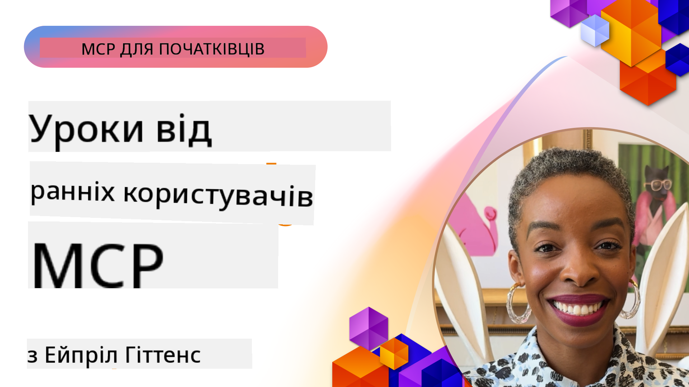

<!--
CO_OP_TRANSLATOR_METADATA:
{
  "original_hash": "41f16dac486d2086a53bc644a01cbe42",
  "translation_date": "2025-08-18T18:08:53+00:00",
  "source_file": "07-LessonsfromEarlyAdoption/README.md",
  "language_code": "uk"
}
-->
# 🌟 Уроки від ранніх користувачів

[](https://youtu.be/jds7dSmNptE)

_(Натисніть на зображення вище, щоб переглянути відео цього уроку)_

## 🎯 Що охоплює цей модуль

Цей модуль досліджує, як реальні організації та розробники використовують Model Context Protocol (MCP) для вирішення актуальних завдань і стимулювання інновацій. Через детальні кейс-стаді та практичні проєкти### Кейсове дослідження 5: Azure MCP – корпоративний протокол контексту моделі як сервіс

Azure MCP ([https://aka.ms/azmcp](https://aka.ms/azmcp)) — це керована корпоративна реалізація Model Context Protocol від Microsoft, розроблена для забезпечення масштабованих, безпечних і відповідних вимогам MCP серверів як хмарного сервісу. Цей комплексний набір включає кілька спеціалізованих MCP серверів для різних сервісів і сценаріїв Azure.

[Microsoft MCP Center](https://mcp.azure.com) Створіть масштабовану, готову до використання корпоративну MCP реєстрацію за допомогою Azure API Center — це каталог доступних серверів MCP від Microsoft.

> **🎯 Інструменти, готові до використання**
> 
> Це кейсове дослідження представляє кілька серверів MCP, готових до використання! Дізнайтеся більше про сервер Azure MCP та інші інтегровані сервери Azure у нашому [**Посібнику з серверів MCP від Microsoft**](microsoft-mcp-servers.md#2--azure-mcp-server).

**Основні функції:**
- Повністю керований хостинг MCP серверів із вбудованим масштабуванням, моніторингом і безпекою
- Нативна інтеграція з Azure OpenAI, Azure AI Search та іншими сервісами Azure
- Корпоративна автентифікація та авторизація через Microsoft Entra ID
- Підтримка користувацьких інструментів, шаблонів запитів і конекторів ресурсів
- Відповідність вимогам корпоративної безпеки та регуляторним стандартам
- 15+ спеціалізованих конекторів сервісів Azure, включаючи бази даних, моніторинг і зберігання даних

**Можливості сервера Azure MCP:**
- **Управління ресурсами**: Повний життєвий цикл управління ресурсами Azure
- **Конектори баз даних**: Прямий доступ до Azure Database для PostgreSQL та SQL Server
- **Azure Monitor**: Аналіз журналів за допомогою KQL та операційні інсайти
- **Автентифікація**: DefaultAzureCredential та шаблони керованих ідентичностей
- **Сервіси зберігання**: Операції з Blob Storage, Queue Storage та Table Storage
- **Сервіси контейнерів**: Управління Azure Container Apps, Container Instances та AKS

### 📚 Дивіться MCP у дії

Хочете побачити, як ці принципи застосовуються до інструментів, готових до використання? Ознайомтеся з нашим [**10 серверів MCP від Microsoft, які змінюють продуктивність розробників**](microsoft-mcp-servers.md), де представлені реальні сервери MCP від Microsoft, які ви можете використовувати вже сьогодні.

## Огляд

Цей урок досліджує, як ранні користувачі використовували Model Context Protocol (MCP) для вирішення реальних завдань і стимулювання інновацій у різних галузях. Через детальні кейс-стаді та практичні проєкти ви побачите, як MCP забезпечує стандартизовану, безпечну та масштабовану інтеграцію AI — об'єднуючи великі мовні моделі, інструменти та корпоративні дані в єдиній системі. Ви отримаєте практичний досвід у проєктуванні та створенні рішень на основі MCP, навчитеся перевіреним шаблонам реалізації та відкриєте найкращі практики для розгортання MCP у виробничих середовищах. Урок також висвітлює нові тенденції, майбутні напрями та ресурси з відкритим кодом, щоб допомогти вам залишатися на передовій технології MCP та її екосистеми, що розвивається.

## Цілі навчання

- Аналізувати реальні реалізації MCP у різних галузях
- Проєктувати та створювати повноцінні додатки на основі MCP
- Досліджувати нові тенденції та майбутні напрями розвитку технології MCP
- Застосовувати найкращі практики у реальних сценаріях розробки

## Реальні реалізації MCP

### Кейсове дослідження 1: Автоматизація підтримки клієнтів у корпорації

Міжнародна корпорація впровадила рішення на основі MCP для стандартизації AI-взаємодій у своїх системах підтримки клієнтів. Це дозволило їм:

- Створити єдиний інтерфейс для кількох постачальників LLM
- Забезпечити узгоджене управління запитами між відділами
- Реалізувати надійні заходи безпеки та контролю відповідності
- Легко перемикатися між різними AI-моделями залежно від конкретних потреб

**Технічна реалізація:**

```python
# Python MCP server implementation for customer support
import logging
import asyncio
from modelcontextprotocol import create_server, ServerConfig
from modelcontextprotocol.server import MCPServer
from modelcontextprotocol.transports import create_http_transport
from modelcontextprotocol.resources import ResourceDefinition
from modelcontextprotocol.prompts import PromptDefinition
from modelcontextprotocol.tool import ToolDefinition

# Configure logging
logging.basicConfig(level=logging.INFO)

async def main():
    # Create server configuration
    config = ServerConfig(
        name="Enterprise Customer Support Server",
        version="1.0.0",
        description="MCP server for handling customer support inquiries"
    )
    
    # Initialize MCP server
    server = create_server(config)
    
    # Register knowledge base resources
    server.resources.register(
        ResourceDefinition(
            name="customer_kb",
            description="Customer knowledge base documentation"
        ),
        lambda params: get_customer_documentation(params)
    )
    
    # Register prompt templates
    server.prompts.register(
        PromptDefinition(
            name="support_template",
            description="Templates for customer support responses"
        ),
        lambda params: get_support_templates(params)
    )
    
    # Register support tools
    server.tools.register(
        ToolDefinition(
            name="ticketing",
            description="Create and update support tickets"
        ),
        handle_ticketing_operations
    )
    
    # Start server with HTTP transport
    transport = create_http_transport(port=8080)
    await server.run(transport)

if __name__ == "__main__":
    asyncio.run(main())
```

**Результати:** Зниження витрат на моделі на 30%, покращення узгодженості відповідей на 45% та посилення відповідності вимогам у глобальних операціях.

### Кейсове дослідження 2: Помічник для діагностики в охороні здоров'я

Постачальник медичних послуг розробив інфраструктуру MCP для інтеграції кількох спеціалізованих медичних AI-моделей, забезпечуючи захист конфіденційних даних пацієнтів:

- Безперешкодне перемикання між загальними та спеціалізованими медичними моделями
- Суворий контроль конфіденційності та аудиторські сліди
- Інтеграція з існуючими системами електронних медичних записів (EHR)
- Узгоджене управління запитами для медичної термінології

**Технічна реалізація:**

```csharp
// C# MCP host application implementation in healthcare application
using Microsoft.Extensions.DependencyInjection;
using ModelContextProtocol.SDK.Client;
using ModelContextProtocol.SDK.Security;
using ModelContextProtocol.SDK.Resources;

public class DiagnosticAssistant
{
    private readonly MCPHostClient _mcpClient;
    private readonly PatientContext _patientContext;
    
    public DiagnosticAssistant(PatientContext patientContext)
    {
        _patientContext = patientContext;
        
        // Configure MCP client with healthcare-specific settings
        var clientOptions = new ClientOptions
        {
            Name = "Healthcare Diagnostic Assistant",
            Version = "1.0.0",
            Security = new SecurityOptions
            {
                Encryption = EncryptionLevel.Medical,
                AuditEnabled = true
            }
        };
        
        _mcpClient = new MCPHostClientBuilder()
            .WithOptions(clientOptions)
            .WithTransport(new HttpTransport("https://healthcare-mcp.example.org"))
            .WithAuthentication(new HIPAACompliantAuthProvider())
            .Build();
    }
    
    public async Task<DiagnosticSuggestion> GetDiagnosticAssistance(
        string symptoms, string patientHistory)
    {
        // Create request with appropriate resources and tool access
        var resourceRequest = new ResourceRequest
        {
            Name = "patient_records",
            Parameters = new Dictionary<string, object>
            {
                ["patientId"] = _patientContext.PatientId,
                ["requestingProvider"] = _patientContext.ProviderId
            }
        };
        
        // Request diagnostic assistance using appropriate prompt
        var response = await _mcpClient.SendPromptRequestAsync(
            promptName: "diagnostic_assistance",
            parameters: new Dictionary<string, object>
            {
                ["symptoms"] = symptoms,
                patientHistory = patientHistory,
                relevantGuidelines = _patientContext.GetRelevantGuidelines()
            });
            
        return DiagnosticSuggestion.FromMCPResponse(response);
    }
}
```

**Результати:** Покращені діагностичні рекомендації для лікарів при повній відповідності HIPAA та значне зниження перемикання контексту між системами.

### Кейсове дослідження 3: Аналіз ризиків у фінансових послугах

Фінансова установа впровадила MCP для стандартизації процесів аналізу ризиків у різних відділах:

- Створення єдиного інтерфейсу для моделей кредитного ризику, виявлення шахрайства та інвестиційних ризиків
- Реалізація суворого контролю доступу та версій моделей
- Забезпечення аудиторської прозорості всіх AI-рекомендацій
- Узгоджене форматування даних у різних системах

**Технічна реалізація:**

```java
// Java MCP server for financial risk assessment
import org.mcp.server.*;
import org.mcp.security.*;

public class FinancialRiskMCPServer {
    public static void main(String[] args) {
        // Create MCP server with financial compliance features
        MCPServer server = new MCPServerBuilder()
            .withModelProviders(
                new ModelProvider("risk-assessment-primary", new AzureOpenAIProvider()),
                new ModelProvider("risk-assessment-audit", new LocalLlamaProvider())
            )
            .withPromptTemplateDirectory("./compliance/templates")
            .withAccessControls(new SOCCompliantAccessControl())
            .withDataEncryption(EncryptionStandard.FINANCIAL_GRADE)
            .withVersionControl(true)
            .withAuditLogging(new DatabaseAuditLogger())
            .build();
            
        server.addRequestValidator(new FinancialDataValidator());
        server.addResponseFilter(new PII_RedactionFilter());
        
        server.start(9000);
        
        System.out.println("Financial Risk MCP Server running on port 9000");
    }
}
```

**Результати:** Покращена відповідність регуляторним вимогам, на 40% швидші цикли розгортання моделей та покращена узгодженість оцінки ризиків у відділах.

### Кейсове дослідження 4: Сервер Microsoft Playwright MCP для автоматизації браузера

Microsoft розробила [сервер Playwright MCP](https://github.com/microsoft/playwright-mcp), щоб забезпечити безпечну, стандартизовану автоматизацію браузера через Model Context Protocol. Цей сервер, готовий до використання, дозволяє AI-агентам та LLM взаємодіяти з веб-браузерами у контрольованому, аудитованому та розширюваному середовищі — забезпечуючи такі сценарії, як автоматизоване тестування веб-сайтів, витяг даних та наскрізні робочі процеси.

> **🎯 Інструмент, готовий до використання**
> 
> Це кейсове дослідження демонструє реальний сервер MCP, який ви можете використовувати вже сьогодні! Дізнайтеся більше про сервер Playwright MCP та 9 інших серверів MCP від Microsoft у нашому [**Посібнику з серверів MCP від Microsoft**](microsoft-mcp-servers.md#8--playwright-mcp-server).

**Основні функції:**
- Надає можливості автоматизації браузера (навігація, заповнення форм, створення скріншотів тощо) як MCP-інструменти
- Реалізує суворий контроль доступу та ізоляцію для запобігання несанкціонованим діям
- Забезпечує детальні журнали аудиту для всіх взаємодій з браузером
- Підтримує інтеграцію з Azure OpenAI та іншими постачальниками LLM для автоматизації, керованої агентами
- Забезпечує можливості веб-браузингу для Coding Agent GitHub Copilot

**Технічна реалізація:**

```typescript
// TypeScript: Registering Playwright browser automation tools in an MCP server
import { createServer, ToolDefinition } from 'modelcontextprotocol';
import { launch } from 'playwright';

const server = createServer({
  name: 'Playwright MCP Server',
  version: '1.0.0',
  description: 'MCP server for browser automation using Playwright'
});

// Register a tool for navigating to a URL and capturing a screenshot
server.tools.register(
  new ToolDefinition({
    name: 'navigate_and_screenshot',
    description: 'Navigate to a URL and capture a screenshot',
    parameters: {
      url: { type: 'string', description: 'The URL to visit' }
    }
  }),
  async ({ url }) => {
    const browser = await launch();
    const page = await browser.newPage();
    await page.goto(url);
    const screenshot = await page.screenshot();
    await browser.close();
    return { screenshot };
  }
);

// Start the MCP server
server.listen(8080);
```

**Результати:**

- Забезпечено безпечну програмну автоматизацію браузера для AI-агентів та LLM
- Знижено витрати на ручне тестування та покращено охоплення тестування веб-додатків
- Надано багаторазову, розширювану платформу для інтеграції інструментів на основі браузера в корпоративних середовищах
- Забезпечено можливості веб-браузингу для GitHub Copilot

**Посилання:**

- [Репозиторій GitHub сервера Playwright MCP](https://github.com/microsoft/playwright-mcp)
- [Рішення Microsoft AI та автоматизації](https://azure.microsoft.com/en-us/products/ai-services/)

### Кейсове дослідження 5: Azure MCP – корпоративний протокол контексту моделі як сервіс

Сервер Azure MCP ([https://aka.ms/azmcp](https://aka.ms/azmcp)) — це керована корпоративна реалізація Model Context Protocol від Microsoft, розроблена для забезпечення масштабованих, безпечних і відповідних вимогам MCP серверів як хмарного сервісу. Azure MCP дозволяє організаціям швидко розгортати, управляти та інтегрувати MCP сервери з сервісами Azure AI, даними та безпекою, знижуючи операційні витрати та прискорюючи впровадження AI.

> **🎯 Інструмент, готовий до використання**
> 
> Це реальний сервер MCP, який ви можете використовувати вже сьогодні! Дізнайтеся більше про сервер Azure AI Foundry MCP у нашому [**Посібнику з серверів MCP від Microsoft**](microsoft-mcp-servers.md).

- Повністю керований хостинг MCP серверів із вбудованим масштабуванням, моніторингом і безпекою
- Нативна інтеграція з Azure OpenAI, Azure AI Search та іншими сервісами Azure
- Корпоративна автентифікація та авторизація через Microsoft Entra ID
- Підтримка користувацьких інструментів, шаблонів запитів і конекторів ресурсів
- Відповідність вимогам корпоративної безпеки та регуляторним стандартам

**Технічна реалізація:**

```yaml
# Example: Azure MCP server deployment configuration (YAML)
apiVersion: mcp.microsoft.com/v1
kind: McpServer
metadata:
  name: enterprise-mcp-server
spec:
  modelProviders:
    - name: azure-openai
      type: AzureOpenAI
      endpoint: https://<your-openai-resource>.openai.azure.com/
      apiKeySecret: <your-azure-keyvault-secret>
  tools:
    - name: document_search
      type: AzureAISearch
      endpoint: https://<your-search-resource>.search.windows.net/
      apiKeySecret: <your-azure-keyvault-secret>
  authentication:
    type: EntraID
    tenantId: <your-tenant-id>
  monitoring:
    enabled: true
    logAnalyticsWorkspace: <your-log-analytics-id>
```

**Результати:**  
- Знижено час до отримання цінності для корпоративних AI-проєктів завдяки готовій платформі MCP серверів
- Спрощено інтеграцію LLM, інструментів та джерел корпоративних даних
- Покращено безпеку, спостережуваність та операційну ефективність для робочих навантажень MCP
- Покращено якість коду завдяки найкращим практикам Azure SDK та актуальним шаблонам автентифікації

**Посилання:**  
- [Документація Azure MCP](https://aka.ms/azmcp)
- [Репозиторій GitHub сервера Azure MCP](https://github.com/Azure/azure-mcp)
- [Сервіси Azure AI](https://azure.microsoft.com/en-us/products/ai-services/)
- [Microsoft MCP Center](https://mcp.azure.com)

## Кейсове дослідження 6: NLWeb  
MCP (Model Context Protocol) — це новий протокол для чат-ботів та AI-помічників, який дозволяє взаємодіяти з інструментами. Кожен екземпляр NLWeb також є сервером MCP, який підтримує один основний метод — ask, що використовується для запитання веб-сайту у природній мові. Отримана відповідь використовує schema.org — широко використовуваний словник для опису веб-даних. У загальному сенсі, MCP — це NLWeb, як Http — до HTML. NLWeb об'єднує протоколи, формати Schema.org та зразки коду, щоб допомогти сайтам швидко створювати ці кінцеві точки, приносячи користь як людям через інтерфейси для спілкування, так і машинам через природну взаємодію агентів.

Існує два основних компоненти NLWeb:
- Протокол, дуже простий для початку, для взаємодії з сайтом у природній мові та формат, який використовує json і schema.org для отриманої відповіді. Дивіться документацію про REST API для отримання додаткової інформації.
- Просте впровадження (1), яке використовує існуючу розмітку для сайтів, які можуть бути представлені як списки елементів (продукти, рецепти, атракції, відгуки тощо). Разом із набором віджетів інтерфейсу користувача сайти можуть легко забезпечити інтерфейси для спілкування з їхнім контентом. Дивіться документацію про "Життя запиту в чаті" для отримання додаткової інформації про те, як це працює.

**Посилання:**  
- [Документація Azure MCP](https://aka.ms/azmcp)  
- [NLWeb](https://github.com/microsoft/NlWeb)

### Кейсове дослідження 7: Сервер Azure AI Foundry MCP – інтеграція корпоративних AI-агентів

Сервери Azure AI Foundry MCP демонструють, як MCP може бути використаний для оркестрації та управління AI-агентами та робочими процесами в корпоративних середовищах. Інтегруючи MCP з Azure AI Foundry, організації можуть стандартизувати взаємодії агентів, використовувати управління робочими процесами Foundry та забезпечити безпечне, масштабоване розгортання.

> **🎯 Інструмент, готовий до використання**
> 
> Це реальний сервер MCP, який ви можете використовувати вже сьогодні! Дізнайтеся більше про сервер Azure AI Foundry MCP у нашому [**Посібнику з серверів MCP від Microsoft**](microsoft-mcp-servers.md#9--azure-ai-foundry-mcp-server).

**Основні функції:**
- Комплексний доступ до екосистеми AI Azure, включаючи каталоги моделей та управління розгортанням
- Індексація знань за допомогою Azure AI Search для RAG-додатків
- Інструменти оцінки продуктивності моделей AI та забезпечення якості
- Інтеграція з каталогом та лабораторіями Azure AI Foundry для передових дослідницьких моделей
- Можливості управління агентами та оцінки для виробничих сценаріїв

**Результати:**
- Швидке прототипування та надійний моніторинг робочих процесів AI-агентів
- Безперешкодна інтеграція з сервісами Azure AI для складних сценаріїв
- Єдиний інтерфейс для створення, розгортання та моніторингу конвеєрів агентів
- Покращена безпека, відповідність та операційна ефективність для підприємств
- Прискорене впровадження AI при збереженні контролю над складними процесами, керованими агентами

**Посилання:**  
- [Репозиторій GitHub сервера Azure AI Foundry MCP](https://github.com/azure-ai-foundry/mcp-foundry)  
- [Інтеграція агентів Azure AI з MCP (Блог Microsoft Foundry)](https://devblogs.microsoft.com/foundry/integrating-azure-ai-agents-mcp/)

### Кейсове дослідження 8: Пісочниця Foundry MCP – експерименти та прототипування

Пісочниця Foundry MCP пропонує готове середовище для експериментів із серверами MCP та інтеграціями Azure AI Foundry. Розробники можуть швидко прототипувати, тестувати та оцінювати AI-моделі та робочі процеси агентів, використовуючи ресурси з каталогу та лабораторій Azure AI Foundry. Пісочниця сп
> **🎯 Інструмент, готовий до використання в продакшені**  
>  
> Це справжній сервер MCP, який ви можете використовувати вже сьогодні! Дізнайтеся більше про сервер MCP у документації Microsoft Learn у нашому [**Посібнику з серверів MCP від Microsoft**](microsoft-mcp-servers.md#1--microsoft-learn-docs-mcp-server).
**Основні функції:**
- Доступ у реальному часі до офіційної документації Microsoft, документації Azure та Microsoft 365
- Розширені можливості семантичного пошуку, які розуміють контекст і наміри
- Завжди актуальна інформація завдяки публікації контенту Microsoft Learn
- Всеосяжне охоплення джерел Microsoft Learn, документації Azure та Microsoft 365
- Повертає до 10 високоякісних фрагментів контенту з назвами статей та URL-адресами

**Чому це важливо:**
- Вирішує проблему "застарілих знань AI" для технологій Microsoft
- Забезпечує доступ AI-асистентів до найновіших функцій .NET, C#, Azure та Microsoft 365
- Надає авторитетну, першоджерельну інформацію для точного генерування коду
- Необхідно для розробників, які працюють із швидко змінюваними технологіями Microsoft

**Результати:**
- Значно покращена точність коду, згенерованого AI, для технологій Microsoft
- Зменшення часу, витраченого на пошук актуальної документації та найкращих практик
- Підвищення продуктивності розробників завдяки контекстно-орієнтованому пошуку документації
- Безперешкодна інтеграція з робочими процесами розробки без необхідності залишати IDE

**Посилання:**
- [Microsoft Learn Docs MCP Server GitHub Repository](https://github.com/MicrosoftDocs/mcp)
- [Microsoft Learn Documentation](https://learn.microsoft.com/)

## Практичні проєкти

### Проєкт 1: Створення MCP-сервера з підтримкою кількох провайдерів

**Мета:** Створити MCP-сервер, який може маршрутизувати запити до кількох провайдерів AI-моделей на основі певних критеріїв.

**Вимоги:**

- Підтримка щонайменше трьох різних провайдерів моделей (наприклад, OpenAI, Anthropic, локальні моделі)
- Реалізація механізму маршрутизації на основі метаданих запиту
- Створення системи конфігурації для управління обліковими даними провайдерів
- Додавання кешування для оптимізації продуктивності та витрат
- Створення простого дашборду для моніторингу використання

**Етапи реалізації:**

1. Налаштування базової інфраструктури MCP-сервера
2. Реалізація адаптерів провайдерів для кожної AI-моделі
3. Створення логіки маршрутизації на основі атрибутів запиту
4. Додавання механізмів кешування для частих запитів
5. Розробка дашборду для моніторингу
6. Тестування з різними шаблонами запитів

**Технології:** Вибір між Python (.NET/Java/Python залежно від ваших уподобань), Redis для кешування та простий веб-фреймворк для дашборду.

### Проєкт 2: Система управління корпоративними шаблонами запитів

**Мета:** Розробити систему на основі MCP для управління, версіонування та розгортання шаблонів запитів в організації.

**Вимоги:**

- Створення централізованого репозиторію для шаблонів запитів
- Реалізація системи версіонування та процесів затвердження
- Розробка можливостей тестування шаблонів із використанням зразкових даних
- Впровадження контролю доступу на основі ролей
- Створення API для отримання та розгортання шаблонів

**Етапи реалізації:**

1. Проєктування схеми бази даних для зберігання шаблонів
2. Створення основного API для операцій CRUD із шаблонами
3. Реалізація системи версіонування
4. Розробка процесу затвердження
5. Створення тестової платформи
6. Розробка простого веб-інтерфейсу для управління
7. Інтеграція з MCP-сервером

**Технології:** Вибір бекенд-фреймворку, SQL або NoSQL бази даних, а також фронтенд-фреймворку для інтерфейсу управління.

### Проєкт 3: Платформа генерації контенту на основі MCP

**Мета:** Створити платформу генерації контенту, яка використовує MCP для забезпечення стабільних результатів для різних типів контенту.

**Вимоги:**

- Підтримка кількох форматів контенту (блог-пости, соціальні мережі, маркетингові тексти)
- Реалізація генерації на основі шаблонів із можливістю налаштування
- Створення системи перегляду та зворотного зв’язку щодо контенту
- Відстеження метрик продуктивності контенту
- Підтримка версіонування та ітерації контенту

**Етапи реалізації:**

1. Налаштування інфраструктури MCP-клієнта
2. Створення шаблонів для різних типів контенту
3. Розробка конвеєра генерації контенту
4. Реалізація системи перегляду
5. Розробка системи відстеження метрик
6. Створення інтерфейсу для управління шаблонами та генерації контенту

**Технології:** Вибір мови програмування, веб-фреймворку та системи баз даних.

## Майбутні напрями розвитку технології MCP

### Нові тенденції

1. **Мультимодальний MCP**
   - Розширення MCP для стандартизації взаємодії з моделями зображень, аудіо та відео
   - Розробка можливостей міжмодального аналізу
   - Стандартизовані формати запитів для різних модальностей

2. **Федеративна інфраструктура MCP**
   - Розподілені мережі MCP, які можуть ділитися ресурсами між організаціями
   - Стандартизовані протоколи для безпечного обміну моделями
   - Техніки конфіденційного обчислення

3. **Маркетплейси MCP**
   - Екосистеми для обміну та монетизації шаблонів і плагінів MCP
   - Процеси забезпечення якості та сертифікації
   - Інтеграція з маркетплейсами моделей

4. **MCP для периферійних обчислень**
   - Адаптація стандартів MCP для пристроїв із обмеженими ресурсами
   - Оптимізовані протоколи для середовищ із низькою пропускною здатністю
   - Спеціалізовані реалізації MCP для екосистем IoT

5. **Регуляторні рамки**
   - Розробка розширень MCP для відповідності регуляторним вимогам
   - Стандартизовані журнали аудиту та інтерфейси пояснюваності
   - Інтеграція з новими рамками управління AI

### Рішення MCP від Microsoft

Microsoft та Azure розробили кілька відкритих репозиторіїв, щоб допомогти розробникам впроваджувати MCP у різних сценаріях:

#### Організація Microsoft

1. [playwright-mcp](https://github.com/microsoft/playwright-mcp) - MCP-сервер Playwright для автоматизації браузера та тестування
2. [files-mcp-server](https://github.com/microsoft/files-mcp-server) - Реалізація MCP-сервера OneDrive для локального тестування та внеску спільноти
3. [NLWeb](https://github.com/microsoft/NlWeb) - NLWeb — це набір відкритих протоколів та інструментів для створення базового шару AI Web

#### Організація Azure-Samples

1. [mcp](https://github.com/Azure-Samples/mcp) - Зразки, інструменти та ресурси для створення та інтеграції MCP-серверів на Azure
2. [mcp-auth-servers](https://github.com/Azure-Samples/mcp-auth-servers) - Референсні MCP-сервери з демонстрацією автентифікації
3. [remote-mcp-functions](https://github.com/Azure-Samples/remote-mcp-functions) - Швидкий старт для віддалених MCP-серверів на Azure Functions
4. [remote-mcp-functions-python](https://github.com/Azure-Samples/remote-mcp-functions-python) - Шаблон для створення та розгортання MCP-серверів на Python
5. [remote-mcp-functions-dotnet](https://github.com/Azure-Samples/remote-mcp-functions-dotnet) - Шаблон для створення та розгортання MCP-серверів на .NET/C#
6. [remote-mcp-functions-typescript](https://github.com/Azure-Samples/remote-mcp-functions-typescript) - Шаблон для створення та розгортання MCP-серверів на TypeScript
7. [remote-mcp-apim-functions-python](https://github.com/Azure-Samples/remote-mcp-apim-functions-python) - Використання Azure API Management як AI Gateway для MCP-серверів
8. [AI-Gateway](https://github.com/Azure-Samples/AI-Gateway) - Експерименти з інтеграцією MCP, Azure OpenAI та AI Foundry

Ці репозиторії пропонують різноманітні реалізації, шаблони та ресурси для роботи з MCP у різних мовах програмування та сервісах Azure. Вони охоплюють широкий спектр випадків використання — від базових серверів до автентифікації, хмарного розгортання та корпоративної інтеграції.

#### Директорія ресурсів MCP

[Директорія ресурсів MCP](https://github.com/microsoft/mcp/tree/main/Resources) в офіційному репозиторії Microsoft MCP пропонує колекцію зразків ресурсів, шаблонів запитів та визначень інструментів для використання з MCP-серверами. Ця директорія допомагає розробникам швидко розпочати роботу з MCP, пропонуючи готові блоки та приклади найкращих практик для:

- **Шаблонів запитів:** Готові шаблони для поширених AI-завдань, які можна адаптувати для власних реалізацій MCP-серверів.
- **Визначень інструментів:** Приклади схем інструментів для стандартизації інтеграції та викликів інструментів у MCP-серверах.
- **Зразків ресурсів:** Приклади визначень ресурсів для підключення до джерел даних, API та зовнішніх сервісів у рамках MCP.
- **Референсних реалізацій:** Практичні приклади структурування та організації ресурсів, запитів та інструментів у реальних проєктах MCP.

Ці ресурси прискорюють розробку, сприяють стандартизації та допомагають забезпечити найкращі практики при створенні та розгортанні рішень на основі MCP.

#### Директорія ресурсів MCP

- [MCP Resources (Sample Prompts, Tools, and Resource Definitions)](https://github.com/microsoft/mcp/tree/main/Resources)

### Можливості для досліджень

- Ефективні техніки оптимізації запитів у рамках MCP
- Моделі безпеки для багатокористувацьких розгортань MCP
- Бенчмаркінг продуктивності різних реалізацій MCP
- Методи формальної верифікації MCP-серверів

## Висновок

Протокол Model Context Protocol (MCP) швидко формує майбутнє стандартизованої, безпечної та сумісної інтеграції AI у різних галузях. Завдяки кейсам та практичним проєктам у цьому уроці ви побачили, як ранні користувачі, включаючи Microsoft та Azure, використовують MCP для вирішення реальних завдань, прискорення впровадження AI та забезпечення відповідності, безпеки та масштабованості. Модульний підхід MCP дозволяє організаціям об’єднувати великі мовні моделі, інструменти та корпоративні дані в єдиній, аудиторській системі. У міру розвитку MCP, активна участь у спільноті, дослідження відкритих ресурсів та застосування найкращих практик будуть ключовими для створення надійних, готових до майбутнього AI-рішень.

## Додаткові ресурси

- [MCP Foundry GitHub Repository](https://github.com/azure-ai-foundry/mcp-foundry)
- [Foundry MCP Playground](https://github.com/azure-ai-foundry/foundry-mcp-playground)
- [Integrating Azure AI Agents with MCP (Microsoft Foundry Blog)](https://devblogs.microsoft.com/foundry/integrating-azure-ai-agents-mcp/)
- [MCP GitHub Repository (Microsoft)](https://github.com/microsoft/mcp)
- [MCP Resources Directory (Sample Prompts, Tools, and Resource Definitions)](https://github.com/microsoft/mcp/tree/main/Resources)
- [MCP Community & Documentation](https://modelcontextprotocol.io/introduction)
- [Azure MCP Documentation](https://aka.ms/azmcp)
- [Playwright MCP Server GitHub Repository](https://github.com/microsoft/playwright-mcp)
- [Files MCP Server (OneDrive)](https://github.com/microsoft/files-mcp-server)
- [Azure-Samples MCP](https://github.com/Azure-Samples/mcp)
- [MCP Auth Servers (Azure-Samples)](https://github.com/Azure-Samples/mcp-auth-servers)
- [Remote MCP Functions (Azure-Samples)](https://github.com/Azure-Samples/remote-mcp-functions)
- [Remote MCP Functions Python (Azure-Samples)](https://github.com/Azure-Samples/remote-mcp-functions-python)
- [Remote MCP Functions .NET (Azure-Samples)](https://github.com/Azure-Samples/remote-mcp-functions-dotnet)
- [Remote MCP Functions TypeScript (Azure-Samples)](https://github.com/Azure-Samples/remote-mcp-functions-typescript)
- [Remote MCP APIM Functions Python (Azure-Samples)](https://github.com/Azure-Samples/remote-mcp-apim-functions-python)
- [AI-Gateway (Azure-Samples)](https://github.com/Azure-Samples/AI-Gateway)
- [Microsoft AI and Automation Solutions](https://azure.microsoft.com/en-us/products/ai-services/)

## Завдання

1. Проаналізуйте один із кейсів і запропонуйте альтернативний підхід до реалізації.
2. Виберіть одну з ідей проєктів і створіть детальну технічну специфікацію.
3. Дослідіть галузь, не охоплену кейсами, і визначте, як MCP може вирішити її специфічні проблеми.
4. Вивчіть один із майбутніх напрямів і створіть концепцію нового розширення MCP для його підтримки.

Далі: [Microsoft MCP Server](../07-LessonsfromEarlyAdoption/microsoft-mcp-servers.md)

**Відмова від відповідальності**:  
Цей документ було перекладено за допомогою сервісу автоматичного перекладу [Co-op Translator](https://github.com/Azure/co-op-translator). Хоча ми прагнемо до точності, зверніть увагу, що автоматичні переклади можуть містити помилки або неточності. Оригінальний документ мовою оригіналу слід вважати авторитетним джерелом. Для критично важливої інформації рекомендується професійний людський переклад. Ми не несемо відповідальності за будь-які непорозуміння або неправильні тлумачення, що виникли внаслідок використання цього перекладу.