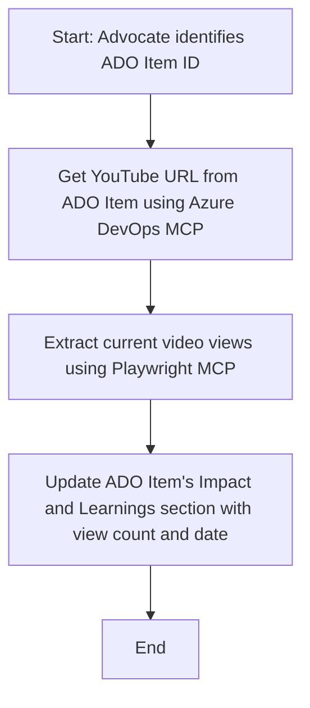

<!--
CO_OP_TRANSLATOR_METADATA:
{
  "original_hash": "14a2dfbea55ef735660a06bd6bdfe5f3",
  "translation_date": "2025-06-17T16:23:09+00:00",
  "source_file": "09-CaseStudy/UpdateADOItemsFromYT.md",
  "language_code": "uk"
}
-->
# Case Study: Оновлення елементів Azure DevOps за даними з YouTube за допомогою MCP

> **Disclaimer:** Існують онлайн-інструменти та звіти, які можуть автоматизувати процес оновлення елементів Azure DevOps даними з платформ, таких як YouTube. Наведений нижче сценарій є лише прикладом, щоб показати, як можна застосувати інструменти MCP для автоматизації та інтеграції.

## Огляд

Цей кейс демонструє приклад того, як Model Context Protocol (MCP) та його інструменти можуть бути використані для автоматизації процесу оновлення робочих елементів Azure DevOps (ADO) інформацією з онлайн-платформ, таких як YouTube. Описаний сценарій є лише одним із варіантів застосування цих інструментів, які можна адаптувати для багатьох подібних завдань автоматизації.

У цьому прикладі Advocate відстежує онлайн-сесії за допомогою елементів ADO, кожен з яких містить URL відео з YouTube. Використовуючи інструменти MCP, Advocate може автоматично та повторювано оновлювати елементи ADO найновішими метриками відео, такими як кількість переглядів. Цей підхід можна узагальнити на інші випадки, коли потрібно інтегрувати інформацію з онлайн-джерел в ADO або інші системи.

## Сценарій

Advocate відповідає за відстеження впливу онлайн-сесій та взаємодії з спільнотою. Кожна сесія фіксується як робочий елемент ADO у проєкті 'DevRel', а у робочому елементі є поле для URL відео з YouTube. Щоб точно звітувати про охоплення сесії, Advocate має оновити елемент ADO актуальною кількістю переглядів відео та датою отримання цієї інформації.

## Використані інструменти

- [Azure DevOps MCP](https://github.com/microsoft/azure-devops-mcp): Забезпечує програмний доступ та оновлення робочих елементів ADO через MCP.
- [Playwright MCP](https://github.com/microsoft/playwright-mcp): Автоматизує дії браузера для отримання актуальних даних зі сторінок, наприклад, статистики відео YouTube.

## Покроковий робочий процес

1. **Визначити елемент ADO**: Почати з ID робочого елемента ADO (наприклад, 1234) у проєкті 'DevRel'.
2. **Отримати URL YouTube**: Використати Azure DevOps MCP для отримання URL відео з робочого елемента.
3. **Витягти кількість переглядів**: Використати Playwright MCP для переходу за URL та отримання актуальної кількості переглядів.
4. **Оновити елемент ADO**: Записати останню кількість переглядів і дату отримання в розділ 'Impact and Learnings' робочого елемента ADO за допомогою Azure DevOps MCP.

## Приклад запиту

```bash
- Work with the ADO Item ID: 1234
- The project is '2025-Awesome'
- Get the YouTube URL for the ADO item
- Use Playwright to get the current views from the YouTube video
- Update the ADO item with the current video views and the updated date of the information
```

## Діаграма Mermaid



## Технічна реалізація

- **Оркестрація MCP**: Робочий процес керується MCP сервером, який координує використання інструментів Azure DevOps MCP і Playwright MCP.
- **Автоматизація**: Процес можна запускати вручну або налаштувати на регулярне виконання для підтримки актуальності елементів ADO.
- **Розширюваність**: Той самий підхід можна застосувати для оновлення елементів ADO іншими онлайн-метриками (наприклад, лайками, коментарями) або з інших платформ.

## Результати та вплив

- **Ефективність**: Зменшує ручну роботу Advocate шляхом автоматизації отримання та оновлення метрик відео.
- **Точність**: Забезпечує відображення у елементах ADO найактуальніших даних з онлайн-джерел.
- **Повторюваність**: Надає повторно використовуваний робочий процес для подібних сценаріїв з іншими джерелами даних чи метриками.

## Посилання

- [Azure DevOps MCP](https://github.com/microsoft/azure-devops-mcp)
- [Playwright MCP](https://github.com/microsoft/playwright-mcp)
- [Model Context Protocol (MCP)](https://modelcontextprotocol.io/)

**Відмова від відповідальності**:  
Цей документ було перекладено за допомогою сервісу автоматичного перекладу [Co-op Translator](https://github.com/Azure/co-op-translator). Хоча ми прагнемо до точності, будь ласка, майте на увазі, що автоматичні переклади можуть містити помилки або неточності. Оригінальний документ рідною мовою слід вважати авторитетним джерелом. Для критично важливої інформації рекомендується звертатися до професійного людського перекладу. Ми не несемо відповідальності за будь-які непорозуміння або неправильні тлумачення, що виникли внаслідок використання цього перекладу.