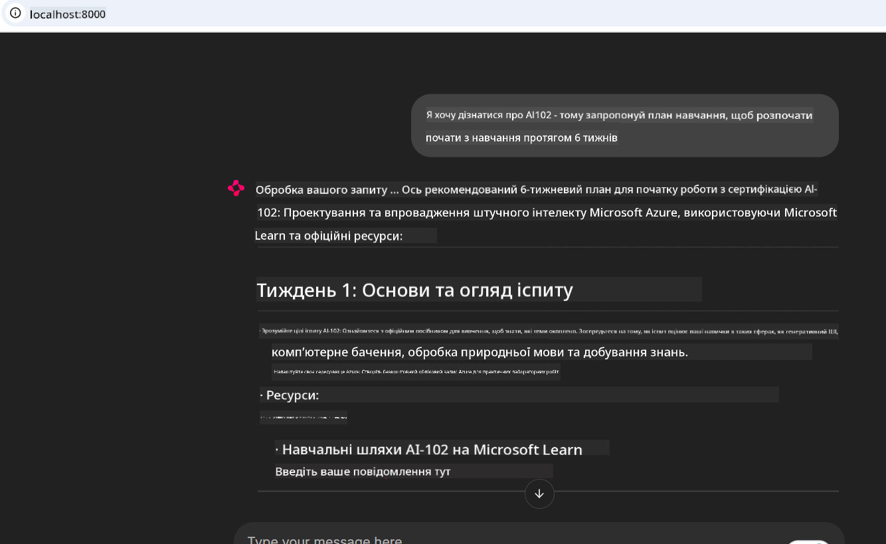

<!--
CO_OP_TRANSLATOR_METADATA:
{
  "original_hash": "4319d291c9d124ecafea52b3d04bfa0e",
  "translation_date": "2025-07-14T06:31:20+00:00",
  "source_file": "09-CaseStudy/docs-mcp/README.md",
  "language_code": "uk"
}
-->
# Кейс: Підключення до Microsoft Learn Docs MCP Server з клієнта

Чи траплялося вам одночасно працювати з документацією, Stack Overflow та безліччю вкладок пошукових систем, намагаючись розв’язати проблему у вашому коді? Можливо, у вас є другий монітор лише для документації, або ви постійно переключаєтесь між IDE та браузером. Хіба не було б зручніше, якби документація була інтегрована безпосередньо у ваш робочий процес — у ваші додатки, IDE або навіть власні інструменти? У цьому кейсі ми розглянемо, як саме це зробити, підключившись безпосередньо до Microsoft Learn Docs MCP server зі свого клієнтського додатка.

## Огляд

Сучасна розробка — це не просто написання коду, а пошук потрібної інформації у потрібний момент. Документація є всюди, але рідко там, де вона найбільше потрібна — всередині ваших інструментів і робочих процесів. Інтегруючи отримання документації безпосередньо у ваші додатки, ви зекономите час, зменшите кількість перемикань між контекстами і підвищите продуктивність. У цьому розділі ми покажемо, як підключити клієнт до Microsoft Learn Docs MCP server, щоб отримувати актуальну, контекстно-залежну документацію, не виходячи з додатка.

Ми пройдемо кроки встановлення з’єднання, відправлення запиту та ефективної обробки потокових відповідей. Такий підхід не лише оптимізує ваш робочий процес, а й відкриває можливості для створення розумніших, корисніших інструментів для розробників.

## Цілі навчання

Навіщо це робити? Тому що найкращий досвід розробника — це той, що усуває зайві перешкоди. Уявіть світ, де ваш редактор коду, чатбот або веб-додаток миттєво відповідають на ваші питання з документації, використовуючи найновіший контент Microsoft Learn. Наприкінці цього розділу ви знатимете, як:

- Розуміти основи комунікації клієнт-сервер MCP для документації
- Реалізувати консольний або веб-додаток для підключення до Microsoft Learn Docs MCP server
- Використовувати потокові HTTP-клієнти для отримання документації в реальному часі
- Логувати та інтерпретувати відповіді документації у вашому додатку

Ви побачите, як ці навички допоможуть створювати інструменти, які не просто реагують, а справді інтерактивні та контекстно-залежні.

## Сценарій 1 — Отримання документації в реальному часі з MCP

У цьому сценарії ми покажемо, як підключити клієнт до Microsoft Learn Docs MCP server, щоб отримувати актуальну, контекстно-залежну документацію, не виходячи з додатка.

Давайте перейдемо до практики. Ваше завдання — написати додаток, який підключається до Microsoft Learn Docs MCP server, викликає інструмент `microsoft_docs_search` і виводить потокову відповідь у консоль.

### Чому саме такий підхід?
Тому що це основа для створення більш складних інтеграцій — чи то чатбот, розширення IDE, чи веб-панель.

Код та інструкції для цього сценарію знаходяться у папці [`solution`](./solution/README.md) цього кейсу. Кроки допоможуть вам налаштувати підключення:
- Використати офіційний MCP SDK та потоковий HTTP-клієнт для з’єднання
- Викликати інструмент `microsoft_docs_search` з параметром запиту для отримання документації
- Реалізувати коректне логування та обробку помилок
- Створити інтерактивний консольний інтерфейс для введення кількох пошукових запитів

Цей сценарій демонструє, як:
- Підключитися до Docs MCP server
- Відправити запит
- Розпарсити та вивести результати

Ось як може виглядати запуск рішення:

```
Prompt> What is Azure Key Vault?
Answer> Azure Key Vault is a cloud service for securely storing and accessing secrets. ...
```

Нижче наведено мінімальний приклад рішення. Повний код і деталі доступні у папці solution.

<details>
<summary>Python</summary>

```python
import asyncio
from mcp.client.streamable_http import streamablehttp_client
from mcp import ClientSession

async def main():
    async with streamablehttp_client("https://learn.microsoft.com/api/mcp") as (read_stream, write_stream, _):
        async with ClientSession(read_stream, write_stream) as session:
            await session.initialize()
            result = await session.call_tool("microsoft_docs_search", {"query": "Azure Functions best practices"})
            print(result.content)

if __name__ == "__main__":
    asyncio.run(main())
```

- Для повної реалізації та логування дивіться [`scenario1.py`](../../../../09-CaseStudy/docs-mcp/solution/python/scenario1.py).
- Інструкції з встановлення та використання — у файлі [`README.md`](./solution/python/README.md) у тій же папці.
</details>

## Сценарій 2 — Веб-додаток для інтерактивного генератора навчального плану з MCP

У цьому сценарії ви навчитеся інтегрувати Docs MCP у веб-проєкт. Мета — надати користувачам можливість шукати документацію Microsoft Learn безпосередньо через веб-інтерфейс, роблячи документацію миттєво доступною у вашому додатку чи на сайті.

Ви побачите, як:
- Налаштувати веб-додаток
- Підключитися до Docs MCP server
- Обробляти введення користувача та відображати результати

Ось як може виглядати запуск рішення:

```
User> I want to learn about AI102 - so suggest the roadmap to get it started from learn for 6 weeks

Assistant> Here’s a detailed 6-week roadmap to start your preparation for the AI-102: Designing and Implementing a Microsoft Azure AI Solution certification, using official Microsoft resources and focusing on exam skills areas:

---
## Week 1: Introduction & Fundamentals
- **Understand the Exam**: Review the [AI-102 exam skills outline](https://learn.microsoft.com/en-us/credentials/certifications/exams/ai-102/).
- **Set up Azure**: Sign up for a free Azure account if you don't have one.
- **Learning Path**: [Introduction to Azure AI services](https://learn.microsoft.com/en-us/training/modules/intro-to-azure-ai/)
- **Focus**: Get familiar with Azure portal, AI capabilities, and necessary tools.

....more weeks of the roadmap...

Let me know if you want module-specific recommendations or need more customized weekly tasks!
```

Нижче наведено мінімальний приклад рішення. Повний код і деталі доступні у папці solution.



<details>
<summary>Python (Chainlit)</summary>

Chainlit — це фреймворк для створення веб-додатків з розмовним AI. Він полегшує створення інтерактивних чатботів і помічників, які можуть викликати інструменти MCP і відображати результати в реальному часі. Ідеально підходить для швидкого прототипування та зручних інтерфейсів.

```python
import chainlit as cl
import requests

MCP_URL = "https://learn.microsoft.com/api/mcp"

@cl.on_message
def handle_message(message):
    query = {"question": message}
    response = requests.post(MCP_URL, json=query)
    if response.ok:
        result = response.json()
        cl.Message(content=result.get("answer", "No answer found.")).send()
    else:
        cl.Message(content="Error: " + response.text).send()
```

- Для повної реалізації дивіться [`scenario2.py`](../../../../09-CaseStudy/docs-mcp/solution/python/scenario2.py).
- Інструкції з налаштування та запуску — у файлі [`README.md`](./solution/python/README.md).
</details>

## Сценарій 3: Документація в редакторі з MCP Server у VS Code

Якщо ви хочете отримувати Microsoft Learn Docs безпосередньо у VS Code (замість перемикання між вкладками браузера), ви можете використовувати MCP server у вашому редакторі. Це дозволяє:
- Шукати та читати документацію у VS Code, не виходячи з середовища розробки.
- Посилатися на документацію та вставляти посилання безпосередньо у README або файли курсів.
- Використовувати GitHub Copilot разом з MCP для безшовного AI-підсиленого робочого процесу з документацією.

**Ви дізнаєтесь, як:**
- Додати дійсний файл `.vscode/mcp.json` у корінь вашого робочого простору (приклад нижче).
- Відкрити панель MCP або скористатися палітрою команд у VS Code для пошуку та вставки документації.
- Посилатися на документацію безпосередньо у markdown-файлах під час роботи.
- Поєднувати цей робочий процес з GitHub Copilot для ще більшої продуктивності.

Ось приклад налаштування MCP server у VS Code:

```json
{
  "servers": {
    "LearnDocsMCP": {
      "url": "https://learn.microsoft.com/api/mcp"
    }
  }
}
```

</details>

> Для детального покрокового керівництва з скріншотами дивіться [`README.md`](./solution/scenario3/README.md).


Цей підхід ідеально підходить для тих, хто створює технічні курси, пише документацію або розробляє код з частими посиланнями.

## Основні висновки

Інтеграція документації безпосередньо у ваші інструменти — це не просто зручність, а справжня революція для продуктивності. Підключившись до Microsoft Learn Docs MCP server зі свого клієнта, ви зможете:

- Усунути перемикання між кодом і документацією
- Отримувати актуальну, контекстно-залежну документацію в реальному часі
- Створювати розумніші, більш інтерактивні інструменти для розробників

Ці навички допоможуть вам створювати рішення, які не лише ефективні, а й приємні у використанні.

## Додаткові ресурси

Щоб поглибити знання, ознайомтеся з офіційними ресурсами:

- [Microsoft Learn Docs MCP Server (GitHub)](https://github.com/MicrosoftDocs/mcp)
- [Початок роботи з Azure MCP Server (mcp-python)](https://learn.microsoft.com/en-us/azure/developer/azure-mcp-server/get-started#create-the-python-app)
- [Що таке Azure MCP Server?](https://learn.microsoft.com/en-us/azure/developer/azure-mcp-server/)
- [Вступ до Model Context Protocol (MCP)](https://modelcontextprotocol.io/introduction)
- [Додавання плагінів з MCP Server (Python)](https://learn.microsoft.com/en-us/semantic-kernel/concepts/plugins/adding-mcp-plugins)

**Відмова від відповідальності**:  
Цей документ було перекладено за допомогою сервісу автоматичного перекладу [Co-op Translator](https://github.com/Azure/co-op-translator). Хоча ми прагнемо до точності, будь ласка, майте на увазі, що автоматичні переклади можуть містити помилки або неточності. Оригінальний документ рідною мовою слід вважати авторитетним джерелом. Для критично важливої інформації рекомендується звертатися до професійного людського перекладу. Ми не несемо відповідальності за будь-які непорозуміння або неправильні тлумачення, що виникли внаслідок використання цього перекладу.