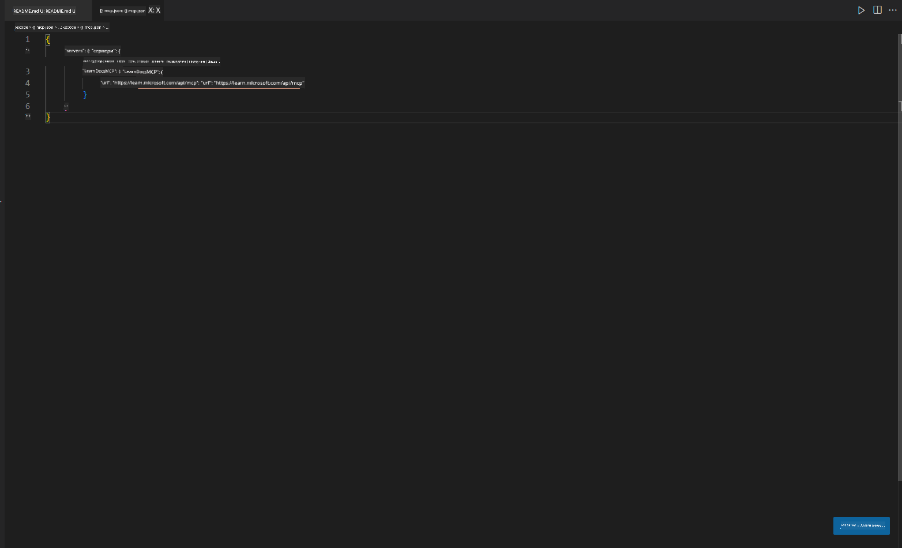
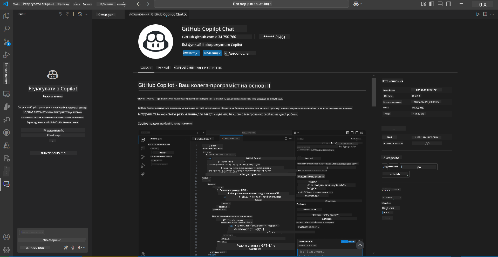
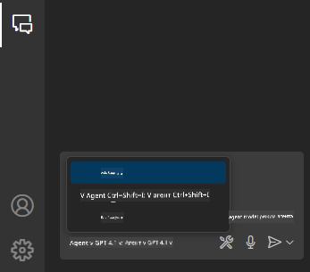
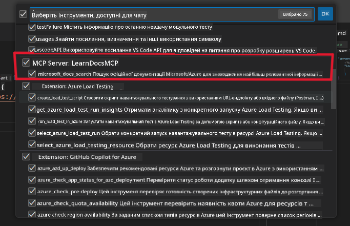
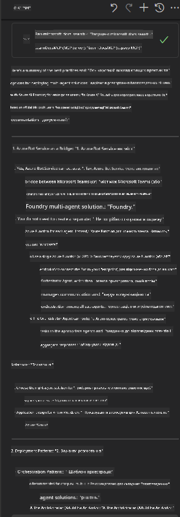

<!--
CO_OP_TRANSLATOR_METADATA:
{
  "original_hash": "db532b1ec386c9ce38c791653dc3c881",
  "translation_date": "2025-07-14T06:57:36+00:00",
  "source_file": "09-CaseStudy/docs-mcp/solution/scenario3/README.md",
  "language_code": "uk"
}
-->
# Сценарій 3: Документація в редакторі з MCP Server у VS Code

## Огляд

У цьому сценарії ви дізнаєтеся, як інтегрувати Microsoft Learn Docs безпосередньо у ваше середовище Visual Studio Code за допомогою MCP server. Замість постійного перемикання між вкладками браузера для пошуку документації, ви зможете отримувати доступ, шукати та посилатися на офіційну документацію прямо в редакторі. Такий підхід оптимізує ваш робочий процес, допомагає зосередитися та забезпечує безшовну інтеграцію з інструментами, як-от GitHub Copilot.

- Шукайте та читайте документацію у VS Code, не виходячи з середовища кодування.
- Посилайтеся на документацію та вставляйте посилання безпосередньо у README або файли курсу.
- Використовуйте GitHub Copilot і MCP разом для безперебійної роботи з документацією за допомогою штучного інтелекту.

## Цілі навчання

До кінця цього розділу ви навчитеся налаштовувати та використовувати MCP server у VS Code для покращення роботи з документацією та розробкою. Ви зможете:

- Налаштувати робочий простір для використання MCP server для пошуку документації.
- Шукати та вставляти документацію безпосередньо з VS Code.
- Поєднувати можливості GitHub Copilot і MCP для більш продуктивного робочого процесу з підтримкою штучного інтелекту.

Ці навички допоможуть вам залишатися зосередженими, покращити якість документації та підвищити продуктивність як розробника або технічного автора.

## Рішення

Щоб отримати доступ до документації в редакторі, вам потрібно виконати низку кроків, які інтегрують MCP server з VS Code і GitHub Copilot. Це рішення ідеально підходить для авторів курсів, технічних письменників і розробників, які хочуть залишатися зосередженими в редакторі під час роботи з документацією та Copilot.

- Швидко додавати посилання на документацію у README під час написання курсу або проектної документації.
- Використовувати Copilot для генерації коду та MCP для миттєвого пошуку і цитування релевантної документації.
- Залишатися зосередженими в редакторі та підвищувати продуктивність.

### Покрокова інструкція

Щоб почати, виконайте наступні кроки. Для кожного кроку можна додати скріншот з папки assets для наочного пояснення процесу.

1. **Додайте конфігурацію MCP:**
   У корені вашого проєкту створіть файл `.vscode/mcp.json` і додайте таку конфігурацію:
   ```json
   {
     "servers": {
       "LearnDocsMCP": {
         "url": "https://learn.microsoft.com/api/mcp"
       }
     }
   }
   ```
   Ця конфігурація вказує VS Code, як підключитися до [`Microsoft Learn Docs MCP server`](https://github.com/MicrosoftDocs/mcp).
   
   
    
2. **Відкрийте панель GitHub Copilot Chat:**
   Якщо у вас ще не встановлено розширення GitHub Copilot, перейдіть у розділ Extensions у VS Code і встановіть його. Ви можете завантажити його безпосередньо з [Visual Studio Code Marketplace](https://marketplace.visualstudio.com/items?itemName=GitHub.copilot-chat). Потім відкрийте панель Copilot Chat у бічній панелі.

   

3. **Увімкніть агентський режим і перевірте інструменти:**
   У панелі Copilot Chat увімкніть агентський режим.

   

   Після увімкнення агентського режиму переконайтеся, що MCP server відображається серед доступних інструментів. Це гарантує, що агент Copilot може отримувати доступ до сервера документації для пошуку релевантної інформації.
   
   

4. **Почніть новий чат і задайте запит агенту:**
   Відкрийте новий чат у панелі Copilot Chat. Тепер ви можете ставити агенту запитання щодо документації. Агент використовуватиме MCP server, щоб отримувати та відображати відповідну документацію Microsoft Learn безпосередньо у вашому редакторі.

   - *"Я намагаюся скласти план навчання з теми X. Планую вивчати її протягом 8 тижнів, запропонуй, будь ласка, контент для кожного тижня."*

   

5. **Живий запит:**

   > Розглянемо живий запит із розділу [#get-help](https://discord.gg/D6cRhjHWSC) у Discord Azure AI Foundry ([переглянути оригінальне повідомлення](https://discord.com/channels/1113626258182504448/1385498306720829572)):
   
   *"Я шукаю відповіді щодо розгортання мультиагентного рішення з AI агентами, розробленими на Azure AI Foundry. Бачу, що немає прямого методу розгортання, як-от канали Copilot Studio. Тож які існують різні способи розгортання для корпоративних користувачів, щоб вони могли взаємодіяти і виконувати завдання? Існує багато статей/блогів, які кажуть, що можна використовувати Azure Bot service як міст між MS Teams і Azure AI Foundry Agents. Чи спрацює це, якщо я налаштую Azure bot, який підключається до Orchestrator Agent на Azure AI Foundry через Azure function для оркестрації, чи мені потрібно створювати Azure function для кожного AI агента в мультиагентному рішенні для оркестрації в Bot framework? Будь-які інші поради будуть дуже корисні."*

   

   Агент відповість релевантними посиланнями на документацію та резюме, які ви зможете вставити безпосередньо у ваші markdown-файли або використовувати як посилання у коді.

### Приклади запитів

Ось кілька прикладів запитів, які ви можете спробувати. Вони демонструють, як MCP server і Copilot працюють разом, щоб миттєво надавати контекстно-залежну документацію та посилання без виходу з VS Code:

- "Покажи, як використовувати тригери Azure Functions."
- "Встав посилання на офіційну документацію для Azure Key Vault."
- "Які найкращі практики для захисту ресурсів Azure?"
- "Знайди quickstart для Azure AI services."

Ці запити демонструють, як MCP server і Copilot можуть працювати разом, щоб миттєво надавати контекстно-залежну документацію та посилання без виходу з VS Code.

---

**Відмова від відповідальності**:  
Цей документ було перекладено за допомогою сервісу автоматичного перекладу [Co-op Translator](https://github.com/Azure/co-op-translator). Хоча ми прагнемо до точності, будь ласка, майте на увазі, що автоматичні переклади можуть містити помилки або неточності. Оригінальний документ рідною мовою слід вважати авторитетним джерелом. Для критично важливої інформації рекомендується звертатися до професійного людського перекладу. Ми не несемо відповідальності за будь-які непорозуміння або неправильні тлумачення, що виникли внаслідок використання цього перекладу.