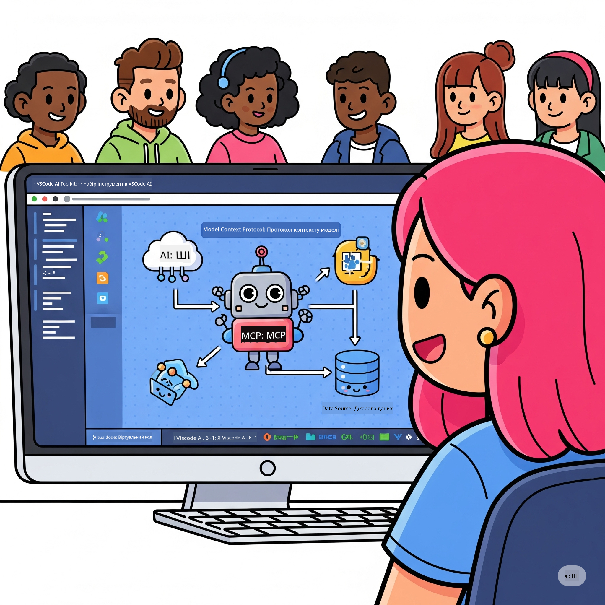
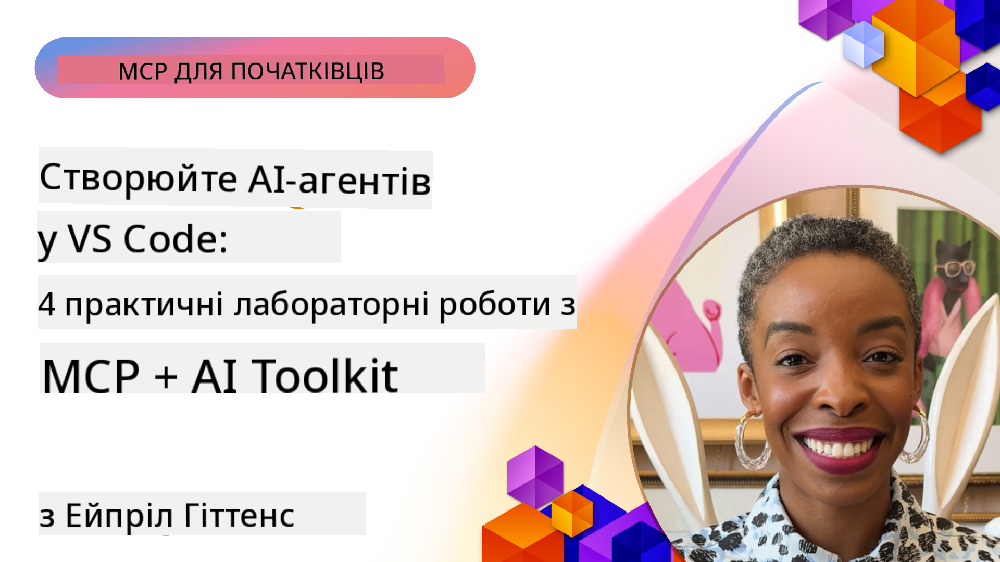

<!--
CO_OP_TRANSLATOR_METADATA:
{
  "original_hash": "1b000fd6e1b04c047578bfc5d07d54eb",
  "translation_date": "2025-08-19T19:30:12+00:00",
  "source_file": "10-StreamliningAIWorkflowsBuildingAnMCPServerWithAIToolkit/README.md",
  "language_code": "uk"
}
-->
# Оптимізація AI-робочих процесів: створення MCP-сервера за допомогою AI Toolkit

## 🎯 Огляд

_(Натисніть на зображення вище, щоб переглянути відео цього уроку)_

Ласкаво просимо до **Майстер-класу з Model Context Protocol (MCP)**! Цей практичний курс об'єднує дві передові технології, щоб змінити підхід до розробки AI-додатків:

- **🔗 Model Context Protocol (MCP)**: Відкритий стандарт для безшовної інтеграції AI-інструментів
- **🛠️ AI Toolkit для Visual Studio Code (AITK)**: Потужне розширення Microsoft для розробки AI

### 🎓 Чого ви навчитеся

До кінця цього курсу ви опануєте мистецтво створення інтелектуальних додатків, які поєднують AI-моделі з реальними інструментами та сервісами. Від автоматизованого тестування до інтеграції з API, ви здобудете практичні навички для вирішення складних бізнес-завдань.

## 🏗️ Технологічний стек

### 🔌 Model Context Protocol (MCP)

MCP — це **"USB-C для AI"** — універсальний стандарт, що з'єднує AI-моделі з зовнішніми інструментами та джерелами даних.

**✨ Основні характеристики:**

- 🔄 **Стандартизована інтеграція**: Універсальний інтерфейс для підключення AI-інструментів
- 🏛️ **Гнучка архітектура**: Локальні та віддалені сервери через stdio/SSE транспорт
- 🧰 **Багатий екосистемний набір**: Інструменти, підказки та ресурси в одному протоколі
- 🔒 **Готовність до підприємств**: Вбудована безпека та надійність

**🎯 Чому MCP важливий:**
Як USB-C усунув хаос з кабелями, так MCP усуває складність інтеграції AI. Один протокол — безмежні можливості.

### 🤖 AI Toolkit для Visual Studio Code (AITK)

Флагманське розширення Microsoft для розробки AI, яке перетворює VS Code на потужний інструмент для роботи з AI.

**🚀 Основні можливості:**

- 📦 **Каталог моделей**: Доступ до моделей з Azure AI, GitHub, Hugging Face, Ollama
- ⚡ **Локальне виконання**: Оптимізоване виконання ONNX на CPU/GPU/NPU
- 🏗️ **Конструктор агентів**: Візуальна розробка AI-агентів з інтеграцією MCP
- 🎭 **Мультимодальність**: Підтримка тексту, зображень та структурованих даних

**💡 Переваги розробки:**

- Розгортання моделей без налаштувань
- Візуальне створення підказок
- Інтерактивний тестовий майданчик у реальному часі
- Безшовна інтеграція MCP-серверів

## 📚 Навчальний шлях

### [🚀 Модуль 1: Основи AI Toolkit](./lab1/README.md)

**Тривалість**: 15 хвилин

- 🛠️ Встановлення та налаштування AI Toolkit для VS Code
- 🗂️ Дослідження Каталогу моделей (100+ моделей з GitHub, ONNX, OpenAI, Anthropic, Google)
- 🎮 Освоєння Інтерактивного майданчика для тестування моделей у реальному часі
- 🤖 Створення першого AI-агента за допомогою Конструктора агентів
- 📊 Оцінка продуктивності моделей за допомогою вбудованих метрик (F1, релевантність, схожість, узгодженість)
- ⚡ Вивчення можливостей пакетної обробки та мультимодальної підтримки

**🎯 Результат навчання**: Створення функціонального AI-агента з повним розумінням можливостей AITK

### [🌐 Модуль 2: Основи MCP з AI Toolkit](./lab2/README.md)

**Тривалість**: 20 хвилин

- 🧠 Освоєння архітектури та концепцій Model Context Protocol (MCP)
- 🌐 Дослідження екосистеми MCP-серверів від Microsoft
- 🤖 Створення агента для автоматизації браузера за допомогою Playwright MCP-сервера
- 🔧 Інтеграція MCP-серверів з Конструктором агентів AI Toolkit
- 📊 Налаштування та тестування MCP-інструментів у ваших агентах
- 🚀 Експорт та розгортання агентів з підтримкою MCP для використання у виробництві

**🎯 Результат навчання**: Розгортання AI-агента, посиленого зовнішніми інструментами через MCP

### [🔧 Модуль 3: Розширена розробка MCP з AI Toolkit](./lab3/README.md)

**Тривалість**: 20 хвилин

- 💻 Створення власних MCP-серверів за допомогою AI Toolkit
- 🐍 Налаштування та використання останнього MCP Python SDK (v1.9.3)
- 🔍 Налаштування та використання MCP Inspector для налагодження
- 🛠️ Створення Weather MCP Server з професійними робочими процесами налагодження
- 🧪 Налагодження MCP-серверів у середовищах Конструктора агентів та MCP Inspector

**🎯 Результат навчання**: Розробка та налагодження власних MCP-серверів із сучасними інструментами

### [🐙 Модуль 4: Практична розробка MCP - Кастомний сервер GitHub Clone](./lab4/README.md)

**Тривалість**: 30 хвилин

- 🏗️ Створення реального MCP-сервера GitHub Clone для робочих процесів розробки
- 🔄 Реалізація розумного клонування репозиторіїв із перевіркою та обробкою помилок
- 📁 Створення інтелектуального управління директоріями та інтеграція з VS Code
- 🤖 Використання режиму GitHub Copilot Agent з кастомними MCP-інструментами
- 🛡️ Застосування надійності та кросплатформної сумісності для виробничого середовища

**🎯 Результат навчання**: Розгортання MCP-сервера, готового до використання у виробничих робочих процесах

## 💡 Реальні застосування та вплив

### 🏢 Корпоративні сценарії використання

#### 🔄 Автоматизація DevOps

Оптимізуйте робочі процеси розробки за допомогою інтелектуальної автоматизації:

- **Розумне управління репозиторіями**: AI-аналіз коду та прийняття рішень щодо злиття
- **Інтелектуальний CI/CD**: Автоматична оптимізація конвеєрів на основі змін у коді
- **Класифікація проблем**: Автоматичне визначення та призначення багів

#### 🧪 Революція у забезпеченні якості

Підвищіть рівень тестування за допомогою автоматизації на основі AI:

- **Інтелектуальне створення тестів**: Автоматичне генерування комплексних тестових наборів
- **Візуальне регресійне тестування**: Виявлення змін у UI за допомогою AI
- **Моніторинг продуктивності**: Прогнозування та вирішення проблем

#### 📊 Інтелектуальні дані

Створюйте розумніші робочі процеси обробки даних:

- **Адаптивні ETL-процеси**: Самооптимізуючі перетворення даних
- **Виявлення аномалій**: Моніторинг якості даних у реальному часі
- **Інтелектуальне маршрутизація**: Управління потоками даних

#### 🎧 Покращення клієнтського досвіду

Створюйте виняткові взаємодії з клієнтами:

- **Контекстно-обізнана підтримка**: AI-агенти з доступом до історії клієнтів
- **Прогнозуюче вирішення проблем**: Передбачуване обслуговування клієнтів
- **Інтеграція каналів**: Уніфікований AI-досвід на різних платформах

## 🛠️ Вимоги та налаштування

### 💻 Системні вимоги

| Компонент | Вимога | Примітки |
|-----------|-------------|-------|
| **Операційна система** | Windows 10+, macOS 10.15+, Linux | Будь-яка сучасна ОС |
| **Visual Studio Code** | Остання стабільна версія | Потрібно для AITK |
| **Node.js** | v18.0+ і npm | Для розробки MCP-серверів |
| **Python** | 3.10+ | Опціонально для Python MCP-серверів |
| **Пам'ять** | Мінімум 8 ГБ ОЗП | Рекомендовано 16 ГБ для локальних моделей |

### 🔧 Середовище розробки

#### Рекомендовані розширення для VS Code

- **AI Toolkit** (ms-windows-ai-studio.windows-ai-studio)
- **Python** (ms-python.python)
- **Python Debugger** (ms-python.debugpy)
- **GitHub Copilot** (GitHub.copilot) - Опціонально, але корисно

#### Додаткові інструменти

- **uv**: Сучасний менеджер пакетів для Python
- **MCP Inspector**: Візуальний інструмент для налагодження MCP-серверів
- **Playwright**: Для прикладів автоматизації вебу

## 🎖️ Результати навчання та сертифікація

### 🏆 Контрольний список навичок

Завершивши цей курс, ви досягнете майстерності у:

#### 🎯 Основні компетенції

- [ ] **Опанування MCP-протоколу**: Глибоке розуміння архітектури та шаблонів реалізації
- [ ] **Професіоналізм у AITK**: Експертне використання AI Toolkit для швидкої розробки
- [ ] **Розробка власних серверів**: Створення, розгортання та підтримка MCP-серверів
- [ ] **Інтеграція інструментів**: Безшовне підключення AI до існуючих робочих процесів
- [ ] **Практичне застосування**: Використання здобутих навичок для вирішення бізнес-завдань

#### 🔧 Технічні навички

- [ ] Налаштування та конфігурація AI Toolkit у VS Code
- [ ] Проектування та реалізація власних MCP-серверів
- [ ] Інтеграція моделей GitHub з архітектурою MCP
- [ ] Створення автоматизованих тестових робочих процесів із Playwright
- [ ] Розгортання AI-агентів для виробничого використання
- [ ] Налагодження та оптимізація продуктивності MCP-серверів

#### 🚀 Розширені можливості

- [ ] Проектування AI-інтеграцій корпоративного масштабу
- [ ] Реалізація найкращих практик безпеки для AI-додатків
- [ ] Проектування масштабованих архітектур MCP-серверів
- [ ] Створення кастомних інструментів для специфічних доменів
- [ ] Наставництво у розробці AI-додатків

## 📖 Додаткові ресурси

- [Специфікація MCP](https://modelcontextprotocol.io/docs)
- [Репозиторій AI Toolkit на GitHub](https://github.com/microsoft/vscode-ai-toolkit)
- [Колекція прикладів MCP-серверів](https://github.com/modelcontextprotocol/servers)
- [Посібник з найкращих практик](https://modelcontextprotocol.io/docs/best-practices)

---

**🚀 Готові змінити свій робочий процес розробки AI?**

Давайте разом створювати майбутнє інтелектуальних додатків із MCP та AI Toolkit!

**Відмова від відповідальності**:  
Цей документ було перекладено за допомогою сервісу автоматичного перекладу [Co-op Translator](https://github.com/Azure/co-op-translator). Хоча ми прагнемо до точності, звертаємо вашу увагу, що автоматичні переклади можуть містити помилки або неточності. Оригінальний документ на його рідній мові слід вважати авторитетним джерелом. Для критично важливої інформації рекомендується професійний людський переклад. Ми не несемо відповідальності за будь-які непорозуміння або неправильні тлумачення, що виникли внаслідок використання цього перекладу.