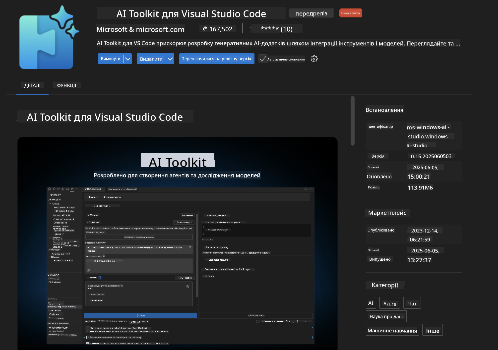
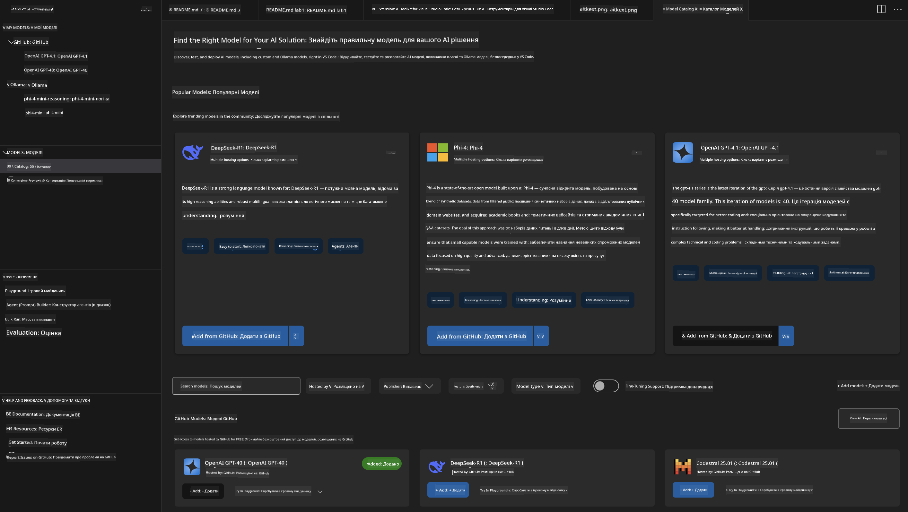
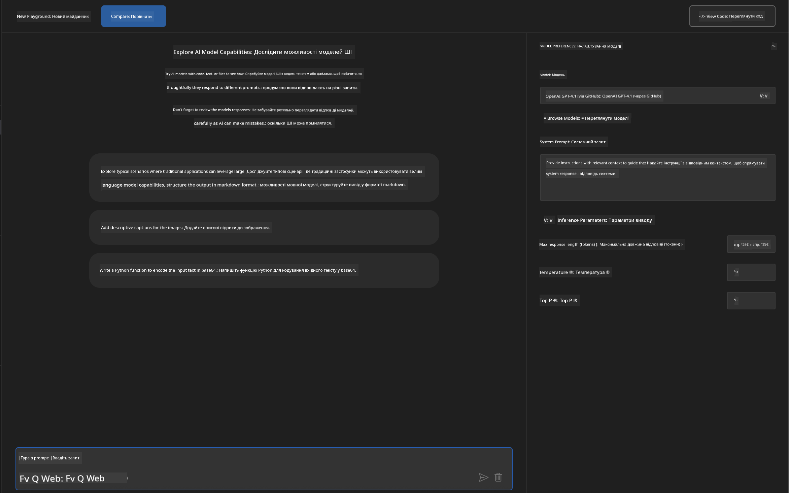
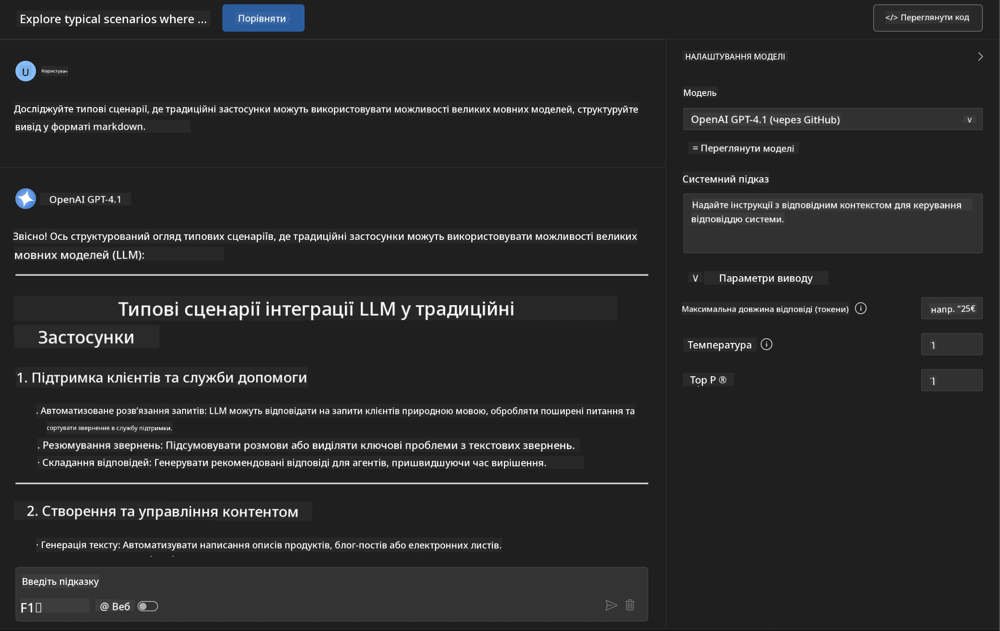
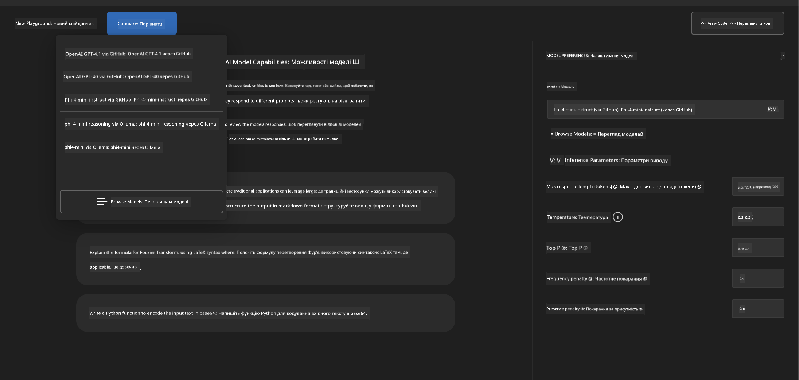
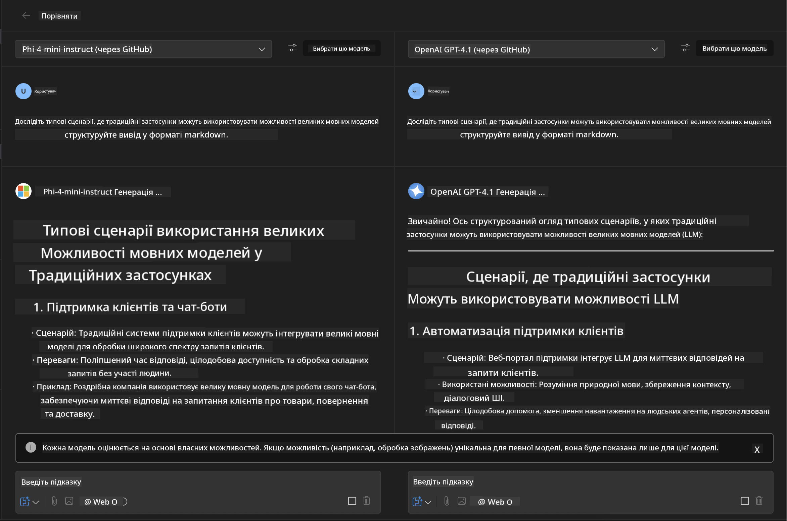
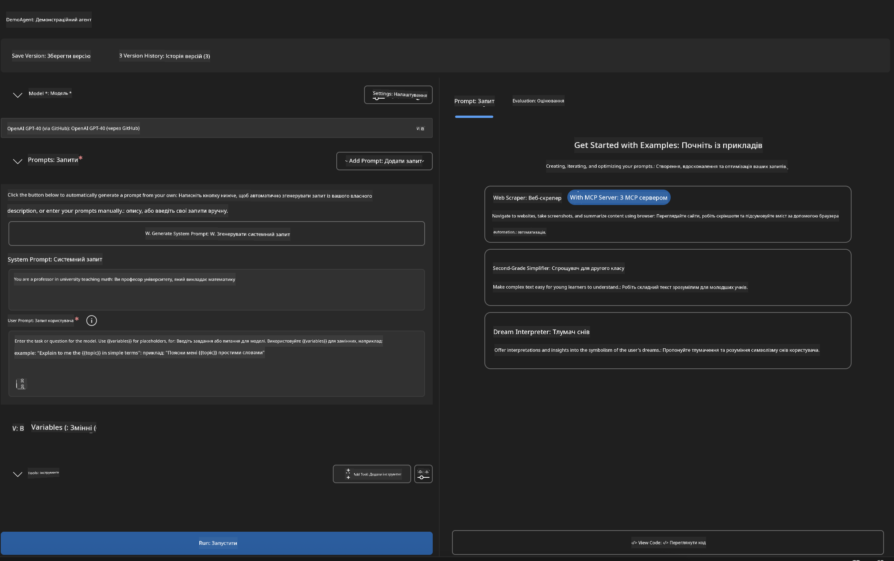
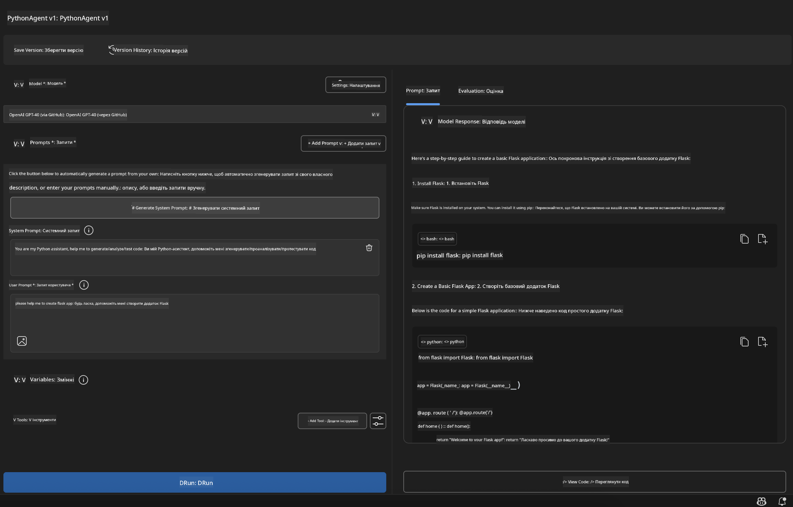

<!--
CO_OP_TRANSLATOR_METADATA:
{
  "original_hash": "2aa9dbc165e104764fa57e8a0d3f1c73",
  "translation_date": "2025-07-14T07:38:02+00:00",
  "source_file": "10-StreamliningAIWorkflowsBuildingAnMCPServerWithAIToolkit/lab1/README.md",
  "language_code": "uk"
}
-->
# 🚀 Модуль 1: Основи AI Toolkit

[]()
[]()
[]()

## 📋 Цілі навчання

До кінця цього модуля ви зможете:
- ✅ Встановити та налаштувати AI Toolkit для Visual Studio Code
- ✅ Орієнтуватися в Каталозі моделей та розуміти різні джерела моделей
- ✅ Використовувати Playground для тестування та експериментів з моделями
- ✅ Створювати власних AI агентів за допомогою Agent Builder
- ✅ Порівнювати продуктивність моделей від різних провайдерів
- ✅ Застосовувати найкращі практики у prompt engineering

## 🧠 Вступ до AI Toolkit (AITK)

**AI Toolkit для Visual Studio Code** — це провідне розширення Microsoft, яке перетворює VS Code на повноцінне середовище розробки AI. Воно поєднує дослідження в галузі AI з практичною розробкою, роблячи генеративний AI доступним для розробників будь-якого рівня.

### 🌟 Основні можливості

| Функція | Опис | Використання |
|---------|-------------|----------|
| **🗂️ Каталог моделей** | Доступ до понад 100 моделей з GitHub, ONNX, OpenAI, Anthropic, Google | Пошук і вибір моделей |
| **🔌 Підтримка BYOM** | Інтеграція власних моделей (локальних/віддалених) | Розгортання кастомних моделей |
| **🎮 Інтерактивний Playground** | Тестування моделей у реальному часі з чат-інтерфейсом | Швидке прототипування і тестування |
| **📎 Підтримка мультимодальності** | Робота з текстом, зображеннями та вкладеннями | Складні AI-застосунки |
| **⚡ Пакетна обробка** | Запуск кількох запитів одночасно | Ефективні робочі процеси тестування |
| **📊 Оцінка моделей** | Вбудовані метрики (F1, релевантність, схожість, когерентність) | Оцінка продуктивності |

### 🎯 Чому AI Toolkit важливий

- **🚀 Прискорена розробка**: від ідеї до прототипу за лічені хвилини
- **🔄 Уніфікований робочий процес**: один інтерфейс для кількох AI провайдерів
- **🧪 Легкі експерименти**: порівнюйте моделі без складного налаштування
- **📈 Готовність до продакшену**: плавний перехід від прототипу до розгортання

## 🛠️ Вимоги та налаштування

### 📦 Встановлення розширення AI Toolkit

**Крок 1: Відкрийте Marketplace розширень**
1. Запустіть Visual Studio Code
2. Перейдіть у розділ Extensions (`Ctrl+Shift+X` або `Cmd+Shift+X`)
3. Знайдіть "AI Toolkit"

**Крок 2: Оберіть версію**
- **🟢 Release**: рекомендовано для використання в продакшені
- **🔶 Pre-release**: ранній доступ до нових функцій

**Крок 3: Встановіть та активуйте**



### ✅ Перевірка встановлення
- [ ] Іконка AI Toolkit з’явилася в бічній панелі VS Code
- [ ] Розширення увімкнене та активоване
- [ ] Відсутні помилки під час встановлення у виводі

## 🧪 Практичне завдання 1: Ознайомлення з моделями GitHub

**🎯 Мета**: Опанувати Каталог моделей і протестувати першу AI модель

### 📊 Крок 1: Перейдіть у Каталог моделей

Каталог моделей — це ваш вхід у світ AI. Він збирає моделі від різних провайдерів, що полегшує пошук і порівняння.

**🔍 Як орієнтуватися:**

Натисніть **MODELS - Catalog** у бічній панелі AI Toolkit



**💡 Порада**: Шукайте моделі з потрібними можливостями, які відповідають вашому завданню (наприклад, генерація коду, креативне письмо, аналіз).

**⚠️ Примітка**: Моделі, розміщені на GitHub (GitHub Models), безкоштовні, але мають обмеження на кількість запитів і токенів. Для доступу до моделей поза GitHub (наприклад, через Azure AI або інші кінцеві точки) потрібен відповідний API ключ або автентифікація.

### 🚀 Крок 2: Додайте та налаштуйте першу модель

**Стратегія вибору моделі:**
- **GPT-4.1**: найкраще підходить для складного мислення та аналізу
- **Phi-4-mini**: легка, швидка відповідь для простих завдань

**🔧 Процес налаштування:**
1. Оберіть **OpenAI GPT-4.1** у каталозі
2. Натисніть **Add to My Models** — модель буде зареєстрована для використання
3. Оберіть **Try in Playground** для запуску середовища тестування
4. Зачекайте на ініціалізацію моделі (перший запуск може зайняти деякий час)



**⚙️ Пояснення параметрів моделі:**
- **Temperature**: контролює креативність (0 = детермінований, 1 = креативний)
- **Max Tokens**: максимальна довжина відповіді
- **Top-p**: ядрова вибірка для різноманітності відповідей

### 🎯 Крок 3: Опануйте інтерфейс Playground

Playground — це ваша лабораторія для експериментів з AI. Ось як максимально ефективно його використовувати:

**🎨 Найкращі практики prompt engineering:**
1. **Будьте конкретними**: чіткі, детальні інструкції дають кращі результати
2. **Надавайте контекст**: включайте релевантну інформацію
3. **Використовуйте приклади**: покажіть моделі, що саме ви хочете
4. **Ітеруйте**: покращуйте запити на основі перших результатів

**🧪 Сценарії тестування:**
```markdown
# Example 1: Code Generation
"Write a Python function that calculates the factorial of a number using recursion. Include error handling and docstrings."

# Example 2: Creative Writing
"Write a professional email to a client explaining a project delay, maintaining a positive tone while being transparent about challenges."

# Example 3: Data Analysis
"Analyze this sales data and provide insights: [paste your data]. Focus on trends, anomalies, and actionable recommendations."
```



### 🏆 Виклик: Порівняння продуктивності моделей

**🎯 Мета**: Порівняти різні моделі на однакових запитах, щоб зрозуміти їхні сильні сторони

**📋 Інструкції:**
1. Додайте **Phi-4-mini** у робочий простір
2. Використайте однаковий запит для GPT-4.1 та Phi-4-mini



3. Порівняйте якість, швидкість і точність відповідей
4. Задокументуйте результати у відповідному розділі



**💡 Ключові висновки:**
- Коли варто використовувати LLM проти SLM
- Баланс вартості та продуктивності
- Спеціалізовані можливості різних моделей

## 🤖 Практичне завдання 2: Створення кастомних агентів за допомогою Agent Builder

**🎯 Мета**: Створити спеціалізованих AI агентів для конкретних завдань і робочих процесів

### 🏗️ Крок 1: Ознайомлення з Agent Builder

Agent Builder — це справжня сила AI Toolkit. Він дозволяє створювати цільові AI асистенти, які поєднують потужність великих мовних моделей із кастомними інструкціями, параметрами та спеціалізованими знаннями.

**🧠 Компоненти архітектури агента:**
- **Core Model**: базова LLM (GPT-4, Groks, Phi тощо)
- **System Prompt**: визначає особистість і поведінку агента
- **Parameters**: налаштування для оптимальної роботи
- **Tools Integration**: підключення до зовнішніх API та MCP сервісів
- **Memory**: контекст розмови та збереження сесії



### ⚙️ Крок 2: Детальний огляд налаштувань агента

**🎨 Створення ефективних системних prompt-ів:**
```markdown
# Template Structure:
## Role Definition
You are a [specific role] with expertise in [domain].

## Capabilities
- List specific abilities
- Define scope of knowledge
- Clarify limitations

## Behavior Guidelines
- Response style (formal, casual, technical)
- Output format preferences
- Error handling approach

## Examples
Provide 2-3 examples of ideal interactions
```

*Звісно, ви також можете скористатися Generate System Prompt, щоб AI допоміг вам створити та оптимізувати prompt-и*

**🔧 Оптимізація параметрів:**
| Параметр | Рекомендований діапазон | Використання |
|-----------|------------------|----------|
| **Temperature** | 0.1-0.3 | Технічні/фактичні відповіді |
| **Temperature** | 0.7-0.9 | Креативні/мозкові штурми |
| **Max Tokens** | 500-1000 | Лаконічні відповіді |
| **Max Tokens** | 2000-4000 | Детальні пояснення |

### 🐍 Крок 3: Практичне завдання — агент для програмування на Python

**🎯 Завдання**: Створити спеціалізованого асистента для кодування на Python

**📋 Кроки налаштування:**

1. **Вибір моделі**: оберіть **Claude 3.5 Sonnet** (відмінно підходить для коду)

2. **Дизайн системного prompt-а**:
```markdown
# Python Programming Expert Agent

## Role
You are a senior Python developer with 10+ years of experience. You excel at writing clean, efficient, and well-documented Python code.

## Capabilities
- Write production-ready Python code
- Debug complex issues
- Explain code concepts clearly
- Suggest best practices and optimizations
- Provide complete working examples

## Response Format
- Always include docstrings
- Add inline comments for complex logic
- Suggest testing approaches
- Mention relevant libraries when applicable

## Code Quality Standards
- Follow PEP 8 style guidelines
- Use type hints where appropriate
- Handle exceptions gracefully
- Write readable, maintainable code
```

3. **Налаштування параметрів**:
   - Temperature: 0.2 (для послідовного, надійного коду)
   - Max Tokens: 2000 (детальні пояснення)
   - Top-p: 0.9 (збалансована креативність)



### 🧪 Крок 4: Тестування вашого Python агента

**Сценарії тестування:**
1. **Базова функція**: "Створити функцію для пошуку простих чисел"
2. **Складний алгоритм**: "Реалізувати бінарне дерево пошуку з методами вставки, видалення та пошуку"
3. **Реальна задача**: "Побудувати веб-скрепер, який враховує обмеження на кількість запитів і повторні спроби"
4. **Відлагодження**: "Виправити цей код [вставте проблемний код]"

**🏆 Критерії успіху:**
- ✅ Код працює без помилок
- ✅ Містить належну документацію
- ✅ Дотримується кращих практик Python
- ✅ Надає чіткі пояснення
- ✅ Пропонує покращення

## 🎓 Підсумок Модуля 1 та подальші кроки

### 📊 Перевірка знань

Перевірте свої знання:
- [ ] Чи можете пояснити різницю між моделями в каталозі?
- [ ] Чи створили та протестували власного агента?
- [ ] Чи розумієте, як оптимізувати параметри для різних завдань?
- [ ] Чи вмієте створювати ефективні системні prompt-и?

### 📚 Додаткові ресурси

- **Документація AI Toolkit**: [Офіційна документація Microsoft](https://github.com/microsoft/vscode-ai-toolkit)
- **Посібник з prompt engineering**: [Найкращі практики](https://platform.openai.com/docs/guides/prompt-engineering)
- **Моделі в AI Toolkit**: [Моделі в розробці](https://github.com/microsoft/vscode-ai-toolkit/blob/main/doc/models.md)

**🎉 Вітаємо!** Ви опанували основи AI Toolkit і готові створювати більш складні AI-застосунки!

### 🔜 Продовжуйте до наступного модуля

Готові до нових можливостей? Продовжуйте до **[Модуль 2: Основи MCP з AI Toolkit](../lab2/README.md)**, де ви навчитеся:
- Підключати агентів до зовнішніх інструментів за допомогою Model Context Protocol (MCP)
- Створювати агенти для автоматизації браузера з Playwright
- Інтегрувати MCP сервери з вашими AI Toolkit агентами
- Посилювати агентів зовнішніми даними та можливостями

**Відмова від відповідальності**:  
Цей документ було перекладено за допомогою сервісу автоматичного перекладу [Co-op Translator](https://github.com/Azure/co-op-translator). Хоча ми прагнемо до точності, будь ласка, майте на увазі, що автоматичні переклади можуть містити помилки або неточності. Оригінальний документ рідною мовою слід вважати авторитетним джерелом. Для критично важливої інформації рекомендується звертатися до професійного людського перекладу. Ми не несемо відповідальності за будь-які непорозуміння або неправильні тлумачення, що виникли внаслідок використання цього перекладу.