<!--
CO_OP_TRANSLATOR_METADATA:
{
  "original_hash": "a22b7dd11cd7690f99f9195877cafdc3",
  "translation_date": "2025-06-17T16:33:55+00:00",
  "source_file": "10-StreamliningAIWorkflowsBuildingAnMCPServerWithAIToolkit/lab2/README.md",
  "language_code": "uk"
}
-->
# 🌐 Модуль 2: Основи MCP з AI Toolkit

[]()
[]()
[]()

## 📋 Цілі навчання

До кінця цього модуля ви зможете:
- ✅ Зрозуміти архітектуру та переваги Model Context Protocol (MCP)
- ✅ Ознайомитися з екосистемою MCP серверів Microsoft
- ✅ Інтегрувати MCP сервери з AI Toolkit Agent Builder
- ✅ Створити функціонального агента для автоматизації браузера за допомогою Playwright MCP
- ✅ Налаштувати та протестувати MCP інструменти у ваших агентах
- ✅ Експортувати та розгортати агентів на базі MCP для використання у виробництві

## 🎯 Розвиток навичок після Модуля 1

У Модулі 1 ми опанували основи AI Toolkit і створили нашого першого Python Агента. Тепер ми **покращимо** ваших агентів, підключивши їх до зовнішніх інструментів і сервісів через революційний **Model Context Protocol (MCP)**.

Уявіть це як оновлення з простого калькулятора до повноцінного комп’ютера — ваші AI агенти отримають можливість:
- 🌐 Переглядати та взаємодіяти з вебсайтами
- 📁 Отримувати доступ та працювати з файлами
- 🔧 Інтегруватися з корпоративними системами
- 📊 Обробляти дані в режимі реального часу з API

## 🧠 Розуміння Model Context Protocol (MCP)

### 🔍 Що таке MCP?

Model Context Protocol (MCP) — це **"USB-C для AI-додатків"** — революційний відкритий стандарт, який з’єднує великі мовні моделі (LLM) із зовнішніми інструментами, джерелами даних і сервісами. Так само, як USB-C усунув плутанину з кабелями, забезпечивши один універсальний роз’єм, MCP спрощує інтеграцію AI, пропонуючи один стандартизований протокол.

### 🎯 Проблема, яку вирішує MCP

**До MCP:**
- 🔧 Індивідуальна інтеграція для кожного інструменту
- 🔄 Залежність від постачальника через пропрієтарні рішення  
- 🔒 Вразливості безпеки через випадкові підключення
- ⏱️ Місяці розробки для базових інтеграцій

**З MCP:**
- ⚡ Інтеграція інструментів за принципом plug-and-play
- 🔄 Незалежна від постачальників архітектура
- 🛡️ Вбудовані найкращі практики безпеки
- 🚀 Хвилини для додавання нових можливостей

### 🏗️ Глибокий погляд на архітектуру MCP

MCP базується на **клієнт-серверній архітектурі**, що створює безпечну та масштабовану екосистему:

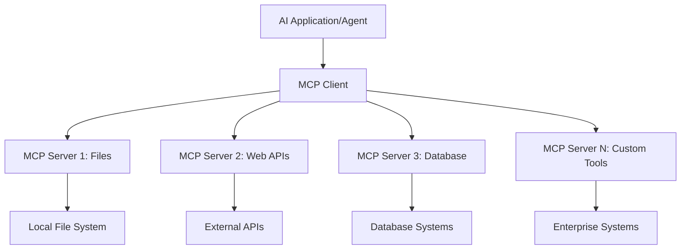

**🔧 Основні компоненти:**

| Компонент | Роль | Приклади |
|-----------|------|----------|
| **MCP Hosts** | Додатки, які використовують сервіси MCP | Claude Desktop, VS Code, AI Toolkit |
| **MCP Clients** | Обробники протоколу (1:1 з серверами) | Вбудовані у хост-додатки |
| **MCP Servers** | Надають можливості через стандартний протокол | Playwright, Files, Azure, GitHub |
| **Транспортний рівень** | Методи зв’язку | stdio, HTTP, WebSockets |

## 🏢 Екосистема MCP серверів Microsoft

Microsoft очолює екосистему MCP з комплексним набором корпоративних серверів, які вирішують реальні бізнес-завдання.

### 🌟 Відзначені MCP сервери Microsoft

#### 1. ☁️ Azure MCP Server
**🔗 Репозиторій**: [azure/azure-mcp](https://github.com/azure/azure-mcp)  
**🎯 Призначення**: Комплексне управління ресурсами Azure з інтеграцією AI

**✨ Ключові функції:**
- Декларативне забезпечення інфраструктури
- Моніторинг ресурсів у реальному часі
- Рекомендації щодо оптимізації витрат
- Перевірка відповідності безпеки

**🚀 Випадки використання:**
- Інфраструктура як код з підтримкою AI
- Автоматичне масштабування ресурсів
- Оптимізація витрат на хмару
- Автоматизація DevOps-процесів

#### 2. 📊 Microsoft Dataverse MCP
**📚 Документація**: [Microsoft Dataverse Integration](https://go.microsoft.com/fwlink/?linkid=2320176)  
**🎯 Призначення**: Інтерфейс природною мовою для бізнес-даних

**✨ Ключові функції:**
- Запити до бази даних природною мовою
- Розуміння бізнес-контексту
- Користувацькі шаблони запитів
- Управління корпоративними даними

**🚀 Випадки використання:**
- Звіти бізнес-аналітики
- Аналіз даних клієнтів
- Оцінка воронки продажів
- Запити для відповідності вимогам

#### 3. 🌐 Playwright MCP Server
**🔗 Репозиторій**: [microsoft/playwright-mcp](https://github.com/microsoft/playwright-mcp)  
**🎯 Призначення**: Автоматизація браузера та взаємодія з вебом

**✨ Ключові функції:**
- Автоматизація для різних браузерів (Chrome, Firefox, Safari)
- Інтелектуальне виявлення елементів
- Створення скріншотів і PDF
- Моніторинг мережевого трафіку

**🚀 Випадки використання:**
- Автоматизоване тестування
- Веб-скрапінг і витяг даних
- Моніторинг UI/UX
- Автоматизація конкурентного аналізу

#### 4. 📁 Files MCP Server
**🔗 Репозиторій**: [microsoft/files-mcp-server](https://github.com/microsoft/files-mcp-server)  
**🎯 Призначення**: Інтелектуальні операції з файловою системою

**✨ Ключові функції:**
- Декларативне управління файлами
- Синхронізація вмісту
- Інтеграція з системами контролю версій
- Витяг метаданих

**🚀 Випадки використання:**
- Управління документацією
- Організація репозиторіїв коду
- Робочі процеси публікації контенту
- Обробка файлів у дата-пайплайнах

#### 5. 📝 MarkItDown MCP Server
**🔗 Репозиторій**: [microsoft/markitdown](https://github.com/microsoft/markitdown)  
**🎯 Призначення**: Просунута обробка та маніпуляції Markdown

**✨ Ключові функції:**
- Потужний парсинг Markdown
- Конвертація форматів (MD ↔ HTML ↔ PDF)
- Аналіз структури контенту
- Обробка шаблонів

**🚀 Випадки використання:**
- Робочі процеси технічної документації
- Системи управління контентом
- Генерація звітів
- Автоматизація бази знань

#### 6. 📈 Clarity MCP Server
**📦 Пакет**: [@microsoft/clarity-mcp-server](https://www.npmjs.com/package/@microsoft/clarity-mcp-server)  
**🎯 Призначення**: Веб-аналітика та інсайти про поведінку користувачів

**✨ Ключові функції:**
- Аналіз теплових карт
- Запис сесій користувачів
- Метрики продуктивності
- Аналіз конверсійних воронок

**🚀 Випадки використання:**
- Оптимізація вебсайтів
- Дослідження користувацького досвіду
- Аналіз A/B тестів
- Панелі бізнес-аналітики

### 🌍 Екосистема спільноти

Окрім серверів Microsoft, екосистема MCP включає:
- **🐙 GitHub MCP**: Управління репозиторіями та аналіз коду
- **🗄️ MCP для баз даних**: Інтеграції PostgreSQL, MySQL, MongoDB
- **☁️ MCP для хмарних провайдерів**: Інструменти AWS, GCP, Digital Ocean
- **📧 MCP для комунікацій**: Інтеграції Slack, Teams, Email

## 🛠️ Практична лабораторія: Створення агента для автоматизації браузера

**🎯 Мета проекту**: Створити розумного агента для автоматизації браузера за допомогою Playwright MCP server, який може навігувати вебсайтами, витягувати інформацію та виконувати складні веб-взаємодії.

### 🚀 Фаза 1: Налаштування основ агента

#### Крок 1: Ініціалізація агента
1. **Відкрийте AI Toolkit Agent Builder**  
2. **Створіть нового агента** з наступною конфігурацією:  
   - **Ім’я**: `BrowserAgent`
   - **Model**: Choose GPT-4o 

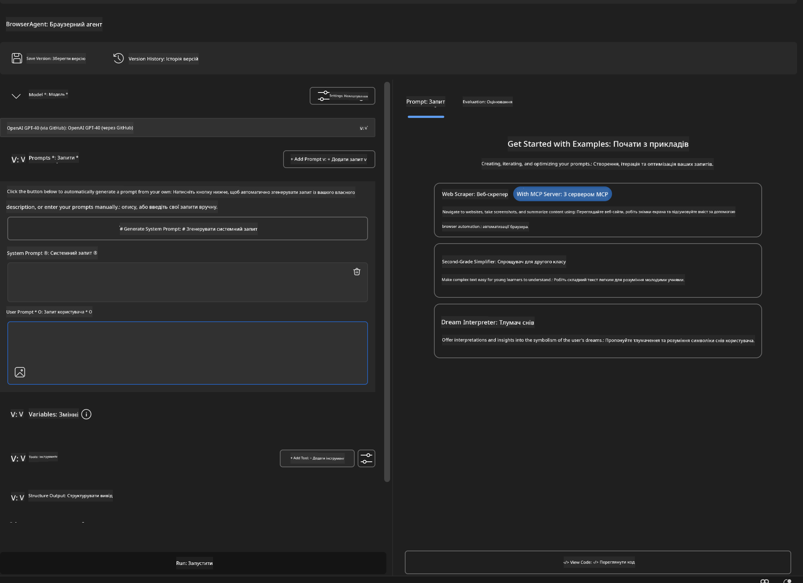


### 🔧 Phase 2: MCP Integration Workflow

#### Step 3: Add MCP Server Integration
1. **Navigate to Tools Section** in Agent Builder
2. **Click "Add Tool"** to open the integration menu
3. **Select "MCP Server"** from available options

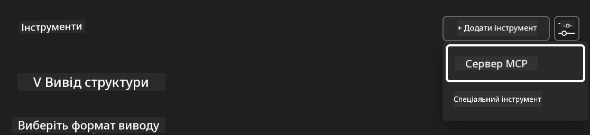

**🔍 Understanding Tool Types:**
- **Built-in Tools**: Pre-configured AI Toolkit functions
- **MCP Servers**: External service integrations
- **Custom APIs**: Your own service endpoints
- **Function Calling**: Direct model function access

#### Step 4: MCP Server Selection
1. **Choose "MCP Server"** option to proceed
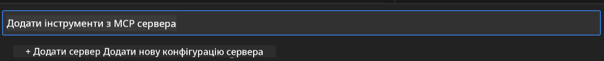

2. **Browse MCP Catalog** to explore available integrations
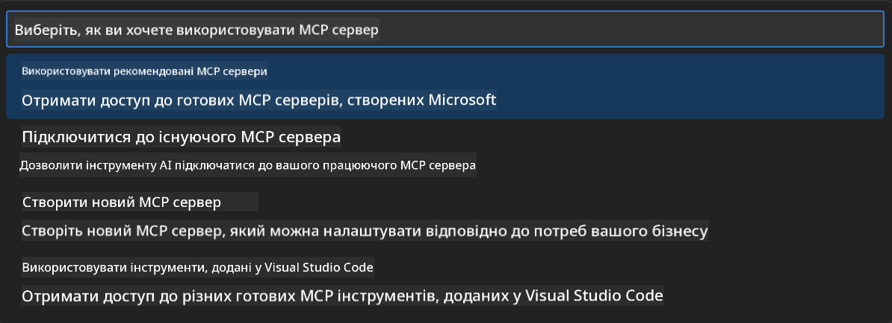


### 🎮 Phase 3: Playwright MCP Configuration

#### Step 5: Select and Configure Playwright
1. **Click "Use Featured MCP Servers"** to access Microsoft's verified servers
2. **Select "Playwright"** from the featured list
3. **Accept Default MCP ID** or customize for your environment

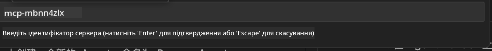

#### Step 6: Enable Playwright Capabilities
**🔑 Critical Step**: Select **ALL** available Playwright methods for maximum functionality

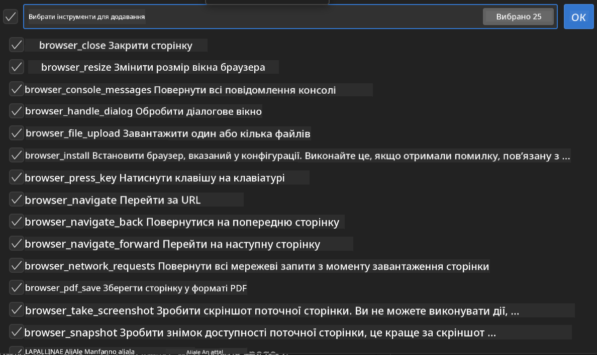

**🛠️ Essential Playwright Tools:**
- **Navigation**: `goto`, `goBack`, `goForward`, `reload`
- **Interaction**: `click`, `fill`, `press`, `hover`, `drag`
- **Extraction**: `textContent`, `innerHTML`, `getAttribute`
- **Validation**: `isVisible`, `isEnabled`, `waitForSelector`
- **Capture**: `screenshot`, `pdf`, `video`
- **Network**: `setExtraHTTPHeaders`, `route`, `waitForResponse`

#### Крок 7: Перевірка успішної інтеграції
**✅ Ознаки успіху:**
- Всі інструменти відображаються в інтерфейсі Agent Builder
- Відсутні повідомлення про помилки в панелі інтеграції
- Статус сервера Playwright показує "Connected"

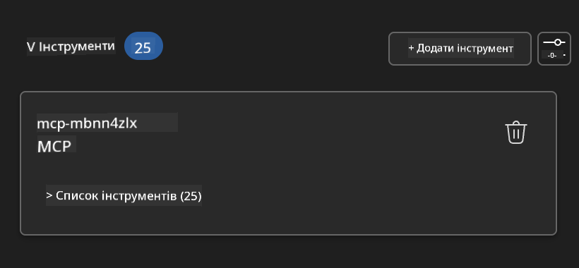

**🔧 Усунення поширених проблем:**
- **Помилка підключення**: Перевірте інтернет-з’єднання та налаштування брандмауера
- **Відсутні інструменти**: Переконайтеся, що всі можливості були вибрані під час налаштування
- **Помилки доступу**: Перевірте, чи має VS Code необхідні системні дозволи

### 🎯 Фаза 4: Просунуте створення підказок

#### Крок 8: Розробка інтелектуальних системних підказок
Створіть складні підказки, що використовують повний потенціал Playwright:

```markdown
# Web Automation Expert System Prompt

## Core Identity
You are an advanced web automation specialist with deep expertise in browser automation, web scraping, and user experience analysis. You have access to Playwright tools for comprehensive browser control.

## Capabilities & Approach
### Navigation Strategy
- Always start with screenshots to understand page layout
- Use semantic selectors (text content, labels) when possible
- Implement wait strategies for dynamic content
- Handle single-page applications (SPAs) effectively

### Error Handling
- Retry failed operations with exponential backoff
- Provide clear error descriptions and solutions
- Suggest alternative approaches when primary methods fail
- Always capture diagnostic screenshots on errors

### Data Extraction
- Extract structured data in JSON format when possible
- Provide confidence scores for extracted information
- Validate data completeness and accuracy
- Handle pagination and infinite scroll scenarios

### Reporting
- Include step-by-step execution logs
- Provide before/after screenshots for verification
- Suggest optimizations and alternative approaches
- Document any limitations or edge cases encountered

## Ethical Guidelines
- Respect robots.txt and rate limiting
- Avoid overloading target servers
- Only extract publicly available information
- Follow website terms of service
```

#### Крок 9: Створення динамічних користувацьких підказок
Розробіть підказки, що демонструють різні можливості:

**🌐 Приклад веб-аналізу:**
```markdown
Navigate to github.com/kinfey and provide a comprehensive analysis including:
1. Repository structure and organization
2. Recent activity and contribution patterns  
3. Documentation quality assessment
4. Technology stack identification
5. Community engagement metrics
6. Notable projects and their purposes

Include screenshots at key steps and provide actionable insights.
```

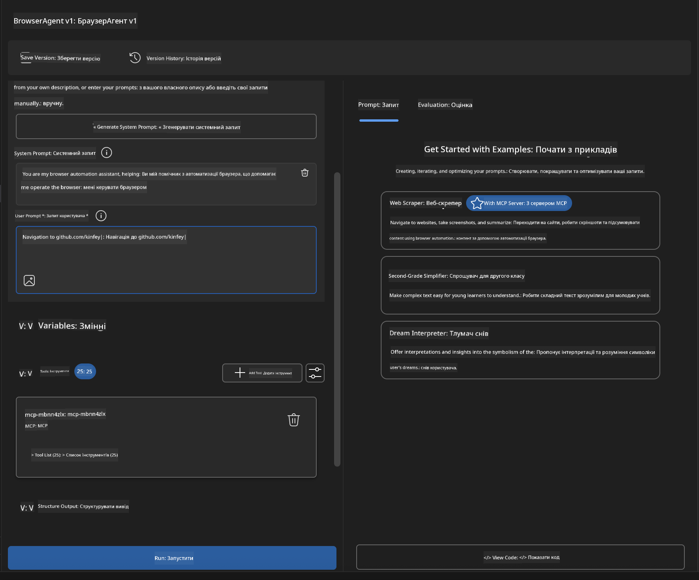

### 🚀 Фаза 5: Виконання та тестування

#### Крок 10: Запуск першої автоматизації
1. **Натисніть "Run"** для запуску послідовності автоматизації  
2. **Слідкуйте за виконанням у реальному часі**:  
   - Автоматично запускається браузер Chrome  
   - Агент переходить на цільовий вебсайт  
   - Скріншоти робляться на кожному ключовому кроці  
   - Результати аналізу відображаються у режимі реального часу

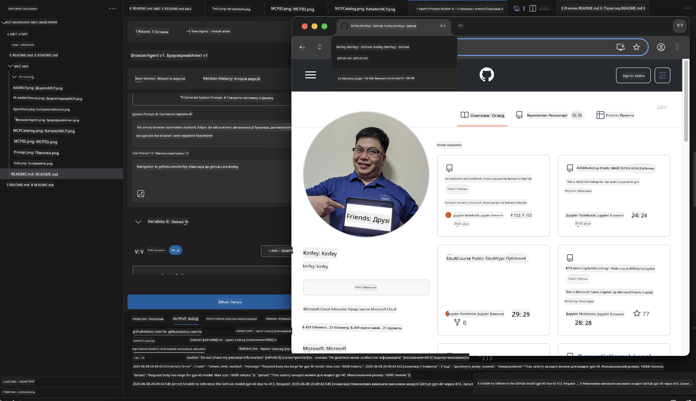

#### Крок 11: Аналіз результатів та інсайтів
Огляньте детальний аналіз в інтерфейсі Agent Builder:

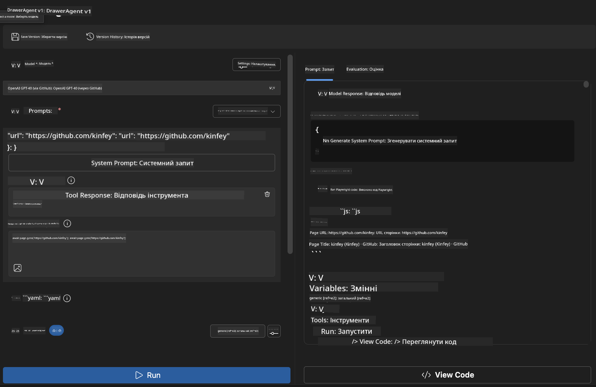

### 🌟 Фаза 6: Розширені можливості та розгортання

#### Крок 12: Експорт і розгортання у виробництві
Agent Builder підтримує кілька варіантів розгортання:

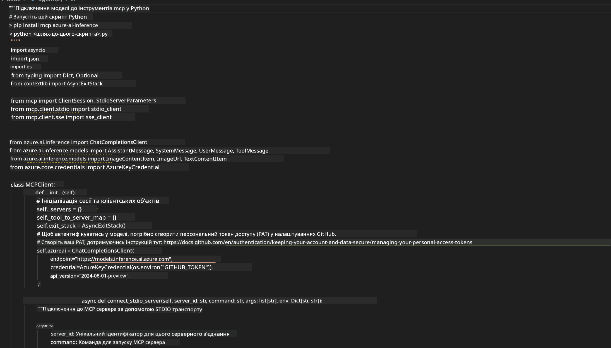

## 🎓 Підсумок Модуля 2 та подальші кроки

### 🏆 Досягнення: Майстер інтеграції MCP

**✅ Освоєні навички:**
- [ ] Розуміння архітектури та переваг MCP
- [ ] Орієнтування в екосистемі MCP серверів Microsoft
- [ ] Інтеграція Playwright MCP з AI Toolkit
- [ ] Створення складних агентів для автоматизації браузера
- [ ] Просунуте створення підказок для веб-автоматизації

### 📚 Додаткові ресурси

- **🔗 Специфікація MCP**: [Офіційна документація протоколу](https://modelcontextprotocol.io/)
- **🛠️ Playwright API**: [Повний довідник методів](https://playwright.dev/docs/api/class-playwright)
- **🏢 MCP сервери Microsoft**: [Посібник з корпоративної інтеграції](https://github.com/microsoft/mcp-servers)
- **🌍 Приклади спільноти**: [Галерея MCP серверів](https://github.com/modelcontextprotocol/servers)

**🎉 Вітаємо!** Ви успішно опанували інтеграцію MCP і тепер можете створювати AI агентів для виробництва з підтримкою зовнішніх інструментів!

### 🔜 Продовжуйте до наступного модуля

Готові підняти свої навички MCP на новий рівень? Перейдіть до **[Модуля 3: Просунута розробка MCP з AI Toolkit](../lab3/README.md)**, де ви навчитеся:
- Створювати власні кастомні MCP сервери
- Налаштовувати та використовувати останній MCP Python SDK
- Працювати з MCP Inspector для відлагодження
- Опанувати просунуті робочі процеси розробки MCP серверів
- Створити Weather MCP Server з нуля

**Відмова від відповідальності**:  
Цей документ було перекладено за допомогою сервісу автоматичного перекладу [Co-op Translator](https://github.com/Azure/co-op-translator). Хоч ми й прагнемо до точності, просимо враховувати, що автоматичні переклади можуть містити помилки або неточності. Оригінальний документ рідною мовою слід вважати авторитетним джерелом. Для критично важливої інформації рекомендується звертатися до професійного людського перекладу. Ми не несемо відповідальності за будь-які непорозуміння чи неправильні тлумачення, що виникли внаслідок використання цього перекладу.