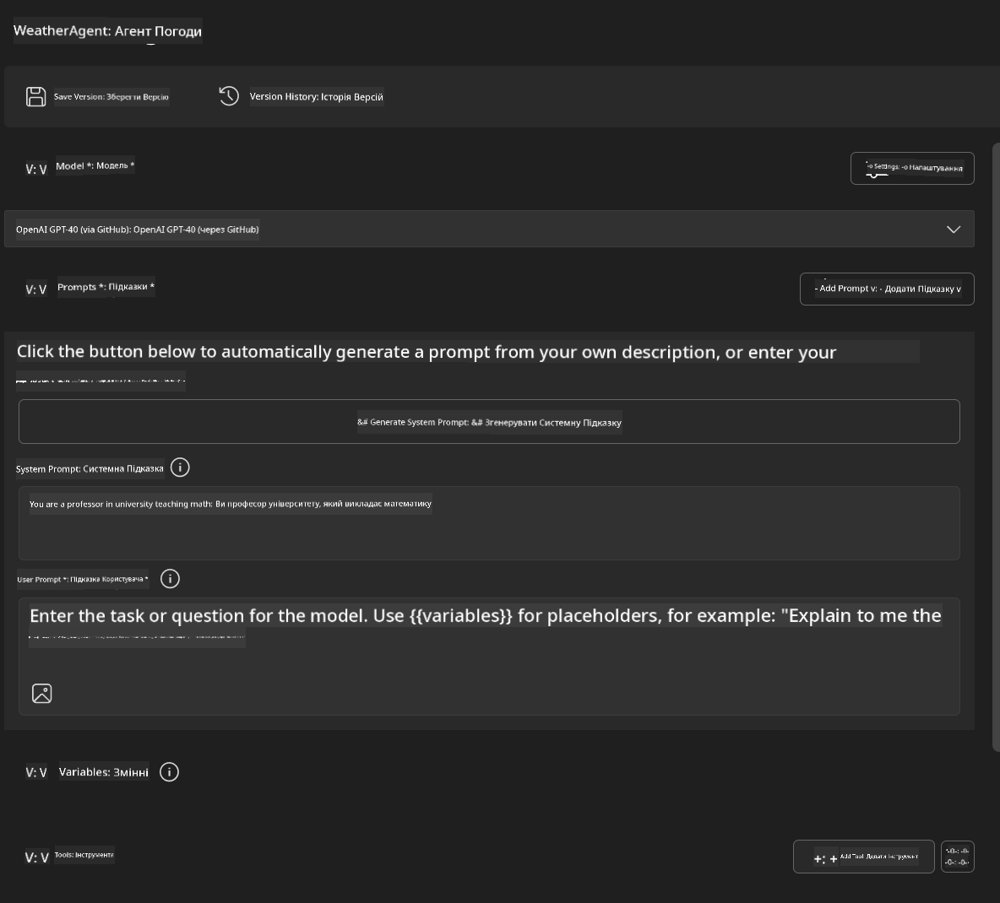
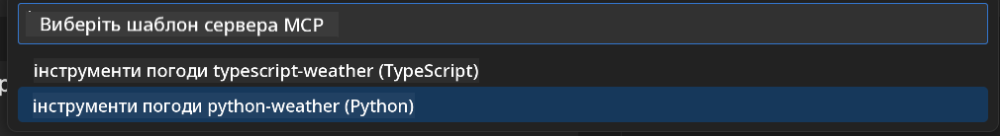
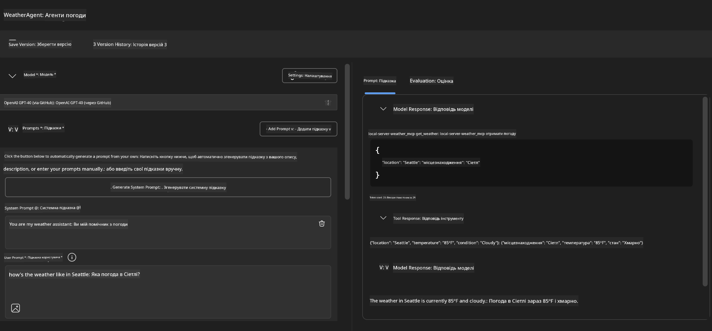
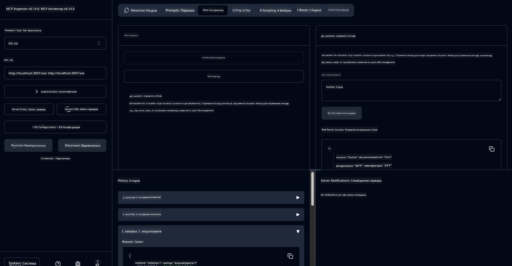

<!--
CO_OP_TRANSLATOR_METADATA:
{
  "original_hash": "dd8da3f75addcef453fe11f02a270217",
  "translation_date": "2025-07-14T08:21:36+00:00",
  "source_file": "10-StreamliningAIWorkflowsBuildingAnMCPServerWithAIToolkit/lab3/README.md",
  "language_code": "uk"
}
-->
# 🔧 Модуль 3: Розширена розробка MCP з AI Toolkit


## 🎯 Цілі навчання

До кінця цієї лабораторної роботи ви зможете:

- ✅ Створювати власні MCP сервери за допомогою AI Toolkit
- ✅ Налаштовувати та використовувати останню версію MCP Python SDK (v1.9.3)
- ✅ Налаштовувати та використовувати MCP Inspector для налагодження
- ✅ Налагоджувати MCP сервери як у середовищі Agent Builder, так і в Inspector
- ✅ Розуміти розширені робочі процеси розробки MCP серверів

## 📋 Вимоги

- Завершення Лабораторної роботи 2 (Основи MCP)
- VS Code з встановленим розширенням AI Toolkit
- Середовище Python 3.10+
- Node.js та npm для налаштування Inspector

## 🏗️ Що ви створите

У цій лабораторній роботі ви створите **Weather MCP Server**, який демонструє:
- Власну реалізацію MCP сервера
- Інтеграцію з AI Toolkit Agent Builder
- Професійні робочі процеси налагодження
- Сучасні патерни використання MCP SDK

---

## 🔧 Огляд основних компонентів

### 🐍 MCP Python SDK
Python SDK для Model Context Protocol забезпечує основу для створення власних MCP серверів. Ви використовуватимете версію 1.9.3 з покращеними можливостями налагодження.

### 🔍 MCP Inspector
Потужний інструмент для налагодження, який надає:
- Моніторинг сервера в реальному часі
- Візуалізацію виконання інструментів
- Перевірку мережевих запитів/відповідей
- Інтерактивне тестове середовище

---

## 📖 Покрокова реалізація

### Крок 1: Створення WeatherAgent в Agent Builder

1. **Запустіть Agent Builder** у VS Code через розширення AI Toolkit
2. **Створіть нового агента** з наступною конфігурацією:
   - Ім’я агента: `WeatherAgent`



### Крок 2: Ініціалізація проекту MCP Server

1. **Перейдіть у Tools** → **Add Tool** в Agent Builder
2. **Виберіть "MCP Server"** зі списку доступних опцій
3. **Обрати "Create A new MCP Server"**
4. **Виберіть шаблон `python-weather`**
5. **Назвіть сервер:** `weather_mcp`



### Крок 3: Відкрийте та ознайомтесь з проектом

1. **Відкрийте згенерований проект** у VS Code
2. **Перегляньте структуру проекту:**
   ```
   weather_mcp/
   ├── src/
   │   ├── __init__.py
   │   └── server.py
   ├── inspector/
   │   ├── package.json
   │   └── package-lock.json
   ├── .vscode/
   │   ├── launch.json
   │   └── tasks.json
   ├── pyproject.toml
   └── README.md
   ```

### Крок 4: Оновлення до останньої версії MCP SDK

> **🔍 Чому оновлювати?** Ми хочемо використовувати останню версію MCP SDK (v1.9.3) та сервіс Inspector (0.14.0) для розширених функцій і кращих можливостей налагодження.

#### 4a. Оновлення Python-залежностей

**Відредагуйте `pyproject.toml`:** оновіть [./code/weather_mcp/pyproject.toml](../../../../10-StreamliningAIWorkflowsBuildingAnMCPServerWithAIToolkit/lab3/code/weather_mcp/pyproject.toml)

#### 4b. Оновлення конфігурації Inspector

**Відредагуйте `inspector/package.json`:** оновіть [./code/weather_mcp/inspector/package.json](../../../../10-StreamliningAIWorkflowsBuildingAnMCPServerWithAIToolkit/lab3/code/weather_mcp/inspector/package.json)

#### 4c. Оновлення залежностей Inspector

**Відредагуйте `inspector/package-lock.json`:** оновіть [./code/weather_mcp/inspector/package-lock.json](../../../../10-StreamliningAIWorkflowsBuildingAnMCPServerWithAIToolkit/lab3/code/weather_mcp/inspector/package-lock.json)

> **📝 Примітка:** Цей файл містить велику кількість визначень залежностей. Нижче наведена основна структура — повний вміст забезпечує коректне розв’язання залежностей.

> **⚡ Повний Package Lock:** Повний файл package-lock.json містить близько 3000 рядків визначень залежностей. Вище показана ключова структура — використовуйте наданий файл для повного розв’язання залежностей.

### Крок 5: Налаштування налагодження у VS Code

*Примітка: Будь ласка, скопіюйте файл у вказаному шляху, щоб замінити відповідний локальний файл*

#### 5a. Оновлення конфігурації запуску

**Відредагуйте `.vscode/launch.json`:**

```json
{
  "version": "0.2.0",
  "configurations": [
    {
      "name": "Attach to Local MCP",
      "type": "debugpy",
      "request": "attach",
      "connect": {
        "host": "localhost",
        "port": 5678
      },
      "presentation": {
        "hidden": true
      },
      "internalConsoleOptions": "neverOpen",
      "postDebugTask": "Terminate All Tasks"
    },
    {
      "name": "Launch Inspector (Edge)",
      "type": "msedge",
      "request": "launch",
      "url": "http://localhost:6274?timeout=60000&serverUrl=http://localhost:3001/sse#tools",
      "cascadeTerminateToConfigurations": [
        "Attach to Local MCP"
      ],
      "presentation": {
        "hidden": true
      },
      "internalConsoleOptions": "neverOpen"
    },
    {
      "name": "Launch Inspector (Chrome)",
      "type": "chrome",
      "request": "launch",
      "url": "http://localhost:6274?timeout=60000&serverUrl=http://localhost:3001/sse#tools",
      "cascadeTerminateToConfigurations": [
        "Attach to Local MCP"
      ],
      "presentation": {
        "hidden": true
      },
      "internalConsoleOptions": "neverOpen"
    }
  ],
  "compounds": [
    {
      "name": "Debug in Agent Builder",
      "configurations": [
        "Attach to Local MCP"
      ],
      "preLaunchTask": "Open Agent Builder",
    },
    {
      "name": "Debug in Inspector (Edge)",
      "configurations": [
        "Launch Inspector (Edge)",
        "Attach to Local MCP"
      ],
      "preLaunchTask": "Start MCP Inspector",
      "stopAll": true
    },
    {
      "name": "Debug in Inspector (Chrome)",
      "configurations": [
        "Launch Inspector (Chrome)",
        "Attach to Local MCP"
      ],
      "preLaunchTask": "Start MCP Inspector",
      "stopAll": true
    }
  ]
}
```

**Відредагуйте `.vscode/tasks.json`:**

```
{
  "version": "2.0.0",
  "tasks": [
    {
      "label": "Start MCP Server",
      "type": "shell",
      "command": "python -m debugpy --listen 127.0.0.1:5678 src/__init__.py sse",
      "isBackground": true,
      "options": {
        "cwd": "${workspaceFolder}",
        "env": {
          "PORT": "3001"
        }
      },
      "problemMatcher": {
        "pattern": [
          {
            "regexp": "^.*$",
            "file": 0,
            "location": 1,
            "message": 2
          }
        ],
        "background": {
          "activeOnStart": true,
          "beginsPattern": ".*",
          "endsPattern": "Application startup complete|running"
        }
      }
    },
    {
      "label": "Start MCP Inspector",
      "type": "shell",
      "command": "npm run dev:inspector",
      "isBackground": true,
      "options": {
        "cwd": "${workspaceFolder}/inspector",
        "env": {
          "CLIENT_PORT": "6274",
          "SERVER_PORT": "6277",
        }
      },
      "problemMatcher": {
        "pattern": [
          {
            "regexp": "^.*$",
            "file": 0,
            "location": 1,
            "message": 2
          }
        ],
        "background": {
          "activeOnStart": true,
          "beginsPattern": "Starting MCP inspector",
          "endsPattern": "Proxy server listening on port"
        }
      },
      "dependsOn": [
        "Start MCP Server"
      ]
    },
    {
      "label": "Open Agent Builder",
      "type": "shell",
      "command": "echo ${input:openAgentBuilder}",
      "presentation": {
        "reveal": "never"
      },
      "dependsOn": [
        "Start MCP Server"
      ],
    },
    {
      "label": "Terminate All Tasks",
      "command": "echo ${input:terminate}",
      "type": "shell",
      "problemMatcher": []
    }
  ],
  "inputs": [
    {
      "id": "openAgentBuilder",
      "type": "command",
      "command": "ai-mlstudio.agentBuilder",
      "args": {
        "initialMCPs": [ "local-server-weather_mcp" ],
        "triggeredFrom": "vsc-tasks"
      }
    },
    {
      "id": "terminate",
      "type": "command",
      "command": "workbench.action.tasks.terminate",
      "args": "terminateAll"
    }
  ]
}
```

---

## 🚀 Запуск і тестування вашого MCP сервера

### Крок 6: Встановлення залежностей

Після внесення змін у конфігурацію виконайте наступні команди:

**Встановлення Python-залежностей:**
```bash
uv sync
```

**Встановлення залежностей Inspector:**
```bash
cd inspector
npm install
```

### Крок 7: Налагодження через Agent Builder

1. **Натисніть F5** або використайте конфігурацію **"Debug in Agent Builder"**
2. **Виберіть compound конфігурацію** у панелі налагодження
3. **Дочекайтесь запуску сервера** та відкриття Agent Builder
4. **Перевірте роботу вашого weather MCP сервера** за допомогою запитів природною мовою

Введіть запит, наприклад

SYSTEM_PROMPT

```
You are my weather assistant
```

USER_PROMPT

```
How's the weather like in Seattle
```



### Крок 8: Налагодження через MCP Inspector

1. **Використайте конфігурацію "Debug in Inspector"** (Edge або Chrome)
2. **Відкрийте інтерфейс Inspector** за адресою `http://localhost:6274`
3. **Ознайомтесь з інтерактивним тестовим середовищем:**
   - Перегляд доступних інструментів
   - Тестування виконання інструментів
   - Моніторинг мережевих запитів
   - Налагодження відповідей сервера



---

## 🎯 Основні результати навчання

Виконавши цю лабораторну роботу, ви:

- [x] **Створили власний MCP сервер** за допомогою шаблонів AI Toolkit
- [x] **Оновилися до останньої версії MCP SDK** (v1.9.3) для розширеної функціональності
- [x] **Налаштували професійні робочі процеси налагодження** для Agent Builder та Inspector
- [x] **Налаштували MCP Inspector** для інтерактивного тестування сервера
- [x] **Опановували конфігурації налагодження у VS Code** для розробки MCP

## 🔧 Розглянуті розширені можливості

| Функція | Опис | Сценарій використання |
|---------|-------------|----------|
| **MCP Python SDK v1.9.3** | Остання реалізація протоколу | Сучасна розробка серверів |
| **MCP Inspector 0.14.0** | Інтерактивний інструмент налагодження | Тестування сервера в реальному часі |
| **Налагодження у VS Code** | Інтегроване середовище розробки | Професійний робочий процес налагодження |
| **Інтеграція з Agent Builder** | Пряме підключення AI Toolkit | Повне тестування агента |

## 📚 Додаткові ресурси

- [Документація MCP Python SDK](https://modelcontextprotocol.io/docs/sdk/python)
- [Посібник з розширення AI Toolkit](https://code.visualstudio.com/docs/ai/ai-toolkit)
- [Документація з налагодження у VS Code](https://code.visualstudio.com/docs/editor/debugging)
- [Специфікація Model Context Protocol](https://modelcontextprotocol.io/docs/concepts/architecture)

---

**🎉 Вітаємо!** Ви успішно завершили Лабораторну роботу 3 і тепер можете створювати, налагоджувати та розгортати власні MCP сервери, використовуючи професійні робочі процеси розробки.

### 🔜 Продовжуйте до наступного модуля

Готові застосувати свої навички MCP у реальному робочому процесі розробки? Продовжуйте до **[Модуль 4: Практична розробка MCP - власний сервер клонування GitHub](../lab4/README.md)**, де ви:
- Створите готовий до продакшену MCP сервер для автоматизації операцій з репозиторіями GitHub
- Реалізуєте функціонал клонування репозиторіїв GitHub через MCP
- Інтегруєте власні MCP сервери з VS Code та GitHub Copilot Agent Mode
- Тестуватимете та розгортатимете MCP сервери у продакшен-середовищах
- Навчитеся практичній автоматизації робочих процесів для розробників

**Відмова від відповідальності**:  
Цей документ було перекладено за допомогою сервісу автоматичного перекладу [Co-op Translator](https://github.com/Azure/co-op-translator). Хоча ми прагнемо до точності, будь ласка, майте на увазі, що автоматичні переклади можуть містити помилки або неточності. Оригінальний документ рідною мовою слід вважати авторитетним джерелом. Для критично важливої інформації рекомендується звертатися до професійного людського перекладу. Ми не несемо відповідальності за будь-які непорозуміння або неправильні тлумачення, що виникли внаслідок використання цього перекладу.