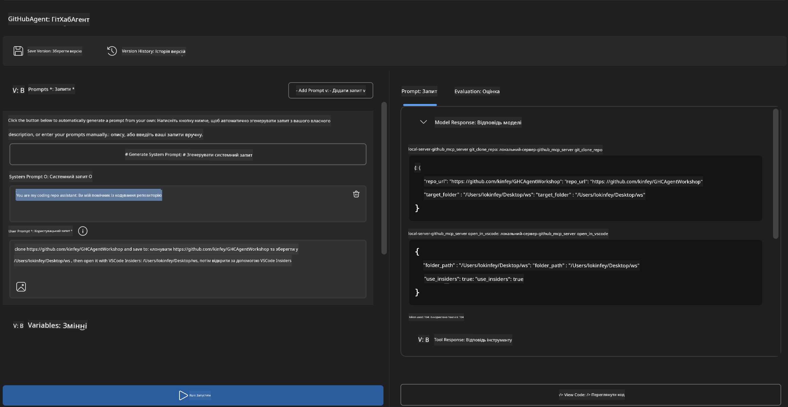
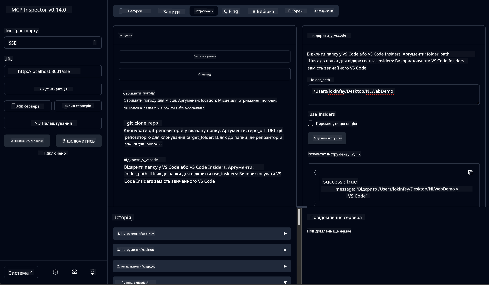

<!--
CO_OP_TRANSLATOR_METADATA:
{
  "original_hash": "f83bc722dc758efffd68667d6a1db470",
  "translation_date": "2025-06-17T16:31:51+00:00",
  "source_file": "10-StreamliningAIWorkflowsBuildingAnMCPServerWithAIToolkit/lab4/README.md",
  "language_code": "uk"
}
-->
# 🐙 Модуль 4: Практична розробка MCP – Кастомний сервер клонування GitHub


> **⚡ Швидкий старт:** Створіть MCP сервер готовий до продакшену, який автоматизує клонування репозиторіїв GitHub та інтеграцію з VS Code всього за 30 хвилин!

## 🎯 Цілі навчання

До кінця цього лабораторного заняття ви зможете:

- ✅ Створювати кастомний MCP сервер для реальних робочих процесів розробки
- ✅ Реалізувати функціонал клонування репозиторіїв GitHub через MCP
- ✅ Інтегрувати кастомні MCP сервери з VS Code та Agent Builder
- ✅ Використовувати GitHub Copilot Agent Mode з кастомними MCP інструментами
- ✅ Тестувати та розгортати кастомні MCP сервери у продуктивних середовищах

## 📋 Необхідні умови

- Завершення лабораторних 1-3 (основи MCP та просунута розробка)
- Підписка на GitHub Copilot ([доступна безкоштовна реєстрація](https://github.com/github-copilot/signup))
- VS Code з розширеннями AI Toolkit та GitHub Copilot
- Встановлений та налаштований Git CLI

## 🏗️ Огляд проєкту

### **Реальна задача розробки**
Як розробники, ми часто користуємося GitHub для клонування репозиторіїв та відкриття їх у VS Code або VS Code Insiders. Цей ручний процес включає:
1. Відкриття терміналу/командного рядка
2. Перехід до потрібної директорії
3. Виконання команди `git clone`
4. Відкриття VS Code у клонованій директорії

**Наше MCP рішення об’єднує це в одну інтелектуальну команду!**

### **Що ви створите**
**GitHub Clone MCP Server** (`git_mcp_server`), який надає:

| Функція | Опис | Перевага |
|---------|-------|----------|
| 🔄 **Інтелектуальне клонування репозиторіїв** | Клонування GitHub репозиторіїв з перевіркою | Автоматична перевірка помилок |
| 📁 **Розумне управління директоріями** | Безпечна перевірка та створення директорій | Запобігає перезапису |
| 🚀 **Кросплатформенна інтеграція з VS Code** | Відкриття проєктів у VS Code/Insiders | Безперервний робочий процес |
| 🛡️ **Надійна обробка помилок** | Вирішення проблем з мережею, правами та шляхами | Готовність до використання в продакшені |

---

## 📖 Покрокова реалізація

### Крок 1: Створення агента GitHub в Agent Builder

1. **Запустіть Agent Builder** через розширення AI Toolkit
2. **Створіть нового агента** з такою конфігурацією:
   ```
   Agent Name: GitHubAgent
   ```

3. **Ініціалізуйте кастомний MCP сервер:**
   - Перейдіть у **Tools** → **Add Tool** → **MCP Server**
   - Оберіть **"Create A new MCP Server"**
   - Виберіть **Python шаблон** для максимальної гнучкості
   - **Ім’я сервера:** `git_mcp_server`

### Крок 2: Налаштування GitHub Copilot Agent Mode

1. **Відкрийте GitHub Copilot** у VS Code (Ctrl/Cmd + Shift + P → "GitHub Copilot: Open")
2. **Виберіть модель агента** у Copilot інтерфейсі
3. **Оберіть модель Claude 3.7** для покращеного розуміння та логіки
4. **Увімкніть інтеграцію MCP** для доступу до інструментів

> **💡 Порада від профі:** Claude 3.7 забезпечує кращий розбір робочих процесів розробки та патернів обробки помилок.

### Крок 3: Реалізація основного функціоналу MCP сервера

**Використайте наступний детальний промпт у GitHub Copilot Agent Mode:**

```
Create two MCP tools with the following comprehensive requirements:

🔧 TOOL A: clone_repository
Requirements:
- Clone any GitHub repository to a specified local folder
- Return the absolute path of the successfully cloned project
- Implement comprehensive validation:
  ✓ Check if target directory already exists (return error if exists)
  ✓ Validate GitHub URL format (https://github.com/user/repo)
  ✓ Verify git command availability (prompt installation if missing)
  ✓ Handle network connectivity issues
  ✓ Provide clear error messages for all failure scenarios

🚀 TOOL B: open_in_vscode
Requirements:
- Open specified folder in VS Code or VS Code Insiders
- Cross-platform compatibility (Windows/Linux/macOS)
- Use direct application launch (not terminal commands)
- Auto-detect available VS Code installations
- Handle cases where VS Code is not installed
- Provide user-friendly error messages

Additional Requirements:
- Follow MCP 1.9.3 best practices
- Include proper type hints and documentation
- Implement logging for debugging purposes
- Add input validation for all parameters
- Include comprehensive error handling
```

### Крок 4: Тестування MCP сервера

#### 4a. Тестування в Agent Builder

1. **Запустіть конфігурацію налагодження** для Agent Builder
2. **Налаштуйте вашого агента за допомогою системного промпту:**

```
SYSTEM_PROMPT:
You are my intelligent coding repository assistant. You help developers efficiently clone GitHub repositories and set up their development environment. Always provide clear feedback about operations and handle errors gracefully.
```

3. **Перевірте на реалістичних сценаріях користувача:**

```
USER_PROMPT EXAMPLES:

Scenario : Basic Clone and Open
"Clone {Your GitHub Repo link such as https://github.com/kinfey/GHCAgentWorkshop
 } and save to {The global path you specify}, then open it with VS Code Insiders"
```



**Очікувані результати:**
- ✅ Успішне клонування з підтвердженням шляху
- ✅ Автоматичний запуск VS Code
- ✅ Чіткі повідомлення про помилки у випадку некоректних ситуацій
- ✅ Коректна обробка крайніх випадків

#### 4b. Тестування в MCP Inspector



---

**🎉 Вітаємо!** Ви успішно створили практичний MCP сервер, готовий до продакшену, який вирішує реальні задачі робочих процесів розробки. Ваш кастомний сервер клонування GitHub демонструє потужність MCP для автоматизації та підвищення продуктивності розробників.

### 🏆 Досягнення розблоковано:
- ✅ **Розробник MCP** – створив кастомний MCP сервер
- ✅ **Автоматизатор робочих процесів** – оптимізував процеси розробки  
- ✅ **Експерт інтеграції** – з’єднав кілька інструментів розробки
- ✅ **Готовність до продакшену** – побудував рішення для розгортання

---

## 🎓 Завершення воркшопу: Ваш шлях з Model Context Protocol

**Шановний учаснику воркшопу,**

Вітаємо з проходженням усіх чотирьох модулів воркшопу Model Context Protocol! Ви пройшли великий шлях від розуміння базових концепцій AI Toolkit до створення MCP серверів, готових до продакшену, які вирішують реальні задачі розробки.

### 🚀 Підсумок вашого навчання:

**[Модуль 1](../lab1/README.md)**: Ви почали з вивчення основ AI Toolkit, тестування моделей та створення першого AI агента.

**[Модуль 2](../lab2/README.md)**: Вивчили архітектуру MCP, інтегрували Playwright MCP і створили першого агента для автоматизації браузера.

**[Модуль 3](../lab3/README.md)**: Просунулися до розробки кастомних MCP серверів на прикладі Weather MCP сервера та освоїли інструменти налагодження.

**[Модуль 4](../lab4/README.md)**: Застосували всі знання для створення практичного інструменту автоматизації робочих процесів з репозиторіями GitHub.

### 🌟 Що ви опанували:

- ✅ **Екосистема AI Toolkit**: моделі, агенти та патерни інтеграції
- ✅ **Архітектура MCP**: клієнт-серверний дизайн, транспортні протоколи, безпека
- ✅ **Інструменти розробника**: від Playground до Inspector та розгортання в продакшені
- ✅ **Кастомна розробка**: створення, тестування та розгортання власних MCP серверів
- ✅ **Практичні застосування**: розв’язання реальних робочих задач з AI

### 🔮 Ваші наступні кроки:

1. **Створіть власний MCP сервер**: застосуйте навички для автоматизації унікальних робочих процесів
2. **Приєднуйтесь до спільноти MCP**: діліться своїми розробками та вчіться у інших
3. **Досліджуйте просунуту інтеграцію**: підключайте MCP сервери до корпоративних систем
4. **Вносьте внесок у Open Source**: допомагайте покращувати інструменти та документацію MCP

Пам’ятайте, цей воркшоп – лише початок. Екосистема Model Context Protocol швидко розвивається, і тепер ви готові бути на передовій інструментів розробки з підтримкою AI.

**Дякуємо за вашу участь і прагнення до навчання!**

Сподіваємося, цей воркшоп надихнув вас на ідеї, які змінять спосіб створення та взаємодії з AI інструментами у вашій розробці.

**Щасливого кодування!**

---

**Відмова від відповідальності**:  
Цей документ було перекладено за допомогою сервісу автоматичного перекладу [Co-op Translator](https://github.com/Azure/co-op-translator). Хоча ми прагнемо до точності, будь ласка, майте на увазі, що автоматичні переклади можуть містити помилки або неточності. Оригінальний документ рідною мовою слід вважати авторитетним джерелом. Для критично важливої інформації рекомендується звертатися до професійного людського перекладу. Ми не несемо відповідальності за будь-які непорозуміння або неправильні тлумачення, що виникли внаслідок використання цього перекладу.