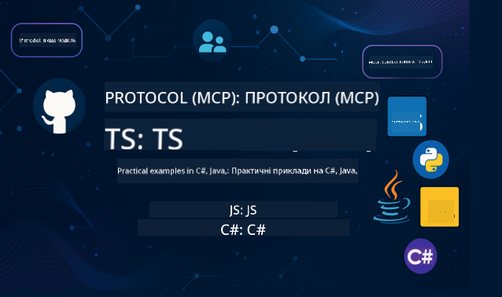

<!--
CO_OP_TRANSLATOR_METADATA:
{
  "original_hash": "14ff8da45161b7c294d7c0e60115c2b8",
  "translation_date": "2025-10-03T08:02:32+00:00",
  "source_file": "README.md",
  "language_code": "uk"
}
-->

Виконайте наступні кроки, щоб почати використовувати ці ресурси:
1. **Форкніть репозиторій**: Натисніть 
2. **Клонуйте репозиторій**:   `git clone https://github.com/microsoft/mcp-for-beginners.git`
3. [**Приєднайтеся до Azure AI Foundry Discord, щоб поспілкуватися з експертами та іншими розробниками**](https://discord.com/invite/ByRwuEEgH4)

### 🌐 Підтримка багатомовності

#### Підтримується через GitHub Action (автоматично та завжди актуально)

 [Арабська](../ar/README.md) | [Бенгальська](../bn/README.md) | [Болгарська](../bg/README.md) | [Бірманська (М'янма)](../my/README.md) | [Китайська (спрощена)](../zh/README.md) | [Китайська (традиційна, Гонконг)](../hk/README.md) | [Китайська (традиційна, Макао)](../mo/README.md) | [Китайська (традиційна, Тайвань)](../tw/README.md) | [Хорватська](../hr/README.md) | [Чеська](../cs/README.md) | [Данська](../da/README.md) | [Нідерландська](../nl/README.md) | [Фінська](../fi/README.md) | [Французька](../fr/README.md) | [Німецька](../de/README.md) | [Грецька](../el/README.md) | [Іврит](../he/README.md) | [Гінді](../hi/README.md) | [Угорська](../hu/README.md) | [Індонезійська](../id/README.md) | [Італійська](../it/README.md) | [Японська](../ja/README.md) | [Корейська](../ko/README.md) | [Малайська](../ms/README.md) | [Маратхі](../mr/README.md) | [Непальська](../ne/README.md) | [Норвезька](../no/README.md) | [Перська (фарсі)](../fa/README.md) | [Польська](../pl/README.md) | [Португальська (Бразилія)](../br/README.md) | [Португальська (Португалія)](../pt/README.md) | [Панджабі (гурмухі)](../pa/README.md) | [Румунська](../ro/README.md) | [Російська](../ru/README.md) | [Сербська (кирилиця)](../sr/README.md) | [Словацька](../sk/README.md) | [Словенська](../sl/README.md) | [Іспанська](../es/README.md) | [Суахілі](../sw/README.md) | [Шведська](../sv/README.md) | [Тагальська (філіппінська)](../tl/README.md) | [Тайська](../th/README.md) | [Турецька](../tr/README.md) | [Українська](./README.md) | [Урду](../ur/README.md) | [В'єтнамська](../vi/README.md)

# 🚀 Навчальна програма Model Context Protocol (MCP) для початківців

## **Вивчайте MCP за допомогою практичних прикладів коду на C#, Java, JavaScript, Rust, Python та TypeScript**

## 🧠 Огляд навчальної програми Model Context Protocol

**Model Context Protocol (MCP)** — це сучасна структура, розроблена для стандартизації взаємодії між AI-моделями та клієнтськими додатками. Ця навчальна програма з відкритим кодом пропонує структурований шлях навчання, включаючи практичні приклади коду та реальні сценарії використання, на популярних мовах програмування, таких як C#, Java, JavaScript, TypeScript та Python.

Незалежно від того, чи ви розробник AI, системний архітектор або програміст, цей посібник стане вашим комплексним ресурсом для освоєння основ MCP та стратегій його впровадження.

## 🔗 Офіційні ресурси MCP

- 📘 [Документація MCP](https://modelcontextprotocol.io/) – Детальні навчальні матеріали та посібники користувача  
- 📜 [Специфікація MCP](https://modelcontextprotocol.io/docs/) – Архітектура протоколу та технічні посилання  
- 📜 [Оригінальна специфікація MCP](https://spec.modelcontextprotocol.io/) – Технічні посилання попередньої версії (може містити додаткові деталі)  
- 🧑‍💻 [Репозиторій MCP на GitHub](https://github.com/modelcontextprotocol) – SDK, інструменти та приклади коду з відкритим кодом  
- 🌐 [Спільнота MCP](https://github.com/orgs/modelcontextprotocol/discussions) – Приєднуйтесь до обговорень та робіть внесок у розвиток спільноти  

## 🧭 Огляд навчальної програми MCP

### 📚 Повна структура навчальної програми

| Модуль | Тема | Опис | Посилання |
|--------|-------|-------------|------|
| **Модуль 1-3: Основи** | | | |
| 00 | Вступ до MCP | Огляд Model Context Protocol та його значення в AI-пайплайнах | [Детальніше](./00-Introduction/README.md) |
| 01 | Пояснення основних концепцій | Глибоке дослідження основних концепцій MCP | [Детальніше](./01-CoreConcepts/README.md) |
| 02 | Безпека в MCP | Загрози безпеці та найкращі практики | [Детальніше](./02-Security/README.md) |
| 03 | Початок роботи з MCP | Налаштування середовища, базові сервери/клієнти, інтеграція | [Детальніше](./03-GettingStarted/README.md) |
| **Модуль 3: Створення першого сервера та клієнта** | | | |
| 3.1 | Перший сервер | Створіть свій перший сервер MCP | [Посібник](./03-GettingStarted/01-first-server/README.md) |
| 3.2 | Перший клієнт | Розробіть базовий клієнт MCP | [Посібник](./03-GettingStarted/02-client/README.md) |
| 3.3 | Клієнт з LLM | Інтегруйте великі мовні моделі | [Посібник](./03-GettingStarted/03-llm-client/README.md) |
| 3.4 | Інтеграція з VS Code | Використовуйте сервери MCP у VS Code | [Посібник](./03-GettingStarted/04-vscode/README.md) |
| 3.5 | Сервер stdio | Створіть сервери з використанням транспорту stdio | [Посібник](./03-GettingStarted/05-stdio-server/README.md) |
| 3.6 | HTTP-стрімінг | Реалізуйте HTTP-стрімінг у MCP | [Посібник](./03-GettingStarted/06-http-streaming/README.md) |
| 3.7 | AI Toolkit | Використовуйте AI Toolkit з MCP | [Посібник](./03-GettingStarted/07-aitk/README.md) |
| 3.8 | Тестування | Протестуйте реалізацію вашого сервера MCP | [Посібник](./03-GettingStarted/08-testing/README.md) |
| 3.9 | Розгортання | Розгорніть сервери MCP у продакшн | [Посібник](./03-GettingStarted/09-deployment/README.md) |
| **Модуль 4-5: Практичне та розширене** | | | |
| 04 | Практична реалізація | SDK, налагодження, тестування, шаблони запитів | [Детальніше](./04-PracticalImplementation/README.md) |
| 05 | Розширені теми MCP | Мультимодальний AI, масштабування, корпоративне використання | [Детальніше](./05-AdvancedTopics/README.md) |
| 5.1 | Інтеграція з Azure | Інтеграція MCP з Azure | [Посібник](./05-AdvancedTopics/mcp-integration/README.md) |
| 5.2 | Мультимодальність | Робота з кількома модальностями | [Посібник](./05-AdvancedTopics/mcp-multi-modality/README.md) |
| 5.3 | Демонстрація OAuth2 | Реалізація аутентифікації OAuth2 | [Посібник](./05-AdvancedTopics/mcp-oauth2-demo/README.md) |
| 5.4 | Кореневі контексти | Розуміння та реалізація кореневих контекстів | [Посібник](./05-AdvancedTopics/mcp-root-contexts/README.md) |
| 5.5 | Маршрутизація | Стратегії маршрутизації MCP | [Посібник](./05-AdvancedTopics/mcp-routing/README.md) |
| 5.6 | Семплінг | Техніки семплінгу в MCP | [Посібник](./05-AdvancedTopics/mcp-sampling/README.md) |
| 5.7 | Масштабування | Масштабування реалізацій MCP | [Посібник](./05-AdvancedTopics/mcp-scaling/README.md) |
| 5.8 | Безпека | Розширені аспекти безпеки | [Посібник](./05-AdvancedTopics/mcp-security/README.md) |
| 5.9 | Веб-пошук | Реалізація можливостей веб-пошуку | [Посібник](./05-AdvancedTopics/web-search-mcp/README.md) |
| 5.10 | Реальний стрімінг | Створення функціоналу реального стрімінгу | [Посібник](./05-AdvancedTopics/mcp-realtimestreaming/README.md) |
| 5.11 | Реальний пошук | Реалізація реального пошуку | [Посібник](./05-AdvancedTopics/mcp-realtimesearch/README.md) |
| 5.12 | Аутентифікація Entra ID | Аутентифікація з Microsoft Entra ID | [Посібник](./05-AdvancedTopics/mcp-security-entra/README.md) |
| 5.13 | Інтеграція з Foundry | Інтеграція з Azure AI Foundry | [Посібник](./05-AdvancedTopics/mcp-foundry-agent-integration/README.md) |
| 5.14 | Інженерія контексту | Техніки ефективної інженерії контексту | [Посібник](./05-AdvancedTopics/mcp-contextengineering/README.md) |
| 5.15 | Кастомний транспорт MCP | Реалізація кастомного транспорту | [Посібник](./05-AdvancedTopics/mcp-transport/README.md) |
| **Модуль 6-10: Спільнота та найкращі практики** | | | |
| 06 | Внески спільноти | Як зробити внесок у екосистему MCP | [Посібник](./06-CommunityContributions/README.md) |
| 07 | Уроки раннього впровадження | Реальні історії впровадження | [Посібник](./07-LessonsFromEarlyAdoption/README.md) |
| 08 | Найкращі практики для MCP | Продуктивність, стійкість до помилок, надійність | [Посібник](./08-BestPractices/README.md) |
| 09 | Кейси MCP | Приклади практичної реалізації | [Посібник](./09-CaseStudy/README.md) |
| 10 | Практичний семінар | Створення сервера MCP з AI Toolkit | [Лабораторія](./10-StreamliningAIWorkflowsBuildingAnMCPServerWithAIToolkit/README.md) |
| **Модуль 11: Практична лабораторія сервера MCP** | | | |
| 11 | Інтеграція сервера MCP з базою даних | Комплексний навчальний шлях з 13 лабораторій для інтеграції PostgreSQL | [Лабораторії](./11-MCPServerHandsOnLabs/README.md) |
| 11.1 | Вступ | Огляд MCP з інтеграцією бази даних та кейсом аналітики роздрібної торгівлі | [Лабораторія 00](./11-MCPServerHandsOnLabs/00-Introduction/README.md) |
| 11.2 | Основна архітектура | Розуміння архітектури сервера MCP, шарів бази даних та шаблонів безпеки | [Лабораторія 01](./11-MCPServerHandsOnLabs/01-Architecture/README.md) |
| 11.3 | Безпека та багатокористувацькість | Безпека на рівні рядків, автентифікація та доступ до даних для багатьох користувачів | [Lab 02](./11-MCPServerHandsOnLabs/02-Security/README.md) |
| 11.4 | Налаштування середовища | Налаштування середовища розробки, Docker, ресурси Azure | [Lab 03](./11-MCPServerHandsOnLabs/03-Setup/README.md) |
| 11.5 | Проектування бази даних | Налаштування PostgreSQL, проектування схеми роздрібної торгівлі та зразки даних | [Lab 04](./11-MCPServerHandsOnLabs/04-Database/README.md) |
| 11.6 | Реалізація MCP сервера | Створення сервера FastMCP з інтеграцією бази даних | [Lab 05](./11-MCPServerHandsOnLabs/05-MCP-Server/README.md) |
| 11.7 | Розробка інструментів | Створення інструментів для запитів до бази даних та аналізу схеми | [Lab 06](./11-MCPServerHandsOnLabs/06-Tools/README.md) |
| 11.8 | Семантичний пошук | Реалізація векторних вбудовувань за допомогою Azure OpenAI та pgvector | [Lab 07](./11-MCPServerHandsOnLabs/07-Semantic-Search/README.md) |
| 11.9 | Тестування та налагодження | Стратегії тестування, інструменти налагодження та підходи до перевірки | [Lab 08](./11-MCPServerHandsOnLabs/08-Testing/README.md) |
| 11.10 | Інтеграція з VS Code | Налаштування інтеграції MCP з VS Code та використання AI Chat | [Lab 09](./11-MCPServerHandsOnLabs/09-VS-Code/README.md) |
| 11.11 | Стратегії розгортання | Розгортання Docker, Azure Container Apps та аспекти масштабування | [Lab 10](./11-MCPServerHandsOnLabs/10-Deployment/README.md) |
| 11.12 | Моніторинг | Application Insights, логування, моніторинг продуктивності | [Lab 11](./11-MCPServerHandsOnLabs/11-Monitoring/README.md) |
| 11.13 | Найкращі практики | Оптимізація продуктивності, посилення безпеки та поради для продакшну | [Lab 12](./11-MCPServerHandsOnLabs/12-Best-Practices/README.md) |

### 💻 Зразки кодів проєктів

#### Основні приклади MCP калькулятора

| Мова | Опис | Посилання |
|------|------|-----------|
| C# | Приклад MCP сервера | [Переглянути код](./03-GettingStarted/samples/csharp/README.md) |
| Java | MCP калькулятор | [Переглянути код](./03-GettingStarted/samples/java/calculator/README.md) |
| JavaScript | Демонстрація MCP | [Переглянути код](./03-GettingStarted/samples/javascript/README.md) |
| Python | MCP сервер | [Переглянути код](../../03-GettingStarted/samples/python/mcp_calculator_server.py) |
| TypeScript | Приклад MCP | [Переглянути код](./03-GettingStarted/samples/typescript/README.md) |
| Rust | Приклад MCP | [Переглянути код](./03-GettingStarted/samples/rust/README.md) |

#### Розширені реалізації MCP

| Мова | Опис | Посилання |
|------|------|-----------|
| C# | Розширений приклад | [Переглянути код](./04-PracticalImplementation/samples/csharp/README.md) |
| Java з Spring | Приклад контейнерного додатку | [Переглянути код](./04-PracticalImplementation/samples/java/containerapp/README.md) |
| JavaScript | Розширений приклад | [Переглянути код](./04-PracticalImplementation/samples/javascript/README.md) |
| Python | Складна реалізація | [Переглянути код](../../04-PracticalImplementation/samples/python/READMEmd) |
| TypeScript | Приклад контейнера | [Переглянути код](./04-PracticalImplementation/samples/typescript/README.md) |

## 🎯 Передумови для вивчення MCP

Щоб максимально ефективно засвоїти цей курс, вам слід мати:

- Базові знання програмування хоча б однією з наступних мов: C#, Java, JavaScript, Python або TypeScript
- Розуміння моделі клієнт-сервер та API
- Знайомство з концепціями REST і HTTP
- (Опціонально) Основи AI/ML

- Участь у наших обговореннях спільноти для отримання підтримки

## 📚 Навчальний посібник та ресурси

Цей репозиторій містить кілька ресурсів, які допоможуть вам ефективно навчатися:

### Навчальний посібник

Детальний [Навчальний посібник](./study_guide.md) доступний для того, щоб допомогти вам ефективно орієнтуватися в цьому репозиторії. Посібник включає:

- Візуальну карту навчальної програми з усіма охопленими темами
- Детальний опис кожного розділу репозиторію
- Рекомендації щодо використання зразків проєктів
- Рекомендовані навчальні шляхи для різних рівнів навичок
- Додаткові ресурси для доповнення вашого навчання

### Журнал змін

Ми ведемо детальний [Журнал змін](./changelog.md), який відстежує всі значні оновлення навчальних матеріалів, включаючи:

- Додавання нового контенту
- Структурні зміни
- Покращення функціоналу
- Оновлення документації

## 🛠️ Як ефективно використовувати цей курс

Кожен урок у цьому посібнику включає:

1. Чіткі пояснення концепцій MCP  
2. Живі приклади коду на різних мовах  
3. Вправи для створення реальних MCP додатків  
4. Додаткові ресурси для просунутих учнів  

## Події 

### [MCP Dev Days липень 2025](https://developer.microsoft.com/en-us/reactor/series/S-1563/)
#### [➡️Дивитися на вимогу - MCP Dev Days](https://developer.microsoft.com/en-us/reactor/series/S-1563/)
Готуйтеся до двох днів глибокого технічного занурення, спілкування зі спільнотою та практичного навчання на MCP Dev Days — віртуальному заході, присвяченому Model Context Protocol (MCP), новому стандарту, який об'єднує AI моделі та інструменти, на які вони спираються.
Ви можете переглянути MCP Dev Days, зареєструвавшись на нашій сторінці заходу: https://aka.ms/mcpdevdays. 

#### [День 1: Продуктивність MCP, інструменти розробки та спільнота:](https://developer.microsoft.com/en-us/reactor/series/S-1563/)

Присвячений наданню розробникам можливості використовувати MCP у їхньому робочому процесі та святкуванню дивовижної спільноти MCP. Ми будемо разом із членами спільноти та партнерами, такими як Arcade, Block, Okta та Neon, щоб побачити, як вони співпрацюють з Microsoft для формування відкритої, розширюваної екосистеми MCP. Реальні демонстрації у VS Code, Visual Studio, GitHub Copilot та популярних інструментах спільноти
Практичні, контекстно-орієнтовані робочі процеси розробки
Сесії, які ведуть члени спільноти, та їхні інсайти
Незалежно від того, чи ви тільки починаєте працювати з MCP, чи вже створюєте з ним, День 1 надихне вас і надасть практичні рекомендації.

#### [День 2: Створюйте MCP сервери з упевненістю](https://developer.microsoft.com/en-us/reactor/series/S-1563/)

Призначений для розробників MCP. Ми глибоко зануримося в стратегії реалізації та найкращі практики створення MCP серверів і інтеграції MCP у ваші AI робочі процеси.

#### Теми включають:

- Створення MCP серверів та їх інтеграція в агентські середовища
- Розробка, орієнтована на запити
- Найкращі практики безпеки
- Використання будівельних блоків, таких як Functions, ACA та API Management
- Вирівнювання реєстрів та інструментів (1P + 3P)

Якщо ви розробник, творець інструментів або стратег AI продуктів, цей день наповнений інсайтами, які допоможуть вам створювати масштабовані, безпечні та готові до майбутнього рішення MCP.

### MCP Boot Camp серпень 2025
Навчайтеся на інтенсивних відеосесіях, як створювати MCP сервери, інтегрувати з VS Code та професійно розгортати на Azure, базуючись на матеріалах курсу MCP для початківців. Отримайте практичні навички в технології, яку вже використовують провідні компанії.

#### [➡️Дивитися на вимогу MCP Bootcamp | Англійська](https://developer.microsoft.com/en-us/reactor/series/s-1568/)
#### [➡️Дивитися на вимогу MCP Bootcamp | Бразилія](https://developer.microsoft.com/en-us/reactor/series/S-1566/)
#### [➡️Дивитися на вимогу MCP Bootcamp | Іспанська](https://developer.microsoft.com/en-us/reactor/series/S-1567/)

### Вчимо MCP з C# - Серія навчальних посібників
Давайте дізнаємося про Model Context Protocol (MCP), передову структуру, розроблену для стандартизації взаємодії між AI моделями та клієнтськими додатками. У цьому дружньому до початківців сеансі ми познайомимо вас з MCP і проведемо через створення вашого першого MCP сервера.
#### C#: [https://aka.ms/letslearnmcp-csharp](https://aka.ms/letslearnmcp-csharp)
#### Java: [https://aka.ms/letslearnmcp-java](https://aka.ms/letslearnmcp-java)
#### JavaScript: [https://aka.ms/letslearnmcp-javascript](https://aka.ms/letslearnmcp-javascript)
#### Python: [https://aka.ms/letslearnmcp-python](https://aka.ms/letslearnmcp-python)

## 🌟 Подяка спільноті

Дякуємо Microsoft Valued Professional [Shivam Goyal](https://www.linkedin.com/in/shivam2003/) за внесок важливих зразків коду. 

## 📜 Інформація про ліцензію

Цей контент ліцензований під **MIT License**. Для умов та положень дивіться [LICENSE](../../LICENSE).

## 🤝 Правила внесення змін

Цей проєкт вітає внески та пропозиції. Більшість внесків вимагають від вас погодження з
Contributor License Agreement (CLA), що підтверджує, що ви маєте право і фактично надаєте нам
права на використання вашого внеску. Для деталей відвідайте <https://cla.opensource.microsoft.com>.

Коли ви надсилаєте pull request, бот CLA автоматично визначить, чи потрібно вам надати
CLA і відповідно позначить PR (наприклад, перевірка статусу, коментар). Просто дотримуйтесь інструкцій,
наданих ботом. Вам потрібно буде зробити це лише один раз для всіх репозиторіїв, які використовують наш CLA.

Цей проєкт прийняв [Microsoft Open Source Code of Conduct](https://opensource.microsoft.com/codeofconduct/).
Для отримання додаткової інформації дивіться [Code of Conduct FAQ](https://opensource.microsoft.com/codeofconduct/faq/) або
зв'яжіться з [opencode@microsoft.com](mailto:opencode@microsoft.com) з будь-якими додатковими питаннями чи коментарями.

## 📂 Структура репозиторію

Репозиторій організований наступним чином:

- **Основна навчальна програма (00-11)**: Основний контент, організований в одинадцять послідовних модулів, включаючи комплексні лабораторії інтеграції баз даних
- **11-MCPServerHandsOnLabs/**: Повний навчальний шлях з 13 лабораторій для створення готових до продакшну MCP серверів з інтеграцією PostgreSQL
- **images/**: Діаграми та ілюстрації, використані в навчальній програмі
- **translations/**: Підтримка багатомовності з автоматизованими перекладами
- **translated_images/**: Локалізовані версії діаграм та ілюстрацій
- **study_guide.md**: Комплексний посібник для навігації по репозиторію
- **changelog.md**: Запис всіх значних змін у навчальних матеріалах
- **mcp.json**: Конфігураційний файл для специфікації MCP
- **CODE_OF_CONDUCT.md, LICENSE, SECURITY.md, SUPPORT.md**: Документи управління проєктом

## 🎒 Інші курси
Наша команда створює інші курси! Ознайомтеся:

- [**НОВИЙ** Edge AI For Beginners](https://github.com/microsoft/edgeai-for-beginners?WT.mc_id=academic-105485-koreyst)
- [AI Agents For Beginners](https://github.com/microsoft/ai-agents-for-beginners?WT.mc_id=academic-105485-koreyst)
- [Generative AI for Beginners using .NET](https://github.com/microsoft/Generative-AI-for-beginners-dotnet?WT.mc_id=academic-105485-koreyst)
- [Generative AI for Beginners using JavaScript](https://github.com/microsoft/generative-ai-with-javascript?WT.mc_id=academic-105485-koreyst)
- [Generative AI for Beginners](https://github.com/microsoft/generative-ai-for-beginners?WT.mc_id=academic-105485-koreyst)
- [Generative AI for Beginners using Java](https://github.com/microsoft/generative-ai-for-beginners-java?WT.mc_id=academic-105485-koreyst)
- [ML for Beginners](https://aka.ms/ml-beginners?WT.mc_id=academic-105485-koreyst)
- [Data Science for Beginners](https://aka.ms/datascience-beginners?WT.mc_id=academic-105485-koreyst)
- [AI for Beginners](https://aka.ms/ai-beginners?WT.mc_id=academic-105485-koreyst)
- [Cybersecurity for Beginners](https://github.com/microsoft/Security-101?WT.mc_id=academic-96948-sayoung)
- [Web Dev for Beginners](https://aka.ms/webdev-beginners?WT.mc_id=academic-105485-koreyst)
- [IoT for Beginners](https://aka.ms/iot-beginners?WT.mc_id=academic-105485-koreyst)
- [XR Development for Beginners](https://github.com/microsoft/xr-development-for-beginners?WT.mc_id=academic-105485-koreyst)
- [Mastering GitHub Copilot for AI Paired Programming](https://aka.ms/GitHubCopilotAI?WT.mc_id=academic-105485-koreyst)
- [Mastering GitHub Copilot for C#/.NET Developers](https://github.com/microsoft/mastering-github-copilot-for-dotnet-csharp-developers?WT.mc_id=academic-105485-koreyst)
- [Choose Your Own Copilot Adventure](https://github.com/microsoft/CopilotAdventures?WT.mc_id=academic-105485-koreyst)
## ™️ Повідомлення про торговельну марку

Цей проєкт може містити торговельні марки або логотипи для проєктів, продуктів чи послуг. Дозволене використання торговельних марок або логотипів Microsoft підлягає дотриманню 
[Керівництва щодо торговельних марок та брендів Microsoft](https://www.microsoft.com/legal/intellectualproperty/trademarks/usage/general).
Використання торговельних марок або логотипів Microsoft у змінених версіях цього проєкту не повинно викликати плутанину або натякати на спонсорство з боку Microsoft.
Будь-яке використання торговельних марок або логотипів третіх сторін підлягає політикам цих третіх сторін.

## Отримання допомоги

Якщо ви зіткнулися з труднощами або маєте запитання щодо створення AI-додатків, приєднуйтесь:

Якщо у вас є відгуки про продукт або виникають помилки під час створення, відвідайте:

---

**Відмова від відповідальності**:  
Цей документ був перекладений за допомогою сервісу автоматичного перекладу [Co-op Translator](https://github.com/Azure/co-op-translator). Хоча ми прагнемо до точності, будь ласка, майте на увазі, що автоматичні переклади можуть містити помилки або неточності. Оригінальний документ на його рідній мові слід вважати авторитетним джерелом. Для критичної інформації рекомендується професійний людський переклад. Ми не несемо відповідальності за будь-які непорозуміння або неправильні тлумачення, що виникають внаслідок використання цього перекладу.