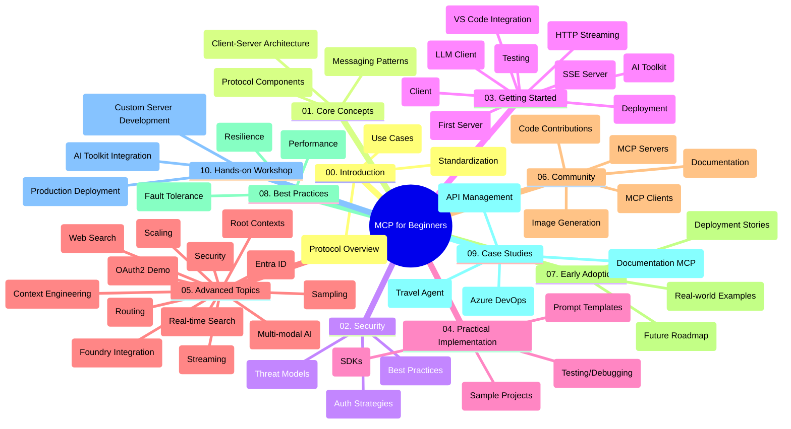

<!--
CO_OP_TRANSLATOR_METADATA:
{
  "original_hash": "5f321ea583cf087a94e47ee74c62b504",
  "translation_date": "2025-07-17T12:53:21+00:00",
  "source_file": "study_guide.md",
  "language_code": "uk"
}
-->
# Model Context Protocol (MCP) для початківців – навчальний посібник

Цей навчальний посібник надає огляд структури та вмісту репозиторію для курсу "Model Context Protocol (MCP) для початківців". Використовуйте цей посібник, щоб ефективно орієнтуватися в репозиторії та максимально використовувати доступні ресурси.

## Огляд репозиторію

Model Context Protocol (MCP) — це стандартизований фреймворк для взаємодії між AI-моделями та клієнтськими додатками. Спочатку створений компанією Anthropic, MCP тепер підтримується ширшою спільнотою MCP через офіційну організацію на GitHub. Цей репозиторій містить комплексний навчальний курс із практичними прикладами коду на C#, Java, JavaScript, Python та TypeScript, розроблений для AI-розробників, системних архітекторів і програмних інженерів.

## Візуальна карта курсу

## Структура репозиторію

Репозиторій організований у десять основних розділів, кожен з яких присвячений різним аспектам MCP:

1. **Вступ (00-Introduction/)**
   - Огляд Model Context Protocol
   - Чому стандартизація важлива в AI-пайплайнах
   - Практичні випадки використання та переваги

2. **Основні поняття (01-CoreConcepts/)**
   - Архітектура клієнт-сервер
   - Ключові компоненти протоколу
   - Патерни обміну повідомленнями в MCP

3. **Безпека (02-Security/)**
   - Загрози безпеці в системах на основі MCP
   - Кращі практики захисту реалізацій
   - Стратегії аутентифікації та авторизації

4. **Початок роботи (03-GettingStarted/)**
   - Налаштування середовища та конфігурація
   - Створення базових MCP серверів і клієнтів
   - Інтеграція з існуючими додатками
   - Включає розділи:
     - Перша реалізація сервера
     - Розробка клієнта
     - Інтеграція LLM клієнта
     - Інтеграція з VS Code
     - Сервер Server-Sent Events (SSE)
     - HTTP стрімінг
     - Інтеграція AI Toolkit
     - Стратегії тестування
     - Рекомендації щодо розгортання

5. **Практична реалізація (04-PracticalImplementation/)**
   - Використання SDK для різних мов програмування
   - Налагодження, тестування та валідація
   - Створення багаторазових шаблонів prompt і робочих процесів
   - Прикладні проекти з демонстраціями реалізації

6. **Поглиблені теми (05-AdvancedTopics/)**
   - Техніки інженерії контексту
   - Інтеграція агента Foundry
   - Мультимодальні AI робочі процеси
   - Демонстрації аутентифікації OAuth2
   - Можливості пошуку в реальному часі
   - Стрімінг у реальному часі
   - Реалізація кореневих контекстів
   - Стратегії маршрутизації
   - Техніки вибірки
   - Підходи до масштабування
   - Питання безпеки
   - Інтеграція безпеки Entra ID
   - Інтеграція веб-пошуку

7. **Внесок спільноти (06-CommunityContributions/)**
   - Як долучитися до коду та документації
   - Співпраця через GitHub
   - Покращення та відгуки від спільноти
   - Використання різних MCP клієнтів (Claude Desktop, Cline, VSCode)
   - Робота з популярними MCP серверами, включно з генерацією зображень

8. **Уроки з раннього впровадження (07-LessonsfromEarlyAdoption/)**
   - Реальні впровадження та історії успіху
   - Створення та розгортання рішень на основі MCP
   - Тенденції та майбутня дорожня карта

9. **Кращі практики (08-BestPractices/)**
   - Налаштування продуктивності та оптимізація
   - Проектування відмовостійких MCP систем
   - Стратегії тестування та стійкості

10. **Кейс-стаді (09-CaseStudy/)**
    - Кейс-стаді: інтеграція Azure API Management
    - Кейс-стаді: реалізація туристичного агента
    - Кейс-стаді: інтеграція Azure DevOps з YouTube
    - Приклади реалізації з детальною документацією

11. **Практичний воркшоп (10-StreamliningAIWorkflowsBuildingAnMCPServerWithAIToolkit/)**
    - Комплексний практичний воркшоп, що поєднує MCP з AI Toolkit
    - Створення інтелектуальних додатків, що поєднують AI-моделі з реальними інструментами
    - Практичні модулі, що охоплюють основи, розробку кастомних серверів і стратегії розгортання в продакшн
    - Навчання у форматі лабораторних робіт з покроковими інструкціями

## Додаткові ресурси

Репозиторій містить допоміжні ресурси:

- **Папка зображень**: містить діаграми та ілюстрації, що використовуються в курсі
- **Переклади**: підтримка кількох мов із автоматизованими перекладами документації
- **Офіційні ресурси MCP**:
  - [MCP Documentation](https://modelcontextprotocol.io/)
  - [MCP Specification](https://spec.modelcontextprotocol.io/)
  - [MCP GitHub Repository](https://github.com/modelcontextprotocol)

## Як користуватися цим репозиторієм

1. **Послідовне навчання**: проходьте розділи у порядку (від 00 до 10) для структурованого навчання.
2. **Фокус на конкретній мові**: якщо вас цікавить певна мова програмування, досліджуйте каталоги з прикладами для реалізацій на ній.
3. **Практична реалізація**: почніть із розділу "Початок роботи", щоб налаштувати середовище та створити перший MCP сервер і клієнт.
4. **Поглиблене вивчення**: після освоєння основ переходьте до поглиблених тем для розширення знань.
5. **Спільнотна взаємодія**: приєднуйтесь до спільноти MCP через обговорення на GitHub та канали Discord, щоб спілкуватися з експертами та іншими розробниками.

## MCP клієнти та інструменти

Курс охоплює різні MCP клієнти та інструменти:

1. **Офіційні клієнти**:
   - Visual Studio Code
   - MCP у Visual Studio Code
   - Claude Desktop
   - Claude у VSCode
   - Claude API

2. **Клієнти спільноти**:
   - Cline (термінальний)
   - Cursor (редактор коду)
   - ChatMCP
   - Windsurf

3. **Інструменти управління MCP**:
   - MCP CLI
   - MCP Manager
   - MCP Linker
   - MCP Router

## Популярні MCP сервери

Репозиторій представляє різні MCP сервери, зокрема:

1. **Офіційні референсні сервери**:
   - Filesystem
   - Fetch
   - Memory
   - Sequential Thinking

2. **Генерація зображень**:
   - Azure OpenAI DALL-E 3
   - Stable Diffusion WebUI
   - Replicate

3. **Інструменти розробки**:
   - Git MCP
   - Terminal Control
   - Code Assistant

4. **Спеціалізовані сервери**:
   - Salesforce
   - Microsoft Teams
   - Jira & Confluence

## Внесок у проект

Цей репозиторій вітає внески від спільноти. Дивіться розділ "Внесок спільноти" для порад щодо ефективної участі в екосистемі MCP.

## Журнал змін

| Дата | Зміни |
|------|---------|
| 16 липня 2025 | - Оновлено структуру репозиторію відповідно до актуального вмісту - Додано розділ MCP клієнти та інструменти - Додано розділ популярні MCP сервери - Оновлено візуальну карту курсу з усіма актуальними темами - Розширено розділ поглиблених тем усіма спеціалізованими напрямками - Оновлено кейс-стаді з реальними прикладами - Уточнено, що MCP створений Anthropic |
| 11 червня 2025 | - Початкове створення навчального посібника - Додано візуальну карту курсу - Описано структуру репозиторію - Включено прикладні проекти та додаткові ресурси |

---

*Цей навчальний посібник оновлено 16 липня 2025 року і він відображає стан репозиторію на цю дату. Вміст репозиторію може оновлюватися після цієї дати.*

**Відмова від відповідальності**:  
Цей документ було перекладено за допомогою сервісу автоматичного перекладу [Co-op Translator](https://github.com/Azure/co-op-translator). Хоча ми прагнемо до точності, будь ласка, майте на увазі, що автоматичні переклади можуть містити помилки або неточності. Оригінальний документ рідною мовою слід вважати авторитетним джерелом. Для критично важливої інформації рекомендується звертатися до професійного людського перекладу. Ми не несемо відповідальності за будь-які непорозуміння або неправильні тлумачення, що виникли внаслідок використання цього перекладу.