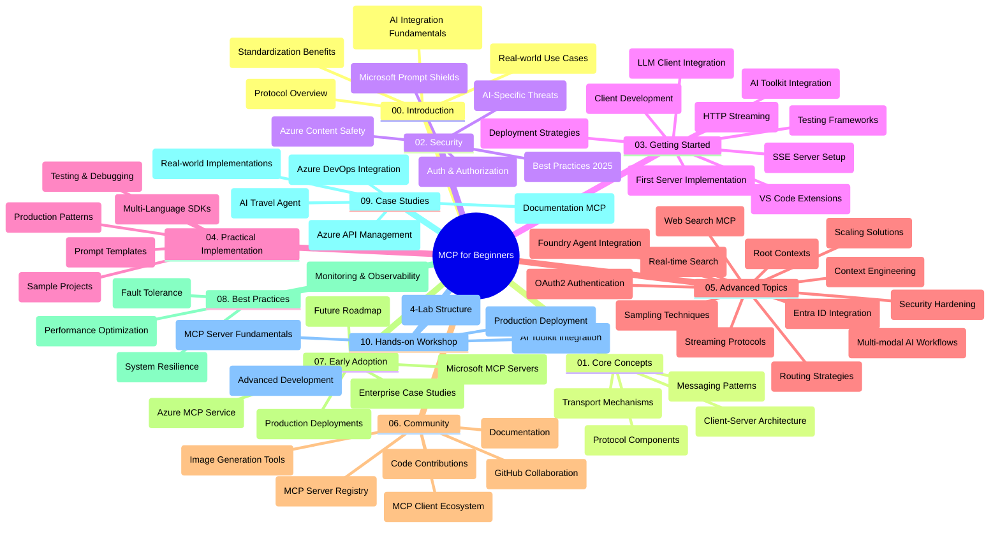

<!--
CO_OP_TRANSLATOR_METADATA:
{
  "original_hash": "e2c6ed897fa98fa08e0146101776c7ff",
  "translation_date": "2025-07-18T10:37:30+00:00",
  "source_file": "study_guide.md",
  "language_code": "uk"
}
-->
# Протокол Контексту Моделі (MCP) для Початківців – Навчальний Посібник

Цей навчальний посібник надає огляд структури та вмісту репозиторію для курсу "Протокол Контексту Моделі (MCP) для Початківців". Використовуйте цей посібник, щоб ефективно орієнтуватися в репозиторії та максимально використовувати доступні ресурси.

## Огляд Репозиторію

Протокол Контексту Моделі (MCP) — це стандартизована платформа для взаємодії між AI-моделями та клієнтськими додатками. Спочатку створений компанією Anthropic, MCP тепер підтримується ширшою спільнотою MCP через офіційну організацію на GitHub. Цей репозиторій містить комплексний навчальний курс з практичними прикладами коду на C#, Java, JavaScript, Python та TypeScript, розроблений для AI-розробників, системних архітекторів та інженерів-програмістів.

## Візуальна Карта Курсу

## Структура Репозиторію

Репозиторій організований у десять основних розділів, кожен з яких присвячений різним аспектам MCP:

1. **Вступ (00-Introduction/)**
   - Огляд Протоколу Контексту Моделі
   - Чому стандартизація важлива в AI-процесах
   - Практичні випадки використання та переваги

2. **Основні Концепції (01-CoreConcepts/)**
   - Архітектура клієнт-сервер
   - Ключові компоненти протоколу
   - Патерни обміну повідомленнями в MCP

3. **Безпека (02-Security/)**
   - Загрози безпеці в системах на основі MCP
   - Найкращі практики захисту реалізацій
   - Стратегії аутентифікації та авторизації
   - **Вичерпна документація з безпеки**:
     - MCP Security Best Practices 2025
     - Azure Content Safety Implementation Guide
     - MCP Security Controls and Techniques
     - MCP Best Practices Quick Reference
   - **Ключові теми безпеки**:
     - Атаки через ін’єкцію підказок та отруєння інструментів
     - Захоплення сесій та проблеми confused deputy
     - Уразливості при передачі токенів
     - Надмірні права доступу та контроль доступу
     - Безпека ланцюга постачання AI-компонентів
     - Інтеграція Microsoft Prompt Shields

4. **Початок Роботи (03-GettingStarted/)**
   - Налаштування середовища та конфігурація
   - Створення базових MCP серверів і клієнтів
   - Інтеграція з існуючими додатками
   - Включає розділи для:
     - Першої реалізації сервера
     - Розробки клієнта
     - Інтеграції LLM клієнта
     - Інтеграції з VS Code
     - Серверів Server-Sent Events (SSE)
     - HTTP-стрімінгу
     - Інтеграції AI Toolkit
     - Стратегій тестування
     - Рекомендацій з розгортання

5. **Практична Реалізація (04-PracticalImplementation/)**
   - Використання SDK на різних мовах програмування
   - Налагодження, тестування та валідація
   - Створення багаторазових шаблонів підказок і робочих процесів
   - Прикладні проекти з демонстраціями реалізації

6. **Поглиблені Теми (05-AdvancedTopics/)**
   - Техніки інженерії контексту
   - Інтеграція агента Foundry
   - Багатомодальні AI-робочі процеси
   - Демонстрації аутентифікації OAuth2
   - Можливості пошуку в реальному часі
   - Потокова передача даних у реальному часі
   - Реалізація кореневих контекстів
   - Стратегії маршрутизації
   - Техніки вибірки
   - Підходи до масштабування
   - Питання безпеки
   - Інтеграція безпеки Entra ID
   - Інтеграція веб-пошуку

7. **Внесок Спільноти (06-CommunityContributions/)**
   - Як долучитися до коду та документації
   - Співпраця через GitHub
   - Покращення та відгуки від спільноти
   - Використання різних MCP клієнтів (Claude Desktop, Cline, VSCode)
   - Робота з популярними MCP серверами, включно з генерацією зображень

8. **Уроки з Раннього Впровадження (07-LessonsfromEarlyAdoption/)**
   - Реальні впровадження та історії успіху
   - Створення та розгортання рішень на основі MCP
   - Тенденції та майбутня дорожня карта
   - **Посібник з Microsoft MCP Серверів**: Вичерпний гайд по 10 готових до виробництва Microsoft MCP серверах, включно з:
     - Microsoft Learn Docs MCP Server
     - Azure MCP Server (понад 15 спеціалізованих конекторів)
     - GitHub MCP Server
     - Azure DevOps MCP Server
     - MarkItDown MCP Server
     - SQL Server MCP Server
     - Playwright MCP Server
     - Dev Box MCP Server
     - Azure AI Foundry MCP Server
     - Microsoft 365 Agents Toolkit MCP Server

9. **Кращі Практики (08-BestPractices/)**
   - Налаштування продуктивності та оптимізація
   - Проектування відмовостійких MCP систем
   - Стратегії тестування та стійкості

10. **Кейс-стаді (09-CaseStudy/)**
    - Приклад інтеграції Azure API Management
    - Приклад реалізації туристичного агента
    - Інтеграція Azure DevOps з оновленнями YouTube
    - Приклади реалізації MCP для документації
    - Приклади реалізації з детальною документацією

11. **Практичний Семінар (10-StreamliningAIWorkflowsBuildingAnMCPServerWithAIToolkit/)**
    - Комплексний практичний семінар, що поєднує MCP з AI Toolkit
    - Створення інтелектуальних додатків, що поєднують AI-моделі з реальними інструментами
    - Практичні модулі, що охоплюють основи, розробку кастомних серверів та стратегії розгортання у виробництві
    - **Структура лабораторій**:
      - Лабораторія 1: Основи MCP сервера
      - Лабораторія 2: Поглиблена розробка MCP сервера
      - Лабораторія 3: Інтеграція AI Toolkit
      - Лабораторія 4: Розгортання у виробництві та масштабування
    - Навчання на основі лабораторій з покроковими інструкціями

## Додаткові Ресурси

Репозиторій містить допоміжні ресурси:

- **Папка з зображеннями**: Містить діаграми та ілюстрації, що використовуються в курсі
- **Переклади**: Підтримка кількох мов з автоматизованими перекладами документації
- **Офіційні ресурси MCP**:
  - [MCP Documentation](https://modelcontextprotocol.io/)
  - [MCP Specification](https://spec.modelcontextprotocol.io/)
  - [MCP GitHub Repository](https://github.com/modelcontextprotocol)

## Як Використовувати Цей Репозиторій

1. **Послідовне навчання**: Слідуйте за розділами у порядку (від 00 до 10) для структурованого навчання.
2. **Фокус на конкретній мові**: Якщо вас цікавить певна мова програмування, досліджуйте каталоги з прикладами для реалізацій на вашій мові.
3. **Практична реалізація**: Почніть з розділу "Початок Роботи", щоб налаштувати середовище та створити перший MCP сервер і клієнт.
4. **Поглиблене вивчення**: Коли освоїте базові поняття, переходьте до поглиблених тем для розширення знань.
5. **Залучення спільноти**: Приєднуйтесь до спільноти MCP через обговорення на GitHub та канали Discord, щоб спілкуватися з експертами та іншими розробниками.

## MCP Клієнти та Інструменти

Курс охоплює різні MCP клієнти та інструменти:

1. **Офіційні клієнти**:
   - Visual Studio Code
   - MCP у Visual Studio Code
   - Claude Desktop
   - Claude у VSCode
   - Claude API

2. **Клієнти спільноти**:
   - Cline (термінальний)
   - Cursor (редактор коду)
   - ChatMCP
   - Windsurf

3. **Інструменти управління MCP**:
   - MCP CLI
   - MCP Manager
   - MCP Linker
   - MCP Router

## Популярні MCP Сервери

Репозиторій представляє різні MCP сервери, зокрема:

1. **Офіційні Microsoft MCP Сервери**:
   - Microsoft Learn Docs MCP Server
   - Azure MCP Server (понад 15 спеціалізованих конекторів)
   - GitHub MCP Server
   - Azure DevOps MCP Server
   - MarkItDown MCP Server
   - SQL Server MCP Server
   - Playwright MCP Server
   - Dev Box MCP Server
   - Azure AI Foundry MCP Server
   - Microsoft 365 Agents Toolkit MCP Server

2. **Офіційні референсні сервери**:
   - Filesystem
   - Fetch
   - Memory
   - Sequential Thinking

3. **Генерація зображень**:
   - Azure OpenAI DALL-E 3
   - Stable Diffusion WebUI
   - Replicate

4. **Інструменти розробки**:
   - Git MCP
   - Terminal Control
   - Code Assistant

5. **Спеціалізовані сервери**:
   - Salesforce
   - Microsoft Teams
   - Jira & Confluence

## Внесок у Репозиторій

Цей репозиторій вітає внески від спільноти. Дивіться розділ "Внесок Спільноти" для порад щодо ефективної участі в екосистемі MCP.

## Журнал Змін

| Дата | Зміни |
|------|---------|
| 18 липня 2025 | - Оновлено структуру репозиторію з додаванням Посібника з Microsoft MCP Серверів - Додано повний список з 10 готових до виробництва Microsoft MCP серверів - Розширено розділ Популярні MCP Сервери офіційними Microsoft MCP серверами - Оновлено розділ Кейс-стаді з реальними прикладами файлів - Додано деталі структури лабораторій для Практичного Семінару |
| 16 липня 2025 | - Оновлено структуру репозиторію відповідно до актуального вмісту - Додано розділ MCP Клієнти та Інструменти - Додано розділ Популярні MCP Сервери - Оновлено Візуальну Карту Курсу з усіма актуальними темами - Розширено розділ Поглиблені Теми з усіма спеціалізованими напрямками - Оновлено Кейс-стаді з реальними прикладами - Уточнено, що MCP створений компанією Anthropic |
| 11 червня 2025 | - Початкове створення навчального посібника - Додано Візуальну Карту Курсу - Описано структуру репозиторію - Включено прикладні проекти та додаткові ресурси |

---

*Цей навчальний посібник оновлено 18 липня 2025 року і він відображає стан репозиторію на цю дату. Вміст репозиторію може оновлюватися після цієї дати.*

**Відмова від відповідальності**:  
Цей документ було перекладено за допомогою сервісу автоматичного перекладу [Co-op Translator](https://github.com/Azure/co-op-translator). Хоча ми прагнемо до точності, будь ласка, майте на увазі, що автоматичні переклади можуть містити помилки або неточності. Оригінальний документ рідною мовою слід вважати авторитетним джерелом. Для критично важливої інформації рекомендується звертатися до професійного людського перекладу. Ми не несемо відповідальності за будь-які непорозуміння або неправильні тлумачення, що виникли внаслідок використання цього перекладу.