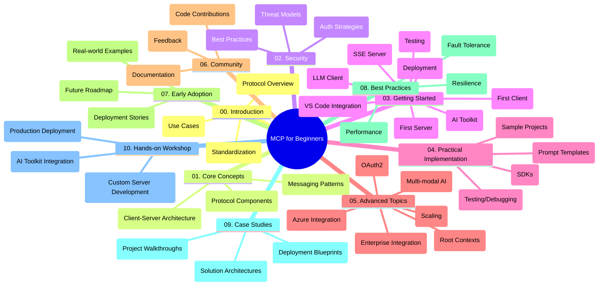

<!--
CO_OP_TRANSLATOR_METADATA:
{
  "original_hash": "a607d4febc94caee9a12b77795f7fc9a",
  "translation_date": "2025-06-17T16:22:04+00:00",
  "source_file": "study_guide.md",
  "language_code": "uk"
}
-->
# Model Context Protocol (MCP) для початківців — Навчальний посібник

Цей навчальний посібник надає огляд структури та вмісту репозиторію для курсу «Model Context Protocol (MCP) для початківців». Використовуйте цей посібник, щоб ефективно орієнтуватися в репозиторії та максимально використовувати доступні ресурси.

## Огляд репозиторію

Model Context Protocol (MCP) — це стандартизований фреймворк для взаємодії між AI-моделями та клієнтськими застосунками. Цей репозиторій містить комплексний курс із практичними прикладами коду на C#, Java, JavaScript, Python та TypeScript, розроблений для AI-розробників, системних архітекторів і програмних інженерів.

## Візуальна карта курсу

## Структура репозиторію

Репозиторій організовано у десять основних розділів, кожен з яких присвячений різним аспектам MCP:

1. **Вступ (00-Introduction/)**
   - Огляд Model Context Protocol
   - Чому стандартизація важлива в AI-пайплайнах
   - Практичні кейси та переваги

2. **Основні поняття (01-CoreConcepts/)**
   - Клієнт-серверна архітектура
   - Ключові компоненти протоколу
   - Патерни обміну повідомленнями в MCP

3. **Безпека (02-Security/)**
   - Загрози безпеці в системах на основі MCP
   - Кращі практики захисту реалізацій
   - Стратегії автентифікації та авторизації

4. **Початок роботи (03-GettingStarted/)**
   - Налаштування середовища та конфігурація
   - Створення базових MCP-серверів і клієнтів
   - Інтеграція з існуючими застосунками
   - Підрозділи для першого сервера, першого клієнта, LLM-клієнта, інтеграції з VS Code, SSE-сервера, AI Toolkit, тестування та розгортання

5. **Практична реалізація (04-PracticalImplementation/)**
   - Використання SDK для різних мов програмування
   - Налагодження, тестування та валідація
   - Створення повторно використовуваних шаблонів prompt і робочих процесів
   - Зразкові проекти з прикладами реалізації

6. **Розширені теми (05-AdvancedTopics/)**
   - Мультимодальні AI-робочі процеси та їх розширюваність
   - Стратегії безпечного масштабування
   - MCP в корпоративних екосистемах
   - Спеціалізовані теми: інтеграція з Azure, мультимодальність, OAuth2, root-контексти, маршрутизація, семплінг, масштабування, безпека, інтеграція веб-пошуку та стрімінг

7. **Внесок спільноти (06-CommunityContributions/)**
   - Як долучитися до коду та документації
   - Співпраця через GitHub
   - Покращення та відгуки від спільноти

8. **Уроки з раннього впровадження (07-LessonsfromEarlyAdoption/)**
   - Реальні впровадження та історії успіху
   - Створення та розгортання рішень на основі MCP
   - Тренди та майбутній план розвитку

9. **Кращі практики (08-BestPractices/)**
   - Оптимізація продуктивності
   - Проєктування відмовостійких MCP-систем
   - Стратегії тестування та стійкості

10. **Кейс-стаді (09-CaseStudy/)**
    - Глибокий аналіз архітектур MCP-рішень
    - Шаблони розгортання та поради з інтеграції
    - Анотовані діаграми та покрокові огляди проєктів

11. **Практичний воркшоп (10-StreamliningAIWorkflowsBuildingAnMCPServerWithAIToolkit/)**
    - Комплексний практичний воркшоп, що поєднує MCP з AI Toolkit від Microsoft для VS Code
    - Створення інтелектуальних застосунків, що поєднують AI-моделі з реальними інструментами
    - Практичні модулі з основ, розробки кастомних серверів і стратегій розгортання у продакшн

## Зразкові проєкти

Репозиторій містить кілька зразкових проєктів, які демонструють реалізацію MCP на різних мовах програмування:

### Базові приклади калькулятора MCP
- C# MCP Server Example
- Java MCP Calculator
- JavaScript MCP Demo
- Python MCP Server
- TypeScript MCP Example

### Розширені проєкти калькулятора MCP
- Advanced C# Sample
- Java Container App Example
- JavaScript Advanced Sample
- Python Complex Implementation
- TypeScript Container Sample

## Додаткові ресурси

Репозиторій включає допоміжні матеріали:

- **Папка Images**: містить діаграми та ілюстрації, які використовуються у курсі
- **Переклади**: підтримка кількох мов із автоматизованим перекладом документації
- **Офіційні ресурси MCP**:
  - [MCP Documentation](https://modelcontextprotocol.io/)
  - [MCP Specification](https://spec.modelcontextprotocol.io/)
  - [MCP GitHub Repository](https://github.com/modelcontextprotocol)

## Як користуватися цим репозиторієм

1. **Послідовне навчання**: проходьте розділи по черзі (з 00 до 10) для структурованого вивчення.
2. **Фокус на конкретній мові**: якщо вас цікавить певна мова програмування, досліджуйте відповідні каталоги з прикладами.
3. **Практична реалізація**: почніть із розділу «Початок роботи», щоб налаштувати середовище та створити перший MCP-сервер і клієнт.
4. **Поглиблене вивчення**: після опанування базових тем переходьте до розширених, щоб розширити свої знання.
5. **Залучення спільноти**: приєднуйтеся до [Azure AI Foundry Discord](https://discord.com/invite/ByRwuEEgH4), щоб спілкуватися з експертами та іншими розробниками.

## Внесок

Цей репозиторій вітає внески від спільноти. Дивіться розділ «Внесок спільноти» для інструкцій щодо участі.

---

*Цей навчальний посібник створено 11 червня 2025 року і містить огляд стану репозиторію на цю дату. Зміст репозиторію міг оновлюватися з того часу.*

**Відмова від відповідальності**:  
Цей документ було перекладено за допомогою сервісу автоматичного перекладу [Co-op Translator](https://github.com/Azure/co-op-translator). Хоча ми прагнемо до точності, будь ласка, майте на увазі, що автоматичні переклади можуть містити помилки або неточності. Оригінальний документ рідною мовою слід вважати авторитетним джерелом. Для критично важливої інформації рекомендується звертатися до професійного людського перекладу. Ми не несемо відповідальності за будь-які непорозуміння або неправильні тлумачення, що виникли внаслідок використання цього перекладу.