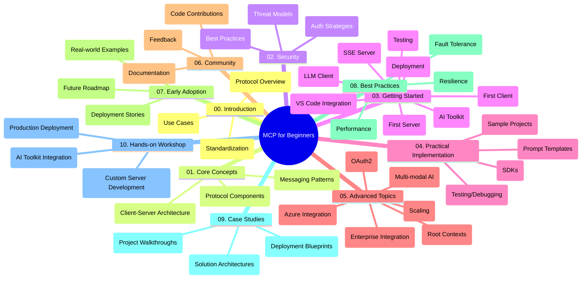

<!--
CO_OP_TRANSLATOR_METADATA:
{
  "original_hash": "a607d4febc94caee9a12b77795f7fc9a",
  "translation_date": "2025-07-13T15:19:57+00:00",
  "source_file": "study_guide.md",
  "language_code": "uk"
}
-->
# Model Context Protocol (MCP) для початківців – навчальний посібник

Цей навчальний посібник надає огляд структури та вмісту репозиторію для курсу "Model Context Protocol (MCP) для початківців". Використовуйте цей посібник, щоб ефективно орієнтуватися в репозиторії та максимально використовувати доступні ресурси.

## Огляд репозиторію

Model Context Protocol (MCP) — це стандартизований фреймворк для взаємодії між AI-моделями та клієнтськими додатками. Цей репозиторій містить комплексний курс із практичними прикладами коду на C#, Java, JavaScript, Python та TypeScript, розроблений для AI-розробників, системних архітекторів і програмних інженерів.

## Візуальна карта курсу

## Структура репозиторію

Репозиторій організований у десять основних розділів, кожен з яких присвячений різним аспектам MCP:

1. **Вступ (00-Introduction/)**
   - Огляд Model Context Protocol
   - Чому стандартизація важлива в AI-пайплайнах
   - Практичні випадки використання та переваги

2. **Основні поняття (01-CoreConcepts/)**
   - Архітектура клієнт-сервер
   - Ключові компоненти протоколу
   - Патерни обміну повідомленнями в MCP

3. **Безпека (02-Security/)**
   - Загрози безпеці в системах на основі MCP
   - Кращі практики захисту реалізацій
   - Стратегії аутентифікації та авторизації

4. **Початок роботи (03-GettingStarted/)**
   - Налаштування середовища та конфігурація
   - Створення базових MCP-серверів і клієнтів
   - Інтеграція з існуючими додатками
   - Підрозділи для першого сервера, першого клієнта, LLM-клієнта, інтеграції з VS Code, SSE-сервера, AI Toolkit, тестування та розгортання

5. **Практична реалізація (04-PracticalImplementation/)**
   - Використання SDK для різних мов програмування
   - Налагодження, тестування та валідація
   - Створення багаторазових шаблонів prompt і робочих процесів
   - Прикладні проекти з демонстрацією реалізації

6. **Поглиблені теми (05-AdvancedTopics/)**
   - Мультимодальні AI-робочі процеси та розширюваність
   - Стратегії безпечного масштабування
   - MCP в корпоративних екосистемах
   - Спеціалізовані теми, включно з інтеграцією Azure, мультимодальністю, OAuth2, кореневими контекстами, маршрутизацією, семплінгом, масштабуванням, безпекою, інтеграцією веб-пошуку та стрімінгом

7. **Внесок спільноти (06-CommunityContributions/)**
   - Як долучитися до коду та документації
   - Співпраця через GitHub
   - Покращення та відгуки від спільноти

8. **Уроки з раннього впровадження (07-LessonsfromEarlyAdoption/)**
   - Реальні впровадження та історії успіху
   - Створення та розгортання рішень на основі MCP
   - Тенденції та майбутня дорожня карта

9. **Кращі практики (08-BestPractices/)**
   - Налаштування продуктивності та оптимізація
   - Проектування відмовостійких MCP-систем
   - Стратегії тестування та стійкості

10. **Кейс-стаді (09-CaseStudy/)**
    - Глибокий аналіз архітектур рішень MCP
    - Шаблони розгортання та поради з інтеграції
    - Анотовані діаграми та покрокові огляди проектів

11. **Практичний воркшоп (10-StreamliningAIWorkflowsBuildingAnMCPServerWithAIToolkit/)**
    - Комплексний практичний воркшоп, що поєднує MCP з AI Toolkit від Microsoft для VS Code
    - Створення інтелектуальних додатків, що поєднують AI-моделі з реальними інструментами
    - Практичні модулі, що охоплюють основи, розробку кастомного сервера та стратегії розгортання в продакшн

## Прикладні проекти

Репозиторій містить кілька прикладних проектів, які демонструють реалізацію MCP на різних мовах програмування:

### Базові приклади калькулятора MCP
- Приклад MCP-сервера на C#
- Калькулятор MCP на Java
- Демонстрація MCP на JavaScript
- MCP-сервер на Python
- Приклад MCP на TypeScript

### Розширені проекти калькулятора MCP
- Розширений приклад на C#
- Приклад контейнерного додатку на Java
- Розширений приклад на JavaScript
- Складна реалізація на Python
- Приклад контейнера на TypeScript

## Додаткові ресурси

Репозиторій містить допоміжні ресурси:

- **Папка Images**: містить діаграми та ілюстрації, що використовуються в курсі
- **Переклади**: підтримка кількох мов із автоматизованими перекладами документації
- **Офіційні ресурси MCP**:
  - [MCP Documentation](https://modelcontextprotocol.io/)
  - [MCP Specification](https://spec.modelcontextprotocol.io/)
  - [MCP GitHub Repository](https://github.com/modelcontextprotocol)

## Як користуватися цим репозиторієм

1. **Послідовне навчання**: проходьте розділи у порядку (від 00 до 10) для структурованого навчання.
2. **Фокус на конкретній мові**: якщо вас цікавить певна мова програмування, досліджуйте відповідні каталоги з прикладами.
3. **Практична реалізація**: почніть із розділу "Початок роботи", щоб налаштувати середовище та створити перший MCP-сервер і клієнт.
4. **Поглиблене вивчення**: після освоєння основ переходьте до розділу з поглибленими темами для розширення знань.
5. **Спільнотна взаємодія**: приєднуйтесь до [Azure AI Foundry Discord](https://discord.com/invite/ByRwuEEgH4), щоб спілкуватися з експертами та іншими розробниками.

## Внесок

Цей репозиторій відкритий для внеску від спільноти. Дивіться розділ Внесок спільноти для інструкцій, як долучитися.

---

*Цей навчальний посібник створено 11 червня 2025 року і відображає стан репозиторію на цю дату. З того часу вміст репозиторію міг бути оновлений.*

**Відмова від відповідальності**:  
Цей документ було перекладено за допомогою сервісу автоматичного перекладу [Co-op Translator](https://github.com/Azure/co-op-translator). Хоча ми прагнемо до точності, будь ласка, майте на увазі, що автоматичні переклади можуть містити помилки або неточності. Оригінальний документ рідною мовою слід вважати авторитетним джерелом. Для критично важливої інформації рекомендується звертатися до професійного людського перекладу. Ми не несемо відповідальності за будь-які непорозуміння або неправильні тлумачення, що виникли внаслідок використання цього перекладу.