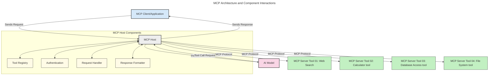
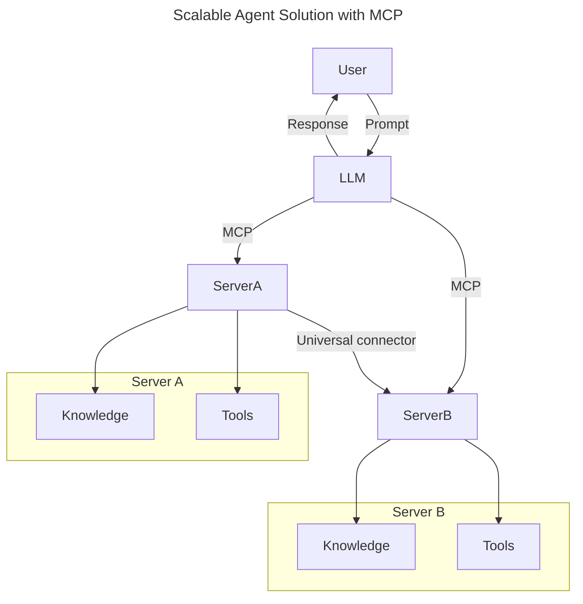
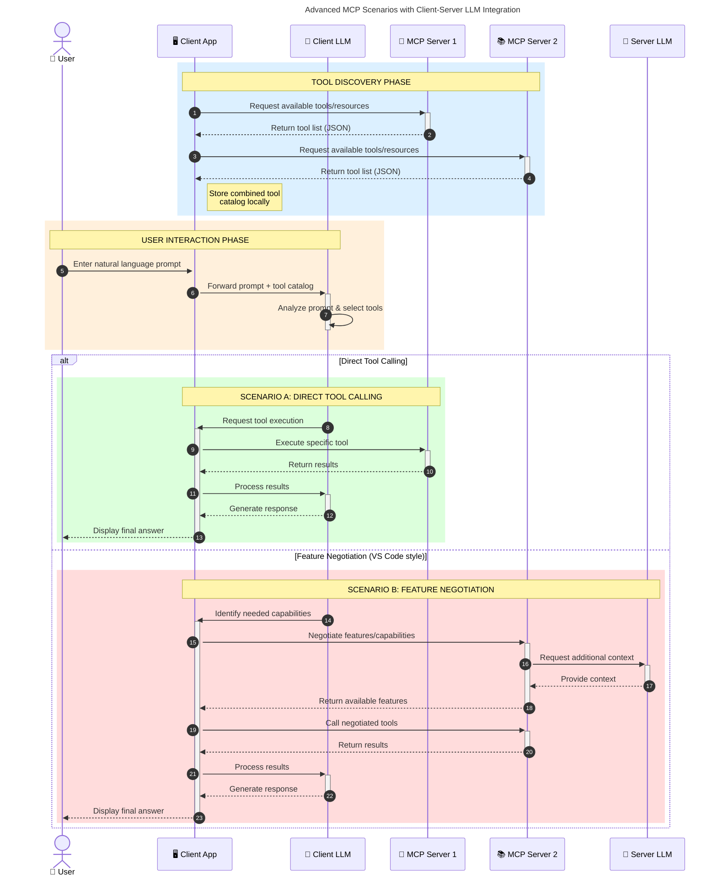

<!--
CO_OP_TRANSLATOR_METADATA:
{
  "original_hash": "0df1ee78a6dd8300f3a040ca5b411c2e",
  "translation_date": "2025-08-18T14:23:58+00:00",
  "source_file": "00-Introduction/README.md",
  "language_code": "ur"
}
-->
# ماڈل کانٹیکسٹ پروٹوکول (MCP) کا تعارف: اسکیل ایبل AI ایپلیکیشنز کے لیے اس کی اہمیت

_(اوپر دی گئی تصویر پر کلک کریں تاکہ اس سبق کی ویڈیو دیکھ سکیں)_

جنریٹو AI ایپلیکیشنز ایک بڑی پیش رفت ہیں کیونکہ یہ اکثر صارف کو قدرتی زبان کے پرامپٹس کے ذریعے ایپ کے ساتھ بات چیت کرنے دیتی ہیں۔ لیکن جیسے جیسے ان ایپس میں زیادہ وقت اور وسائل لگائے جاتے ہیں، آپ یہ یقینی بنانا چاہتے ہیں کہ آپ آسانی سے فنکشنز اور وسائل کو اس طرح ضم کر سکیں کہ یہ توسیع پذیر ہو، آپ کی ایپ ایک سے زیادہ ماڈلز کو سنبھال سکے، اور مختلف ماڈلز کی پیچیدگیوں کو ہینڈل کر سکے۔ مختصر یہ کہ جنریٹو AI ایپس بنانا شروع میں آسان ہے، لیکن جیسے جیسے یہ بڑھتی ہیں اور زیادہ پیچیدہ ہوتی ہیں، آپ کو ایک آرکیٹیکچر کی وضاحت شروع کرنی ہوگی اور ممکنہ طور پر ایک معیار پر انحصار کرنا ہوگا تاکہ آپ کی ایپس مستقل طریقے سے بنائی جا سکیں۔ یہاں MCP چیزوں کو منظم کرنے اور ایک معیار فراہم کرنے کے لیے آتا ہے۔

---

## **🔍 ماڈل کانٹیکسٹ پروٹوکول (MCP) کیا ہے؟**

**ماڈل کانٹیکسٹ پروٹوکول (MCP)** ایک **اوپن، معیاری انٹرفیس** ہے جو بڑے زبان کے ماڈلز (LLMs) کو بیرونی ٹولز، APIs، اور ڈیٹا ذرائع کے ساتھ بغیر کسی رکاوٹ کے بات چیت کرنے کی اجازت دیتا ہے۔ یہ ایک مستقل آرکیٹیکچر فراہم کرتا ہے تاکہ AI ماڈل کی فعالیت کو ان کے تربیتی ڈیٹا سے آگے بڑھایا جا سکے، جس سے زیادہ ذہین، توسیع پذیر، اور جوابدہ AI سسٹمز ممکن ہو سکیں۔

---

## **🎯 AI میں معیار کی اہمیت کیوں ہے؟**

جیسے جیسے جنریٹو AI ایپلیکیشنز زیادہ پیچیدہ ہوتی ہیں، یہ ضروری ہے کہ ایسے معیارات اپنائے جائیں جو **اسکیل ایبلٹی، توسیع پذیری، برقرار رکھنے کی صلاحیت،** اور **وینڈر لاک ان سے بچاؤ** کو یقینی بنائیں۔ MCP ان ضروریات کو پورا کرتا ہے:

- ماڈل-ٹول انٹیگریشن کو یکجا کرنا
- نازک، ایک بار کے لیے بنائے گئے کسٹم حل کو کم کرنا
- مختلف وینڈرز کے متعدد ماڈلز کو ایک ہی ایکوسسٹم میں ساتھ لانے کی اجازت دینا

**نوٹ:** اگرچہ MCP خود کو ایک اوپن معیار کے طور پر پیش کرتا ہے، لیکن MCP کو کسی موجودہ معیاری ادارے جیسے IEEE، IETF، W3C، ISO، یا کسی اور معیاری ادارے کے ذریعے معیاری بنانے کے کوئی منصوبے نہیں ہیں۔

---

## **📚 سیکھنے کے مقاصد**

اس مضمون کے اختتام تک، آپ قابل ہوں گے:

- **ماڈل کانٹیکسٹ پروٹوکول (MCP)** اور اس کے استعمال کے کیسز کی وضاحت کریں
- سمجھیں کہ MCP ماڈل-ٹول کمیونیکیشن کو کیسے معیاری بناتا ہے
- MCP آرکیٹیکچر کے بنیادی اجزاء کی شناخت کریں
- انٹرپرائز اور ڈیولپمنٹ کے سیاق و سباق میں MCP کے حقیقی دنیا کے اطلاقات کو دریافت کریں

---

## **💡 ماڈل کانٹیکسٹ پروٹوکول (MCP) کیوں ایک گیم چینجر ہے؟**

### **🔗 MCP AI انٹریکشنز میں ٹکڑاؤ کو حل کرتا ہے**

MCP سے پہلے، ماڈلز کو ٹولز کے ساتھ ضم کرنے کے لیے ضرورت ہوتی تھی:

- ہر ٹول-ماڈل جوڑی کے لیے کسٹم کوڈ
- ہر وینڈر کے لیے غیر معیاری APIs
- اپڈیٹس کی وجہ سے بار بار خرابی
- زیادہ ٹولز کے ساتھ ناقص اسکیل ایبلٹی

### **✅ MCP معیاری بنانے کے فوائد**

| **فائدہ**              | **تفصیل**                                                                |
|--------------------------|--------------------------------------------------------------------------------|
| انٹرآپریبلٹی         | LLMs مختلف وینڈرز کے ٹولز کے ساتھ بغیر کسی رکاوٹ کے کام کرتے ہیں                       |
| مستقل مزاجی              | پلیٹ فارمز اور ٹولز کے درمیان یکساں رویہ                                    |
| دوبارہ استعمال کی صلاحیت              | ایک بار بنائے گئے ٹولز کو مختلف پروجیکٹس اور سسٹمز میں استعمال کیا جا سکتا ہے                       |
| تیز تر ڈیولپمنٹ  | معیاری، پلگ اینڈ پلے انٹرفیسز استعمال کرکے ڈیولپمنٹ کا وقت کم کریں                |

---

## **🧱 MCP آرکیٹیکچر کا اعلیٰ سطحی جائزہ**

MCP ایک **کلائنٹ-سرور ماڈل** کی پیروی کرتا ہے، جہاں:

- **MCP ہوسٹس** AI ماڈلز کو چلاتے ہیں
- **MCP کلائنٹس** درخواستیں شروع کرتے ہیں
- **MCP سرورز** کانٹیکسٹ، ٹولز، اور صلاحیتیں فراہم کرتے ہیں

### **اہم اجزاء:**

- **وسائل** – ماڈلز کے لیے جامد یا متحرک ڈیٹا  
- **پرامپٹس** – رہنمائی کے لیے پہلے سے طے شدہ ورک فلو  
- **ٹولز** – قابل عمل فنکشنز جیسے سرچ، حساب کتاب  
- **سیمپلنگ** – ایجنٹک رویہ کے ذریعے بار بار انٹریکشنز  

---

## MCP سرورز کیسے کام کرتے ہیں؟

MCP سرورز درج ذیل طریقے سے کام کرتے ہیں:

- **درخواست کا بہاؤ**:
    1. ایک درخواست کسی اختتامی صارف یا ان کے نمائندے کے طور پر کام کرنے والے سافٹ ویئر کے ذریعے شروع کی جاتی ہے۔
    2. **MCP کلائنٹ** درخواست کو **MCP ہوسٹ** کو بھیجتا ہے، جو AI ماڈل رن ٹائم کو منظم کرتا ہے۔
    3. **AI ماڈل** صارف کے پرامپٹ کو وصول کرتا ہے اور ممکنہ طور پر ایک یا زیادہ ٹول کالز کے ذریعے بیرونی ٹولز یا ڈیٹا تک رسائی کی درخواست کر سکتا ہے۔
    4. **MCP ہوسٹ،** ماڈل براہ راست نہیں، معیاری پروٹوکول کا استعمال کرتے ہوئے مناسب **MCP سرورز** کے ساتھ بات چیت کرتا ہے۔
- **MCP ہوسٹ کی فعالیت**:
    - **ٹول رجسٹری**: دستیاب ٹولز اور ان کی صلاحیتوں کی کیٹلاگ برقرار رکھتا ہے۔
    - **تصدیق**: ٹول تک رسائی کے لیے اجازتوں کی تصدیق کرتا ہے۔
    - **درخواست ہینڈلر**: ماڈل سے آنے والی ٹول درخواستوں کو پروسیس کرتا ہے۔
    - **جواب فارمیٹر**: ٹول آؤٹ پٹس کو اس فارمیٹ میں ترتیب دیتا ہے جو ماڈل سمجھ سکتا ہے۔
- **MCP سرور کا عمل**:
    - **MCP ہوسٹ** ٹول کالز کو ایک یا زیادہ **MCP سرورز** کی طرف بھیجتا ہے، ہر ایک مخصوص فنکشنز (جیسے سرچ، حساب کتاب، ڈیٹا بیس کوئریز) کو ظاہر کرتا ہے۔
    - **MCP سرورز** اپنے متعلقہ آپریشنز انجام دیتے ہیں اور **MCP ہوسٹ** کو نتائج ایک مستقل فارمیٹ میں واپس بھیجتے ہیں۔
    - **MCP ہوسٹ** ان نتائج کو فارمیٹ کرتا ہے اور انہیں **AI ماڈل** تک پہنچاتا ہے۔
- **جواب کی تکمیل**:
    - **AI ماڈل** ٹول آؤٹ پٹس کو حتمی جواب میں شامل کرتا ہے۔
    - **MCP ہوسٹ** اس جواب کو **MCP کلائنٹ** کو بھیجتا ہے، جو اسے اختتامی صارف یا کالنگ سافٹ ویئر تک پہنچاتا ہے۔

## 👨‍💻 MCP سرور کیسے بنائیں (مثالوں کے ساتھ)

MCP سرورز LLM کی صلاحیتوں کو ڈیٹا اور فعالیت فراہم کرکے بڑھانے کی اجازت دیتے ہیں۔

آزمائش کے لیے تیار ہیں؟ یہاں مختلف زبانوں/اسٹیکس میں سادہ MCP سرورز بنانے کی مثالوں کے ساتھ زبان اور/یا اسٹیک مخصوص SDKs ہیں:

- **Python SDK**: https://github.com/modelcontextprotocol/python-sdk

- **TypeScript SDK**: https://github.com/modelcontextprotocol/typescript-sdk

- **Java SDK**: https://github.com/modelcontextprotocol/java-sdk

- **C#/.NET SDK**: https://github.com/modelcontextprotocol/csharp-sdk

---

## 🌍 MCP کے حقیقی دنیا کے استعمال کے کیسز

MCP AI کی صلاحیتوں کو بڑھا کر مختلف ایپلیکیشنز کو ممکن بناتا ہے:

| **ایپلیکیشن**              | **تفصیل**                                                                |
|------------------------------|--------------------------------------------------------------------------------|
| انٹرپرائز ڈیٹا انٹیگریشن  | LLMs کو ڈیٹا بیس، CRMs، یا اندرونی ٹولز سے جوڑیں                             |
| ایجنٹک AI سسٹمز           | ٹول تک رسائی اور فیصلہ سازی کے ورک فلو کے ساتھ خود مختار ایجنٹس کو فعال کریں        |
| ملٹی موڈل ایپلیکیشنز     | ایک ہی متحد AI ایپ میں متن، تصویر، اور آڈیو ٹولز کو یکجا کریں            |
| ریئل ٹائم ڈیٹا انٹیگریشن   | AI انٹریکشنز میں لائیو ڈیٹا لائیں تاکہ زیادہ درست، موجودہ آؤٹ پٹس فراہم کیے جا سکیں        |

---

### 🧠 MCP = AI انٹریکشنز کے لیے یونیورسل معیار

ماڈل کانٹیکسٹ پروٹوکول (MCP) AI انٹریکشنز کے لیے ایک یونیورسل معیار کے طور پر کام کرتا ہے، بالکل جیسے USB-C نے ڈیوائسز کے لیے فزیکل کنکشنز کو معیاری بنایا۔ AI کی دنیا میں، MCP ایک مستقل انٹرفیس فراہم کرتا ہے، جس سے ماڈلز (کلائنٹس) بیرونی ٹولز اور ڈیٹا فراہم کرنے والوں (سرورز) کے ساتھ بغیر کسی رکاوٹ کے ضم ہو سکتے ہیں۔ یہ ہر API یا ڈیٹا سورس کے لیے مختلف، کسٹم پروٹوکولز کی ضرورت کو ختم کرتا ہے۔

MCP کے تحت، ایک MCP-کمپیٹیبل ٹول (جسے MCP سرور کہا جاتا ہے) ایک متحد معیار کی پیروی کرتا ہے۔ یہ سرورز وہ ٹولز یا ایکشنز کی فہرست دے سکتے ہیں جو وہ پیش کرتے ہیں اور ان ایکشنز کو AI ایجنٹ کی درخواست پر انجام دے سکتے ہیں۔ MCP کو سپورٹ کرنے والے AI ایجنٹ پلیٹ فارمز سرورز سے دستیاب ٹولز کو دریافت کرنے اور انہیں اس معیاری پروٹوکول کے ذریعے استعمال کرنے کے قابل ہوتے ہیں۔

---

### 💡 علم تک رسائی کو آسان بناتا ہے

ٹولز کی پیشکش کے علاوہ، MCP علم تک رسائی کو بھی آسان بناتا ہے۔ یہ ایپلیکیشنز کو بڑے زبان کے ماڈلز (LLMs) کو مختلف ڈیٹا ذرائع سے جوڑ کر کانٹیکسٹ فراہم کرنے کی اجازت دیتا ہے۔ مثال کے طور پر، ایک MCP سرور کسی کمپنی کے دستاویزات کے ذخیرے کی نمائندگی کر سکتا ہے، جس سے ایجنٹس کو ضرورت کے وقت متعلقہ معلومات حاصل کرنے کی اجازت ملتی ہے۔ ایک اور سرور مخصوص ایکشنز جیسے ای میل بھیجنے یا ریکارڈز کو اپ ڈیٹ کرنے کو ہینڈل کر سکتا ہے۔ ایجنٹ کے نقطہ نظر سے، یہ صرف ٹولز ہیں جنہیں وہ استعمال کر سکتا ہے—کچھ ٹولز ڈیٹا واپس کرتے ہیں (علمی کانٹیکسٹ)، جبکہ دیگر ایکشنز انجام دیتے ہیں۔ MCP دونوں کو مؤثر طریقے سے منظم کرتا ہے۔

---

### 👉 مثال: اسکیل ایبل ایجنٹ حل

---

### 🔄 کلائنٹ سائیڈ LLM انٹیگریشن کے ساتھ ایڈوانس MCP منظرنامے

بنیادی MCP آرکیٹیکچر سے آگے، ایسے ایڈوانس منظرنامے ہیں جہاں کلائنٹ اور سرور دونوں LLMs پر مشتمل ہوتے ہیں، جس سے زیادہ پیچیدہ انٹریکشنز ممکن ہوتے ہیں۔ درج ذیل ڈایاگرام میں، **کلائنٹ ایپ** ایک IDE ہو سکتا ہے جس میں صارف کے لیے دستیاب MCP ٹولز کی تعداد موجود ہو:

---

## 🔐 MCP کے عملی فوائد

MCP کے استعمال کے عملی فوائد درج ذیل ہیں:

- **تازگی**: ماڈلز تربیتی ڈیٹا سے آگے تازہ ترین معلومات تک رسائی حاصل کر سکتے ہیں
- **صلاحیت میں اضافہ**: ماڈلز خصوصی ٹولز کو ان کاموں کے لیے استعمال کر سکتے ہیں جن کے لیے وہ تربیت یافتہ نہیں ہیں
- **غلط معلومات میں کمی**: بیرونی ڈیٹا ذرائع حقائق کی بنیاد فراہم کرتے ہیں
- **پرائیویسی**: حساس ڈیٹا محفوظ ماحول میں رہ سکتا ہے بجائے اس کے کہ پرامپٹس میں شامل کیا جائے

---

## 📌 اہم نکات

MCP کے استعمال کے لیے درج ذیل اہم نکات ہیں:

- **MCP** AI ماڈلز کے ٹولز اور ڈیٹا کے ساتھ انٹریکشن کو معیاری بناتا ہے
- **توسیع پذیری، مستقل مزاجی، اور انٹرآپریبلٹی** کو فروغ دیتا ہے
- MCP **ڈیولپمنٹ کے وقت کو کم کرنے، قابل اعتمادیت کو بہتر بنانے، اور ماڈل کی صلاحیتوں کو بڑھانے** میں مدد کرتا ہے
- کلائنٹ-سرور آرکیٹیکچر **لچکدار، توسیع پذیر AI ایپلیکیشنز** کو ممکن بناتا ہے

---

## 🧠 مشق

ایسی AI ایپلیکیشن کے بارے میں سوچیں جسے آپ بنانے میں دلچسپی رکھتے ہیں۔

- کون سے **بیرونی ٹولز یا ڈیٹا** اس کی صلاحیتوں کو بڑھا سکتے ہیں؟
- MCP انٹیگریشن کو **آسان اور زیادہ قابل اعتماد** کیسے بنا سکتا ہے؟

---

## اضافی وسائل

- [MCP GitHub ریپوزٹری](https://github.com/modelcontextprotocol)

---

## آگے کیا ہے؟

اگلا: [باب 1: بنیادی تصورات](../01-CoreConcepts/README.md)

**ڈس کلیمر**:  
یہ دستاویز AI ترجمہ سروس [Co-op Translator](https://github.com/Azure/co-op-translator) کا استعمال کرتے ہوئے ترجمہ کی گئی ہے۔ ہم درستگی کے لیے کوشش کرتے ہیں، لیکن براہ کرم آگاہ رہیں کہ خودکار ترجمے میں غلطیاں یا خامیاں ہو سکتی ہیں۔ اصل دستاویز کو اس کی اصل زبان میں مستند ذریعہ سمجھا جانا چاہیے۔ اہم معلومات کے لیے، پیشہ ور انسانی ترجمہ کی سفارش کی جاتی ہے۔ اس ترجمے کے استعمال سے پیدا ہونے والی کسی بھی غلط فہمی یا غلط تشریح کے لیے ہم ذمہ دار نہیں ہیں۔