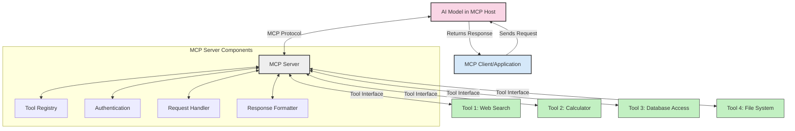
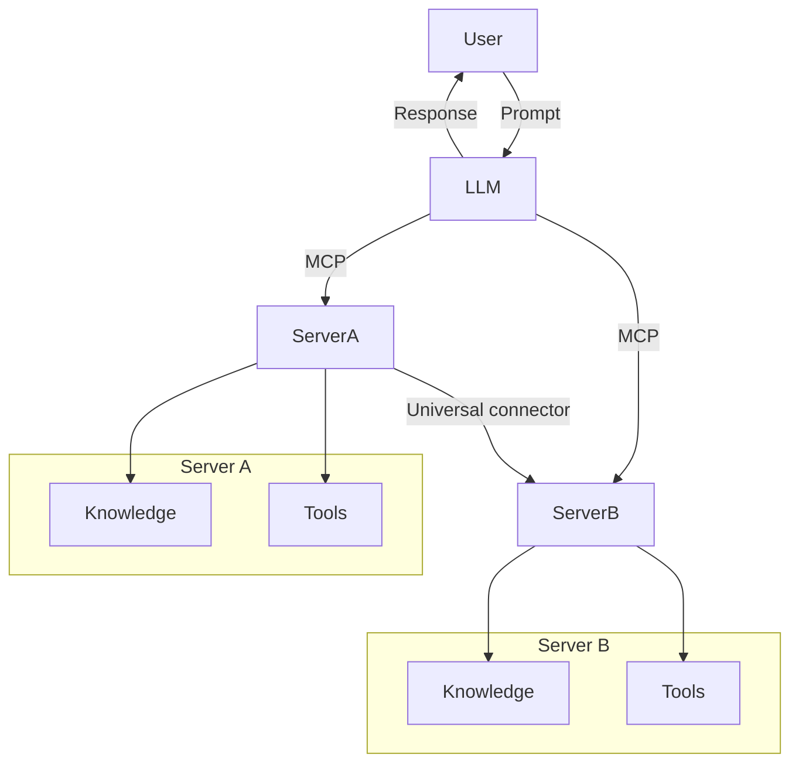

<!--
CO_OP_TRANSLATOR_METADATA:
{
  "original_hash": "1d88dee994dcbb3fa52c271d0c0817b5",
  "translation_date": "2025-05-20T20:27:46+00:00",
  "source_file": "00-Introduction/README.md",
  "language_code": "ur"
}
-->
# تعارف برائے Model Context Protocol (MCP): اسکیل ایبل AI ایپلیکیشنز کے لیے اس کی اہمیت

جنریٹو AI ایپلیکیشنز ایک بڑا قدم آگے ہیں کیونکہ یہ اکثر صارف کو قدرتی زبان کے پرامپٹس کے ذریعے ایپ کے ساتھ بات چیت کرنے کی اجازت دیتی ہیں۔ تاہم، جب ایسی ایپس میں زیادہ وقت اور وسائل لگائے جاتے ہیں، تو آپ چاہتے ہیں کہ آپ آسانی سے فنکشنالٹیز اور وسائل کو اس طرح شامل کر سکیں کہ اسے بڑھانا آسان ہو، آپ کی ایپ ایک سے زیادہ ماڈلز کے استعمال کو سپورٹ کرے، اور مختلف ماڈل کی پیچیدگیوں کو سنبھال سکے۔ مختصراً، جنریٹو AI ایپس بنانا شروع میں آسان ہے، لیکن جب وہ بڑھتی ہیں اور زیادہ پیچیدہ ہو جاتی ہیں، تو آپ کو ایک آرکیٹیکچر کی وضاحت شروع کرنی پڑتی ہے اور ممکنہ طور پر ایک اسٹینڈرڈ پر انحصار کرنا پڑتا ہے تاکہ آپ کی ایپس مستقل انداز میں بن سکیں۔ یہی وہ جگہ ہے جہاں MCP آتا ہے تاکہ چیزوں کو منظم کرے اور ایک معیاری فریم ورک فراہم کرے۔

---

## **🔍 Model Context Protocol (MCP) کیا ہے؟**

**Model Context Protocol (MCP)** ایک **کھلا، معیاری انٹرفیس** ہے جو Large Language Models (LLMs) کو بیرونی ٹولز، APIs، اور ڈیٹا ذرائع کے ساتھ بغیر رکاوٹ بات چیت کرنے کی اجازت دیتا ہے۔ یہ ایک مستقل آرکیٹیکچر فراہم کرتا ہے تاکہ AI ماڈل کی صلاحیتوں کو ان کے تربیتی ڈیٹا سے آگے بڑھایا جا سکے، اور زیادہ ذہین، اسکیل ایبل، اور فوری ردعمل دینے والے AI سسٹمز کو ممکن بناتا ہے۔

---

## **🎯 AI میں اسٹینڈرڈائزیشن کیوں اہم ہے**

جب جنریٹو AI ایپلیکیشنز زیادہ پیچیدہ ہو جاتی ہیں، تو ایسے معیارات اپنانا ضروری ہو جاتا ہے جو **اسکیل ایبلٹی، توسیع پذیری**، اور **مینٹینیبلیٹی** کو یقینی بنائیں۔ MCP ان ضروریات کو اس طرح پورا کرتا ہے:

- ماڈل اور ٹولز کے انضمام کو متحد کرنا  
- کمزور، ایک بار استعمال ہونے والے کسٹم حل کو کم کرنا  
- ایک ماحولیاتی نظام میں متعدد ماڈلز کو بیک وقت موجود رکھنے کی اجازت دینا  

---

## **📚 سیکھنے کے مقاصد**

اس آرٹیکل کے آخر تک، آپ قابل ہوں گے کہ:

- **Model Context Protocol (MCP)** اور اس کے استعمال کے کیسز کی تعریف کریں  
- سمجھیں کہ MCP ماڈل سے ٹول تک بات چیت کو کیسے معیاری بناتا ہے  
- MCP آرکیٹیکچر کے بنیادی اجزاء کی نشاندہی کریں  
- MCP کے حقیقی دنیا میں استعمالات کو انٹرپرائز اور ڈیولپمنٹ سیاق و سباق میں دریافت کریں  

---

## **💡 Model Context Protocol (MCP) کیوں ایک گیم چینجر ہے**

### **🔗 MCP AI تعاملات میں ٹکڑے ٹکڑے پن کو حل کرتا ہے**

MCP سے پہلے، ماڈلز کو ٹولز کے ساتھ انضمام کے لیے یہ چیزیں درکار تھیں:

- ہر ٹول-ماڈل جوڑے کے لیے کسٹم کوڈ  
- ہر وینڈر کے لیے غیر معیاری APIs  
- اپڈیٹس کی وجہ سے بار بار رکاوٹیں  
- زیادہ ٹولز کے ساتھ کمزور اسکیل ایبلٹی  

### **✅ MCP اسٹینڈرڈائزیشن کے فوائد**

| **فائدہ**                | **تفصیل**                                                                |
|--------------------------|---------------------------------------------------------------------------|
| Interoperability         | LLMs مختلف وینڈرز کے ٹولز کے ساتھ بغیر رکاوٹ کام کرتے ہیں                 |
| Consistency              | پلیٹ فارمز اور ٹولز میں یکساں رویہ                                       |
| Reusability              | ایک بار بنائے گئے ٹولز کو مختلف پروجیکٹس اور سسٹمز میں استعمال کیا جا سکتا ہے |
| Accelerated Development  | معیاری، پلگ اینڈ پلے انٹرفیسز کے استعمال سے ترقی کا وقت کم کرنا           |

---

## **🧱 MCP آرکیٹیکچر کا اعلی سطحی جائزہ**

MCP ایک **کلائنٹ-سرور ماڈل** پر عمل کرتا ہے، جہاں:

- **MCP Hosts** AI ماڈلز چلاتے ہیں  
- **MCP Clients** درخواستیں شروع کرتے ہیں  
- **MCP Servers** کانٹیکسٹ، ٹولز، اور صلاحیتیں فراہم کرتے ہیں  

### **اہم اجزاء:**

- **Resources** – ماڈلز کے لیے جامد یا متحرک ڈیٹا  
- **Prompts** – گائیڈڈ جنریشن کے لیے پہلے سے طے شدہ ورک فلو  
- **Tools** – قابل عمل فنکشنز جیسے سرچ، کیلکولیشنز  
- **Sampling** – recursive تعاملات کے ذریعے ایجنٹک رویہ  

---

## MCP سرورز کیسے کام کرتے ہیں

MCP سرورز درج ذیل طریقے سے کام کرتے ہیں:

- **درخواست کا بہاؤ**:  
    1. MCP کلائنٹ ایک درخواست MCP Host میں چلنے والے AI ماڈل کو بھیجتا ہے۔  
    2. AI ماڈل شناخت کرتا ہے کہ اسے بیرونی ٹولز یا ڈیٹا کی ضرورت ہے۔  
    3. ماڈل معیاری پروٹوکول کے ذریعے MCP سرور سے بات چیت کرتا ہے۔  

- **MCP سرور کی فعالیت**:  
    - ٹول رجسٹری: دستیاب ٹولز اور ان کی صلاحیتوں کا کیٹلاگ رکھتا ہے۔  
    - توثیق: ٹول تک رسائی کے اجازت نامے کی تصدیق کرتا ہے۔  
    - درخواست ہینڈلر: ماڈل سے آنے والی ٹول درخواستوں کو پروسیس کرتا ہے۔  
    - جواب فارمیٹر: ٹول کے آؤٹ پٹ کو ماڈل کے سمجھنے کے قابل فارمیٹ میں ترتیب دیتا ہے۔  

- **ٹول کا اجرا**:  
    - سرور درخواستوں کو متعلقہ بیرونی ٹولز کی طرف بھیجتا ہے  
    - ٹولز اپنی مخصوص فنکشنز انجام دیتے ہیں (سرچ، کیلکولیشن، ڈیٹا بیس کوئریز وغیرہ)  
    - نتائج مستقل فارمیٹ میں ماڈل کو واپس کیے جاتے ہیں۔  

- **جواب کی تکمیل**:  
    - AI ماڈل ٹول کے آؤٹ پٹ کو اپنے جواب میں شامل کرتا ہے۔  
    - حتمی جواب کلائنٹ ایپلیکیشن کو بھیجا جاتا ہے۔  

## 👨‍💻 MCP سرور کیسے بنائیں (مثالوں کے ساتھ)

MCP سرورز آپ کو LLM صلاحیتوں کو بڑھانے کے لیے ڈیٹا اور فنکشنالٹی فراہم کرنے کی اجازت دیتے ہیں۔  

کوشش کرنے کے لیے تیار ہیں؟ یہاں مختلف زبانوں میں ایک سادہ MCP سرور بنانے کی مثالیں ہیں:

- **Python Example**: https://github.com/modelcontextprotocol/python-sdk

- **TypeScript Example**: https://github.com/modelcontextprotocol/typescript-sdk

- **Java Example**: https://github.com/modelcontextprotocol/java-sdk

- **C#/.NET Example**: https://github.com/modelcontextprotocol/csharp-sdk

## 🌍 MCP کے حقیقی دنیا کے استعمالات

MCP AI صلاحیتوں کو بڑھا کر مختلف قسم کی ایپلیکیشنز کو ممکن بناتا ہے:

| **ایپلیکیشن**              | **تفصیل**                                                               |
|----------------------------|-------------------------------------------------------------------------|
| Enterprise Data Integration | LLMs کو ڈیٹا بیسز، CRMs، یا اندرونی ٹولز سے جوڑنا                       |
| Agentic AI Systems          | خود مختار ایجنٹس کو ٹول تک رسائی اور فیصلہ سازی کے ورک فلو فراہم کرنا    |
| Multi-modal Applications    | ایک ہی متحد AI ایپ میں متن، تصویر، اور آڈیو ٹولز کو ملانا               |
| Real-time Data Integration  | AI تعاملات میں تازہ ترین ڈیٹا شامل کرنا تاکہ زیادہ درست اور موجودہ نتائج حاصل ہوں |

### 🧠 MCP = AI تعاملات کے لیے عالمی معیار

Model Context Protocol (MCP) AI تعاملات کے لیے ایک عالمی معیار کے طور پر کام کرتا ہے، بالکل ویسے ہی جیسے USB-C نے ڈیوائسز کے لیے فزیکل کنکشن کو معیاری بنایا۔ AI کی دنیا میں، MCP ایک مستقل انٹرفیس فراہم کرتا ہے، جو ماڈلز (کلائنٹس) کو بیرونی ٹولز اور ڈیٹا فراہم کرنے والوں (سرورز) کے ساتھ بغیر رکاوٹ انضمام کرنے کی اجازت دیتا ہے۔ اس سے ہر API یا ڈیٹا سورس کے لیے مختلف، کسٹم پروٹوکول کی ضرورت ختم ہو جاتی ہے۔

MCP کے تحت، ایک MCP-مطابق ٹول (جسے MCP سرور کہا جاتا ہے) ایک متحد معیار کی پیروی کرتا ہے۔ یہ سرورز دستیاب ٹولز یا اعمال کی فہرست دے سکتے ہیں اور AI ایجنٹ کی درخواست پر ان اعمال کو انجام دیتے ہیں۔ MCP کی حمایت کرنے والے AI ایجنٹ پلیٹ فارمز سرورز سے دستیاب ٹولز دریافت کر سکتے ہیں اور اس معیاری پروٹوکول کے ذریعے انہیں کال کر سکتے ہیں۔

### 💡 علم تک رسائی کو آسان بناتا ہے

ٹولز فراہم کرنے کے علاوہ، MCP علم تک رسائی کو بھی آسان بناتا ہے۔ یہ ایپلیکیشنز کو بڑے زبان کے ماڈلز (LLMs) کو مختلف ڈیٹا ذرائع سے منسلک کرکے کانٹیکسٹ فراہم کرنے کے قابل بناتا ہے۔ مثال کے طور پر، ایک MCP سرور کمپنی کے دستاویزات کے ذخیرے کی نمائندگی کر سکتا ہے، جس سے ایجنٹس کو متعلقہ معلومات فوری طور پر حاصل کرنے کی سہولت ملتی ہے۔ ایک اور سرور مخصوص اعمال جیسے ای میل بھیجنا یا ریکارڈز کو اپ ڈیٹ کرنا سنبھال سکتا ہے۔ ایجنٹ کی نظر میں، یہ صرف ایسے ٹولز ہیں جنہیں وہ استعمال کر سکتا ہے—کچھ ٹولز ڈیٹا (علمی کانٹیکسٹ) واپس کرتے ہیں، جبکہ دیگر اعمال انجام دیتے ہیں۔ MCP دونوں کو مؤثر طریقے سے منظم کرتا ہے۔

ایک ایجنٹ جو MCP سرور سے جڑتا ہے، خودکار طور پر سرور کی دستیاب صلاحیتوں اور قابل رسائی ڈیٹا کو معیاری فارمیٹ کے ذریعے سیکھ لیتا ہے۔ یہ معیاری بنانے سے ٹولز کی متحرک دستیابی ممکن ہوتی ہے۔ مثال کے طور پر، ایجنٹ کے سسٹم میں نیا MCP سرور شامل کرنے سے اس کے فنکشنز فوراً قابل استعمال ہو جاتے ہیں بغیر ایجنٹ کی ہدایات میں مزید تخصیص کے۔

یہ مربوط انضمام اس بہاؤ کے مطابق ہے جو مرمیڈ ڈایاگرام میں دکھایا گیا ہے، جہاں سرورز ٹولز اور علم دونوں فراہم کرتے ہیں، اور سسٹمز کے درمیان بغیر رکاوٹ تعاون کو یقینی بناتے ہیں۔

### 👉 مثال: اسکیل ایبل ایجنٹ حل

## 🔐 MCP کے عملی فوائد

MCP کے استعمال کے عملی فوائد درج ذیل ہیں:

- **تازگی**: ماڈلز اپنے تربیتی ڈیٹا سے آگے تازہ ترین معلومات تک رسائی حاصل کر سکتے ہیں  
- **صلاحیت کی توسیع**: ماڈلز ان مخصوص ٹاسکس کے لیے ماہر ٹولز استعمال کر سکتے ہیں جن کے لیے وہ تربیت یافتہ نہیں تھے  
- **ہیلوسینیشنز میں کمی**: بیرونی ڈیٹا ذرائع حقیقت پر مبنی معلومات فراہم کرتے ہیں  
- **رازداری**: حساس ڈیٹا محفوظ ماحول میں رہ سکتا ہے بجائے اس کے کہ وہ پرامپٹس میں شامل کیا جائے  

## 📌 اہم نکات

MCP کے استعمال کے کلیدی نکات یہ ہیں:

- **MCP** AI ماڈلز کی ٹولز اور ڈیٹا کے ساتھ بات چیت کو معیاری بناتا ہے  
- **توسیع پذیری، مستقل مزاجی، اور باہمی تعامل** کو فروغ دیتا ہے  
- MCP ترقی کے وقت کو کم کرنے، اعتبار کو بہتر بنانے، اور ماڈل کی صلاحیتوں کو بڑھانے میں مدد دیتا ہے  
- کلائنٹ-سرور آرکیٹیکچر لچکدار، توسیع پذیر AI ایپلیکیشنز کو ممکن بناتا ہے  

## 🧠 مشق

اس AI ایپلیکیشن کے بارے میں سوچیں جسے آپ بنانے میں دلچسپی رکھتے ہیں۔

- کون سے **بیرونی ٹولز یا ڈیٹا** اس کی صلاحیتوں کو بڑھا سکتے ہیں؟  
- MCP کس طرح انضمام کو **آسان اور زیادہ قابل اعتماد** بنا سکتا ہے؟  

## اضافی وسائل

- [MCP GitHub Repository](https://github.com/modelcontextprotocol)

## آگے کیا ہے

اگلا: [Chapter 1: Core Concepts](/01-CoreConcepts/README.md)

**اعلانِ ذمہ داری**:  
یہ دستاویز AI ترجمہ سروس [Co-op Translator](https://github.com/Azure/co-op-translator) کے ذریعے ترجمہ کی گئی ہے۔ اگرچہ ہم درستگی کی کوشش کرتے ہیں، براہ کرم اس بات سے آگاہ رہیں کہ خودکار ترجموں میں غلطیاں یا عدم صحت ہو سکتی ہے۔ اصل دستاویز اپنی مادری زبان میں معتبر ماخذ سمجھی جانی چاہیے۔ اہم معلومات کے لیے پیشہ ور انسانی ترجمہ کی سفارش کی جاتی ہے۔ اس ترجمے کے استعمال سے پیدا ہونے والی کسی بھی غلط فہمی یا غلط تشریح کی ذمہ داری ہم پر عائد نہیں ہوتی۔