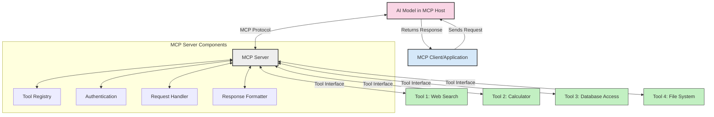
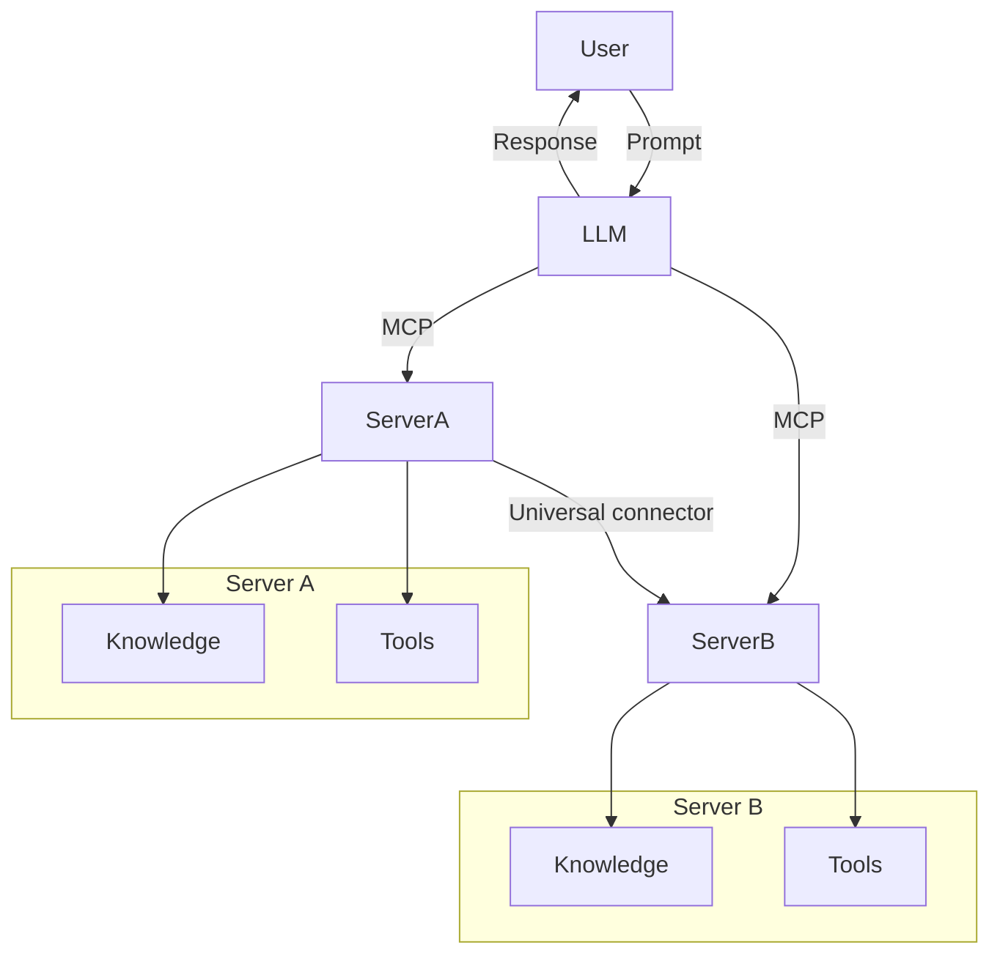

<!--
CO_OP_TRANSLATOR_METADATA:
{
  "original_hash": "02301140adbd807ecf0f17720fa307bc",
  "translation_date": "2025-05-17T05:54:20+00:00",
  "source_file": "00-Introduction/README.md",
  "language_code": "ur"
}
-->
# ماڈل کانٹیکسٹ پروٹوکول (MCP) کا تعارف: اسکیل ایبل AI ایپلیکیشنز کے لئے کیوں اہم ہے

جنریٹو AI ایپلیکیشنز ایک بڑا قدم ہیں کیونکہ یہ صارف کو قدرتی زبان کے ذریعے ایپ کے ساتھ تعامل کرنے کی اجازت دیتے ہیں۔ تاہم، جیسے جیسے ان ایپس میں زیادہ وقت اور وسائل کی سرمایہ کاری ہوتی ہے، آپ کو یہ یقینی بنانا ہوگا کہ آپ آسانی سے فنکشنالٹیز اور وسائل کو اس طرح سے مربوط کر سکتے ہیں کہ ان کو بڑھانا آسان ہو، آپ کی ایپ ایک سے زیادہ ماڈلز کی ضروریات کو پورا کر سکے، اور اس کی پیچیدگیاں۔ مختصر میں، جن AI ایپس بنانا شروع کرنا آسان ہے لیکن جیسے جیسے یہ بڑھتی ہیں اور پیچیدہ ہوتی جاتی ہیں، آپ کو ایک آرکیٹیکچر کی تعریف کرنا شروع کرنا ہوگا اور زیادہ تر امکان ہے کہ آپ کو ایک معیار پر انحصار کرنا ہوگا تاکہ آپ کی ایپس کو مستقل طریقے سے بنایا جائے۔ یہاں MCP چیزوں کو منظم کرنے کے لئے آتا ہے، ایک معیار فراہم کرتا ہے۔

---

## **🔍 ماڈل کانٹیکسٹ پروٹوکول (MCP) کیا ہے؟**

**ماڈل کانٹیکسٹ پروٹوکول (MCP)** ایک **کھلا، معیاری انٹرفیس** ہے جو بڑے زبان کے ماڈلز (LLMs) کو بیرونی ٹولز، APIs، اور ڈیٹا سورسز کے ساتھ بغیر کسی رکاوٹ کے تعامل کرنے کی اجازت دیتا ہے۔ یہ ایک مستقل آرکیٹیکچر فراہم کرتا ہے جو AI ماڈل کی فنکشنالٹی کو ان کے تربیتی ڈیٹا سے آگے بڑھاتا ہے، جس سے زیادہ ہوشیار، اسکیل ایبل، اور زیادہ جوابی AI سسٹمز ممکن ہوتے ہیں۔

---

## **🎯 AI میں معیاری سازی کیوں اہم ہے**

جیسے جیسے جنریٹو AI ایپلیکیشنز زیادہ پیچیدہ ہوتی جاتی ہیں، یہ ضروری ہے کہ ایسے معیارات اپنائے جائیں جو **اسکیل ایبلٹی، ایکسٹینسیبلٹی**، اور **مینٹینیبلٹی** کو یقینی بنائیں۔ MCP ان ضروریات کو پورا کرتا ہے:

- ماڈل ٹول انٹیگریشنز کو یکجا کرنا
- نازک، ایک دفعہ کے کسٹم حلوں کو کم کرنا
- ایکو سسٹم میں متعدد ماڈلز کے ساتھ موجود ہونے کی اجازت دینا

---

## **📚 سیکھنے کے مقاصد**

اس مضمون کے آخر تک، آپ قابل ہوں گے:

- **ماڈل کانٹیکسٹ پروٹوکول (MCP)** اور اس کے استعمال کی صورتوں کی تعریف کرنا
- سمجھنا کہ MCP ماڈل سے ٹول کی مواصلات کو کیسے معیاری بناتا ہے
- MCP آرکیٹیکچر کے بنیادی اجزاء کی شناخت کرنا
- انٹرپرائز اور ترقی کے سیاق و سباق میں MCP کے حقیقی دنیا کے ایپلیکیشنز کو دریافت کرنا

---

## **💡 ماڈل کانٹیکسٹ پروٹوکول (MCP) کیوں ایک گیم چینجر ہے**

### **🔗 MCP AI تعاملات میں تقسیم کو حل کرتا ہے**

MCP سے پہلے، ماڈلز کو ٹولز کے ساتھ انٹیگریٹ کرنے کے لئے درکار تھا:

- ہر ٹول-ماڈل جوڑے کے لئے کسٹم کوڈ
- ہر وینڈر کے لئے غیر معیاری APIs
- اپ ڈیٹس کی وجہ سے بار بار رکاوٹیں
- مزید ٹولز کے ساتھ خراب اسکیل ایبلٹی

### **✅ MCP معیاری سازی کے فوائد**

| **فائدہ**              | **تفصیل**                                                                |
|--------------------------|--------------------------------------------------------------------------------|
| انٹرآپریبلٹی         | LLMs مختلف وینڈرز کے ٹولز کے ساتھ بغیر کسی رکاوٹ کے کام کرتے ہیں                       |
| مستقل مزاجی              | پلیٹ فارمز اور ٹولز کے درمیان یکساں رویہ                                    |
| دوبارہ استعمال کے قابل              | ایک بار بنائے گئے ٹولز کو مختلف پروجیکٹس اور سسٹمز میں استعمال کیا جا سکتا ہے                       |
| ترقی کی رفتار  | معیاری، پلگ اینڈ پلے انٹرفیسز استعمال کر کے ترقی کا وقت کم کریں                |

---

## **🧱 اعلی سطحی MCP آرکیٹیکچر کا جائزہ**

MCP ایک **کلائنٹ-سرور ماڈل** کی پیروی کرتا ہے، جہاں:

- **MCP ہوسٹس** AI ماڈلز چلاتے ہیں
- **MCP کلائنٹس** درخواستیں شروع کرتے ہیں
- **MCP سرورز** سیاق و سباق، ٹولز، اور صلاحیتیں فراہم کرتے ہیں

### **کلیدی اجزاء:**

- **وسائل** – ماڈلز کے لئے جامد یا متحرک ڈیٹا  
- **پرومپٹس** – رہنمائی جنریشن کے لئے پیشگی طے شدہ ورک فلو  
- **ٹولز** – قابل عمل افعال جیسے تلاش، حساب  
- **سیمپلنگ** – بار بار تعاملات کے ذریعے ایجنٹک رویہ

---

## MCP سرورز کیسے کام کرتے ہیں

MCP سرورز درج ذیل طریقے سے کام کرتے ہیں:

- **درخواست کا بہاؤ**: 
    1. MCP کلائنٹ ایک درخواست MCP ہوسٹ میں چلنے والے AI ماڈل کو بھیجتا ہے۔
    2. AI ماڈل شناخت کرتا ہے جب اسے بیرونی ٹولز یا ڈیٹا کی ضرورت ہوتی ہے۔
    3. ماڈل MCP سرور کے ساتھ معیاری پروٹوکول کا استعمال کرتے ہوئے بات چیت کرتا ہے۔

- **MCP سرور کی فعالیت**:
    - ٹول رجسٹری: دستیاب ٹولز اور ان کی صلاحیتوں کا کیٹلاگ برقرار رکھتا ہے۔
    - تصدیق: ٹول تک رسائی کے لئے اجازتوں کی تصدیق کرتا ہے۔
    - درخواست ہینڈلر: ماڈل سے آنے والی ٹول درخواستوں کو پراسیس کرتا ہے۔
    - جواب فارمیٹر: ٹول آؤٹ پٹس کو ایک فارمیٹ میں تشکیل دیتا ہے جو ماڈل سمجھ سکتا ہے۔

- **ٹول کا عمل**: 
    - سرور درخواستوں کو مناسب بیرونی ٹولز کی طرف منتقل کرتا ہے
    - ٹولز اپنی خصوصی افعال (تلاش، حساب، ڈیٹا بیس کی کوئریز، وغیرہ) انجام دیتے ہیں
    - نتائج کو ماڈل میں ایک مستقل فارمیٹ میں واپس کیا جاتا ہے۔

- **جواب کی تکمیل**: 
    - AI ماڈل اپنے جواب میں ٹول آؤٹ پٹس کو شامل کرتا ہے۔
    - حتمی جواب کلائنٹ ایپلیکیشن کو واپس بھیجا جاتا ہے۔

## 👨‍💻 MCP سرور کیسے بنائیں (مثالوں کے ساتھ)

MCP سرورز آپ کو LLM کی صلاحیتوں کو ڈیٹا اور فنکشنالٹی فراہم کر کے بڑھانے کی اجازت دیتے ہیں۔ 

تیار ہیں کہ اسے آزما کر دیکھیں؟ یہاں مختلف زبانوں میں ایک سادہ MCP سرور بنانے کی مثالیں ہیں:

- **Python مثال**: https://github.com/modelcontextprotocol/python-sdk

- **TypeScript مثال**: https://github.com/modelcontextprotocol/typescript-sdk

- **Java مثال**: https://github.com/modelcontextprotocol/java-sdk

- **C#/.NET مثال**: https://github.com/modelcontextprotocol/csharp-sdk

## 🌍 حقیقی دنیا کے MCP استعمال کے کیسز

MCP AI صلاحیتوں کو بڑھا کر وسیع پیمانے پر ایپلیکیشنز کو فعال کرتا ہے:

| **ایپلیکیشن**              | **تفصیل**                                                                |
|------------------------------|--------------------------------------------------------------------------------|
| انٹرپرائز ڈیٹا انٹیگریشن  | LLMs کو ڈیٹا بیس، CRMs، یا اندرونی ٹولز سے جوڑیں                             |
| ایجنٹک AI سسٹمز           | ٹول تک رسائی اور فیصلہ سازی ورک فلو کے ساتھ خودمختار ایجنٹس کو فعال کریں        |
| ملٹی موڈل ایپلیکیشنز     | ایک متحد AI ایپ میں متن، تصویر، اور آڈیو ٹولز کو یکجا کریں            |
| حقیقی وقت میں ڈیٹا انٹیگریشن   | AI تعاملات میں لائیو ڈیٹا لائیں تاکہ زیادہ درست، موجودہ آؤٹ پٹس حاصل ہوں        |

### 🧠 MCP = AI تعاملات کے لئے یونیورسل معیار

ماڈل کانٹیکسٹ پروٹوکول (MCP) AI تعاملات کے لئے یونیورسل معیار کے طور پر کام کرتا ہے، جیسے کہ USB-C نے ڈیوائسز کے لئے جسمانی کنیکشن کو معیاری بنایا۔ AI کی دنیا میں، MCP ایک مستقل انٹرفیس فراہم کرتا ہے، جس سے ماڈلز (کلائنٹس) کو بیرونی ٹولز اور ڈیٹا پرووائیڈرز (سرورز) کے ساتھ بغیر کسی رکاوٹ کے انٹیگریٹ کرنے کی اجازت دیتا ہے۔ یہ ہر API یا ڈیٹا سورس کے لئے مختلف، کسٹم پروٹوکولز کی ضرورت کو ختم کرتا ہے۔

MCP کے تحت، ایک MCP-مطابق ٹول (جسے MCP سرور کہا جاتا ہے) ایک متحد معیار کی پیروی کرتا ہے۔ یہ سرورز وہ ٹولز یا اعمال کی فہرست بنا سکتے ہیں جو وہ پیش کرتے ہیں اور جب AI ایجنٹ درخواست کرتا ہے تو ان اعمال کو انجام دیتے ہیں۔ AI ایجنٹ پلیٹ فارمز جو MCP کو سپورٹ کرتے ہیں، سرورز سے دستیاب ٹولز کو دریافت کرنے اور انہیں اس معیاری پروٹوکول کے ذریعے طلب کرنے کے قابل ہیں۔

### 💡 علم تک رسائی کی سہولت

ٹولز کی پیشکش کے علاوہ، MCP علم تک رسائی کی بھی سہولت فراہم کرتا ہے۔ یہ ایپلیکیشنز کو بڑے زبان کے ماڈلز (LLMs) کو مختلف ڈیٹا سورسز سے جوڑ کر سیاق و سباق فراہم کرنے کے قابل بناتا ہے۔ مثال کے طور پر، ایک MCP سرور کمپنی کے دستاویزات کے ذخیرے کی نمائندگی کر سکتا ہے، جس سے ایجنٹس کو متعلقہ معلومات کو طلب کرنے کی اجازت ملتی ہے۔ ایک اور سرور مخصوص اعمال جیسے ای میل بھیجنے یا ریکارڈز کو اپ ڈیٹ کرنے کا کام کر سکتا ہے۔ ایجنٹ کے نقطہ نظر سے، یہ صرف ٹولز ہیں جن کا وہ استعمال کر سکتا ہے—کچھ ٹولز ڈیٹا واپس کرتے ہیں (علمی سیاق و سباق)، جبکہ دوسرے اعمال انجام دیتے ہیں۔ MCP دونوں کو مؤثر طریقے سے منظم کرتا ہے۔

ایک MCP سرور سے منسلک ہونے والا ایجنٹ سرور کی دستیاب صلاحیتوں اور قابل رسائی ڈیٹا کو ایک معیاری فارمیٹ کے ذریعے خود بخود سیکھتا ہے۔ یہ معیاری سازی ڈائنامک ٹول کی دستیابی کو فعال کرتی ہے۔ مثال کے طور پر، ایجنٹ کے سسٹم میں ایک نئے MCP سرور کو شامل کرنے سے اس کے افعال فوری طور پر قابل استعمال ہو جاتے ہیں بغیر ایجنٹ کی ہدایات میں مزید تخصیص کی ضرورت کے۔

یہ ہموار انٹیگریشن اس بہاؤ کے ساتھ ہم آہنگ ہے جو مرمیڈ ڈایاگرام میں دکھایا گیا ہے، جہاں سرورز دونوں ٹولز اور علم فراہم کرتے ہیں، نظاموں کے درمیان بے روک ٹوک تعاون کو یقینی بناتے ہیں۔ 

### 👉 مثال: اسکیل ایبل ایجنٹ حل

## 🔐 MCP کے عملی فوائد

MCP استعمال کرنے کے کچھ عملی فوائد یہ ہیں:

- **تازگی**: ماڈلز اپنی تربیتی ڈیٹا سے آگے کی تازہ ترین معلومات تک رسائی حاصل کر سکتے ہیں
- **صلاحیت کی توسیع**: ماڈلز ان کاموں کے لئے خصوصی ٹولز کا فائدہ اٹھا سکتے ہیں جن کے لئے وہ تربیت یافتہ نہیں ہیں
- **ہیلوسینیشنز میں کمی**: بیرونی ڈیٹا سورسز حقائق کی بنیاد فراہم کرتے ہیں
- **پرائیویسی**: حساس ڈیٹا محفوظ ماحول میں رہ سکتا ہے بجائے اس کے کہ پرومپٹس میں شامل ہو

## 📌 اہم نکات

MCP استعمال کرنے کے لئے اہم نکات یہ ہیں:

- **MCP** معیاری بناتا ہے کہ AI ماڈلز ٹولز اور ڈیٹا کے ساتھ کیسے تعامل کرتے ہیں
- **ایکسٹینسیبلٹی، مستقل مزاجی، اور انٹرآپریبلٹی** کو فروغ دیتا ہے
- MCP **ترقی کے وقت کو کم کرنے، قابل اعتباریت کو بہتر بنانے، اور ماڈل کی صلاحیتوں کو بڑھانے میں مدد کرتا ہے**
- کلائنٹ-سرور آرکیٹیکچر **لچکدار، قابل توسیع AI ایپلیکیشنز کو فعال کرتا ہے**

## 🧠 مشق

کسی AI ایپلیکیشن کے بارے میں سوچیں جسے آپ بنانے میں دلچسپی رکھتے ہیں۔

- کون سے **بیرونی ٹولز یا ڈیٹا** اس کی صلاحیتوں کو بڑھا سکتے ہیں؟
- MCP انٹیگریشن کو **آسان اور زیادہ قابل اعتبار** کیسے بنا سکتا ہے؟

## اضافی وسائل

- [MCP GitHub ریپوزیٹری](https://github.com/modelcontextprotocol)

## آگے کیا ہے

اگلا: [باب 1: بنیادی تصورات](/01-CoreConcepts/README.md)

**ڈس کلیمر**:  
یہ دستاویز AI ترجمہ سروس [Co-op Translator](https://github.com/Azure/co-op-translator) کا استعمال کرتے ہوئے ترجمہ کی گئی ہے۔ ہم درستگی کے لئے کوشش کرتے ہیں، لیکن براہ کرم آگاہ رہیں کہ خودکار ترجمے میں غلطیاں یا عدم درستگیاں ہو سکتی ہیں۔ اصل دستاویز کو اس کی اصل زبان میں معتبر ذریعہ سمجھا جانا چاہئے۔ اہم معلومات کے لئے، پیشہ ور انسانی ترجمہ کی سفارش کی جاتی ہے۔ ہم اس ترجمے کے استعمال سے پیدا ہونے والی کسی غلط فہمی یا غلط تشریح کے ذمہ دار نہیں ہیں۔