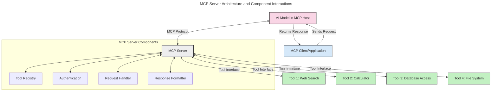
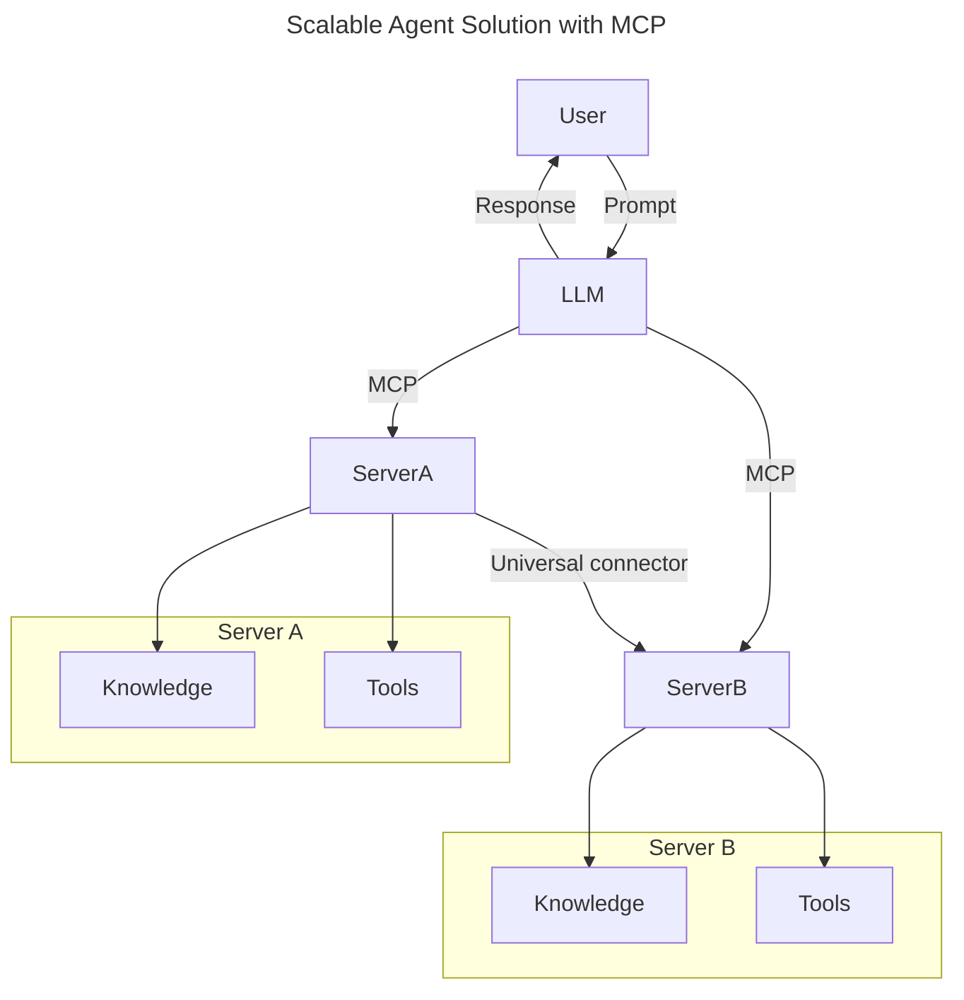
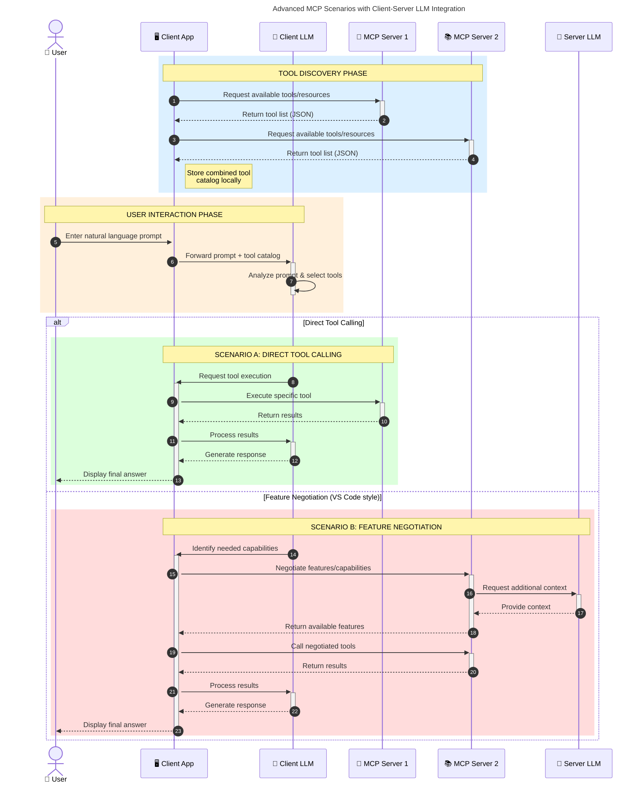

<!--
CO_OP_TRANSLATOR_METADATA:
{
  "original_hash": "105c2ddbb77bc38f7e9df009e1b06e45",
  "translation_date": "2025-07-04T15:48:37+00:00",
  "source_file": "00-Introduction/README.md",
  "language_code": "ur"
}
-->
# ماڈل کانٹیکسٹ پروٹوکول (MCP) کا تعارف: اس کی اہمیت اسکیل ایبل AI ایپلیکیشنز کے لیے

جنریٹو AI ایپلیکیشنز ایک بڑا قدم ہیں کیونکہ یہ اکثر صارف کو قدرتی زبان کے پرامپٹس کے ذریعے ایپ کے ساتھ بات چیت کرنے کی سہولت دیتی ہیں۔ تاہم، جب آپ ایسی ایپس میں زیادہ وقت اور وسائل لگاتے ہیں، تو آپ چاہتے ہیں کہ آپ آسانی سے فنکشنالٹیز اور وسائل کو اس طرح شامل کر سکیں کہ اسے بڑھانا آسان ہو، آپ کی ایپ ایک سے زیادہ ماڈلز کو سپورٹ کر سکے، اور مختلف ماڈل کی پیچیدگیوں کو سنبھال سکے۔ مختصر یہ کہ، جنریٹو AI ایپس بنانا شروع میں آسان ہوتا ہے، لیکن جیسے جیسے وہ بڑھتی اور پیچیدہ ہوتی ہیں، آپ کو ایک آرکیٹیکچر کی وضاحت شروع کرنی پڑتی ہے اور ممکنہ طور پر ایک معیار پر انحصار کرنا پڑتا ہے تاکہ آپ کی ایپس مستقل انداز میں بنیں۔ یہی وہ جگہ ہے جہاں MCP آتا ہے تاکہ چیزوں کو منظم کرے اور ایک معیار فراہم کرے۔

---

## **🔍 ماڈل کانٹیکسٹ پروٹوکول (MCP) کیا ہے؟**

**Model Context Protocol (MCP)** ایک **کھلا، معیاری انٹرفیس** ہے جو بڑے زبان کے ماڈلز (LLMs) کو بیرونی ٹولز، APIs، اور ڈیٹا ذرائع کے ساتھ بغیر کسی رکاوٹ کے بات چیت کرنے کی اجازت دیتا ہے۔ یہ ایک مستقل آرکیٹیکچر فراہم کرتا ہے جو AI ماڈل کی صلاحیتوں کو ان کے تربیتی ڈیٹا سے آگے بڑھاتا ہے، جس سے زیادہ ذہین، اسکیل ایبل، اور زیادہ جوابدہ AI سسٹمز ممکن ہوتے ہیں۔

---

## **🎯 AI میں معیاری بنانے کی اہمیت**

جب جنریٹو AI ایپلیکیشنز زیادہ پیچیدہ ہوتی ہیں، تو ایسے معیارات اپنانا ضروری ہو جاتا ہے جو **اسکیل ایبلٹی، توسیع پذیری**، اور **بحالی** کو یقینی بنائیں۔ MCP ان ضروریات کو پورا کرتا ہے:

- ماڈل-ٹول انٹیگریشن کو متحد کرنا  
- کمزور، ایک بار کے کسٹم حل کو کم کرنا  
- ایک ہی ماحولیاتی نظام میں متعدد ماڈلز کو ساتھ ساتھ چلنے دینا  

---

## **📚 سیکھنے کے مقاصد**

اس مضمون کے آخر تک، آپ کر سکیں گے:

- **Model Context Protocol (MCP)** کی تعریف اور اس کے استعمالات  
- سمجھنا کہ MCP ماڈل سے ٹولز کی بات چیت کو کیسے معیاری بناتا ہے  
- MCP آرکیٹیکچر کے بنیادی اجزاء کی شناخت  
- MCP کے حقیقی دنیا میں کاروباری اور ترقیاتی استعمالات کا جائزہ  

---

## **💡 ماڈل کانٹیکسٹ پروٹوکول (MCP) کیوں ایک گیم چینجر ہے**

### **🔗 MCP AI تعاملات میں ٹوٹ پھوٹ کو حل کرتا ہے**

MCP سے پہلے، ماڈلز کو ٹولز کے ساتھ جوڑنے کے لیے:

- ہر ٹول-ماڈل جوڑی کے لیے کسٹم کوڈ لکھنا پڑتا تھا  
- ہر وینڈر کے لیے غیر معیاری APIs استعمال کرنا پڑتی تھیں  
- اپ ڈیٹس کی وجہ سے بار بار ٹوٹ پھوٹ ہوتی تھی  
- زیادہ ٹولز کے ساتھ اسکیل ایبلٹی کمزور ہوتی تھی  

### **✅ MCP معیاری بنانے کے فوائد**

| **فائدہ**               | **تفصیل**                                                                 |
|-------------------------|---------------------------------------------------------------------------|
| انٹرآپریبلٹی            | LLMs مختلف وینڈرز کے ٹولز کے ساتھ بغیر رکاوٹ کام کرتے ہیں                 |
| مستقل مزاجی             | پلیٹ فارمز اور ٹولز میں یکساں رویہ                                         |
| دوبارہ استعمال          | ایک بار بنائے گئے ٹولز کو مختلف پروجیکٹس اور سسٹمز میں استعمال کیا جا سکتا ہے |
| ترقی کی رفتار میں اضافہ | معیاری، پلگ اینڈ پلے انٹرفیسز کے استعمال سے ترقی کا وقت کم ہوتا ہے          |

---

## **🧱 MCP آرکیٹیکچر کا اعلیٰ سطحی جائزہ**

MCP ایک **کلائنٹ-سرور ماڈل** پر کام کرتا ہے، جہاں:

- **MCP Hosts** AI ماڈلز چلاتے ہیں  
- **MCP Clients** درخواستیں بھیجتے ہیں  
- **MCP Servers** کانٹیکسٹ، ٹولز، اور صلاحیتیں فراہم کرتے ہیں  

### **اہم اجزاء:**

- **Resources** – ماڈلز کے لیے جامد یا متحرک ڈیٹا  
- **Prompts** – رہنمائی کے لیے پہلے سے طے شدہ ورک فلو  
- **Tools** – قابل عمل فنکشنز جیسے سرچ، کیلکولیشنز  
- **Sampling** – ایجنٹک رویہ جو تکراری تعاملات کے ذریعے ہوتا ہے  

---

## MCP سرورز کیسے کام کرتے ہیں

MCP سرورز درج ذیل طریقے سے کام کرتے ہیں:

- **درخواست کا بہاؤ**:  
    1. MCP کلائنٹ AI ماڈل کو جو MCP ہوسٹ میں چل رہا ہوتا ہے، درخواست بھیجتا ہے۔  
    2. AI ماڈل پہچانتا ہے کہ اسے بیرونی ٹولز یا ڈیٹا کی ضرورت ہے۔  
    3. ماڈل معیاری پروٹوکول کے ذریعے MCP سرور سے بات چیت کرتا ہے۔  

- **MCP سرور کی فعالیت**:  
    - ٹول رجسٹری: دستیاب ٹولز اور ان کی صلاحیتوں کا کیٹلاگ رکھتا ہے۔  
    - توثیق: ٹول تک رسائی کے اجازت نامے کی تصدیق کرتا ہے۔  
    - درخواست ہینڈلر: ماڈل سے آنے والی ٹول درخواستوں کو پروسیس کرتا ہے۔  
    - جواب فارمیٹر: ٹول کے نتائج کو ماڈل کے سمجھنے کے قابل فارمیٹ میں ترتیب دیتا ہے۔  

- **ٹول کا نفاذ**:  
    - سرور درخواستوں کو مناسب بیرونی ٹولز کی طرف بھیجتا ہے  
    - ٹولز اپنی مخصوص فنکشنز انجام دیتے ہیں (سرچ، کیلکولیشن، ڈیٹا بیس کی کوئریز وغیرہ)  
    - نتائج ماڈل کو مستقل فارمیٹ میں واپس کیے جاتے ہیں  

- **جواب کی تکمیل**:  
    - AI ماڈل ٹول کے نتائج کو اپنے جواب میں شامل کرتا ہے  
    - حتمی جواب کلائنٹ ایپلیکیشن کو بھیجا جاتا ہے  

## 👨‍💻 MCP سرور کیسے بنائیں (مثالوں کے ساتھ)

MCP سرورز آپ کو LLM کی صلاحیتوں کو بڑھانے کی اجازت دیتے ہیں، ڈیٹا اور فنکشنالٹی فراہم کر کے۔

کیا آپ اسے آزمانا چاہتے ہیں؟ یہاں مختلف زبانوں میں ایک سادہ MCP سرور بنانے کی مثالیں ہیں:

- **Python مثال**: https://github.com/modelcontextprotocol/python-sdk

- **TypeScript مثال**: https://github.com/modelcontextprotocol/typescript-sdk

- **Java مثال**: https://github.com/modelcontextprotocol/java-sdk

- **C#/.NET مثال**: https://github.com/modelcontextprotocol/csharp-sdk

## 🌍 MCP کے حقیقی دنیا میں استعمالات

MCP AI کی صلاحیتوں کو بڑھا کر مختلف قسم کی ایپلیکیشنز کو ممکن بناتا ہے:

| **ایپلیکیشن**               | **تفصیل**                                                                 |
|-----------------------------|---------------------------------------------------------------------------|
| انٹرپرائز ڈیٹا انٹیگریشن    | LLMs کو ڈیٹا بیسز، CRMs، یا اندرونی ٹولز سے جوڑنا                         |
| ایجنٹک AI سسٹمز             | خود مختار ایجنٹس کو ٹولز تک رسائی اور فیصلہ سازی کے ورک فلو فراہم کرنا    |
| ملٹی موڈل ایپلیکیشنز        | ایک ہی متحد AI ایپ میں متن، تصویر، اور آڈیو ٹولز کو یکجا کرنا              |
| حقیقی وقت ڈیٹا انٹیگریشن    | AI تعاملات میں تازہ ترین ڈیٹا شامل کرنا تاکہ زیادہ درست اور موجودہ نتائج ملیں |

### 🧠 MCP = AI تعاملات کے لیے یونیورسل معیار

Model Context Protocol (MCP) AI تعاملات کے لیے ایک یونیورسل معیار کے طور پر کام کرتا ہے، بالکل ویسے جیسے USB-C نے ڈیوائسز کے لیے فزیکل کنکشنز کو معیاری بنایا۔ AI کی دنیا میں، MCP ایک مستقل انٹرفیس فراہم کرتا ہے، جو ماڈلز (کلائنٹس) کو بیرونی ٹولز اور ڈیٹا فراہم کرنے والوں (سرورز) کے ساتھ بغیر کسی رکاوٹ کے جوڑتا ہے۔ اس سے ہر API یا ڈیٹا سورس کے لیے مختلف، کسٹم پروٹوکولز کی ضرورت ختم ہو جاتی ہے۔

MCP کے تحت، ایک MCP-مطابق ٹول (جسے MCP سرور کہا جاتا ہے) ایک متحد معیار کی پیروی کرتا ہے۔ یہ سرورز دستیاب ٹولز یا ایکشنز کی فہرست دے سکتے ہیں اور جب AI ایجنٹ درخواست کرے تو ان ایکشنز کو انجام دیتے ہیں۔ MCP کو سپورٹ کرنے والے AI ایجنٹ پلیٹ فارمز سرورز سے دستیاب ٹولز دریافت کر سکتے ہیں اور انہیں اس معیاری پروٹوکول کے ذریعے کال کر سکتے ہیں۔

### 💡 علم تک رسائی کو آسان بناتا ہے

ٹولز فراہم کرنے کے علاوہ، MCP علم تک رسائی کو بھی آسان بناتا ہے۔ یہ ایپلیکیشنز کو بڑے زبان کے ماڈلز (LLMs) کو مختلف ڈیٹا ذرائع سے جوڑ کر کانٹیکسٹ فراہم کرنے کی اجازت دیتا ہے۔ مثال کے طور پر، ایک MCP سرور کمپنی کے دستاویزات کے ذخیرے کی نمائندگی کر سکتا ہے، جس سے ایجنٹس ضرورت کے مطابق متعلقہ معلومات حاصل کر سکتے ہیں۔ ایک اور سرور مخصوص ایکشنز جیسے ای میل بھیجنا یا ریکارڈز اپ ڈیٹ کرنا سنبھال سکتا ہے۔ ایجنٹ کی نظر میں، یہ صرف ٹولز ہیں جنہیں وہ استعمال کر سکتا ہے—کچھ ٹولز ڈیٹا (علمی کانٹیکسٹ) واپس کرتے ہیں، جبکہ دوسرے ایکشنز انجام دیتے ہیں۔ MCP دونوں کو مؤثر طریقے سے منظم کرتا ہے۔

ایک ایجنٹ جو MCP سرور سے جڑتا ہے، خود بخود سرور کی دستیاب صلاحیتوں اور قابل رسائی ڈیٹا کو ایک معیاری فارمیٹ کے ذریعے سیکھ لیتا ہے۔ یہ معیاری بنانا متحرک ٹول دستیابی کو ممکن بناتا ہے۔ مثال کے طور پر، ایجنٹ کے سسٹم میں نیا MCP سرور شامل کرنے سے اس کے فنکشنز فوراً استعمال کے لیے دستیاب ہو جاتے ہیں بغیر ایجنٹ کی ہدایات میں مزید تخصیص کے۔

یہ آسان انضمام اس فلو کے مطابق ہے جو مرمیڈ ڈایاگرام میں دکھایا گیا ہے، جہاں سرورز ٹولز اور علم دونوں فراہم کرتے ہیں، اور سسٹمز کے درمیان بغیر رکاوٹ تعاون کو یقینی بناتے ہیں۔

### 👉 مثال: اسکیل ایبل ایجنٹ حل

### 🔄 کلائنٹ-سائیڈ LLM انٹیگریشن کے ساتھ جدید MCP منظرنامے

بنیادی MCP آرکیٹیکچر سے آگے، ایسے جدید منظرنامے بھی ہیں جہاں کلائنٹ اور سرور دونوں میں LLMs ہوتے ہیں، جو زیادہ پیچیدہ تعاملات کو ممکن بناتے ہیں:

## 🔐 MCP کے عملی فوائد

MCP استعمال کرنے کے عملی فوائد درج ذیل ہیں:

- **تازگی**: ماڈلز اپنے تربیتی ڈیٹا سے آگے تازہ ترین معلومات تک رسائی حاصل کر سکتے ہیں  
- **صلاحیت میں اضافہ**: ماڈلز ان کاموں کے لیے مخصوص ٹولز استعمال کر سکتے ہیں جن کی تربیت نہیں ہوئی  
- **غلط فہمیوں میں کمی**: بیرونی ڈیٹا ذرائع حقائق کی بنیاد فراہم کرتے ہیں  
- **پرائیویسی**: حساس ڈیٹا محفوظ ماحول میں رہ سکتا ہے بجائے اس کے کہ پرامپٹس میں شامل ہو  

## 📌 اہم نکات

MCP استعمال کرنے کے لیے اہم نکات:

- **MCP** AI ماڈلز کے ٹولز اور ڈیٹا کے ساتھ تعامل کو معیاری بناتا ہے  
- **توسیع پذیری، مستقل مزاجی، اور انٹرآپریبلٹی** کو فروغ دیتا ہے  
- MCP ترقی کے وقت کو کم کرنے، اعتبار کو بہتر بنانے، اور ماڈل کی صلاحیتوں کو بڑھانے میں مدد دیتا ہے  
- کلائنٹ-سرور آرکیٹیکچر لچکدار، توسیع پذیر AI ایپلیکیشنز کو ممکن بناتا ہے  

## 🧠 مشق

کسی AI ایپلیکیشن کے بارے میں سوچیں جسے آپ بنانا چاہتے ہیں۔

- کون سے **بیرونی ٹولز یا ڈیٹا** اس کی صلاحیتوں کو بڑھا سکتے ہیں؟  
- MCP انضمام کو کیسے **آسان اور زیادہ قابل اعتماد** بنا سکتا ہے؟  

## اضافی وسائل

- [MCP GitHub Repository](https://github.com/modelcontextprotocol)

## اگلا کیا ہے

اگلا: [باب 1: بنیادی تصورات](../01-CoreConcepts/README.md)

**دستخطی نوٹ**:  
یہ دستاویز AI ترجمہ سروس [Co-op Translator](https://github.com/Azure/co-op-translator) کے ذریعے ترجمہ کی گئی ہے۔ اگرچہ ہم درستگی کے لیے کوشاں ہیں، براہ کرم آگاہ رہیں کہ خودکار ترجمے میں غلطیاں یا عدم درستیاں ہو سکتی ہیں۔ اصل دستاویز اپنی مادری زبان میں معتبر ماخذ سمجھی جانی چاہیے۔ اہم معلومات کے لیے پیشہ ور انسانی ترجمہ کی سفارش کی جاتی ہے۔ اس ترجمے کے استعمال سے پیدا ہونے والی کسی بھی غلط فہمی یا غلط تشریح کی ذمہ داری ہم پر عائد نہیں ہوتی۔