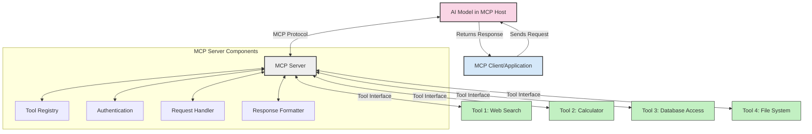
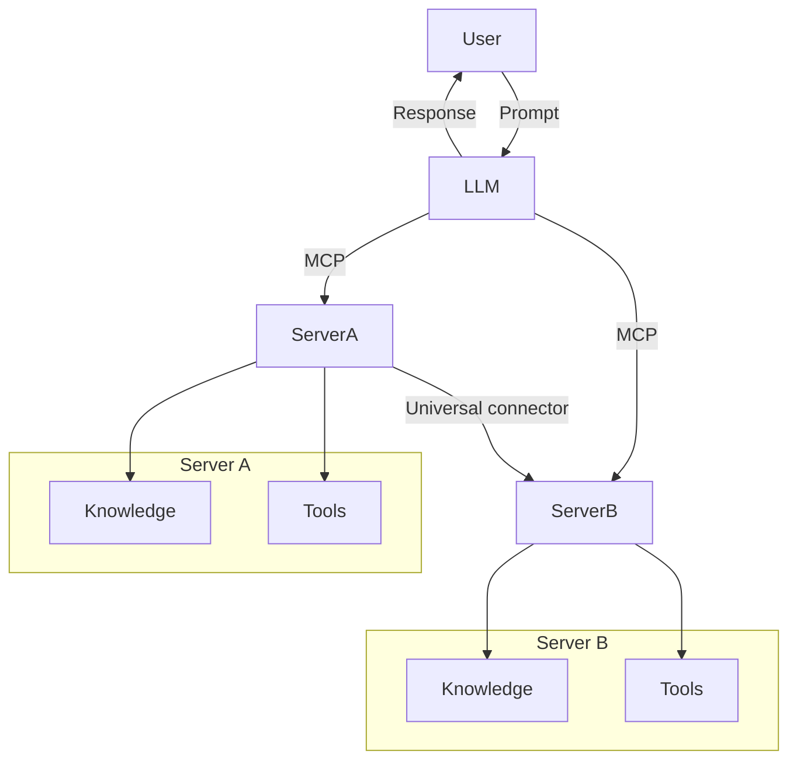
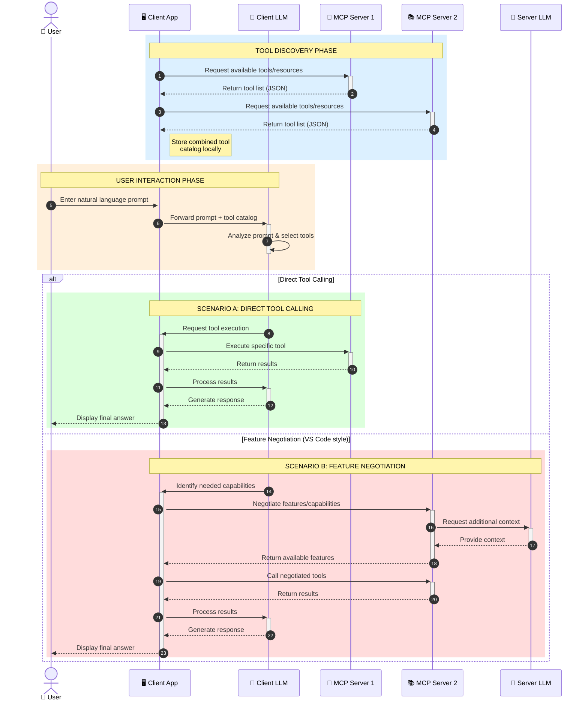

<!--
CO_OP_TRANSLATOR_METADATA:
{
  "original_hash": "25a94c681cf43612ff394d8cf78a74de",
  "translation_date": "2025-05-27T15:56:10+00:00",
  "source_file": "00-Introduction/README.md",
  "language_code": "ur"
}
-->
# تعارف برائے Model Context Protocol (MCP): کیوں یہ Scalable AI Applications کے لیے اہم ہے

Generative AI applications ایک بڑا قدم ہیں کیونکہ یہ اکثر صارف کو قدرتی زبان کے اشاروں کے ذریعے ایپ کے ساتھ بات چیت کرنے دیتے ہیں۔ تاہم، جیسے جیسے ان ایپس میں وقت اور وسائل زیادہ لگائے جاتے ہیں، آپ یہ یقینی بنانا چاہتے ہیں کہ آپ آسانی سے فنکشنالٹیز اور وسائل کو اس طرح شامل کر سکیں کہ اسے بڑھانا آسان ہو، آپ کی ایپ ایک سے زیادہ ماڈلز کو سنبھال سکے، اور مختلف ماڈل کی پیچیدگیوں کو ہینڈل کر سکے۔ مختصراً، Gen AI ایپس بنانا شروع میں آسان ہے، لیکن جیسے جیسے وہ بڑھتی ہیں اور پیچیدہ ہوتی ہیں، آپ کو ایک آرکیٹیکچر کی تعریف شروع کرنی پڑتی ہے اور ممکنہ طور پر ایک معیار پر انحصار کرنا پڑتا ہے تاکہ آپ کی ایپس مستقل انداز میں بنیں۔ یہاں MCP کام آتا ہے تاکہ چیزوں کو منظم کرے اور ایک معیار فراہم کرے۔

---

## **🔍 Model Context Protocol (MCP) کیا ہے؟**

**Model Context Protocol (MCP)** ایک **کھلا، معیاری انٹرفیس** ہے جو Large Language Models (LLMs) کو بیرونی ٹولز، APIs، اور ڈیٹا ذرائع کے ساتھ بغیر کسی رکاوٹ کے بات چیت کرنے کی اجازت دیتا ہے۔ یہ ایک مستقل آرکیٹیکچر فراہم کرتا ہے تاکہ AI ماڈل کی صلاحیتوں کو ان کے تربیتی ڈیٹا سے آگے بڑھایا جا سکے، جس سے زیادہ ذہین، قابل توسیع، اور زیادہ جوابدہ AI سسٹمز ممکن ہوتے ہیں۔

---

## **🎯 AI میں معیاری بنانے کی اہمیت کیوں ہے**

جب generative AI applications زیادہ پیچیدہ ہوتی ہیں، تو یہ ضروری ہو جاتا ہے کہ ایسے معیارات اپنائے جائیں جو **scalability، extensibility**، اور **maintainability** کو یقینی بنائیں۔ MCP ان ضروریات کو درج ذیل طریقوں سے پورا کرتا ہے:

- ماڈل-ٹول انٹیگریشن کو متحد کرنا  
- کمزور، منفرد کسٹم حل کو کم کرنا  
- ایک ہی ماحولیاتی نظام میں متعدد ماڈلز کو ایک ساتھ چلنے دینا  

---

## **📚 سیکھنے کے مقاصد**

اس آرٹیکل کے آخر تک، آپ کر سکیں گے:

- **Model Context Protocol (MCP)** اور اس کے استعمالات کی تعریف کرنا  
- سمجھنا کہ MCP ماڈل سے ٹول کے درمیان بات چیت کو کیسے معیاری بناتا ہے  
- MCP آرکیٹیکچر کے بنیادی اجزاء کی شناخت کرنا  
- MCP کے حقیقی دنیا میں کاروباری اور ترقیاتی سیاق و سباق میں استعمال کا جائزہ لینا  

---

## **💡 Model Context Protocol (MCP) کیوں ایک گیم چینجر ہے**

### **🔗 MCP AI تعاملات میں ٹوٹ پھوٹ کو حل کرتا ہے**

MCP سے پہلے، ماڈلز کو ٹولز کے ساتھ جوڑنے کے لیے ضروری تھا:

- ہر ٹول-ماڈل جوڑی کے لیے کسٹم کوڈ  
- ہر وینڈر کے لیے غیر معیاری APIs  
- اپڈیٹس کی وجہ سے بار بار رکاوٹیں  
- زیادہ ٹولز کے ساتھ ناقابل برداشت scalability  

### **✅ MCP معیاری بنانے کے فوائد**

| **فائدہ**                  | **تفصیل**                                                                     |
|----------------------------|-------------------------------------------------------------------------------|
| Interoperability           | LLMs مختلف وینڈرز کے ٹولز کے ساتھ بغیر کسی رکاوٹ کے کام کرتے ہیں              |
| Consistency                | پلیٹ فارمز اور ٹولز میں یکساں رویہ                                           |
| Reusability                | ایک بار بنائے گئے ٹولز کو مختلف پروجیکٹس اور سسٹمز میں استعمال کیا جا سکتا ہے |
| Accelerated Development    | معیاری، plug-and-play انٹرفیسز کے ذریعے ترقی کا وقت کم کرنا                    |

---

## **🧱 MCP آرکیٹیکچر کا اعلی سطحی جائزہ**

MCP ایک **کلائنٹ-سرور ماڈل** پر مبنی ہے، جہاں:

- **MCP Hosts** AI ماڈلز چلاتے ہیں  
- **MCP Clients** درخواستیں شروع کرتے ہیں  
- **MCP Servers** کانٹیکسٹ، ٹولز، اور صلاحیتیں فراہم کرتے ہیں  

### **اہم اجزاء:**

- **Resources** – ماڈلز کے لیے جامد یا متحرک ڈیٹا  
- **Prompts** – رہنمائی کے لیے پہلے سے طے شدہ ورک فلو  
- **Tools** – قابل عمل فنکشنز جیسے سرچ، حساب کتاب  
- **Sampling** – recursive تعاملات کے ذریعے ایجنٹک رویہ  

---

## MCP Servers کیسے کام کرتے ہیں

MCP سرورز درج ذیل طریقے سے کام کرتے ہیں:

- **درخواست کا بہاؤ**:  
    1. MCP Client ایک درخواست MCP Host میں چلنے والے AI Model کو بھیجتا ہے۔  
    2. AI Model شناخت کرتا ہے کہ کب اسے بیرونی ٹولز یا ڈیٹا کی ضرورت ہے۔  
    3. ماڈل معیاری پروٹوکول کا استعمال کرتے ہوئے MCP Server کے ساتھ بات چیت کرتا ہے۔  

- **MCP Server کی فعالیت**:  
    - Tool Registry: دستیاب ٹولز اور ان کی صلاحیتوں کا کیٹلاگ رکھتا ہے۔  
    - Authentication: ٹول تک رسائی کی اجازتوں کی تصدیق کرتا ہے۔  
    - Request Handler: ماڈل سے آنے والی ٹول درخواستوں کو پروسیس کرتا ہے۔  
    - Response Formatter: ٹول کے نتائج کو ماڈل کے سمجھنے کے قابل فارمیٹ میں ترتیب دیتا ہے۔  

- **ٹول کا نفاذ**:  
    - سرور درخواستوں کو مناسب بیرونی ٹولز کی طرف بھیجتا ہے  
    - ٹولز اپنے مخصوص فنکشنز انجام دیتے ہیں (سرچ، حساب، ڈیٹا بیس کی کوئریز وغیرہ)  
    - نتائج ماڈل کو مستقل فارمیٹ میں واپس کیے جاتے ہیں۔  

- **ردعمل کی تکمیل**:  
    - AI ماڈل ٹول کے نتائج کو اپنے جواب میں شامل کرتا ہے۔  
    - حتمی جواب کلائنٹ ایپلیکیشن کو بھیجا جاتا ہے۔  

## 👨‍💻 MCP سرور کیسے بنائیں (مثالوں کے ساتھ)

MCP سرورز آپ کو LLM صلاحیتوں کو بڑھانے کی اجازت دیتے ہیں، ڈیٹا اور فنکشنالٹی فراہم کرتے ہیں۔

آزمائش کے لیے تیار ہیں؟ یہاں مختلف زبانوں میں ایک سادہ MCP سرور بنانے کی مثالیں ہیں:

- **Python Example**: https://github.com/modelcontextprotocol/python-sdk

- **TypeScript Example**: https://github.com/modelcontextprotocol/typescript-sdk

- **Java Example**: https://github.com/modelcontextprotocol/java-sdk

- **C#/.NET Example**: https://github.com/modelcontextprotocol/csharp-sdk

## 🌍 MCP کے حقیقی دنیا کے استعمالات

MCP AI صلاحیتوں کو بڑھا کر مختلف قسم کی ایپلیکیشنز کو ممکن بناتا ہے:

| **ایپلیکیشن**                | **تفصیل**                                                                     |
|------------------------------|-------------------------------------------------------------------------------|
| Enterprise Data Integration  | LLMs کو ڈیٹا بیسز، CRMs، یا اندرونی ٹولز سے جوڑنا                             |
| Agentic AI Systems           | خود مختار ایجنٹس کو ٹول تک رسائی اور فیصلہ سازی کے ورک فلو فراہم کرنا          |
| Multi-modal Applications     | ایک متحد AI ایپ میں متن، تصویر، اور آڈیو ٹولز کو یکجا کرنا                      |
| Real-time Data Integration   | AI تعاملات میں تازہ ترین ڈیٹا لانا تاکہ زیادہ درست اور موجودہ نتائج ملیں      |

### 🧠 MCP = AI تعاملات کے لیے یونیورسل معیار

Model Context Protocol (MCP) AI تعاملات کے لیے ایک یونیورسل معیار کے طور پر کام کرتا ہے، بالکل اسی طرح جیسے USB-C نے ڈیوائسز کے لیے فزیکل کنکشنز کو معیاری بنایا۔ AI کی دنیا میں، MCP ایک مستقل انٹرفیس فراہم کرتا ہے، جو ماڈلز (کلائنٹس) کو بیرونی ٹولز اور ڈیٹا فراہم کنندگان (سرورز) کے ساتھ بغیر رکاوٹ جوڑنے دیتا ہے۔ اس سے ہر API یا ڈیٹا سورس کے لیے مختلف، کسٹم پروٹوکولز کی ضرورت ختم ہو جاتی ہے۔

MCP کے تحت، ایک MCP-مطابق ٹول (جسے MCP سرور کہا جاتا ہے) ایک متحد معیار کی پیروی کرتا ہے۔ یہ سرورز دستیاب ٹولز یا ایکشنز کی فہرست دے سکتے ہیں اور AI ایجنٹ کی درخواست پر ان ایکشنز کو انجام دیتے ہیں۔ MCP کو سپورٹ کرنے والے AI ایجنٹ پلیٹ فارمز سرورز سے دستیاب ٹولز دریافت کر سکتے ہیں اور اس معیاری پروٹوکول کے ذریعے انہیں کال کر سکتے ہیں۔

### 💡 علم تک رسائی آسان بنانا

ٹولز فراہم کرنے کے علاوہ، MCP علم تک رسائی کو بھی آسان بناتا ہے۔ یہ ایپلیکیشنز کو بڑے زبان ماڈلز (LLMs) کو مختلف ڈیٹا ذرائع سے منسلک کر کے کانٹیکسٹ فراہم کرنے کے قابل بناتا ہے۔ مثال کے طور پر، ایک MCP سرور کسی کمپنی کے دستاویزی ذخیرے کی نمائندگی کر سکتا ہے، جس سے ایجنٹس متعلقہ معلومات ضرورت پر حاصل کر سکتے ہیں۔ ایک اور سرور مخصوص ایکشنز جیسے ای میل بھیجنا یا ریکارڈز اپ ڈیٹ کرنا سنبھال سکتا ہے۔ ایجنٹ کی نظر میں، یہ صرف ٹولز ہیں جنہیں وہ استعمال کر سکتا ہے—کچھ ٹولز ڈیٹا (علمی کانٹیکسٹ) واپس کرتے ہیں، جبکہ دوسرے ایکشنز انجام دیتے ہیں۔ MCP دونوں کو مؤثر طریقے سے منظم کرتا ہے۔

ایک ایجنٹ جو MCP سرور سے جڑتا ہے، خود بخود سرور کی دستیاب صلاحیتوں اور قابل رسائی ڈیٹا کو معیاری فارمیٹ کے ذریعے سیکھ لیتا ہے۔ یہ معیاری بنانا متحرک ٹول دستیابی کو ممکن بناتا ہے۔ مثال کے طور پر، ایجنٹ کے سسٹم میں نیا MCP سرور شامل کرنا اس کے فنکشنز کو فوراً قابل استعمال بنا دیتا ہے بغیر ایجنٹ کی ہدایات میں مزید تخصیص کے۔

یہ مربوط نظام mermaid ڈایاگرام میں دکھائے گئے بہاؤ کے مطابق ہے، جہاں سرورز دونوں ٹولز اور علم فراہم کرتے ہیں، جو سسٹمز کے درمیان بغیر رکاوٹ تعاون کو یقینی بناتا ہے۔

### 👉 مثال: Scalable Agent Solution

### 🔄 کلائنٹ سائیڈ LLM انٹیگریشن کے ساتھ اعلی درجے کے MCP مناظر

بنیادی MCP آرکیٹیکچر سے آگے، ایسے اعلی درجے کے مناظر ہیں جہاں کلائنٹ اور سرور دونوں میں LLMs ہوتے ہیں، جو زیادہ پیچیدہ تعاملات کو ممکن بناتے ہیں:

## 🔐 MCP کے عملی فوائد

MCP استعمال کرنے کے عملی فوائد درج ذیل ہیں:

- **تازگی**: ماڈلز اپنی تربیت کے ڈیٹا سے آگے تازہ ترین معلومات تک رسائی حاصل کر سکتے ہیں  
- **صلاحیتوں میں توسیع**: ماڈلز مخصوص ٹاسکس کے لیے خصوصی ٹولز استعمال کر سکتے ہیں جن کی تربیت نہیں ہوئی  
- **ہیلوسینیشنز میں کمی**: بیرونی ڈیٹا ذرائع حقیقی معلومات فراہم کرتے ہیں  
- **پرائیویسی**: حساس ڈیٹا محفوظ ماحول میں رہ سکتا ہے بجائے کہ پرامپٹس میں شامل ہو  

## 📌 اہم نکات

MCP استعمال کرنے کے اہم نکات یہ ہیں:

- **MCP** AI ماڈلز کے ٹولز اور ڈیٹا کے ساتھ تعامل کو معیاری بناتا ہے  
- **extensibility, consistency, اور interoperability** کو فروغ دیتا ہے  
- MCP ترقیاتی وقت کو کم کرنے، اعتبار کو بہتر بنانے، اور ماڈل کی صلاحیتوں کو بڑھانے میں مدد کرتا ہے  
- کلائنٹ-سرور آرکیٹیکچر لچکدار، قابل توسیع AI ایپلیکیشنز کو ممکن بناتا ہے  

## 🧠 مشق

اس AI ایپلیکیشن کے بارے میں سوچیں جسے آپ بنانا چاہتے ہیں۔

- کون سے **بیرونی ٹولز یا ڈیٹا** اس کی صلاحیتوں کو بڑھا سکتے ہیں؟  
- MCP انضمام کو کیسے **سادہ اور زیادہ قابل اعتماد** بنا سکتا ہے؟  

## اضافی وسائل

- [MCP GitHub Repository](https://github.com/modelcontextprotocol)

## اگلا کیا ہے

اگلا: [Chapter 1: Core Concepts](/01-CoreConcepts/README.md)

**ڈسکلیمر**:  
اس دستاویز کا ترجمہ AI ترجمہ سروس [Co-op Translator](https://github.com/Azure/co-op-translator) کے ذریعے کیا گیا ہے۔ اگرچہ ہم درستگی کے لیے کوشاں ہیں، براہ کرم آگاہ رہیں کہ خودکار ترجمے میں غلطیاں یا نقائص ہو سکتے ہیں۔ اصل دستاویز اپنی مادری زبان میں ہی معتبر ماخذ سمجھی جانی چاہیے۔ اہم معلومات کے لیے پیشہ ور انسانی ترجمہ کی سفارش کی جاتی ہے۔ ہم اس ترجمے کے استعمال سے پیدا ہونے والی کسی بھی غلط فہمی یا غلط تشریح کے ذمہ دار نہیں ہیں۔