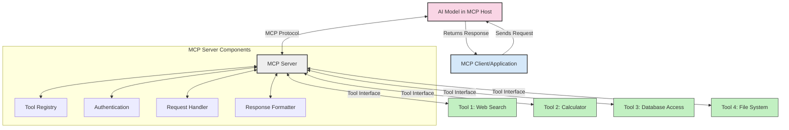
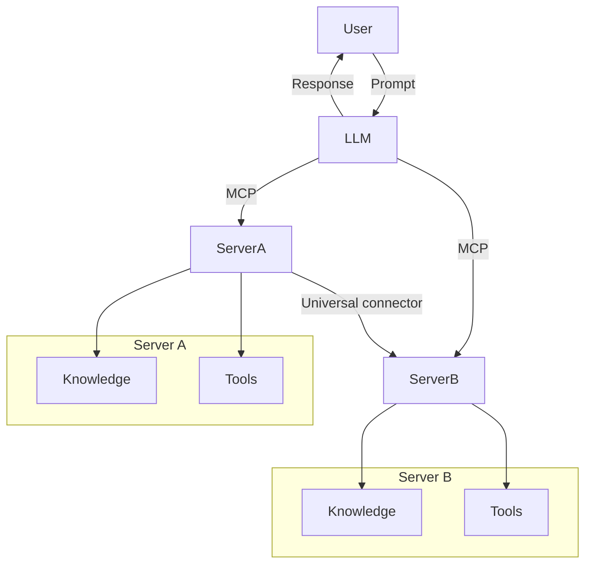

<!--
CO_OP_TRANSLATOR_METADATA:
{
  "original_hash": "cf84f987e1b771d2201408e110dfd2db",
  "translation_date": "2025-05-20T15:54:42+00:00",
  "source_file": "00-Introduction/README.md",
  "language_code": "ur"
}
-->
# تعارف برائے Model Context Protocol (MCP): اسکیل ایبل AI ایپلیکیشنز کے لیے کیوں اہم ہے

جنریٹو AI ایپلیکیشنز ایک بڑا قدم ہیں کیونکہ یہ اکثر صارف کو قدرتی زبان کے پرامپٹس کے ذریعے ایپ سے بات چیت کرنے دیتے ہیں۔ تاہم، جیسے جیسے اس طرح کی ایپس میں وقت اور وسائل زیادہ لگتے ہیں، آپ یہ یقینی بنانا چاہتے ہیں کہ آپ فنکشنالٹیز اور وسائل کو اس طرح آسانی سے مربوط کر سکیں کہ اسے بڑھانا آسان ہو، آپ کی ایپ ایک سے زیادہ ماڈلز اور ان کی پیچیدگیوں کو سنبھال سکے۔ مختصراً، جن AI ایپس بنانا شروع میں آسان ہے، لیکن جیسے جیسے یہ بڑھتی ہیں اور پیچیدہ ہوتی ہیں، آپ کو ایک آرکیٹیکچر کی وضاحت شروع کرنی پڑتی ہے اور ممکنہ طور پر ایک معیار پر انحصار کرنا پڑتا ہے تاکہ آپ کی ایپس مستقل طریقے سے بن سکیں۔ یہاں MCP آتا ہے تاکہ چیزوں کو منظم کرے، ایک معیار فراہم کرے۔

---

## **🔍 Model Context Protocol (MCP) کیا ہے؟**

**Model Context Protocol (MCP)** ایک **کھلا، معیاری انٹرفیس** ہے جو بڑے زبان ماڈلز (LLMs) کو بیرونی ٹولز، APIs، اور ڈیٹا ذرائع کے ساتھ بغیر کسی رکاوٹ کے بات چیت کرنے کی اجازت دیتا ہے۔ یہ ایک مستقل آرکیٹیکچر فراہم کرتا ہے تاکہ AI ماڈل کی صلاحیتوں کو ان کے تربیتی ڈیٹا سے آگے بڑھایا جا سکے، جس سے زیادہ ذہین، اسکیل ایبل، اور زیادہ ردعمل دینے والے AI سسٹمز ممکن ہوتے ہیں۔

---

## **🎯 AI میں معیاری بنانے کی اہمیت**

جب جنریٹو AI ایپلیکیشنز زیادہ پیچیدہ ہو جاتی ہیں، تو ایسے معیارات اپنانا ضروری ہو جاتا ہے جو **اسکیل ایبلٹی، توسیع پذیری**، اور **مینٹینیبلٹی** کو یقینی بنائیں۔ MCP ان ضروریات کو درج ذیل طریقوں سے پورا کرتا ہے:

- ماڈل اور ٹولز کے انضمام کو یکجا کرنا  
- کمزور، ایک بار کے لیے مخصوص حل کو کم کرنا  
- ایک ہی ماحولیاتی نظام میں متعدد ماڈلز کو ساتھ ساتھ چلانے کی اجازت دینا  

---

## **📚 سیکھنے کے مقاصد**

اس آرٹیکل کے آخر تک آپ قادر ہوں گے کہ:

- **Model Context Protocol (MCP)** کی تعریف اور اس کے استعمالات بیان کریں  
- MCP کے ذریعے ماڈل سے ٹول تک بات چیت کو سمجھیں  
- MCP آرکیٹیکچر کے بنیادی اجزاء کی نشاندہی کریں  
- MCP کے حقیقی دنیا میں کاروباری اور ترقیاتی استعمالات کو دریافت کریں  

---

## **💡 Model Context Protocol (MCP) کیوں ایک گیم چینجر ہے**

### **🔗 MCP AI تعاملات میں ٹوٹ پھوٹ کو حل کرتا ہے**

MCP سے پہلے، ماڈلز کو ٹولز کے ساتھ جوڑنے کے لیے درج ذیل درکار تھے:

- ہر ٹول-ماڈل جوڑے کے لیے مخصوص کوڈ  
- ہر فروشندہ کے لیے غیر معیاری APIs  
- اپ ڈیٹس کی وجہ سے بار بار ٹوٹ پھوٹ  
- زیادہ ٹولز کے ساتھ کمزور اسکیل ایبلٹی  

### **✅ MCP معیاری بنانے کے فوائد**

| **فائدہ**               | **تفصیل**                                                                    |
|-------------------------|-------------------------------------------------------------------------------|
| انٹرآپریبلٹی            | LLMs مختلف فروشندہ کے ٹولز کے ساتھ بغیر رکاوٹ کام کرتے ہیں                   |
| مستقل مزاجی             | پلیٹ فارمز اور ٹولز میں یکساں رویہ                                              |
| دوبارہ استعمال          | ایک بار بنائے گئے ٹولز کو مختلف پروجیکٹس اور سسٹمز میں استعمال کیا جا سکتا ہے  |
| تیز رفتار ترقی          | معیاری، پلگ اینڈ پلے انٹرفیسز کے استعمال سے ترقی کا وقت کم کریں               |

---

## **🧱 MCP کا اعلی سطحی آرکیٹیکچر جائزہ**

MCP ایک **کلائنٹ-سرور ماڈل** پر عمل کرتا ہے، جہاں:

- **MCP Hosts** AI ماڈلز کو چلاتے ہیں  
- **MCP Clients** درخواستیں شروع کرتے ہیں  
- **MCP Servers** کانٹیکسٹ، ٹولز، اور صلاحیتیں فراہم کرتے ہیں  

### **اہم اجزاء:**

- **Resources** – ماڈلز کے لیے جامد یا متحرک ڈیٹا  
- **Prompts** – رہنمائی کے لیے پہلے سے طے شدہ ورک فلو  
- **Tools** – قابل عمل فنکشنز جیسے تلاش، حساب کتاب  
- **Sampling** – recursive تعاملات کے ذریعے ایجنٹک رویہ  

---

## MCP Servers کیسے کام کرتے ہیں

MCP سرور درج ذیل طریقے سے کام کرتے ہیں:

- **درخواست کا بہاؤ**:  
    1. MCP Client ایک درخواست بھیجتا ہے AI ماڈل کو جو MCP Host میں چل رہا ہوتا ہے۔  
    2. AI ماڈل شناخت کرتا ہے جب اسے بیرونی ٹولز یا ڈیٹا کی ضرورت ہوتی ہے۔  
    3. ماڈل MCP Server کے ساتھ معیاری پروٹوکول استعمال کرتے ہوئے بات چیت کرتا ہے۔  

- **MCP Server کی فعالیت**:  
    - ٹول رجسٹری: دستیاب ٹولز اور ان کی صلاحیتوں کا کیٹلاگ رکھتا ہے۔  
    - توثیق: ٹول تک رسائی کے اجازت نامے کی تصدیق کرتا ہے۔  
    - درخواست ہینڈلر: ماڈل سے آنے والی ٹول درخواستوں کو پروسیس کرتا ہے۔  
    - جواب فارمیٹر: ٹول آؤٹ پٹ کو اس فارمیٹ میں ترتیب دیتا ہے جو ماڈل سمجھ سکے۔  

- **ٹول کا نفاذ**:  
    - سرور درخواستوں کو مناسب بیرونی ٹولز کی طرف بھیجتا ہے  
    - ٹولز اپنی مخصوص فنکشنز (تلاش، حساب، ڈیٹا بیس سوالات وغیرہ) انجام دیتے ہیں  
    - نتائج ماڈل کو مستقل فارمیٹ میں واپس کیے جاتے ہیں  

- **جواب کی تکمیل**:  
    - AI ماڈل ٹول آؤٹ پٹ کو اپنے جواب میں شامل کرتا ہے  
    - حتمی جواب کلائنٹ ایپلیکیشن کو بھیج دیا جاتا ہے  

## 👨‍💻 MCP سرور کیسے بنائیں (مثالوں کے ساتھ)

MCP سرورز آپ کو LLM صلاحیتوں کو ڈیٹا اور فنکشنالٹی فراہم کرکے بڑھانے کی اجازت دیتے ہیں۔

آزمائیں؟ یہاں مختلف زبانوں میں ایک سادہ MCP سرور بنانے کی مثالیں ہیں:

- **Python مثال**: https://github.com/modelcontextprotocol/python-sdk

- **TypeScript مثال**: https://github.com/modelcontextprotocol/typescript-sdk

- **Java مثال**: https://github.com/modelcontextprotocol/java-sdk

- **C#/.NET مثال**: https://github.com/modelcontextprotocol/csharp-sdk

## 🌍 MCP کے حقیقی دنیا کے استعمالات

MCP AI صلاحیتوں کو بڑھا کر وسیع قسم کی ایپلیکیشنز کو ممکن بناتا ہے:

| **ایپلیکیشن**             | **تفصیل**                                                                    |
|----------------------------|-------------------------------------------------------------------------------|
| انٹرپرائز ڈیٹا انٹیگریشن    | LLMs کو ڈیٹا بیسز، CRMs، یا اندرونی ٹولز سے جوڑنا                            |
| ایجنٹک AI سسٹمز             | خود مختار ایجنٹس کو ٹول تک رسائی اور فیصلہ سازی کے ورک فلو فراہم کرنا        |
| ملٹی موڈل ایپلیکیشنز         | متن، تصویر، اور آڈیو ٹولز کو ایک متحد AI ایپ میں جوڑنا                      |
| حقیقی وقت ڈیٹا انٹیگریشن     | AI تعاملات میں تازہ ترین ڈیٹا شامل کرنا تاکہ زیادہ درست اور موجودہ نتائج ملیں |

### 🧠 MCP = AI تعاملات کے لیے یونیورسل معیار

Model Context Protocol (MCP) AI تعاملات کے لیے ایک یونیورسل معیار کے طور پر کام کرتا ہے، بالکل جیسے USB-C نے آلات کے لیے فزیکل کنکشنز کو معیاری بنایا۔ AI کی دنیا میں، MCP ایک مستقل انٹرفیس فراہم کرتا ہے، جو ماڈلز (کلائنٹس) کو بیرونی ٹولز اور ڈیٹا فراہم کرنے والوں (سرورز) کے ساتھ بغیر رکاوٹ انضمام کی اجازت دیتا ہے۔ اس سے ہر API یا ڈیٹا سورس کے لیے مختلف، مخصوص پروٹوکولز کی ضرورت ختم ہو جاتی ہے۔

MCP کے تحت، ایک MCP-مطابق ٹول (جسے MCP سرور کہا جاتا ہے) ایک متحد معیار پر عمل کرتا ہے۔ یہ سرورز دستیاب ٹولز یا اعمال کی فہرست دے سکتے ہیں اور جب AI ایجنٹ درخواست کرے تو وہ اعمال انجام دیتے ہیں۔ MCP کو سپورٹ کرنے والے AI ایجنٹ پلیٹ فارمز سرورز سے دستیاب ٹولز دریافت کر سکتے ہیں اور انہیں اس معیاری پروٹوکول کے ذریعے کال کر سکتے ہیں۔

### 💡 علم تک رسائی کو آسان بناتا ہے

ٹولز پیش کرنے کے علاوہ، MCP علم تک رسائی کو بھی آسان بناتا ہے۔ یہ ایپلیکیشنز کو بڑے زبان ماڈلز (LLMs) کو مختلف ڈیٹا ذرائع سے منسلک کر کے کانٹیکسٹ فراہم کرنے کی اجازت دیتا ہے۔ مثال کے طور پر، ایک MCP سرور کمپنی کے دستاویزات کے ذخیرے کی نمائندگی کر سکتا ہے، جس سے ایجنٹس متعلقہ معلومات طلب کر سکتے ہیں۔ ایک اور سرور مخصوص اعمال جیسے ای میل بھیجنا یا ریکارڈز اپ ڈیٹ کرنا سنبھال سکتا ہے۔ ایجنٹ کی نظر میں، یہ صرف ٹولز ہیں جنہیں وہ استعمال کر سکتا ہے—کچھ ٹولز ڈیٹا (علمی کانٹیکسٹ) واپس کرتے ہیں، جبکہ دوسرے اعمال انجام دیتے ہیں۔ MCP دونوں کو مؤثر طریقے سے سنبھالتا ہے۔

ایک ایجنٹ جو MCP سرور سے جڑتا ہے، سرور کی دستیاب صلاحیتوں اور قابل رسائی ڈیٹا کو معیاری فارمیٹ کے ذریعے خود بخود سیکھ لیتا ہے۔ یہ معیاری بنانے سے ٹول کی متحرک دستیابی ممکن ہوتی ہے۔ مثال کے طور پر، ایک نیا MCP سرور ایجنٹ کے سسٹم میں شامل کرنے سے اس کے فنکشنز فوراً استعمال کے قابل ہو جاتے ہیں بغیر ایجنٹ کی ہدایات میں مزید تخصیص کے۔

یہ ہموار انضمام اس فلو کے مطابق ہے جو مرمیڈ ڈایاگرام میں دکھایا گیا ہے، جہاں سرورز دونوں ٹولز اور علم فراہم کرتے ہیں، اور سسٹمز کے درمیان بغیر رکاوٹ تعاون کو یقینی بناتے ہیں۔

### 👉 مثال: اسکیل ایبل ایجنٹ حل

## 🔐 MCP کے عملی فوائد

MCP استعمال کرنے کے عملی فوائد یہ ہیں:

- **تازگی**: ماڈلز اپنے تربیتی ڈیٹا سے آگے تازہ ترین معلومات تک رسائی حاصل کر سکتے ہیں  
- **صلاحیت کی توسیع**: ماڈلز ایسے مخصوص ٹولز استعمال کر سکتے ہیں جن کے لیے انہیں تربیت نہیں دی گئی  
- **خیالی جوابات کی کمی**: بیرونی ڈیٹا ذرائع حقیقت پر مبنی معلومات فراہم کرتے ہیں  
- **پرائیویسی**: حساس ڈیٹا محفوظ ماحول میں رہ سکتا ہے بجائے اس کے کہ پرامپٹس میں شامل کیا جائے  

## 📌 اہم نکات

MCP استعمال کرنے کے لیے اہم نکات یہ ہیں:

- **MCP** AI ماڈلز کے ٹولز اور ڈیٹا کے ساتھ تعامل کو معیاری بناتا ہے  
- توسیع پذیری، مستقل مزاجی، اور انٹرآپریبلٹی کو فروغ دیتا ہے  
- MCP ترقی کے وقت کو کم کرنے، اعتبار کو بہتر بنانے، اور ماڈل کی صلاحیتوں کو بڑھانے میں مدد دیتا ہے  
- کلائنٹ-سرور آرکیٹیکچر لچکدار، توسیع پذیر AI ایپلیکیشنز کو ممکن بناتا ہے  

## 🧠 مشق

اس AI ایپلیکیشن کے بارے میں سوچیں جسے آپ بنانا چاہتے ہیں۔

- کون سے **بیرونی ٹولز یا ڈیٹا** اس کی صلاحیتوں کو بڑھا سکتے ہیں؟  
- MCP انضمام کو **آسان اور زیادہ قابل اعتماد** کیسے بنا سکتا ہے؟  

## اضافی وسائل

- [MCP GitHub Repository](https://github.com/modelcontextprotocol)

## اگلا کیا ہے

اگلا: [باب 1: بنیادی تصورات](/01-CoreConcepts/README.md)

**دستبرداری**:  
یہ دستاویز AI ترجمہ سروس [Co-op Translator](https://github.com/Azure/co-op-translator) کا استعمال کرتے ہوئے ترجمہ کی گئی ہے۔ اگرچہ ہم درستگی کے لیے کوشاں ہیں، براہ کرم آگاہ رہیں کہ خودکار ترجمے میں غلطیاں یا بے ضابطگیاں ہو سکتی ہیں۔ اصل دستاویز اپنی مادری زبان میں ہی معتبر ماخذ سمجھا جانا چاہیے۔ اہم معلومات کے لیے پیشہ ورانہ انسانی ترجمہ تجویز کیا جاتا ہے۔ اس ترجمے کے استعمال سے پیدا ہونے والی کسی بھی غلط فہمی یا غلط تشریح کی ذمہ داری ہم پر عائد نہیں ہوتی۔