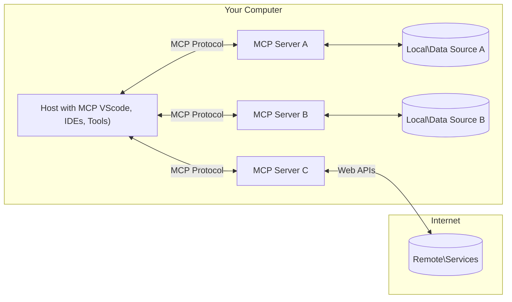

<!--
CO_OP_TRANSLATOR_METADATA:
{
  "original_hash": "b3b4a6ad10c3c0edbf7fa7cfa0ec496b",
  "translation_date": "2025-07-02T06:56:57+00:00",
  "source_file": "01-CoreConcepts/README.md",
  "language_code": "ur"
}
-->
# 📖 MCP کور تصورات: AI انٹیگریشن کے لیے ماڈل کانٹیکسٹ پروٹوکول میں مہارت حاصل کرنا

[Model Context Protocol (MCP)](https://github.com/modelcontextprotocol) ایک طاقتور، معیاری فریم ورک ہے جو بڑے زبان کے ماڈلز (LLMs) اور بیرونی ٹولز، ایپلیکیشنز، اور ڈیٹا ذرائع کے درمیان مواصلات کو بہتر بناتا ہے۔ یہ SEO کے لیے بہتر بنایا گیا گائیڈ آپ کو MCP کے بنیادی تصورات سے روشناس کرائے گا، تاکہ آپ اس کی کلائنٹ-سرور آرکیٹیکچر، اہم اجزاء، مواصلاتی طریقہ کار، اور عمل درآمد کی بہترین طریقوں کو سمجھ سکیں۔

## جائزہ

یہ سبق Model Context Protocol (MCP) کے ماحولیاتی نظام کی بنیادی ساخت اور اجزاء کا جائزہ لیتا ہے۔ آپ کلائنٹ-سرور آرکیٹیکچر، اہم اجزاء، اور مواصلاتی طریقہ کار کے بارے میں جانیں گے جو MCP کے تعاملات کو ممکن بناتے ہیں۔

## 👩‍🎓 اہم سیکھنے کے مقاصد

اس سبق کے اختتام پر آپ:

- MCP کلائنٹ-سرور آرکیٹیکچر کو سمجھیں گے۔
- Hosts، Clients، اور Servers کے کردار اور ذمہ داریاں پہچانیں گے۔
- MCP کو ایک لچکدار انٹیگریشن پرت بنانے والی بنیادی خصوصیات کا تجزیہ کریں گے۔
- MCP ماحولیاتی نظام میں معلومات کے بہاؤ کو سمجھیں گے۔
- .NET، Java، Python، اور JavaScript میں کوڈ کی مثالوں کے ذریعے عملی بصیرت حاصل کریں گے۔

## 🔎 MCP آرکیٹیکچر: ایک گہرا جائزہ

MCP کا ماحولیاتی نظام کلائنٹ-سرور ماڈل پر مبنی ہے۔ یہ ماڈیولر ساخت AI ایپلیکیشنز کو ٹولز، ڈیٹا بیسز، APIs، اور سیاق و سباق کے وسائل کے ساتھ مؤثر طریقے سے تعامل کرنے کی اجازت دیتی ہے۔ آئیے اس آرکیٹیکچر کو اس کے بنیادی اجزاء میں تقسیم کرتے ہیں۔

بنیادی طور پر، MCP کلائنٹ-سرور آرکیٹیکچر کی پیروی کرتا ہے جہاں ایک میزبان ایپلیکیشن متعدد سرورز سے جڑ سکتی ہے:



- **MCP Hosts**: VSCode، Claude Desktop، IDEs، یا AI ٹولز جیسے پروگرام جو MCP کے ذریعے ڈیٹا تک رسائی چاہتے ہیں  
- **MCP Clients**: پروٹوکول کلائنٹس جو سرورز کے ساتھ 1:1 کنکشن برقرار رکھتے ہیں  
- **MCP Servers**: ہلکے پھلکے پروگرام جو معیاری Model Context Protocol کے ذریعے مخصوص صلاحیتیں فراہم کرتے ہیں  
- **Local Data Sources**: آپ کے کمپیوٹر کی فائلیں، ڈیٹا بیسز، اور سروسز جن تک MCP سرورز محفوظ طریقے سے رسائی حاصل کر سکتے ہیں  
- **Remote Services**: بیرونی نظام جو انٹرنیٹ کے ذریعے دستیاب ہوتے ہیں اور MCP سرورز APIs کے ذریعے جڑ سکتے ہیں۔

MCP پروٹوکول ایک ترقی پذیر معیار ہے، آپ تازہ ترین اپ ڈیٹس [protocol specification](https://modelcontextprotocol.io/specification/2025-06-18/) پر دیکھ سکتے ہیں۔

### 1. Hosts

Model Context Protocol (MCP) میں، Hosts ایک اہم کردار ادا کرتے ہیں کیونکہ یہ وہ بنیادی انٹرفیس ہوتے ہیں جن کے ذریعے صارفین پروٹوکول کے ساتھ تعامل کرتے ہیں۔ Hosts وہ ایپلیکیشنز یا ماحولیات ہیں جو MCP سرورز کے ساتھ کنکشن شروع کرتے ہیں تاکہ ڈیٹا، ٹولز، اور پرامپٹس تک رسائی حاصل کی جا سکے۔ Hosts کی مثالوں میں Visual Studio Code جیسے integrated development environments (IDEs)، Claude Desktop جیسے AI ٹولز، یا مخصوص کاموں کے لیے بنائے گئے کسٹم ایجنٹس شامل ہیں۔

**Hosts** وہ LLM ایپلیکیشنز ہیں جو کنکشن شروع کرتے ہیں۔ وہ:

- AI ماڈلز کے ساتھ تعامل کرتے ہیں یا جوابات تیار کرتے ہیں۔  
- MCP سرورز کے ساتھ کنکشن شروع کرتے ہیں۔  
- گفتگو کے بہاؤ اور یوزر انٹرفیس کا انتظام کرتے ہیں۔  
- اجازت اور سیکیورٹی پابندیوں کو کنٹرول کرتے ہیں۔  
- ڈیٹا شیئرنگ اور ٹول کے اجرا کے لیے صارف کی رضامندی کا انتظام کرتے ہیں۔  

### 2. Clients

Clients وہ اہم اجزاء ہیں جو Hosts اور MCP سرورز کے درمیان تعامل کو آسان بناتے ہیں۔ Clients ایک درمیانی حیثیت رکھتے ہیں، جو Hosts کو MCP سرورز کی فراہم کردہ فعالیتوں تک رسائی اور استعمال کی اجازت دیتے ہیں۔ یہ MCP آرکیٹیکچر میں ہموار مواصلات اور مؤثر ڈیٹا تبادلے کو یقینی بنانے میں اہم کردار ادا کرتے ہیں۔

**Clients** میزبان ایپلیکیشن کے اندر کنیکٹرز ہوتے ہیں۔ وہ:

- سرورز کو پرامپٹس/ہدایات کے ساتھ درخواستیں بھیجتے ہیں۔  
- سرورز کے ساتھ صلاحیتوں پر بات چیت کرتے ہیں۔  
- ماڈلز سے ٹول کے اجرا کی درخواستوں کا انتظام کرتے ہیں۔  
- صارفین کو جوابات پراسیس اور دکھاتے ہیں۔  

### 3. Servers

Servers MCP کلائنٹس سے درخواستیں وصول کرنے اور مناسب جوابات فراہم کرنے کے ذمہ دار ہوتے ہیں۔ وہ مختلف آپریشنز جیسے ڈیٹا بازیافت، ٹول کا اجرا، اور پرامپٹ جنریشن کا انتظام کرتے ہیں۔ Servers اس بات کو یقینی بناتے ہیں کہ کلائنٹس اور Hosts کے درمیان مواصلات مؤثر اور قابل اعتماد ہوں، اور تعامل کے عمل کی سالمیت برقرار رہے۔

**Servers** وہ سروسز ہیں جو سیاق و سباق اور صلاحیتیں فراہم کرتی ہیں۔ وہ:

- دستیاب خصوصیات (وسائل، پرامپٹس، ٹولز) کو رجسٹر کرتے ہیں۔  
- کلائنٹ سے ٹول کالز وصول اور عملدرآمد کرتے ہیں۔  
- ماڈل کے جوابات کو بہتر بنانے کے لیے سیاق و سباق کی معلومات فراہم کرتے ہیں۔  
- نتائج کو کلائنٹ کو واپس بھیجتے ہیں۔  
- ضرورت پڑنے پر تعاملات کے دوران حالت کو برقرار رکھتے ہیں۔  

Servers کسی بھی شخص کے ذریعے ماڈل کی صلاحیتوں کو مخصوص فعالیت کے ساتھ بڑھانے کے لیے تیار کیے جا سکتے ہیں۔

### 4. Server Features

Model Context Protocol (MCP) میں Servers بنیادی اجزاء فراہم کرتے ہیں جو کلائنٹس، Hosts، اور زبان کے ماڈلز کے درمیان بھرپور تعاملات کو ممکن بناتے ہیں۔ یہ خصوصیات MCP کی صلاحیتوں کو منظم سیاق و سباق، ٹولز، اور پرامپٹس کی پیشکش کے ذریعے بڑھانے کے لیے ڈیزائن کی گئی ہیں۔

MCP سرورز درج ذیل خصوصیات میں سے کوئی بھی فراہم کر سکتے ہیں:

#### 📑 Resources 

Model Context Protocol (MCP) میں Resources مختلف قسم کے سیاق و سباق اور ڈیٹا کو شامل کرتے ہیں جنہیں صارفین یا AI ماڈلز استعمال کر سکتے ہیں۔ ان میں شامل ہیں:

- **سیاق و سباق کا ڈیٹا**: معلومات اور سیاق و سباق جو صارفین یا AI ماڈلز فیصلہ سازی اور کام کی انجام دہی کے لیے استعمال کر سکتے ہیں۔  
- **علمی بنیادیں اور دستاویزات کا ذخیرہ**: منظم اور غیر منظم ڈیٹا کے مجموعے، جیسے مضامین، دستی، اور تحقیقی مقالے، جو قیمتی بصیرت اور معلومات فراہم کرتے ہیں۔  
- **مقامی فائلیں اور ڈیٹا بیسز**: ایسے ڈیٹا جو آلات پر یا ڈیٹا بیسز میں مقامی طور پر محفوظ ہوتے ہیں، جن تک پروسیسنگ اور تجزیہ کے لیے رسائی حاصل کی جا سکتی ہے۔  
- **APIs اور ویب سروسز**: بیرونی انٹرفیسز اور سروسز جو اضافی ڈیٹا اور فعالیت فراہم کرتی ہیں، اور مختلف آن لائن وسائل اور ٹولز کے ساتھ انضمام کو ممکن بناتی ہیں۔  

ایک resource کی مثال ایک ڈیٹا بیس اسکیمہ یا فائل ہو سکتی ہے جس تک اس طرح رسائی حاصل کی جا سکتی ہے:

```text
file://log.txt
database://schema
```

### 🤖 Prompts

Model Context Protocol (MCP) میں پرامپٹس مختلف پیشگی تیار کردہ ٹیمپلیٹس اور تعامل کے نمونے شامل ہیں جو صارف کے ورک فلو کو آسان بنانے اور مواصلات کو بہتر بنانے کے لیے ڈیزائن کیے گئے ہیں۔ ان میں شامل ہیں:

- **ٹیمپلیٹڈ پیغامات اور ورک فلو**: پیش ساختہ پیغامات اور عمل جو صارفین کو مخصوص کاموں اور تعاملات کے دوران رہنمائی کرتے ہیں۔  
- **پیشگی تعریف شدہ تعامل کے نمونے**: معیاری کارروائیوں اور جوابات کے سلسلے جو مستقل اور مؤثر مواصلات کو ممکن بناتے ہیں۔  
- **خصوصی گفتگو کے ٹیمپلیٹس**: مخصوص قسم کی بات چیت کے لیے حسب ضرورت ٹیمپلیٹس جو متعلقہ اور سیاق و سباق کے لحاظ سے مناسب تعاملات کو یقینی بناتے ہیں۔  

ایک پرامپٹ ٹیمپلیٹ اس طرح دکھائی دے سکتا ہے:

```markdown
Generate a product slogan based on the following {{product}} with the following {{keywords}}
```

#### ⛏️ Tools

Model Context Protocol (MCP) میں Tools وہ فنکشنز ہیں جو AI ماڈل مخصوص کام انجام دینے کے لیے چلا سکتا ہے۔ یہ ٹولز AI ماڈل کی صلاحیتوں کو منظم اور قابل اعتماد آپریشنز فراہم کرکے بڑھانے کے لیے ڈیزائن کیے گئے ہیں۔ اہم پہلو یہ ہیں:

- **AI ماڈل کے لیے چلانے والے فنکشنز**: ٹولز قابل عمل فنکشنز ہیں جنہیں AI ماڈل مختلف کام انجام دینے کے لیے بلا سکتا ہے۔  
- **منفرد نام اور وضاحت**: ہر ٹول کا ایک مخصوص نام اور تفصیلی وضاحت ہوتی ہے جو اس کے مقصد اور فعالیت کی وضاحت کرتی ہے۔  
- **پیرامیٹرز اور آؤٹ پٹ**: ٹولز مخصوص پیرامیٹرز قبول کرتے ہیں اور منظم نتائج واپس کرتے ہیں، تاکہ مستقل اور متوقع نتائج حاصل ہوں۔  
- **مخصوص فنکشنز**: ٹولز ایسے کام انجام دیتے ہیں جیسے ویب سرچ، حساب کتاب، اور ڈیٹا بیس کی تلاش۔  

ایک مثال کے طور پر ٹول اس طرح ہو سکتا ہے:

```typescript
server.tool(
  "GetProducts",
  {
    pageSize: z.string().optional(),
    pageCount: z.string().optional()
  }, () => {
    // return results from API
  }
)
```

## Client Features

Model Context Protocol (MCP) میں، کلائنٹس سرورز کو کئی اہم خصوصیات فراہم کرتے ہیں جو پروٹوکول کے اندر مجموعی فعالیت اور تعامل کو بڑھاتی ہیں۔ ان خصوصیات میں سے ایک نمایاں خصوصیت Sampling ہے۔

### 👉 Sampling

- **سرور کی طرف سے خود مختار ایجنٹک رویے**: کلائنٹس سرورز کو مخصوص کارروائیاں یا رویے خود بخود شروع کرنے کی اجازت دیتے ہیں، جس سے نظام کی متحرک صلاحیتیں بڑھتی ہیں۔  
- **Recursive LLM Interactions**: یہ خصوصیت بڑے زبان کے ماڈلز (LLMs) کے ساتھ تکراری تعاملات کی اجازت دیتی ہے، جس سے کاموں کی مزید پیچیدہ اور بار بار پراسیسنگ ممکن ہوتی ہے۔  
- **مزید ماڈل مکمل کرنے کی درخواست**: سرورز ماڈل سے اضافی مکملات کی درخواست کر سکتے ہیں، تاکہ جوابات جامع اور سیاق و سباق کے مطابق ہوں۔  

## MCP میں معلومات کا بہاؤ

Model Context Protocol (MCP) میزبانوں، کلائنٹس، سرورز، اور ماڈلز کے درمیان معلومات کے منظم بہاؤ کی وضاحت کرتا ہے۔ اس بہاؤ کو سمجھنا یہ واضح کرتا ہے کہ صارف کی درخواستیں کیسے پروسیس ہوتی ہیں اور بیرونی ٹولز اور ڈیٹا کو ماڈل کے جوابات میں کیسے شامل کیا جاتا ہے۔

- **Host کنکشن شروع کرتا ہے**  
  میزبان ایپلیکیشن (جیسے IDE یا چیٹ انٹرفیس) عام طور پر STDIO، WebSocket، یا دیگر سپورٹڈ ٹرانسپورٹ کے ذریعے MCP سرور سے کنکشن قائم کرتی ہے۔

- **صلاحیتوں پر بات چیت**  
  کلائنٹ (جو میزبان میں شامل ہوتا ہے) اور سرور اپنی سپورٹ کردہ خصوصیات، ٹولز، وسائل، اور پروٹوکول ورژنز کے بارے میں معلومات کا تبادلہ کرتے ہیں۔ اس سے دونوں جانب کو معلوم ہوتا ہے کہ سیشن کے لیے کون سی صلاحیتیں دستیاب ہیں۔

- **صارف کی درخواست**  
  صارف میزبان کے ساتھ تعامل کرتا ہے (مثلاً پرامپٹ یا کمانڈ داخل کرتا ہے)۔ میزبان یہ ان پٹ جمع کرتا ہے اور پراسیسنگ کے لیے کلائنٹ کو بھیجتا ہے۔

- **وسائل یا ٹول کا استعمال**  
  - کلائنٹ سرور سے اضافی سیاق و سباق یا وسائل طلب کر سکتا ہے (جیسے فائلیں، ڈیٹا بیس انٹریز، یا علمی مضامین) تاکہ ماڈل کی سمجھ بوجھ کو بہتر بنایا جا سکے۔  
  - اگر ماڈل فیصلہ کرتا ہے کہ ٹول کی ضرورت ہے (مثلاً ڈیٹا حاصل کرنا، حساب کتاب کرنا، یا API کال کرنا)، تو کلائنٹ سرور کو ٹول کال کی درخواست بھیجتا ہے، جس میں ٹول کا نام اور پیرامیٹرز شامل ہوتے ہیں۔

- **سرور کا اجرا**  
  سرور وسائل یا ٹول کی درخواست وصول کرتا ہے، ضروری آپریشنز انجام دیتا ہے (جیسے فنکشن چلانا، ڈیٹا بیس سے تلاش کرنا، یا فائل بازیافت کرنا)، اور نتائج کو منظم شکل میں کلائنٹ کو واپس بھیجتا ہے۔

- **جواب کی تیاری**  
  کلائنٹ سرور کے جوابات (وسائل کا ڈیٹا، ٹول کے نتائج، وغیرہ) کو جاری ماڈل تعامل میں شامل کرتا ہے۔ ماڈل اس معلومات کا استعمال کرتے ہوئے جامع اور سیاق و سباق کے مطابق جواب تیار کرتا ہے۔

- **نتائج کی پیش کش**  
  میزبان کلائنٹ سے حتمی آؤٹ پٹ وصول کرتا ہے اور اسے صارف کو پیش کرتا ہے، جس میں عام طور پر ماڈل کی تیار کردہ تحریر اور ٹول کے اجرا یا وسائل کی تلاش کے نتائج شامل ہوتے ہیں۔

یہ بہاؤ MCP کو جدید، متعامل، اور سیاق و سباق سے آگاہ AI ایپلیکیشنز کی حمایت کرنے کے قابل بناتا ہے، جو ماڈلز کو بیرونی ٹولز اور ڈیٹا ذرائع کے ساتھ بغیر رکاوٹ جوڑتا ہے۔

## پروٹوکول کی تفصیلات

MCP (Model Context Protocol) [JSON-RPC 2.0](https://www.jsonrpc.org/) کے اوپر بنایا گیا ہے، جو میزبانوں، کلائنٹس، اور سرورز کے درمیان مواصلات کے لیے معیاری، زبان سے آزاد میسج فارمیٹ فراہم کرتا ہے۔ یہ بنیاد مختلف پلیٹ فارمز اور پروگرامنگ زبانوں میں قابل اعتماد، منظم، اور قابل توسیع تعاملات کو ممکن بناتی ہے۔

### اہم پروٹوکول خصوصیات

MCP JSON-RPC 2.0 کو ٹول کال، وسائل تک رسائی، اور پرامپٹ مینجمنٹ کے لیے اضافی روایات کے ساتھ بڑھاتا ہے۔ یہ متعدد ٹرانسپورٹ لیئرز (STDIO، WebSocket، SSE) کو سپورٹ کرتا ہے اور اجزاء کے درمیان محفوظ، قابل توسیع، اور زبان سے آزاد مواصلات کو فعال بناتا ہے۔

#### 🧢 بنیادی پروٹوکول

- **JSON-RPC میسج فارمیٹ**: تمام درخواستیں اور جوابات JSON-RPC 2.0 وضاحت کے مطابق ہوتے ہیں، جس سے میتھڈ کالز، پیرامیٹرز، نتائج، اور ایرر ہینڈلنگ کے لیے مستقل ڈھانچہ یقینی بنتا ہے۔  
- **حالت دار کنکشنز**: MCP سیشنز متعدد درخواستوں کے دوران حالت کو برقرار رکھتے ہیں، جو جاری گفتگو، سیاق و سباق کے جمع ہونے، اور وسائل کے انتظام کی حمایت کرتے ہیں۔  
- **صلاحیتوں پر بات چیت**: کنکشن کے قیام کے دوران، کلائنٹس اور سرورز اپنی سپورٹ کردہ خصوصیات، پروٹوکول ورژنز، دستیاب ٹولز، اور وسائل کے بارے میں معلومات کا تبادلہ کرتے ہیں۔ اس سے دونوں طرف کو ایک دوسرے کی صلاحیتوں کا علم ہوتا ہے اور وہ اسی کے مطابق خود کو ڈھال سکتے ہیں۔

#### ➕ اضافی سہولیات

ذیل میں کچھ اضافی سہولیات اور پروٹوکول کی توسیعات ہیں جو MCP ڈیولپر کے تجربے کو بہتر بنانے اور پیچیدہ حالات کو فعال کرنے کے لیے فراہم کرتا ہے:

- **تشکیلاتی اختیارات**: MCP سیشن پیرامیٹرز کی متحرک ترتیب کی اجازت دیتا ہے، جیسے ٹول اجازتیں، وسائل تک رسائی، اور ماڈل کی ترتیبات، جو ہر تعامل کے مطابق ڈھالی جا سکتی ہیں۔  
- **پیش رفت کی نگرانی**: طویل عرصے تک چلنے والے آپریشنز پیش رفت کی اپ ڈیٹس رپورٹ کر سکتے ہیں، جو پیچیدہ کاموں کے دوران صارف کے انٹرفیس کو جوابدہ اور بہتر تجربہ فراہم کرتی ہے۔  
- **درخواست منسوخی**: کلائنٹس چل رہی درخواستوں کو منسوخ کر سکتے ہیں، جس سے صارفین کو ایسی کارروائیاں روکنے کی اجازت ملتی ہے جو اب ضروری نہیں یا بہت زیادہ وقت لے رہی ہوں۔  
- **خرابی کی رپورٹنگ**: معیاری خرابی کے پیغامات اور کوڈ مسائل کی تشخیص، ناکامیوں کا مؤثر انتظام، اور صارفین و ڈیولپرز کو قابل عمل فیڈ بیک فراہم کرنے میں مدد کرتے ہیں۔  
- **لاگنگ**: کلائنٹس اور سرورز دونوں آڈٹ، ڈیبگنگ، اور پروٹوکول تعاملات کی نگرانی کے لیے منظم لاگز جاری کر سکتے ہیں۔

ان پروٹوکول خصوصیات سے فائدہ اٹھا کر، MCP زبان کے ماڈلز اور بیرونی ٹولز یا ڈیٹا ذرائع کے درمیان مضبوط، محفوظ، اور لچکدار مواصلات کو یقینی بناتا ہے۔

### 🔐 سیکیورٹی کے پہلو

MCP کے نفاذ میں کئی اہم سیکیورٹی اصولوں کی پابندی ضروری ہے تاکہ محفوظ اور قابل اعتماد تعاملات کو یقینی بنایا جا سکے:

- **صارف کی رضامندی اور کنٹرول**: کسی بھی ڈیٹا تک رسائی یا آپریشنز کے انجام دینے سے پہلے صارف کی واضح رضامندی ضروری ہے۔ صارفین کو واضح کنٹرول دیا جانا چاہیے

**ڈس کلیمر**:  
یہ دستاویز AI ترجمہ سروس [Co-op Translator](https://github.com/Azure/co-op-translator) کے ذریعے ترجمہ کی گئی ہے۔ اگرچہ ہم درستگی کے لیے کوشاں ہیں، براہ کرم اس بات سے آگاہ رہیں کہ خودکار ترجموں میں غلطیاں یا عدم درستیاں ہو سکتی ہیں۔ اصل دستاویز اپنی مادری زبان میں مستند ذریعہ سمجھی جانی چاہیے۔ اہم معلومات کے لیے پیشہ ورانہ انسانی ترجمہ کی سفارش کی جاتی ہے۔ اس ترجمے کے استعمال سے پیدا ہونے والی کسی بھی غلط فہمی یا غلط تشریح کی ذمہ داری ہم پر نہیں ہوگی۔