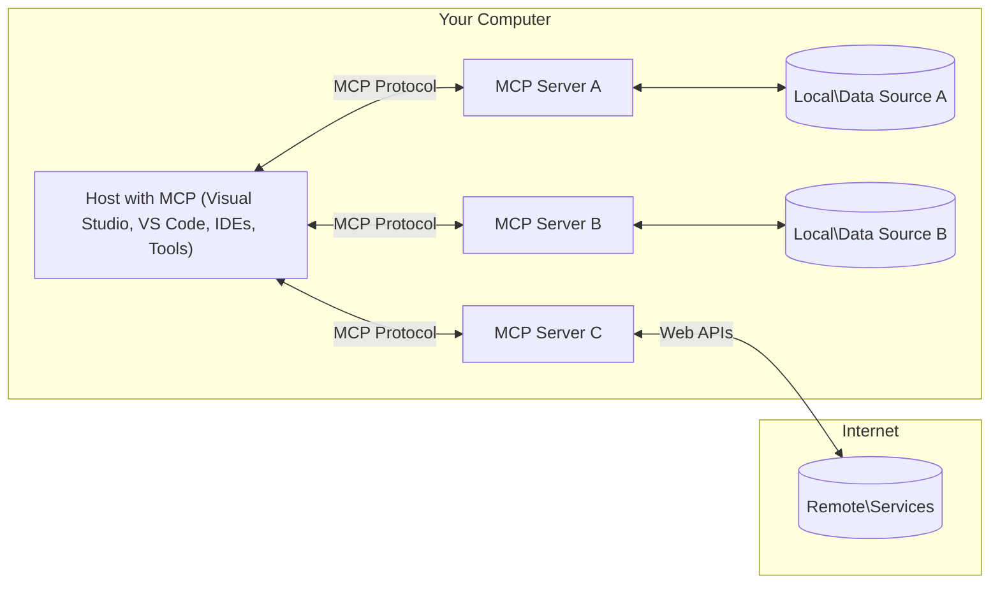

<!--
CO_OP_TRANSLATOR_METADATA:
{
  "original_hash": "904b59de1de9264801242d90a42cdd9d",
  "translation_date": "2025-09-05T10:23:29+00:00",
  "source_file": "01-CoreConcepts/README.md",
  "language_code": "ur"
}
-->
# ایم سی پی کے بنیادی تصورات: ماڈل کانٹیکسٹ پروٹوکول کے ذریعے اے آئی انضمام میں مہارت حاصل کرنا

[](https://youtu.be/earDzWGtE84)

_(اوپر دی گئی تصویر پر کلک کریں تاکہ اس سبق کی ویڈیو دیکھی جا سکے)_

[ماڈل کانٹیکسٹ پروٹوکول (MCP)](https://github.com/modelcontextprotocol) ایک طاقتور اور معیاری فریم ورک ہے جو بڑے لینگویج ماڈلز (LLMs) اور بیرونی ٹولز، ایپلیکیشنز، اور ڈیٹا ذرائع کے درمیان مواصلات کو بہتر بناتا ہے۔ 
یہ گائیڈ آپ کو ایم سی پی کے بنیادی تصورات سے روشناس کرائے گا۔ آپ اس کے کلائنٹ-سرور آرکیٹیکچر، اہم اجزاء، مواصلاتی میکانزم، اور بہترین عملی طریقوں کے بارے میں سیکھیں گے۔

- **صارف کی واضح منظوری**: تمام ڈیٹا تک رسائی اور آپریشنز کے لیے صارف کی واضح منظوری درکار ہوتی ہے۔ صارفین کو یہ واضح طور پر سمجھنا چاہیے کہ کون سا ڈیٹا استعمال کیا جائے گا اور کون سی کارروائیاں کی جائیں گی، اور انہیں اجازتوں اور منظوریوں پر مکمل کنٹرول حاصل ہونا چاہیے۔

- **ڈیٹا کی رازداری کا تحفظ**: صارف کا ڈیٹا صرف واضح منظوری کے ساتھ ظاہر کیا جائے گا اور پورے تعامل کے دوران مضبوط رسائی کنٹرولز کے ذریعے محفوظ رکھا جائے گا۔ غیر مجاز ڈیٹا کی ترسیل کو روکنے اور سخت رازداری کی حدود کو برقرار رکھنے کے لیے عمل درآمد ضروری ہے۔

- **ٹول کے استعمال کی حفاظت**: ہر ٹول کے استعمال کے لیے صارف کی واضح منظوری درکار ہوتی ہے، جس میں ٹول کی فعالیت، پیرامیٹرز، اور ممکنہ اثرات کی واضح تفہیم شامل ہو۔ غیر ارادی، غیر محفوظ، یا بدنیتی پر مبنی ٹول کے استعمال کو روکنے کے لیے مضبوط حفاظتی حدود ضروری ہیں۔

- **ٹرانسپورٹ لیئر سیکیورٹی**: تمام مواصلاتی چینلز کو مناسب انکرپشن اور تصدیقی میکانزم استعمال کرنا چاہیے۔ ریموٹ کنکشنز کو محفوظ ٹرانسپورٹ پروٹوکولز اور مناسب اسناد کے انتظام کو نافذ کرنا چاہیے۔

#### عمل درآمد کے رہنما اصول:

- **اجازت کا انتظام**: ایسے تفصیلی اجازت کے نظام نافذ کریں جو صارفین کو کن سرورز، ٹولز، اور وسائل تک رسائی حاصل ہو، اس پر کنٹرول فراہم کریں۔
- **تصدیق اور اجازت**: محفوظ تصدیقی طریقے (OAuth، API کیز) استعمال کریں، جن میں مناسب ٹوکن مینجمنٹ اور میعاد ختم ہونے کا انتظام شامل ہو۔
- **ان پٹ کی توثیق**: تمام پیرامیٹرز اور ڈیٹا ان پٹس کو متعین اسکیموں کے مطابق توثیق کریں تاکہ انجیکشن حملوں کو روکا جا سکے۔
- **آڈٹ لاگنگ**: سیکیورٹی مانیٹرنگ اور تعمیل کے لیے تمام آپریشنز کے جامع لاگز کو برقرار رکھیں۔

## جائزہ

یہ سبق ماڈل کانٹیکسٹ پروٹوکول (MCP) کے ماحولیاتی نظام کی بنیادی آرکیٹیکچر اور اجزاء کا جائزہ لیتا ہے۔ آپ ایم سی پی کے کلائنٹ-سرور آرکیٹیکچر، کلیدی اجزاء، اور مواصلاتی میکانزم کے بارے میں سیکھیں گے جو ایم سی پی کے تعاملات کو طاقتور بناتے ہیں۔

## کلیدی سیکھنے کے مقاصد

اس سبق کے اختتام تک، آپ:

- ایم سی پی کے کلائنٹ-سرور آرکیٹیکچر کو سمجھ سکیں گے۔
- میزبانوں، کلائنٹس، اور سرورز کے کردار اور ذمہ داریوں کی شناخت کر سکیں گے۔
- ان بنیادی خصوصیات کا تجزیہ کریں گے جو ایم سی پی کو ایک لچکدار انضمام کی تہہ بناتی ہیں۔
- ایم سی پی ماحولیاتی نظام میں معلومات کے بہاؤ کو سمجھ سکیں گے۔
- .NET، جاوا، پائتھون، اور جاوا اسکرپٹ میں کوڈ کی مثالوں کے ذریعے عملی بصیرت حاصل کریں گے۔

## ایم سی پی آرکیٹیکچر: ایک گہری نظر

ایم سی پی ماحولیاتی نظام کلائنٹ-سرور ماڈل پر مبنی ہے۔ یہ ماڈیولر ڈھانچہ اے آئی ایپلیکیشنز کو ٹولز، ڈیٹا بیسز، APIs، اور سیاق و سباق کے وسائل کے ساتھ مؤثر طریقے سے تعامل کرنے کی اجازت دیتا ہے۔ آئیے اس آرکیٹیکچر کو اس کے بنیادی اجزاء میں تقسیم کریں۔

ایم سی پی بنیادی طور پر کلائنٹ-سرور آرکیٹیکچر کی پیروی کرتا ہے، جہاں ایک میزبان ایپلیکیشن متعدد سرورز سے جڑ سکتی ہے:



- **ایم سی پی میزبان**: پروگرام جیسے VSCode، Claude Desktop، IDEs، یا اے آئی ٹولز جو ایم سی پی کے ذریعے ڈیٹا تک رسائی حاصل کرنا چاہتے ہیں۔
- **ایم سی پی کلائنٹس**: پروٹوکول کلائنٹس جو سرورز کے ساتھ 1:1 کنکشن برقرار رکھتے ہیں۔
- **ایم سی پی سرورز**: ہلکے پروگرام جو معیاری ماڈل کانٹیکسٹ پروٹوکول کے ذریعے مخصوص صلاحیتوں کو ظاہر کرتے ہیں۔
- **مقامی ڈیٹا ذرائع**: آپ کے کمپیوٹر کی فائلیں، ڈیٹا بیسز، اور خدمات جن تک ایم سی پی سرورز محفوظ طریقے سے رسائی حاصل کر سکتے ہیں۔
- **ریموٹ سروسز**: بیرونی نظام جو انٹرنیٹ پر دستیاب ہیں اور جن سے ایم سی پی سرورز APIs کے ذریعے جڑ سکتے ہیں۔

ایم سی پی پروٹوکول ایک ارتقائی معیار ہے جو تاریخ پر مبنی ورژننگ (YYYY-MM-DD فارمیٹ) استعمال کرتا ہے۔ موجودہ پروٹوکول ورژن **2025-06-18** ہے۔ آپ پروٹوکول کی تازہ ترین اپڈیٹس [پروٹوکول کی تفصیلات](https://modelcontextprotocol.io/specification/2025-06-18/) پر دیکھ سکتے ہیں۔

### 1. میزبان

ماڈل کانٹیکسٹ پروٹوکول (MCP) میں، **میزبان** وہ اے آئی ایپلیکیشنز ہیں جو پروٹوکول کے ذریعے صارفین کے تعامل کا بنیادی انٹرفیس فراہم کرتی ہیں۔ میزبان متعدد ایم سی پی سرورز کے ساتھ کنکشنز کو مربوط اور منظم کرتے ہیں، ہر سرور کنکشن کے لیے مخصوص ایم سی پی کلائنٹس بنا کر۔ میزبان کی مثالیں شامل ہیں:

- **اے آئی ایپلیکیشنز**: Claude Desktop، Visual Studio Code، Claude Code
- **ترقیاتی ماحول**: IDEs اور کوڈ ایڈیٹرز جن میں ایم سی پی انضمام شامل ہو۔
- **حسب ضرورت ایپلیکیشنز**: مقصد کے تحت بنائے گئے اے آئی ایجنٹس اور ٹولز

**میزبان** وہ ایپلیکیشنز ہیں جو اے آئی ماڈل کے تعاملات کو مربوط کرتی ہیں۔ یہ:

- **اے آئی ماڈلز کو منظم کرتے ہیں**: جوابات پیدا کرنے اور اے آئی ورک فلو کو مربوط کرنے کے لیے LLMs کو چلاتے ہیں یا ان کے ساتھ تعامل کرتے ہیں۔
- **کلائنٹ کنکشنز کا انتظام کرتے ہیں**: ہر ایم سی پی سرور کنکشن کے لیے ایک ایم سی پی کلائنٹ بناتے ہیں اور اسے برقرار رکھتے ہیں۔
- **صارف انٹرفیس کو کنٹرول کرتے ہیں**: گفتگو کے بہاؤ، صارف کے تعاملات، اور جوابات کی پیشکش کو سنبھالتے ہیں۔
- **سیکیورٹی کو نافذ کرتے ہیں**: اجازتوں، حفاظتی حدود، اور تصدیق کو کنٹرول کرتے ہیں۔
- **صارف کی منظوری کو سنبھالتے ہیں**: ڈیٹا شیئرنگ اور ٹول کے استعمال کے لیے صارف کی منظوری کا انتظام کرتے ہیں۔

### 2. کلائنٹس

**کلائنٹس** وہ اہم اجزاء ہیں جو میزبانوں اور ایم سی پی سرورز کے درمیان مخصوص ایک سے ایک کنکشن برقرار رکھتے ہیں۔ ہر ایم سی پی کلائنٹ کو میزبان کے ذریعے ایک مخصوص ایم سی پی سرور سے جڑنے کے لیے بنایا جاتا ہے، جو منظم اور محفوظ مواصلاتی چینلز کو یقینی بناتا ہے۔ متعدد کلائنٹس میزبانوں کو بیک وقت متعدد سرورز سے جڑنے کے قابل بناتے ہیں۔

**کلائنٹس** میزبان ایپلیکیشن کے اندر کنیکٹر اجزاء ہیں۔ یہ:

- **پروٹوکول مواصلات**: سرورز کو JSON-RPC 2.0 درخواستیں بھیجتے ہیں جن میں پرامپٹس اور ہدایات شامل ہوتی ہیں۔
- **صلاحیتوں کی گفت و شنید**: ابتدائیہ کے دوران سرورز کے ساتھ تعاون یافتہ خصوصیات اور پروٹوکول ورژنز پر گفت و شنید کرتے ہیں۔
- **ٹول کے استعمال کا انتظام**: ماڈلز سے ٹول کے استعمال کی درخواستوں کو منظم کرتے ہیں اور جوابات پر عمل کرتے ہیں۔
- **حقیقی وقت کی اپڈیٹس**: سرورز سے اطلاعات اور حقیقی وقت کی اپڈیٹس کو سنبھالتے ہیں۔
- **جواب کی پروسیسنگ**: صارفین کو دکھانے کے لیے سرور کے جوابات پر عمل کرتے ہیں اور انہیں فارمیٹ کرتے ہیں۔

### 3. سرورز

**سرورز** وہ پروگرام ہیں جو ایم سی پی کلائنٹس کو سیاق و سباق، ٹولز، اور صلاحیتیں فراہم کرتے ہیں۔ یہ مقامی طور پر (میزبان کے ساتھ ایک ہی مشین پر) یا دور دراز (بیرونی پلیٹ فارمز پر) چل سکتے ہیں، اور کلائنٹ کی درخواستوں کو سنبھالنے اور منظم جوابات فراہم کرنے کے ذمہ دار ہیں۔ سرورز معیاری ماڈل کانٹیکسٹ پروٹوکول کے ذریعے مخصوص فعالیت کو ظاہر کرتے ہیں۔

**سرورز** وہ خدمات ہیں جو سیاق و سباق اور صلاحیتیں فراہم کرتی ہیں۔ یہ:

- **خصوصیات کی رجسٹریشن**: دستیاب بنیادی اجزاء (وسائل، پرامپٹس، ٹولز) کو کلائنٹس کے سامنے رجسٹر کرتے ہیں اور ظاہر کرتے ہیں۔
- **درخواست کی پروسیسنگ**: کلائنٹس سے ٹول کالز، وسائل کی درخواستیں، اور پرامپٹ درخواستیں وصول کرتے ہیں اور ان پر عمل کرتے ہیں۔
- **سیاق و سباق کی فراہمی**: ماڈل کے جوابات کو بہتر بنانے کے لیے سیاق و سباق کی معلومات اور ڈیٹا فراہم کرتے ہیں۔
- **ریاست کا انتظام**: سیشن کی حالت کو برقرار رکھتے ہیں اور ضرورت پڑنے پر ریاستی تعاملات کو سنبھالتے ہیں۔
- **حقیقی وقت کی اطلاعات**: منسلک کلائنٹس کو صلاحیتوں میں تبدیلیوں اور اپڈیٹس کے بارے میں اطلاعات بھیجتے ہیں۔

سرورز کو کوئی بھی تیار کر سکتا ہے تاکہ ماڈل کی صلاحیتوں کو خصوصی فعالیت کے ساتھ بڑھایا جا سکے، اور یہ مقامی اور دور دراز دونوں تعیناتی منظرناموں کی حمایت کرتے ہیں۔

### 4. سرور کے بنیادی اجزاء

ماڈل کانٹیکسٹ پروٹوکول (MCP) میں سرورز تین بنیادی **اجزاء** فراہم کرتے ہیں جو کلائنٹس، میزبانوں، اور لینگویج ماڈلز کے درمیان بھرپور تعاملات کے لیے بنیادی عمارت کے بلاکس کی وضاحت کرتے ہیں۔ یہ اجزاء پروٹوکول کے ذریعے دستیاب سیاق و سباق کی معلومات اور اعمال کی اقسام کی وضاحت کرتے ہیں۔

ایم سی پی سرورز درج ذیل تین بنیادی اجزاء کے کسی بھی امتزاج کو ظاہر کر سکتے ہیں:

#### وسائل

**وسائل** وہ ڈیٹا ذرائع ہیں جو اے آئی ایپلیکیشنز کو سیاق و سباق کی معلومات فراہم کرتے ہیں۔ یہ جامد یا متحرک مواد کی نمائندگی کرتے ہیں جو ماڈل کی سمجھ اور فیصلہ سازی کو بہتر بنا سکتا ہے:

- **سیاق و سباق کا ڈیٹا**: اے آئی ماڈل کے استعمال کے لیے ساختی معلومات اور سیاق و سباق۔
- **علمی بنیادیں**: دستاویزات کے ذخیرے، مضامین، ہدایت نامے، اور تحقیقی مقالے۔
- **مقامی ڈیٹا ذرائع**: فائلیں، ڈیٹا بیسز، اور مقامی نظام کی معلومات۔
- **بیرونی ڈیٹا**: API جوابات، ویب سروسز، اور دور دراز نظام کا ڈیٹا۔
- **متحرک مواد**: حقیقی وقت کا ڈیٹا جو بیرونی حالات کی بنیاد پر اپڈیٹ ہوتا ہے۔

وسائل کو URIs کے ذریعے شناخت کیا جاتا ہے اور `resources/list` کے ذریعے دریافت اور `resources/read` کے ذریعے بازیافت کیا جا سکتا ہے:

```text
file://documents/project-spec.md
database://production/users/schema
api://weather/current
```

#### پرامپٹس

**پرامپٹس** وہ دوبارہ استعمال کے قابل ٹیمپلیٹس ہیں جو لینگویج ماڈلز کے ساتھ تعاملات کو منظم کرنے میں مدد کرتے ہیں۔ یہ معیاری تعامل کے نمونے اور ٹیمپلیٹڈ ورک فلو فراہم کرتے ہیں:

- **ٹیمپلیٹ پر مبنی تعاملات**: پہلے سے ساختہ پیغامات اور گفتگو کے آغاز۔
- **ورک فلو ٹیمپلیٹس**: عام کاموں اور تعاملات کے لیے معیاری ترتیب۔
- **فیوشاٹ مثالیں**: ماڈل کی ہدایات کے لیے مثال پر مبنی ٹیمپلیٹس۔
- **سسٹم پرامپٹس**: بنیادی پرامپٹس جو ماڈل کے رویے اور سیاق و سباق کی وضاحت کرتے ہیں۔
- **متحرک ٹیمپلیٹس**: پیرامیٹرائزڈ پرامپٹس جو مخصوص سیاق و سباق کے مطابق ڈھل جاتے ہیں۔

پرامپٹس متغیر کی تبدیلی کی حمایت کرتے ہیں اور `prompts/list` کے ذریعے دریافت اور `prompts/get` کے ذریعے بازیافت کیے جا سکتے ہیں:

```markdown
Generate a {{task_type}} for {{product}} targeting {{audience}} with the following requirements: {{requirements}}
```

#### ٹولز

**ٹولز** وہ قابل عمل افعال ہیں جنہیں اے آئی ماڈلز مخصوص اعمال انجام دینے کے لیے استعمال کر سکتے ہیں۔ یہ ایم سی پی ماحولیاتی نظام کے "افعال" کی نمائندگی کرتے ہیں، جو ماڈلز کو بیرونی نظام کے ساتھ تعامل کرنے کے قابل بناتے ہیں:

- **قابل عمل افعال**: مخصوص پیرامیٹرز کے ساتھ ماڈلز کے ذریعے استعمال کیے جانے والے الگ الگ آپریشنز۔
- **بیرونی نظام کا انضمام**: API کالز، ڈیٹا بیس کی تلاش، فائل آپریشنز، حساب کتاب۔
- **منفرد شناخت**: ہر ٹول کا ایک الگ نام، وضاحت، اور پیرامیٹر اسکیمہ ہوتا ہے۔
- **ساختی I/O**: ٹولز درست پیرامیٹرز کو قبول کرتے ہیں اور ساختی، ٹائپ شدہ جوابات واپس کرتے ہیں۔
- **عملی صلاحیتیں**: ماڈلز کو حقیقی دنیا کے اعمال انجام دینے اور لائیو ڈیٹا بازیافت کرنے کے قابل بناتے ہیں۔

ٹولز پیرامیٹر کی توثیق کے لیے JSON اسکیمہ کے ساتھ بیان کیے گئے ہیں اور `tools/list` کے ذریعے دریافت اور `tools/call` کے ذریعے استعمال کیے جا سکتے ہیں:

```typescript
server.tool(
  "search_products", 
  {
    query: z.string().describe("Search query for products"),
    category: z.string().optional().describe("Product category filter"),
    max_results: z.number().default(10).describe("Maximum results to return")
  }, 
  async (params) => {
    // Execute search and return structured results
    return await productService.search(params);
  }
);
```

## کلائنٹ کے بنیادی اجزاء

ماڈل کانٹیکسٹ پروٹوکول (MCP) میں، **کلائنٹس** ایسے اجزاء کو ظاہر کر سکتے ہیں جو سرورز کو میزبان ایپلیکیشن سے اضافی صلاحیتوں کی درخواست کرنے کے قابل بناتے ہیں۔ یہ کلائنٹ سائیڈ اجزاء سرورز کو زیادہ بھرپور اور انٹرایکٹو عمل درآمد فراہم کرنے کی اجازت دیتے ہیں جو اے آئی ماڈل کی صلاحیتوں اور صارف کے تعاملات تک رسائی حاصل کر سکتے ہیں۔

### سیمپلنگ

**سیمپلنگ** سرورز کو کلائنٹ کی اے آئی ایپلیکیشن سے لینگویج ماڈل کے جوابات کی درخواست کرنے کی اجازت دیتا ہے۔ یہ جزو سرورز کو اپنے ماڈل کے انحصار کو شامل کیے بغیر LLM صلاحیتوں تک رسائی فراہم کرتا ہے:

- **ماڈل سے آزاد رسائی**: سرورز LLM SDKs کو شامل کیے بغیر جوابات کی درخواست کر سکتے ہیں۔
- **سرور کی طرف سے اے آئی**: سرورز کو کلائنٹ کے اے آئی ماڈل کا استعمال کرتے ہوئے مواد پیدا کرنے کے قابل بناتا ہے۔
- **ریکرسیو LLM تعاملات**: پیچیدہ منظرناموں کی حمایت کرتا ہے جہاں سرورز کو پروسیسنگ کے لیے اے آئی کی مدد کی ضرورت ہوتی ہے۔
- **متحرک مواد کی تخلیق**: سرورز کو میزبان کے ماڈل کا استعمال کرتے ہوئے سیاق و سباق کے جوابات تخلیق کرنے کی اجازت دیتا ہے۔

سیمپلنگ `sampling/complete` طریقہ کے ذریعے شروع کی جاتی ہے، جہاں سرورز کلائنٹس کو تکمیل کی درخواستیں بھیجتے ہیں۔

### ایلیسیٹیشن

**ایلیسیٹیشن** سرورز کو کلائنٹ انٹرفیس کے ذریعے صارفین سے اضافی معلومات یا تصدیق کی درخواست کرنے کے قابل بناتا ہے:

- **صارف ان پٹ کی درخواستیں**: سرورز ٹول کے استعمال کے لیے درکار اضافی معلومات طلب کر سکتے ہیں۔
- **تصدیقی ڈائیلاگز**: حساس یا اثر انگیز آپریشنز کے لیے صارف کی منظوری کی درخواست کریں۔
- **انٹرایکٹو ورک فلو**: سرورز کو مرحلہ وار صارف کے تعاملات تخلیق کرنے کے قابل بنائیں۔
- **متحرک پیرامیٹر جمع کرنا**: ٹول کے استعمال کے دوران گمشدہ یا اختیاری پیرامیٹرز جمع کریں۔

ایلیسیٹیشن کی درخواستیں `elicitation/request` طریقہ کے ذریعے کی جاتی ہیں تاکہ کلائنٹ کے انٹرفیس کے ذریعے صارف ان پٹ جمع کیا جا سکے۔

### لاگنگ

**لاگنگ** سرورز کو کلائنٹس کو ڈیبگنگ، مانیٹرنگ، اور آپریشنل مرئیت کے لیے ساختی لاگ پیغامات بھیجنے کی اجازت دیتا ہے
- **JSON-RPC 2.0 پروٹوکول**: تمام مواصلات معیاری JSON-RPC 2.0 پیغام فارمیٹ کا استعمال کرتے ہیں، جو طریقہ کار کالز، جوابات، اور نوٹیفکیشنز کے لیے استعمال ہوتا ہے  
- **لائف سائیکل مینجمنٹ**: کلائنٹس اور سرورز کے درمیان کنکشن کی شروعات، صلاحیتوں کی بات چیت، اور سیشن کے اختتام کو سنبھالتا ہے  
- **سرور پرائمٹوز**: سرورز کو بنیادی فعالیت فراہم کرنے کے لیے آلات، وسائل، اور پرامپٹس کے ذریعے فعال بناتا ہے  
- **کلائنٹ پرائمٹوز**: سرورز کو LLMs سے سیمپلنگ کی درخواست کرنے، صارف کی ان پٹ حاصل کرنے، اور لاگ پیغامات بھیجنے کے قابل بناتا ہے  
- **ریئل ٹائم نوٹیفکیشنز**: پولنگ کے بغیر متحرک اپ ڈیٹس کے لیے غیر ہم وقت نوٹیفکیشنز کی حمایت کرتا ہے  

#### اہم خصوصیات:

- **پروٹوکول ورژن نیگوشی ایشن**: مطابقت کو یقینی بنانے کے لیے تاریخ پر مبنی ورژننگ (YYYY-MM-DD) کا استعمال کرتا ہے  
- **صلاحیتوں کی دریافت**: کلائنٹس اور سرورز شروعات کے دوران معاون خصوصیات کی معلومات کا تبادلہ کرتے ہیں  
- **اسٹیٹ فل سیشنز**: متعدد تعاملات کے دوران سیاق و سباق کی تسلسل کے لیے کنکشن کی حالت کو برقرار رکھتا ہے  

### ٹرانسپورٹ لیئر

**ٹرانسپورٹ لیئر** MCP شرکاء کے درمیان مواصلاتی چینلز، پیغام کی فریمنگ، اور تصدیق کا انتظام کرتا ہے:

#### معاون ٹرانسپورٹ میکانزم:

1. **STDIO ٹرانسپورٹ**:
   - براہ راست پروسیس مواصلات کے لیے معیاری ان پٹ/آؤٹ پٹ اسٹریمز کا استعمال کرتا ہے  
   - ایک ہی مشین پر مقامی پروسیسز کے لیے بہترین، بغیر نیٹ ورک اوور ہیڈ کے  
   - عام طور پر مقامی MCP سرور کے نفاذ کے لیے استعمال ہوتا ہے  

2. **اسٹریمیبل HTTP ٹرانسپورٹ**:
   - کلائنٹ سے سرور پیغامات کے لیے HTTP POST کا استعمال کرتا ہے  
   - سرور سے کلائنٹ اسٹریمنگ کے لیے اختیاری سرور-سینٹ ایونٹس (SSE)  
   - نیٹ ورکس کے پار ریموٹ سرور مواصلات کو فعال بناتا ہے  
   - معیاری HTTP تصدیق کی حمایت کرتا ہے (بیئرر ٹوکنز، API کیز، کسٹم ہیڈرز)  
   - محفوظ ٹوکن پر مبنی تصدیق کے لیے MCP OAuth کی سفارش کرتا ہے  

#### ٹرانسپورٹ ایبسٹریکشن:

ٹرانسپورٹ لیئر ڈیٹا لیئر سے مواصلاتی تفصیلات کو الگ کرتا ہے، تمام ٹرانسپورٹ میکانزم میں ایک ہی JSON-RPC 2.0 پیغام فارمیٹ کو فعال بناتا ہے۔ یہ ایبسٹریکشن ایپلیکیشنز کو مقامی اور ریموٹ سرورز کے درمیان بغیر کسی رکاوٹ کے سوئچ کرنے کی اجازت دیتا ہے۔

### سیکیورٹی کے تحفظات

MCP کے نفاذ کو تمام پروٹوکول آپریشنز میں محفوظ، قابل اعتماد، اور محفوظ تعاملات کو یقینی بنانے کے لیے کئی اہم حفاظتی اصولوں پر عمل کرنا چاہیے:

- **صارف کی رضامندی اور کنٹرول**: کسی بھی ڈیٹا تک رسائی یا آپریشنز انجام دینے سے پہلے صارفین کو واضح رضامندی فراہم کرنی چاہیے۔ انہیں یہ واضح کنٹرول ہونا چاہیے کہ کون سا ڈیٹا شیئر کیا جا رہا ہے اور کون سی کارروائیاں مجاز ہیں، اور یہ سب ایک بدیہی یوزر انٹرفیس کے ذریعے ہونا چاہیے جو سرگرمیوں کا جائزہ لینے اور منظوری دینے میں مدد فراہم کرے۔

- **ڈیٹا کی رازداری**: صارف کا ڈیٹا صرف واضح رضامندی کے ساتھ ظاہر کیا جانا چاہیے اور مناسب رسائی کنٹرولز کے ذریعے محفوظ کیا جانا چاہیے۔ MCP کے نفاذ کو غیر مجاز ڈیٹا کی ترسیل سے بچانا چاہیے اور تمام تعاملات کے دوران رازداری کو برقرار رکھنا چاہیے۔

- **ٹول سیفٹی**: کسی بھی ٹول کو فعال کرنے سے پہلے واضح صارف کی رضامندی ضروری ہے۔ صارفین کو ہر ٹول کی فعالیت کا واضح فہم ہونا چاہیے، اور غیر ارادی یا غیر محفوظ ٹول کے نفاذ کو روکنے کے لیے مضبوط حفاظتی حدود کو نافذ کیا جانا چاہیے۔

ان حفاظتی اصولوں پر عمل کرتے ہوئے، MCP صارف کے اعتماد، رازداری، اور حفاظت کو تمام پروٹوکول تعاملات میں برقرار رکھتا ہے جبکہ طاقتور AI انضمام کو فعال کرتا ہے۔

## کوڈ کی مثالیں: اہم اجزاء

ذیل میں کئی مشہور پروگرامنگ زبانوں میں کوڈ کی مثالیں دی گئی ہیں جو اہم MCP سرور اجزاء اور ٹولز کو نافذ کرنے کا طریقہ دکھاتی ہیں۔

### .NET مثال: ٹولز کے ساتھ ایک سادہ MCP سرور بنانا

یہاں ایک عملی .NET کوڈ کی مثال دی گئی ہے جو ایک سادہ MCP سرور کو اپنی مرضی کے ٹولز کے ساتھ نافذ کرنے کا مظاہرہ کرتی ہے۔ یہ مثال ٹولز کو متعین اور رجسٹر کرنے، درخواستوں کو سنبھالنے، اور ماڈل کانٹیکسٹ پروٹوکول کا استعمال کرتے ہوئے سرور کو جوڑنے کا طریقہ دکھاتی ہے۔

```csharp
using System;
using System.Threading.Tasks;
using ModelContextProtocol.Server;
using ModelContextProtocol.Server.Transport;
using ModelContextProtocol.Server.Tools;

public class WeatherServer
{
    public static async Task Main(string[] args)
    {
        // Create an MCP server
        var server = new McpServer(
            name: "Weather MCP Server",
            version: "1.0.0"
        );
        
        // Register our custom weather tool
        server.AddTool<string, WeatherData>("weatherTool", 
            description: "Gets current weather for a location",
            execute: async (location) => {
                // Call weather API (simplified)
                var weatherData = await GetWeatherDataAsync(location);
                return weatherData;
            });
        
        // Connect the server using stdio transport
        var transport = new StdioServerTransport();
        await server.ConnectAsync(transport);
        
        Console.WriteLine("Weather MCP Server started");
        
        // Keep the server running until process is terminated
        await Task.Delay(-1);
    }
    
    private static async Task<WeatherData> GetWeatherDataAsync(string location)
    {
        // This would normally call a weather API
        // Simplified for demonstration
        await Task.Delay(100); // Simulate API call
        return new WeatherData { 
            Temperature = 72.5,
            Conditions = "Sunny",
            Location = location
        };
    }
}

public class WeatherData
{
    public double Temperature { get; set; }
    public string Conditions { get; set; }
    public string Location { get; set; }
}
```

### جاوا مثال: MCP سرور اجزاء

یہ مثال اوپر دی گئی .NET مثال کی طرح MCP سرور اور ٹول رجسٹریشن کو ظاہر کرتی ہے، لیکن جاوا میں نافذ کی گئی ہے۔

```java
import io.modelcontextprotocol.server.McpServer;
import io.modelcontextprotocol.server.McpToolDefinition;
import io.modelcontextprotocol.server.transport.StdioServerTransport;
import io.modelcontextprotocol.server.tool.ToolExecutionContext;
import io.modelcontextprotocol.server.tool.ToolResponse;

public class WeatherMcpServer {
    public static void main(String[] args) throws Exception {
        // Create an MCP server
        McpServer server = McpServer.builder()
            .name("Weather MCP Server")
            .version("1.0.0")
            .build();
            
        // Register a weather tool
        server.registerTool(McpToolDefinition.builder("weatherTool")
            .description("Gets current weather for a location")
            .parameter("location", String.class)
            .execute((ToolExecutionContext ctx) -> {
                String location = ctx.getParameter("location", String.class);
                
                // Get weather data (simplified)
                WeatherData data = getWeatherData(location);
                
                // Return formatted response
                return ToolResponse.content(
                    String.format("Temperature: %.1f°F, Conditions: %s, Location: %s", 
                    data.getTemperature(), 
                    data.getConditions(), 
                    data.getLocation())
                );
            })
            .build());
        
        // Connect the server using stdio transport
        try (StdioServerTransport transport = new StdioServerTransport()) {
            server.connect(transport);
            System.out.println("Weather MCP Server started");
            // Keep server running until process is terminated
            Thread.currentThread().join();
        }
    }
    
    private static WeatherData getWeatherData(String location) {
        // Implementation would call a weather API
        // Simplified for example purposes
        return new WeatherData(72.5, "Sunny", location);
    }
}

class WeatherData {
    private double temperature;
    private String conditions;
    private String location;
    
    public WeatherData(double temperature, String conditions, String location) {
        this.temperature = temperature;
        this.conditions = conditions;
        this.location = location;
    }
    
    public double getTemperature() {
        return temperature;
    }
    
    public String getConditions() {
        return conditions;
    }
    
    public String getLocation() {
        return location;
    }
}
```

### پائتھون مثال: MCP سرور بنانا

یہ مثال fastmcp کا استعمال کرتی ہے، لہذا براہ کرم پہلے اسے انسٹال کریں:

```python
pip install fastmcp
```  
کوڈ کا نمونہ:

```python
#!/usr/bin/env python3
import asyncio
from fastmcp import FastMCP
from fastmcp.transports.stdio import serve_stdio

# Create a FastMCP server
mcp = FastMCP(
    name="Weather MCP Server",
    version="1.0.0"
)

@mcp.tool()
def get_weather(location: str) -> dict:
    """Gets current weather for a location."""
    return {
        "temperature": 72.5,
        "conditions": "Sunny",
        "location": location
    }

# Alternative approach using a class
class WeatherTools:
    @mcp.tool()
    def forecast(self, location: str, days: int = 1) -> dict:
        """Gets weather forecast for a location for the specified number of days."""
        return {
            "location": location,
            "forecast": [
                {"day": i+1, "temperature": 70 + i, "conditions": "Partly Cloudy"}
                for i in range(days)
            ]
        }

# Register class tools
weather_tools = WeatherTools()

# Start the server
if __name__ == "__main__":
    asyncio.run(serve_stdio(mcp))
```

### جاوا اسکرپٹ مثال: MCP سرور بنانا

یہ مثال جاوا اسکرپٹ میں MCP سرور تخلیق کرنے اور دو موسم سے متعلق ٹولز کو رجسٹر کرنے کا طریقہ دکھاتی ہے۔

```javascript
// Using the official Model Context Protocol SDK
import { McpServer } from "@modelcontextprotocol/sdk/server/mcp.js";
import { StdioServerTransport } from "@modelcontextprotocol/sdk/server/stdio.js";
import { z } from "zod"; // For parameter validation

// Create an MCP server
const server = new McpServer({
  name: "Weather MCP Server",
  version: "1.0.0"
});

// Define a weather tool
server.tool(
  "weatherTool",
  {
    location: z.string().describe("The location to get weather for")
  },
  async ({ location }) => {
    // This would normally call a weather API
    // Simplified for demonstration
    const weatherData = await getWeatherData(location);
    
    return {
      content: [
        { 
          type: "text", 
          text: `Temperature: ${weatherData.temperature}°F, Conditions: ${weatherData.conditions}, Location: ${weatherData.location}` 
        }
      ]
    };
  }
);

// Define a forecast tool
server.tool(
  "forecastTool",
  {
    location: z.string(),
    days: z.number().default(3).describe("Number of days for forecast")
  },
  async ({ location, days }) => {
    // This would normally call a weather API
    // Simplified for demonstration
    const forecast = await getForecastData(location, days);
    
    return {
      content: [
        { 
          type: "text", 
          text: `${days}-day forecast for ${location}: ${JSON.stringify(forecast)}` 
        }
      ]
    };
  }
);

// Helper functions
async function getWeatherData(location) {
  // Simulate API call
  return {
    temperature: 72.5,
    conditions: "Sunny",
    location: location
  };
}

async function getForecastData(location, days) {
  // Simulate API call
  return Array.from({ length: days }, (_, i) => ({
    day: i + 1,
    temperature: 70 + Math.floor(Math.random() * 10),
    conditions: i % 2 === 0 ? "Sunny" : "Partly Cloudy"
  }));
}

// Connect the server using stdio transport
const transport = new StdioServerTransport();
server.connect(transport).catch(console.error);

console.log("Weather MCP Server started");
```

یہ جاوا اسکرپٹ مثال یہ بھی ظاہر کرتی ہے کہ کس طرح ایک MCP کلائنٹ بنایا جائے جو سرور سے جڑتا ہے، ایک پرامپٹ بھیجتا ہے، اور جواب پر کارروائی کرتا ہے، بشمول کسی بھی ٹول کالز جو کی گئی ہوں۔

## سیکیورٹی اور اجازت

MCP پروٹوکول کے دوران سیکیورٹی اور اجازت کو منظم کرنے کے لیے کئی بلٹ ان تصورات اور میکانزم شامل کرتا ہے:

1. **ٹول اجازت کنٹرول**:  
   کلائنٹس یہ وضاحت کر سکتے ہیں کہ ماڈل کو سیشن کے دوران کون سے ٹولز استعمال کرنے کی اجازت ہے۔ یہ یقینی بناتا ہے کہ صرف واضح طور پر مجاز ٹولز قابل رسائی ہیں، غیر ارادی یا غیر محفوظ آپریشنز کے خطرے کو کم کرتے ہیں۔ اجازتیں صارف کی ترجیحات، تنظیمی پالیسیوں، یا تعامل کے سیاق و سباق کی بنیاد پر متحرک طور پر ترتیب دی جا سکتی ہیں۔

2. **تصدیق**:  
   سرورز ٹولز، وسائل، یا حساس آپریشنز تک رسائی دینے سے پہلے تصدیق کی ضرورت کر سکتے ہیں۔ اس میں API کیز، OAuth ٹوکنز، یا دیگر تصدیقی اسکیمیں شامل ہو سکتی ہیں۔ مناسب تصدیق یہ یقینی بناتی ہے کہ صرف قابل اعتماد کلائنٹس اور صارفین سرور کی صلاحیتوں کو فعال کر سکتے ہیں۔

3. **توثیق**:  
   تمام ٹول کالز کے لیے پیرامیٹر کی توثیق نافذ کی جاتی ہے۔ ہر ٹول اپنے پیرامیٹرز کے متوقع اقسام، فارمیٹس، اور حدود کی وضاحت کرتا ہے، اور سرور آنے والی درخواستوں کی اسی کے مطابق توثیق کرتا ہے۔ یہ خراب یا بدنیتی پر مبنی ان پٹ کو ٹول کے نفاذ تک پہنچنے سے روکتا ہے اور آپریشنز کی سالمیت کو برقرار رکھنے میں مدد کرتا ہے۔

4. **ریٹ لمٹنگ**:  
   سرور کے وسائل کے منصفانہ استعمال کو یقینی بنانے اور غلط استعمال کو روکنے کے لیے، MCP سرورز ٹول کالز اور وسائل تک رسائی کے لیے ریٹ لمٹنگ کو نافذ کر سکتے ہیں۔ ریٹ لمٹس فی صارف، فی سیشن، یا عالمی سطح پر لاگو کی جا سکتی ہیں، اور سروس کی انکار حملوں یا وسائل کی زیادہ کھپت سے تحفظ فراہم کرتی ہیں۔

ان میکانزم کو یکجا کرکے، MCP زبان کے ماڈلز کو بیرونی ٹولز اور ڈیٹا ذرائع کے ساتھ مربوط کرنے کے لیے ایک محفوظ بنیاد فراہم کرتا ہے، جبکہ صارفین اور ڈویلپرز کو رسائی اور استعمال پر باریک بینی سے کنٹرول دیتا ہے۔

## پروٹوکول پیغامات اور مواصلاتی بہاؤ

MCP مواصلات میزبانوں، کلائنٹس، اور سرورز کے درمیان واضح اور قابل اعتماد تعاملات کو آسان بنانے کے لیے ساختہ **JSON-RPC 2.0** پیغامات کا استعمال کرتے ہیں۔ پروٹوکول مختلف قسم کے آپریشنز کے لیے مخصوص پیغام کے نمونے کی وضاحت کرتا ہے:

### بنیادی پیغام کی اقسام:

#### **شروعاتی پیغامات**
- **`initialize` درخواست**: کنکشن قائم کرتا ہے اور پروٹوکول ورژن اور صلاحیتوں پر بات چیت کرتا ہے  
- **`initialize` جواب**: معاون خصوصیات اور سرور کی معلومات کی تصدیق کرتا ہے  
- **`notifications/initialized`**: اشارہ کرتا ہے کہ شروعات مکمل ہو گئی ہے اور سیشن تیار ہے  

#### **دریافت کے پیغامات**
- **`tools/list` درخواست**: سرور سے دستیاب ٹولز دریافت کرتا ہے  
- **`resources/list` درخواست**: دستیاب وسائل (ڈیٹا ذرائع) کی فہرست دیتا ہے  
- **`prompts/list` درخواست**: دستیاب پرامپٹ ٹیمپلیٹس کو بازیافت کرتا ہے  

#### **عملدرآمد کے پیغامات**  
- **`tools/call` درخواست**: فراہم کردہ پیرامیٹرز کے ساتھ ایک مخصوص ٹول کو چلاتا ہے  
- **`resources/read` درخواست**: کسی مخصوص وسیلے سے مواد بازیافت کرتا ہے  
- **`prompts/get` درخواست**: اختیاری پیرامیٹرز کے ساتھ ایک پرامپٹ ٹیمپلیٹ حاصل کرتا ہے  

#### **کلائنٹ سائیڈ پیغامات**
- **`sampling/complete` درخواست**: سرور کلائنٹ سے LLM تکمیل کی درخواست کرتا ہے  
- **`elicitation/request`**: سرور کلائنٹ انٹرفیس کے ذریعے صارف کی ان پٹ کی درخواست کرتا ہے  
- **لاگنگ پیغامات**: سرور کلائنٹ کو ساختہ لاگ پیغامات بھیجتا ہے  

#### **نوٹیفکیشن پیغامات**
- **`notifications/tools/list_changed`**: سرور کلائنٹ کو ٹولز میں تبدیلیوں کے بارے میں مطلع کرتا ہے  
- **`notifications/resources/list_changed`**: سرور کلائنٹ کو وسائل میں تبدیلیوں کے بارے میں مطلع کرتا ہے  
- **`notifications/prompts/list_changed`**: سرور کلائنٹ کو پرامپٹس میں تبدیلیوں کے بارے میں مطلع کرتا ہے  

### پیغام کی ساخت:

تمام MCP پیغامات JSON-RPC 2.0 فارمیٹ کی پیروی کرتے ہیں:
- **درخواست کے پیغامات**: `id`، `method`، اور اختیاری `params` شامل ہیں  
- **جواب کے پیغامات**: `id` اور یا تو `result` یا `error` شامل ہیں  
- **نوٹیفکیشن پیغامات**: `method` اور اختیاری `params` شامل ہیں (کوئی `id` یا جواب متوقع نہیں)  

یہ ساختہ مواصلات قابل اعتماد، قابل سراغ، اور توسیع پذیر تعاملات کو یقینی بناتے ہیں جو ریئل ٹائم اپ ڈیٹس، ٹول چیننگ، اور مضبوط ایرر ہینڈلنگ جیسے جدید منظرناموں کی حمایت کرتے ہیں۔

## اہم نکات

- **آرکیٹیکچر**: MCP ایک کلائنٹ-سرور آرکیٹیکچر استعمال کرتا ہے جہاں میزبان متعدد کلائنٹ کنکشنز کو سرورز کے ساتھ منظم کرتے ہیں  
- **شرکاء**: ماحولیاتی نظام میں میزبان (AI ایپلیکیشنز)، کلائنٹس (پروٹوکول کنیکٹرز)، اور سرورز (صلاحیت فراہم کرنے والے) شامل ہیں  
- **ٹرانسپورٹ میکانزم**: مواصلات STDIO (مقامی) اور اسٹریمیبل HTTP کے ساتھ اختیاری SSE (ریموٹ) کی حمایت کرتے ہیں  
- **بنیادی پرائمٹوز**: سرورز ٹولز (قابل عمل افعال)، وسائل (ڈیٹا ذرائع)، اور پرامپٹس (ٹیمپلیٹس) کو بے نقاب کرتے ہیں  
- **کلائنٹ پرائمٹوز**: سرورز سیمپلنگ (LLM تکمیل)، ایلیسیٹیشن (صارف کی ان پٹ)، اور کلائنٹس سے لاگنگ کی درخواست کر سکتے ہیں  
- **پروٹوکول کی بنیاد**: JSON-RPC 2.0 پر بنایا گیا ہے جس میں تاریخ پر مبنی ورژننگ (موجودہ: 2025-06-18) ہے  
- **ریئل ٹائم صلاحیتیں**: متحرک اپ ڈیٹس اور ریئل ٹائم ہم آہنگی کے لیے نوٹیفکیشنز کی حمایت کرتا ہے  
- **سیکیورٹی پہلے**: واضح صارف کی رضامندی، ڈیٹا کی رازداری کا تحفظ، اور محفوظ ٹرانسپورٹ بنیادی تقاضے ہیں  

## مشق

اپنے شعبے میں مفید ہونے والا ایک سادہ MCP ٹول ڈیزائن کریں۔ وضاحت کریں:
1. ٹول کا نام کیا ہوگا  
2. یہ کون سے پیرامیٹرز قبول کرے گا  
3. یہ کیا آؤٹ پٹ واپس کرے گا  
4. ماڈل اس ٹول کو صارف کے مسائل حل کرنے کے لیے کیسے استعمال کر سکتا ہے  

---

## آگے کیا ہے

اگلا: [باب 2: سیکیورٹی](../02-Security/README.md)  

---

**ڈسکلیمر**:  
یہ دستاویز AI ترجمہ سروس [Co-op Translator](https://github.com/Azure/co-op-translator) کا استعمال کرتے ہوئے ترجمہ کی گئی ہے۔ ہم درستگی کے لیے پوری کوشش کرتے ہیں، لیکن براہ کرم آگاہ رہیں کہ خودکار ترجمے میں غلطیاں یا عدم درستگی ہو سکتی ہیں۔ اصل دستاویز کو اس کی اصل زبان میں مستند ذریعہ سمجھا جانا چاہیے۔ اہم معلومات کے لیے، پیشہ ور انسانی ترجمہ کی سفارش کی جاتی ہے۔ اس ترجمے کے استعمال سے پیدا ہونے والی کسی بھی غلط فہمی یا غلط تشریح کے لیے ہم ذمہ دار نہیں ہیں۔