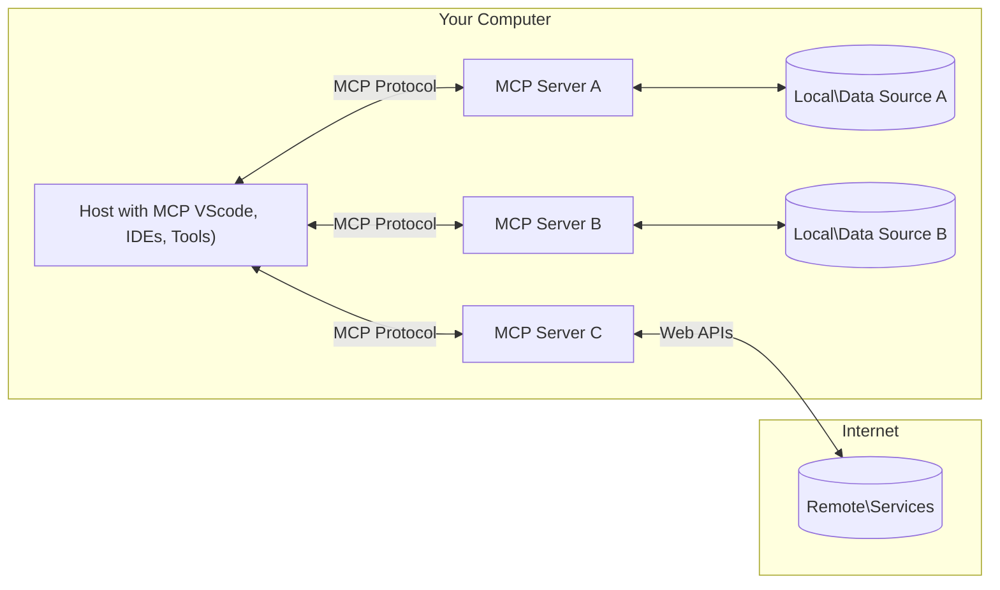

<!--
CO_OP_TRANSLATOR_METADATA:
{
  "original_hash": "355b12a5970c5c9e6db0bee970c751ba",
  "translation_date": "2025-07-13T15:47:39+00:00",
  "source_file": "01-CoreConcepts/README.md",
  "language_code": "ur"
}
-->
# 📖 MCP کور تصورات: AI انضمام کے لیے ماڈل کانٹیکسٹ پروٹوکول میں مہارت حاصل کرنا

[Model Context Protocol (MCP)](https://github.com/modelcontextprotocol) ایک طاقتور، معیاری فریم ورک ہے جو بڑے زبان کے ماڈلز (LLMs) اور بیرونی ٹولز، ایپلیکیشنز، اور ڈیٹا ذرائع کے درمیان مواصلات کو بہتر بناتا ہے۔ یہ SEO کے لیے بہتر بنایا گیا گائیڈ آپ کو MCP کے بنیادی تصورات سے روشناس کرائے گا، تاکہ آپ اس کی کلائنٹ-سرور آرکیٹیکچر، اہم اجزاء، مواصلاتی طریقہ کار، اور نفاذ کی بہترین مشقوں کو سمجھ سکیں۔

## جائزہ

یہ سبق ماڈل کانٹیکسٹ پروٹوکول (MCP) کے ماحولیاتی نظام کی بنیادی ساخت اور اجزاء کا جائزہ لیتا ہے۔ آپ کلائنٹ-سرور آرکیٹیکچر، کلیدی اجزاء، اور مواصلاتی طریقہ کار کے بارے میں جانیں گے جو MCP کے تعاملات کو چلانے میں مدد دیتے ہیں۔

## 👩‍🎓 اہم تعلیمی مقاصد

اس سبق کے اختتام تک، آپ:

- MCP کلائنٹ-سرور آرکیٹیکچر کو سمجھیں گے۔
- Hosts، Clients، اور Servers کے کردار اور ذمہ داریوں کی شناخت کریں گے۔
- MCP کو ایک لچکدار انضمامی پرت بنانے والی بنیادی خصوصیات کا تجزیہ کریں گے۔
- MCP ماحولیاتی نظام میں معلومات کے بہاؤ کو سمجھیں گے۔
- .NET، Java، Python، اور JavaScript میں کوڈ مثالوں کے ذریعے عملی بصیرت حاصل کریں گے۔

## 🔎 MCP آرکیٹیکچر: ایک گہرا جائزہ

MCP ماحولیاتی نظام کلائنٹ-سرور ماڈل پر مبنی ہے۔ یہ ماڈیولر ساخت AI ایپلیکیشنز کو ٹولز، ڈیٹا بیسز، APIs، اور سیاق و سباق کے وسائل کے ساتھ مؤثر طریقے سے بات چیت کرنے کی اجازت دیتی ہے۔ آئیے اس آرکیٹیکچر کو اس کے بنیادی اجزاء میں تقسیم کرتے ہیں۔

بنیادی طور پر، MCP کلائنٹ-سرور آرکیٹیکچر کی پیروی کرتا ہے جہاں ایک میزبان ایپلیکیشن متعدد سرورز سے جڑ سکتی ہے:



- **MCP Hosts**: ایسے پروگرامز جیسے VSCode، Claude Desktop، IDEs، یا AI ٹولز جو MCP کے ذریعے ڈیٹا تک رسائی چاہتے ہیں
- **MCP Clients**: پروٹوکول کلائنٹس جو سرورز کے ساتھ 1:1 کنکشن برقرار رکھتے ہیں
- **MCP Servers**: ہلکے پھلکے پروگرامز جو معیاری Model Context Protocol کے ذریعے مخصوص صلاحیتیں فراہم کرتے ہیں
- **Local Data Sources**: آپ کے کمپیوٹر کی فائلیں، ڈیٹا بیسز، اور سروسز جن تک MCP سرورز محفوظ طریقے سے رسائی حاصل کر سکتے ہیں
- **Remote Services**: بیرونی نظام جو انٹرنیٹ کے ذریعے دستیاب ہیں اور MCP سرورز APIs کے ذریعے ان سے جڑ سکتے ہیں۔

MCP پروٹوکول ایک ترقی پذیر معیار ہے، آپ تازہ ترین اپ ڈیٹس [protocol specification](https://modelcontextprotocol.io/specification/2025-06-18/) پر دیکھ سکتے ہیں۔

### 1. Hosts

Model Context Protocol (MCP) میں، Hosts ایک اہم کردار ادا کرتے ہیں کیونکہ یہ وہ بنیادی انٹرفیس ہیں جن کے ذریعے صارفین پروٹوکول کے ساتھ تعامل کرتے ہیں۔ Hosts وہ ایپلیکیشنز یا ماحولیات ہیں جو MCP سرورز کے ساتھ کنکشن شروع کرتے ہیں تاکہ ڈیٹا، ٹولز، اور پرامپٹس تک رسائی حاصل کی جا سکے۔ Hosts کی مثالوں میں Visual Studio Code جیسے انٹیگریٹڈ ڈیولپمنٹ انوائرنمنٹس (IDEs)، Claude Desktop جیسے AI ٹولز، یا مخصوص کاموں کے لیے بنائے گئے کسٹم ایجنٹس شامل ہیں۔

**Hosts** وہ LLM ایپلیکیشنز ہیں جو کنکشن شروع کرتی ہیں۔ یہ:

- AI ماڈلز کے ساتھ تعامل یا ان پر عمل کر کے جوابات تیار کرتی ہیں۔
- MCP سرورز کے ساتھ کنکشن شروع کرتی ہیں۔
- گفتگو کے بہاؤ اور یوزر انٹرفیس کا انتظام کرتی ہیں۔
- اجازت اور سیکیورٹی پابندیوں کو کنٹرول کرتی ہیں۔
- ڈیٹا شیئرنگ اور ٹول کے نفاذ کے لیے صارف کی رضامندی کو سنبھالتی ہیں۔

### 2. Clients

Clients وہ اہم اجزاء ہیں جو Hosts اور MCP سرورز کے درمیان تعامل کو آسان بناتے ہیں۔ Clients ثالث کا کردار ادا کرتے ہیں، جس سے Hosts کو MCP سرورز کی فراہم کردہ فعالیت تک رسائی اور استعمال ممکن ہوتا ہے۔ یہ MCP آرکیٹیکچر میں ہموار مواصلات اور مؤثر ڈیٹا تبادلے کو یقینی بنانے میں اہم کردار ادا کرتے ہیں۔

**Clients** میزبان ایپلیکیشن کے اندر کنیکٹرز ہوتے ہیں۔ یہ:

- سرورز کو پرامپٹس/ہدایات کے ساتھ درخواستیں بھیجتے ہیں۔
- سرورز کے ساتھ صلاحیتوں پر بات چیت کرتے ہیں۔
- ماڈلز سے ٹول کے نفاذ کی درخواستوں کا انتظام کرتے ہیں۔
- صارفین کو جوابات پروسیس اور دکھاتے ہیں۔

### 3. Servers

Servers MCP کلائنٹس کی درخواستوں کو سنبھالتے ہیں اور مناسب جوابات فراہم کرتے ہیں۔ یہ مختلف آپریشنز جیسے ڈیٹا بازیافت، ٹول کا نفاذ، اور پرامپٹ جنریشن کو منظم کرتے ہیں۔ Servers اس بات کو یقینی بناتے ہیں کہ کلائنٹس اور Hosts کے درمیان مواصلات مؤثر اور قابل اعتماد ہوں، اور تعامل کے عمل کی سالمیت برقرار رہے۔

**Servers** وہ سروسز ہیں جو سیاق و سباق اور صلاحیتیں فراہم کرتی ہیں۔ یہ:

- دستیاب خصوصیات (وسائل، پرامپٹس، ٹولز) کو رجسٹر کرتے ہیں۔
- کلائنٹ سے ٹول کالز وصول کرتے اور ان پر عمل کرتے ہیں۔
- ماڈل کے جوابات کو بہتر بنانے کے لیے سیاق و سباق کی معلومات فراہم کرتے ہیں۔
- نتائج واپس کلائنٹ کو بھیجتے ہیں۔
- ضرورت پڑنے پر تعاملات کے دوران حالت کو برقرار رکھتے ہیں۔

Servers کو کوئی بھی تیار کر سکتا ہے تاکہ ماڈل کی صلاحیتوں کو مخصوص فعالیت کے ساتھ بڑھایا جا سکے۔

### 4. Server Features

Model Context Protocol (MCP) میں Servers بنیادی بلاکس فراہم کرتے ہیں جو کلائنٹس، Hosts، اور زبان کے ماڈلز کے درمیان بھرپور تعاملات کو ممکن بناتے ہیں۔ یہ خصوصیات MCP کی صلاحیتوں کو منظم سیاق و سباق، ٹولز، اور پرامپٹس فراہم کر کے بڑھاتی ہیں۔

MCP سرورز درج ذیل خصوصیات میں سے کوئی بھی فراہم کر سکتے ہیں:

#### 📑 Resources

Model Context Protocol (MCP) میں Resources مختلف قسم کے سیاق و سباق اور ڈیٹا کو شامل کرتے ہیں جنہیں صارفین یا AI ماڈلز استعمال کر سکتے ہیں۔ ان میں شامل ہیں:

- **سیاق و سباق کا ڈیٹا**: معلومات اور سیاق و سباق جو صارفین یا AI ماڈلز فیصلہ سازی اور کام انجام دینے کے لیے استعمال کر سکتے ہیں۔
- **علمی بنیادیں اور دستاویزی ذخائر**: منظم اور غیر منظم ڈیٹا کے مجموعے، جیسے مضامین، دستی، اور تحقیقی مقالے، جو قیمتی بصیرت اور معلومات فراہم کرتے ہیں۔
- **مقامی فائلیں اور ڈیٹا بیسز**: وہ ڈیٹا جو مقامی طور پر ڈیوائسز یا ڈیٹا بیسز میں محفوظ ہوتا ہے، جس تک پروسیسنگ اور تجزیہ کے لیے رسائی حاصل کی جا سکتی ہے۔
- **APIs اور ویب سروسز**: بیرونی انٹرفیسز اور سروسز جو اضافی ڈیٹا اور فعالیت فراہم کرتی ہیں، مختلف آن لائن وسائل اور ٹولز کے ساتھ انضمام کو ممکن بناتی ہیں۔

ایک resource کی مثال ایک ڈیٹا بیس اسکیمہ یا فائل ہو سکتی ہے جس تک اس طرح رسائی حاصل کی جا سکتی ہے:

```text
file://log.txt
database://schema
```

### 🤖 Prompts

Model Context Protocol (MCP) میں Prompts مختلف پہلے سے طے شدہ ٹیمپلیٹس اور تعامل کے نمونے شامل ہیں جو صارف کے ورک فلو کو آسان بنانے اور مواصلات کو بہتر بنانے کے لیے ڈیزائن کیے گئے ہیں۔ ان میں شامل ہیں:

- **ٹیمپلیٹ شدہ پیغامات اور ورک فلو**: پہلے سے منظم پیغامات اور عمل جو صارفین کو مخصوص کاموں اور تعاملات کے دوران رہنمائی کرتے ہیں۔
- **پہلے سے طے شدہ تعامل کے نمونے**: معیاری عمل اور جوابات کے سلسلے جو مستقل اور مؤثر مواصلات کو آسان بناتے ہیں۔
- **خصوصی گفتگو کے ٹیمپلیٹس**: مخصوص قسم کی گفتگو کے لیے حسب ضرورت ٹیمپلیٹس، جو متعلقہ اور سیاق و سباق کے مطابق تعاملات کو یقینی بناتے ہیں۔

ایک پرامپٹ ٹیمپلیٹ اس طرح دکھائی دے سکتا ہے:

```markdown
Generate a product slogan based on the following {{product}} with the following {{keywords}}
```

#### ⛏️ Tools

Model Context Protocol (MCP) میں Tools وہ فنکشنز ہیں جنہیں AI ماڈل مخصوص کام انجام دینے کے لیے چلا سکتا ہے۔ یہ ٹولز AI ماڈل کی صلاحیتوں کو منظم اور قابل اعتماد آپریشنز فراہم کر کے بڑھانے کے لیے ڈیزائن کیے گئے ہیں۔ اہم پہلو یہ ہیں:

- **AI ماڈل کے لیے قابل عمل فنکشنز**: ٹولز قابل عمل فنکشنز ہوتے ہیں جنہیں AI ماڈل مختلف کاموں کے لیے کال کر سکتا ہے۔
- **منفرد نام اور وضاحت**: ہر ٹول کا ایک منفرد نام اور تفصیلی وضاحت ہوتی ہے جو اس کے مقصد اور فعالیت کو بیان کرتی ہے۔
- **پیرامیٹرز اور آؤٹ پٹ**: ٹولز مخصوص پیرامیٹرز قبول کرتے ہیں اور منظم آؤٹ پٹ دیتے ہیں، جو مستقل اور متوقع نتائج کو یقینی بناتے ہیں۔
- **مخصوص فنکشنز**: ٹولز مخصوص کام انجام دیتے ہیں جیسے ویب سرچ، حساب کتاب، اور ڈیٹا بیس کی تلاش۔

ایک ٹول کی مثال اس طرح ہو سکتی ہے:

```typescript
server.tool(
  "GetProducts",
  {
    pageSize: z.string().optional(),
    pageCount: z.string().optional()
  }, () => {
    // return results from API
  }
)
```

## Client Features

Model Context Protocol (MCP) میں، کلائنٹس سرورز کو کئی اہم خصوصیات فراہم کرتے ہیں جو پروٹوکول کی مجموعی فعالیت اور تعامل کو بڑھاتی ہیں۔ ان خصوصیات میں سے ایک نمایاں خصوصیت Sampling ہے۔

### 👉 Sampling

- **سرور کی طرف سے شروع کیے گئے ایجنٹک رویے**: کلائنٹس سرورز کو خود مختار طور پر مخصوص اعمال یا رویے شروع کرنے کی اجازت دیتے ہیں، جو نظام کی متحرک صلاحیتوں کو بڑھاتا ہے۔
- **Recursive LLM Interactions**: یہ خصوصیت بڑے زبان کے ماڈلز (LLMs) کے ساتھ تکراری تعاملات کی اجازت دیتی ہے، جو کاموں کی زیادہ پیچیدہ اور تکراری پروسیسنگ کو ممکن بناتی ہے۔
- **اضافی ماڈل مکمل کرنے کی درخواست**: سرورز ماڈل سے اضافی مکملات کی درخواست کر سکتے ہیں، تاکہ جوابات مکمل اور سیاق و سباق کے مطابق ہوں۔

## MCP میں معلومات کا بہاؤ

Model Context Protocol (MCP) میزبانوں، کلائنٹس، سرورز، اور ماڈلز کے درمیان معلومات کے منظم بہاؤ کی وضاحت کرتا ہے۔ اس بہاؤ کو سمجھنا اس بات کو واضح کرتا ہے کہ صارف کی درخواستیں کیسے پروسیس ہوتی ہیں اور بیرونی ٹولز اور ڈیٹا ماڈلز کے جوابات میں کیسے شامل کیے جاتے ہیں۔

- **Host کنکشن شروع کرتا ہے**  
  میزبان ایپلیکیشن (جیسے IDE یا چیٹ انٹرفیس) عام طور پر STDIO، WebSocket، یا کسی اور معاون ٹرانسپورٹ کے ذریعے MCP سرور سے کنکشن قائم کرتا ہے۔

- **صلاحیتوں پر بات چیت**  
  کلائنٹ (جو میزبان میں شامل ہوتا ہے) اور سرور اپنی حمایت شدہ خصوصیات، ٹولز، وسائل، اور پروٹوکول ورژنز کے بارے میں معلومات کا تبادلہ کرتے ہیں۔ اس سے دونوں طرف کو معلوم ہوتا ہے کہ سیشن کے لیے کون سی صلاحیتیں دستیاب ہیں۔

- **صارف کی درخواست**  
  صارف میزبان کے ساتھ تعامل کرتا ہے (مثلاً پرامپٹ یا کمانڈ داخل کرتا ہے)۔ میزبان یہ ان پٹ جمع کرتا ہے اور اسے پروسیسنگ کے لیے کلائنٹ کو بھیجتا ہے۔

- **وسائل یا ٹول کا استعمال**  
  - کلائنٹ سرور سے اضافی سیاق و سباق یا وسائل (جیسے فائلیں، ڈیٹا بیس اندراجات، یا علمی مضامین) طلب کر سکتا ہے تاکہ ماڈل کی سمجھ کو بہتر بنایا جا سکے۔  
  - اگر ماڈل کو لگتا ہے کہ ٹول کی ضرورت ہے (مثلاً ڈیٹا حاصل کرنے، حساب کتاب کرنے، یا API کال کرنے کے لیے)، تو کلائنٹ سرور کو ٹول کال کی درخواست بھیجتا ہے، جس میں ٹول کا نام اور پیرامیٹرز شامل ہوتے ہیں۔

- **سرور کا نفاذ**  
  سرور وسائل یا ٹول کی درخواست وصول کرتا ہے، ضروری آپریشنز انجام دیتا ہے (جیسے فنکشن چلانا، ڈیٹا بیس سے سوال کرنا، یا فائل بازیافت کرنا)، اور نتائج کو منظم شکل میں کلائنٹ کو واپس بھیجتا ہے۔

- **جواب کی تیاری**  
  کلائنٹ سرور کے جوابات (وسائل کا ڈیٹا، ٹول کے نتائج، وغیرہ) کو جاری ماڈل تعامل میں شامل کرتا ہے۔ ماڈل اس معلومات کو استعمال کر کے جامع اور سیاق و سباق کے مطابق جواب تیار کرتا ہے۔

- **نتائج کی پیشکش**  
  میزبان کلائنٹ سے حتمی آؤٹ پٹ وصول کرتا ہے اور اسے صارف کو پیش کرتا ہے، جس میں اکثر ماڈل کا تیار کردہ متن اور ٹول کے نفاذ یا وسائل کی تلاش کے نتائج شامل ہوتے ہیں۔

یہ بہاؤ MCP کو جدید، انٹرایکٹو، اور سیاق و سباق سے آگاہ AI ایپلیکیشنز کی حمایت کرنے کے قابل بناتا ہے، جو ماڈلز کو بیرونی ٹولز اور ڈیٹا ذرائع کے ساتھ بغیر رکاوٹ جوڑتا ہے۔

## پروٹوکول کی تفصیلات

MCP (Model Context Protocol) [JSON-RPC 2.0](https://www.jsonrpc.org/) کے اوپر بنایا گیا ہے، جو میزبانوں، کلائنٹس، اور سرورز کے درمیان مواصلات کے لیے ایک معیاری، زبان سے آزاد پیغام فارمیٹ فراہم کرتا ہے۔ یہ بنیاد مختلف پلیٹ فارمز اور پروگرامنگ زبانوں میں قابل اعتماد، منظم، اور توسیع پذیر تعاملات کو ممکن بناتی ہے۔

### کلیدی پروٹوکول خصوصیات

MCP JSON-RPC 2.0 کو ٹول کال، وسائل تک رسائی، اور پرامپٹ مینجمنٹ کے لیے اضافی کنونشنز کے ساتھ بڑھاتا ہے۔ یہ متعدد ٹرانسپورٹ پرتوں (STDIO، WebSocket، SSE) کی حمایت کرتا ہے اور اجزاء کے درمیان محفوظ، توسیع پذیر، اور زبان سے آزاد مواصلات کو ممکن بناتا ہے۔

#### 🧢 بنیادی پروٹوکول

- **JSON-RPC میسج فارمیٹ**: تمام درخواستیں اور جوابات JSON-RPC 2.0 وضاحت کے مطابق ہوتے ہیں، جو طریقہ کار کی کالز، پیرامیٹرز، نتائج، اور ایرر ہینڈلنگ کے لیے مستقل ساخت کو یقینی بناتا ہے۔
- **حالت دار کنکشنز**: MCP سیشن متعدد درخواستوں کے دوران حالت کو برقرار رکھتے ہیں، جو جاری گفتگو، سیاق و سباق کے جمع ہونے، اور وسائل کے انتظام کی حمایت کرتے ہیں۔
- **صلاحیتوں پر بات چیت**: کنکشن کے قیام کے دوران، کلائنٹس اور سرورز اپنی حمایت شدہ خصوصیات، پروٹوکول ورژنز، دستیاب ٹولز، اور وسائل کے بارے میں معلومات کا تبادلہ کرتے ہیں۔ اس سے دونوں طرف کو ایک دوسرے کی صلاحیتوں کا علم ہوتا ہے اور وہ مطابق ڈھل سکتے ہیں۔

#### ➕ اضافی سہولیات

ذیل میں کچھ اضافی سہولیات اور پروٹوکول کی توسیعات ہیں جو MCP ڈویلپر کے تجربے کو بہتر بنانے اور جدید منظرناموں کو ممکن بنانے کے لیے فراہم کرتا ہے:

- **تشکیلی اختیارات**: MCP سیشن پیرامیٹرز کی متحرک تشکیل کی اجازت دیتا ہے، جیسے ٹول کی اجازتیں، وسائل تک رسائی، اور ماڈل کی ترتیبات، جو ہر تعامل کے مطابق ہوتی ہیں۔
- **پیش رفت کی نگرانی**: طویل مدتی آپریشنز پیش رفت کی تازہ کاریوں کی اطلاع دے سکتے ہیں، جو پیچیدہ کاموں کے دوران جوابدہ یوزر انٹرفیس اور بہتر صارف تجربہ فراہم کرتا ہے۔
- **درخواست منسوخی**: کلائنٹس چل رہی درخواستوں کو منسوخ کر سکتے ہیں، جس سے صارفین کو غیر ضروری یا طویل عمل کو روکنے کی سہولت ملتی ہے۔
- **خرابی کی رپورٹنگ**: معیاری خرابی کے پیغامات اور کوڈز مسائل کی تشخیص، ناکامیوں کو مؤثر طریقے سے سنبھالنے، اور صارفین و ڈویلپرز کو قابل عمل فیڈبیک فراہم کرنے میں مدد دیتے ہیں۔
- **لاگنگ**: کلائنٹس اور سرورز دونوں آڈٹ، ڈیبگنگ، اور پروٹوکول تعاملات کی نگرانی کے لیے منظم لاگز جاری کر سکتے ہیں۔

ان پروٹوکول خصوصیات کا فائدہ اٹھا کر، MCP زبان کے ماڈلز اور بیرونی ٹولز یا ڈیٹا ذرائع کے درمیان مضبوط، محفوظ، اور لچکدار مواصلات کو یقینی بناتا ہے۔

### 🔐 سیکیورٹی کے پہلو

MCP کے نفاذ کو محفوظ اور قابل اعتماد تعاملات کو یقینی بنانے کے لیے چند اہم سیکیورٹی اصولوں کی پابندی کرنی چاہیے:

- **صارف کی رضامندی اور کنٹرول**: کسی بھی ڈیٹا تک رسائی یا آپریشنز کرنے سے پہلے صارف کی واضح رضامندی ضروری ہے۔ صارفین کو یہ واضح کنٹرول حاصل ہونا چاہیے کہ کون سا ڈیٹا شیئر کیا جا رہا ہے اور کون سے اقدامات کی اجازت دی گئی ہے، جس کی حمایت جائزہ لینے اور منظ
MCP میں پروٹوکول کے دوران سیکیورٹی اور اجازت کے انتظام کے لیے کئی بلٹ ان تصورات اور طریقہ کار شامل ہیں:

1. **ٹول پرمیشن کنٹرول**:  
  کلائنٹس یہ بتا سکتے ہیں کہ ماڈل کو سیشن کے دوران کون سے ٹول استعمال کرنے کی اجازت ہے۔ اس سے یہ یقینی بنتا ہے کہ صرف واضح طور پر مجاز ٹولز تک رسائی ہو، جس سے غیر ارادی یا غیر محفوظ کارروائیوں کا خطرہ کم ہو جاتا ہے۔ اجازتیں صارف کی ترجیحات، تنظیمی پالیسیوں، یا تعامل کے سیاق و سباق کی بنیاد پر متحرک طور پر ترتیب دی جا سکتی ہیں۔

2. **تصدیق**:  
  سرورز ٹولز، وسائل، یا حساس کارروائیوں تک رسائی دینے سے پہلے تصدیق کا تقاضا کر سکتے ہیں۔ اس میں API کیز، OAuth ٹوکنز، یا دیگر تصدیقی طریقے شامل ہو سکتے ہیں۔ مناسب تصدیق اس بات کو یقینی بناتی ہے کہ صرف قابل اعتماد کلائنٹس اور صارفین سرور کی صلاحیتوں کو استعمال کر سکیں۔

3. **تصدیق کاری**:  
  تمام ٹول کالز کے لیے پیرامیٹرز کی تصدیق لازمی ہے۔ ہر ٹول اپنے پیرامیٹرز کی متوقع اقسام، فارمیٹس، اور حدود کی وضاحت کرتا ہے، اور سرور آنے والی درخواستوں کی اس کے مطابق جانچ کرتا ہے۔ اس سے خراب یا نقصان دہ ان پٹ کو ٹول کے نفاذ تک پہنچنے سے روکا جاتا ہے اور کارروائیوں کی سالمیت برقرار رہتی ہے۔

4. **ریٹ لمٹنگ**:  
  غلط استعمال کو روکنے اور سرور کے وسائل کے منصفانہ استعمال کو یقینی بنانے کے لیے، MCP سرورز ٹول کالز اور وسائل تک رسائی پر ریٹ لمٹنگ نافذ کر سکتے ہیں۔ ریٹ لمٹس صارف، سیشن، یا عالمی سطح پر لاگو کی جا سکتی ہیں، اور ڈینائل آف سروس حملوں یا وسائل کے حد سے زیادہ استعمال سے بچاؤ میں مدد دیتی ہیں۔

ان طریقہ کار کو ملا کر، MCP زبان کے ماڈلز کو بیرونی ٹولز اور ڈیٹا ذرائع کے ساتھ محفوظ طریقے سے مربوط کرنے کی بنیاد فراہم کرتا ہے، جبکہ صارفین اور ڈویلپرز کو رسائی اور استعمال پر باریک کنٹرول دیتا ہے۔

## پروٹوکول پیغامات

MCP مواصلات میں کلائنٹس، سرورز، اور ماڈلز کے درمیان واضح اور قابل اعتماد تعامل کے لیے منظم JSON پیغامات استعمال ہوتے ہیں۔ اہم پیغام کی اقسام درج ذیل ہیں:

- **کلائنٹ درخواست**  
  کلائنٹ کی جانب سے سرور کو بھیجا جاتا ہے، اس پیغام میں عام طور پر شامل ہوتا ہے:  
  - صارف کا پرامپٹ یا کمانڈ  
  - سیاق و سباق کے لیے گفتگو کی تاریخ  
  - ٹول کی ترتیب اور اجازتیں  
  - کوئی اضافی میٹا ڈیٹا یا سیشن کی معلومات

- **ماڈل جواب**  
  ماڈل کی جانب سے (کلائنٹ کے ذریعے) واپس کیا جاتا ہے، اس پیغام میں شامل ہوتا ہے:  
  - پرامپٹ اور سیاق و سباق کی بنیاد پر تیار کردہ متن یا مکمل شدہ مواد  
  - اگر ماڈل نے فیصلہ کیا کہ ٹول کو کال کرنا چاہیے تو اختیاری ٹول کال ہدایات  
  - وسائل یا اضافی سیاق و سباق کے حوالے حسب ضرورت

- **ٹول درخواست**  
  جب ٹول کو چلانے کی ضرورت ہو تو کلائنٹ کی جانب سے سرور کو بھیجی جاتی ہے۔ اس پیغام میں شامل ہوتا ہے:  
  - کال کیے جانے والے ٹول کا نام  
  - ٹول کے لیے درکار پیرامیٹرز (ٹول کے اسکیمہ کے مطابق تصدیق شدہ)  
  - درخواست کی نگرانی کے لیے سیاق و سباق یا شناخت کنندگان

- **ٹول جواب**  
  ٹول کے نفاذ کے بعد سرور کی جانب سے واپس کیا جاتا ہے۔ اس پیغام میں شامل ہوتا ہے:  
  - ٹول کے نفاذ کے نتائج (منظم شدہ ڈیٹا یا مواد)  
  - اگر ٹول کال ناکام ہوئی تو کوئی غلطیاں یا اسٹیٹس کی معلومات  
  - اختیاری طور پر، نفاذ سے متعلق اضافی میٹا ڈیٹا یا لاگز

یہ منظم پیغامات MCP ورک فلو کے ہر مرحلے کو واضح، قابلِ سراغ، اور قابلِ توسیع بناتے ہیں، جو ملٹی ٹرن گفتگو، ٹول چیننگ، اور مضبوط غلطی سنبھالنے جیسے پیچیدہ حالات کی حمایت کرتے ہیں۔

## اہم نکات

- MCP کلائنٹ-سرور آرکیٹیکچر استعمال کرتا ہے تاکہ ماڈلز کو بیرونی صلاحیتوں سے جوڑا جا سکے  
- ماحولیاتی نظام میں کلائنٹس، ہوسٹس، سرورز، ٹولز، اور ڈیٹا ذرائع شامل ہیں  
- مواصلات STDIO، SSE، یا WebSockets کے ذریعے ہو سکتی ہے  
- ٹولز وہ بنیادی یونٹس ہیں جو ماڈلز کو فنکشنلٹی فراہم کرتے ہیں  
- منظم مواصلاتی پروٹوکولز مستقل تعاملات کو یقینی بناتے ہیں

## مشق

اپنے شعبے میں مفید ایک سادہ MCP ٹول ڈیزائن کریں۔ وضاحت کریں:  
1. ٹول کا نام کیا ہوگا  
2. یہ کون سے پیرامیٹرز قبول کرے گا  
3. یہ کیا آؤٹ پٹ دے گا  
4. ماڈل اس ٹول کو صارف کے مسائل حل کرنے کے لیے کیسے استعمال کر سکتا ہے

---

## آگے کیا ہے

اگلا: [Chapter 2: Security](../02-Security/README.md)

**دستخطی نوٹ**:  
یہ دستاویز AI ترجمہ سروس [Co-op Translator](https://github.com/Azure/co-op-translator) کے ذریعے ترجمہ کی گئی ہے۔ اگرچہ ہم درستگی کے لیے کوشاں ہیں، براہ کرم آگاہ رہیں کہ خودکار ترجمے میں غلطیاں یا عدم درستیاں ہو سکتی ہیں۔ اصل دستاویز اپنی مادری زبان میں معتبر ماخذ سمجھی جانی چاہیے۔ اہم معلومات کے لیے پیشہ ور انسانی ترجمہ کی سفارش کی جاتی ہے۔ اس ترجمے کے استعمال سے پیدا ہونے والی کسی بھی غلط فہمی یا غلط تشریح کی ذمہ داری ہم پر عائد نہیں ہوتی۔