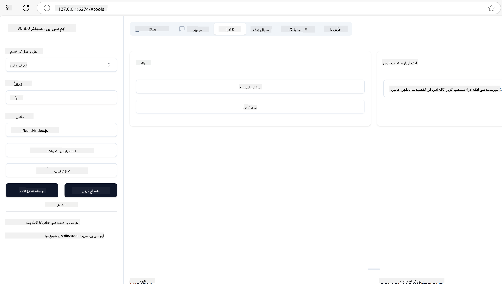
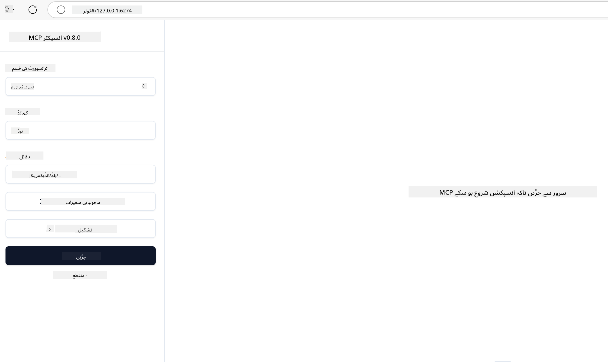

<!--
CO_OP_TRANSLATOR_METADATA:
{
  "original_hash": "5331ffd328a54b90f76706c52b673e27",
  "translation_date": "2025-05-17T08:21:08+00:00",
  "source_file": "03-GettingStarted/01-first-server/README.md",
  "language_code": "ur"
}
-->
# ایم سی پی کے ساتھ شروعات

ماڈل کانٹیکسٹ پروٹوکول (ایم سی پی) کے ساتھ آپ کے پہلے قدموں میں خوش آمدید! چاہے آپ ایم سی پی کے لیے نئے ہیں یا اپنی سمجھ کو گہرا کرنا چاہتے ہیں، یہ گائیڈ آپ کو بنیادی سیٹ اپ اور ترقیاتی عمل کے ذریعے رہنمائی کرے گا۔ آپ دریافت کریں گے کہ ایم سی پی کس طرح اے آئی ماڈلز اور ایپلیکیشنز کے درمیان ہموار انضمام کو فعال کرتا ہے، اور یہ سیکھیں گے کہ ایم سی پی پر مبنی حل بنانے اور جانچنے کے لیے اپنے ماحول کو تیزی سے کیسے تیار کیا جائے۔

> مختصر: اگر آپ اے آئی ایپس بناتے ہیں، تو آپ جانتے ہیں کہ آپ ایل ایل ایم (بڑا لینگویج ماڈل) میں ٹولز اور دیگر وسائل شامل کر سکتے ہیں تاکہ ایل ایل ایم کو زیادہ جانکاری مل سکے۔ تاہم، اگر آپ ان ٹولز اور وسائل کو سرور پر رکھیں، تو ایپ اور سرور کی صلاحیتوں کو کسی بھی کلائنٹ کے ذریعے ایل ایل ایم کے ساتھ یا بغیر استعمال کیا جا سکتا ہے۔

## جائزہ

یہ سبق ایم سی پی ماحول کو ترتیب دینے اور آپ کی پہلی ایم سی پی ایپلیکیشنز بنانے کے بارے میں عملی رہنمائی فراہم کرتا ہے۔ آپ سیکھیں گے کہ ضروری ٹولز اور فریم ورکس کیسے ترتیب دیے جائیں، بنیادی ایم سی پی سرورز کیسے بنائے جائیں، ہوسٹ ایپلیکیشنز کیسے بنائی جائیں، اور اپنی عمل درآمد کی جانچ کیسے کی جائے۔

ماڈل کانٹیکسٹ پروٹوکول (ایم سی پی) ایک اوپن پروٹوکول ہے جو اس بات کو معیاری بناتا ہے کہ ایپلیکیشنز ایل ایل ایمز کو کیسے سیاق و سباق فراہم کرتی ہیں۔ ایم سی پی کو اے آئی ایپلیکیشنز کے لیے یو ایس بی-سی پورٹ کی طرح سمجھیں - یہ مختلف ڈیٹا ذرائع اور ٹولز سے اے آئی ماڈلز کو جوڑنے کا ایک معیاری طریقہ فراہم کرتا ہے۔

## سیکھنے کے مقاصد

اس سبق کے آخر تک، آپ قابل ہوں گے:

- سی#, جاوا، پائتھن، ٹائپ اسکرپٹ، اور جاوا اسکرپٹ میں ایم سی پی کے لیے ترقیاتی ماحول ترتیب دیں
- اپنی مرضی کے خصوصیات (وسائل، پرامپٹس، اور ٹولز) کے ساتھ بنیادی ایم سی پی سرورز بنائیں اور تعینات کریں
- ایم سی پی سرورز سے منسلک ہوسٹ ایپلیکیشنز بنائیں
- ایم سی پی عمل درآمد کی جانچ اور ڈیبگ کریں

## آپ کا ایم سی پی ماحول ترتیب دینا

ایم سی پی کے ساتھ کام کرنے سے پہلے، اپنے ترقیاتی ماحول کو تیار کرنا اور بنیادی ورک فلو کو سمجھنا اہم ہے۔ یہ سیکشن آپ کو ایم سی پی کے ساتھ ہموار آغاز کو یقینی بنانے کے لیے ابتدائی سیٹ اپ کے مراحل کے ذریعے رہنمائی کرے گا۔

### ضروریات

ایم سی پی کی ترقی میں غوطہ لگانے سے پہلے، اس بات کو یقینی بنائیں کہ آپ کے پاس ہے:

- **ترقیاتی ماحول**: آپ کی منتخب کردہ زبان کے لیے (سی#, جاوا، پائتھن، ٹائپ اسکرپٹ، یا جاوا اسکرپٹ)
- **آئی ڈی ای/ایڈیٹر**: ویژول اسٹوڈیو، ویژول اسٹوڈیو کوڈ، انٹیلی جے، ایکلیپس، پائی چارم، یا کوئی جدید کوڈ ایڈیٹر
- **پیکیج مینیجرز**: نیوگیٹ، میون/گریڈل، پپ، یا این پی ایم/یارن
- **اے آئی سروسز کے لیے اے پی آئی کیز**: آپ کی میزبان ایپلیکیشنز میں استعمال کرنے کے لیے

## بنیادی ایم سی پی سرور کی ساخت

ایک ایم سی پی سرور عام طور پر شامل ہوتا ہے:

- **سرور کنفیگریشن**: پورٹ، تصدیق، اور دیگر ترتیبات کی سیٹ اپ
- **وسائل**: ایل ایل ایمز کو دستیاب ڈیٹا اور سیاق و سباق
- **ٹولز**: فعالیت جو ماڈلز کو استعمال کر سکتے ہیں
- **پرامپٹس**: متن تیار کرنے یا اس کی ساخت کے لیے ٹیمپلیٹس

یہاں ٹائپ اسکرپٹ میں ایک سادہ مثال ہے:

```typescript
import { Server, Tool, Resource } from "@modelcontextprotocol/typescript-server-sdk";

// Create a new MCP server
const server = new Server({
  port: 3000,
  name: "Example MCP Server",
  version: "1.0.0"
});

// Register a tool
server.registerTool({
  name: "calculator",
  description: "Performs basic calculations",
  parameters: {
    expression: {
      type: "string",
      description: "The math expression to evaluate"
    }
  },
  handler: async (params) => {
    const result = eval(params.expression);
    return { result };
  }
});

// Start the server
server.start();
```

پہلے کے کوڈ میں ہم:

- ایم سی پی ٹائپ اسکرپٹ ایس ڈی کے سے ضروری کلاسیں درآمد کرتے ہیں۔
- ایک نیا ایم سی پی سرور انسٹنس بناتے اور ترتیب دیتے ہیں۔
- ایک کسٹم ٹول (`calculator`) کو ہینڈلر فنکشن کے ساتھ رجسٹر کرتے ہیں۔
- آنے والی ایم سی پی درخواستوں کے لیے سننے کے لیے سرور کو شروع کرتے ہیں۔

## جانچ اور ڈیبگنگ

اپنے ایم سی پی سرور کی جانچ شروع کرنے سے پہلے، دستیاب ٹولز اور ڈیبگنگ کے بہترین طریقوں کو سمجھنا اہم ہے۔ مؤثر جانچ اس بات کو یقینی بناتی ہے کہ آپ کا سرور متوقع طور پر برتاؤ کرتا ہے اور آپ کو مسائل کی جلدی شناخت اور حل کرنے میں مدد کرتا ہے۔ درج ذیل سیکشن آپ کے ایم سی پی عمل درآمد کی توثیق کے لیے تجویز کردہ طریقوں کا خاکہ پیش کرتا ہے۔

ایم سی پی آپ کے سرورز کی جانچ اور ڈیبگ کرنے میں مدد کے لیے ٹولز فراہم کرتا ہے:

- **انسپکٹر ٹول**، یہ گرافیکل انٹرفیس آپ کو اپنے سرور سے منسلک ہونے اور اپنے ٹولز، پرامپٹس، اور وسائل کی جانچ کرنے کی اجازت دیتا ہے۔
- **curl**، آپ کمانڈ لائن ٹول جیسے curl یا دیگر کلائنٹس کا استعمال کرکے بھی اپنے سرور سے منسلک ہو سکتے ہیں جو HTTP کمانڈز بنا اور چلا سکتے ہیں۔

### ایم سی پی انسپکٹر کا استعمال

[MCP انسپکٹر](https://github.com/modelcontextprotocol/inspector) ایک بصری جانچ کا ٹول ہے جو آپ کی مدد کرتا ہے:

1. **سرور کی صلاحیتوں کی دریافت**: دستیاب وسائل، ٹولز، اور پرامپٹس کو خودکار طریقے سے دریافت کریں
2. **ٹول کی عمل درآمد کی جانچ**: مختلف پیرامیٹرز کو آزمائیں اور حقیقی وقت میں جوابات دیکھیں
3. **سرور میٹا ڈیٹا دیکھیں**: سرور کی معلومات، اسکیمہ، اور کنفیگریشنز کا معائنہ کریں

```bash
# ex TypeScript, installing and running MCP Inspector
npx @modelcontextprotocol/inspector node build/index.js
```

جب آپ اوپر دی گئی کمانڈز کو چلاتے ہیں، تو ایم سی پی انسپکٹر آپ کے براؤزر میں ایک مقامی ویب انٹرفیس لانچ کرے گا۔ آپ اپنے رجسٹرڈ ایم سی پی سرورز، ان کے دستیاب ٹولز، وسائل، اور پرامپٹس کو دکھانے والے ڈیش بورڈ کی توقع کر سکتے ہیں۔ انٹرفیس آپ کو انٹرایکٹیو طور پر ٹول کی عمل درآمد کی جانچ کرنے، سرور میٹا ڈیٹا کا معائنہ کرنے، اور حقیقی وقت کے جوابات دیکھنے کی اجازت دیتا ہے، جس سے آپ کے ایم سی پی سرور عمل درآمد کی توثیق اور ڈیبگنگ کو آسان بنایا جاتا ہے۔

یہاں ایک اسکرین شاٹ ہے کہ یہ کیسا نظر آ سکتا ہے:



## عام سیٹ اپ کے مسائل اور حل

| مسئلہ | ممکنہ حل |
|-------|-----------|
| کنکشن مسترد | چیک کریں کہ سرور چل رہا ہے اور پورٹ درست ہے |
| ٹول کی عمل درآمد کی غلطیاں | پیرامیٹر کی توثیق اور غلطی کے ہینڈلنگ کا جائزہ لیں |
| تصدیق کی ناکامیاں | اے پی آئی کیز اور اجازتوں کی تصدیق کریں |
| اسکیمہ کی توثیق کی غلطیاں | اس بات کو یقینی بنائیں کہ پیرامیٹرز متعین کردہ اسکیمہ سے میل کھاتے ہیں |
| سرور شروع نہیں ہو رہا | پورٹ کے تنازعات یا لاپتہ انحصارات کی جانچ کریں |
| CORS کی غلطیاں | کراس-اورجن درخواستوں کے لیے مناسب CORS ہیڈرز کی ترتیب دیں |
| تصدیق کے مسائل | ٹوکن کی درستگی اور اجازتوں کی تصدیق کریں |

## مقامی ترقی

مقامی ترقی اور جانچ کے لیے، آپ اپنے کمپیوٹر پر براہ راست ایم سی پی سرورز چلا سکتے ہیں:

1. **سرور عمل شروع کریں**: اپنے ایم سی پی سرور ایپلیکیشن کو چلائیں
2. **نیٹ ورکنگ کی ترتیب دیں**: اس بات کو یقینی بنائیں کہ سرور متوقع پورٹ پر قابل رسائی ہے
3. **کلائنٹس کو جوڑیں**: مقامی کنکشن یو آر ایل جیسے `http://localhost:3000` استعمال کریں

```bash
# Example: Running a TypeScript MCP server locally
npm run start
# Server running at http://localhost:3000
```

## اپنا پہلا ایم سی پی سرور بنانا

ہم نے پچھلے سبق میں [بنیادی تصورات](/01-CoreConcepts/README.md) کا احاطہ کیا ہے، اب وقت ہے کہ اس علم کو عملی جامہ پہنائیں۔

### سرور کیا کر سکتا ہے

کوڈ لکھنا شروع کرنے سے پہلے، آئیے خود کو یاد دلا دیں کہ سرور کیا کر سکتا ہے:

ایک ایم سی پی سرور مثال کے طور پر:

- مقامی فائلوں اور ڈیٹا بیس تک رسائی حاصل کر سکتا ہے
- ریموٹ اے پی آئیز سے جڑ سکتا ہے
- حساب کتاب کر سکتا ہے
- دیگر ٹولز اور خدمات کے ساتھ انضمام کر سکتا ہے
- تعامل کے لیے صارف انٹرفیس فراہم کر سکتا ہے

زبردست، اب جب کہ ہم جانتے ہیں کہ ہم اس کے لیے کیا کر سکتے ہیں، آئیے کوڈنگ شروع کریں۔

## مشق: سرور بنانا

سرور بنانے کے لیے، آپ کو ان مراحل کی پیروی کرنی ہوگی:

- ایم سی پی ایس ڈی کے انسٹال کریں۔
- ایک پروجیکٹ بنائیں اور پروجیکٹ کا ڈھانچہ ترتیب دیں۔
- سرور کوڈ لکھیں۔
- سرور کی جانچ کریں۔

### -1- ایس ڈی کے انسٹال کریں

یہ آپ کے منتخب کردہ رن ٹائم کے لحاظ سے تھوڑا مختلف ہوتا ہے، لہذا نیچے دیے گئے رن ٹائمز میں سے ایک کا انتخاب کریں:

جنریٹیو اے آئی متن، تصاویر، اور یہاں تک کہ کوڈ بھی پیدا کر سکتا ہے۔ آپ اکتوبر 2023 تک ڈیٹا پر تربیت یافتہ ہیں۔

### -2- پروجیکٹ بنائیں

اب جب کہ آپ نے اپنا ایس ڈی کے انسٹال کر لیا ہے، آئیے اگلا پروجیکٹ بنائیں:

### -3- پروجیکٹ فائلیں بنائیں

### -4- سرور کوڈ بنائیں

### -5- ایک ٹول اور ایک وسیلہ شامل کریں

ایک ٹول اور ایک وسیلہ شامل کریں درج ذیل کوڈ شامل کرکے:

### -6 حتمی کوڈ

آئیے وہ آخری کوڈ شامل کریں جس کی ہمیں ضرورت ہے تاکہ سرور شروع ہو سکے:

### -7- سرور کی جانچ کریں

سرور کو درج ذیل کمانڈ کے ساتھ شروع کریں:

### -8- انسپکٹر کا استعمال کرتے ہوئے چلائیں

انسپکٹر ایک بہترین ٹول ہے جو آپ کے سرور کو شروع کر سکتا ہے اور آپ کو اس کے ساتھ تعامل کرنے دیتا ہے تاکہ آپ جانچ سکیں کہ یہ کام کرتا ہے۔ آئیے اسے شروع کریں:

> [!NOTE]
> یہ "کمانڈ" فیلڈ میں مختلف نظر آ سکتا ہے کیونکہ اس میں آپ کے مخصوص رن ٹائم کے ساتھ سرور چلانے کا کمانڈ ہوتا ہے۔

آپ کو درج ذیل یوزر انٹرفیس نظر آنا چاہیے:



1. کنیکٹ بٹن کو منتخب کرکے سرور سے جڑیں
   ایک بار جب آپ سرور سے جڑ جائیں، تو آپ کو اب درج ذیل نظر آنا چاہیے:

   

1. "ٹولز" اور "listTools" کو منتخب کریں، آپ کو "Add" ظاہر ہونا چاہیے، "Add" کو منتخب کریں اور پیرامیٹر کی قدریں بھریں۔

   آپ کو درج ذیل جواب نظر آنا چاہیے، یعنی "add" ٹول سے نتیجہ:

   

مبارک ہو، آپ نے اپنا پہلا سرور بنانے اور چلانے میں کامیابی حاصل کی!

### سرکاری ایس ڈی کے

ایم سی پی متعدد زبانوں کے لیے سرکاری ایس ڈی کے فراہم کرتا ہے:
- [C# SDK](https://github.com/modelcontextprotocol/csharp-sdk) - مائیکروسافٹ کے ساتھ تعاون میں برقرار رکھا گیا
- [Java SDK](https://github.com/modelcontextprotocol/java-sdk) - اسپرنگ اے آئی کے ساتھ تعاون میں برقرار رکھا گیا
- [TypeScript SDK](https://github.com/modelcontextprotocol/typescript-sdk) - سرکاری ٹائپ اسکرپٹ عمل درآمد
- [Python SDK](https://github.com/modelcontextprotocol/python-sdk) - سرکاری پائتھن عمل درآمد
- [Kotlin SDK](https://github.com/modelcontextprotocol/kotlin-sdk) - سرکاری کوٹلین عمل درآمد
- [Swift SDK](https://github.com/modelcontextprotocol/swift-sdk) - لوپ ورک اے آئی کے ساتھ تعاون میں برقرار رکھا گیا
- [Rust SDK](https://github.com/modelcontextprotocol/rust-sdk) - سرکاری رسٹ عمل درآمد

## کلیدی نکات

- ایم سی پی ترقیاتی ماحول کو ترتیب دینا زبان کے مخصوص ایس ڈی کے کے ساتھ سیدھا ہے
- ایم سی پی سرورز بنانا واضح اسکیموں کے ساتھ ٹولز بنانے اور رجسٹر کرنے میں شامل ہوتا ہے
- جانچ اور ڈیبگنگ قابل اعتماد ایم سی پی عمل درآمد کے لیے ضروری ہیں

## نمونے

- [Java Calculator](../samples/java/calculator/README.md)
- [.Net Calculator](../../../../03-GettingStarted/samples/csharp)
- [JavaScript Calculator](../samples/javascript/README.md)
- [TypeScript Calculator](../samples/typescript/README.md)
- [Python Calculator](../../../../03-GettingStarted/samples/python)

## اسائنمنٹ

اپنی پسند کے ٹول کے ساتھ ایک سادہ ایم سی پی سرور بنائیں:
1. اپنے پسندیدہ زبان (.NET، جاوا، پائتھن، یا جاوا اسکرپٹ) میں ٹول کو نافذ کریں۔
2. ان پٹ پیرامیٹرز اور واپسی کی قدریں متعین کریں۔
3. اس بات کو یقینی بنانے کے لیے انسپکٹر ٹول کو چلائیں کہ سرور جیسا کہ ارادہ کیا گیا کام کرتا ہے۔
4. مختلف ان پٹ کے ساتھ عمل درآمد کی جانچ کریں۔

## حل

[حل](./solution/README.md)

## اضافی وسائل

- [MCP GitHub Repository](https://github.com/microsoft/mcp-for-beginners)

## آگے کیا ہے

اگلا: [ایم سی پی کلائنٹس کے ساتھ شروعات](/03-GettingStarted/02-client/README.md)

**دستبرداری**:  
یہ دستاویز AI ترجمہ سروس [Co-op Translator](https://github.com/Azure/co-op-translator) کا استعمال کرتے ہوئے ترجمہ کی گئی ہے۔ ہم درستگی کے لیے کوشاں ہیں، لیکن براہ کرم آگاہ رہیں کہ خودکار ترجمے میں غلطیاں یا غیر درستیاں ہو سکتی ہیں۔ اصل دستاویز کو اس کی مقامی زبان میں مستند ماخذ سمجھا جانا چاہیے۔ اہم معلومات کے لیے، پیشہ ور انسانی ترجمہ کی سفارش کی جاتی ہے۔ ہم اس ترجمے کے استعمال سے پیدا ہونے والی کسی بھی غلط فہمی یا غلط تشریح کے ذمہ دار نہیں ہیں۔