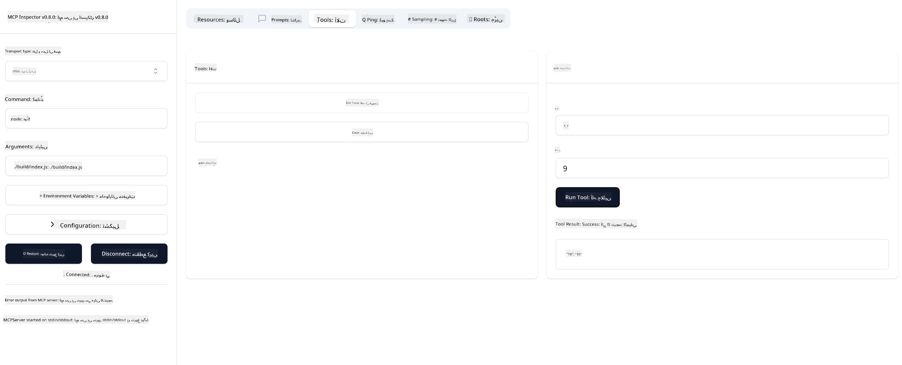

<!--
CO_OP_TRANSLATOR_METADATA:
{
  "original_hash": "315ecce765d22639b60dbc41344c8533",
  "translation_date": "2025-07-09T22:57:08+00:00",
  "source_file": "03-GettingStarted/01-first-server/README.md",
  "language_code": "ur"
}
-->
### -2- پروجیکٹ بنائیں

اب جب کہ آپ نے اپنا SDK انسٹال کر لیا ہے، تو آئیں اگلا قدم یعنی پروجیکٹ بنائیں:

### -3- پروجیکٹ فائلیں بنائیں

### -4- سرور کا کوڈ لکھیں

### -5- ایک ٹول اور ایک ریسورس شامل کریں

مندرجہ ذیل کوڈ شامل کرکے ایک ٹول اور ایک ریسورس شامل کریں:

### -6- آخری کوڈ

آئیے وہ آخری کوڈ شامل کریں جس کی ضرورت ہے تاکہ سرور شروع ہو سکے:

### -7- سرور کی جانچ کریں

مندرجہ ذیل کمانڈ کے ذریعے سرور شروع کریں:

### -8- انسپکٹر کے ذریعے چلائیں

انسپکٹر ایک بہترین ٹول ہے جو آپ کے سرور کو شروع کرتا ہے اور آپ کو اس کے ساتھ تعامل کرنے دیتا ہے تاکہ آپ جانچ سکیں کہ یہ کام کر رہا ہے۔ آئیے اسے شروع کریں:
> [!NOTE]
> یہ "command" فیلڈ میں مختلف نظر آ سکتا ہے کیونکہ اس میں آپ کے مخصوص runtime کے ساتھ سرور چلانے کا کمانڈ شامل ہوتا ہے۔
آپ کو درج ذیل یوزر انٹرفیس نظر آنا چاہیے:

1. Connect بٹن کو منتخب کرکے سرور سے جڑیں  
  جب آپ سرور سے جڑ جائیں گے، تو آپ کو درج ذیل نظر آئے گا:

  

1. "Tools" اور پھر "listTools" کو منتخب کریں، آپ کو "Add" نظر آئے گا، "Add" کو منتخب کریں اور پیرامیٹر کی قدریں بھر دیں۔

  آپ کو درج ذیل جواب نظر آئے گا، یعنی "add" ٹول کا نتیجہ:

  

مبارک ہو، آپ نے اپنا پہلا سرور کامیابی سے بنایا اور چلایا ہے!

### سرکاری SDKs

MCP مختلف زبانوں کے لیے سرکاری SDKs فراہم کرتا ہے:

- [C# SDK](https://github.com/modelcontextprotocol/csharp-sdk) - مائیکروسافٹ کے تعاون سے مینٹین کیا گیا
- [Java SDK](https://github.com/modelcontextprotocol/java-sdk) - Spring AI کے تعاون سے مینٹین کیا گیا
- [TypeScript SDK](https://github.com/modelcontextprotocol/typescript-sdk) - سرکاری TypeScript امپلیمنٹیشن
- [Python SDK](https://github.com/modelcontextprotocol/python-sdk) - سرکاری Python امپلیمنٹیشن
- [Kotlin SDK](https://github.com/modelcontextprotocol/kotlin-sdk) - سرکاری Kotlin امپلیمنٹیشن
- [Swift SDK](https://github.com/modelcontextprotocol/swift-sdk) - Loopwork AI کے تعاون سے مینٹین کیا گیا
- [Rust SDK](https://github.com/modelcontextprotocol/rust-sdk) - سرکاری Rust امپلیمنٹیشن

## اہم نکات

- MCP ڈیولپمنٹ ماحول کی سیٹنگ زبان مخصوص SDKs کے ساتھ آسان ہے  
- MCP سرور بنانے کے لیے ٹولز تخلیق کرنا اور واضح اسکیموں کے ساتھ رجسٹر کرنا ضروری ہے  
- قابل اعتماد MCP امپلیمنٹیشن کے لیے ٹیسٹنگ اور ڈیبگنگ لازمی ہے

## نمونے

- [Java Calculator](../samples/java/calculator/README.md)
- [.Net Calculator](../../../../03-GettingStarted/samples/csharp)
- [JavaScript Calculator](../samples/javascript/README.md)
- [TypeScript Calculator](../samples/typescript/README.md)
- [Python Calculator](../../../../03-GettingStarted/samples/python)

## اسائنمنٹ

اپنی پسند کے ٹول کے ساتھ ایک سادہ MCP سرور بنائیں:

1. اپنی پسندیدہ زبان میں ٹول کو امپلیمنٹ کریں (.NET, Java, Python, یا JavaScript)  
2. ان پٹ پیرامیٹرز اور ریٹرن ویلیوز کی تعریف کریں  
3. انسپکٹر ٹول چلائیں تاکہ سرور کی درستگی کی تصدیق ہو  
4. مختلف ان پٹس کے ساتھ امپلیمنٹیشن کو ٹیسٹ کریں

## حل

[Solution](./solution/README.md)

## اضافی وسائل

- [Azure پر Model Context Protocol کے ذریعے ایجنٹس بنائیں](https://learn.microsoft.com/azure/developer/ai/intro-agents-mcp)
- [Azure Container Apps کے ساتھ Remote MCP (Node.js/TypeScript/JavaScript)](https://learn.microsoft.com/samples/azure-samples/mcp-container-ts/mcp-container-ts/)
- [.NET OpenAI MCP Agent](https://learn.microsoft.com/samples/azure-samples/openai-mcp-agent-dotnet/openai-mcp-agent-dotnet/)

## آگے کیا ہے

اگلا: [MCP کلائنٹس کے ساتھ شروعات](../02-client/README.md)

**دستخطی نوٹ**:  
یہ دستاویز AI ترجمہ سروس [Co-op Translator](https://github.com/Azure/co-op-translator) کے ذریعے ترجمہ کی گئی ہے۔ اگرچہ ہم درستگی کے لیے کوشاں ہیں، براہ کرم آگاہ رہیں کہ خودکار ترجمے میں غلطیاں یا عدم درستیاں ہو سکتی ہیں۔ اصل دستاویز اپنی مادری زبان میں معتبر ماخذ سمجھی جانی چاہیے۔ اہم معلومات کے لیے پیشہ ور انسانی ترجمہ کی سفارش کی جاتی ہے۔ اس ترجمے کے استعمال سے پیدا ہونے والی کسی بھی غلط فہمی یا غلط تشریح کی ذمہ داری ہم پر عائد نہیں ہوتی۔