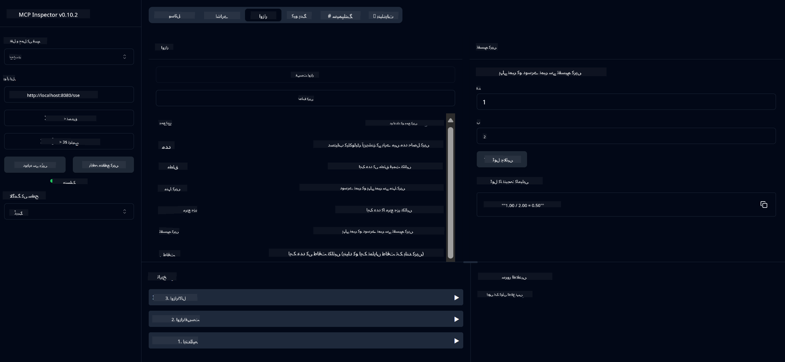

<!--
CO_OP_TRANSLATOR_METADATA:
{
  "original_hash": "fa635ae747c9b4d5c2f61c6c46cb695f",
  "translation_date": "2025-07-17T17:39:23+00:00",
  "source_file": "03-GettingStarted/01-first-server/README.md",
  "language_code": "ur"
}
-->
# MCP کے ساتھ شروعات

Model Context Protocol (MCP) کے ساتھ اپنے پہلے قدموں پر خوش آمدید! چاہے آپ MCP میں نئے ہوں یا اپنی سمجھ کو گہرا کرنا چاہتے ہوں، یہ رہنما آپ کو ضروری سیٹ اپ اور ترقیاتی عمل سے گزاریگا۔ آپ جانیں گے کہ MCP کس طرح AI ماڈلز اور ایپلیکیشنز کے درمیان آسان انضمام ممکن بناتا ہے، اور سیکھیں گے کہ MCP سے چلنے والے حل بنانے اور ٹیسٹ کرنے کے لیے اپنا ماحول کیسے جلدی تیار کیا جائے۔

> TLDR; اگر آپ AI ایپس بناتے ہیں، تو آپ جانتے ہیں کہ آپ اپنے LLM (large language model) میں ٹولز اور دیگر وسائل شامل کر سکتے ہیں تاکہ LLM زیادہ معلوماتی بن جائے۔ تاہم اگر آپ یہ ٹولز اور وسائل سرور پر رکھیں، تو ایپ اور سرور کی صلاحیتیں کسی بھی کلائنٹ کے ذریعے LLM کے ساتھ یا بغیر استعمال کی جا سکتی ہیں۔

## جائزہ

یہ سبق MCP ماحولیات کو سیٹ اپ کرنے اور اپنی پہلی MCP ایپلیکیشنز بنانے کے لیے عملی رہنمائی فراہم کرتا ہے۔ آپ سیکھیں گے کہ ضروری ٹولز اور فریم ورکس کیسے سیٹ اپ کریں، بنیادی MCP سرورز بنائیں، ہوسٹ ایپلیکیشنز تخلیق کریں، اور اپنی امپلیمنٹیشنز کو ٹیسٹ کریں۔

Model Context Protocol (MCP) ایک کھلا پروٹوکول ہے جو ایپلیکیشنز کو LLMs کو کانٹیکسٹ فراہم کرنے کے طریقے کو معیاری بناتا ہے۔ MCP کو AI ایپلیکیشنز کے لیے USB-C پورٹ سمجھیں — یہ AI ماڈلز کو مختلف ڈیٹا ذرائع اور ٹولز سے جوڑنے کا معیاری طریقہ فراہم کرتا ہے۔

## سیکھنے کے مقاصد

اس سبق کے آخر تک، آپ قابل ہوں گے:

- C#, Java, Python, TypeScript، اور JavaScript میں MCP کے لیے ترقیاتی ماحول سیٹ اپ کرنا
- کسٹم خصوصیات (وسائل، پرامپٹس، اور ٹولز) کے ساتھ بنیادی MCP سرورز بنانا اور تعینات کرنا
- MCP سرورز سے جڑنے والی ہوسٹ ایپلیکیشنز تخلیق کرنا
- MCP امپلیمنٹیشنز کو ٹیسٹ اور ڈیبگ کرنا

## اپنا MCP ماحول سیٹ اپ کرنا

MCP کے ساتھ کام شروع کرنے سے پہلے، اپنے ترقیاتی ماحول کو تیار کرنا اور بنیادی ورک فلو کو سمجھنا ضروری ہے۔ یہ سیکشن آپ کو ابتدائی سیٹ اپ کے مراحل سے گزاریگا تاکہ MCP کے ساتھ آسان آغاز یقینی بنایا جا سکے۔

### ضروریات

MCP کی ترقی میں غوطہ لگانے سے پہلے، یقینی بنائیں کہ آپ کے پاس موجود ہیں:

- **ترقیاتی ماحول**: اپنی منتخب زبان (C#, Java, Python, TypeScript، یا JavaScript) کے لیے
- **IDE/ایڈیٹر**: Visual Studio, Visual Studio Code, IntelliJ, Eclipse, PyCharm، یا کوئی جدید کوڈ ایڈیٹر
- **پیکیج مینیجرز**: NuGet, Maven/Gradle, pip، یا npm/yarn
- **API کیز**: کسی بھی AI سروسز کے لیے جو آپ اپنی ہوسٹ ایپلیکیشنز میں استعمال کرنے کا ارادہ رکھتے ہیں

## بنیادی MCP سرور کی ساخت

ایک MCP سرور عام طور پر شامل ہوتا ہے:

- **سرور کنفیگریشن**: پورٹ، توثیق، اور دیگر ترتیبات کا سیٹ اپ
- **وسائل**: ڈیٹا اور کانٹیکسٹ جو LLMs کو دستیاب کرائے جاتے ہیں
- **ٹولز**: وہ فنکشنالٹی جو ماڈلز کال کر سکتے ہیں
- **پرامپٹس**: متن بنانے یا ترتیب دینے کے لیے ٹیمپلیٹس

یہاں TypeScript میں ایک سادہ مثال ہے:

```typescript
import { Server, Tool, Resource } from "@modelcontextprotocol/typescript-server-sdk";

// Create a new MCP server
const server = new Server({
  port: 3000,
  name: "Example MCP Server",
  version: "1.0.0"
});

// Register a tool
server.registerTool({
  name: "calculator",
  description: "Performs basic calculations",
  parameters: {
    expression: {
      type: "string",
      description: "The math expression to evaluate"
    }
  },
  handler: async (params) => {
    const result = eval(params.expression);
    return { result };
  }
});

// Start the server
server.start();
```

پچھلے کوڈ میں ہم نے:

- MCP TypeScript SDK سے ضروری کلاسز امپورٹ کیں۔
- ایک نیا MCP سرور انسٹینس بنایا اور کنفیگر کیا۔
- ایک کسٹم ٹول (`calculator`) کو ہینڈلر فنکشن کے ساتھ رجسٹر کیا۔
- سرور کو شروع کیا تاکہ آنے والی MCP درخواستوں کو سن سکے۔

## ٹیسٹنگ اور ڈیبگنگ

اپنے MCP سرور کی ٹیسٹنگ شروع کرنے سے پہلے، دستیاب ٹولز اور ڈیبگنگ کے بہترین طریقوں کو سمجھنا ضروری ہے۔ مؤثر ٹیسٹنگ یقینی بناتی ہے کہ آپ کا سرور متوقع طریقے سے کام کرے اور آپ کو مسائل جلدی شناخت اور حل کرنے میں مدد دیتی ہے۔ اگلا سیکشن آپ کی MCP امپلیمنٹیشن کی تصدیق کے لیے تجویز کردہ طریقے بیان کرتا ہے۔

MCP آپ کے سرورز کو ٹیسٹ اور ڈیبگ کرنے میں مدد کے لیے ٹولز فراہم کرتا ہے:

- **Inspector tool**، یہ گرافیکل انٹرفیس آپ کو اپنے سرور سے جڑنے اور اپنے ٹولز، پرامپٹس، اور وسائل کو ٹیسٹ کرنے کی اجازت دیتا ہے۔
- **curl**، آپ curl یا دیگر کلائنٹس جیسے کمانڈ لائن ٹول کے ذریعے بھی اپنے سرور سے جڑ سکتے ہیں جو HTTP کمانڈز بنا اور چلا سکتے ہیں۔

### MCP Inspector کا استعمال

[MCP Inspector](https://github.com/modelcontextprotocol/inspector) ایک بصری ٹیسٹنگ ٹول ہے جو آپ کی مدد کرتا ہے:

1. **سرور کی صلاحیتوں کا پتہ لگائیں**: دستیاب وسائل، ٹولز، اور پرامپٹس خودکار طریقے سے دریافت کریں
2. **ٹول کے نفاذ کا ٹیسٹ کریں**: مختلف پیرامیٹرز آزما کر حقیقی وقت میں جوابات دیکھیں
3. **سرور میٹا ڈیٹا دیکھیں**: سرور کی معلومات، اسکیمہ، اور کنفیگریشنز کا جائزہ لیں

```bash
# ex TypeScript, installing and running MCP Inspector
npx @modelcontextprotocol/inspector node build/index.js
```

جب آپ اوپر دیے گئے کمانڈز چلائیں گے، MCP Inspector آپ کے براؤزر میں ایک مقامی ویب انٹرفیس لانچ کرے گا۔ آپ کو ایک ڈیش بورڈ نظر آئے گا جو آپ کے رجسٹرڈ MCP سرورز، ان کے دستیاب ٹولز، وسائل، اور پرامپٹس دکھائے گا۔ یہ انٹرفیس آپ کو ٹول کے نفاذ کو انٹرایکٹو طریقے سے ٹیسٹ کرنے، سرور میٹا ڈیٹا کا معائنہ کرنے، اور حقیقی وقت کے جوابات دیکھنے کی سہولت دیتا ہے، جس سے آپ کی MCP سرور امپلیمنٹیشنز کی تصدیق اور ڈیبگنگ آسان ہو جاتی ہے۔

یہاں ایک اسکرین شاٹ ہے کہ یہ کیسا دکھائی دے سکتا ہے:


## عام سیٹ اپ مسائل اور حل

| مسئلہ | ممکنہ حل |
|-------|-----------|
| کنکشن مسترد ہو گیا | چیک کریں کہ سرور چل رہا ہے اور پورٹ درست ہے |
| ٹول کے نفاذ میں غلطیاں | پیرامیٹر کی تصدیق اور ایرر ہینڈلنگ کا جائزہ لیں |
| توثیق کی ناکامیاں | API کیز اور اجازتوں کی تصدیق کریں |
| اسکیمہ کی تصدیق کی غلطیاں | یقینی بنائیں کہ پیرامیٹرز متعین اسکیمہ سے میل کھاتے ہیں |
| سرور شروع نہیں ہو رہا | پورٹ کے تصادم یا گمشدہ انحصار کی جانچ کریں |
| CORS کی غلطیاں | کراس اوریجن درخواستوں کے لیے مناسب CORS ہیڈرز ترتیب دیں |
| توثیق کے مسائل | ٹوکن کی درستگی اور اجازتوں کی تصدیق کریں |

## مقامی ترقی

مقامی ترقی اور ٹیسٹنگ کے لیے، آپ اپنے کمپیوٹر پر براہ راست MCP سرورز چلا سکتے ہیں:

1. **سرور پراسیس شروع کریں**: اپنی MCP سرور ایپلیکیشن چلائیں
2. **نیٹ ورکنگ کنفیگر کریں**: یقینی بنائیں کہ سرور متوقع پورٹ پر قابل رسائی ہے
3. **کلائنٹس سے جڑیں**: `http://localhost:3000` جیسے مقامی کنکشن URLs استعمال کریں

```bash
# Example: Running a TypeScript MCP server locally
npm run start
# Server running at http://localhost:3000
```

## اپنی پہلی MCP سرور بنانا

ہم نے پچھلے سبق میں [Core concepts](/01-CoreConcepts/README.md) کا احاطہ کیا ہے، اب وقت ہے کہ اس علم کو عملی جامہ پہنائیں۔

### سرور کیا کر سکتا ہے

کوڈ لکھنا شروع کرنے سے پہلے، آئیے یاد دہانی کر لیں کہ سرور کیا کر سکتا ہے:

ایک MCP سرور مثال کے طور پر کر سکتا ہے:

- مقامی فائلز اور ڈیٹا بیسز تک رسائی حاصل کرنا
- ریموٹ APIs سے جڑنا
- حساب کتاب کرنا
- دیگر ٹولز اور سروسز کے ساتھ انضمام کرنا
- تعامل کے لیے یوزر انٹرفیس فراہم کرنا

زبردست، اب جب کہ ہم جانتے ہیں کہ ہم اس کے لیے کیا کر سکتے ہیں، آئیے کوڈنگ شروع کریں۔

## مشق: سرور بنانا

سرور بنانے کے لیے، آپ کو یہ مراحل فالو کرنے ہوں گے:

- MCP SDK انسٹال کریں۔
- ایک پروجیکٹ بنائیں اور پروجیکٹ کی ساخت سیٹ اپ کریں۔
- سرور کا کوڈ لکھیں۔
- سرور کو ٹیسٹ کریں۔

### -1- SDK انسٹال کریں

یہ آپ کے منتخب رن ٹائم کے مطابق تھوڑا مختلف ہو سکتا ہے، لہٰذا نیچے دیے گئے رن ٹائمز میں سے ایک منتخب کریں:

> [!NOTE]
> Python کے لیے، ہم پہلے پروجیکٹ کی ساخت بنائیں گے اور پھر dependencies انسٹال کریں گے۔

### TypeScript

```sh
npm install @modelcontextprotocol/sdk zod
npm install -D @types/node typescript
```

### Python

```sh
# Create project dir
mkdir calculator-server
cd calculator-server
# Open the folder in Visual Studio Code - Skip this if you are using a different IDE
code .
```

### .NET

```sh
dotnet new console -n McpCalculatorServer
cd McpCalculatorServer
```

### Java

Java کے لیے، ایک Spring Boot پروجیکٹ بنائیں:

```bash
curl https://start.spring.io/starter.zip \
  -d dependencies=web \
  -d javaVersion=21 \
  -d type=maven-project \
  -d groupId=com.example \
  -d artifactId=calculator-server \
  -d name=McpServer \
  -d packageName=com.microsoft.mcp.sample.server \
  -o calculator-server.zip
```

زپ فائل نکالیں:

```bash
unzip calculator-server.zip -d calculator-server
cd calculator-server
# optional remove the unused test
rm -rf src/test/java
```

اپنے *pom.xml* فائل میں درج ذیل مکمل کنفیگریشن شامل کریں:

```xml
<?xml version="1.0" encoding="UTF-8"?>
<project xmlns="http://maven.apache.org/POM/4.0.0"
    xmlns:xsi="http://www.w3.org/2001/XMLSchema-instance"
    xsi:schemaLocation="http://maven.apache.org/POM/4.0.0 http://maven.apache.org/xsd/maven-4.0.0.xsd">
    <modelVersion>4.0.0</modelVersion>
    
    <!-- Spring Boot parent for dependency management -->
    <parent>
        <groupId>org.springframework.boot</groupId>
        <artifactId>spring-boot-starter-parent</artifactId>
        <version>3.5.0</version>
        <relativePath />
    </parent>

    <!-- Project coordinates -->
    <groupId>com.example</groupId>
    <artifactId>calculator-server</artifactId>
    <version>0.0.1-SNAPSHOT</version>
    <name>Calculator Server</name>
    <description>Basic calculator MCP service for beginners</description>

    <!-- Properties -->
    <properties>
        <java.version>21</java.version>
        <maven.compiler.source>21</maven.compiler.source>
        <maven.compiler.target>21</maven.compiler.target>
    </properties>

    <!-- Spring AI BOM for version management -->
    <dependencyManagement>
        <dependencies>
            <dependency>
                <groupId>org.springframework.ai</groupId>
                <artifactId>spring-ai-bom</artifactId>
                <version>1.0.0-SNAPSHOT</version>
                <type>pom</type>
                <scope>import</scope>
            </dependency>
        </dependencies>
    </dependencyManagement>

    <!-- Dependencies -->
    <dependencies>
        <dependency>
            <groupId>org.springframework.ai</groupId>
            <artifactId>spring-ai-starter-mcp-server-webflux</artifactId>
        </dependency>
        <dependency>
            <groupId>org.springframework.boot</groupId>
            <artifactId>spring-boot-starter-actuator</artifactId>
        </dependency>
        <dependency>
         <groupId>org.springframework.boot</groupId>
         <artifactId>spring-boot-starter-test</artifactId>
         <scope>test</scope>
      </dependency>
    </dependencies>

    <!-- Build configuration -->
    <build>
        <plugins>
            <plugin>
                <groupId>org.springframework.boot</groupId>
                <artifactId>spring-boot-maven-plugin</artifactId>
            </plugin>
            <plugin>
                <groupId>org.apache.maven.plugins</groupId>
                <artifactId>maven-compiler-plugin</artifactId>
                <configuration>
                    <release>21</release>
                </configuration>
            </plugin>
        </plugins>
    </build>

    <!-- Repositories for Spring AI snapshots -->
    <repositories>
        <repository>
            <id>spring-milestones</id>
            <name>Spring Milestones</name>
            <url>https://repo.spring.io/milestone</url>
            <snapshots>
                <enabled>false</enabled>
            </snapshots>
        </repository>
        <repository>
            <id>spring-snapshots</id>
            <name>Spring Snapshots</name>
            <url>https://repo.spring.io/snapshot</url>
            <releases>
                <enabled>false</enabled>
            </releases>
        </repository>
    </repositories>
</project>
```

### -2- پروجیکٹ بنائیں

اب جب کہ آپ نے SDK انسٹال کر لیا ہے، اگلا قدم پروجیکٹ بنانا ہے:

### TypeScript

```sh
mkdir src
npm install -y
```

### Python

```sh
# Create a virtual env and install dependencies
python -m venv venv
venv\Scripts\activate
pip install "mcp[cli]"
```

### Java

```bash
cd calculator-server
./mvnw clean install -DskipTests
```

### -3- پروجیکٹ فائلز بنائیں

### TypeScript

ایک *package.json* بنائیں جس میں درج ذیل مواد ہو:

```json
{
   "type": "module",
   "bin": {
     "weather": "./build/index.js"
   },
   "scripts": {
     "build": "tsc && node build/index.js"
   },
   "files": [
     "build"
   ]
}
```

ایک *tsconfig.json* بنائیں جس میں درج ذیل مواد ہو:

```json
{
  "compilerOptions": {
    "target": "ES2022",
    "module": "Node16",
    "moduleResolution": "Node16",
    "outDir": "./build",
    "rootDir": "./src",
    "strict": true,
    "esModuleInterop": true,
    "skipLibCheck": true,
    "forceConsistentCasingInFileNames": true
  },
  "include": ["src/**/*"],
  "exclude": ["node_modules"]
}
```

### Python

ایک فائل *server.py* بنائیں

```sh
touch server.py
```

### .NET

ضروری NuGet پیکجز انسٹال کریں:

```sh
dotnet add package ModelContextProtocol --prerelease
dotnet add package Microsoft.Extensions.Hosting
```

### Java

Java Spring Boot پروجیکٹس کے لیے، پروجیکٹ کی ساخت خود بخود بن جاتی ہے۔

### -4- سرور کا کوڈ بنائیں

### TypeScript

ایک فائل *index.ts* بنائیں اور درج ذیل کوڈ شامل کریں:

```typescript
import { McpServer, ResourceTemplate } from "@modelcontextprotocol/sdk/server/mcp.js";
import { StdioServerTransport } from "@modelcontextprotocol/sdk/server/stdio.js";
import { z } from "zod";
 
// Create an MCP server
const server = new McpServer({
  name: "Demo",
  version: "1.0.0"
});
```

اب آپ کے پاس ایک سرور ہے، لیکن یہ زیادہ کچھ نہیں کرتا، آئیے اسے بہتر بنائیں۔

### Python

```python
# server.py
from mcp.server.fastmcp import FastMCP

# Create an MCP server
mcp = FastMCP("Demo")
```

### .NET

```csharp
using Microsoft.Extensions.DependencyInjection;
using Microsoft.Extensions.Hosting;
using Microsoft.Extensions.Logging;
using ModelContextProtocol.Server;
using System.ComponentModel;

var builder = Host.CreateApplicationBuilder(args);
builder.Logging.AddConsole(consoleLogOptions =>
{
    // Configure all logs to go to stderr
    consoleLogOptions.LogToStandardErrorThreshold = LogLevel.Trace;
});

builder.Services
    .AddMcpServer()
    .WithStdioServerTransport()
    .WithToolsFromAssembly();
await builder.Build().RunAsync();

// add features
```

### Java

Java کے لیے، بنیادی سرور کمپونینٹس بنائیں۔ سب سے پہلے، مین ایپلیکیشن کلاس میں ترمیم کریں:

*src/main/java/com/microsoft/mcp/sample/server/McpServerApplication.java*:

```java
package com.microsoft.mcp.sample.server;

import org.springframework.ai.tool.ToolCallbackProvider;
import org.springframework.ai.tool.method.MethodToolCallbackProvider;
import org.springframework.boot.SpringApplication;
import org.springframework.boot.autoconfigure.SpringBootApplication;
import org.springframework.context.annotation.Bean;
import com.microsoft.mcp.sample.server.service.CalculatorService;

@SpringBootApplication
public class McpServerApplication {

    public static void main(String[] args) {
        SpringApplication.run(McpServerApplication.class, args);
    }
    
    @Bean
    public ToolCallbackProvider calculatorTools(CalculatorService calculator) {
        return MethodToolCallbackProvider.builder().toolObjects(calculator).build();
    }
}
```

کیلکولیٹر سروس بنائیں *src/main/java/com/microsoft/mcp/sample/server/service/CalculatorService.java*:

```java
package com.microsoft.mcp.sample.server.service;

import org.springframework.ai.tool.annotation.Tool;
import org.springframework.stereotype.Service;

/**
 * Service for basic calculator operations.
 * This service provides simple calculator functionality through MCP.
 */
@Service
public class CalculatorService {

    /**
     * Add two numbers
     * @param a The first number
     * @param b The second number
     * @return The sum of the two numbers
     */
    @Tool(description = "Add two numbers together")
    public String add(double a, double b) {
        double result = a + b;
        return formatResult(a, "+", b, result);
    }

    /**
     * Subtract one number from another
     * @param a The number to subtract from
     * @param b The number to subtract
     * @return The result of the subtraction
     */
    @Tool(description = "Subtract the second number from the first number")
    public String subtract(double a, double b) {
        double result = a - b;
        return formatResult(a, "-", b, result);
    }

    /**
     * Multiply two numbers
     * @param a The first number
     * @param b The second number
     * @return The product of the two numbers
     */
    @Tool(description = "Multiply two numbers together")
    public String multiply(double a, double b) {
        double result = a * b;
        return formatResult(a, "*", b, result);
    }

    /**
     * Divide one number by another
     * @param a The numerator
     * @param b The denominator
     * @return The result of the division
     */
    @Tool(description = "Divide the first number by the second number")
    public String divide(double a, double b) {
        if (b == 0) {
            return "Error: Cannot divide by zero";
        }
        double result = a / b;
        return formatResult(a, "/", b, result);
    }

    /**
     * Calculate the power of a number
     * @param base The base number
     * @param exponent The exponent
     * @return The result of raising the base to the exponent
     */
    @Tool(description = "Calculate the power of a number (base raised to an exponent)")
    public String power(double base, double exponent) {
        double result = Math.pow(base, exponent);
        return formatResult(base, "^", exponent, result);
    }

    /**
     * Calculate the square root of a number
     * @param number The number to find the square root of
     * @return The square root of the number
     */
    @Tool(description = "Calculate the square root of a number")
    public String squareRoot(double number) {
        if (number < 0) {
            return "Error: Cannot calculate square root of a negative number";
        }
        double result = Math.sqrt(number);
        return String.format("√%.2f = %.2f", number, result);
    }

    /**
     * Calculate the modulus (remainder) of division
     * @param a The dividend
     * @param b The divisor
     * @return The remainder of the division
     */
    @Tool(description = "Calculate the remainder when one number is divided by another")
    public String modulus(double a, double b) {
        if (b == 0) {
            return "Error: Cannot divide by zero";
        }
        double result = a % b;
        return formatResult(a, "%", b, result);
    }

    /**
     * Calculate the absolute value of a number
     * @param number The number to find the absolute value of
     * @return The absolute value of the number
     */
    @Tool(description = "Calculate the absolute value of a number")
    public String absolute(double number) {
        double result = Math.abs(number);
        return String.format("|%.2f| = %.2f", number, result);
    }

    /**
     * Get help about available calculator operations
     * @return Information about available operations
     */
    @Tool(description = "Get help about available calculator operations")
    public String help() {
        return "Basic Calculator MCP Service\n\n" +
               "Available operations:\n" +
               "1. add(a, b) - Adds two numbers\n" +
               "2. subtract(a, b) - Subtracts the second number from the first\n" +
               "3. multiply(a, b) - Multiplies two numbers\n" +
               "4. divide(a, b) - Divides the first number by the second\n" +
               "5. power(base, exponent) - Raises a number to a power\n" +
               "6. squareRoot(number) - Calculates the square root\n" + 
               "7. modulus(a, b) - Calculates the remainder of division\n" +
               "8. absolute(number) - Calculates the absolute value\n\n" +
               "Example usage: add(5, 3) will return 5 + 3 = 8";
    }

    /**
     * Format the result of a calculation
     */
    private String formatResult(double a, String operator, double b, double result) {
        return String.format("%.2f %s %.2f = %.2f", a, operator, b, result);
    }
}
```

**پروڈکشن کے لیے اختیاری کمپونینٹس:**

اسٹارٹ اپ کنفیگریشن بنائیں *src/main/java/com/microsoft/mcp/sample/server/config/StartupConfig.java*:

```java
package com.microsoft.mcp.sample.server.config;

import org.springframework.boot.CommandLineRunner;
import org.springframework.context.annotation.Bean;
import org.springframework.context.annotation.Configuration;

@Configuration
public class StartupConfig {
    
    @Bean
    public CommandLineRunner startupInfo() {
        return args -> {
            System.out.println("\n" + "=".repeat(60));
            System.out.println("Calculator MCP Server is starting...");
            System.out.println("SSE endpoint: http://localhost:8080/sse");
            System.out.println("Health check: http://localhost:8080/actuator/health");
            System.out.println("=".repeat(60) + "\n");
        };
    }
}
```

ہیلتھ کنٹرولر بنائیں *src/main/java/com/microsoft/mcp/sample/server/controller/HealthController.java*:

```java
package com.microsoft.mcp.sample.server.controller;

import org.springframework.http.ResponseEntity;
import org.springframework.web.bind.annotation.GetMapping;
import org.springframework.web.bind.annotation.RestController;
import java.time.LocalDateTime;
import java.util.HashMap;
import java.util.Map;

@RestController
public class HealthController {
    
    @GetMapping("/health")
    public ResponseEntity<Map<String, Object>> healthCheck() {
        Map<String, Object> response = new HashMap<>();
        response.put("status", "UP");
        response.put("timestamp", LocalDateTime.now().toString());
        response.put("service", "Calculator MCP Server");
        return ResponseEntity.ok(response);
    }
}
```

ایکسپشن ہینڈلر بنائیں *src/main/java/com/microsoft/mcp/sample/server/exception/GlobalExceptionHandler.java*:

```java
package com.microsoft.mcp.sample.server.exception;

import org.springframework.http.HttpStatus;
import org.springframework.http.ResponseEntity;
import org.springframework.web.bind.annotation.ExceptionHandler;
import org.springframework.web.bind.annotation.RestControllerAdvice;

@RestControllerAdvice
public class GlobalExceptionHandler {

    @ExceptionHandler(IllegalArgumentException.class)
    public ResponseEntity<ErrorResponse> handleIllegalArgumentException(IllegalArgumentException ex) {
        ErrorResponse error = new ErrorResponse(
            "Invalid_Input", 
            "Invalid input parameter: " + ex.getMessage());
        return new ResponseEntity<>(error, HttpStatus.BAD_REQUEST);
    }

    public static class ErrorResponse {
        private String code;
        private String message;

        public ErrorResponse(String code, String message) {
            this.code = code;
            this.message = message;
        }

        // Getters
        public String getCode() { return code; }
        public String getMessage() { return message; }
    }
}
```

کسٹم بینر بنائیں *src/main/resources/banner.txt*:

```text
_____      _            _       _             
 / ____|    | |          | |     | |            
| |     __ _| | ___ _   _| | __ _| |_ ___  _ __ 
| |    / _` | |/ __| | | | |/ _` | __/ _ \| '__|
| |___| (_| | | (__| |_| | | (_| | || (_) | |   
 \_____\__,_|_|\___|\__,_|_|\__,_|\__\___/|_|   
                                                
Calculator MCP Server v1.0
Spring Boot MCP Application
```

</details>

### -5- ایک ٹول اور ایک ریسورس شامل کرنا

مندرجہ ذیل کوڈ شامل کر کے ایک ٹول اور ایک ریسورس شامل کریں:

### TypeScript

```typescript
  server.tool("add",
  { a: z.number(), b: z.number() },
  async ({ a, b }) => ({
    content: [{ type: "text", text: String(a + b) }]
  })
);

server.resource(
  "greeting",
  new ResourceTemplate("greeting://{name}", { list: undefined }),
  async (uri, { name }) => ({
    contents: [{
      uri: uri.href,
      text: `Hello, ${name}!`
    }]
  })
);
```

آپ کا ٹول پیرامیٹرز `a` اور `b` لیتا ہے اور ایک فنکشن چلاتا ہے جو درج ذیل شکل میں جواب دیتا ہے:

```typescript
{
  contents: [{
    type: "text", content: "some content"
  }]
}
```

آپ کا ریسورس "greeting" نامی سٹرنگ کے ذریعے ایکسیس کیا جاتا ہے، یہ پیرامیٹر `name` لیتا ہے اور ٹول کی طرح جواب دیتا ہے:

```typescript
{
  uri: "<href>",
  text: "a text"
}
```

### Python

```python
# Add an addition tool
@mcp.tool()
def add(a: int, b: int) -> int:
    """Add two numbers"""
    return a + b


# Add a dynamic greeting resource
@mcp.resource("greeting://{name}")
def get_greeting(name: str) -> str:
    """Get a personalized greeting"""
    return f"Hello, {name}!"
```

پچھلے کوڈ میں ہم نے:

- ایک ٹول `add` ڈیفائن کیا جو پیرامیٹرز `a` اور `p` لیتا ہے، دونوں انٹیجرز ہیں۔
- ایک ریسورس `greeting` بنایا جو پیرامیٹر `name` لیتا ہے۔

### .NET

اسے اپنی Program.cs فائل میں شامل کریں:

```csharp
[McpServerToolType]
public static class CalculatorTool
{
    [McpServerTool, Description("Adds two numbers")]
    public static string Add(int a, int b) => $"Sum {a + b}";
}
```

### Java

ٹولز پہلے ہی پچھلے مرحلے میں بن چکے ہیں۔

### -6- آخری کوڈ

آئیے وہ آخری کوڈ شامل کریں جس سے سرور شروع ہو سکے:

### TypeScript

```typescript
// Start receiving messages on stdin and sending messages on stdout
const transport = new StdioServerTransport();
await server.connect(transport);
```

یہاں مکمل کوڈ ہے:

```typescript
// index.ts
import { McpServer, ResourceTemplate } from "@modelcontextprotocol/sdk/server/mcp.js";
import { StdioServerTransport } from "@modelcontextprotocol/sdk/server/stdio.js";
import { z } from "zod";

// Create an MCP server
const server = new McpServer({
  name: "Demo",
  version: "1.0.0"
});

// Add an addition tool
server.tool("add",
  { a: z.number(), b: z.number() },
  async ({ a, b }) => ({
    content: [{ type: "text", text: String(a + b) }]
  })
);

// Add a dynamic greeting resource
server.resource(
  "greeting",
  new ResourceTemplate("greeting://{name}", { list: undefined }),
  async (uri, { name }) => ({
    contents: [{
      uri: uri.href,
      text: `Hello, ${name}!`
    }]
  })
);

// Start receiving messages on stdin and sending messages on stdout
const transport = new StdioServerTransport();
await server.connect(transport);
```

### Python

```python
# server.py
from mcp.server.fastmcp import FastMCP

# Create an MCP server
mcp = FastMCP("Demo")


# Add an addition tool
@mcp.tool()
def add(a: int, b: int) -> int:
    """Add two numbers"""
    return a + b


# Add a dynamic greeting resource
@mcp.resource("greeting://{name}")
def get_greeting(name: str) -> str:
    """Get a personalized greeting"""
    return f"Hello, {name}!"

# Main execution block - this is required to run the server
if __name__ == "__main__":
    mcp.run()
```

### .NET

ایک Program.cs فائل بنائیں جس میں درج ذیل مواد ہو:

```csharp
using Microsoft.Extensions.DependencyInjection;
using Microsoft.Extensions.Hosting;
using Microsoft.Extensions.Logging;
using ModelContextProtocol.Server;
using System.ComponentModel;

var builder = Host.CreateApplicationBuilder(args);
builder.Logging.AddConsole(consoleLogOptions =>
{
    // Configure all logs to go to stderr
    consoleLogOptions.LogToStandardErrorThreshold = LogLevel.Trace;
});

builder.Services
    .AddMcpServer()
    .WithStdioServerTransport()
    .WithToolsFromAssembly();
await builder.Build().RunAsync();

[McpServerToolType]
public static class CalculatorTool
{
    [McpServerTool, Description("Adds two numbers")]
    public static string Add(int a, int b) => $"Sum {a + b}";
}
```

### Java

آپ کی مکمل مین ایپلیکیشن کلاس کچھ یوں نظر آنی چاہیے:

```java
// McpServerApplication.java
package com.microsoft.mcp.sample.server;

import org.springframework.ai.tool.ToolCallbackProvider;
import org.springframework.ai.tool.method.MethodToolCallbackProvider;
import org.springframework.boot.SpringApplication;
import org.springframework.boot.autoconfigure.SpringBootApplication;
import org.springframework.context.annotation.Bean;
import com.microsoft.mcp.sample.server.service.CalculatorService;

@SpringBootApplication
public class McpServerApplication {

    public static void main(String[] args) {
        SpringApplication.run(McpServerApplication.class, args);
    }
    
    @Bean
    public ToolCallbackProvider calculatorTools(CalculatorService calculator) {
        return MethodToolCallbackProvider.builder().toolObjects(calculator).build();
    }
}
```

### -7- سرور کا ٹیسٹ کریں

سرور کو درج ذیل کمانڈ سے شروع کریں:

### TypeScript

```sh
npm run build
```

### Python

```sh
mcp run server.py
```

> MCP Inspector استعمال کرنے کے لیے، `mcp dev server.py` چلائیں جو خود بخود Inspector لانچ کرتا ہے اور مطلوبہ پراکسی سیشن ٹوکن فراہم کرتا ہے۔ اگر `mcp run server.py` استعمال کر رہے ہیں، تو آپ کو دستی طور پر Inspector شروع کرنا ہوگا اور کنکشن کنفیگر کرنا ہوگا۔

### .NET

یقینی بنائیں کہ آپ اپنے پروجیکٹ ڈائریکٹری میں ہیں:

```sh
cd McpCalculatorServer
dotnet run
```

### Java

```bash
./mvnw clean install -DskipTests
java -jar target/calculator-server-0.0.1-SNAPSHOT.jar
```

### -8- Inspector کے ذریعے چلائیں

Inspector ایک زبردست ٹول ہے جو آپ کے سرور کو شروع کرتا ہے اور آپ کو اس کے ساتھ تعامل کرنے دیتا ہے تاکہ آپ ٹیسٹ کر سکیں کہ یہ کام کر رہا ہے۔ آئیے اسے شروع کریں:

> [!NOTE]
> "command" فیلڈ میں یہ مختلف نظر آ سکتا ہے کیونکہ اس میں آپ کے مخصوص رن ٹائم کے لیے سرور چلانے کا کمانڈ ہوتا ہے۔

### TypeScript

```sh
npx @modelcontextprotocol/inspector node build/index.js
```

یا اسے اپنے *package.json* میں اس طرح شامل کریں: `"inspector": "npx @modelcontextprotocol/inspector node build/index.js"` اور پھر `npm run inspect` چلائیں۔

Python ایک Node.js ٹول inspector کو ریپ کرتا ہے۔ آپ اس ٹول کو اس طرح کال کر سکتے ہیں:

```sh
mcp dev server.py
```

تاہم، یہ تمام دستیاب طریقے نافذ نہیں کرتا، اس لیے آپ کو مشورہ دیا جاتا ہے کہ نیچے دیے گئے طریقے سے Node.js ٹول کو براہ راست چلائیں:

```sh
npx @modelcontextprotocol/inspector mcp run server.py
```

اگر آپ ایسا ٹول یا IDE استعمال کر رہے ہیں جو اسکرپٹس چلانے کے لیے کمانڈز اور آرگیومنٹس کنفیگر کرنے کی اجازت دیتا ہے، تو `Command` فیلڈ میں `python` اور `Arguments` میں `server.py` سیٹ کریں۔ اس سے اسکرپٹ صحیح طریقے سے چلے گا۔

### .NET

یقینی بنائیں کہ آپ اپنے پروجیکٹ ڈائریکٹری میں ہیں:

```sh
cd McpCalculatorServer
npx @modelcontextprotocol/inspector dotnet run
```

### Java

یقینی بنائیں کہ آپ کا کیلکولیٹر سرور چل رہا ہے  
پھر inspector چلائیں:

```cmd
npx @modelcontextprotocol/inspector
```

Inspector ویب انٹرفیس میں:

1. "SSE" کو ٹرانسپورٹ ٹائپ کے طور پر منتخب کریں  
2. URL سیٹ کریں: `http://localhost:8080/sse`  
3. "Connect" پر کلک کریں



**آپ اب سرور سے جُڑ چکے ہیں**  
**Java سرور ٹیسٹنگ سیکشن مکمل ہو چکا ہے**

اگلا سیکشن سرور کے ساتھ تعامل کے بارے میں ہے۔

آپ کو درج ذیل یوزر انٹرفیس نظر آئے گا:


1. "Connect" بٹن کو منتخب کر کے سرور سے جڑیں  
  جڑنے کے بعد آپ کو درج ذیل نظر آئے گا:

  

1. "Tools" اور "listTools" منتخب کریں، آپ کو "Add" نظر آئے گا، "Add" کو منتخب کریں اور پیرامیٹرز کی ویلیوز بھریں۔

  آپ کو درج ذیل جواب نظر آئے گا، یعنی "add" ٹول کا نتیجہ:

  

مبارک ہو، آپ نے اپنا پہلا سرور کامیابی سے بنایا اور چلایا ہے!

### سرکاری SDKs

MCP متعدد زبانوں کے لیے سرکاری SDKs فراہم کرتا ہے:

- [C# SDK](https://github.com/modelcontextprotocol/csharp-sdk) - Microsoft کے تعاون سے مینٹین کیا جاتا ہے  
- [Java SDK](https://github.com/modelcontextprotocol/java-sdk) - Spring AI کے تعاون سے مینٹین کیا جاتا ہے  
- [TypeScript SDK](https://github.com/modelcontextprotocol/typescript-sdk) - سرکاری Type
- [Kotlin SDK](https://github.com/modelcontextprotocol/kotlin-sdk) - سرکاری Kotlin نفاذ
- [Swift SDK](https://github.com/modelcontextprotocol/swift-sdk) - Loopwork AI کے تعاون سے برقرار رکھا گیا
- [Rust SDK](https://github.com/modelcontextprotocol/rust-sdk) - سرکاری Rust نفاذ

## اہم نکات

- MCP ڈیولپمنٹ ماحول کی ترتیب زبان مخصوص SDKs کے ساتھ آسان ہے
- MCP سرورز بنانے کے لیے واضح اسکیموں کے ساتھ ٹولز تخلیق اور رجسٹر کرنا شامل ہے
- قابل اعتماد MCP نفاذ کے لیے ٹیسٹنگ اور ڈیبگنگ ضروری ہے

## نمونے

- [Java Calculator](../samples/java/calculator/README.md)
- [.Net Calculator](../../../../03-GettingStarted/samples/csharp)
- [JavaScript Calculator](../samples/javascript/README.md)
- [TypeScript Calculator](../samples/typescript/README.md)
- [Python Calculator](../../../../03-GettingStarted/samples/python)

## اسائنمنٹ

اپنی پسند کے ٹول کے ساتھ ایک سادہ MCP سرور بنائیں:

1. اپنے پسندیدہ زبان (.NET, Java, Python, یا JavaScript) میں ٹول نافذ کریں۔
2. ان پٹ پیرامیٹرز اور ریٹرن ویلیوز کی تعریف کریں۔
3. سرور کی درست کارکردگی کے لیے inspector ٹول چلائیں۔
4. مختلف ان پٹس کے ساتھ نفاذ کی جانچ کریں۔

## حل

[Solution](./solution/README.md)

## اضافی وسائل

- [Azure پر Model Context Protocol کے ذریعے ایجنٹس بنائیں](https://learn.microsoft.com/azure/developer/ai/intro-agents-mcp)
- [Azure Container Apps کے ساتھ Remote MCP (Node.js/TypeScript/JavaScript)](https://learn.microsoft.com/samples/azure-samples/mcp-container-ts/mcp-container-ts/)
- [.NET OpenAI MCP Agent](https://learn.microsoft.com/samples/azure-samples/openai-mcp-agent-dotnet/openai-mcp-agent-dotnet/)

## آگے کیا ہے

اگلا: [MCP کلائنٹس کے ساتھ شروعات](../02-client/README.md)

**دستخطی نوٹ**:  
یہ دستاویز AI ترجمہ سروس [Co-op Translator](https://github.com/Azure/co-op-translator) کے ذریعے ترجمہ کی گئی ہے۔ اگرچہ ہم درستگی کے لیے کوشاں ہیں، براہ کرم آگاہ رہیں کہ خودکار ترجمے میں غلطیاں یا عدم درستیاں ہو سکتی ہیں۔ اصل دستاویز اپنی مادری زبان میں ہی معتبر ماخذ سمجھی جانی چاہیے۔ اہم معلومات کے لیے پیشہ ور انسانی ترجمہ کی سفارش کی جاتی ہے۔ اس ترجمے کے استعمال سے پیدا ہونے والی کسی بھی غلط فہمی یا غلط تشریح کی ذمہ داری ہم پر عائد نہیں ہوتی۔