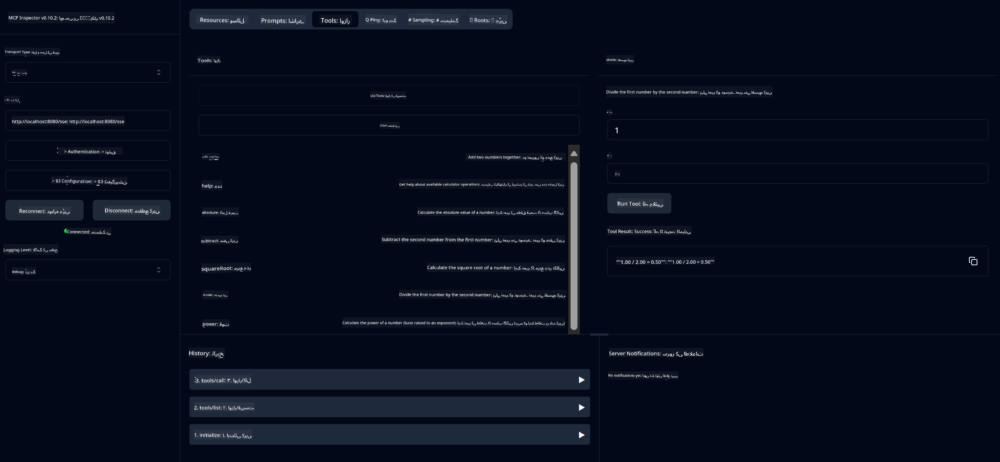

<!--
CO_OP_TRANSLATOR_METADATA:
{
  "original_hash": "ed9cab32cc67c12d8969b407aa47100a",
  "translation_date": "2025-06-11T09:28:57+00:00",
  "source_file": "03-GettingStarted/01-first-server/solution/java/README.md",
  "language_code": "ur"
}
-->
# بنیادی کیلکولیٹر MCP سروس

یہ سروس ماڈل کانٹیکسٹ پروٹوکول (MCP) کے ذریعے بنیادی کیلکولیٹر آپریشنز فراہم کرتی ہے، جو Spring Boot کے ساتھ WebFlux ٹرانسپورٹ استعمال کرتی ہے۔ یہ نئے سیکھنے والوں کے لیے MCP امپلیمنٹیشنز کا ایک سادہ مثال کے طور پر ڈیزائن کی گئی ہے۔

مزید معلومات کے لیے، [MCP Server Boot Starter](https://docs.spring.io/spring-ai/reference/api/mcp/mcp-server-boot-starter-docs.html) ریفرنس دستاویز دیکھیں۔

## سروس کا استعمال

یہ سروس MCP پروٹوکول کے ذریعے درج ذیل API اینڈپوائنٹس فراہم کرتی ہے:

- `add(a, b)`: دو نمبروں کو جمع کریں  
- `subtract(a, b)`: دوسرے نمبر کو پہلے نمبر سے منفی کریں  
- `multiply(a, b)`: دو نمبروں کو ضرب دیں  
- `divide(a, b)`: پہلے نمبر کو دوسرے نمبر سے تقسیم کریں (زیرو چیک کے ساتھ)  
- `power(base, exponent)`: کسی نمبر کی طاقت کا حساب لگائیں  
- `squareRoot(number)`: مربع جذر کا حساب لگائیں (منفی نمبر چیک کے ساتھ)  
- `modulus(a, b)`: تقسیم کے بعد باقی بچا ہوا حساب لگائیں  
- `absolute(number)`: مطلق قدر کا حساب لگائیں  

## انحصارات

پروجیکٹ کو درج ذیل اہم انحصارات کی ضرورت ہے:

```xml
<dependency>
    <groupId>org.springframework.ai</groupId>
    <artifactId>spring-ai-starter-mcp-server-webflux</artifactId>
</dependency>
```

## پروجیکٹ کی تعمیر

پروجیکٹ کو Maven کے ذریعے بنائیں:  
```bash
./mvnw clean install -DskipTests
```

## سرور چلانا

### جاوا استعمال کرتے ہوئے

```bash
java -jar target/calculator-server-0.0.1-SNAPSHOT.jar
```

### MCP Inspector استعمال کرنا

MCP Inspector ایک مفید ٹول ہے جو MCP سروسز کے ساتھ تعامل کے لیے ہے۔ اس کیلکولیٹر سروس کے ساتھ اسے استعمال کرنے کے لیے:

1. **MCP Inspector انسٹال اور چلائیں** ایک نئے ٹرمینل ونڈو میں:  
   ```bash
   npx @modelcontextprotocol/inspector
   ```

2. **ویب UI تک رسائی حاصل کریں** ایپ کی طرف سے دکھائی گئی URL پر کلک کر کے (عام طور پر http://localhost:6274)

3. **کنکشن کی ترتیب دیں**:  
   - ٹرانسپورٹ ٹائپ کو "SSE" پر سیٹ کریں  
   - URL کو اپنے چلتے ہوئے سرور کے SSE اینڈپوائنٹ پر سیٹ کریں: `http://localhost:8080/sse`  
   - "Connect" پر کلک کریں  

4. **ٹولز استعمال کریں**:  
   - "List Tools" پر کلک کریں تاکہ دستیاب کیلکولیٹر آپریشنز دیکھ سکیں  
   - کسی ٹول کو منتخب کریں اور "Run Tool" پر کلک کر کے آپریشن چلائیں  



**ڈس کلیمر**:  
یہ دستاویز AI ترجمہ سروس [Co-op Translator](https://github.com/Azure/co-op-translator) کے ذریعے ترجمہ کی گئی ہے۔ اگرچہ ہم درستگی کے لیے کوشاں ہیں، براہ کرم اس بات سے آگاہ رہیں کہ خودکار تراجم میں غلطیاں یا غیر درستیاں ہو سکتی ہیں۔ اصل دستاویز اپنی مادری زبان میں معتبر ذریعہ سمجھی جانی چاہیے۔ اہم معلومات کے لیے پیشہ ور انسانی ترجمہ تجویز کیا جاتا ہے۔ اس ترجمے کے استعمال سے پیدا ہونے والی کسی بھی غلط فہمی یا غلط تشریح کی ذمہ داری ہم پر عائد نہیں ہوتی۔