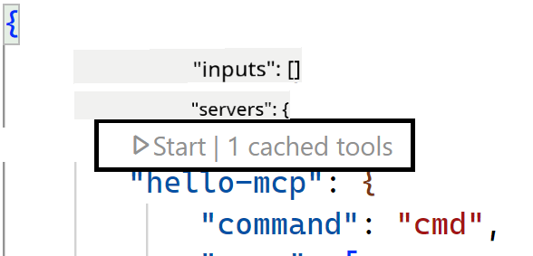
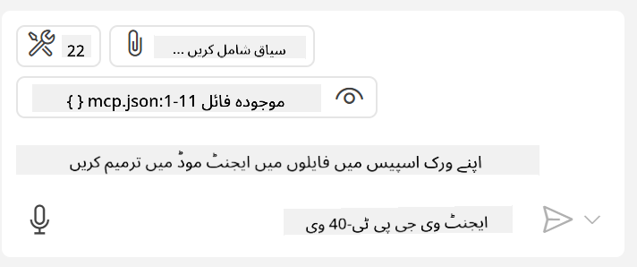

<!--
CO_OP_TRANSLATOR_METADATA:
{
  "original_hash": "c37fabfbc0dcbc9a4afb6d17e7d3be9f",
  "translation_date": "2025-05-17T11:01:45+00:00",
  "source_file": "03-GettingStarted/04-vscode/README.md",
  "language_code": "ur"
}
-->
چلیں اگلے سیکشنز میں ہم بصری انٹرفیس کے استعمال کے بارے میں مزید بات کرتے ہیں۔

## طریقہ کار

یہاں ہم اس کو اونچے درجے پر کیسے اپروچ کریں گے:

- ایک فائل کو کنفیگر کریں تاکہ ہمارا MCP سرور مل سکے۔
- اس سرور کو شروع کریں/کنیکٹ کریں تاکہ اس کی صلاحیتوں کی فہرست دیکھ سکیں۔
- ان صلاحیتوں کو GitHub Copilot کے چیٹ انٹرفیس کے ذریعے استعمال کریں۔

زبردست، اب جب کہ ہم فلو کو سمجھ گئے ہیں، آئیے ایک مشق کے ذریعے Visual Studio Code کے ذریعے MCP سرور استعمال کرنے کی کوشش کریں۔

## مشق: سرور استعمال کرنا

اس مشق میں، ہم Visual Studio Code کو کنفیگر کریں گے تاکہ آپ کے MCP سرور کو GitHub Copilot کے چیٹ انٹرفیس سے استعمال کیا جا سکے۔

### -0- پری اسٹیپ، MCP سرور کی دریافت کو فعال کریں

آپ کو MCP سرورز کی دریافت کو فعال کرنے کی ضرورت ہو سکتی ہے۔

1. `File -> Preferences -> Settings` in Visual Studio Code.

1. Search for "MCP" and enable `chat.mcp.discovery.enabled` پر جائیں settings.json فائل میں۔

### -1- کنفیگ فائل بنائیں

شروع کریں ایک کنفیگ فائل بنا کر اپنے پروجیکٹ روٹ میں، آپ کو ایک فائل کی ضرورت ہو گی جس کا نام MCP.json ہو اور اسے .vscode نامی فولڈر میں رکھیں۔ یہ اس طرح نظر آنا چاہئے:

```text
.vscode
|-- mcp.json
```

اب دیکھتے ہیں کہ ہم سرور انٹری کیسے شامل کر سکتے ہیں۔

### -2- سرور کنفیگر کریں

*mcp.json* میں مندرجہ ذیل مواد شامل کریں:

```json
{
    "inputs": [],
    "servers": {
       "hello-mcp": {
           "command": "cmd",
           "args": [
               "/c", "node", "<absolute path>\\build\\index.js"
           ]
       }
    }
}
```

یہاں ایک سادہ مثال ہے کہ کیسے Node.js میں لکھا ہوا سرور شروع کیا جائے، دیگر رن ٹائمز کے لئے `command` and `args` کا استعمال کرتے ہوئے سرور شروع کرنے کے لئے مناسب کمانڈ بتائیں۔

### -3- سرور شروع کریں

اب جب کہ آپ نے ایک انٹری شامل کر لی ہے، آئیے سرور شروع کرتے ہیں:

1. *mcp.json* میں اپنی انٹری تلاش کریں اور یقینی بنائیں کہ آپ "پلے" آئیکن تلاش کر لیں:

    

1. "پلے" آئیکن پر کلک کریں، آپ کو GitHub Copilot کے چیٹ میں دستیاب ٹولز کی تعداد میں اضافہ ہوتا ہوا نظر آنا چاہئے۔ اگر آپ اس ٹولز آئیکن پر کلک کریں، تو آپ کو رجسٹرڈ ٹولز کی فہرست نظر آئے گی۔ آپ ہر ٹول کو چیک/انچیک کر سکتے ہیں اس بات پر منحصر ہے کہ آپ چاہتے ہیں کہ GitHub Copilot انہیں بطور کانٹیکسٹ استعمال کرے:

  

1. کسی ٹول کو چلانے کے لئے، ایسا پرامپٹ ٹائپ کریں جو آپ کے ٹولز کی وضاحت سے میل کھاتا ہو، مثال کے طور پر ایسا پرامپٹ "22 کو 1 میں جمع کریں":

  

  آپ کو جواب میں 23 ملنا چاہئے۔

## اسائنمنٹ

اپنے *mcp.json* فائل میں سرور انٹری شامل کرنے کی کوشش کریں اور یقینی بنائیں کہ آپ سرور کو شروع/بند کر سکتے ہیں۔ اس بات کا بھی یقین کریں کہ آپ GitHub Copilot کے چیٹ انٹرفیس کے ذریعے اپنے سرور کے ٹولز کے ساتھ بات چیت کر سکتے ہیں۔

## حل

[حل](./solution/README.md)

## اہم نکات

اس باب کے اہم نکات یہ ہیں:

- Visual Studio Code ایک بہترین کلائنٹ ہے جو آپ کو کئی MCP سرورز اور ان کے ٹولز استعمال کرنے دیتا ہے۔
- GitHub Copilot کا چیٹ انٹرفیس وہ طریقہ ہے جس سے آپ سرورز کے ساتھ بات چیت کرتے ہیں۔
- آپ صارف سے ان پٹس کے لئے پرامپٹ کر سکتے ہیں جیسے API کیز جو MCP سرور کو سرور انٹری کنفیگر کرتے وقت پاس کی جا سکتی ہیں *mcp.json* فائل میں۔

## نمونے

- [جاوا کیلکولیٹر](../samples/java/calculator/README.md)
- [.Net کیلکولیٹر](../../../../03-GettingStarted/samples/csharp)
- [جاوا اسکرپٹ کیلکولیٹر](../samples/javascript/README.md)
- [ٹائپ اسکرپٹ کیلکولیٹر](../samples/typescript/README.md)
- [پائتھون کیلکولیٹر](../../../../03-GettingStarted/samples/python) 

## اضافی وسائل

- [Visual Studio docs](https://code.visualstudio.com/docs/copilot/chat/mcp-servers)

## آگے کیا ہے

- اگلا: [SSE سرور بنانا](/03-GettingStarted/05-sse-server/README.md)

**ڈس کلیمر**:  
یہ دستاویز AI ترجمہ سروس [Co-op Translator](https://github.com/Azure/co-op-translator) کا استعمال کرتے ہوئے ترجمہ کی گئی ہے۔ ہم درستگی کے لیے کوشش کرتے ہیں، لیکن براہ کرم آگاہ رہیں کہ خودکار ترجمے میں غلطیاں یا غلط فہمیاں ہو سکتی ہیں۔ اصل دستاویز کو اس کی مقامی زبان میں مستند ماخذ سمجھا جانا چاہیے۔ اہم معلومات کے لیے، پیشہ ورانہ انسانی ترجمہ کی سفارش کی جاتی ہے۔ ہم اس ترجمے کے استعمال سے پیدا ہونے والی کسی بھی غلط فہمی یا غلط تشریح کے ذمہ دار نہیں ہیں۔