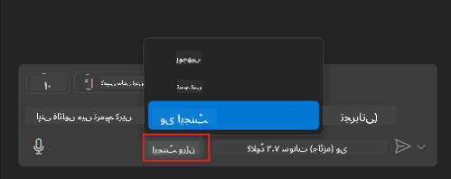
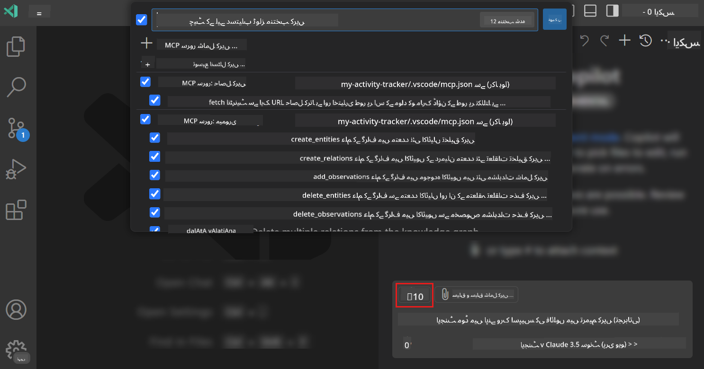
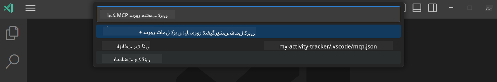
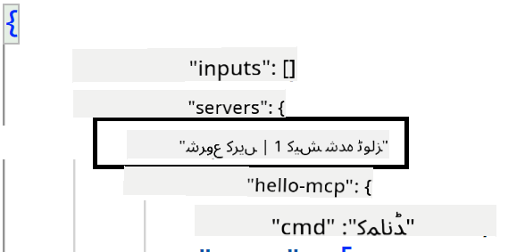
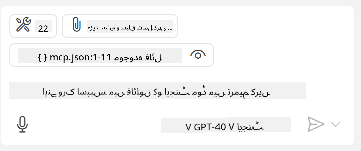
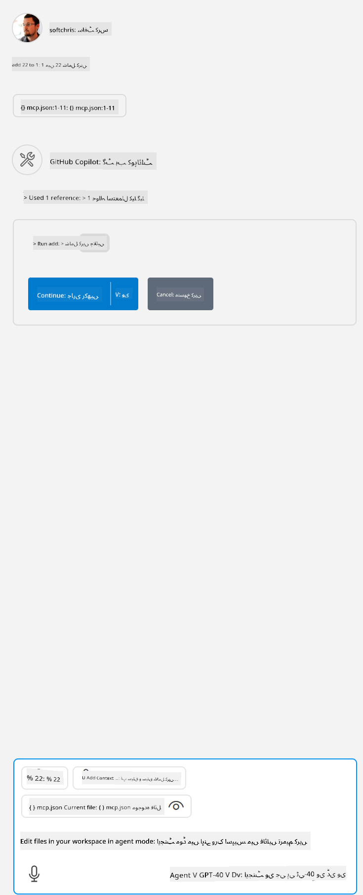

<!--
CO_OP_TRANSLATOR_METADATA:
{
  "original_hash": "d940b5e0af75e3a3a4d1c3179120d1d9",
  "translation_date": "2025-08-26T17:13:02+00:00",
  "source_file": "03-GettingStarted/04-vscode/README.md",
  "language_code": "ur"
}
-->
# GitHub Copilot ایجنٹ موڈ سے سرور استعمال کرنا

Visual Studio Code اور GitHub Copilot ایک کلائنٹ کے طور پر کام کر سکتے ہیں اور ایک MCP سرور کو استعمال کر سکتے ہیں۔ آپ سوچ رہے ہوں گے کہ ایسا کیوں کریں؟ اس کا مطلب یہ ہے کہ MCP سرور کی جو بھی خصوصیات ہیں، وہ اب آپ کے IDE کے اندر سے استعمال کی جا سکتی ہیں۔ تصور کریں کہ آپ GitHub کا MCP سرور شامل کرتے ہیں، تو آپ GitHub کو ٹرمینل میں مخصوص کمانڈز ٹائپ کرنے کے بجائے پرامپٹس کے ذریعے کنٹرول کر سکتے ہیں۔ یا عمومی طور پر کوئی بھی چیز جو آپ کے ڈویلپر تجربے کو بہتر بنا سکتی ہو، وہ سب قدرتی زبان کے ذریعے کنٹرول ہو سکتی ہے۔ اب آپ سمجھ رہے ہیں کہ یہ کتنا فائدہ مند ہو سکتا ہے، ہے نا؟

## جائزہ

یہ سبق آپ کو سکھائے گا کہ Visual Studio Code اور GitHub Copilot کے ایجنٹ موڈ کو MCP سرور کے کلائنٹ کے طور پر کیسے استعمال کیا جائے۔

## سیکھنے کے مقاصد

اس سبق کے اختتام تک، آپ یہ کرنے کے قابل ہوں گے:

- Visual Studio Code کے ذریعے ایک MCP سرور استعمال کریں۔
- GitHub Copilot کے ذریعے ٹولز جیسی خصوصیات چلائیں۔
- Visual Studio Code کو اپنے MCP سرور کو تلاش کرنے اور منظم کرنے کے لیے ترتیب دیں۔

## استعمال

آپ اپنے MCP سرور کو دو مختلف طریقوں سے کنٹرول کر سکتے ہیں:

- یوزر انٹرفیس، جس کا طریقہ آپ کو اس باب میں آگے دکھایا جائے گا۔
- ٹرمینل، جہاں آپ `code` ایگزیکیوبل کے ذریعے چیزوں کو کنٹرول کر سکتے ہیں:

  اپنے یوزر پروفائل میں MCP سرور شامل کرنے کے لیے، --add-mcp کمانڈ لائن آپشن استعمال کریں، اور JSON سرور کنفیگریشن فراہم کریں جیسے {\"name\":\"server-name\",\"command\":...}۔

  ```
  code --add-mcp "{\"name\":\"my-server\",\"command\": \"uvx\",\"args\": [\"mcp-server-fetch\"]}"
  ```

### اسکرین شاٹس

  
  
  

آئیے اگلے حصوں میں دیکھتے ہیں کہ ہم بصری انٹرفیس کو کیسے استعمال کرتے ہیں۔

## طریقہ کار

یہاں ایک اعلیٰ سطحی طریقہ کار دیا گیا ہے:

- ایک فائل ترتیب دیں تاکہ ہمارا MCP سرور تلاش کیا جا سکے۔
- سرور کو شروع کریں/کنیکٹ کریں تاکہ وہ اپنی خصوصیات کی فہرست دے سکے۔
- ان خصوصیات کو GitHub Copilot چیٹ انٹرفیس کے ذریعے استعمال کریں۔

زبردست، اب جب کہ ہم نے فلو کو سمجھ لیا ہے، آئیے ایک مشق کے ذریعے Visual Studio Code میں MCP سرور استعمال کرنے کی کوشش کرتے ہیں۔

## مشق: سرور استعمال کرنا

اس مشق میں، ہم Visual Studio Code کو ترتیب دیں گے تاکہ آپ کا MCP سرور GitHub Copilot چیٹ انٹرفیس کے ذریعے استعمال کیا جا سکے۔

### -0- ابتدائی قدم، MCP سرور ڈسکوری کو فعال کریں

آپ کو MCP سرورز کی ڈسکوری کو فعال کرنے کی ضرورت ہو سکتی ہے۔

1. Visual Studio Code میں `File -> Preferences -> Settings` پر جائیں۔

1. "MCP" تلاش کریں اور settings.json فائل میں `chat.mcp.discovery.enabled` کو فعال کریں۔

### -1- کنفیگ فائل بنائیں

اپنے پروجیکٹ کے روٹ میں ایک کنفیگ فائل بنائیں، آپ کو ایک فائل بنانی ہوگی جس کا نام MCP.json ہو اور اسے .vscode فولڈر میں رکھنا ہوگا۔ یہ کچھ اس طرح نظر آنا چاہیے:

```text
.vscode
|-- mcp.json
```

اب دیکھتے ہیں کہ سرور انٹری کیسے شامل کی جائے۔

### -2- سرور ترتیب دیں

*mcp.json* میں درج ذیل مواد شامل کریں:

```json
{
    "inputs": [],
    "servers": {
       "hello-mcp": {
           "command": "node",
           "args": [
               "build/index.js"
           ]
       }
    }
}
```

یہ ایک سادہ مثال ہے کہ Node.js میں لکھے گئے سرور کو کیسے شروع کیا جائے، دیگر رن ٹائمز کے لیے مناسب کمانڈ اور `args` کے ذریعے سرور شروع کرنے کا طریقہ بتائیں۔

### -3- سرور شروع کریں

اب جب کہ آپ نے انٹری شامل کر لی ہے، آئیے سرور شروع کریں:

1. *mcp.json* میں اپنی انٹری تلاش کریں اور "پلے" آئیکن کو یقینی بنائیں:

    

1. "پلے" آئیکن پر کلک کریں، آپ کو GitHub Copilot چیٹ میں ٹولز آئیکن کے ساتھ دستیاب ٹولز کی تعداد بڑھتی ہوئی نظر آئے گی۔ اگر آپ اس ٹولز آئیکن پر کلک کریں، تو آپ رجسٹرڈ ٹولز کی فہرست دیکھ سکیں گے۔ آپ ہر ٹول کو چیک/انچیک کر سکتے ہیں کہ آیا آپ چاہتے ہیں کہ GitHub Copilot انہیں سیاق و سباق کے طور پر استعمال کرے:

  

1. کسی ٹول کو چلانے کے لیے، ایسا پرامپٹ ٹائپ کریں جو آپ کے ٹولز میں سے کسی ایک کی تفصیل سے میل کھاتا ہو، مثلاً ایسا پرامپٹ: "add 22 to 1":

  

  آپ کو جواب میں 23 نظر آنا چاہیے۔

## اسائنمنٹ

اپنی *mcp.json* فائل میں ایک سرور انٹری شامل کرنے کی کوشش کریں اور یقینی بنائیں کہ آپ سرور کو شروع/بند کر سکتے ہیں۔ یہ بھی یقینی بنائیں کہ آپ اپنے سرور کے ٹولز کے ساتھ GitHub Copilot چیٹ انٹرفیس کے ذریعے بات چیت کر سکتے ہیں۔

## حل

[حل](./solution/README.md)

## اہم نکات

اس باب کے اہم نکات یہ ہیں:

- Visual Studio Code ایک بہترین کلائنٹ ہے جو آپ کو کئی MCP سرورز اور ان کے ٹولز استعمال کرنے دیتا ہے۔
- GitHub Copilot چیٹ انٹرفیس وہ جگہ ہے جہاں آپ سرورز کے ساتھ بات چیت کرتے ہیں۔
- آپ صارف سے ان پٹس جیسے API کیز طلب کر سکتے ہیں، جو سرور انٹری کو ترتیب دیتے وقت *mcp.json* فائل میں MCP سرور کو فراہم کی جا سکتی ہیں۔

## نمونے

- [Java کیلکولیٹر](../samples/java/calculator/README.md)  
- [.Net کیلکولیٹر](../../../../03-GettingStarted/samples/csharp)  
- [JavaScript کیلکولیٹر](../samples/javascript/README.md)  
- [TypeScript کیلکولیٹر](../samples/typescript/README.md)  
- [Python کیلکولیٹر](../../../../03-GettingStarted/samples/python)  

## اضافی وسائل

- [Visual Studio دستاویزات](https://code.visualstudio.com/docs/copilot/chat/mcp-servers)

## آگے کیا ہے

- اگلا: [Stdio سرور بنانا](../05-stdio-server/README.md)  

---

**ڈسکلیمر**:  
یہ دستاویز AI ترجمہ سروس [Co-op Translator](https://github.com/Azure/co-op-translator) کا استعمال کرتے ہوئے ترجمہ کی گئی ہے۔ ہم درستگی کے لیے کوشش کرتے ہیں، لیکن براہ کرم آگاہ رہیں کہ خودکار ترجمے میں غلطیاں یا غیر درستیاں ہو سکتی ہیں۔ اصل دستاویز کو اس کی اصل زبان میں مستند ذریعہ سمجھا جانا چاہیے۔ اہم معلومات کے لیے، پیشہ ور انسانی ترجمہ کی سفارش کی جاتی ہے۔ ہم اس ترجمے کے استعمال سے پیدا ہونے والی کسی بھی غلط فہمی یا غلط تشریح کے ذمہ دار نہیں ہیں۔