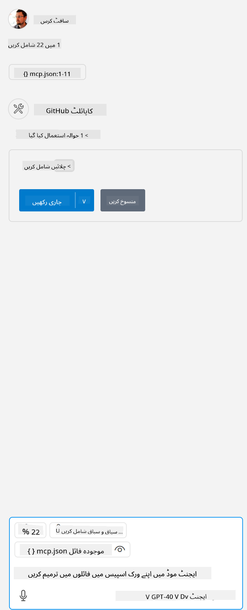

<!--
CO_OP_TRANSLATOR_METADATA:
{
  "original_hash": "96e08a8c1049dab757deb64cce4ea1e8",
  "translation_date": "2025-05-17T11:18:35+00:00",
  "source_file": "03-GettingStarted/04-vscode/solution/README.md",
  "language_code": "ur"
}
-->
# نمونہ چلانا

یہاں ہم فرض کرتے ہیں کہ آپ کے پاس پہلے سے ہی کام کرنے والا سرور کوڈ موجود ہے۔ براہ کرم پہلے کے ابواب میں سے کسی سرور کو تلاش کریں۔

## mcp.json ترتیب دیں

یہاں ایک فائل ہے جسے آپ حوالہ کے لیے استعمال کرتے ہیں، [mcp.json](../../../../../03-GettingStarted/04-vscode/solution/mcp.json)۔

سرور اندراج کو ضروریات کے مطابق تبدیل کریں تاکہ آپ کے سرور کی مکمل کمانڈ کے ساتھ مطلق راستہ کی نشاندہی ہو۔

اوپر دی گئی مثال کی فائل میں سرور اندراج کچھ اس طرح دکھائی دیتا ہے:

```json
"hello-mcp": {
    "command": "cmd",
    "args": [
        "/c", "node", "<absolute path>\\build\\index.js"
    ]
}
```

یہ کمانڈ چلانے کے ساتھ مطابقت رکھتا ہے جیسے: `cmd /c node <absolute path>\\build\index.js`. 

- Change this server entry to fit where your server file is located or to what's needed to startup your server depending on your chosen runtime and server location.

## Consume the features in the server

- Click the `play` icon, once you've added *mcp.json* to *./vscode* folder, 

    Observe the tooling icon change to increase the number of available tools. Tooling icon is located right above the chat field in GitHub Copilot.

## Run a tool

- Type a prompt in your chat window that matches the description of your tool. For example to trigger the tool `add` کچھ اس طرح "add 3 to 20" لکھیں۔

    آپ کو چیٹ ٹیکسٹ باکس کے اوپر ایک ٹول پیش کیا جانا چاہیے جس سے آپ کو ٹول چلانے کے لیے منتخب کرنے کی نشاندہی ہو جیسے اس بصری میں:

    

    ٹول کو منتخب کرنا ایک عددی نتیجہ پیدا کرنا چاہیے جو "23" کہتا ہے اگر آپ کا مطالبہ ویسا ہی ہو جیسا ہم نے پہلے ذکر کیا تھا۔

**ڈس کلیمر**:
یہ دستاویز AI ترجمہ سروس [Co-op Translator](https://github.com/Azure/co-op-translator) کا استعمال کرتے ہوئے ترجمہ کی گئی ہے۔ اگرچہ ہم درستگی کے لیے کوشاں ہیں، براہ کرم آگاہ رہیں کہ خودکار ترجمے میں غلطیاں یا خامیاں ہو سکتی ہیں۔ اصل دستاویز کو اس کی مقامی زبان میں مستند ذریعہ سمجھا جانا چاہیے۔ اہم معلومات کے لیے، پیشہ ور انسانی ترجمہ کی سفارش کی جاتی ہے۔ ہم اس ترجمے کے استعمال سے پیدا ہونے والی کسی بھی غلط فہمی یا غلط تشریح کے ذمہ دار نہیں ہیں۔