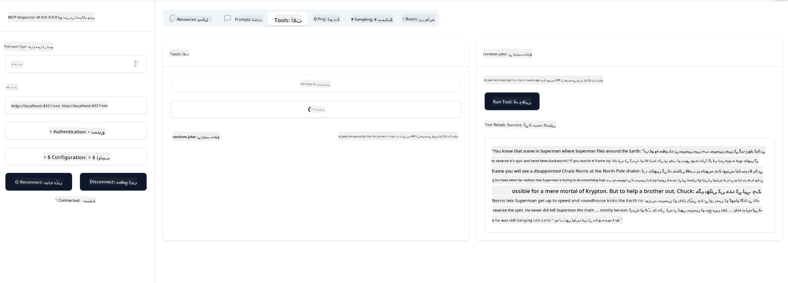

<!--
CO_OP_TRANSLATOR_METADATA:
{
  "original_hash": "a8831b194cb5ece750355e99434b7154",
  "translation_date": "2025-07-17T17:42:45+00:00",
  "source_file": "03-GettingStarted/05-sse-server/README.md",
  "language_code": "ur"
}
-->
# SSE سرور

SSE (Server Sent Events) ایک معیاری طریقہ ہے جو سرور سے کلائنٹ تک سٹریمنگ کے لیے استعمال ہوتا ہے، جس سے سرورز کلائنٹس کو HTTP کے ذریعے حقیقی وقت کی تازہ کاری بھیج سکتے ہیں۔ یہ خاص طور پر ان ایپلیکیشنز کے لیے مفید ہے جنہیں لائیو اپڈیٹس کی ضرورت ہوتی ہے، جیسے چیٹ ایپلیکیشنز، نوٹیفیکیشنز، یا حقیقی وقت کے ڈیٹا فیڈز۔ نیز، آپ کا سرور ایک ساتھ کئی کلائنٹس کے لیے استعمال ہو سکتا ہے کیونکہ یہ کسی سرور پر چلتا ہے جو کہ کلاؤڈ میں کہیں بھی ہوسکتا ہے۔

## جائزہ

یہ سبق SSE سرور بنانے اور استعمال کرنے کا طریقہ سکھاتا ہے۔

## سیکھنے کے مقاصد

اس سبق کے آخر تک، آپ کر سکیں گے:

- ایک SSE سرور بنائیں۔
- Inspector کا استعمال کرتے ہوئے SSE سرور کو ڈیبگ کریں۔
- Visual Studio Code کے ذریعے SSE سرور کو استعمال کریں۔

## SSE، یہ کیسے کام کرتا ہے

SSE دو سپورٹ شدہ ٹرانسپورٹ اقسام میں سے ایک ہے۔ آپ نے پہلے سبقوں میں stdio کو استعمال کرتے دیکھا ہے۔ فرق درج ذیل ہے:

- SSE میں آپ کو دو چیزوں کو سنبھالنا ہوتا ہے؛ کنکشن اور پیغامات۔
- چونکہ یہ سرور کہیں بھی ہوسکتا ہے، اس لیے آپ کو Inspector اور Visual Studio Code جیسے ٹولز کے ساتھ کام کرنے کے طریقے میں یہ ظاہر کرنا ہوگا۔ اس کا مطلب یہ ہے کہ آپ سرور شروع کرنے کے بجائے اس اینڈ پوائنٹ کی طرف اشارہ کرتے ہیں جہاں کنکشن قائم کیا جا سکتا ہے۔ نیچے مثال دیکھیں:

### TypeScript

```typescript
app.get("/sse", async (_: Request, res: Response) => {
    const transport = new SSEServerTransport('/messages', res);
    transports[transport.sessionId] = transport;
    res.on("close", () => {
        delete transports[transport.sessionId];
    });
    await server.connect(transport);
});

app.post("/messages", async (req: Request, res: Response) => {
    const sessionId = req.query.sessionId as string;
    const transport = transports[sessionId];
    if (transport) {
        await transport.handlePostMessage(req, res);
    } else {
        res.status(400).send('No transport found for sessionId');
    }
});
```

مندرجہ بالا کوڈ میں:

- `/sse` کو ایک روٹ کے طور پر سیٹ کیا گیا ہے۔ جب اس روٹ کی طرف درخواست آتی ہے، تو ایک نیا ٹرانسپورٹ انسٹینس بنایا جاتا ہے اور سرور اس ٹرانسپورٹ کے ذریعے *کنیکٹ* ہوتا ہے۔
- `/messages` وہ روٹ ہے جو آنے والے پیغامات کو ہینڈل کرتا ہے۔

### Python

```python
mcp = FastMCP("My App")

@mcp.tool()
def add(a: int, b: int) -> int:
    """Add two numbers"""
    return a + b

# Mount the SSE server to the existing ASGI server
app = Starlette(
    routes=[
        Mount('/', app=mcp.sse_app()),
    ]
)

```

مندرجہ بالا کوڈ میں ہم نے:

- ASGI سرور کا ایک انسٹینس بنایا (خاص طور پر Starlette استعمال کرتے ہوئے) اور ڈیفالٹ روٹ `/` کو ماؤنٹ کیا۔

  پس منظر میں یہ ہوتا ہے کہ روٹس `/sse` اور `/messages` کنکشنز اور پیغامات کو بالترتیب ہینڈل کرنے کے لیے سیٹ کیے جاتے ہیں۔ باقی ایپ، جیسے ٹولز شامل کرنا، stdio سرورز کی طرح ہوتا ہے۔

### .NET    

```csharp
    var builder = WebApplication.CreateBuilder(args);
    builder.Services
        .AddMcpServer()
        .WithTools<Tools>();


    builder.Services.AddHttpClient();

    var app = builder.Build();

    app.MapMcp();
    ```

    دو طریقے ہیں جو ہمیں ویب سرور سے SSE سپورٹ کرنے والے ویب سرور تک لے جاتے ہیں:

    - `AddMcpServer`، یہ طریقہ صلاحیتیں شامل کرتا ہے۔
    - `MapMcp`، یہ `/SSE` اور `/messages` جیسے روٹس شامل کرتا ہے۔
```

Now that we know a little bit more about SSE, let's build an SSE server next.

## Exercise: Creating an SSE Server

To create our server, we need to keep two things in mind:

- We need to use a web server to expose endpoints for connection and messages.
- Build our server like we normally do with tools, resources and prompts when we were using stdio.

### -1- Create a server instance

To create our server, we use the same types as with stdio. However, for the transport, we need to choose SSE.

### TypeScript

```typescript
import { Request, Response } from "express";
import express from "express";
import { McpServer } from "@modelcontextprotocol/sdk/server/mcp.js";
import { SSEServerTransport } from "@modelcontextprotocol/sdk/server/sse.js";

const server = new McpServer({
  name: "example-server",
  version: "1.0.0"
});

const app = express();

const transports: {[sessionId: string]: SSEServerTransport} = {};
```

In the preceding code we've:

- Created a server instance.
- Defined an app using the web framework express.
- Created a transports variable that we will use to store incoming connections.

### Python

```python
from starlette.applications import Starlette
from starlette.routing import Mount, Host
from mcp.server.fastmcp import FastMCP


mcp = FastMCP("My App")
```

In the preceding code we've:

- Imported the libraries we're going to need with Starlette (an ASGI framework) being pulled in.
- Created an MCP server instance `mcp`.

### .NET

```csharp
var builder = WebApplication.CreateBuilder(args);
builder.Services
    .AddMcpServer();


builder.Services.AddHttpClient();

var app = builder.Build();

// TODO: add routes 
```

At this point, we've:

- Created a web app
- Added support for MCP features through `AddMcpServer`.

Let's add the needed routes next.

### -2- Add routes

Let's add routes next that handle the connection and incoming messages:

### TypeScript

```typescript
app.get("/sse", async (_: Request, res: Response) => {
  const transport = new SSEServerTransport('/messages', res);
  transports[transport.sessionId] = transport;
  res.on("close", () => {
    delete transports[transport.sessionId];
  });
  await server.connect(transport);
});

app.post("/messages", async (req: Request, res: Response) => {
  const sessionId = req.query.sessionId as string;
  const transport = transports[sessionId];
  if (transport) {
    await transport.handlePostMessage(req, res);
  } else {
    res.status(400).send('No transport found for sessionId');
  }
});

app.listen(3001);
```

In the preceding code we've defined:

- An `/sse` route that instantiates a transport of type SSE and ends up calling `connect` on the MCP server.
- A `/messages` route that takes care of incoming messages.

### Python

```python
app = Starlette(
    routes=[
        Mount('/', app=mcp.sse_app()),
    ]
)
```

In the preceding code we've:

- Created an ASGI app instance using the Starlette framework. As part of that we passes `mcp.sse_app()` to it's list of routes. That ends up mounting an `/sse` and `/messages` route on the app instance.

### .NET

```csharp
var builder = WebApplication.CreateBuilder(args);
builder.Services
    .AddMcpServer();

builder.Services.AddHttpClient();

var app = builder.Build();

app.MapMcp();
```

We've added one line of code at the end `add.MapMcp()` this means we now have routes `/SSE` and `/messages`. 

Let's add capabilties to the server next.

### -3- Adding server capabilities

Now that we've got everything SSE specific defined, let's add server capabilities like tools, prompts and resources.

### TypeScript

```typescript
server.tool("random-joke", "A joke returned by the chuck norris api", {},
  async () => {
    const response = await fetch("https://api.chucknorris.io/jokes/random");
    const data = await response.json();

    return {
      content: [
        {
          type: "text",
          text: data.value
        }
      ]
    };
  }
);
```

Here's how you can add a tool for example. This specific tool creates a tool call "random-joke" that calls a Chuck Norris API and returns a JSON response.

### Python

```python
@mcp.tool()
def add(a: int, b: int) -> int:
    """Add two numbers"""
    return a + b
```

Now your server has one tool.

### TypeScript

```typescript
// server-sse.ts
import { Request, Response } from "express";
import express from "express";
import { McpServer } from "@modelcontextprotocol/sdk/server/mcp.js";
import { SSEServerTransport } from "@modelcontextprotocol/sdk/server/sse.js";

// Create an MCP server
const server = new McpServer({
  name: "example-server",
  version: "1.0.0",
});

const app = express();

const transports: { [sessionId: string]: SSEServerTransport } = {};

app.get("/sse", async (_: Request, res: Response) => {
  const transport = new SSEServerTransport("/messages", res);
  transports[transport.sessionId] = transport;
  res.on("close", () => {
    delete transports[transport.sessionId];
  });
  await server.connect(transport);
});

app.post("/messages", async (req: Request, res: Response) => {
  const sessionId = req.query.sessionId as string;
  const transport = transports[sessionId];
  if (transport) {
    await transport.handlePostMessage(req, res);
  } else {
    res.status(400).send("No transport found for sessionId");
  }
});

server.tool("random-joke", "A joke returned by the chuck norris api", {}, async () => {
  const response = await fetch("https://api.chucknorris.io/jokes/random");
  const data = await response.json();

  return {
    content: [
      {
        type: "text",
        text: data.value,
      },
    ],
  };
});

app.listen(3001);
```

### Python

```python
from starlette.applications import Starlette
from starlette.routing import Mount, Host
from mcp.server.fastmcp import FastMCP


mcp = FastMCP("My App")

@mcp.tool()
def add(a: int, b: int) -> int:
    """Add two numbers"""
    return a + b

# Mount the SSE server to the existing ASGI server
app = Starlette(
    routes=[
        Mount('/', app=mcp.sse_app()),
    ]
)
```

### .NET

1. Let's create some tools first, for this we will create a file *Tools.cs* with the following content:

  ```csharp
  using System.ComponentModel;
  using System.Text.Json;
  using ModelContextProtocol.Server;

  namespace server;

  [McpServerToolType]
  public sealed class Tools
  {

      public Tools()
      {
      
      }

      [McpServerTool, Description("Add two numbers together.")]
      public async Task<string> AddNumbers(
          [Description("The first number")] int a,
          [Description("The second number")] int b)
      {
          return (a + b).ToString();
      }

  }
  ```

  Here we've added the following:

  - Created a class `Tools` with the decorator `McpServerToolType`.
  - Defined a tool `AddNumbers` by decorating the method with `McpServerTool`. We've also provided parameters and an implementation.

1. Let's leverage the `Tools` class we just created:

  ```csharp
  var builder = WebApplication.CreateBuilder(args);
  builder.Services
      .AddMcpServer()
      .WithTools<Tools>();


  builder.Services.AddHttpClient();

  var app = builder.Build();

  app.MapMcp();
  ```

  We've added a call to `WithTools` that specifies `Tools` as the class containing the tools. That's it, we're ready.

Great, we have a server using SSE, let's take it for a spin next.

## Exercise: Debugging an SSE Server with Inspector

Inspector is a great tool that we saw in a previous lesson [Creating your first server](/03-GettingStarted/01-first-server/README.md). Let's see if we can use the Inspector even here:

### -1- Running the inspector

To run the inspector, you first must have an SSE server running, so let's do that next:

1. Run the server 

    ### TypeScript

    ```sh
    tsx && node ./build/server-sse.ts
    ```

    ### Python

    ```sh
    uvicorn server:app
    ```

    Note how we use the executable `uvicorn` that's installed when we typed `pip install "mcp[cli]"`. Typing `server:app` means we're trying to run a file `server.py` and for it to have a Starlette instance called `app`. 

    ### .NET

    ```sh
    dotnet run
    ```

    This should start the server. To interface with it you need a new terminal.

1. Run the inspector

    > ![NOTE]
    > Run this in a separate terminal window than the server is running in. Also note, you need to adjust the below command to fit the URL where your server runs.

    ```sh
    npx @modelcontextprotocol/inspector --cli http://localhost:8000/sse --method tools/list
    ```

    Inspector چلانا تمام رن ٹائمز میں ایک جیسا ہوتا ہے۔ دھیان دیں کہ ہم سرور کو شروع کرنے کے لیے راستہ دینے اور کمانڈ چلانے کے بجائے، ہم اس URL کو دیتے ہیں جہاں سرور چل رہا ہوتا ہے اور ساتھ ہی `/sse` روٹ بھی بتاتے ہیں۔

### -2- ٹول آزمانا

سرور کو کنیکٹ کرنے کے لیے ڈراپ لسٹ میں سے SSE منتخب کریں اور URL فیلڈ میں وہ پتہ درج کریں جہاں آپ کا سرور چل رہا ہے، مثلاً http:localhost:4321/sse۔ پھر "Connect" بٹن پر کلک کریں۔ جیسا پہلے کیا تھا، ٹولز کی فہرست دیکھیں، کوئی ٹول منتخب کریں اور ان پٹ ویلیوز فراہم کریں۔ آپ کو نیچے کی طرح نتیجہ نظر آئے گا:



زبردست، آپ inspector کے ساتھ کام کر سکتے ہیں، اب دیکھتے ہیں کہ Visual Studio Code کے ساتھ کیسے کام کیا جا سکتا ہے۔

## اسائنمنٹ

اپنے سرور میں مزید صلاحیتیں شامل کرنے کی کوشش کریں۔ مثال کے طور پر، [اس صفحہ](https://api.chucknorris.io/) کو دیکھیں تاکہ کوئی ایسا ٹول بنایا جا سکے جو API کال کرے۔ آپ فیصلہ کریں کہ سرور کیسا ہونا چاہیے۔ مزہ کریں :)

## حل

[حل](./solution/README.md) یہاں ایک ممکنہ حل دیا گیا ہے جس میں کام کرنے والا کوڈ شامل ہے۔

## اہم نکات

اس باب کے اہم نکات درج ذیل ہیں:

- SSE stdio کے بعد دوسرا سپورٹ شدہ ٹرانسپورٹ ہے۔
- SSE کو سپورٹ کرنے کے لیے، آپ کو ویب فریم ورک کے ذریعے آنے والے کنکشنز اور پیغامات کو سنبھالنا ہوتا ہے۔
- آپ Inspector اور Visual Studio Code دونوں کا استعمال کر کے SSE سرور کو استعمال کر سکتے ہیں، بالکل stdio سرورز کی طرح۔ دھیان دیں کہ stdio اور SSE میں تھوڑا فرق ہے۔ SSE کے لیے، آپ کو سرور کو الگ سے شروع کرنا ہوتا ہے اور پھر inspector ٹول چلانا ہوتا ہے۔ inspector ٹول میں بھی فرق یہ ہے کہ آپ کو URL بتانا پڑتا ہے۔

## نمونے

- [Java Calculator](../samples/java/calculator/README.md)
- [.Net Calculator](../../../../03-GettingStarted/samples/csharp)
- [JavaScript Calculator](../samples/javascript/README.md)
- [TypeScript Calculator](../samples/typescript/README.md)
- [Python Calculator](../../../../03-GettingStarted/samples/python)

## اضافی وسائل

- [SSE](https://developer.mozilla.org/en-US/docs/Web/API/Server-sent_events)

## آگے کیا ہے

- اگلا: [HTTP Streaming with MCP (Streamable HTTP)](../06-http-streaming/README.md)

**دستخطی نوٹ**:  
یہ دستاویز AI ترجمہ سروس [Co-op Translator](https://github.com/Azure/co-op-translator) کے ذریعے ترجمہ کی گئی ہے۔ اگرچہ ہم درستگی کے لیے کوشاں ہیں، براہ کرم آگاہ رہیں کہ خودکار ترجمے میں غلطیاں یا عدم درستیاں ہو سکتی ہیں۔ اصل دستاویز اپنی مادری زبان میں ہی معتبر ماخذ سمجھی جانی چاہیے۔ اہم معلومات کے لیے پیشہ ور انسانی ترجمہ کی سفارش کی جاتی ہے۔ اس ترجمے کے استعمال سے پیدا ہونے والی کسی بھی غلط فہمی یا غلط تشریح کی ذمہ داری ہم پر عائد نہیں ہوتی۔