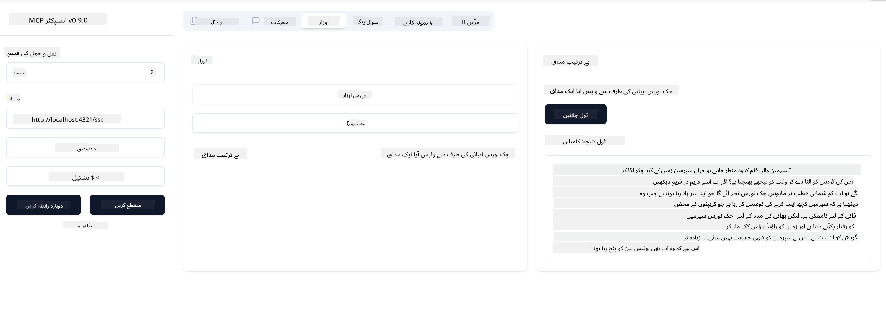

<!--
CO_OP_TRANSLATOR_METADATA:
{
  "original_hash": "0a8086dc4bf89448f83e7936db972c42",
  "translation_date": "2025-05-17T11:27:20+00:00",
  "source_file": "03-GettingStarted/05-sse-server/README.md",
  "language_code": "ur"
}
-->
اب جب ہم ایس ایس ای کے بارے میں تھوڑا سا جان چکے ہیں، آئیے اگلا ایس ایس ای سرور بناتے ہیں۔

## مشق: ایس ایس ای سرور بنانا

اپنا سرور بنانے کے لیے، ہمیں دو چیزوں کو ذہن میں رکھنا ہوگا:

- ہمیں کنکشن اور پیغامات کے لیے اینڈپوائنٹس کو ظاہر کرنے کے لیے ایک ویب سرور استعمال کرنے کی ضرورت ہے۔
- جب ہم stdio استعمال کر رہے تھے تو سرور کو عام طریقے سے بنائیں جیسے کہ ٹولز، وسائل اور پرامپٹس کے ساتھ۔

### -1- سرور کی مثال بنائیں

اپنا سرور بنانے کے لیے، ہم وہی قسمیں استعمال کرتے ہیں جیسے stdio کے ساتھ۔ تاہم، ٹرانسپورٹ کے لیے، ہمیں ایس ایس ای کا انتخاب کرنے کی ضرورت ہے۔

آئیے اگلے مرحلے میں مطلوبہ روٹس شامل کریں۔

### -2- روٹس شامل کریں

آئیے اگلے مرحلے میں کنکشن اور آنے والے پیغامات کو ہینڈل کرنے کے لیے روٹس شامل کریں:

آئیے اگلے مرحلے میں سرور کی صلاحیتیں شامل کریں۔

### -3- سرور کی صلاحیتیں شامل کرنا

اب جب کہ ہم نے ایس ایس ای سے متعلق ہر چیز کو واضح کر دیا ہے، آئیے سرور کی صلاحیتوں جیسے ٹولز، پرامپٹس اور وسائل کو شامل کریں۔

آپ کا مکمل کوڈ کچھ اس طرح نظر آنا چاہیے:

زبردست، ہمارے پاس ایس ایس ای کا استعمال کرنے والا سرور ہے، آئیے اگلے مرحلے میں اس کا تجربہ کرتے ہیں۔

## مشق: انسپکٹر کے ساتھ ایس ایس ای سرور کو ڈیبگ کرنا

انسپکٹر ایک بہترین ٹول ہے جسے ہم نے ایک پچھلے سبق میں دیکھا تھا [اپنا پہلا سرور بنانا](/03-GettingStarted/01-first-server/README.md)۔ آئیے دیکھتے ہیں کہ کیا ہم یہاں بھی انسپکٹر کا استعمال کر سکتے ہیں:

### -1- انسپکٹر چلانا

انسپکٹر کو چلانے کے لیے، آپ کے پاس پہلے ایک ایس ایس ای سرور چل رہا ہونا ضروری ہے، لہذا آئیے اگلا یہ کام کرتے ہیں:

1. سرور چلائیں

1. انسپکٹر چلائیں

    > ![NOTE]
    > اسے اس ٹرمینل ونڈو میں چلائیں جو سرور کے چلنے والے ٹرمینل سے الگ ہو۔ نیز، نوٹ کریں کہ آپ کو نیچے دیے گئے کمانڈ کو ایڈجسٹ کرنے کی ضرورت ہے تاکہ آپ کے سرور کے چلنے والے یو آر ایل کے مطابق ہو۔

    ```sh
    npx @modelcontextprotocol/inspector --cli http://localhost:8000/sse --method tools/list
    ```

    انسپکٹر کو چلانا تمام رن ٹائمز میں ایک جیسا نظر آتا ہے۔ نوٹ کریں کہ ہم سرور کے راستے اور سرور کو شروع کرنے کے لیے کمانڈ دینے کے بجائے اس یو آر ایل کو پاس کرتے ہیں جہاں سرور چل رہا ہے اور ہم مخصوص کرتے ہیں کہ `/sse` راستہ۔

### -2- ٹول کو آزمانا

سرور سے جڑنے کے لیے ڈراپ لسٹ میں ایس ایس ای کو منتخب کریں اور یو آر ایل فیلڈ میں وہ پتہ درج کریں جہاں آپ کا سرور چل رہا ہے، مثال کے طور پر http:localhost:4321/sse۔ اب "Connect" بٹن پر کلک کریں۔ جیسا کہ پہلے، ٹولز کی فہرست بنانے کے لیے منتخب کریں، ایک ٹول منتخب کریں اور ان پٹ ویلیوز فراہم کریں۔ آپ کو نیچے کی طرح ایک نتیجہ نظر آنا چاہیے:



زبردست، آپ انسپکٹر کے ساتھ کام کرنے کے قابل ہیں، آئیے دیکھتے ہیں کہ ہم اگلے مرحلے میں ویژول اسٹوڈیو کوڈ کے ساتھ کیسے کام کر سکتے ہیں۔

## اسائنمنٹ

اپنے سرور کو مزید صلاحیتوں کے ساتھ بنانے کی کوشش کریں۔ دیکھیں [یہ صفحہ](https://api.chucknorris.io/) تاکہ مثال کے طور پر ایک ٹول شامل کیا جا سکے جو ایک API کو کال کرتا ہے، آپ فیصلہ کریں کہ سرور کو کیسا نظر آنا چاہیے۔ مزہ کریں :)

## حل

[حل](./solution/README.md) یہاں ایک ممکنہ حل ہے جس کے ساتھ کام کرنے والا کوڈ۔

## اہم نکات

اس باب سے اہم نکات درج ذیل ہیں:

- ایس ایس ای stdio کے بعد دوسرا سپورٹڈ ٹرانسپورٹ ہے۔
- ایس ایس ای کی حمایت کے لیے، آپ کو ویب فریم ورک کا استعمال کرتے ہوئے آنے والے کنکشنز اور پیغامات کا انتظام کرنا ہوگا۔
- آپ انسپکٹر اور ویژول اسٹوڈیو کوڈ دونوں کا استعمال کرکے ایس ایس ای سرور کو کنزیوم کر سکتے ہیں، جیسے کہ stdio سرورز۔ نوٹ کریں کہ یہ stdio اور ایس ایس ای کے درمیان تھوڑا سا مختلف ہوتا ہے۔ ایس ایس ای کے لیے، آپ کو سرور کو الگ سے شروع کرنا ہوتا ہے اور پھر اپنے انسپکٹر ٹول کو چلانا ہوتا ہے۔ انسپکٹر ٹول کے لیے، کچھ فرق یہ بھی ہے کہ آپ کو یو آر ایل کو مخصوص کرنے کی ضرورت ہوتی ہے۔

## نمونے 

- [جاوا کیلکولیٹر](../samples/java/calculator/README.md)
- [.Net کیلکولیٹر](../../../../03-GettingStarted/samples/csharp)
- [جاوا اسکرپٹ کیلکولیٹر](../samples/javascript/README.md)
- [ٹائپ اسکرپٹ کیلکولیٹر](../samples/typescript/README.md)
- [پائتھون کیلکولیٹر](../../../../03-GettingStarted/samples/python) 

## اضافی وسائل

- [ایس ایس ای](https://developer.mozilla.org/en-US/docs/Web/API/Server-sent_events)

## آگے کیا ہے

- اگلا: [VSCode کے لیے AI ٹول کٹ کے ساتھ شروعات](/03-GettingStarted/06-aitk/README.md)

**ڈس کلیمر**:
یہ دستاویز AI ترجمہ سروس [Co-op Translator](https://github.com/Azure/co-op-translator) کا استعمال کرتے ہوئے ترجمہ کی گئی ہے۔ اگرچہ ہم درستگی کی کوشش کرتے ہیں، براہ کرم آگاہ رہیں کہ خودکار تراجم میں غلطیاں یا غیر درستگیاں ہو سکتی ہیں۔ اصل دستاویز کو اس کی مقامی زبان میں معتبر ماخذ سمجھا جانا چاہیے۔ اہم معلومات کے لئے، پیشہ ور انسانی ترجمہ کی سفارش کی جاتی ہے۔ ہم اس ترجمہ کے استعمال سے پیدا ہونے والی کسی غلط فہمی یا غلط تعبیر کے ذمہ دار نہیں ہیں۔