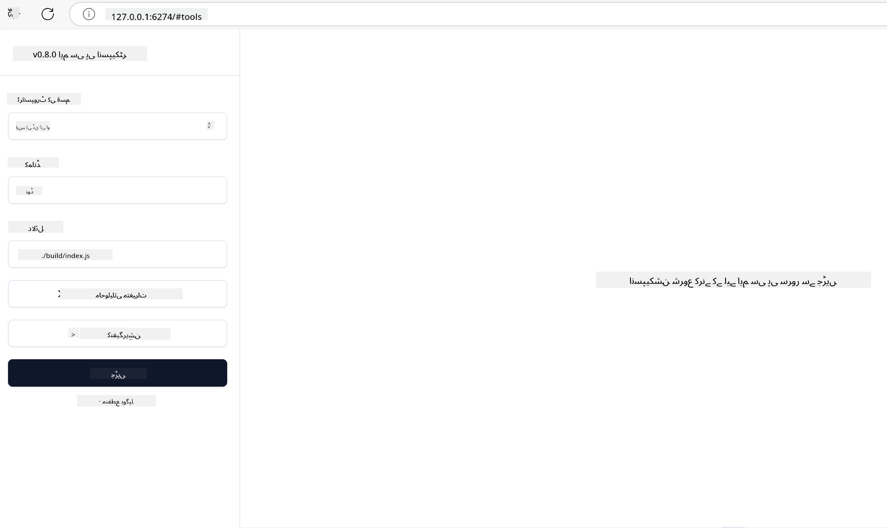

<!--
CO_OP_TRANSLATOR_METADATA:
{
  "original_hash": "4e34e34e84f013e73c7eaa6d09884756",
  "translation_date": "2025-07-13T21:57:19+00:00",
  "source_file": "03-GettingStarted/08-testing/README.md",
  "language_code": "ur"
}
-->
## ٹیسٹنگ اور ڈیبگنگ

اپنے MCP سرور کی ٹیسٹنگ شروع کرنے سے پہلے، یہ سمجھنا ضروری ہے کہ دستیاب ٹولز اور ڈیبگنگ کے بہترین طریقے کیا ہیں۔ مؤثر ٹیسٹنگ اس بات کو یقینی بناتی ہے کہ آپ کا سرور متوقع طریقے سے کام کرے اور آپ کو مسائل کو جلدی شناخت اور حل کرنے میں مدد دیتی ہے۔ درج ذیل سیکشن میں آپ کی MCP امپلیمنٹیشن کی تصدیق کے لیے تجویز کردہ طریقے بیان کیے گئے ہیں۔

## جائزہ

یہ سبق آپ کو صحیح ٹیسٹنگ طریقہ منتخب کرنے اور سب سے مؤثر ٹیسٹنگ ٹول کے بارے میں بتاتا ہے۔

## سیکھنے کے مقاصد

اس سبق کے اختتام تک، آپ قابل ہوں گے:

- ٹیسٹنگ کے مختلف طریقے بیان کرنا۔
- مختلف ٹولز کا استعمال کرتے ہوئے مؤثر طریقے سے اپنے کوڈ کی جانچ کرنا۔

## MCP سرورز کی ٹیسٹنگ

MCP آپ کے سرورز کی ٹیسٹنگ اور ڈیبگنگ میں مدد کے لیے ٹولز فراہم کرتا ہے:

- **MCP Inspector**: ایک کمانڈ لائن ٹول جو CLI اور بصری دونوں طریقوں سے چلایا جا سکتا ہے۔
- **مینول ٹیسٹنگ**: آپ curl جیسے ٹول کا استعمال کر کے ویب ریکویسٹ چلا سکتے ہیں، لیکن کوئی بھی ایسا ٹول جو HTTP ریکویسٹ چلا سکے، کام کرے گا۔
- **یونٹ ٹیسٹنگ**: آپ اپنے پسندیدہ ٹیسٹنگ فریم ورک کا استعمال کرتے ہوئے سرور اور کلائنٹ دونوں کی خصوصیات کی جانچ کر سکتے ہیں۔

### MCP Inspector کا استعمال

ہم نے اس ٹول کے استعمال کو پچھلے اسباق میں بیان کیا ہے، لیکن یہاں اس کا ایک عمومی جائزہ پیش کرتے ہیں۔ یہ ایک Node.js میں بنایا گیا ٹول ہے جسے آپ `npx` کمانڈ کے ذریعے چلا سکتے ہیں، جو خود بخود ٹول کو عارضی طور پر ڈاؤن لوڈ اور انسٹال کرتا ہے اور کام مکمل ہونے پر خود کو صاف کر دیتا ہے۔

[MCP Inspector](https://github.com/modelcontextprotocol/inspector) آپ کی مدد کرتا ہے:

- **سرور کی صلاحیتوں کا پتہ لگانا**: دستیاب وسائل، ٹولز، اور پرامپٹس کو خودکار طریقے سے دریافت کریں
- **ٹول کی کارکردگی کی جانچ**: مختلف پیرامیٹرز آزما کر حقیقی وقت میں جوابات دیکھیں
- **سرور میٹا ڈیٹا دیکھنا**: سرور کی معلومات، اسکیمے، اور کنفیگریشنز کا جائزہ لیں

ٹول کے عام استعمال کی مثال کچھ یوں ہے:

```bash
npx @modelcontextprotocol/inspector node build/index.js
```

اوپر دی گئی کمانڈ MCP اور اس کا بصری انٹرفیس شروع کرتی ہے اور آپ کے براؤزر میں ایک مقامی ویب انٹرفیس لانچ کرتی ہے۔ آپ ایک ڈیش بورڈ دیکھیں گے جو آپ کے رجسٹرڈ MCP سرورز، ان کے دستیاب ٹولز، وسائل، اور پرامپٹس کو ظاہر کرتا ہے۔ یہ انٹرفیس آپ کو ٹول کی کارکردگی کو انٹرایکٹو طریقے سے ٹیسٹ کرنے، سرور میٹا ڈیٹا کا معائنہ کرنے، اور حقیقی وقت میں جوابات دیکھنے کی سہولت دیتا ہے، جس سے آپ کے MCP سرور کی امپلیمنٹیشن کی تصدیق اور ڈیبگنگ آسان ہو جاتی ہے۔

یہ کچھ اس طرح دکھائی دے سکتا ہے: 

آپ اس ٹول کو CLI موڈ میں بھی چلا سکتے ہیں، اس کے لیے `--cli` آپشن شامل کریں۔ یہاں "CLI" موڈ میں ٹول چلانے کی ایک مثال ہے جو سرور پر موجود تمام ٹولز کی فہرست دکھاتی ہے:

```sh
npx @modelcontextprotocol/inspector --cli node build/index.js --method tools/list
```

### مینول ٹیسٹنگ

سرور کی صلاحیتوں کی جانچ کے لیے inspector ٹول چلانے کے علاوہ، ایک اور طریقہ یہ ہے کہ HTTP استعمال کرنے والے کلائنٹ جیسے curl کو چلایا جائے۔

curl کے ذریعے آپ MCP سرورز کو براہ راست HTTP ریکویسٹ کے ذریعے ٹیسٹ کر سکتے ہیں:

```bash
# Example: Test server metadata
curl http://localhost:3000/v1/metadata

# Example: Execute a tool
curl -X POST http://localhost:3000/v1/tools/execute \
  -H "Content-Type: application/json" \
  -d '{"name": "calculator", "parameters": {"expression": "2+2"}}'
```

جیسا کہ آپ curl کے استعمال سے دیکھ سکتے ہیں، آپ POST ریکویسٹ کے ذریعے کسی ٹول کو اس کے نام اور پیرامیٹرز کے ساتھ payload بھیج کر کال کرتے ہیں۔ وہ طریقہ استعمال کریں جو آپ کے لیے سب سے زیادہ مناسب ہو۔ CLI ٹولز عام طور پر تیز ہوتے ہیں اور انہیں اسکرپٹ میں استعمال کرنا آسان ہوتا ہے، جو CI/CD ماحول میں مفید ثابت ہو سکتا ہے۔

### یونٹ ٹیسٹنگ

اپنے ٹولز اور وسائل کے لیے یونٹ ٹیسٹ بنائیں تاکہ یہ یقینی بنایا جا سکے کہ وہ متوقع طریقے سے کام کر رہے ہیں۔ یہاں کچھ مثالیں دی گئی ہیں:

```python
import pytest

from mcp.server.fastmcp import FastMCP
from mcp.shared.memory import (
    create_connected_server_and_client_session as create_session,
)

# Mark the whole module for async tests
pytestmark = pytest.mark.anyio


async def test_list_tools_cursor_parameter():
    """Test that the cursor parameter is accepted for list_tools.

    Note: FastMCP doesn't currently implement pagination, so this test
    only verifies that the cursor parameter is accepted by the client.
    """

 server = FastMCP("test")

    # Create a couple of test tools
    @server.tool(name="test_tool_1")
    async def test_tool_1() -> str:
        """First test tool"""
        return "Result 1"

    @server.tool(name="test_tool_2")
    async def test_tool_2() -> str:
        """Second test tool"""
        return "Result 2"

    async with create_session(server._mcp_server) as client_session:
        # Test without cursor parameter (omitted)
        result1 = await client_session.list_tools()
        assert len(result1.tools) == 2

        # Test with cursor=None
        result2 = await client_session.list_tools(cursor=None)
        assert len(result2.tools) == 2

        # Test with cursor as string
        result3 = await client_session.list_tools(cursor="some_cursor_value")
        assert len(result3.tools) == 2

        # Test with empty string cursor
        result4 = await client_session.list_tools(cursor="")
        assert len(result4.tools) == 2
    
```

مندرجہ بالا کوڈ درج ذیل کام کرتا ہے:

- pytest فریم ورک کا استعمال کرتا ہے جو آپ کو فنکشنز کی صورت میں ٹیسٹ بنانے اور assert بیانات استعمال کرنے کی سہولت دیتا ہے۔
- دو مختلف ٹولز کے ساتھ ایک MCP سرور بناتا ہے۔
- `assert` بیان کے ذریعے چیک کرتا ہے کہ مخصوص شرائط پوری ہو رہی ہیں۔

[مکمل فائل یہاں دیکھیں](https://github.com/modelcontextprotocol/python-sdk/blob/main/tests/client/test_list_methods_cursor.py)

مندرجہ بالا فائل کی مدد سے آپ اپنے سرور کی صلاحیتوں کی جانچ کر سکتے ہیں کہ وہ درست طریقے سے بنائی گئی ہیں یا نہیں۔

تمام بڑے SDKs میں اسی طرح کے ٹیسٹنگ سیکشنز ہوتے ہیں تاکہ آپ اپنے منتخب کردہ رن ٹائم کے مطابق ایڈجسٹ کر سکیں۔

## نمونے

- [Java Calculator](../samples/java/calculator/README.md)
- [.Net Calculator](../../../../03-GettingStarted/samples/csharp)
- [JavaScript Calculator](../samples/javascript/README.md)
- [TypeScript Calculator](../samples/typescript/README.md)
- [Python Calculator](../../../../03-GettingStarted/samples/python)

## اضافی وسائل

- [Python SDK](https://github.com/modelcontextprotocol/python-sdk)

## آگے کیا ہے

- اگلا: [Deployment](../09-deployment/README.md)

**دستخطی نوٹ**:  
یہ دستاویز AI ترجمہ سروس [Co-op Translator](https://github.com/Azure/co-op-translator) کے ذریعے ترجمہ کی گئی ہے۔ اگرچہ ہم درستگی کے لیے کوشاں ہیں، براہ کرم اس بات سے آگاہ رہیں کہ خودکار ترجمے میں غلطیاں یا عدم درستیاں ہو سکتی ہیں۔ اصل دستاویز اپنی مادری زبان میں ہی معتبر ماخذ سمجھی جانی چاہیے۔ اہم معلومات کے لیے پیشہ ور انسانی ترجمہ کی سفارش کی جاتی ہے۔ اس ترجمے کے استعمال سے پیدا ہونے والی کسی بھی غلط فہمی یا غلط تشریح کی ذمہ داری ہم پر عائد نہیں ہوتی۔