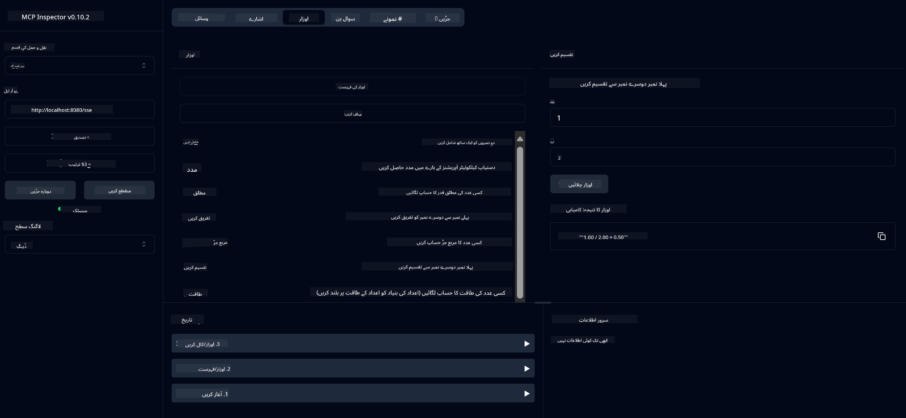

<!--
CO_OP_TRANSLATOR_METADATA:
{
  "original_hash": "13231e9951b68efd9df8c56bd5cdb27e",
  "translation_date": "2025-05-17T13:05:56+00:00",
  "source_file": "03-GettingStarted/samples/java/calculator/README.md",
  "language_code": "ur"
}
-->
# بنیادی کیلکولیٹر ایم سی پی سروس

یہ سروس ماڈل کانٹیکسٹ پروٹوکول (MCP) کے ذریعے بنیادی کیلکولیٹر کے آپریشنز فراہم کرتی ہے، جس میں اسپرنگ بوٹ کے ساتھ ویب فلوکس ٹرانسپورٹ استعمال کیا گیا ہے۔ یہ ابتدائی لوگوں کے لیے ایک سادہ مثال کے طور پر تیار کیا گیا ہے جو ایم سی پی کے نفاذ کے بارے میں سیکھ رہے ہیں۔

مزید معلومات کے لیے، [MCP سرور بوٹ سٹارٹر](https://docs.spring.io/spring-ai/reference/api/mcp/mcp-server-boot-starter-docs.html) حوالہ دستاویزات دیکھیں۔

## جائزہ

سروس پیش کرتی ہے:
- ایس ایس ای (سرور سے بھیجے گئے ایونٹس) کی حمایت
- اسپرنگ اے آئی کے `@Tool` اینوٹیشن کا استعمال کرتے ہوئے خودکار ٹول رجسٹریشن
- بنیادی کیلکولیٹر فنکشنز:
  - جمع، تفریق، ضرب، تقسیم
  - طاقت کی گنتی اور مربع جڑ
  - باقی (مودلس) اور مطلق قیمت
  - آپریشنز کی وضاحت کے لیے مدد کا فنکشن

## خصوصیات

یہ کیلکولیٹر سروس درج ذیل صلاحیتیں فراہم کرتی ہے:

1. **بنیادی ریاضیاتی آپریشنز**:
   - دو اعداد کا جمع
   - ایک عدد کو دوسرے سے تفریق
   - دو اعداد کی ضرب
   - ایک عدد کو دوسرے سے تقسیم (زیرو تقسیم کی جانچ کے ساتھ)

2. **جدید آپریشنز**:
   - طاقت کی گنتی (بیس کو ایکسپونینٹ تک بڑھانا)
   - مربع جڑ کی گنتی (منفی عدد کی جانچ کے ساتھ)
   - باقی (مودلس) کی گنتی
   - مطلق قیمت کی گنتی

3. **مدد کا نظام**:
   - دستیاب تمام آپریشنز کی وضاحت کرنے والا بلٹ ان مدد کا فنکشن

## سروس کا استعمال

سروس ایم سی پی پروٹوکول کے ذریعے درج ذیل API اینڈ پوائنٹس فراہم کرتی ہے:

- `add(a, b)`: دو اعداد کو جمع کریں
- `subtract(a, b)`: دوسرے عدد کو پہلے عدد سے تفریق کریں
- `multiply(a, b)`: دو اعداد کی ضرب کریں
- `divide(a, b)`: پہلے عدد کو دوسرے سے تقسیم کریں (زیرو چیک کے ساتھ)
- `power(base, exponent)`: ایک عدد کی طاقت کی گنتی کریں
- `squareRoot(number)`: مربع جڑ کی گنتی کریں (منفی عدد کی جانچ کے ساتھ)
- `modulus(a, b)`: تقسیم کرتے وقت باقی کی گنتی کریں
- `absolute(number)`: مطلق قیمت کی گنتی کریں
- `help()`: دستیاب آپریشنز کے بارے میں معلومات حاصل کریں

## ٹیسٹ کلائنٹ

ایک سادہ ٹیسٹ کلائنٹ `com.microsoft.mcp.sample.client` پیکج میں شامل ہے۔ `SampleCalculatorClient` کلاس کیلکولیٹر سروس کے دستیاب آپریشنز کو ظاہر کرتی ہے۔

## لانگ چین 4j کلائنٹ کا استعمال

پروجیکٹ میں `com.microsoft.mcp.sample.client.LangChain4jClient` میں لانگ چین 4j کی ایک مثال کلائنٹ شامل ہے جو یہ ظاہر کرتی ہے کہ کیلکولیٹر سروس کو لانگ چین 4j اور گیٹ ہب ماڈلز کے ساتھ کیسے مربوط کیا جائے:

### ضروریات

1. **گیٹ ہب ٹوکن سیٹ اپ**:
   
   گیٹ ہب کے اے آئی ماڈلز (جیسے phi-4) کو استعمال کرنے کے لیے، آپ کو گیٹ ہب کا پرسنل ایکسیس ٹوکن درکار ہے:

   a. اپنے گیٹ ہب اکاؤنٹ سیٹنگز پر جائیں: https://github.com/settings/tokens
   
   b. "نیا ٹوکن بنائیں" پر کلک کریں → "نیا کلاسک ٹوکن بنائیں"
   
   c. اپنے ٹوکن کو ایک وضاحتی نام دیں
   
   d. درج ذیل اسکوپز منتخب کریں:
      - `repo` (نجی ریپوزیٹریز کا مکمل کنٹرول)
      - `read:org` (تنظیم اور ٹیم کی رکنیت پڑھیں، تنظیمی پروجیکٹس پڑھیں)
      - `gist` (جسٹ بنائیں)
      - `user:email` (صارف ای میل پتوں تک رسائی (صرف پڑھنے کے لیے))
   
   e. "ٹوکن بنائیں" پر کلک کریں اور اپنے نئے ٹوکن کو کاپی کریں
   
   f. اسے ایک ماحول کے متغیر کے طور پر سیٹ کریں:
      
      ونڈوز پر:
      ```
      set GITHUB_TOKEN=your-github-token
      ```
      
      میک او ایس/لینکس پر:
      ```bash
      export GITHUB_TOKEN=your-github-token
      ```

   g. مستقل سیٹ اپ کے لیے، اپنے ماحول کے متغیرات میں اسے سسٹم سیٹنگز کے ذریعے شامل کریں

2. اپنے پروجیکٹ میں لانگ چین 4j گیٹ ہب ڈپینڈینسی شامل کریں (پہلے ہی pom.xml میں شامل ہے):
   ```xml
   <dependency>
       <groupId>dev.langchain4j</groupId>
       <artifactId>langchain4j-github</artifactId>
       <version>${langchain4j.version}</version>
   </dependency>
   ```

3. یقینی بنائیں کہ کیلکولیٹر سرور `localhost:8080` پر چل رہا ہے

### لانگ چین 4j کلائنٹ چلانا

یہ مثال ظاہر کرتی ہے:
- ایس ایس ای ٹرانسپورٹ کے ذریعے کیلکولیٹر ایم سی پی سرور سے جڑنا
- کیلکولیٹر آپریشنز کا فائدہ اٹھانے کے لیے لانگ چین 4j کا استعمال کرتے ہوئے ایک چیٹ بوٹ بنانا
- گیٹ ہب اے آئی ماڈلز کے ساتھ انضمام (اب phi-4 ماڈل استعمال کر رہا ہے)

کلائنٹ درج ذیل نمونہ سوالات بھیجتا ہے تاکہ فعالیت کو ظاہر کیا جا سکے:
1. دو اعداد کے مجموعے کی گنتی
2. ایک عدد کی مربع جڑ تلاش کرنا
3. دستیاب کیلکولیٹر آپریشنز کے بارے میں مدد کی معلومات حاصل کرنا

مثال چلائیں اور کنسول آؤٹ پٹ چیک کریں تاکہ دیکھ سکیں کہ اے آئی ماڈل کیلکولیٹر ٹولز کو سوالات کے جوابات دینے کے لیے کیسے استعمال کرتا ہے۔

### گیٹ ہب ماڈل کی تشکیل

لانگ چین 4j کلائنٹ کو گیٹ ہب کے phi-4 ماڈل کو درج ذیل سیٹنگز کے ساتھ استعمال کرنے کے لیے ترتیب دیا گیا ہے:

```java
ChatLanguageModel model = GitHubChatModel.builder()
    .apiKey(System.getenv("GITHUB_TOKEN"))
    .timeout(Duration.ofSeconds(60))
    .modelName("phi-4")
    .logRequests(true)
    .logResponses(true)
    .build();
```

مختلف گیٹ ہب ماڈلز استعمال کرنے کے لیے، `modelName` پیرامیٹر کو کسی دوسرے سپورٹڈ ماڈل میں تبدیل کریں (مثلاً "claude-3-haiku-20240307", "llama-3-70b-8192", وغیرہ)۔

## ڈپینڈینسیز

پروجیکٹ کے لیے درج ذیل کلیدی ڈپینڈینسیز درکار ہیں:

```xml
<!-- For MCP Server -->
<dependency>
    <groupId>org.springframework.ai</groupId>
    <artifactId>spring-ai-starter-mcp-server-webflux</artifactId>
</dependency>

<!-- For LangChain4j integration -->
<dependency>
    <groupId>dev.langchain4j</groupId>
    <artifactId>langchain4j-mcp</artifactId>
    <version>${langchain4j.version}</version>
</dependency>

<!-- For GitHub models support -->
<dependency>
    <groupId>dev.langchain4j</groupId>
    <artifactId>langchain4j-github</artifactId>
    <version>${langchain4j.version}</version>
</dependency>
```

## پروجیکٹ بنانا

پروجیکٹ کو Maven کا استعمال کرتے ہوئے بنائیں:
```bash
./mvnw clean install -DskipTests
```

## سرور چلانا

### جاوا کا استعمال کرتے ہوئے

```bash
java -jar target/calculator-server-0.0.1-SNAPSHOT.jar
```

### ایم سی پی انسپکٹر کا استعمال کرتے ہوئے

ایم سی پی انسپکٹر ایم سی پی سروسز کے ساتھ تعامل کرنے کے لیے ایک مددگار ٹول ہے۔ اس کیلکولیٹر سروس کے ساتھ اسے استعمال کرنے کے لیے:

1. **ایم سی پی انسپکٹر انسٹال کریں اور چلائیں** ایک نئی ٹرمینل ونڈو میں:
   ```bash
   npx @modelcontextprotocol/inspector
   ```

2. **ویب یوزر انٹرفیس تک رسائی حاصل کریں** ایپ کی طرف سے ظاہر کردہ یو آر ایل پر کلک کرکے (عام طور پر http://localhost:6274)

3. **کنکشن کی تشکیل کریں**:
   - ٹرانسپورٹ کی قسم کو "SSE" پر سیٹ کریں
   - یو آر ایل کو اپنے چلتے ہوئے سرور کے ایس ایس ای اینڈ پوائنٹ پر سیٹ کریں: `http://localhost:8080/sse`
   - "Connect" پر کلک کریں

4. **ٹولز کا استعمال کریں**:
   - دستیاب کیلکولیٹر آپریشنز دیکھنے کے لیے "List Tools" پر کلک کریں
   - ایک ٹول منتخب کریں اور ایک آپریشن چلانے کے لیے "Run Tool" پر کلک کریں



### ڈوکر کا استعمال کرتے ہوئے

پروجیکٹ میں کنٹینرائزڈ تعیناتی کے لیے ایک ڈوکر فائل شامل ہے:

1. **ڈوکر امیج بنائیں**:
   ```bash
   docker build -t calculator-mcp-service .
   ```

2. **ڈوکر کنٹینر چلائیں**:
   ```bash
   docker run -p 8080:8080 calculator-mcp-service
   ```

یہ کرے گا:
- Maven 3.9.9 اور Eclipse Temurin 24 JDK کے ساتھ ایک ملٹی سٹیج ڈوکر امیج بنائیں
- ایک بہتر کنٹینر امیج بنائیں
- سروس کو پورٹ 8080 پر ظاہر کریں
- کنٹینر کے اندر ایم سی پی کیلکولیٹر سروس شروع کریں

جب کنٹینر چل رہا ہو تو آپ سروس تک `http://localhost:8080` پر رسائی حاصل کر سکتے ہیں۔

## مسائل کا حل

### گیٹ ہب ٹوکن کے ساتھ عام مسائل

1. **ٹوکن اجازت کے مسائل**: اگر آپ کو 403 Forbidden کی خرابی ملتی ہے، تو چیک کریں کہ آپ کے ٹوکن کے پاس صحیح اجازتیں ہیں جیسا کہ ضروریات میں بیان کیا گیا ہے۔

2. **ٹوکن نہیں ملا**: اگر آپ کو "No API key found" کی خرابی ملتی ہے، تو یقینی بنائیں کہ GITHUB_TOKEN ماحول کا متغیر صحیح طریقے سے سیٹ ہے۔

3. **ریٹ لمیٹنگ**: گیٹ ہب API کی ریٹ لمٹس ہوتی ہیں۔ اگر آپ کو ریٹ لمٹ کی خرابی (اسٹیٹس کوڈ 429) ملتی ہے، تو دوبارہ کوشش کرنے سے پہلے چند منٹ انتظار کریں۔

4. **ٹوکن کی میعاد ختم ہونا**: گیٹ ہب ٹوکن ختم ہو سکتے ہیں۔ اگر آپ کو کچھ وقت کے بعد توثیق کی خرابی ملتی ہے، تو نیا ٹوکن بنائیں اور اپنے ماحول کے متغیر کو اپ ڈیٹ کریں۔

اگر آپ کو مزید مدد کی ضرورت ہو، تو [LangChain4j دستاویزات](https://github.com/langchain4j/langchain4j) یا [گیٹ ہب API دستاویزات](https://docs.github.com/en/rest) چیک کریں۔

**ڈس کلیمر**:  
یہ دستاویز AI ترجمہ سروس [Co-op Translator](https://github.com/Azure/co-op-translator) کا استعمال کرتے ہوئے ترجمہ کی گئی ہے۔ ہم درستگی کے لیے کوشاں ہیں، لیکن براہ کرم آگاہ رہیں کہ خودکار ترجمے میں غلطیاں یا خامیاں ہو سکتی ہیں۔ اصل دستاویز کو اس کی اصل زبان میں معتبر ذریعہ سمجھا جانا چاہیے۔ اہم معلومات کے لیے، پیشہ ور انسانی ترجمہ کی سفارش کی جاتی ہے۔ ہم اس ترجمے کے استعمال سے پیدا ہونے والی کسی بھی غلط فہمی یا غلط تشریح کے ذمہ دار نہیں ہیں۔