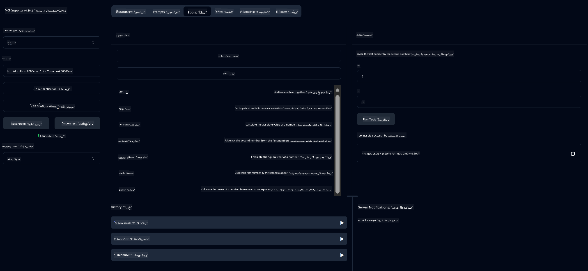

<!--
CO_OP_TRANSLATOR_METADATA:
{
  "original_hash": "13231e9951b68efd9df8c56bd5cdb27e",
  "translation_date": "2025-07-13T22:21:58+00:00",
  "source_file": "03-GettingStarted/samples/java/calculator/README.md",
  "language_code": "ur"
}
-->
# Basic Calculator MCP Service

یہ سروس Model Context Protocol (MCP) کے ذریعے بنیادی کیلکولیٹر آپریشنز فراہم کرتی ہے، جو Spring Boot کے WebFlux ٹرانسپورٹ کے ساتھ کام کرتی ہے۔ یہ نئے سیکھنے والوں کے لیے MCP کی امپلیمنٹیشنز کا ایک آسان مثال کے طور پر ڈیزائن کی گئی ہے۔

مزید معلومات کے لیے، [MCP Server Boot Starter](https://docs.spring.io/spring-ai/reference/api/mcp/mcp-server-boot-starter-docs.html) کی ریفرنس ڈاکیومنٹیشن دیکھیں۔

## جائزہ

یہ سروس درج ذیل خصوصیات پیش کرتی ہے:
- SSE (Server-Sent Events) کی سپورٹ
- Spring AI کے `@Tool` اینوٹیشن کے ذریعے خودکار ٹول رجسٹریشن
- بنیادی کیلکولیٹر فنکشنز:
  - جمع، تفریق، ضرب، تقسیم
  - طاقت کا حساب اور مربع جذر
  - ماڈیولس (باقی) اور مطلق قیمت
  - آپریشنز کی وضاحت کے لیے ہیلپ فنکشن

## خصوصیات

یہ کیلکولیٹر سروس درج ذیل صلاحیتیں فراہم کرتی ہے:

1. **بنیادی حسابی عملیات**:
   - دو نمبروں کا جمع کرنا
   - ایک نمبر سے دوسرے نمبر کو منفی کرنا
   - دو نمبروں کا ضرب دینا
   - ایک نمبر کو دوسرے نمبر سے تقسیم کرنا (زیرو سے تقسیم کی جانچ کے ساتھ)

2. **ترقی یافتہ عملیات**:
   - طاقت کا حساب (بیس کو ایکسپونینٹ پر اٹھانا)
   - مربع جذر کا حساب (منفی نمبر کی جانچ کے ساتھ)
   - ماڈیولس (باقی) کا حساب
   - مطلق قیمت کا حساب

3. **ہیلپ سسٹم**:
   - بلٹ ان ہیلپ فنکشن جو تمام دستیاب آپریشنز کی وضاحت کرتا ہے

## سروس کا استعمال

یہ سروس MCP پروٹوکول کے ذریعے درج ذیل API اینڈپوائنٹس فراہم کرتی ہے:

- `add(a, b)`: دو نمبروں کو جمع کریں
- `subtract(a, b)`: دوسرے نمبر کو پہلے نمبر سے منفی کریں
- `multiply(a, b)`: دو نمبروں کا ضرب دیں
- `divide(a, b)`: پہلے نمبر کو دوسرے نمبر سے تقسیم کریں (زیرو کی جانچ کے ساتھ)
- `power(base, exponent)`: نمبر کی طاقت کا حساب کریں
- `squareRoot(number)`: مربع جذر کا حساب کریں (منفی نمبر کی جانچ کے ساتھ)
- `modulus(a, b)`: تقسیم کے بعد باقی کا حساب کریں
- `absolute(number)`: مطلق قیمت کا حساب کریں
- `help()`: دستیاب آپریشنز کی معلومات حاصل کریں

## ٹیسٹ کلائنٹ

ایک سادہ ٹیسٹ کلائنٹ `com.microsoft.mcp.sample.client` پیکیج میں شامل ہے۔ `SampleCalculatorClient` کلاس کیلکولیٹر سروس کے دستیاب آپریشنز کی مثال پیش کرتی ہے۔

## LangChain4j کلائنٹ کا استعمال

پروجیکٹ میں `com.microsoft.mcp.sample.client.LangChain4jClient` میں LangChain4j کی مثال کلائنٹ شامل ہے جو دکھاتی ہے کہ کیلکولیٹر سروس کو LangChain4j اور GitHub ماڈلز کے ساتھ کیسے انٹیگریٹ کیا جائے:

### ضروریات

1. **GitHub ٹوکن سیٹ اپ**:

   GitHub کے AI ماڈلز (جیسے phi-4) استعمال کرنے کے لیے آپ کو GitHub پرسنل ایکسس ٹوکن کی ضرورت ہے:

   a. اپنے GitHub اکاؤنٹ کی سیٹنگز پر جائیں: https://github.com/settings/tokens

   b. "Generate new token" → "Generate new token (classic)" پر کلک کریں

   c. اپنے ٹوکن کو ایک وضاحتی نام دیں

   d. درج ذیل اسکوپس منتخب کریں:
      - `repo` (پرائیویٹ ریپوزٹریز کا مکمل کنٹرول)
      - `read:org` (آرگنائزیشن اور ٹیم ممبرشپ پڑھنا، آرگ پروجیکٹس پڑھنا)
      - `gist` (گسٹ بنانے کی اجازت)
      - `user:email` (یوزر ای میل ایڈریسز تک رسائی (صرف پڑھنے کے لیے))

   e. "Generate token" پر کلک کریں اور نیا ٹوکن کاپی کریں

   f. اسے ایک انوائرمنٹ ویریبل کے طور پر سیٹ کریں:

      ونڈوز پر:
      ```
      set GITHUB_TOKEN=your-github-token
      ```

      میک او ایس/لینکس پر:
      ```bash
      export GITHUB_TOKEN=your-github-token
      ```

   g. مستقل سیٹ اپ کے لیے، اسے سسٹم سیٹنگز کے ذریعے اپنے انوائرمنٹ ویریبلز میں شامل کریں

2. LangChain4j GitHub ڈیپینڈنسی اپنے پروجیکٹ میں شامل کریں (pom.xml میں پہلے سے شامل ہے):
   ```xml
   <dependency>
       <groupId>dev.langchain4j</groupId>
       <artifactId>langchain4j-github</artifactId>
       <version>${langchain4j.version}</version>
   </dependency>
   ```

3. یقینی بنائیں کہ کیلکولیٹر سرور `localhost:8080` پر چل رہا ہے

### LangChain4j کلائنٹ چلانا

یہ مثال دکھاتی ہے:
- SSE ٹرانسپورٹ کے ذریعے کیلکولیٹر MCP سرور سے کنکشن
- LangChain4j کا استعمال کرتے ہوئے ایک چیٹ بوٹ بنانا جو کیلکولیٹر آپریشنز کو استعمال کرتا ہے
- GitHub AI ماڈلز کے ساتھ انٹیگریشن (اب phi-4 ماڈل استعمال کر رہا ہے)

کلائنٹ درج ذیل نمونہ سوالات بھیجتا ہے تاکہ فنکشنلٹی دکھائی جا سکے:
1. دو نمبروں کا مجموعہ نکالنا
2. ایک نمبر کا مربع جذر معلوم کرنا
3. دستیاب کیلکولیٹر آپریشنز کے بارے میں ہیلپ معلومات حاصل کرنا

مثال چلائیں اور کنسول آؤٹ پٹ چیک کریں کہ AI ماڈل کس طرح کیلکولیٹر ٹولز کو استعمال کر کے سوالات کے جواب دیتا ہے۔

### GitHub ماڈل کنفیگریشن

LangChain4j کلائنٹ GitHub کے phi-4 ماڈل کے ساتھ درج ذیل سیٹنگز کے تحت کنفیگر کیا گیا ہے:

```java
ChatLanguageModel model = GitHubChatModel.builder()
    .apiKey(System.getenv("GITHUB_TOKEN"))
    .timeout(Duration.ofSeconds(60))
    .modelName("phi-4")
    .logRequests(true)
    .logResponses(true)
    .build();
```

مختلف GitHub ماڈلز استعمال کرنے کے لیے، `modelName` پیرامیٹر کو کسی دوسرے سپورٹڈ ماڈل (مثلاً "claude-3-haiku-20240307", "llama-3-70b-8192" وغیرہ) میں تبدیل کریں۔

## انحصارات

پروجیکٹ کو درج ذیل اہم انحصارات کی ضرورت ہے:

```xml
<!-- For MCP Server -->
<dependency>
    <groupId>org.springframework.ai</groupId>
    <artifactId>spring-ai-starter-mcp-server-webflux</artifactId>
</dependency>

<!-- For LangChain4j integration -->
<dependency>
    <groupId>dev.langchain4j</groupId>
    <artifactId>langchain4j-mcp</artifactId>
    <version>${langchain4j.version}</version>
</dependency>

<!-- For GitHub models support -->
<dependency>
    <groupId>dev.langchain4j</groupId>
    <artifactId>langchain4j-github</artifactId>
    <version>${langchain4j.version}</version>
</dependency>
```

## پروجیکٹ بنانا

Maven کا استعمال کرتے ہوئے پروجیکٹ بنائیں:
```bash
./mvnw clean install -DskipTests
```

## سرور چلانا

### جاوا کا استعمال

```bash
java -jar target/calculator-server-0.0.1-SNAPSHOT.jar
```

### MCP Inspector کا استعمال

MCP Inspector ایک مفید ٹول ہے جو MCP سروسز کے ساتھ انٹریکٹ کرنے کے لیے استعمال ہوتا ہے۔ اس کیلکولیٹر سروس کے ساتھ اسے استعمال کرنے کے لیے:

1. **MCP Inspector انسٹال اور چلائیں** ایک نئے ٹرمینل ونڈو میں:
   ```bash
   npx @modelcontextprotocol/inspector
   ```

2. **ویب UI تک رسائی حاصل کریں** ایپ کی طرف سے دکھائی گئی URL پر کلک کر کے (عام طور پر http://localhost:6274)

3. **کنکشن کنفیگر کریں**:
   - ٹرانسپورٹ ٹائپ "SSE" سیٹ کریں
   - URL کو اپنے چلتے ہوئے سرور کے SSE اینڈپوائنٹ پر سیٹ کریں: `http://localhost:8080/sse`
   - "Connect" پر کلک کریں

4. **ٹولز استعمال کریں**:
   - "List Tools" پر کلک کر کے دستیاب کیلکولیٹر آپریشنز دیکھیں
   - کسی ٹول کو منتخب کریں اور "Run Tool" پر کلک کر کے آپریشن چلائیں



### Docker کا استعمال

پروجیکٹ میں کنٹینرائزڈ ڈپلائمنٹ کے لیے Dockerfile شامل ہے:

1. **Docker امیج بنائیں**:
   ```bash
   docker build -t calculator-mcp-service .
   ```

2. **Docker کنٹینر چلائیں**:
   ```bash
   docker run -p 8080:8080 calculator-mcp-service
   ```

یہ کرے گا:
- Maven 3.9.9 اور Eclipse Temurin 24 JDK کے ساتھ ملٹی اسٹیج Docker امیج بنائے گا
- ایک بہتر کنٹینر امیج تیار کرے گا
- سروس کو پورٹ 8080 پر ایکسپوز کرے گا
- کنٹینر کے اندر MCP کیلکولیٹر سروس شروع کرے گا

جب کنٹینر چل رہا ہو تو آپ سروس کو `http://localhost:8080` پر ایکسیس کر سکتے ہیں۔

## مسائل کا حل

### GitHub ٹوکن کے عام مسائل

1. **ٹوکن کی اجازتوں کے مسائل**: اگر آپ کو 403 Forbidden ایرر ملے تو چیک کریں کہ آپ کے ٹوکن میں ضروری اجازتیں موجود ہیں جیسا کہ ضروریات میں بتایا گیا ہے۔

2. **ٹوکن نہ ملنے کا مسئلہ**: اگر "No API key found" ایرر آئے تو یقینی بنائیں کہ GITHUB_TOKEN انوائرمنٹ ویریبل صحیح طریقے سے سیٹ ہے۔

3. **ریٹ لمیٹنگ**: GitHub API پر ریٹ لمٹس ہوتے ہیں۔ اگر آپ کو ریٹ لمٹ ایرر (status code 429) ملے تو چند منٹ انتظار کریں اور دوبارہ کوشش کریں۔

4. **ٹوکن کی میعاد ختم ہونا**: GitHub ٹوکن کی میعاد ختم ہو سکتی ہے۔ اگر کچھ وقت بعد آتھنٹیکیشن ایرر آئے تو نیا ٹوکن جنریٹ کریں اور انوائرمنٹ ویریبل اپڈیٹ کریں۔

اگر مزید مدد کی ضرورت ہو تو [LangChain4j documentation](https://github.com/langchain4j/langchain4j) یا [GitHub API documentation](https://docs.github.com/en/rest) دیکھیں۔

**دستخطی نوٹ**:  
یہ دستاویز AI ترجمہ سروس [Co-op Translator](https://github.com/Azure/co-op-translator) کے ذریعے ترجمہ کی گئی ہے۔ اگرچہ ہم درستگی کے لیے کوشاں ہیں، براہ کرم آگاہ رہیں کہ خودکار ترجمے میں غلطیاں یا عدم درستیاں ہو سکتی ہیں۔ اصل دستاویز اپنی مادری زبان میں ہی معتبر ماخذ سمجھی جانی چاہیے۔ اہم معلومات کے لیے پیشہ ور انسانی ترجمہ کی سفارش کی جاتی ہے۔ اس ترجمے کے استعمال سے پیدا ہونے والی کسی بھی غلط فہمی یا غلط تشریح کی ذمہ داری ہم پر عائد نہیں ہوتی۔