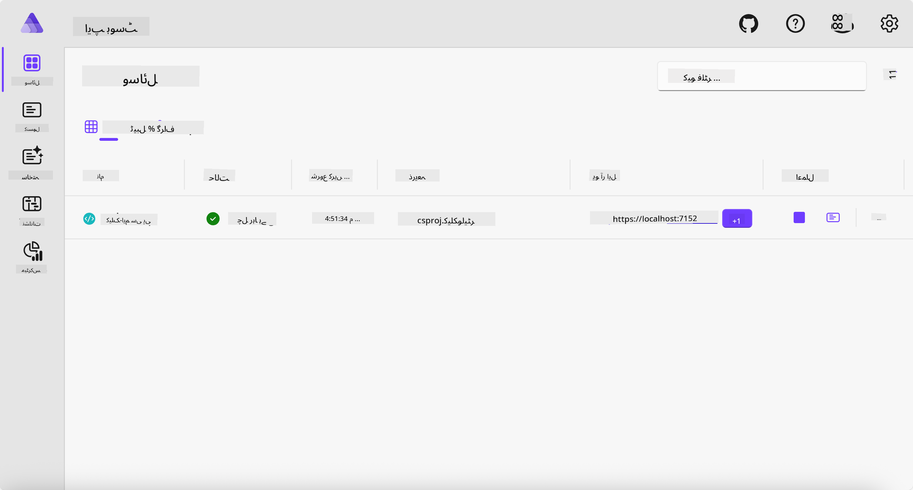
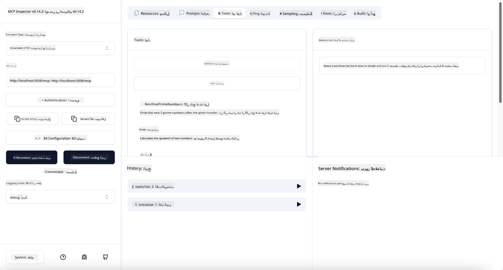

<!--
CO_OP_TRANSLATOR_METADATA:
{
  "original_hash": "0bc7bd48f55f1565f1d95ccb2c16f728",
  "translation_date": "2025-07-13T23:04:05+00:00",
  "source_file": "04-PracticalImplementation/samples/csharp/README.md",
  "language_code": "ur"
}
-->
# نمونہ

پچھلا مثال دکھاتا ہے کہ لوکل .NET پروجیکٹ کو `stdio` قسم کے ساتھ کیسے استعمال کیا جائے۔ اور سرور کو لوکل کنٹینر میں کیسے چلایا جائے۔ یہ کئی حالات میں ایک اچھا حل ہے۔ تاہم، سرور کو ریموٹلی چلانا بھی مفید ہو سکتا ہے، جیسے کلاؤڈ ماحول میں۔ یہی وہ جگہ ہے جہاں `http` قسم کام آتی ہے۔

`04-PracticalImplementation` فولڈر میں حل کو دیکھیں تو یہ پچھلے سے کہیں زیادہ پیچیدہ لگ سکتا ہے۔ لیکن حقیقت میں ایسا نہیں ہے۔ اگر آپ پروجیکٹ `src/Calculator` کو غور سے دیکھیں تو آپ دیکھیں گے کہ یہ زیادہ تر پچھلے مثال جیسا ہی کوڈ ہے۔ واحد فرق یہ ہے کہ ہم HTTP درخواستوں کو ہینڈل کرنے کے لیے مختلف لائبریری `ModelContextProtocol.AspNetCore` استعمال کر رہے ہیں۔ اور ہم طریقہ `IsPrime` کو پرائیویٹ بنا دیتے ہیں، صرف یہ دکھانے کے لیے کہ آپ اپنے کوڈ میں پرائیویٹ طریقے رکھ سکتے ہیں۔ باقی کوڈ پہلے جیسا ہی ہے۔

دیگر پروجیکٹس [.NET Aspire](https://learn.microsoft.com/dotnet/aspire/get-started/aspire-overview) سے ہیں۔ حل میں .NET Aspire شامل کرنے سے ڈویلپر کے لیے ترقی اور ٹیسٹنگ کا تجربہ بہتر ہوتا ہے اور مشاہدے میں مدد ملتی ہے۔ سرور چلانے کے لیے یہ ضروری نہیں، لیکن اسے اپنے حل میں رکھنا اچھی مشق ہے۔

## سرور کو لوکل چلائیں

1. VS Code (C# DevKit ایکسٹینشن کے ساتھ) سے `04-PracticalImplementation/samples/csharp` ڈائریکٹری میں جائیں۔
1. سرور شروع کرنے کے لیے درج ذیل کمانڈ چلائیں:

   ```bash
    dotnet watch run --project ./src/AppHost
   ```

1. جب ویب براؤزر میں .NET Aspire ڈیش بورڈ کھلے، تو `http` URL نوٹ کریں۔ یہ کچھ اس طرح ہونا چاہیے: `http://localhost:5058/`۔

   

## MCP Inspector کے ساتھ Streamable HTTP کی جانچ کریں

اگر آپ کے پاس Node.js 22.7.5 یا اس سے اوپر ہے، تو آپ MCP Inspector استعمال کر کے اپنے سرور کی جانچ کر سکتے ہیں۔

سرور شروع کریں اور ٹرمینل میں درج ذیل کمانڈ چلائیں:

```bash
npx @modelcontextprotocol/inspector http://localhost:5058
```



- Transport قسم کے طور پر `Streamable HTTP` منتخب کریں۔
- Url فیلڈ میں پہلے نوٹ کیا گیا سرور کا URL درج کریں، اور اس کے آخر میں `/mcp` شامل کریں۔ یہ `http` ہونا چاہیے (https نہیں)، کچھ اس طرح: `http://localhost:5058/mcp`۔
- Connect بٹن منتخب کریں۔

Inspector کی ایک اچھی بات یہ ہے کہ یہ آپ کو جو کچھ ہو رہا ہے اس کی اچھی نظر دیتا ہے۔

- دستیاب ٹولز کی فہرست بنانے کی کوشش کریں
- ان میں سے کچھ آزمائیں، یہ پہلے کی طرح کام کریں گے۔

## VS Code میں GitHub Copilot Chat کے ساتھ MCP سرور کی جانچ کریں

GitHub Copilot Chat کے ساتھ Streamable HTTP ٹرانسپورٹ استعمال کرنے کے لیے، پہلے بنائے گئے `calc-mcp` سرور کی کنفیگریشن کو اس طرح تبدیل کریں:

```jsonc
// .vscode/mcp.json
{
  "servers": {
    "calc-mcp": {
      "type": "http",
      "url": "http://localhost:5058/mcp"
    }
  }
}
```

کچھ ٹیسٹ کریں:

- پوچھیں "6780 کے بعد 3 پرائم نمبرز"۔ دیکھیں کہ Copilot نئے ٹولز `NextFivePrimeNumbers` استعمال کرے گا اور صرف پہلے 3 پرائم نمبرز واپس کرے گا۔
- پوچھیں "111 کے بعد 7 پرائم نمبرز"، دیکھیں کیا ہوتا ہے۔
- پوچھیں "جان کے پاس 24 لولی ہیں اور وہ انہیں اپنے 3 بچوں میں تقسیم کرنا چاہتا ہے۔ ہر بچے کے پاس کتنی لولی ہیں؟"، دیکھیں کیا ہوتا ہے۔

## سرور کو Azure پر تعینات کریں

آئیے سرور کو Azure پر تعینات کرتے ہیں تاکہ زیادہ لوگ اسے استعمال کر سکیں۔

ٹرمینل سے `04-PracticalImplementation/samples/csharp` فولڈر میں جائیں اور درج ذیل کمانڈ چلائیں:

```bash
azd up
```

تعیناتی مکمل ہونے کے بعد، آپ کو اس طرح کا پیغام نظر آئے گا:


URL حاصل کریں اور اسے MCP Inspector اور GitHub Copilot Chat میں استعمال کریں۔

```jsonc
// .vscode/mcp.json
{
  "servers": {
    "calc-mcp": {
      "type": "http",
      "url": "https://calc-mcp.gentleriver-3977fbcf.australiaeast.azurecontainerapps.io/mcp"
    }
  }
}
```

## آگے کیا ہے؟

ہم نے مختلف ٹرانسپورٹ اقسام اور ٹیسٹنگ ٹولز آزمائے۔ ہم نے آپ کے MCP سرور کو Azure پر بھی تعینات کیا۔ لیکن اگر ہمارے سرور کو پرائیویٹ وسائل تک رسائی کی ضرورت ہو؟ مثلاً، کوئی ڈیٹا بیس یا پرائیویٹ API؟ اگلے باب میں، ہم دیکھیں گے کہ ہم اپنے سرور کی سیکیورٹی کو کیسے بہتر بنا سکتے ہیں۔

**دستخطی دستبرداری**:  
یہ دستاویز AI ترجمہ سروس [Co-op Translator](https://github.com/Azure/co-op-translator) کے ذریعے ترجمہ کی گئی ہے۔ اگرچہ ہم درستگی کے لیے کوشاں ہیں، براہ کرم آگاہ رہیں کہ خودکار ترجمے میں غلطیاں یا عدم درستیاں ہو سکتی ہیں۔ اصل دستاویز اپنی مادری زبان میں ہی معتبر ماخذ سمجھی جانی چاہیے۔ اہم معلومات کے لیے پیشہ ور انسانی ترجمہ کی سفارش کی جاتی ہے۔ اس ترجمے کے استعمال سے پیدا ہونے والی کسی بھی غلط فہمی یا غلط تشریح کی ذمہ داری ہم پر عائد نہیں ہوتی۔